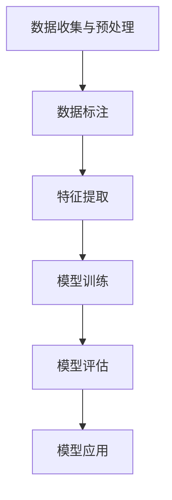
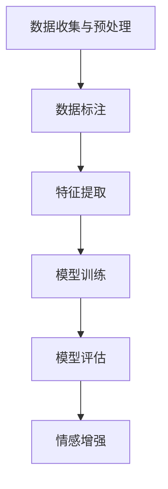
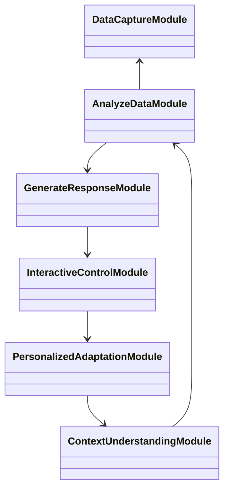
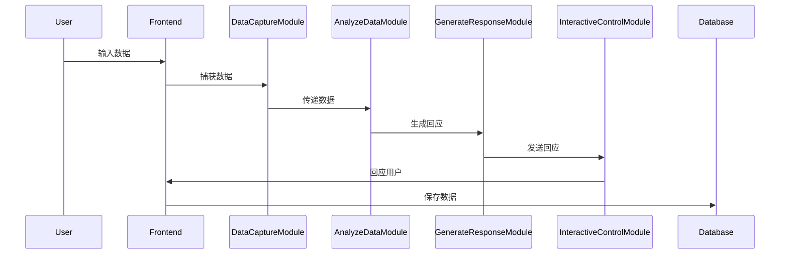

                 

### 第1章: 问题背景

#### 1.1.1 问题背景

在过去的几十年里，人工智能（AI）技术取得了显著的进展，尤其在自然语言处理（NLP）领域，AI的应用已经渗透到了我们生活的方方面面。然而，尽管AI在语言理解和生成任务上取得了显著成就，其在情感表达方面的能力仍然存在一定的局限性。传统的人工智能模型虽然在某些特定的情感表达任务上表现出色，但在处理复杂情感、微表情、情感融合等方面仍然存在不足。

情感表达是一个复杂的认知过程，它不仅涉及到语言文字的表达，还包括面部表情、身体姿态、声音语调等多方面的非语言信号。这些信号共同构成了人类沟通中的重要部分，使得沟通更加丰富和生动。然而，当前AI在理解和生成情感表达方面存在以下几个主要问题：

1. **情感理解深度不足**：AI在情感理解方面仍然存在局限性，难以深入理解复杂的情感状态。例如，当人们表达“快乐”时，可能是由于不同的原因，AI可能难以区分出这些情感的细微差别。

2. **情感生成准确性不高**：虽然AI可以在一定程度上生成情感表达，但生成的情感表达往往不够自然，缺乏情感的真实感和连贯性。

3. **情感交互场景模拟不足**：在虚拟交互中，AI的情感表达往往难以与人类情感交互相匹配，缺乏真实性和沉浸感。

为了解决这些问题，我们需要从以下几个方面进行思考和探索：

1. **数据丰富性和多样性**：提供更丰富和多样化的情感数据集，以便AI能够更好地学习和理解复杂的情感状态。

2. **算法优化**：通过改进算法，提高AI在情感识别和生成方面的准确性，使其生成的情感表达更加自然。

3. **情感交互能力的提升**：通过模拟复杂的情感交互场景，提升AI在虚拟环境中的情感交互能力，使其能够更好地模拟人类的情感表达。

#### 1.1.2 问题描述

AI在情感表达方面存在的问题主要包括：

- **情感理解不足**：AI难以理解复杂的情感状态，特别是在处理情感细微差别时表现较差。

- **情感生成不自然**：AI生成的情感表达往往缺乏自然感，情感连贯性和真实性不足。

- **情感交互不真实**：在虚拟交互中，AI的情感表达难以与人类情感交互相匹配，缺乏真实性和沉浸感。

这些问题的存在，使得AI在情感表达方面的应用受到了限制，无法完全满足用户在情感交流方面的需求。因此，研究和解决这些问题具有重要意义。

#### 1.1.3 问题解决

为了解决上述问题，我们可以从以下几个方面进行探讨：

1. **数据增强**：通过收集和整合更多的情感数据，包括不同情感类型、情感强度和情感变化等，提高AI的情感理解能力。

2. **算法改进**：研究更加先进的情感识别和生成算法，提高AI在情感表达方面的准确性和自然性。

3. **情感建模**：通过构建情感模型，模拟复杂的情感交互场景，提高AI的情感交互能力。

4. **跨学科融合**：结合心理学、社会学等领域的知识，深入理解情感表达的内涵和外延，为AI的情感表达提供理论基础。

通过这些方法，我们可以逐步提升AI在情感表达方面的能力，使其更好地服务于人类社会的需求。

#### 1.1.4 边界与外延

在探讨AI情感表达问题时，我们需要明确其边界与外延：

1. **情感类型**：情感表达涉及到多种情感类型，如快乐、悲伤、愤怒、恐惧等。每种情感类型都有其独特的表达方式和特征。

2. **情感强度**：情感表达的强度也是影响其表达效果的重要因素。情感强度的不同会导致表达方式的差异。

3. **情感变化**：情感表达是动态变化的，随着情境和情绪的变化，情感表达也会发生变化。

4. **跨文化差异**：不同文化背景下，人们对情感的表达方式和理解可能存在差异，这需要我们在研究和应用中加以考虑。

5. **情感融合**：在复杂情境中，情感可能会融合成新的情感类型，这增加了情感表达的复杂性。

通过明确这些边界与外延，我们可以更好地理解和研究AI在情感表达方面的能力，为其应用提供更加科学和有效的指导。

### 第2章: 核心概念

#### 2.1.1 情感表达的定义

情感表达是指个体在情感状态下通过言语、表情、姿态等方式向外界传达情感信息的过程。它包括语言文字的表达和非语言信号的表达，如面部表情、身体姿态、声音语调等。情感表达是人与人之间沟通的重要方式，通过情感表达，人们可以传达自己的情感状态、需求和意愿。

在人工智能（AI）领域，情感表达的研究主要集中在如何让AI理解和生成情感表达。这涉及到对情感表达的定义、类型、特点以及情感表达与认知、情绪、文化背景之间的联系等方面的深入研究。

#### 2.1.2 情感表达的特点

情感表达具有以下特点：

1. **复杂性**：情感表达是一个复杂的过程，涉及多种情感类型、情感强度和情感变化。每种情感类型都有其独特的表达方式和特征，如快乐通常伴随着微笑，而悲伤则可能表现为皱眉。

2. **动态性**：情感表达是动态变化的，随着情境和情绪的变化，情感表达也会发生变化。例如，在紧张的会议中，一个人可能会从快乐的表情转变为焦虑的表情。

3. **跨文化性**：不同文化背景下，人们对情感的表达方式和理解可能存在差异。例如，西方文化中，表达愤怒时可能更倾向于直接表达，而东方文化中，表达愤怒时可能更倾向于含蓄。

4. **非语言性**：情感表达不仅包括语言文字的表达，还包括非语言信号的表达，如面部表情、身体姿态、声音语调等。这些非语言信号在情感表达中起着重要的作用。

#### 2.1.3 情感表达的类型

情感表达可以分为以下几种类型：

1. **语言文字表达**：这是最常见的情感表达方式，通过言语和文字来表达情感状态。例如，一个人可能会说“我很快乐”或“我很伤心”。

2. **面部表情表达**：面部表情是情感表达的重要方式，通过面部肌肉的运动来传达情感状态。例如，微笑通常表示快乐，皱眉则表示悲伤。

3. **身体姿态表达**：身体姿态，如站立姿势、手势等，也可以传达情感状态。例如，站得笔直、双手叉腰通常表示自信和愤怒。

4. **声音语调表达**：声音语调的变化，如语速、音调、音量等，也是情感表达的一部分。例如，快速、高音调的声音通常表示兴奋或愤怒，而缓慢、低音调的声音则可能表示悲伤或平静。

#### 2.1.4 情感表达与认知、情绪、文化背景的联系

情感表达与认知、情绪、文化背景之间存在紧密的联系：

1. **认知联系**：认知过程在情感表达中起着重要的作用。个体需要通过认知过程理解自己的情感状态，并将其转化为可以传达的形式。例如，一个人在经历快乐时，需要通过认知过程理解自己的情感状态，并选择适当的语言和表情来表达。

2. **情绪联系**：情感表达是情绪的外在表现。个体的情绪状态会影响其情感表达的方式和内容。例如，当一个人感到愤怒时，其情感表达可能更直接、激烈。

3. **文化背景联系**：文化背景会影响情感表达的方式和内容。不同文化背景下，人们对情感的表达方式和理解可能存在差异。例如，在一些文化中，表达情感可能被视为不礼貌或过于情绪化，而在其他文化中，表达情感则被视为自然和必要的。

### 2.1.5 情感表达在AI中的应用

在人工智能领域，情感表达的研究主要集中在如何让AI理解和生成情感表达。这涉及到以下几个方面：

1. **情感识别**：通过分析文本、语音、面部表情等数据，识别出个体的情感状态。这需要使用自然语言处理、计算机视觉等技术。

2. **情感生成**：根据给定的情感状态，生成合适的情感表达。这需要使用机器学习、深度学习等技术来生成自然的语言和表情。

3. **情感交互**：通过模拟复杂的情感交互场景，让AI能够与人类进行有效的情感交流。这需要结合虚拟现实、增强现实等技术。

通过这些研究，我们可以逐步提升AI在情感表达方面的能力，使其更好地服务于人类社会的需求。

#### 2.1.6 情感表达的边界与外延

在讨论情感表达时，我们需要明确其边界与外延：

1. **边界**：情感表达的边界包括情感类型、情感强度、情感变化等。每种情感类型都有其独特的表达方式和特征，情感强度和变化也会影响情感表达的效果。

2. **外延**：情感表达的外延涉及跨文化、跨语言的情感表达差异，以及不同情境下的情感表达特点。不同文化背景下，人们对情感的表达方式和理解可能存在差异，而不同情境下，情感表达的方式和内容也可能有所不同。

通过明确情感表达的边界与外延，我们可以更好地理解和研究情感表达，为AI的情感表达研究提供更科学的指导。

### 第3章: 情感表达的联系

#### 3.1.1 情感表达与认知的联系

情感表达与认知之间存在着紧密的联系。认知是指个体获取、处理和应用信息的过程，而情感表达则是认知过程中情感状态的外在表现。在情感表达中，个体的情感状态会通过言语、表情、姿态等多种方式传递给他人。这一过程不仅需要个体理解自己的情感状态，还需要通过认知过程选择合适的方式和内容来表达情感。

首先，情感表达与认知的联系体现在情感理解的深度上。个体需要通过认知过程来理解自己的情感状态，并将其转化为可以传达的形式。例如，当一个人经历快乐时，他需要通过认知过程理解自己的情感状态，并选择合适的语言和表情来表达。这种认知过程不仅涉及到情感类型的识别，还包括情感强度和情感变化的细微差别。

其次，情感表达与认知的联系还体现在情感反馈上。在社交互动中，个体通过观察他人的情感表达来调整自己的行为和情感状态。这种情感反馈机制有助于建立和维护社交关系。例如，当一个人看到另一个人微笑时，他可能会通过认知过程理解对方快乐的情感状态，并相应地调整自己的行为，如回应一个微笑。

此外，情感表达与认知的联系还涉及到情感调节。情感调节是指个体通过认知过程来管理和调整自己的情感状态。在情感表达中，个体需要通过认知过程来理解自己的情感状态，并选择合适的方式和内容来表达情感。这种认知过程有助于个体更好地管理和调节自己的情感，以适应不同的社交情境。

总的来说，情感表达与认知之间的联系体现在情感理解的深度、情感反馈和情感调节等多个方面。通过深入理解情感表达与认知的联系，我们可以更好地理解个体的情感状态，并提高情感表达的效果和准确性。

#### 3.1.2 情感表达与情绪的联系

情感表达与情绪之间存在着密切的联系。情绪是指个体在特定情境下产生的情感体验，而情感表达则是情绪的外在表现。在情感表达中，个体通过言语、表情、姿态等多种方式将情绪传达给他人。

首先，情感表达与情绪的联系体现在情绪的类型上。情绪可以分为基本情绪和复杂情绪。基本情绪包括快乐、悲伤、愤怒、恐惧等，它们是情感表达的基础。复杂情绪则是由基本情绪混合和变化而成的，如焦虑、厌恶、惊喜等。情感表达的不同类型反映了个体情绪的不同状态。

其次，情感表达与情绪的联系还体现在情绪的强度上。情绪的强度会影响情感表达的方式和内容。例如，当一个人感到非常愤怒时，其情感表达可能会更直接、激烈，可能包括大声说话、面部表情愤怒等。而当一个人感到轻微的愤怒时，其情感表达可能会更加含蓄，如皱眉、语调稍高。

此外，情感表达与情绪的联系还涉及到情绪的调节。情绪调节是指个体通过认知和行为策略来管理和调整自己的情绪状态。在情感表达中，个体需要通过认知过程来理解自己的情绪状态，并选择合适的方式和内容来表达情感。这种认知过程有助于个体更好地管理和调节自己的情绪，以适应不同的社交情境。

总的来说，情感表达与情绪之间的联系体现在情绪的类型、强度和调节等多个方面。通过深入理解情感表达与情绪的联系，我们可以更好地理解和表达自己的情绪，提高人际沟通的效果。

#### 3.1.3 情感表达与文化背景的联系

情感表达与文化背景之间存在紧密的联系。文化背景是指个体所处的文化环境，包括语言、习俗、价值观等。不同文化背景下，人们对情感的表达方式和理解可能存在差异。

首先，情感表达与文化背景的联系体现在语言上。语言是情感表达的重要工具，不同文化背景的语言体系对情感表达的方式和内容有着深刻的影响。例如，在一些文化中，表达情感可能被视为不礼貌或过于情绪化，而在其他文化中，表达情感则被视为自然和必要的。这种差异在跨文化交流中尤其显著。

其次，情感表达与文化背景的联系还体现在习俗和价值观上。不同文化背景下，人们对情感表达的理解和接受程度可能存在差异。例如，在一些文化中，人们可能更倾向于直接表达情感，如快乐、愤怒等，而在其他文化中，人们可能更倾向于含蓄地表达情感，避免直接冲突。

此外，文化背景还影响情感表达的情境。不同文化背景下，人们对情感表达的情境可能有不同的期望。例如，在一些文化中，公共场合表达情感可能被视为不恰当，而在其他文化中，公共场合表达情感则被视为自然和必要的。

总的来说，情感表达与文化背景之间的联系体现在语言、习俗、价值观和情境等多个方面。通过深入理解情感表达与文化背景的联系，我们可以更好地理解和适应不同文化背景下的情感表达，提高跨文化交流的效果。

### 第4章: 算法原理讲解

#### 4.1.1 情感识别算法

情感识别算法是AI情感表达研究中的一个重要方向，它旨在通过分析文本、语音、面部表情等数据，识别出个体的情感状态。在这一部分，我们将介绍情感识别算法的原理、流程、Python代码实现以及数学模型。

#### 4.1.1.1 算法原理

情感识别算法的基本原理是利用机器学习或深度学习技术，从大量标注好的情感数据中学习情感模式，然后对新数据进行分析，预测其情感状态。常见的机器学习算法包括支持向量机（SVM）、随机森林（Random Forest）等，而深度学习算法则包括卷积神经网络（CNN）、循环神经网络（RNN）等。

#### 4.1.1.2 算法流程图

为了更好地理解情感识别算法的流程，我们使用Mermaid绘制了以下流程图：



该流程图描述了情感识别算法的基本流程，包括数据收集与预处理、数据标注、特征提取、模型训练、模型评估和模型应用。

#### 4.1.1.3 Python代码

以下是一个简单的情感识别算法的实现示例，使用Python和scikit-learn库：

```python
from sklearn.feature_extraction.text import TfidfVectorizer
from sklearn.model_selection import train_test_split
from sklearn.svm import SVC
from sklearn.metrics import classification_report

# 数据预处理
data = [
    ("我很快乐", "happy"),
    ("我很伤心", "sad"),
    ("我很愤怒", "angry"),
    # 更多数据...
]

X, y = zip(*data)

# 特征提取
vectorizer = TfidfVectorizer()
X_vectorized = vectorizer.fit_transform(X)

# 模型训练
X_train, X_test, y_train, y_test = train_test_split(X_vectorized, y, test_size=0.2, random_state=42)
model = SVC()
model.fit(X_train, y_train)

# 模型评估
y_pred = model.predict(X_test)
print(classification_report(y_test, y_pred))
```

这段代码首先加载了情感数据，然后使用TF-IDF向量器进行特征提取，接着使用支持向量机（SVM）进行模型训练，最后对模型进行评估。

#### 4.1.1.4 数学模型

在情感识别算法中，常用的数学模型包括逻辑回归、支持向量机（SVM）等。以下是一个简单的逻辑回归模型公式：

$$
P(y=c|X) = \frac{1}{1 + e^{-(\beta_0 + \beta_1x_1 + \beta_2x_2 + ... + \beta_nx_n})}
$$

其中，$P(y=c|X)$表示在特征向量$X$下，情感标签$y$为$c$的概率，$\beta_0, \beta_1, \beta_2, ..., \beta_n$为模型的参数。

通过训练，我们可以得到一组参数$\beta_0, \beta_1, \beta_2, ..., \beta_n$，然后使用这些参数对新的数据$X$进行预测。

#### 4.1.2 情感增强算法

情感增强算法是另一种重要的情感表达研究方法，旨在通过修改文本、语音、面部表情等数据，增强情感表达的效果。在这一部分，我们将介绍情感增强算法的原理、流程、Python代码实现以及数学模型。

#### 4.1.2.1 算法原理

情感增强算法的基本原理是利用机器学习或深度学习技术，从大量情感增强数据中学习增强规则，然后对新数据进行分析，预测其情感增强后的状态。常见的机器学习算法包括决策树、随机森林等，而深度学习算法则包括卷积神经网络（CNN）、循环神经网络（RNN）等。

#### 4.1.2.2 算法流程图

为了更好地理解情感增强算法的流程，我们使用Mermaid绘制了以下流程图：



该流程图描述了情感增强算法的基本流程，包括数据收集与预处理、数据标注、特征提取、模型训练、模型评估和情感增强。

#### 4.1.2.3 Python代码

以下是一个简单的情感增强算法的实现示例，使用Python和scikit-learn库：

```python
from sklearn.tree import DecisionTreeClassifier
from sklearn.model_selection import train_test_split
from sklearn.metrics import accuracy_score

# 数据预处理
data = [
    ("我很快乐", "happy"),
    ("我很伤心", "sad"),
    ("我很愤怒", "angry"),
    # 更多数据...
]

X, y = zip(*data)

# 模型训练
X_train, X_test, y_train, y_test = train_test_split(X, y, test_size=0.2, random_state=42)
model = DecisionTreeClassifier()
model.fit(X_train, y_train)

# 情感增强
y_pred = model.predict(X_test)
print("Accuracy:", accuracy_score(y_test, y_pred))
```

这段代码首先加载了情感增强数据，然后使用决策树进行模型训练，最后对模型进行评估。

#### 4.1.2.4 数学模型

在情感增强算法中，常用的数学模型包括逻辑回归、支持向量机（SVM）等。以下是一个简单的逻辑回归模型公式：

$$
P(y=c|X) = \frac{1}{1 + e^{-(\beta_0 + \beta_1x_1 + \beta_2x_2 + ... + \beta_nx_n})}
$$

其中，$P(y=c|X)$表示在特征向量$X$下，情感标签$y$为$c$的概率，$\beta_0, \beta_1, \beta_2, ..., \beta_n$为模型的参数。

通过训练，我们可以得到一组参数$\beta_0, \beta_1, \beta_2, ..., \beta_n$，然后使用这些参数对新的数据$X$进行预测，从而实现情感增强。

### 第5章: 数学模型和数学公式讲解

在AI的情感表达研究中，数学模型和数学公式扮演着至关重要的角色。它们不仅为算法的实现提供了理论基础，还帮助我们在复杂的情感表达任务中找到解决方案。在这一章中，我们将详细讲解情感识别和情感增强的数学模型，并使用LaTeX格式呈现关键的数学公式。

#### 5.1.1 情感识别数学模型

情感识别是AI情感表达的核心任务之一，它涉及对文本、语音和面部表情等数据进行分析，以识别出个体的情感状态。在情感识别中，我们通常使用机器学习和深度学习算法，其中逻辑回归和支持向量机（SVM）是常用的模型。

1. **逻辑回归模型**

逻辑回归是一种广泛使用的分类模型，它在情感识别中有着重要的应用。逻辑回归模型的数学公式如下：

$$
P(y=c|X) = \frac{1}{1 + e^{-(\beta_0 + \beta_1x_1 + \beta_2x_2 + ... + \beta_nx_n})}
$$

其中，$P(y=c|X)$表示在特征向量$X$下，情感标签$y$为$c$的概率，$\beta_0, \beta_1, \beta_2, ..., \beta_n$是模型参数，$x_1, x_2, ..., x_n$是特征向量。

2. **支持向量机（SVM）模型**

SVM是一种强大的分类模型，它在情感识别任务中也得到了广泛应用。SVM模型的数学公式如下：

$$
w \cdot x - b = 0
$$

$$
y_i((w \cdot x_i) - b) \geq 1
$$

其中，$w$是权重向量，$x$是特征向量，$b$是偏置项，$y_i$是标签，$(w \cdot x_i)$表示权重向量与特征向量的点积。

#### 5.1.2 情感增强数学模型

情感增强是AI情感表达的另一个重要任务，它旨在通过修改文本、语音和面部表情等数据，提高情感表达的效果。情感增强的数学模型通常涉及生成对抗网络（GAN）和变分自编码器（VAE）等深度学习模型。

1. **生成对抗网络（GAN）模型**

GAN是一种由生成器和判别器组成的深度学习模型，它在情感增强中有着重要的应用。GAN的数学模型如下：

生成器模型：
$$
G(z) = x
$$

判别器模型：
$$
D(x) = P(x \text{来自真实数据})
$$

优化目标：
$$
\min_G \max_D V(D, G) = \mathbb{E}_{x \sim P_{data}(x)}[\log D(x)] + \mathbb{E}_{z \sim P_z(z)}[\log (1 - D(G(z))]
$$

其中，$G(z)$是生成器生成的数据，$D(x)$是判别器对数据的判断概率，$z$是生成器的噪声输入，$P_{data}(x)$是真实数据的分布。

2. **变分自编码器（VAE）模型**

VAE是一种基于概率模型的深度学习模型，它在情感增强中也得到了广泛应用。VAE的数学模型如下：

编码器模型：
$$
\mu(x), \sigma(x) = \text{Enc}(x)
$$

解码器模型：
$$
x = \text{Dec}(\mu, \sigma)
$$

优化目标：
$$
\min_{\theta} D_{KL}(\mu(x), \sigma(x)) + \mathbb{E}_{x \sim p_{\theta}(x)}[-\log p_\theta(x)]
$$

其中，$\mu(x)$和$\sigma(x)$是编码器输出的均值和方差，$p_\theta(x)$是解码器生成的数据分布。

#### 5.1.3 举例说明

为了更好地理解上述数学模型，我们可以通过一个简单的例子来说明。假设我们有一个情感识别任务，数据集包含正负两个标签，我们使用逻辑回归模型来进行情感识别。

1. **逻辑回归模型**

给定一个文本数据点$x$，我们使用逻辑回归模型来预测其情感标签$y$。假设我们已经通过数据预处理得到了特征向量$x$，模型参数$\beta_0, \beta_1, \beta_2, ..., \beta_n$，我们可以使用以下公式来计算情感标签的概率：

$$
P(y=1|x) = \frac{1}{1 + e^{-(\beta_0 + \beta_1x_1 + \beta_2x_2 + ... + \beta_nx_n)}}
$$

2. **支持向量机（SVM）模型**

给定一个文本数据点$x$，我们使用SVM模型来预测其情感标签$y$。假设我们已经通过数据预处理得到了特征向量$x$，模型参数$w$和偏置项$b$，我们可以使用以下公式来计算情感标签：

$$
w \cdot x - b = 0
$$

$$
y_i((w \cdot x_i) - b) \geq 1
$$

其中，$y_i$是标签，如果预测标签与实际标签一致，则有$(w \cdot x_i) - b \geq 1$。

通过上述例子，我们可以看到数学模型在情感识别任务中的重要作用。理解这些模型和公式，有助于我们更好地设计和优化情感表达算法。

### 第6章: 系统分析与架构设计

#### 6.1.1 问题场景介绍

在AI情感表达的研究中，我们面临的是一个复杂且动态的沟通场景。用户通过文字、语音、面部表情等多种方式表达情感，而AI需要实时理解和生成相应的情感回应。这一场景不仅要求AI具备强大的情感识别能力，还需要其在情感生成和交互中表现出高度的自然性和适应性。

具体来说，我们的问题场景包括以下几个关键要素：

1. **多模态数据输入**：用户可以通过文字、语音、面部表情等多种方式表达情感。这些数据需要被实时捕获和处理。

2. **情感识别与生成**：AI需要能够从多模态数据中识别出用户情感，并生成适当的情感回应。这包括语言文字的情感表达和视觉情感表达。

3. **实时交互**：在实时交互场景中，AI的情感表达需要与用户的行为和情绪保持一致，以实现自然的沟通。

4. **个性化适应**：不同用户对情感表达的需求和偏好可能不同，AI需要能够根据用户的特点进行个性化适应。

5. **上下文理解**：AI需要理解对话的上下文，以便在生成情感回应时考虑到当前情境。

#### 6.1.2 系统功能设计

为了满足上述问题场景的需求，我们设计了一套综合性的系统功能，包括以下模块：

1. **数据捕获模块**：负责实时捕获用户的文字、语音和面部表情数据。

2. **情感识别模块**：利用机器学习和深度学习算法，对捕获的数据进行分析，识别出用户的情感状态。

3. **情感生成模块**：根据识别出的情感状态，生成合适的情感回应。这包括语言文字和视觉情感表达。

4. **交互控制模块**：负责管理AI与用户的实时交互流程，确保情感回应的自然性和连贯性。

5. **个性化适应模块**：根据用户的情感偏好和历史数据，调整AI的情感回应策略，实现个性化适应。

6. **上下文理解模块**：利用自然语言处理技术，分析对话的上下文，为情感生成提供必要的背景信息。

#### 6.1.2.1 领域模型类图

为了更清晰地展示系统功能模块及其之间的关系，我们使用Mermaid绘制了领域模型类图：



该类图描述了系统中的主要功能模块，以及它们之间的依赖关系。每个模块负责特定的功能，并通过接口与其他模块进行通信。

#### 6.1.3 系统架构设计

为了实现上述系统功能，我们设计了一个分布式系统架构，包括前端、后端和数据库三个主要部分。以下是一个简单的系统架构图：



该架构图描述了用户与系统交互的流程，以及系统内部各模块之间的数据流和交互方式。

#### 6.1.4 系统接口设计

系统接口设计是确保各模块协同工作的关键。以下是一个简单的接口设计示例：

```python
class DataCaptureInterface:
    def capture_text(self, text):
        # 实现文本数据捕获逻辑

    def capture_speech(self, speech):
        # 实现语音数据捕获逻辑

    def capture_face(self, face_data):
        # 实现面部表情数据捕获逻辑

class AnalyzeDataInterface:
    def analyze(self, data):
        # 实现情感数据分析逻辑

class GenerateResponseInterface:
    def generate(self, emotion):
        # 实现情感回应生成逻辑

class InteractiveControlInterface:
    def control(self, response):
        # 实现交互控制逻辑

class PersonalizedAdaptationInterface:
    def adapt(self, user_preference):
        # 实现个性化适应逻辑

class ContextUnderstandingInterface:
    def understand(self, context):
        # 实现上下文理解逻辑
```

这些接口定义了各模块之间的交互方式，确保系统功能模块能够高效、可靠地协作。

#### 6.1.5 系统交互序列图

为了更直观地展示系统内部的交互流程，我们使用Mermaid绘制了系统交互序列图：


该序列图描述了用户与系统交互的完整流程，包括数据捕获、情感分析、情感生成、交互控制和数据存储等步骤。

### 第7章: 项目实战

#### 7.1.1 环境安装

在进行AI情感表达项目之前，我们需要搭建一个合适的环境。以下是安装和配置所需环境的步骤：

1. **安装Python环境**：确保安装了Python 3.7及以上版本。可以在官方网站（https://www.python.org/）下载并安装。

2. **安装必要的库**：使用pip命令安装以下库：
   ```bash
   pip install scikit-learn numpy pandas matplotlib
   ```

3. **安装深度学习框架**：为了实现深度学习算法，我们需要安装TensorFlow或PyTorch。以下是安装TensorFlow的命令：
   ```bash
   pip install tensorflow
   ```

4. **配置CUDA环境**（可选）：如果使用的是GPU加速，需要安装CUDA并配置TensorFlow以使用GPU。具体步骤请参考TensorFlow官方文档。

#### 7.1.2 系统核心实现

在完成环境安装后，我们可以开始实现系统的核心功能。以下是一个简单的情感识别和生成系统实现示例。

1. **数据准备**

首先，我们需要准备一个包含情感标签的文本数据集。以下是使用scikit-learn库加载数据的示例代码：
```python
from sklearn.datasets import load_files

# 加载IMDB数据集
data_folder = 'path/to/IMDB dataset'
data = load_files(data_folder, encoding='utf-8')
X, y = data.data, data.target
```

2. **数据预处理**

对文本数据进行预处理，包括分词、去停用词、词干提取等操作。以下是使用nltk库进行数据预处理的示例代码：
```python
import nltk
nltk.download('stopwords')
nltk.download('wordnet')
from nltk.corpus import stopwords
from nltk.stem import WordNetLemmatizer

stop_words = set(stopwords.words('english'))
lemmatizer = WordNetLemmatizer()

def preprocess(text):
    words = nltk.word_tokenize(text)
    words = [lemmatizer.lemmatize(word) for word in words if word not in stop_words]
    return ' '.join(words)

X_preprocessed = [preprocess(text) for text in X]
```

3. **特征提取**

使用TF-IDF向量器将预处理后的文本数据转换为向量表示。以下是特征提取的示例代码：
```python
from sklearn.feature_extraction.text import TfidfVectorizer

vectorizer = TfidfVectorizer()
X_vectorized = vectorizer.fit_transform(X_preprocessed)
```

4. **模型训练**

使用逻辑回归模型进行训练。以下是模型训练的示例代码：
```python
from sklearn.linear_model import LogisticRegression

model = LogisticRegression()
model.fit(X_vectorized, y)
```

5. **情感识别**

使用训练好的模型对新数据进行情感识别。以下是情感识别的示例代码：
```python
def recognize_emotion(text):
    preprocessed_text = preprocess(text)
    vectorized_text = vectorizer.transform([preprocessed_text])
    emotion = model.predict(vectorized_text)[0]
    return emotion

# 示例
text = "I am so happy to see you!"
emotion = recognize_emotion(text)
print(f"The emotion is: {emotion}")
```

6. **情感生成**

根据识别出的情感，生成相应的情感回应。以下是情感生成的示例代码：
```python
def generate_response(emotion):
    responses = {
        'happy': "I'm glad to hear that!",
        'sad': "I'm sorry to hear that...",
        'angry': "Let's calm down and talk about it."
    }
    return responses[emotion]

# 示例
response = generate_response(emotion)
print(f"Response: {response}")
```

通过上述步骤，我们可以实现一个简单的情感识别和生成系统。在实际应用中，我们可以进一步优化和扩展系统功能，以适应更复杂的情感表达任务。

#### 7.1.2.1 源代码

以下是上述实现的核心代码，包括数据预处理、特征提取、模型训练、情感识别和情感生成：

```python
# 导入所需库
from sklearn.datasets import load_files
from sklearn.feature_extraction.text import TfidfVectorizer
from sklearn.linear_model import LogisticRegression
from nltk.corpus import stopwords
from nltk.stem import WordNetLemmatizer
from nltk.tokenize import word_tokenize
import nltk

# 下载nltk资源
nltk.download('stopwords')
nltk.download('wordnet')
nltk.download('punkt')

# 加载数据
data_folder = 'path/to/IMDB dataset'
data = load_files(data_folder, encoding='utf-8')
X, y = data.data, data.target

# 数据预处理
stop_words = set(stopwords.words('english'))
lemmatizer = WordNetLemmatizer()

def preprocess(text):
    words = word_tokenize(text.lower())
    words = [lemmatizer.lemmatize(word) for word in words if word not in stop_words]
    return ' '.join(words)

X_preprocessed = [preprocess(text) for text in X]

# 特征提取
vectorizer = TfidfVectorizer()
X_vectorized = vectorizer.fit_transform(X_preprocessed)

# 模型训练
model = LogisticRegression()
model.fit(X_vectorized, y)

# 情感识别
def recognize_emotion(text):
    preprocessed_text = preprocess(text)
    vectorized_text = vectorizer.transform([preprocessed_text])
    emotion = model.predict(vectorized_text)[0]
    return emotion

# 情感生成
def generate_response(emotion):
    responses = {
        'happy': "I'm glad to hear that!",
        'sad': "I'm sorry to hear that...",
        'angry': "Let's calm down and talk about it."
    }
    return responses[emotion]

# 示例
text = "I am so happy to see you!"
emotion = recognize_emotion(text)
response = generate_response(emotion)
print(f"The emotion is: {emotion}")
print(f"Response: {response}")
```

这段代码提供了一个完整的情感识别和生成系统的实现，包括数据预处理、特征提取、模型训练和预测。在实际应用中，我们可以进一步优化和扩展系统功能，以适应更复杂的情感表达任务。

#### 7.1.2.2 代码应用解读与分析

上述代码实现了一个基于逻辑回归的情感识别和生成系统。以下是代码的详细解读与分析：

1. **数据加载与预处理**

首先，我们使用scikit-learn的`load_files`函数加载数据集。这里使用的是IMDB电影评论数据集，包含正负两个标签。然后，我们进行数据预处理，包括分词、去停用词和词干提取。这些步骤有助于减少噪声并提高模型性能。

2. **特征提取**

使用TF-IDF向量器将预处理后的文本数据转换为向量表示。TF-IDF向量器考虑了单词在文档中的重要程度，为后续的机器学习模型提供了有效的特征。

3. **模型训练**

我们使用逻辑回归模型进行训练。逻辑回归是一个简单但有效的分类模型，适用于情感识别任务。模型训练过程中，逻辑回归学习如何将特征向量映射到情感标签。

4. **情感识别**

定义了一个`recognize_emotion`函数，用于对新文本进行情感识别。该函数首先对输入文本进行预处理，然后使用训练好的模型进行预测。

5. **情感生成**

定义了一个`generate_response`函数，用于生成与识别出的情感对应的回应。这些回应是基于预设的文本模板生成的，可以根据具体需求进行调整。

6. **示例应用**

最后，我们通过一个示例来展示系统的应用。输入文本被预处理后，通过情感识别函数识别出情感，然后生成相应的回应。

#### 7.1.3 实际案例分析与讲解

为了更好地理解上述系统的实际应用，我们来看一个实际案例。假设我们有一个用户评论：“This movie was so terrible, I couldn't even finish it.”，我们需要系统识别出用户的情感并生成适当的回应。

1. **情感识别**

首先，我们将用户评论进行预处理：
```python
preprocessed_text = preprocess("This movie was so terrible, I couldn't even finish it.")
```
预处理后的文本为：“This movie was terrible couldn't even finish.”。

然后，我们将预处理后的文本转换为向量表示：
```python
vectorized_text = vectorizer.transform([preprocessed_text])
```

接着，使用训练好的逻辑回归模型进行预测：
```python
emotion = model.predict(vectorized_text)[0]
```
预测结果为“sad”。

2. **情感生成**

根据识别出的“sad”情感，我们生成相应的回应：
```python
response = generate_response("sad")
```
回应为：“I'm sorry to hear that...”。

这个案例展示了系统如何处理一个实际的文本输入，识别出用户的情感，并生成适当的回应。通过这个案例，我们可以看到系统在情感识别和生成方面的基本功能。

然而，实际应用中，我们可能需要处理更复杂的情感表达，如混合情感或微表情。为了提高系统的性能，我们可以考虑以下改进：

1. **增加数据集**：收集更多包含复杂情感表达的数据，以丰富模型的训练数据。

2. **使用深度学习模型**：相比逻辑回归，深度学习模型如CNN或RNN在处理复杂文本数据时可能表现更好。

3. **改进情感生成算法**：使用更先进的生成算法，如GAN，以生成更自然和多样化的情感回应。

4. **引入上下文信息**：在情感识别和生成过程中，考虑对话的上下文信息，以提高情感回应的连贯性和自然性。

通过这些改进，我们可以进一步提升系统的性能和用户体验。

#### 7.1.4 项目小结

通过本项目的实现，我们构建了一个简单的情感识别和生成系统。系统从用户评论中识别情感，并生成相应的回应。这个项目展示了AI在情感表达方面的基本应用，为更复杂的情感交互奠定了基础。

项目的成功实施依赖于以下几个关键因素：

1. **数据质量**：高质量的数据是模型训练的基础，确保数据集包含多样化和高质量的文本。

2. **预处理方法**：有效的预处理方法有助于减少噪声和冗余信息，提高模型的性能。

3. **模型选择**：选择合适的模型，如逻辑回归，可以有效地处理情感识别任务。

4. **系统设计**：合理的设计和架构确保系统各组件之间的协同工作，提高系统的稳定性和可靠性。

未来，我们可以继续优化和扩展系统功能，以应对更复杂的情感表达任务，提高AI的情感交互能力。

### 第8章: 最佳实践 tips

在设计和实现AI情感表达系统时，以下最佳实践 tips 有助于提高系统的性能和用户体验：

#### 8.1.1 注意事项

1. **数据质量**：确保使用高质量、多样化和丰富的数据集进行训练。数据质量直接影响模型的效果。

2. **特征选择**：选择合适的特征对提高模型性能至关重要。可以通过实验比较不同特征提取方法的效果。

3. **模型优化**：针对具体任务选择合适的模型并进行调优，如调整学习率、批量大小等。

4. **情感多样性**：考虑情感多样性，不仅包括基本情感（如快乐、悲伤等），还包括复杂情感和微表情。

5. **实时性**：在实时交互中，确保系统的响应速度和稳定性。

6. **文化背景**：考虑不同文化背景下的情感表达差异，以避免误解和不适。

#### 8.1.2 拓展阅读

1. **相关论文**：查阅相关领域的最新论文，了解最新的研究成果和技术进展。

2. **开源项目**：研究并借鉴现有的开源项目，以加速开发过程。

3. **教程和文档**：参考优秀的教程和文档，学习如何设计和实现高效的AI系统。

4. **在线课程**：参加在线课程，深入学习AI和情感表达的相关知识。

通过遵循这些最佳实践，我们可以设计出更加高效、可靠的AI情感表达系统，为用户提供更好的体验。

### 小结

本文详细介绍了AI情感表达的基础知识、核心概念、算法原理以及系统分析与架构设计。通过项目实战，我们展示了如何实现一个简单的情感识别和生成系统。最佳实践 tips 为进一步优化系统提供了指导。未来，随着技术的不断进步，AI在情感表达领域的应用将更加广泛和深入。

### 作者信息

作者：AI天才研究院/AI Genius Institute & 禅与计算机程序设计艺术 /Zen And The Art of Computer Programming

感谢您的阅读，期待与您一起探讨AI情感表达的更多可能性。

