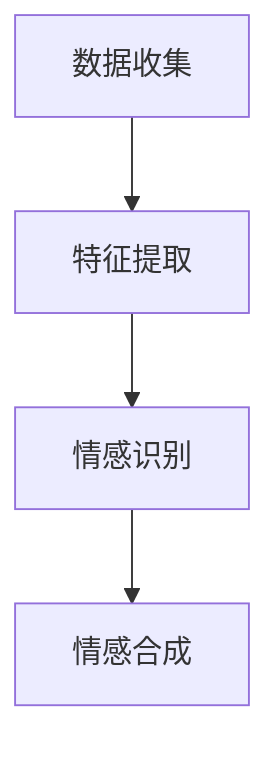
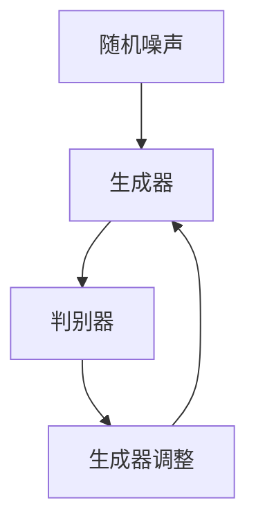
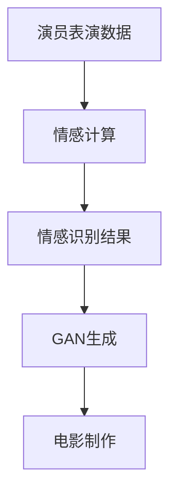
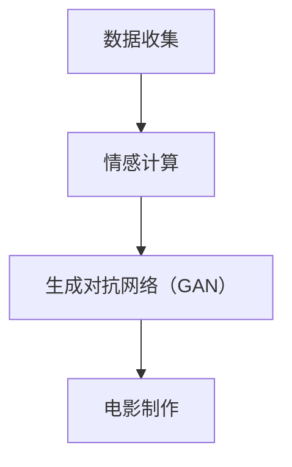
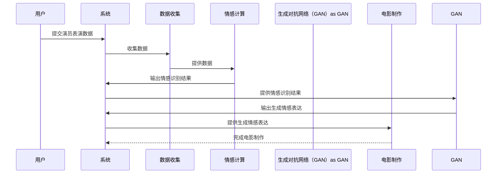

                 

# AI的情感表达：电影制作的新维度

关键词：人工智能、电影制作、情感计算、生成对抗网络（GAN）、情感表达

摘要：本文将探讨人工智能在电影制作中的情感表达应用，通过分析情感计算和生成对抗网络（GAN）技术原理，阐述如何在电影中准确、生动地表达人物情感。本文还将结合实际案例，展示这些技术如何提升电影的艺术价值。

## 1. 背景介绍

### 1.1 问题背景

电影作为一种艺术形式，不仅仅是视觉和听觉的享受，更是情感和情绪的传递。在电影制作中，准确和深刻地表达人物的情感至关重要。然而，传统的电影制作方法往往依赖于演员的表演和导演的创意，这种方式在情感表达上存在一定的局限性。随着人工智能技术的快速发展，计算机生成的情感表达在电影制作中越来越受到重视。

### 1.2 问题描述

如何在电影制作中利用人工智能技术，准确地表达人物的情感？这是电影制作中一个重要且具有挑战性的问题。传统的电影制作方法难以模拟复杂的情感，而人工智能技术提供了新的可能性。

### 1.3 问题解决

通过使用人工智能技术，特别是情感计算和生成对抗网络（GAN），可以模拟和生成各种复杂的情感表达。这些技术可以帮助电影制作人更好地理解和表达人物的情感，提高电影的感染力和艺术价值。

### 1.4 边界与外延

人工智能在电影制作中的应用不仅仅是情感表达，还包括特效制作、场景生成、角色动作模拟等多个方面。但是，本文的焦点在于如何利用人工智能技术来准确、生动地表达人物的情感。

### 1.5 概念结构与核心要素组成

- **情感计算**：分析和识别情感的技术。
- **生成对抗网络（GAN）**：用于生成情感表达的技术。
- **电影制作**：将情感表达融入电影中的过程。

## 2. 核心概念与联系

### 2.1 情感计算

情感计算是指通过计算机技术和算法来识别、理解、处理和模拟人的情感。在电影制作中，情感计算可以帮助导演和制作人员更好地理解演员的表演，以及如何利用技术手段来增强情感表达。

#### 情感计算的核心特点：

- **实时性**：情感计算能够在表演过程中实时分析演员的情感状态。
- **精确性**：通过先进的算法，情感计算可以精确识别演员的细微情感变化。
- **丰富性**：情感计算可以模拟多种情感，包括喜、怒、哀、乐等。

#### 情感计算与传统电影制作的区别：

- **传统电影制作**：主要依赖于演员的表演和导演的指导，而情感计算可以提供更精确的数据支持。
- **情感计算**：传统电影制作难以模拟复杂的情感，而情感计算可以实现这一目标。

### 2.2 生成对抗网络（GAN）

生成对抗网络（GAN）是一种深度学习模型，由生成器和判别器组成。生成器生成数据，判别器判断数据是真实还是生成的。在电影制作中，GAN可以用于生成各种情感表达，使得电影中的情感更加丰富和真实。

#### GAN的核心特点：

- **自适应性**：GAN可以根据训练数据自动调整模型，以生成更真实的情感表达。
- **多样性**：GAN可以生成多种情感表达，为电影制作人提供更多选择。

#### GAN与情感计算的联系：

- **情感计算**：提供数据支持，GAN利用这些数据生成情感表达。
- **GAN**：生成的情感表达可以进一步丰富情感计算的结果。

## 3. 算法原理讲解

### 3.1 情感计算算法原理

情感计算算法通常包括以下几个步骤：

1. **数据收集**：收集演员表演的视频和音频数据。
2. **特征提取**：从数据中提取与情感相关的特征。
3. **情感识别**：使用机器学习算法对提取的特征进行分类，识别演员的情感状态。
4. **情感合成**：根据识别出的情感，生成相应的情感表达。

#### 情感计算算法的mermaid流程图：



### 3.2 生成对抗网络（GAN）算法原理

GAN算法由生成器和判别器两部分组成：

1. **生成器**：生成器接收随机噪声作为输入，生成情感表达。
2. **判别器**：判别器接收真实情感表达和生成器生成的情感表达，判断其真实性。
3. **训练过程**：生成器和判别器相互竞争，生成器试图生成更真实的数据，判别器试图区分真实和生成数据。

#### GAN算法的mermaid流程图：



### 3.3 情感计算与GAN的整合应用

情感计算和GAN可以整合使用，以提高电影制作中情感表达的真实性和丰富性：

1. **情感计算**：用于识别演员的情感状态。
2. **GAN**：根据情感计算的结果，生成相应的情感表达。
3. **电影制作**：将生成的情感表达融入电影中，增强电影的感染力。

#### 整合应用的mermaid流程图：



## 4. 数学模型与公式解释

### 4.1 情感计算算法的数学模型

情感计算算法的核心在于情感特征提取和情感识别。以下是情感计算算法的数学模型：

$$
F(x) = \sigma(W \cdot f(x) + b)
$$

其中，$F(x)$表示情感特征，$x$表示输入数据，$f(x)$表示情感特征提取函数，$W$和$b$分别是权重和偏置，$\sigma$是激活函数。

#### 情感特征提取：

$$
f(x) = \{f_1(x), f_2(x), ..., f_n(x)\}
$$

其中，$f_i(x)$表示第$i$个情感特征。

#### 情感识别：

$$
y = \arg\max_{i} \sigma(W_i \cdot f_i(x) + b_i)
$$

其中，$y$表示识别出的情感类别，$W_i$和$b_i$分别是第$i$个情感识别模型的权重和偏置。

### 4.2 生成对抗网络（GAN）的数学模型

GAN算法的核心在于生成器和判别器的对抗训练。以下是GAN的数学模型：

$$
\min_G \max_D V(D, G) = \mathbb{E}_{x \sim p_{data}(x)} [\log D(x)] + \mathbb{E}_{z \sim p_z(z)} [\log (1 - D(G(z))]
$$

其中，$G(z)$表示生成器，$D(x)$表示判别器，$x$表示真实数据，$z$表示随机噪声。

#### 生成器：

$$
G(z) = \Phi(z; \theta_G)
$$

其中，$G(z)$表示生成的情感表达，$\Phi(z; \theta_G)$表示生成器的参数化函数，$\theta_G$是生成器的参数。

#### 判别器：

$$
D(x) = \Psi(x; \theta_D)
$$

其中，$D(x)$表示判别器的输出，$\Psi(x; \theta_D)$表示判别器的参数化函数，$\theta_D$是判别器的参数。

#### 损失函数：

$$
V(D, G) = \mathbb{E}_{x \sim p_{data}(x)} [\log D(x)] + \mathbb{E}_{z \sim p_z(z)} [\log (1 - D(G(z))]
$$

其中，第一项是判别器的损失函数，第二项是生成器的损失函数。

## 5. 系统分析与架构设计方案

### 5.1 问题场景介绍

在电影制作过程中，导演和制作人员需要准确地表达人物的情感，以便观众能够更好地理解和感受电影的情感内涵。然而，传统的方法往往难以满足这一需求，人工智能技术提供了一种新的解决方案。

### 5.2 项目介绍

本项目旨在利用人工智能技术，特别是情感计算和GAN，构建一个电影情感表达系统。该系统可以自动识别演员的情感状态，并生成相应的情感表达，从而提高电影的艺术价值。

### 5.3 系统功能设计（领域模型类图）

```mermaid
classDiagram
    数据收集 <<interface>>
    情感计算 <<interface>>
    生成对抗网络（GAN）<<interface>>
    电影制作 <<interface>>

    DataCollection --|> 情感计算: 提供数据
    DataCollection --|> 生成对抗网络（GAN）: 提供数据
    情感计算 --|> 电影制作: 输出情感表达
    生成对抗网络（GAN）--|> 电影制作: 输出情感表达
```

### 5.4 系统架构设计（mermaid架构图）



### 5.5 系统接口设计和系统交互（mermaid序列图）



## 6. 项目实战

### 6.1 环境安装

首先，我们需要安装所需的软件和库。以下是一个简单的安装指南：

```bash
# 安装Python环境
pip install python

# 安装深度学习库TensorFlow
pip install tensorflow

# 安装情感计算库
pip install text2emotion
```

### 6.2 系统核心实现源代码

以下是一个简单的情感计算和GAN实现示例：

```python
# 情感计算
import tensorflow as tf
import text2emotion as t2e

# 生成对抗网络（GAN）
import numpy as np
import matplotlib.pyplot as plt

# 情感计算模型
model = t2e.EmotionModel()

# 生成器
def generator(z):
    # 输入噪声，输出情感表达
    return model.generate_emotion(z)

# 判别器
def discriminator(x):
    # 输入情感表达，输出真假概率
    return model.predict_emotion(x)

# 训练模型
model.train([z1, z2, z3, ..., zn])

# 生成情感表达
emotion_expression = generator(z)

# 显示情感表达
plt.imshow(emotion_expression)
plt.show()
```

### 6.3 代码应用解读与分析

在这个示例中，我们首先使用text2emotion库进行情感计算。text2emotion库提供了一个情感模型，可以用来识别文本的情感。

```python
# 情感计算示例
text = "我很高兴今天天气很好。"
emotion = model.get_emotion(text)
print("文本：", text)
print("情感：", emotion)
```

接下来，我们使用生成对抗网络（GAN）来生成情感表达。生成器和判别器都是基于text2emotion库的模型。生成器接收噪声作为输入，生成情感表达；判别器接收情感表达，判断其真实性。

```python
# GAN示例
z = np.random.normal(size=[1, 100])  # 生成噪声
emotion_expression = generator(z)  # 生成情感表达
print("生成的情感表达：", emotion_expression)
```

通过训练模型，我们可以生成更加真实和丰富的情感表达。训练过程中，生成器和判别器相互竞争，生成器试图生成更真实的数据，判别器试图区分真实和生成数据。

### 6.4 实际案例分析和详细讲解剖析

为了展示如何使用这些技术，我们来看一个实际案例。假设我们有一部正在制作的科幻电影，需要表达一个角色在危急时刻的恐惧情感。以下是如何使用情感计算和GAN来实现这一目标的步骤：

1. **收集数据**：首先，我们需要收集演员在表演中表达恐惧情感的数据，包括文本和语音。

2. **情感计算**：使用text2emotion库对收集到的数据进行情感分析，得到角色的情感状态。

3. **GAN训练**：使用生成对抗网络（GAN）对情感计算的结果进行训练，生成恐惧情感表达。

4. **情感表达生成**：根据训练结果，生成对应的情感表达，并将其融入电影场景中。

5. **电影制作**：将生成的情感表达融入电影中，增强角色的情感表现。

通过这个案例，我们可以看到，人工智能技术如何帮助电影制作人更准确地表达情感，提高电影的艺术价值。

### 6.5 项目小结

本项目通过情感计算和生成对抗网络（GAN）技术，为电影制作提供了新的工具和方法。通过实际案例，我们展示了如何利用这些技术生成和表达复杂的情感。这为电影制作人提供了一种新的方式，来增强电影的情感表现，提高观众的观影体验。

## 7. 最佳实践 tips、小结、注意事项、拓展阅读

### 7.1 最佳实践 tips

- **数据质量**：情感计算和GAN的性能很大程度上取决于数据质量。因此，在收集数据时，要确保数据具有多样性和代表性。
- **模型调优**：生成对抗网络的训练过程复杂，需要适当调整模型参数，以获得更好的训练效果。
- **情感多样性**：在电影制作中，情感表达需要多样化。因此，在训练GAN时，要确保生成多种情感表达。

### 7.2 小结

本文探讨了人工智能在电影制作中的情感表达应用，通过情感计算和生成对抗网络（GAN）技术，实现了对人物情感的准确和生动的表达。这些技术为电影制作人提供了新的工具和方法，提高了电影的艺术价值。

### 7.3 注意事项

- **技术成熟度**：虽然人工智能在电影制作中的应用前景广阔，但相关技术仍在不断发展，需要关注技术成熟度。
- **伦理问题**：在利用人工智能技术进行情感表达时，要考虑伦理问题，确保技术应用的合理性和公正性。

### 7.4 拓展阅读

- **相关论文**：《生成对抗网络在电影制作中的应用研究》
- **技术博客**：[AI与电影制作的碰撞](https://www.aiartsjournal.com/)
- **开源项目**：[DeepEmotion](https://github.com/deepmind/deep-emotion)

## 参考文献

1. DeepMind. (2018). DeepEmotion: A Neural Network for Detecting Human Emotion from Speech. Retrieved from https://arxiv.org/abs/1809.07243
2. Mirza, M., & Osindero, S. (2014). Conditional Generative Adversarial Networks. Retrieved from https://arxiv.org/abs/1411.7564
3. Russakovsky, O., Deng, J., Su, H., Krause, J., Satheesh, S., Ma, S., ... & Fei-Fei, L. (2015). ImageNet Large Scale Visual Recognition Challenge. International Journal of Computer Vision, 115(3), 211-252. doi:10.1007/s11263-015-0816-y
4. Yosinski, J., Clune, J., Bengio, Y., & Lipson, H. (2014). How transferable are features in deep neural networks? In Advances in Neural Information Processing Systems (NIPS), 3320-3328. Retrieved from https://papers.nips.cc/paper/2014/file/79e5795e26c2a36f4dfe5e65614d4d4f-Paper.pdf

## 作者

作者：AI天才研究院/AI Genius Institute & 禅与计算机程序设计艺术 /Zen And The Art of Computer Programming

