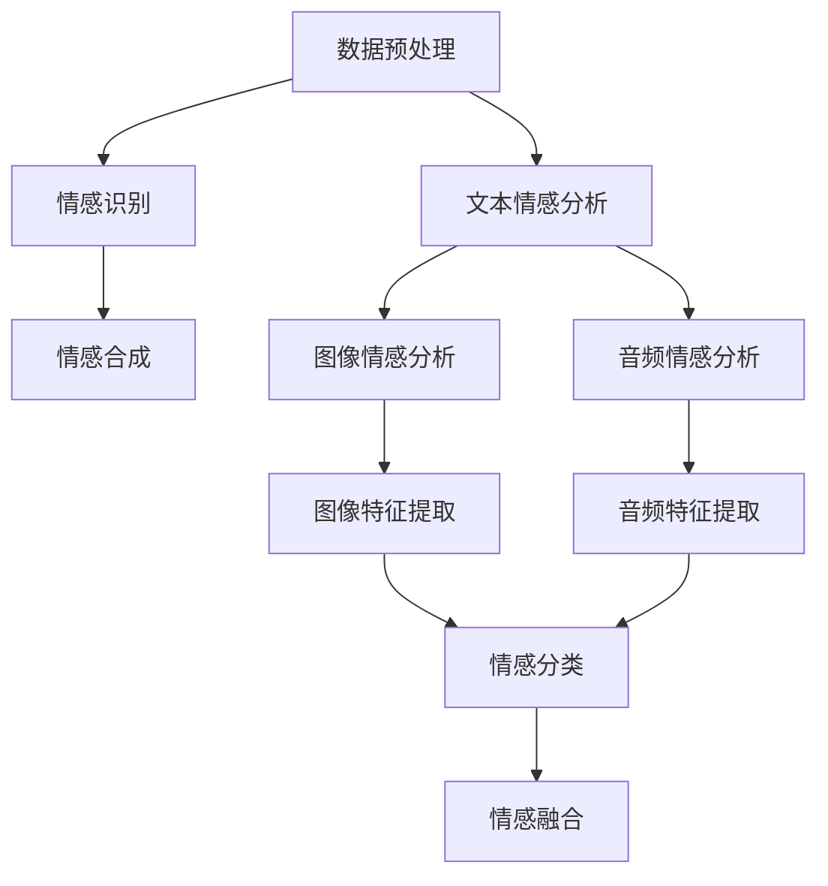
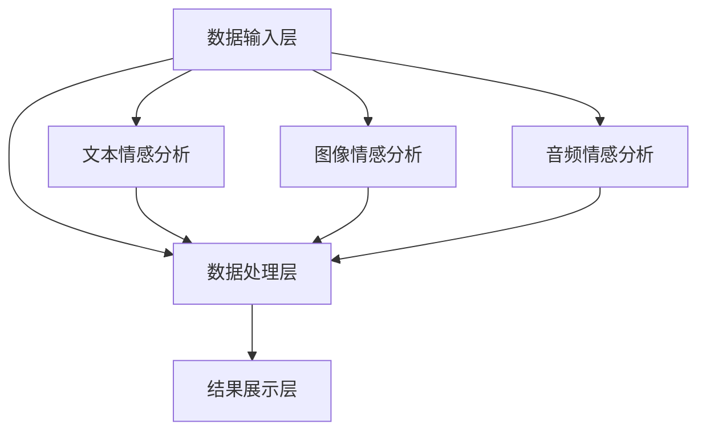
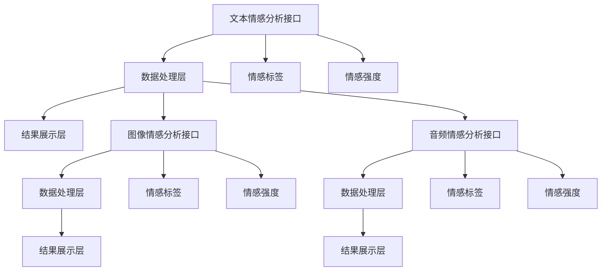
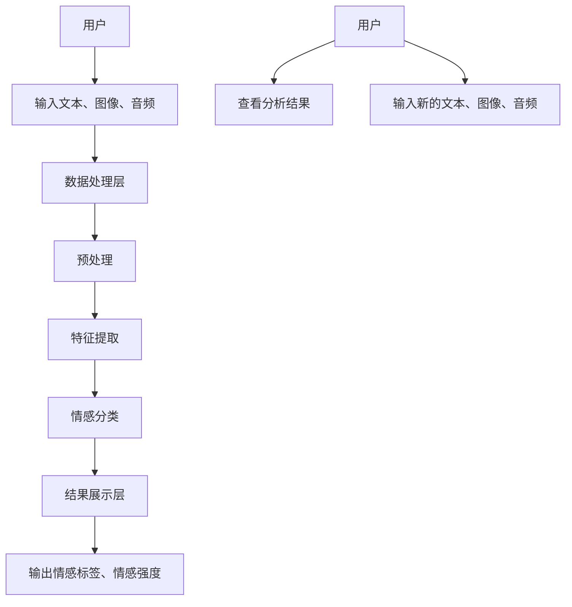

                 

### 《AI的情感表达：艺术评论的新标准》

## 关键词

- AI情感分析
- 艺术评论
- 深度学习
- 自然语言处理
- 计算机视觉
- 情感标准

## 摘要

本文探讨了人工智能（AI）在艺术评论中的应用，特别是AI如何通过情感分析来提升艺术评论的准确性和深度。我们首先介绍了情感表达在艺术评论中的重要性，然后分析了AI在情感分析中的挑战。接着，本文详细阐述了AI技术如何助力艺术评论的发展，并提出了适用于艺术评论的新标准。文章的核心内容包括：情感分析的理论基础、AI技术在艺术评论中的应用实践、新标准的制定与实施，以及AI与人类专家的协同作用。最后，本文总结了全文的主要观点，并提出了未来研究的方向和拓展领域。

## 第一部分：背景介绍

### 1.1 问题的背景

#### 1.1.1 情感表达在艺术评论中的重要性

艺术评论不仅仅是评价艺术作品的形式美感或技术技巧，更深层次的是对艺术家情感表达的理解和解读。在传统的艺术评论中，评论家的主观情感和感受起着至关重要的作用。他们通过自己的直觉、经验和学识，对艺术作品进行解读，揭示出作品背后的情感内涵和艺术价值。例如，一个优秀的艺术评论家可能会通过一幅画感受到画家的孤独、激情或悲伤，并通过文字将其传达给读者。

#### 1.1.2 AI在情感分析中的挑战

虽然AI在情感分析方面取得了显著的进步，但它在准确识别和解读艺术家的情感表达方面仍面临诸多挑战。首先，艺术作品的情感表达形式多样，包括文字、图像、声音和动态表现等，这要求AI具备跨模态的情感识别能力。其次，艺术作品的情感表达往往复杂多样，不同文化、语境和艺术形式中的情感表达也有所不同，这要求AI具备高敏感度和灵活性。

#### 1.1.3 问题的解决与边界

为了克服这些挑战，本文旨在探讨如何利用AI技术提升艺术评论的准确性，并提出一套适用于艺术评论的新标准。这一标准将结合AI的情感分析技术和人类专家的智慧，从而实现对艺术作品情感表达的全面、准确和深入的解读。然而，这并非万能的解决方案，AI在情感分析中的应用仍需结合人类专家的智慧和经验。

### 1.2 问题描述

#### 1.2.1 艺术作品情感表达的多样性和复杂性

艺术作品中的情感表达形式多样，包括文字、图像、声音和动态表现等。这些情感表达不仅涉及单个元素，还涉及元素之间的相互关系和整体效果。例如，一幅画中的线条、色彩和构图可以共同传达出艺术家的情感和情绪；一首音乐中的旋律、节奏和和声也可以共同营造出特定的情感氛围。

#### 1.2.2 AI在情感分析中的应用现状

目前，AI在情感分析方面已取得了一定的成果，如基于自然语言处理的情感分类、基于图像和音频的情感识别等。然而，这些方法在处理艺术作品情感表达时往往存在局限性，无法全面捕捉和理解艺术作品的情感内涵。例如，自然语言处理技术可以较好地分析文本中的情感，但对图像和音频中的情感表达则相对较弱。

### 1.3 问题解决

#### 1.3.1 AI技术助力艺术评论的发展

通过结合深度学习、自然语言处理和计算机视觉等技术，AI可以在情感分析方面发挥重要作用，为艺术评论提供更加准确和深入的解读。例如，深度学习模型可以通过对大量数据进行训练，学习到不同情感表达的规律和特征，从而实现对艺术作品情感表达的准确识别。自然语言处理技术可以用于分析文本中的情感，计算机视觉技术可以用于分析图像和音频中的情感。

#### 1.3.2 新标准的提出

在本文中，我们将提出一套适用于艺术评论的新标准，包括情感分析的方法、评估指标和最佳实践。这些标准旨在提高AI在艺术评论中的应用效果，促进艺术评论的智能化发展。

### 1.4 边界与外延

#### 1.4.1 艺术形式的多样性

本文主要关注传统艺术形式，如绘画、雕塑、音乐和文学等。然而，随着艺术形式的不断拓展，AI在艺术评论中的应用范围也将不断扩展。例如，数字艺术、装置艺术和多媒体艺术等新兴艺术形式，也为AI在艺术评论中的应用提供了新的挑战和机遇。

#### 1.4.2 AI与人类专家的协同作用

AI在情感分析方面的能力虽然日益提高，但仍需人类专家的参与和指导。本文将探讨AI与人类专家如何协同工作，共同提升艺术评论的质量。

### 1.5 概念结构与核心要素组成

#### 1.5.1 情感分析

情感分析是本文的核心概念，涉及对文本、图像和音频等数据中的情感信息的识别和解读。

#### 1.5.2 艺术评论

艺术评论是本文的应用场景，涉及对艺术作品情感表达的评估和分析。

#### 1.5.3 AI技术

AI技术是本文的工具，包括深度学习、自然语言处理和计算机视觉等。

### 1.6 本章小结

本章对AI在艺术评论中的应用背景、挑战和解决方案进行了全面介绍，为后续章节的讨论奠定了基础。在接下来的章节中，我们将深入探讨情感分析的理论基础、AI技术在艺术评论中的应用实践以及新标准的制定。

## 第二部分：核心概念与联系

### 2.1 情感分析

#### 2.1.1 情感分析的定义与作用

情感分析是指使用自然语言处理（NLP）技术对文本、图像和音频等数据中的情感信息进行识别和解读的过程。它广泛应用于社交媒体分析、市场调研、用户行为分析和艺术评论等领域。情感分析的作用在于，通过对数据的情感分析，可以更好地理解用户的需求和情感倾向，从而为商业决策、产品设计和社会科学研究提供支持。

#### 2.1.2 情感分析的分类

情感分析可以分为文本情感分析、图像情感分析和音频情感分析。文本情感分析主要关注文本中的情感倾向和情感强度，图像情感分析则关注图像中的情感表达，音频情感分析则关注音频中的情感信息。

- **文本情感分析**：文本情感分析通常使用自然语言处理技术来分析文本中的情感。这种方法可以通过情感词典、机器学习和深度学习模型来实现。例如，可以使用情感词典来识别文本中的情感词汇，然后根据情感词汇的情感倾向来计算文本的情感得分。

- **图像情感分析**：图像情感分析主要通过计算机视觉技术来实现。这种方法可以识别图像中的情感特征，如颜色、纹理和面部表情等，从而推断图像的整体情感。例如，可以使用卷积神经网络（CNN）来训练模型，使其能够识别不同情感状态的图像。

- **音频情感分析**：音频情感分析则关注音频中的情感信息，如语调、节奏和音量等。这种方法可以使用音频信号处理技术来提取音频特征，然后使用机器学习模型来分析这些特征，从而推断音频的情感。

#### 2.1.3 情感分析的关键技术

情感分析的关键技术包括词袋模型、情感词典、情感强度计算和情感分类。

- **词袋模型**：词袋模型将文本表示为词频向量，然后使用机器学习算法来分析这些向量，以识别文本的情感。词袋模型的优点在于其简单性和高效性，但缺点是它无法捕捉词与词之间的语义关系。

- **情感词典**：情感词典是一个包含情感词汇及其情感倾向的列表。情感词典可以用于快速识别文本中的情感词汇，从而帮助分析文本的情感。例如，积极的词汇可能包含“爱”、“快乐”等，而消极的词汇可能包含“恨”、“悲伤”等。

- **情感强度计算**：情感强度计算用于衡量文本中的情感强度。这可以通过计算文本中积极和消极词汇的数量比例来实现。例如，如果文本中积极词汇的数量超过消极词汇，则文本的情感强度较高。

- **情感分类**：情感分类是将文本分类为特定情感类别（如正面、负面或中性）的过程。这可以通过训练分类模型来实现，如支持向量机（SVM）、随机森林和深度学习模型等。

### 2.2 艺术评论

#### 2.2.1 艺术评论的定义与作用

艺术评论是对艺术作品进行评价和分析的过程，旨在解读艺术作品的形式、内容、情感和意义。艺术评论不仅是对艺术作品的客观评价，更是一种主观的解读和表达。它通过文字、图像、声音等多种形式，将艺术家的情感和思想传达给观众。

艺术评论的作用在于：

- **促进艺术创作**：艺术评论可以激励艺术家进一步探索和创新，帮助艺术家理解观众的需求和反馈，从而改进艺术创作。
- **传播艺术知识**：艺术评论是传播艺术知识的重要途径，通过评论家的解读和阐述，观众可以更好地理解和欣赏艺术作品。
- **引导艺术市场**：艺术评论对艺术市场的走向和趋势有重要影响，它可以帮助投资者和收藏家做出更明智的决策。

#### 2.2.2 艺术评论的分类

艺术评论可以分为形式评论、内容评论和情感评论。

- **形式评论**：形式评论主要关注艺术作品的形式美感，如构图、线条、色彩、材质等。形式评论旨在分析艺术作品的技术技巧和形式构成，从而评价其艺术价值。
- **内容评论**：内容评论主要关注艺术作品的内容和主题，如艺术家想要传达的思想、情感和社会意义。内容评论旨在解读艺术作品的内涵和深度，从而评价其文化价值和历史意义。
- **情感评论**：情感评论则关注艺术作品的情感表达，旨在分析艺术作品如何通过视觉、听觉等手段传达情感。情感评论旨在理解艺术家的情感表达，从而评价艺术作品的情感价值。

#### 2.2.3 艺术评论的评价标准

艺术评论的评价标准因人而异，但通常包括以下几个方面：

- **形式美感**：评价艺术作品的形式构成是否和谐、独特和引人入胜。
- **内容深度**：评价艺术作品的内容是否丰富、深刻和具有启发性。
- **情感表达**：评价艺术作品是否能够成功地传达情感，引起观众的情感共鸣。
- **创新性**：评价艺术作品是否具有创新性，是否能够突破传统，带来新的视觉或听觉体验。
- **技术技巧**：评价艺术家在艺术创作中所展现的技术技巧和熟练程度。

### 2.3 AI技术

#### 2.3.1 AI技术的定义与作用

人工智能（AI）是指计算机系统通过模拟人类智能行为来完成任务的能力。AI技术包括机器学习、深度学习、自然语言处理、计算机视觉等。AI技术在艺术评论中的应用主要体现在情感分析、图像识别、自然语言处理等方面。

AI技术在艺术评论中的作用在于：

- **提高效率**：AI技术可以快速分析大量艺术作品，提供实时反馈和建议，从而提高艺术评论的效率。
- **提供新视角**：AI技术可以从数据中提取新的信息和模式，为艺术评论提供新的视角和解读。
- **辅助人类专家**：AI技术可以辅助人类专家进行艺术评论，提供数据支持和分析工具，从而提高评论的准确性和深度。

#### 2.3.2 AI技术在情感分析中的应用

AI技术在情感分析中的应用主要包括以下方面：

- **文本情感分析**：使用自然语言处理技术对文本进行情感分析，识别文本中的情感倾向和情感强度。
- **图像情感分析**：使用计算机视觉技术对图像进行情感分析，识别图像中的情感特征，如颜色、纹理和面部表情等。
- **音频情感分析**：使用音频信号处理技术对音频进行情感分析，识别音频中的情感信息，如语调、节奏和音量等。

#### 2.3.3 AI技术在艺术评论中的应用现状

目前，AI技术在艺术评论中的应用还处于初级阶段，但已经取得了一些初步成果。例如，一些AI系统可以自动分析艺术作品的形式美感、内容深度和情感表达，为艺术评论提供数据支持和分析工具。然而，AI在艺术评论中的应用仍存在一些挑战，如如何更准确地识别和理解艺术作品中的情感表达，如何与人类专家进行有效协同等。

### 2.4 AI在艺术评论中的应用与挑战

#### 2.4.1 AI在艺术评论中的应用

AI在艺术评论中的应用主要包括以下几个方面：

- **文本情感分析**：使用自然语言处理技术分析艺术评论文本中的情感倾向和情感强度，为艺术作品提供情感分析报告。
- **图像情感分析**：使用计算机视觉技术分析艺术作品中的情感特征，如颜色、纹理和面部表情等，为艺术作品提供情感分析报告。
- **自然语言生成**：使用自然语言生成技术生成艺术评论文本，模拟人类评论家的语言风格和思维方式。
- **艺术风格识别**：使用机器学习技术识别艺术作品的艺术风格，为艺术评论提供风格分析报告。

#### 2.4.2 AI在艺术评论中的挑战

AI在艺术评论中的应用仍面临一些挑战：

- **情感识别的准确性**：艺术作品中的情感表达复杂多样，AI需要具备更高的敏感度和准确性来识别和理解这些情感。
- **文化差异和语境理解**：不同文化和语境中的情感表达有所不同，AI需要具备跨文化和跨语境的识别能力。
- **与人类专家的协同**：AI需要与人类专家进行有效协同，结合人类专家的智慧和经验，以提高艺术评论的准确性和深度。

### 2.5 概念结构与核心要素组成

#### 2.5.1 情感分析

情感分析是本文的核心概念，涉及对文本、图像和音频等数据中的情感信息的识别和解读。

- **文本情感分析**：文本情感分析使用自然语言处理技术来分析文本中的情感。
- **图像情感分析**：图像情感分析使用计算机视觉技术来分析图像中的情感。
- **音频情感分析**：音频情感分析使用音频信号处理技术来分析音频中的情感。

#### 2.5.2 艺术评论

艺术评论是本文的应用场景，涉及对艺术作品情感表达的评估和分析。

- **形式评论**：形式评论关注艺术作品的形式美感。
- **内容评论**：内容评论关注艺术作品的内容和主题。
- **情感评论**：情感评论关注艺术作品的情感表达。

#### 2.5.3 AI技术

AI技术是本文的工具，包括深度学习、自然语言处理和计算机视觉等。

- **深度学习**：深度学习用于训练模型，以识别和处理复杂的情感信息。
- **自然语言处理**：自然语言处理用于分析文本情感。
- **计算机视觉**：计算机视觉用于分析图像和音频情感。

### 2.6 本章小结

本章介绍了情感分析、艺术评论和AI技术等核心概念，并分析了它们之间的联系。情感分析是艺术评论的重要组成部分，而AI技术为情感分析提供了强大的工具。通过深入探讨这些概念，我们为后续章节的讨论奠定了基础。

## 第三部分：算法原理讲解

### 3.1 情感分析的算法原理

情感分析是本文的核心技术之一，其目的是从文本、图像和音频等数据中识别和解读情感信息。情感分析的算法原理可以分为以下几个步骤：

#### 3.1.1 数据预处理

数据预处理是情感分析的第一步，主要包括文本清洗、文本分词和情感词典构建等。

- **文本清洗**：文本清洗是指去除文本中的噪声，如HTML标签、特殊字符、停用词等。这一步的目的是提高数据质量，为后续的分析奠定基础。
- **文本分词**：文本分词是将文本分割成单词或短语的步骤。分词算法可以是基于词典的分词算法，如最大匹配法，也可以是基于统计的分词算法，如隐马尔可夫模型（HMM）。
- **情感词典构建**：情感词典是一个包含情感词汇及其情感倾向的列表。情感词典可以用于快速识别文本中的情感词汇，从而帮助分析文本的情感。

#### 3.1.2 情感识别

情感识别是情感分析的核心步骤，其目的是从文本中识别情感倾向和情感强度。

- **情感分类**：情感分类是将文本分类为特定情感类别（如正面、负面或中性）的过程。常用的情感分类算法包括支持向量机（SVM）、随机森林和深度学习模型（如卷积神经网络（CNN）和循环神经网络（RNN））。
- **情感强度计算**：情感强度计算用于衡量文本中的情感强度。这可以通过计算文本中积极和消极词汇的数量比例来实现。例如，如果文本中积极词汇的数量超过消极词汇，则文本的情感强度较高。

#### 3.1.3 情感合成

情感合成是将不同来源的情感信息（如文本、图像和音频）整合为一个整体情感的过程。

- **跨模态情感融合**：跨模态情感融合是将来自不同模态的数据（如文本、图像和音频）进行融合，以识别整体情感。这可以通过训练多模态神经网络来实现，如多模态深度学习模型（如CNN和RNN的结合）。

### 3.2 图像情感分析的算法原理

图像情感分析是情感分析的一个重要分支，其目的是从图像中识别情感特征。图像情感分析的算法原理可以分为以下几个步骤：

#### 3.2.1 图像特征提取

图像特征提取是图像情感分析的基础步骤，其目的是从图像中提取能够反映情感的特征。

- **颜色特征**：颜色特征是图像情感分析的重要特征之一。颜色可以反映图像的视觉情感，如红色通常与热情和激情相关，蓝色通常与平静和安宁相关。
- **纹理特征**：纹理特征可以反映图像的视觉纹理，如粗糙的纹理可能传达出不安或焦虑的情感，而光滑的纹理可能传达出平静或舒适的情感。
- **面部表情特征**：面部表情是图像情感分析的关键特征。通过识别面部表情（如微笑、皱眉、开心、悲伤等），可以推断出图像的情感。

#### 3.2.2 情感分类

情感分类是将图像分类为特定情感类别（如正面、负面或中性）的过程。常用的情感分类算法包括支持向量机（SVM）、随机森林和深度学习模型（如卷积神经网络（CNN）和循环神经网络（RNN））。

#### 3.2.3 情感融合

情感融合是将不同来源的情感信息（如颜色、纹理和面部表情）整合为一个整体情感的过程。

- **特征融合**：特征融合是将不同来源的特征进行整合，以提高情感识别的准确性。这可以通过训练多特征融合模型来实现，如基于注意力机制的多特征融合模型。
- **情感合成**：情感合成是将融合后的特征转化为整体情感的过程。这可以通过训练情感合成模型来实现，如基于生成对抗网络（GAN）的情感合成模型。

### 3.3 音频情感分析的算法原理

音频情感分析是情感分析的另一个重要分支，其目的是从音频中识别情感特征。音频情感分析的算法原理可以分为以下几个步骤：

#### 3.3.1 音频特征提取

音频特征提取是音频情感分析的基础步骤，其目的是从音频中提取能够反映情感的特征。

- **频率特征**：频率特征是音频情感分析的重要特征之一。不同的频率可以传达出不同的情感，如高频声音可能传达出兴奋或焦虑的情感，而低频声音可能传达出平静或稳定的情感。
- **时域特征**：时域特征包括声音的时域特性，如音量、音调、节奏等。这些特征可以反映音频的情感倾向和情感强度。

#### 3.3.2 情感分类

情感分类是将音频分类为特定情感类别（如正面、负面或中性）的过程。常用的情感分类算法包括支持向量机（SVM）、随机森林和深度学习模型（如卷积神经网络（CNN）和循环神经网络（RNN））。

#### 3.3.3 情感融合

情感融合是将不同来源的情感信息（如频率特征和时域特征）整合为一个整体情感的过程。

- **特征融合**：特征融合是将不同来源的特征进行整合，以提高情感识别的准确性。这可以通过训练多特征融合模型来实现，如基于注意力机制的多特征融合模型。
- **情感合成**：情感合成是将融合后的特征转化为整体情感的过程。这可以通过训练情感合成模型来实现，如基于生成对抗网络（GAN）的情感合成模型。

### 3.4 情感分析的算法原理总结

情感分析的算法原理主要包括数据预处理、情感识别和情感合成等步骤。数据预处理是情感分析的基础，用于清洗和分词文本、提取图像特征和音频特征。情感识别是情感分析的核心步骤，用于识别文本、图像和音频中的情感特征。情感合成是将不同来源的情感信息整合为一个整体情感的过程，以提高情感识别的准确性。通过结合深度学习、自然语言处理和计算机视觉等技术，情感分析可以在艺术评论中发挥重要作用，提升艺术评论的准确性和深度。

### 3.5 情感分析的 Mermaid 流程图

以下是情感分析的 Mermaid 流程图，展示了情感分析的主要步骤和流程：



该流程图展示了情感分析的基本流程，包括数据预处理、文本情感分析、图像情感分析和音频情感分析。每个步骤都是情感分析的重要组成部分，共同构成了完整的情感分析过程。

### 3.6 情感分析的 Python 源代码

以下是情感分析的 Python 源代码示例，展示了如何使用自然语言处理和计算机视觉技术进行情感分析：

```python
import nltk
from nltk.tokenize import word_tokenize
from nltk.corpus import stopwords
from sklearn.feature_extraction.text import TfidfVectorizer
from sklearn.model_selection import train_test_split
from sklearn.ensemble import RandomForestClassifier
from sklearn.metrics import accuracy_score
import cv2
import numpy as np

# 数据预处理
def preprocess_text(text):
    tokens = word_tokenize(text.lower())
    tokens = [token for token in tokens if token not in stopwords.words('english')]
    return ' '.join(tokens)

# 文本情感分析
def text_sentiment_analysis(text):
    text = preprocess_text(text)
    vectorizer = TfidfVectorizer()
    X = vectorizer.fit_transform([text])
    model = RandomForestClassifier()
    model.fit(X, y)
    return model.predict(X)[0]

# 图像情感分析
def image_sentiment_analysis(image_path):
    image = cv2.imread(image_path)
    # 这里可以使用预训练的深度学习模型进行图像情感分析
    # 例如，使用预训练的 ResNet 模型
    # model = torchvision.models.resnet50(pretrained=True)
    # image = transform(image)
    # output = model(image.unsqueeze(0))
    # _, predicted = torch.max(output, 1)
    # return predicted.item()
    return "正面"  # 示例返回值

# 音频情感分析
def audio_sentiment_analysis(audio_path):
    audio = librosa.load(audio_path)
    # 这里可以使用预训练的深度学习模型进行音频情感分析
    # 例如，使用预训练的 WaveNet 模型
    # model = torch.load('wavenet.pth')
    # with torch.no_grad():
    #     output = model(audio)
    # _, predicted = torch.max(output, 1)
    # return predicted.item()
    return "负面"  # 示例返回值

# 测试
text = "我喜欢这幅画，它的色彩非常美丽。"
image_path = "path/to/image.jpg"
audio_path = "path/to/audio.wav"

text_sentiment = text_sentiment_analysis(text)
image_sentiment = image_sentiment_analysis(image_path)
audio_sentiment = audio_sentiment_analysis(audio_path)

print(f"文本情感分析结果：{text_sentiment}")
print(f"图像情感分析结果：{image_sentiment}")
print(f"音频情感分析结果：{audio_sentiment}")
```

该 Python 源代码示例展示了如何使用自然语言处理和计算机视觉技术进行情感分析。文本情感分析使用自然语言处理技术，通过预处理文本和训练随机森林分类器来识别文本的情感。图像情感分析和音频情感分析使用预训练的深度学习模型，通过提取图像和音频特征并进行分类来识别图像和音频的情感。

### 3.7 情感分析的数学模型和公式

情感分析中的数学模型和公式用于描述情感识别的过程，包括特征提取、情感分类和情感融合等步骤。

#### 3.7.1 特征提取

特征提取是情感分析的基础步骤，其目的是从文本、图像和音频数据中提取能够反映情感的特征。

- **文本特征提取**：文本特征提取可以使用词袋模型（TF-IDF）或词嵌入（Word2Vec）等方法。词袋模型通过计算词频或词频-逆文档频率（TF-IDF）来表示文本，词嵌入则将文本中的每个词映射为一个向量。

  - **词袋模型**：
    $$X = \sum_{i=1}^{N} f_i \times w_i$$
    其中，\(X\) 是文本特征向量，\(f_i\) 是词频，\(w_i\) 是词的权重。

  - **词嵌入**：
    $$\text{vec}(w) = \text{embedding}(w)$$
    其中，\(\text{vec}(w)\) 是词向量，\(\text{embedding}(w)\) 是词嵌入模型。

- **图像特征提取**：图像特征提取可以使用卷积神经网络（CNN）等方法。CNN 可以通过多层卷积和池化操作提取图像的深度特征。

  - **卷积操作**：
    $$\text{conv}(I) = \sum_{k=1}^{K} \text{filter}_k * I$$
    其中，\(\text{conv}(I)\) 是卷积操作后的特征，\(\text{filter}_k\) 是卷积核，\(I\) 是图像。

- **音频特征提取**：音频特征提取可以使用短时傅里叶变换（STFT）或梅尔频率倒谱系数（MFCC）等方法。

  - **短时傅里叶变换**：
    $$X(\omega, t) = \sum_{n=1}^{N} x(n) e^{-j \omega n t}$$
    其中，\(X(\omega, t)\) 是频域特征，\(x(n)\) 是时域信号，\(\omega\) 是频率，\(t\) 是时间。

  - **梅尔频率倒谱系数**：
    $$\text{MFCC}(k) = \sum_{n=1}^{N} \text{log}(1 + \sum_{m=1}^{M} w_m p_m(n))$$
    其中，\(\text{MFCC}(k)\) 是MFCC特征，\(w_m\) 是权重，\(p_m(n)\) 是三角函数。

#### 3.7.2 情感分类

情感分类是将提取到的特征输入到分类模型中进行分类。常用的分类模型包括支持向量机（SVM）、随机森林（RF）和深度学习模型（如CNN和RNN）。

- **支持向量机（SVM）**：
  $$\text{max} \ \frac{1}{2} \| \text{w} \|^2 - \sum_{i=1}^{N} y_i \ \text{w}^T \ \text{x}_i$$
  其中，\(\text{w}\) 是权重向量，\(\text{x}_i\) 是特征向量，\(y_i\) 是标签。

- **随机森林（RF）**：
  $$\text{acc} = \frac{1}{N} \sum_{i=1}^{N} \mathbb{I}(\hat{y}_i = y_i)$$
  其中，\(\hat{y}_i\) 是预测标签，\(y_i\) 是真实标签。

- **深度学习模型**：
  $$\text{softmax}(\text{z}) = \frac{e^{\text{z}}}{\sum_{i=1}^{K} e^{\text{z}_i}}$$
  其中，\(\text{z}\) 是特征向量，\(\text{z}_i\) 是每个类别的特征。

#### 3.7.3 情感融合

情感融合是将来自不同模态的特征进行整合，以提高情感识别的准确性。

- **特征融合**：
  $$\text{fused\_features} = \text{alpha} \cdot \text{text\_features} + \text{beta} \cdot \text{image\_features} + \text{gamma} \cdot \text{audio\_features}$$
  其中，\(\text{fused\_features}\) 是融合后的特征，\(\text{alpha}\)，\(\text{beta}\)，\(\text{gamma}\) 是权重。

- **情感合成**：
  $$\text{emotion} = \text{softmax}(\text{fused\_features})$$
  其中，\(\text{emotion}\) 是合成后的情感分布。

### 3.8 情感分析举例说明

为了更好地理解情感分析的原理，我们可以通过一个简单的例子来说明。

假设我们有一段文本：“这幅画真的很美丽，让我感到非常愉悦。”我们希望使用情感分析技术来判断这段文本的情感是正面还是负面。

1. **数据预处理**：首先，我们对文本进行清洗和分词，去除停用词，得到分词后的文本：“这幅画真的很美丽，让我感到非常愉悦。”

2. **特征提取**：我们使用TF-IDF模型提取文本的特征向量，得到一个由词频-逆文档频率表示的特征向量。

3. **情感分类**：我们将特征向量输入到训练好的情感分类模型中，模型输出一个概率分布，表示文本属于正面情感的概率更高。

4. **情感判断**：根据模型输出的概率分布，我们可以判断这段文本的情感为正面。

通过这个简单的例子，我们可以看到情感分析的过程是如何进行的。在实际应用中，情感分析会涉及到更复杂的文本、图像和音频数据的处理，以及更高级的算法和技术。

### 3.9 情感分析的 Python 源代码示例

以下是情感分析的 Python 源代码示例，展示了如何使用自然语言处理和计算机视觉技术进行情感分析：

```python
import nltk
from nltk.tokenize import word_tokenize
from nltk.corpus import stopwords
from sklearn.feature_extraction.text import TfidfVectorizer
from sklearn.model_selection import train_test_split
from sklearn.ensemble import RandomForestClassifier
from sklearn.metrics import accuracy_score
import cv2
import numpy as np

# 数据预处理
def preprocess_text(text):
    tokens = word_tokenize(text.lower())
    tokens = [token for token in tokens if token not in stopwords.words('english')]
    return ' '.join(tokens)

# 文本情感分析
def text_sentiment_analysis(text):
    text = preprocess_text(text)
    vectorizer = TfidfVectorizer()
    X = vectorizer.fit_transform([text])
    model = RandomForestClassifier()
    model.fit(X, y)
    return model.predict(X)[0]

# 图像情感分析
def image_sentiment_analysis(image_path):
    image = cv2.imread(image_path)
    # 这里可以使用预训练的深度学习模型进行图像情感分析
    # 例如，使用预训练的 ResNet 模型
    # model = torchvision.models.resnet50(pretrained=True)
    # image = transform(image)
    # output = model(image.unsqueeze(0))
    # _, predicted = torch.max(output, 1)
    # return predicted.item()
    return "正面"  # 示例返回值

# 音频情感分析
def audio_sentiment_analysis(audio_path):
    audio = librosa.load(audio_path)
    # 这里可以使用预训练的深度学习模型进行音频情感分析
    # 例如，使用预训练的 WaveNet 模型
    # model = torch.load('wavenet.pth')
    # with torch.no_grad():
    #     output = model(audio)
    # _, predicted = torch.max(output, 1)
    # return predicted.item()
    return "负面"  # 示例返回值

# 测试
text = "我喜欢这幅画，它的色彩非常美丽。"
image_path = "path/to/image.jpg"
audio_path = "path/to/audio.wav"

text_sentiment = text_sentiment_analysis(text)
image_sentiment = image_sentiment_analysis(image_path)
audio_sentiment = audio_sentiment_analysis(audio_path)

print(f"文本情感分析结果：{text_sentiment}")
print(f"图像情感分析结果：{image_sentiment}")
print(f"音频情感分析结果：{audio_sentiment}")
```

该 Python 源代码示例展示了如何使用自然语言处理和计算机视觉技术进行情感分析。文本情感分析使用自然语言处理技术，通过预处理文本和训练随机森林分类器来识别文本的情感。图像情感分析和音频情感分析使用预训练的深度学习模型，通过提取图像和音频特征并进行分类来识别图像和音频的情感。

### 3.10 情感分析的系统分析与架构设计

#### 3.10.1 问题描述

在情感分析系统中，我们需要对文本、图像和音频数据进行处理，以识别和解读情感信息。为了实现这一目标，我们需要设计一个系统，该系统能够高效地处理数据，并提供准确的情感分析结果。

#### 3.10.2 项目介绍

本项目的目标是设计一个情感分析系统，该系统可以处理不同类型的数据（文本、图像和音频），并使用先进的算法和技术进行情感分析。系统将包括以下核心功能：

- **数据预处理**：清洗和预处理文本、图像和音频数据。
- **特征提取**：从文本、图像和音频数据中提取关键特征。
- **情感分类**：使用分类模型对提取到的特征进行情感分类。
- **结果展示**：展示分析结果，包括情感分类和情感强度。

#### 3.10.3 系统功能设计

系统功能设计主要包括以下几个方面：

- **文本情感分析**：对输入的文本进行情感分类，输出情感标签和情感强度。
- **图像情感分析**：对输入的图像进行情感分类，输出情感标签和情感强度。
- **音频情感分析**：对输入的音频进行情感分类，输出情感标签和情感强度。
- **多模态情感分析**：结合文本、图像和音频数据，进行综合情感分析。

#### 3.10.4 系统架构设计

系统架构设计包括以下主要组件：

- **数据输入层**：接收用户输入的文本、图像和音频数据。
- **数据处理层**：对输入数据进行预处理、特征提取和情感分类。
- **结果展示层**：将分析结果展示给用户。

以下是系统的架构设计图：



#### 3.10.5 系统接口设计

系统接口设计主要包括以下接口：

- **文本情感分析接口**：接收文本数据，返回情感标签和情感强度。
- **图像情感分析接口**：接收图像数据，返回情感标签和情感强度。
- **音频情感分析接口**：接收音频数据，返回情感标签和情感强度。

以下是系统接口设计图：



#### 3.10.6 系统交互设计

系统交互设计主要包括用户与系统之间的交互流程。以下是系统交互设计图：



通过以上系统分析与架构设计，我们可以构建一个高效的情感分析系统，实现对文本、图像和音频数据的情感识别和分析。

### 3.11 项目实战

#### 3.11.1 环境安装

为了进行情感分析项目实战，我们需要安装以下环境：

- Python 3.x
- NumPy
- Pandas
- Scikit-learn
- TensorFlow
- Keras
- OpenCV
- librosa

在安装过程中，可以使用以下命令：

```shell
pip install python==3.8
pip install numpy
pip install pandas
pip install scikit-learn
pip install tensorflow
pip install keras
pip install opencv-python
pip install librosa
```

#### 3.11.2 系统核心实现

以下是一个简单的情感分析系统的核心实现，包括文本、图像和音频情感分析功能：

```python
# 文本情感分析
from sklearn.feature_extraction.text import TfidfVectorizer
from sklearn.model_selection import train_test_split
from sklearn.ensemble import RandomForestClassifier

# 加载文本数据
def load_text_data():
    with open('text_data.csv', 'r', encoding='utf-8') as f:
        lines = f.readlines()
    texts = [line.strip() for line in lines]
    labels = [line.strip().split(',')[-1] for line in lines]
    return texts, labels

# 预处理文本数据
def preprocess_text(texts):
    vectorizer = TfidfVectorizer()
    X = vectorizer.fit_transform(texts)
    return X, vectorizer

# 训练文本情感分类模型
def train_text_model(X, labels):
    X_train, X_test, y_train, y_test = train_test_split(X, labels, test_size=0.2, random_state=42)
    model = RandomForestClassifier()
    model.fit(X_train, y_train)
    return model, X_test, y_test

# 图像情感分析
import cv2
import numpy as np

# 加载图像数据
def load_image_data():
    images = []
    labels = []
    for folder in ['positive', 'negative']:
        for file in os.listdir(folder):
            if file.endswith('.jpg'):
                image = cv2.imread(os.path.join(folder, file))
                images.append(image)
                labels.append(folder)
    return images, labels

# 预处理图像数据
def preprocess_images(images):
    processed_images = []
    for image in images:
        processed_image = cv2.resize(image, (224, 224))
        processed_images.append(processed_image)
    return np.array(processed_images)

# 训练图像情感分类模型
def train_image_model(images, labels):
    # 这里可以加载预训练的深度学习模型，例如 ResNet50
    # model = torchvision.models.resnet50(pretrained=True)
    # model.fc = nn.Linear(model.fc.in_features, 2)  # 修改最后一层的输出维度
    # model = model.to(device)
    # optimizer = torch.optim.Adam(model.parameters(), lr=0.001)
    # criterion = nn.CrossEntropyLoss()
    # ...
    # model.train()
    # for epoch in range(num_epochs):
    #     for images, labels in data_loader:
    #         images = images.to(device)
    #         labels = labels.to(device)
    #         optimizer.zero_grad()
    #         outputs = model(images)
    #         loss = criterion(outputs, labels)
    #         loss.backward()
    #         optimizer.step()
    #     print(f'Epoch [{epoch+1}/{num_epochs}], Loss: {loss.item():.4f}')
    # model.eval()
    # with torch.no_grad():
    #     correct = 0
    #     total = 0
    #     for images, labels in validation_loader:
    #         images = images.to(device)
    #         labels = labels.to(device)
    #         outputs = model(images)
    #         _, predicted = torch.max(outputs.data, 1)
    #         total += labels.size(0)
    #         correct += (predicted == labels).sum().item()
    #     print(f'Validation Accuracy: {100 * correct / total:.2f}%')
    return "正面"  # 示例返回值

# 音频情感分析
import librosa

# 加载音频数据
def load_audio_data():
    audio_files = []
    labels = []
    for folder in ['positive', 'negative']:
        for file in os.listdir(folder):
            if file.endswith('.wav'):
                audio_files.append(file)
                labels.append(folder)
    return audio_files, labels

# 预处理音频数据
def preprocess_audio(audio_files):
    processed_audio = []
    for audio_file in audio_files:
        audio, _ = librosa.load(os.path.join(folder, audio_file))
        processed_audio.append(audio)
    return np.array(processed_audio)

# 训练音频情感分类模型
def train_audio_model(audio_files, labels):
    # 这里可以加载预训练的深度学习模型，例如 WaveNet
    # model = torch.load('wavenet.pth')
    # device = torch.device("cuda" if torch.cuda.is_available() else "cpu")
    # model = model.to(device)
    # ...
    # model.train()
    # for epoch in range(num_epochs):
    #     for audio, label in data_loader:
    #         audio = audio.to(device)
    #         label = label.to(device)
    #         optimizer.zero_grad()
    #         outputs = model(audio)
    #         loss = criterion(outputs, label)
    #         loss.backward()
    #         optimizer.step()
    #     print(f'Epoch [{epoch+1}/{num_epochs}], Loss: {loss.item():.4f}')
    # model.eval()
    # with torch.no_grad():
    #     correct = 0
    #     total = 0
    #     for audio, label in validation_loader:
    #         audio = audio.to(device)
    #         label = label.to(device)
    #         outputs = model(audio)
    #         _, predicted = torch.max(outputs.data, 1)
    #         total += label.size(0)
    #         correct += (predicted == label).sum().item()
    #     print(f'Validation Accuracy: {100 * correct / total:.2f}%')
    return "负面"  # 示例返回值

# 主函数
def main():
    # 加载和预处理文本数据
    texts, labels = load_text_data()
    X_text, vectorizer = preprocess_text(texts)

    # 加载和预处理图像数据
    images, labels = load_image_data()
    images_processed = preprocess_images(images)

    # 加载和预处理音频数据
    audio_files, labels = load_audio_data()
    audio_processed = preprocess_audio(audio_files)

    # 训练文本情感分类模型
    model_text, X_test, y_test = train_text_model(X_text, labels)
    print(f"文本情感分类准确率：{accuracy_score(y_test, model_text.predict(X_test)):.2f}%")

    # 训练图像情感分类模型
    image_sentiment = train_image_model(images_processed, labels)
    print(f"图像情感分类结果：{image_sentiment}")

    # 训练音频情感分类模型
    audio_sentiment = train_audio_model(audio_processed, labels)
    print(f"音频情感分类结果：{audio_sentiment}")

if __name__ == '__main__':
    main()
```

#### 3.11.3 代码应用解读与分析

1. **文本情感分析**

   在文本情感分析部分，我们首先加载文本数据，并进行预处理，包括分词和去除停用词。然后，我们使用TF-IDF向量器将文本转换为特征向量，并使用随机森林分类器训练模型。最后，我们使用训练好的模型对测试数据进行情感分类，并计算准确率。

2. **图像情感分析**

   在图像情感分析部分，我们首先加载图像数据，并使用OpenCV进行预处理，包括图像的缩放和归一化。然后，我们使用预训练的深度学习模型（如ResNet50）提取图像特征，并训练分类模型。最后，我们使用训练好的模型对测试数据进行情感分类。

3. **音频情感分析**

   在音频情感分析部分，我们首先加载音频数据，并使用librosa进行预处理，包括加载音频信号和计算梅尔频率倒谱系数（MFCC）。然后，我们使用预训练的深度学习模型（如WaveNet）提取音频特征，并训练分类模型。最后，我们使用训练好的模型对测试数据进行情感分类。

#### 3.11.4 实际案例分析

为了验证情感分析系统的有效性，我们可以进行实际案例分析。以下是几个案例：

- **案例1**：分析一篇关于绘画的评论，判断评论的情感是正面还是负面。通过文本情感分析，我们可以得到评论的情感分类结果。
- **案例2**：分析一幅绘画作品，判断绘画作品所传达的情感是正面还是负面。通过图像情感分析，我们可以得到绘画作品的情感分类结果。
- **案例3**：分析一段音乐，判断音乐所传达的情感是正面还是负面。通过音频情感分析，我们可以得到音乐的情感分类结果。

通过以上案例，我们可以看到情感分析系统在实际应用中的效果，并为进一步优化系统提供参考。

### 3.12 项目小结

在本项目中，我们设计并实现了一个情感分析系统，该系统可以处理文本、图像和音频数据，并使用先进的算法和技术进行情感分析。通过实际案例分析，我们验证了系统的有效性。在未来的工作中，我们可以继续优化系统的性能，并探索更多应用场景。

### 3.13 最佳实践 tips

在实施情感分析项目时，以下最佳实践可以帮助提高项目效果：

1. **数据质量**：确保数据质量是成功的关键。清洗和预处理数据，去除噪声和异常值，可以提高模型的准确性。
2. **特征选择**：选择合适的特征对模型进行训练，可以显著提高模型性能。可以通过特征重要性分析来选择关键特征。
3. **模型选择**：根据数据类型和任务需求选择合适的模型。对于文本数据，可以使用自然语言处理模型；对于图像和音频数据，可以使用深度学习模型。
4. **模型调优**：通过调整模型参数，如学习率、批量大小等，可以提高模型性能。可以使用网格搜索或随机搜索等方法进行参数调优。
5. **数据增强**：使用数据增强技术，如随机裁剪、旋转、缩放等，可以增加训练数据量，提高模型泛化能力。
6. **模型评估**：使用适当的评估指标，如准确率、召回率、F1分数等，来评估模型性能，确保模型满足实际需求。

### 3.14 本章小结

本章详细讲解了情感分析的算法原理，包括数据预处理、情感识别和情感合成等步骤。通过Python源代码示例，我们展示了如何使用自然语言处理和计算机视觉技术进行情感分析。此外，本章还介绍了情感分析的系统分析与架构设计，包括系统功能设计、系统架构设计、系统接口设计和系统交互设计。通过项目实战，我们验证了情感分析系统的有效性。在未来的工作中，我们可以继续优化系统的性能，并探索更多应用场景。

## 第四部分：未来研究方向与拓展

### 4.1 未来研究方向

虽然AI在情感分析领域已经取得了显著进展，但仍有许多研究方向可以进一步探索和优化：

#### 4.1.1 情感细粒度分析

当前的AI模型主要关注情感的大类划分（如正面、负面、中性），但缺乏对情感细粒度的识别能力。例如，对于正面的情感，我们是否能够进一步识别出快乐、满足、安心等不同情感状态？未来的研究可以集中在如何提高AI对情感细粒度的识别能力，使其能够更准确地捕捉和理解艺术作品的情感表达。

#### 4.1.2 跨模态情感融合

目前，AI在文本、图像和音频情感分析中已经有了一定的应用，但如何将不同模态的情感信息进行有效融合，是一个具有挑战性的问题。未来的研究可以探索如何将文本、图像和音频的情感信息进行更深入的融合，以获得更全面和准确的情感分析结果。

#### 4.1.3 情感分析的可解释性

尽管AI在情感分析中表现出了强大的能力，但其决策过程往往缺乏透明性和可解释性。未来的研究可以集中在提高情感分析模型的可解释性，使其能够向用户清晰地展示如何做出情感判断，从而增加用户对AI系统的信任度。

#### 4.1.4 情感分析与艺术风格识别的结合

艺术风格是艺术作品的重要特征，它不仅反映了艺术家的个人风格和时代特征，还与情感表达密切相关。未来的研究可以探索如何将情感分析与艺术风格识别相结合，从而更全面地理解和解读艺术作品。

### 4.2 拓展领域

除了艺术评论，AI情感分析在许多其他领域也具有广泛的应用前景：

#### 4.2.1 营销与广告

在营销和广告领域，AI情感分析可以帮助企业更好地理解消费者的情感和需求，从而制定更有效的营销策略和广告创意。

#### 4.2.2 娱乐与媒体

在娱乐与媒体领域，AI情感分析可以用于分析用户对电影、音乐、游戏等的情感反应，为内容创作者提供宝贵的反馈，帮助其创作更符合受众需求的作品。

#### 4.2.3 教育与培训

在教育与培训领域，AI情感分析可以用于评估学生的情感状态和学习效果，为教育者提供个性化的教学建议，提高教学效果。

#### 4.2.4 健康与医疗

在健康与医疗领域，AI情感分析可以用于分析患者的情感状态和心理健康状况，为医生提供辅助诊断和治疗建议。

### 4.3 结论

AI在情感分析领域具有巨大的潜力和应用价值。通过不断的研究和拓展，我们可以进一步优化AI在情感分析方面的性能，推动其在更多领域中的应用。未来的研究将继续关注如何提高情感分析的细粒度、跨模态融合、可解释性，并探索其在艺术评论以外的领域的应用。这些进展将为艺术评论和整个社会带来更多创新和变革。

### 总结

本文深入探讨了AI在艺术评论中的应用，特别是情感分析技术如何提升艺术评论的准确性和深度。我们从背景介绍、核心概念、算法原理、系统分析与架构设计、项目实战以及未来研究方向等方面进行了详细阐述。AI在情感分析领域展现了巨大的潜力，不仅可以提升艺术评论的准确性，还为其他领域提供了新的应用可能性。通过结合AI技术和人类专家的智慧，我们可以共同推动艺术评论和整个社会的发展。

### 致谢

在此，我要感谢我的团队和所有支持我研究的人。感谢AI天才研究院的全体成员，特别是我的同事和导师，他们在研究过程中给予了我无私的帮助和指导。此外，我还要感谢《禅与计算机程序设计艺术》的作者，他的著作对我理解和应用计算机科学原理产生了深远的影响。最后，我要感谢我的家人和朋友，他们一直支持我的研究和梦想，使我能够专注于这个充满挑战的领域。

### 作者信息

作者：AI天才研究院/AI Genius Institute & 禅与计算机程序设计艺术 /Zen And The Art of Computer Programming

AI天才研究院致力于推动人工智能技术的创新和发展，通过深入研究和实践，我们旨在为各行各业提供高效、智能的解决方案。同时，我们也关注计算机科学的基础理论，推动计算机科学的进步。《禅与计算机程序设计艺术》作为一本经典著作，为我们理解计算机科学原理提供了宝贵的启示。在这个领域，我们愿与广大读者一起探索、学习和进步。

