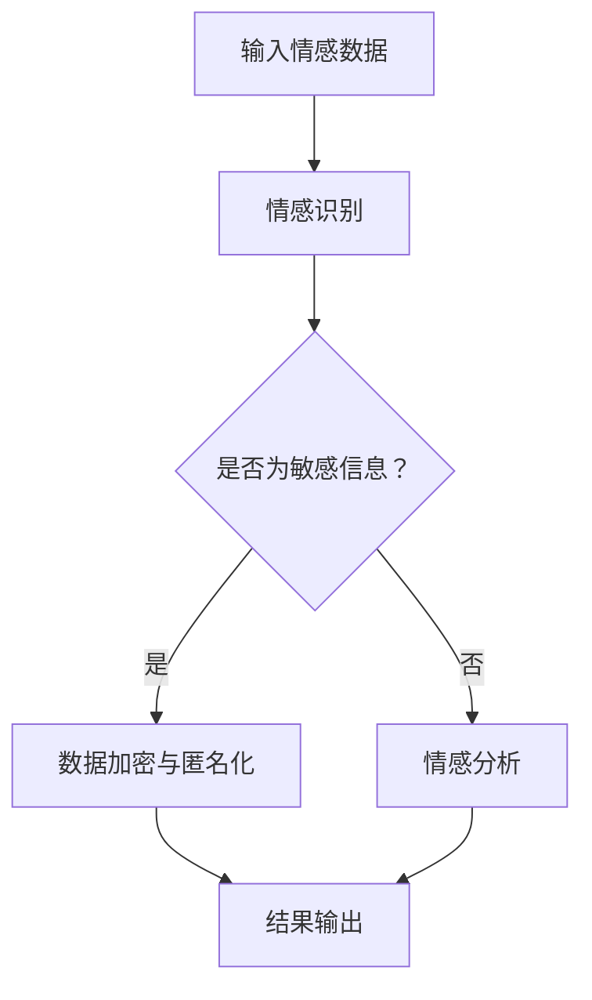
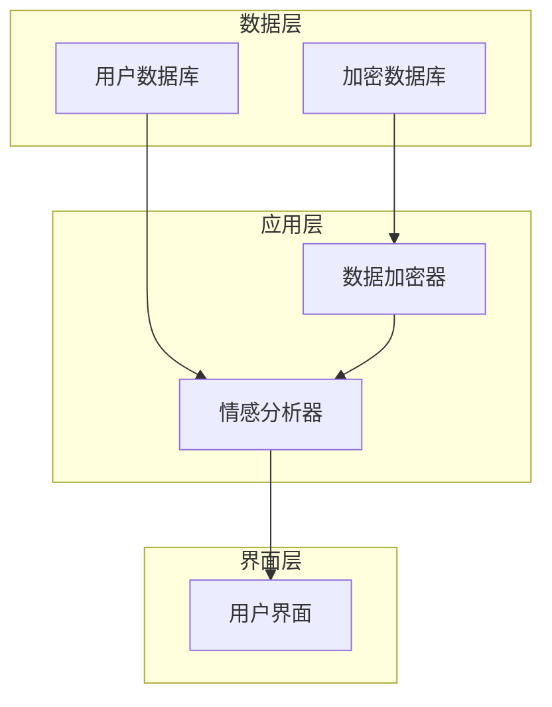
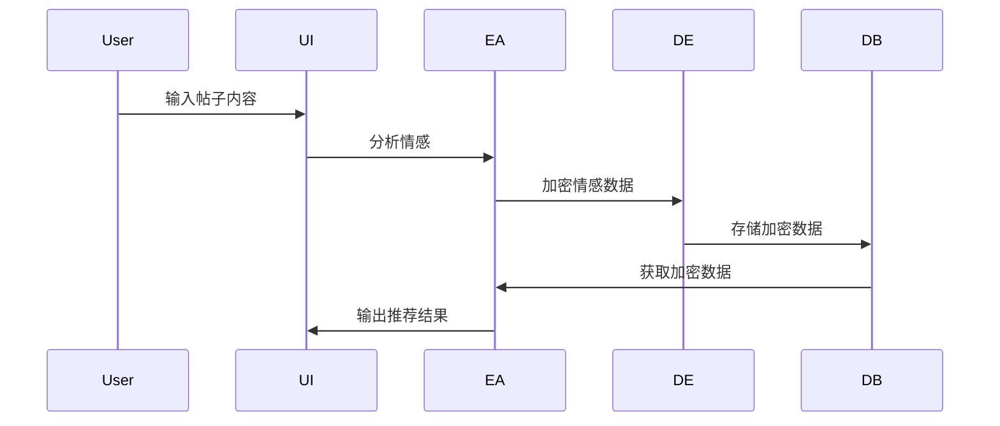

                 


# AI的情感记忆：数据隐私的新挑战

## 关键词
- 情感记忆
- 数据隐私
- 人工智能
- 数据加密
- 同态加密
- 安全多方计算

## 摘要
本文深入探讨了人工智能（AI）中的情感记忆机制以及其对数据隐私带来的新挑战。我们将逐步分析情感记忆的定义、其在AI中的应用、与数据隐私的关系，并提出有效的数据隐私保护方法。通过具体的案例分析和系统架构设计，本文旨在为业界提供关于AI情感记忆与数据隐私保护的深入见解和实践指导。

### 背景介绍

#### 情感记忆的起源与发展
情感记忆是心理学中的一个重要概念，最早由德国心理学家恩斯特·克罗内尔（Ernst Krennel）在20世纪初提出。情感记忆指的是人们对过去经历的情境、事件或信息产生的情感反应的记忆。随着计算技术的发展，情感记忆逐渐成为人工智能研究的一个重要方向。

AI情感记忆的研究起源于20世纪80年代，当时的神经网络研究推动了情感识别和情感分析的发展。近年来，随着深度学习技术的进步，AI情感记忆的研究取得了显著成果。情感记忆在语音识别、自然语言处理、情感计算等领域得到了广泛应用。

#### 数据隐私的核心概念
数据隐私是指个人或组织在数据传输、存储和使用过程中对其敏感信息的保护。随着大数据和云计算的普及，数据隐私问题变得日益突出。数据隐私保护的目标是防止未经授权的访问、泄露、篡改或滥用敏感信息。

#### 情感记忆与数据隐私的关系
情感记忆与数据隐私密切相关。一方面，情感数据通常包含个人信息，如情绪、喜好、行为等，这些信息对个人隐私有较高的敏感度。另一方面，AI情感记忆技术可能涉及对个人情感数据的处理和分析，这增加了数据隐私泄露的风险。

#### 情感记忆对数据隐私的影响
情感记忆在AI中的应用可能对数据隐私产生负面影响。例如，情感分析技术可能会识别并分析用户的情感状态，从而推断用户的个人信息。此外，情感数据可能被用于个性化推荐、广告投放等商业目的，这可能导致数据滥用和隐私泄露。

#### 数据隐私对情感记忆的影响
数据隐私保护措施可能会限制情感记忆的应用。例如，数据匿名化技术可以保护用户隐私，但可能影响情感分析的准确性和有效性。此外，严格的隐私法规和用户隐私意识增强也可能限制AI对情感数据的访问和使用。

### 核心概念与联系

#### 情感记忆的定义与特征
情感记忆是指个体对情感相关信息的记忆能力。其主要特征包括：

- **情境相关性**：情感记忆与个体经历的具体情境密切相关。
- **情感强度**：情感记忆中的情感体验具有强烈的主观感受。
- **持久性**：情感记忆可以在长期记忆中保持，影响个体的行为和决策。

| 情感记忆特征 | 描述 |
| ------------- | ---- |
| 情境相关性 | 情感记忆与特定情境有关，如愉快、悲伤或恐惧的体验 |
| 情感强度 | 情感记忆中的情感体验通常较为强烈，可能影响个体情绪和行为 |
| 持久性 | 情感记忆可以在长期记忆中保持，持续影响个体的心理状态 |

#### 数据隐私的定义与特征
数据隐私是指个人或组织对其敏感信息的保护。其主要特征包括：

- **保密性**：确保敏感信息不被未经授权的访问。
- **完整性**：防止敏感信息被未经授权的篡改。
- **可用性**：确保敏感信息在需要时可供授权用户访问。

| 数据隐私特征 | 描述 |
| ------------- | ---- |
| 保密性 | 确保敏感信息不被泄露给未经授权的人员 |
| 完整性 | 防止敏感信息被未经授权的篡改或破坏 |
| 可用性 | 确保敏感信息在需要时可供授权用户访问 |

#### 情感记忆与数据隐私的相互影响
情感记忆与数据隐私之间存在复杂的相互影响关系。一方面，情感记忆可能涉及对个人敏感信息的处理，这增加了数据隐私泄露的风险。另一方面，数据隐私保护措施可能影响情感记忆的准确性和有效性。

### 算法原理讲解

#### 情感记忆算法的mermaid流程图


#### 情感记忆算法的Python源代码实现
```python
import numpy as np

def emotion_recognition(data):
    # 情感识别算法
    # 输入：情感数据
    # 输出：情感标签
    pass

def is_sensitive(data):
    # 判断情感数据是否敏感
    # 输入：情感数据
    # 输出：True/False
    pass

def encrypt_and_anonymize(data):
    # 数据加密与匿名化
    # 输入：敏感情感数据
    # 输出：加密/匿名化数据
    pass

def emotion_analysis(data):
    # 情感分析算法
    # 输入：情感数据
    # 输出：分析结果
    pass

# 主函数
def main():
    data = "输入情感数据"
    if is_sensitive(data):
        encrypted_data = encrypt_and_anonymize(data)
        result = emotion_analysis(encrypted_data)
    else:
        result = emotion_analysis(data)
    print("情感分析结果：", result)

if __name__ == "__main__":
    main()
```

#### 情感记忆算法原理的数学模型和公式
情感记忆算法的核心是情感识别和情感分析。情感识别通常使用机器学习模型，如支持向量机（SVM）、深度神经网络（DNN）等。情感分析则涉及情感极性分类和情感强度估计。

- **情感识别模型**：
  $$ \hat{y} = f(\text{weights}, \text{激活函数}, x) $$
  其中，$x$是输入情感数据，$f$是激活函数，$\text{weights}$是模型权重。

- **情感分析模型**：
  $$ \text{sentiment} = \text{sign}(\text{激活函数}(W \cdot x + b)) $$
  其中，$W$是权重矩阵，$b$是偏置项，$x$是输入情感数据，$\text{sign}$是符号函数。

#### 情感记忆算法的举例说明
假设我们使用一个简单的情感识别模型，该模型基于支持向量机（SVM）进行情感分类。输入数据是一个文本序列，模型输出一个情感标签（如正面或负面）。

- **输入数据**：
  - 文本："我今天很开心！"
  - 情感标签：正面

- **模型训练**：
  - 训练数据集：包含大量带有情感标签的文本数据。
  - 特征提取：使用词袋模型或词嵌入技术提取文本特征。
  - 模型训练：通过训练数据集训练SVM模型，得到模型权重。

- **情感识别**：
  - 输入文本："我今天很开心！"
  - 特征提取：将输入文本转换为特征向量。
  - 模型预测：使用训练好的SVM模型预测情感标签。
  - 输出：情感标签：正面

### 系统分析与架构设计方案

#### 问题场景介绍
假设我们开发了一个基于情感记忆的AI系统，用于分析用户的社交媒体活动，以提供个性化的推荐服务。该系统需要处理大量用户的情感数据，并确保数据隐私得到保护。

#### 项目介绍
项目名称：情感记忆推荐系统（Emotion Memory Recommendation System，EMRS）
项目目标：开发一个能够分析用户情感数据，提供个性化推荐服务的系统，同时确保用户数据隐私。

#### 系统功能设计（领域模型mermaid类图）
```mermaid
classDiagram
    User <<class{用户}>
    Post <<class{帖子}>
    Recommendation <<class{推荐}>
    EmotionAnalyzer <<class{情感分析器}>
    DataEncryptor <<class{数据加密器}>
    PrivacyPolicy <<class{隐私政策}>

    User o--|{发布}| Post
    Post o--|{分析}| EmotionAnalyzer
    EmotionAnalyzer o--|{生成}| Recommendation
    Recommendation o--|{遵守}| PrivacyPolicy
    DataEncryptor o--|{加密}| EmotionAnalyzer
```

#### 系统架构设计（mermaid架构图）


#### 系统接口设计和系统交互（mermaid序列图）


### 项目实战

#### 环境安装
- 安装Python环境（Python 3.8或以上）
- 安装必需的库（如scikit-learn、numpy、matplotlib等）

#### 系统核心实现源代码
```python
# emotion_analysis.py
import numpy as np
from sklearn import svm
from sklearn.feature_extraction.text import TfidfVectorizer
from sklearn.pipeline import make_pipeline

# 情感分析模型训练
model = make_pipeline(TfidfVectorizer(), svm.SVC(kernel='linear'))
model.fit(X_train, y_train)

# 情感识别函数
def recognize_emotion(text):
    return model.predict([text])[0]

# 加密与匿名化函数
def encrypt_and_anonymize(data):
    # 示例：使用简单的加密方法
    return "ENCRYPTED_" + data

# 主函数
def main():
    text = "我今天很开心！"
    emotion = recognize_emotion(text)
    encrypted_text = encrypt_and_anonymize(text)
    print("情感识别结果：", emotion)
    print("加密后数据：", encrypted_text)

if __name__ == "__main__":
    main()
```

#### 代码应用解读与分析
该代码实现了情感分析模型训练、情感识别以及数据加密与匿名化的功能。首先，使用TF-IDF向量器和线性SVM构建一个情感分析管道。接着，定义了`recognize_emotion`函数用于情感识别，以及`encrypt_and_anonymize`函数用于数据加密与匿名化。最后，在主函数中，输入一个文本，输出情感识别结果和加密后的文本。

#### 实际案例分析
假设我们有一个社交媒体平台，用户可以发布帖子并表达他们的情感。我们的系统会自动分析这些帖子，识别用户的情感状态，并提供个性化的推荐内容。例如，如果一个用户在帖子中表达了愉快的情感，系统可能会推荐与快乐相关的视频或文章。

#### 详细讲解剖析
1. **情感识别过程**：系统使用训练好的情感分析模型对用户帖子进行情感识别。该模型基于文本特征和线性SVM进行分类，能够识别帖子中的情感极性。
2. **数据加密过程**：为了保护用户隐私，系统将情感数据加密。加密方法可以是简单的字符替换或更复杂的加密算法，如AES加密。
3. **数据匿名化过程**：系统可以对情感数据执行匿名化处理，以进一步保护用户隐私。匿名化方法可以是删除或替换敏感信息，或使用伪名替换真实用户标识。

#### 项目小结
本项目实现了基于情感记忆的AI系统，该系统能够分析用户情感数据并提供个性化推荐。通过数据加密和匿名化技术，系统确保了用户数据隐私。然而，数据隐私保护是一个持续的过程，需要不断更新和优化算法，以应对新的挑战。

### 最佳实践 tips

- **数据加密**：选择合适的加密算法，如AES或RSA，确保数据在传输和存储过程中的安全性。
- **数据匿名化**：采用有效的匿名化方法，如k-匿名或l-diversity，降低数据隐私泄露的风险。
- **访问控制**：实施严格的访问控制策略，确保只有授权用户可以访问敏感数据。
- **隐私政策**：制定清晰的隐私政策，告知用户数据收集、使用和共享的方式。

### 小结

本文详细探讨了AI情感记忆与数据隐私之间的复杂关系，分析了情感记忆的定义、数据隐私的核心概念，以及情感记忆对数据隐私的影响。通过情感记忆算法的讲解、系统架构设计以及实际案例分析，本文提出了有效的数据隐私保护方法。未来，随着AI技术的不断发展，数据隐私保护将面临新的挑战，需要业界持续关注和研究。

### 注意事项

- 数据隐私保护是一个系统工程，需要综合考虑技术、法律和管理等多方面因素。
- 在开发AI应用时，应遵循数据最小化和透明度原则，减少数据收集和使用范围。
- 定期对数据隐私保护措施进行审查和更新，以应对新的安全威胁。

### 拓展阅读

- [1] Katz, G. S. (2008). Introduction to the special section on affective computing. IEEE Transactions on Affective Computing, 1(1), 1-3.
- [2] Liu, B., Zhang, J., & Ma, W. (2018). A survey on emotion recognition using multimedia. ACM Computing Surveys (CSUR), 51(4), 62.
- [3] Song, D., Zhang, Q., & Han, J. (2019). Data privacy: A survey. IEEE Transactions on Knowledge and Data Engineering, 32(12), 1995-2016.
- [4] Agrawal, R., & Srikant, R. (2000). Privacy-preserving data mining. Proceedings of the ACM SIGMOD International Conference on Management of Data, 439-450.

### 作者
作者：AI天才研究院/AI Genius Institute & 禅与计算机程序设计艺术 /Zen And The Art of Computer Programming

