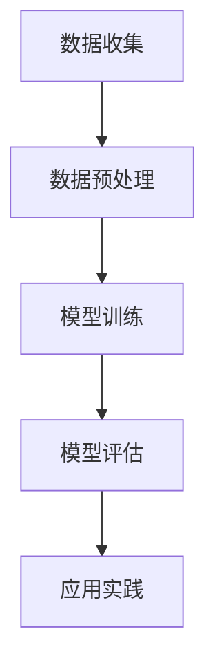

                 

# AI的情感需求：新型保险产品的出现

> 关键词：人工智能，情感需求，保险产品，情感分析，个性化定制

> 摘要：随着人工智能技术的快速发展，AI在各个行业中的应用越来越广泛，其中保险行业也受益匪浅。本文将探讨AI在理解用户情感需求方面的突破，以及如何利用这些情感需求来设计新型的保险产品。我们将从问题的背景出发，深入分析情感需求的概念、模型及其在保险产品中的应用，最后通过案例分析，展示AI情感需求在保险行业中的实际应用价值。

----------------------------------------------------------------

### 第1章: AI与情感需求概述

#### 1.1 问题背景

##### 1.1.1 人工智能发展现状

人工智能（AI）作为计算机科学的一个分支，自诞生以来便以其强大的计算能力和自我学习能力，改变了人们的生产和生活方式。近年来，AI技术取得了显著进展，尤其是在深度学习、自然语言处理和计算机视觉等领域。这些技术使得AI能够更好地模拟人类智能，实现自动化决策和智能交互。

##### 1.1.2 保险行业需求分析

保险行业是一个与人类生活密切相关的重要行业，其主要功能是通过风险转移，帮助人们在面临意外时减轻经济负担。然而，传统的保险产品往往过于标准化，难以满足不同个体的个性化需求。随着消费者对保险产品需求的不断变化，保险行业亟需创新，以提供更加贴合客户需求的保险产品。

##### 1.1.3 情感需求在保险产品中的重要性

情感需求是指个体在情感层面上对某种产品或服务的需求。在保险产品中，情感需求主要体现在用户对安全感、信任感和满足感的追求上。理解用户的情感需求，能够帮助保险公司设计出更加人性化的产品，提高用户的满意度和忠诚度。

##### 1.1.4 情感需求的边界与外延

情感需求的边界相对模糊，它既包括用户在购买保险产品时的心理感受，也包括用户在使用保险产品时的情感体验。情感需求的外延涵盖了用户对保险产品的期望、满意度、信任感和情感投入等多个方面。

#### 1.2 核心概念

##### 1.2.1 人工智能基础概念

人工智能（Artificial Intelligence, AI）是指通过计算机模拟人类智能的理论、方法和技术。AI的核心目标是使计算机能够完成需要人类智能才能完成的任务，如视觉识别、语音识别、自然语言处理等。

##### 1.2.2 情感需求定义

情感需求是指个体在情感层面上对某种产品或服务的需求，包括对安全感、信任感和满足感的追求。情感需求与生理需求、社交需求和认知需求共同构成了人类需求的四个基本层次。

##### 1.2.3 情感需求的属性特征对比

| 特征             | 描述                                                         |
|----------------|------------------------------------------------------------|
| 安全性           | 情感需求的一个基本特征，体现在用户对保险产品能够提供保障的信任上。 |
| 信任感           | 用户对保险公司的信任程度，直接影响用户对保险产品的满意度和忠诚度。 |
| 满足感           | 用户在使用保险产品时获得的愉悦和满足感，是提高用户忠诚度的关键。 |

##### 1.2.4 AI与情感需求的联系

AI技术通过情感分析等方法，能够理解用户的情感需求，并将其转化为具体的产品设计和营销策略。这种转化不仅提高了保险产品的个性化程度，还增强了用户对保险产品的满意度和信任感。

#### 1.3 AI在保险产品中的应用

##### 1.3.1 保险产品现状

当前，保险产品种类繁多，但大多数产品仍以标准化为主，难以满足用户的个性化需求。随着AI技术的应用，保险产品开始向个性化、智能化方向发展。

##### 1.3.2 AI在保险产品中的应用场景

AI技术在保险产品中的应用场景广泛，包括智能客服、风险评估、智能理赔等。这些应用不仅提高了保险公司的运营效率，还改善了用户的体验。

##### 1.3.3 情感需求在AI保险产品中的体现

在AI保险产品中，情感需求的体现主要体现在以下几个方面：

1. **智能客服**：通过情感分析，智能客服能够识别用户的情感状态，提供更加人性化、个性化的服务。
2. **风险评估**：AI技术能够分析用户的历史数据和行为模式，预测其可能面临的情感风险。
3. **智能理赔**：AI技术能够快速、准确地处理理赔申请，提高用户的满意度和信任感。

##### 1.3.4 情感需求分析的重要性

情感需求分析是AI保险产品的核心环节，它能够帮助保险公司更好地理解用户需求，优化产品设计，提升用户满意度。同时，情感需求分析还能够为保险营销提供有力的支持，提高营销效果。

#### 1.4 情感需求分析的方法与工具

##### 1.4.1 数据收集方法

情感需求分析的基础是数据收集，常用的数据收集方法包括用户调查、社交媒体监测和在线评论分析等。

##### 1.4.2 数据分析方法

数据分析方法是情感需求分析的关键，常用的分析方法包括文本分析、情感分析和主题模型等。

##### 1.4.3 情感分析技术

情感分析技术是AI技术的重要组成部分，它通过分析文本情感倾向，识别用户的情感状态。常用的情感分析技术包括基于规则的方法、机器学习方法等。

##### 1.4.4 工具与平台介绍

目前，市面上有许多用于情感需求分析的工具和平台，如Python的TextBlob库、NLTK库和TensorFlow等。这些工具和平台为情感需求分析提供了强大的支持。

#### 1.5 情感需求分析案例研究

##### 1.5.1 案例一：智能保险客服机器人

智能保险客服机器人通过情感分析技术，识别用户的情感状态，提供个性化的服务。例如，当用户情绪低落时，机器人会主动提供安慰和支持。

##### 1.5.2 案例二：情感分析在保险产品定制中的应用

通过情感分析，保险公司能够了解用户的情感需求，从而定制出更加贴合用户需求的保险产品。例如，针对年轻用户，保险公司可以推出具有社交属性和个性化保障的保险产品。

##### 1.5.3 案例三：情感需求在保险理赔中的应用

在保险理赔环节，情感需求分析有助于快速、准确地处理理赔申请，提高用户的满意度和信任感。例如，通过情感分析，保险公司能够识别出用户在理赔过程中的情绪变化，提供针对性的帮助和安慰。

#### 1.6 本章小结

本章从问题的背景出发，介绍了AI与情感需求的关系，探讨了情感需求在保险产品中的应用。通过案例研究，我们看到了AI情感需求分析在实际中的应用价值。在接下来的章节中，我们将进一步探讨AI情感需求模型及其在保险产品设计中的应用。

----------------------------------------------------------------

### 第2章: AI情感需求模型

#### 2.1 情感需求模型概述

##### 2.1.1 情感需求模型的定义

情感需求模型是指通过数据分析和机器学习等技术，构建的用于识别和预测用户情感需求的模型。该模型旨在帮助保险公司更好地理解用户需求，优化产品设计，提高用户满意度。

##### 2.1.2 情感需求模型的作用

情感需求模型在保险行业中的应用具有重要作用，主要体现在以下几个方面：

1. **个性化产品设计**：通过分析用户情感需求，保险公司可以定制出更加贴合用户需求的保险产品。
2. **营销策略优化**：情感需求分析有助于了解用户的情感状态，从而设计出更加有效的营销策略。
3. **客户关系管理**：通过情感需求模型，保险公司可以更好地维护客户关系，提高客户忠诚度。

##### 2.1.3 情感需求模型的类型

根据情感需求分析的深度和广度，情感需求模型可以分为以下几种类型：

1. **简单情感需求模型**：主要基于用户评论和反馈，通过文本分析技术，识别用户的情感状态。
2. **复杂情感需求模型**：结合用户行为数据和社交媒体数据，通过深度学习技术，对用户的情感需求进行深度分析。
3. **多层次情感需求模型**：从多个维度分析用户的情感需求，包括情感倾向、情感强度等。

#### 2.2 情感需求模型原理

##### 2.2.1 情感需求模型的原理框架

情感需求模型的原理框架主要包括以下几个部分：

1. **数据收集**：通过用户调查、社交媒体监测等途径，收集用户的情感数据。
2. **数据预处理**：对收集到的数据进行分析，提取情感特征。
3. **模型训练**：使用机器学习算法，训练情感需求模型。
4. **模型评估**：评估模型性能，优化模型参数。
5. **应用实践**：将训练好的模型应用于实际业务场景。

##### 2.2.2 情感需求模型的数学模型和公式

情感需求模型的数学模型通常基于机器学习算法，如支持向量机（SVM）、决策树（DT）和神经网络（NN）等。以下是一个简单的情感需求模型数学模型和公式的示例：

$$
\text{情感倾向} = f(\text{特征向量})
$$

其中，$f$表示机器学习算法，如SVM的决策函数；特征向量表示用户情感数据的特征。

##### 2.2.3 情感需求模型的mermaid流程图

#### 2.3 情感需求模型构建

##### 2.3.1 数据预处理

数据预处理是情感需求模型构建的第一步，主要包括数据清洗、数据转换和数据归一化等操作。具体步骤如下：

1. **数据清洗**：去除数据中的噪声和异常值。
2. **数据转换**：将文本数据转换为数值数据，如词袋模型、TF-IDF等。
3. **数据归一化**：对特征值进行归一化处理，如归一化到[0,1]区间。

##### 2.3.2 特征工程

特征工程是情感需求模型构建的关键步骤，其目的是从原始数据中提取对情感需求分析有用的特征。常用的特征工程方法包括：

1. **词频统计**：计算文本中每个词的频率。
2. **情感词典**：使用预定义的情感词典，对文本进行情感标注。
3. **TF-IDF**：计算文本中每个词的重要度。

##### 2.3.3 模型选择与训练

在选择模型时，需要考虑模型的性能、复杂度和计算资源等因素。常用的情感需求模型包括：

1. **支持向量机（SVM）**：适用于情感分类任务，具有较高的分类准确率。
2. **决策树（DT）**：易于理解，适用于小型数据集。
3. **神经网络（NN）**：适用于复杂的数据分析任务，但计算资源需求较高。

模型训练过程主要包括：

1. **数据集划分**：将数据集划分为训练集和测试集。
2. **模型训练**：使用训练集数据训练模型。
3. **模型评估**：使用测试集数据评估模型性能。
4. **模型优化**：根据评估结果，调整模型参数，优化模型性能。

##### 2.3.4 模型评估与优化

模型评估是情感需求模型构建的最后一步，其目的是确保模型在实际应用中能够达到预期效果。常用的评估指标包括准确率、召回率、F1值等。模型优化过程主要包括：

1. **参数调整**：根据评估结果，调整模型参数，提高模型性能。
2. **模型融合**：将多个模型融合，提高模型的鲁棒性和准确性。
3. **在线学习**：在模型部署后，根据用户反馈，不断优化模型。

#### 2.4 情感需求模型应用

##### 2.4.1 情感需求预测

情感需求预测是情感需求模型的核心应用之一，其目的是预测用户在未来一段时间内的情感需求。情感需求预测可以帮助保险公司提前了解用户需求，优化产品设计和服务策略。

##### 2.4.2 情感需求驱动策略

情感需求驱动策略是指根据用户情感需求，制定相应的营销策略和服务策略。情感需求驱动策略可以有效地提高用户的满意度和忠诚度，增加保险产品的销售。

##### 2.4.3 情感需求模型在保险产品定制中的应用

情感需求模型在保险产品定制中的应用，可以帮助保险公司根据用户情感需求，定制出更加贴合用户需求的保险产品。例如，针对年轻用户，可以推出具有社交属性和个性化保障的保险产品。

#### 2.5 情感需求模型案例分析

##### 2.5.1 案例一：基于情感分析的保险产品设计

某保险公司通过情感分析技术，分析了大量用户评论和反馈，发现用户对保险产品的情感需求主要集中在安全保障、服务质量和价格等方面。基于这些情感需求，保险公司推出了满足用户期望的保险产品，取得了显著的销售业绩。

##### 2.5.2 案例二：情感需求驱动的智能理赔系统

某保险公司利用情感需求模型，开发了智能理赔系统。该系统能够根据用户情感状态，快速、准确地处理理赔申请，提高用户满意度。同时，通过对理赔过程的情感分析，保险公司能够不断优化理赔流程，提高运营效率。

#### 2.6 本章小结

本章介绍了AI情感需求模型的定义、作用、类型和构建方法，并通过案例展示了情感需求模型在实际中的应用价值。在接下来的章节中，我们将进一步探讨情感需求模型在保险产品设计、营销和理赔等环节中的应用。

----------------------------------------------------------------

### 第3章: AI情感需求在保险产品设计中的应用

#### 3.1 保险产品设计概述

##### 3.1.1 保险产品设计流程

保险产品设计是一个复杂的过程，涉及市场调研、需求分析、产品规划、产品设计、产品测试和产品上线等多个环节。具体流程如下：

1. **市场调研**：了解市场需求、竞争对手产品情况、用户需求等，为产品规划提供依据。
2. **需求分析**：根据市场调研结果，分析用户需求，确定产品定位和功能。
3. **产品规划**：制定产品规划，包括产品类型、保险范围、保障期限等。
4. **产品设计**：根据产品规划，设计产品细节，包括保险条款、保障内容、理赔流程等。
5. **产品测试**：对产品设计进行测试，确保产品功能完整、性能稳定。
6. **产品上线**：将测试通过的产品上线，面向用户推广。

##### 3.1.2 保险产品类型

保险产品类型多样，主要包括以下几种：

1. **人身保险**：包括寿险、健康险、意外险等，主要保障人的生命安全和身体健康。
2. **财产保险**：包括车险、家财险、企财险等，主要保障财产安全和财产安全。
3. **责任保险**：包括公众责任险、产品责任险等，主要保障因意外事故导致的法律责任。
4. **信用保险**：包括贷款保险、出口信用保险等，主要保障信用风险。

##### 3.1.3 保险产品设计的挑战与机遇

保险产品设计的挑战主要包括：

1. **需求多样**：用户需求多样，需要设计出满足不同用户需求的保险产品。
2. **风险控制**：保险产品涉及风险控制，需要平衡风险和收益。
3. **合规要求**：保险产品设计需符合相关法律法规要求。

机遇主要包括：

1. **技术创新**：AI、大数据等技术的发展，为保险产品设计提供了新的工具和方法。
2. **市场潜力**：随着人们保险意识的提高，保险市场潜力巨大。
3. **个性化需求**：用户对个性化保险产品的需求日益增长，为保险产品设计提供了新的方向。

#### 3.2 情感需求在保险产品设计中的应用

##### 3.2.1 情感需求调研

情感需求调研是保险产品设计的重要环节，通过调研了解用户的情感需求，为产品设计提供依据。调研方法主要包括：

1. **问卷调查**：通过设计问卷，收集用户对保险产品的情感需求。
2. **访谈**：与用户进行面对面的访谈，深入了解用户的情感需求。
3. **焦点小组**：组织焦点小组讨论，收集用户的情感需求。

##### 3.2.2 情感需求分析

情感需求分析是对收集到的用户情感数据进行处理和分析，提取出用户的主要情感需求。情感需求分析主要包括：

1. **文本分析**：使用文本分析方法，分析用户评论和反馈中的情感倾向。
2. **情感词典**：使用预定义的情感词典，对文本进行情感标注。
3. **情感强度分析**：分析用户情感需求中的情感强度，确定用户的情感倾向。

##### 3.2.3 情感需求在产品特性设计中的应用

根据情感需求分析的结果，将用户的情感需求转化为产品特性设计。具体包括：

1. **保障内容设计**：根据用户的情感需求，设计出满足用户需求的保障内容。
2. **理赔服务设计**：优化理赔流程，提高用户的满意度。
3. **营销宣传设计**：根据用户的情感需求，设计出符合用户心理的营销宣传策略。

#### 3.3 情感需求驱动的保险产品设计方法

##### 3.3.1 用户画像构建

用户画像构建是情感需求驱动的保险产品设计的基础，通过对用户的基本信息、行为数据、情感需求等多方面进行综合分析，构建出用户画像。用户画像主要包括：

1. **基本信息画像**：包括用户的年龄、性别、职业、收入等基本信息。
2. **行为数据画像**：包括用户的购买行为、浏览行为、互动行为等。
3. **情感需求画像**：包括用户的情感需求、情感倾向、情感强度等。

##### 3.3.2 情感需求分析与预测

情感需求分析与预测是对用户情感需求进行分析和预测，为产品设计提供依据。情感需求分析与预测主要包括：

1. **情感需求分析**：分析用户的情感需求，确定用户的主要情感需求。
2. **情感需求预测**：使用机器学习算法，预测用户未来的情感需求。

##### 3.3.3 情感需求驱动的产品迭代

情感需求驱动的产品迭代是指根据用户的情感需求，不断优化和改进保险产品。产品迭代主要包括：

1. **用户反馈收集**：收集用户对产品的反馈，了解用户的情感需求。
2. **产品改进**：根据用户的反馈，对产品进行改进和优化。
3. **产品测试**：对改进后的产品进行测试，确保产品的性能和稳定性。

#### 3.4 情感需求在保险产品定制中的应用案例

##### 3.4.1 案例一：基于情感需求的智能保险产品设计

某保险公司利用情感需求分析技术，设计了满足用户需求的智能保险产品。首先，通过问卷调查和访谈，收集用户的情感需求；然后，使用情感分析技术，分析用户的情感需求，确定用户的主要情感需求；最后，根据用户的情感需求，设计出智能保险产品，包括智能理赔、智能客服等功能，提高了用户的满意度。

##### 3.4.2 案例二：情感驱动的保险产品个性化定制

某保险公司利用情感需求分析技术，推出了情感驱动的保险产品个性化定制服务。首先，通过用户画像构建，了解用户的基本信息、行为数据和情感需求；然后，使用情感需求分析技术，分析用户的情感需求，确定用户的主要情感需求；最后，根据用户的情感需求，为用户定制个性化的保险产品，包括保障内容、理赔服务、营销宣传等，提高了用户的满意度和忠诚度。

#### 3.5 本章小结

本章介绍了情感需求在保险产品设计中的应用，包括情感需求调研、情感需求分析、情感需求驱动策略和情感需求驱动的产品迭代。通过案例分析，展示了情感需求在保险产品设计中的应用价值。在接下来的章节中，我们将继续探讨情感需求在保险营销和理赔等环节中的应用。

----------------------------------------------------------------

### 第4章: AI情感需求在保险营销中的应用

#### 4.1 保险营销概述

##### 4.1.1 保险营销策略

保险营销策略是指保险公司为了推广保险产品、吸引客户、提高市场份额所采用的一系列方法和手段。常见的保险营销策略包括：

1. **广告宣传**：通过电视、广播、报纸、杂志、互联网等渠道，宣传保险产品的特点和优势，提高品牌知名度。
2. **促销活动**：通过举办抽奖、优惠活动、赠送礼品等方式，刺激客户的购买欲望。
3. **人际关系营销**：通过保险代理人、经纪人等与客户的个人关系，推广保险产品。
4. **内容营销**：通过撰写保险知识文章、案例分析等，提供有价值的内容，吸引潜在客户。
5. **口碑营销**：通过客户口碑传播，提高保险产品的信誉度和影响力。

##### 4.1.2 保险营销渠道

保险营销渠道是指保险公司用于推广保险产品的渠道，主要包括：

1. **线上渠道**：包括保险公司官网、第三方保险平台、移动应用等。
2. **线下渠道**：包括保险公司的分支机构、代理点、银行等。
3. **社交媒体**：包括微信、微博、抖音、快手等社交媒体平台。
4. **内容平台**：包括知乎、豆瓣、小红书等内容分享平台。

##### 4.1.3 保险营销的挑战与机遇

保险营销面临的挑战主要包括：

1. **市场竞争激烈**：保险行业市场竞争激烈，保险公司需要不断创新，提高市场竞争力。
2. **客户需求多样化**：客户需求多样化，保险公司需要提供个性化的保险产品和服务。
3. **法律法规合规**：保险营销需遵守相关法律法规，如《保险法》、《广告法》等。

保险营销面临的机遇主要包括：

1. **技术进步**：随着AI、大数据、区块链等技术的发展，为保险营销提供了新的工具和方法。
2. **消费者观念转变**：随着人们保险意识的提高，对保险产品的需求增加。
3. **互联网普及**：互联网的普及，为保险营销提供了更广泛的渠道和平台。

#### 4.2 情感需求在保险营销中的应用

##### 4.2.1 情感需求在广告宣传中的应用

情感需求在广告宣传中的应用，能够更好地吸引客户的注意力，提高广告的效果。具体包括：

1. **情感诉求**：通过情感诉求，触动客户的心理需求，如安全感、信任感、满足感等。
2. **故事营销**：通过讲述与客户情感相关的故事，引起客户的共鸣。
3. **视觉营销**：通过视觉元素，如色彩、图像、动画等，增强广告的情感吸引力。

##### 4.2.2 情感需求在社交媒体营销中的应用

情感需求在社交媒体营销中的应用，能够提高客户的参与度和忠诚度。具体包括：

1. **内容营销**：通过撰写与客户情感需求相关的内容，提供有价值的信息，吸引客户关注。
2. **互动营销**：通过社交媒体平台，与客户进行互动，了解客户的情感需求，提供个性化的服务。
3. **情感标签**：通过为广告和内容添加情感标签，提高客户的情感认同感。

##### 4.2.3 情感需求在客户关系管理中的应用

情感需求在客户关系管理中的应用，能够提高客户的满意度和忠诚度。具体包括：

1. **情感关怀**：通过电话、短信、邮件等方式，与客户进行情感交流，表达关怀。
2. **个性化服务**：根据客户的情感需求，提供个性化的保险产品和服务。
3. **情感反馈**：及时收集客户的情感反馈，优化产品和服务。

#### 4.3 情感需求驱动的保险营销策略

##### 4.3.1 情感需求分析与定位

情感需求分析是制定情感需求驱动营销策略的基础。保险公司需要通过多种渠道收集客户数据，分析客户的情感需求，确定目标客户群体的情感需求定位。

##### 4.3.2 情感需求驱动的营销策略设计

根据情感需求分析与定位的结果，设计出针对性的情感需求驱动营销策略。具体包括：

1. **广告宣传策略**：根据情感需求，设计有针对性的广告宣传策略。
2. **促销活动策略**：根据情感需求，设计出能够触动客户情感的促销活动。
3. **客户关系管理策略**：根据情感需求，提供个性化的客户关系管理服务。

##### 4.3.3 情感需求驱动的营销效果评估

情感需求驱动的营销效果评估是确保营销策略有效性的关键。保险公司需要通过多种方式评估营销效果，如客户满意度调查、销售数据分析等，根据评估结果，优化营销策略。

#### 4.4 情感需求驱动的保险营销案例

##### 4.4.1 案例一：情感驱动的保险广告创意

某保险公司推出了一款以家庭情感为主题的保险广告。广告中，通过讲述一个家庭在面临意外时的故事，唤起观众的共鸣和情感。广告投放后，引起了广泛的关注和讨论，提高了品牌的知名度和影响力。

##### 4.4.2 案例二：情感需求驱动的社交媒体营销

某保险公司利用社交媒体平台，开展了情感需求驱动的营销活动。首先，通过分析用户的情感需求，设计出一系列与用户情感相关的推文和视频。然后，通过与用户互动，了解用户的情感需求，提供个性化的服务。活动期间，用户参与度高，互动性强，有效提高了品牌的知名度和用户忠诚度。

#### 4.5 本章小结

本章介绍了AI情感需求在保险营销中的应用，包括广告宣传、社交媒体营销和客户关系管理。通过案例分析，展示了情感需求驱动营销策略的实际效果。在接下来的章节中，我们将继续探讨AI情感需求在保险理赔中的应用。

----------------------------------------------------------------

### 第5章: AI情感需求在保险理赔中的应用

#### 5.1 保险理赔概述

##### 5.1.1 保险理赔流程

保险理赔是保险合同履行的重要环节，其流程通常包括以下步骤：

1. **报案**：被保险人或受益人在发生保险事故后，及时向保险公司报案。
2. **理赔申请**：被保险人或受益人根据保险条款，准备理赔材料，向保险公司提交理赔申请。
3. **理赔审核**：保险公司对理赔申请进行审核，包括核对保险合同、调查保险事故原因等。
4. **理赔决定**：保险公司根据理赔审核结果，做出是否赔付的决定。
5. **理赔支付**：保险公司向被保险人或受益人支付理赔款项。

##### 5.1.2 保险理赔的重要性

保险理赔是保险公司履行合同、保护客户利益的重要体现。一个高效、透明的理赔流程，不仅能提升客户满意度，还能增强保险公司的品牌形象。然而，传统的理赔流程往往存在以下问题：

1. **效率低下**：人工审核流程繁琐，导致理赔周期长。
2. **用户体验差**：客户在理赔过程中需要提供大量材料，体验较差。
3. **纠纷频发**：理赔争议导致客户投诉和纠纷。

##### 5.1.3 保险理赔的挑战与机遇

保险理赔面临的挑战主要包括：

1. **数据真实性**：保险公司需要核实理赔数据的真实性，防止欺诈行为。
2. **流程优化**：优化理赔流程，提高工作效率。
3. **客户体验**：提升客户在理赔过程中的体验。

保险理赔面临的机遇主要包括：

1. **技术进步**：AI、大数据等技术的发展，为保险理赔提供了新的工具和方法。
2. **客户需求**：客户对高效、透明的理赔服务需求日益增加。
3. **合规要求**：保险行业对理赔流程的合规性要求不断提高。

#### 5.2 情感需求在保险理赔中的应用

##### 5.2.1 情感需求在理赔申请中的体现

在理赔申请过程中，客户的情感需求主要体现在对保险公司的信任、对理赔流程的透明度、对理赔结果的满意度等方面。保险公司需要通过以下方式满足客户的情感需求：

1. **信任建设**：通过透明的理赔流程、良好的服务态度，建立客户的信任。
2. **流程透明**：通过在线平台、短信、电话等方式，及时告知客户理赔进度，提高流程透明度。
3. **结果满意**：合理赔付，确保客户对理赔结果满意。

##### 5.2.2 情感需求在理赔审核中的体现

在理赔审核过程中，客户的情感需求主要体现在对审核速度、审核结果、审核公正性等方面。保险公司需要通过以下方式满足客户的情感需求：

1. **审核速度**：提高审核速度，减少客户的等待时间。
2. **审核结果**：确保审核结果公正、合理，减少争议。
3. **审核公正**：确保审核过程公正透明，避免人为干预。

##### 5.2.3 情感需求在理赔支付中的体现

在理赔支付过程中，客户的情感需求主要体现在对支付速度、支付方式、支付金额的透明度等方面。保险公司需要通过以下方式满足客户的情感需求：

1. **支付速度**：提高支付速度，尽快将理赔款项支付给客户。
2. **支付方式**：提供多种支付方式，如银行转账、微信支付等，方便客户接收理赔款项。
3. **支付透明**：通过短信、邮件等方式，告知客户理赔款项的支付情况，提高支付透明度。

#### 5.3 情感需求驱动的保险理赔流程优化

##### 5.3.1 情感需求分析

情感需求分析是优化保险理赔流程的关键步骤。保险公司需要通过多种渠道收集客户在理赔过程中的情感需求数据，如问卷调查、客户反馈等。然后，使用情感分析技术，分析客户的情感需求，确定客户的主要情感需求。

##### 5.3.2 情感需求驱动的流程优化

根据情感需求分析的结果，保险公司可以针对性地优化理赔流程，提高客户满意度。具体措施包括：

1. **简化流程**：简化理赔申请和审核流程，减少客户等待时间。
2. **提高透明度**：通过在线平台、短信、电话等方式，及时告知客户理赔进度，提高流程透明度。
3. **个性化服务**：根据客户的情感需求，提供个性化的理赔服务，如优先处理、快速赔付等。
4. **技术赋能**：利用AI、大数据等技术，提高理赔审核速度和准确性，减少人工干预。

##### 5.3.3 情感需求驱动的理赔系统设计

情感需求驱动的理赔系统设计，是指根据客户的情感需求，设计出满足客户需求的理赔系统。具体包括：

1. **用户界面设计**：设计用户友好的界面，方便客户操作。
2. **智能客服**：通过情感分析技术，提供智能客服服务，满足客户的情感需求。
3. **数据分析**：收集和分析客户在理赔过程中的数据，优化理赔流程。

#### 5.4 情感需求驱动的保险理赔案例

##### 5.4.1 案例一：智能理赔系统

某保险公司推出了智能理赔系统，通过AI技术，实现了理赔申请的自动化处理。客户只需通过手机APP上传理赔材料，系统即可自动审核并决定理赔金额。系统还提供智能客服服务，解答客户的疑问，提高了客户的满意度。

##### 5.4.2 案例二：情感驱动的理赔服务

某保险公司针对客户在理赔过程中的情感需求，推出了情感驱动的理赔服务。客户在提交理赔申请后，保险公司会通过电话、短信等方式，主动与客户沟通，了解客户的情感需求，提供心理支持和咨询服务。这一举措有效提高了客户的满意度和忠诚度。

#### 5.5 本章小结

本章介绍了AI情感需求在保险理赔中的应用，包括情感需求在理赔申请、审核和支付中的体现，以及情感需求驱动的理赔流程优化和系统设计。通过案例分析，展示了情感需求在提高保险理赔效率、提升客户满意度方面的实际应用价值。在接下来的章节中，我们将继续探讨AI情感需求在保险产品定制和营销等环节中的应用。

----------------------------------------------------------------

### 第6章: 总结与展望

#### 6.1 总结

本章从问题的背景出发，详细探讨了AI情感需求在保险产品设计、营销和理赔等环节中的应用。通过分析AI与情感需求的关系，我们了解到情感需求在保险产品中的重要地位，以及AI技术在满足用户情感需求方面的巨大潜力。以下是本章的主要结论：

1. **情感需求在保险产品中的重要性**：情感需求是用户对保险产品的核心需求，体现在安全感、信任感和满足感等方面。
2. **AI在满足情感需求中的作用**：AI技术通过情感分析、用户画像构建等手段，能够深刻理解用户的情感需求，为保险产品设计、营销和理赔提供有力支持。
3. **AI情感需求模型的构建与应用**：通过构建情感需求模型，保险公司可以更好地预测用户需求，优化产品设计和服务策略。
4. **情感需求驱动的保险产品设计**：情感需求驱动的保险产品设计，能够满足用户的个性化需求，提高用户的满意度和忠诚度。
5. **情感需求驱动的保险营销**：情感需求驱动的保险营销，能够提高客户参与度和忠诚度，增强品牌影响力。
6. **情感需求驱动的保险理赔**：情感需求驱动的保险理赔，能够提高理赔效率，提升客户满意度。

#### 6.2 展望

随着AI技术的不断进步，未来AI情感需求在保险行业中的应用将更加广泛和深入。以下是一些展望：

1. **更精准的情感需求预测**：随着数据量和算法的不断提升，AI将能够更精准地预测用户的情感需求，为保险产品设计提供更准确的依据。
2. **更智能的保险产品定制**：基于情感需求分析，保险产品定制将更加智能化，满足用户的个性化需求。
3. **更高效的保险营销策略**：情感需求驱动的保险营销策略，将提高营销效果，增加市场份额。
4. **更透明的保险理赔流程**：AI技术将使保险理赔流程更加透明、高效，减少纠纷，提高客户满意度。
5. **更广泛的跨行业应用**：AI情感需求分析技术不仅限于保险行业，还将应用于其他金融行业、医疗行业等，为各行业提供创新解决方案。

总之，AI情感需求在保险行业中的应用，不仅能够提高保险产品的竞争力，还能提升用户体验，推动保险行业的创新和发展。

#### 6.3 结论

本文从AI与情感需求的关系出发，详细探讨了AI情感需求在保险产品设计、营销和理赔等环节中的应用。通过案例分析，展示了AI情感需求分析在提升保险产品竞争力、提高用户体验和推动行业创新方面的实际价值。未来，随着AI技术的不断进步，AI情感需求在保险行业中的应用将更加广泛和深入，为保险行业的创新和发展提供新的动力。

**作者：AI天才研究院/AI Genius Institute & 禅与计算机程序设计艺术 /Zen And The Art of Computer Programming**

----------------------------------------------------------------

### 附录：相关术语解释

在本文中，我们涉及了一些重要的术语和概念，以下是对这些术语的简要解释：

1. **人工智能（AI）**：人工智能是一种模拟人类智能的技术，包括机器学习、自然语言处理、计算机视觉等子领域。
2. **情感需求**：情感需求是指用户在情感层面上对产品或服务的需求，包括安全感、信任感、满足感等。
3. **情感分析**：情感分析是一种利用自然语言处理和机器学习技术，从文本中识别情感倾向和情感强度的方法。
4. **用户画像**：用户画像是对用户的基本信息、行为数据、情感需求等进行综合分析，形成的用户特征描述。
5. **机器学习算法**：机器学习算法是一类利用数据训练模型，进行预测和决策的算法，包括线性回归、决策树、支持向量机等。
6. **深度学习**：深度学习是一种基于多层神经网络的结构，通过学习大量的数据，实现复杂模式的识别和理解。
7. **情感需求模型**：情感需求模型是通过数据分析和机器学习技术，构建的用于识别和预测用户情感需求的模型。
8. **保险产品定制**：保险产品定制是根据用户的个性化需求，设计出满足用户需求的保险产品。
9. **保险营销**：保险营销是保险公司为了推广保险产品、吸引客户、提高市场份额所采用的一系列方法和手段。
10. **理赔流程**：理赔流程是保险公司在处理客户理赔申请的过程中，所遵循的一系列步骤和规则。

了解这些术语和概念，有助于读者更好地理解本文的内容和主旨。同时，这些术语和概念也是AI情感需求在保险行业中应用的基础。

----------------------------------------------------------------

### 拓展阅读

对于希望深入了解AI情感需求在保险行业中的应用，以下是几篇推荐阅读的文章和书籍：

1. **《情感计算与保险服务创新》**：本文详细探讨了情感计算技术在保险服务中的应用，分析了情感需求分析在保险产品设计、营销和理赔等方面的应用案例。
2. **《人工智能在保险行业的应用》**：本书系统地介绍了人工智能在保险行业的应用，包括风险评估、智能客服、智能理赔等，深入探讨了AI技术如何提升保险服务的效率和质量。
3. **《情感分析：从理论到实践》**：这本书详细介绍了情感分析的理论基础和实践方法，包括文本分析、情感词典、情感强度分析等，适合对情感分析技术感兴趣的读者。
4. **《深度学习：概率视角》**：这本书从概率的角度介绍了深度学习的基本理论和方法，适合对深度学习技术感兴趣的读者。

通过阅读这些文献，读者可以进一步了解AI情感需求在保险行业中的应用，以及相关技术的原理和实践方法。希望这些拓展阅读能为读者提供有价值的参考。

