                 

### 第1章: 引言

#### 1.1 问题的背景

在当今快速发展的信息技术时代，人工智能（AI）已经成为推动各行各业变革的重要力量。特别是在服务业领域，AI的应用不仅提高了效率，还带来了全新的服务体验。然而，随着服务质量的提升，消费者对于服务的情感需求也日益凸显。这种情感需求不仅仅是简单的满意度调查，而是涵盖了消费者在服务过程中所期望的个性化、情感化、共鸣化的体验。

传统服务业主要依赖于人力和经验，难以全面满足消费者的多样化情感需求。随着服务水平的提升和消费者期望的不断提高，服务业面临着巨大的挑战。如何利用AI技术来处理和理解消费者的情感需求，成为当前服务业转型中亟待解决的问题。

#### 1.2 问题的描述

AI的情感需求指的是通过人工智能技术来识别、分析和处理消费者的情感状态，从而提供更加个性化、贴心的服务。具体来说，这包括以下几个方面：

1. **情感识别**：通过自然语言处理、面部识别等技术，准确识别消费者的情感状态。
2. **情感分析**：对消费者的情感数据进行处理，分析其情感倾向和需求。
3. **情感响应**：根据分析结果，提供相应的情感化服务，如个性化推荐、情感化的沟通等。
4. **情感反馈**：通过消费者的反馈，不断优化AI系统的情感处理能力。

#### 1.3 问题的解决

为了解决上述问题，我们需要从以下几个方面入手：

1. **技术创新**：研发和引入先进的AI技术，如深度学习、自然语言处理、情感计算等，以提高情感识别和分析的准确性和效率。
2. **数据驱动**：积累和利用大量的消费者情感数据，通过大数据分析和机器学习算法，深入挖掘消费者的情感需求。
3. **用户体验设计**：结合用户研究和行为分析，设计出更加贴近消费者需求的情感化服务。
4. **系统整合**：将AI技术与服务系统整合，实现全流程的情感化服务。

#### 1.4 边界与外延

情感需求处理是一个跨学科的领域，它涉及到心理学、计算机科学、服务管理等多个方面。在具体应用中，需要明确以下几点边界：

1. **情感识别的边界**：情感的识别范围和深度，例如是否能够识别微表情、情感强度等。
2. **情感分析的外延**：情感分析的结果和应用范围，如情感分类、情感预测等。
3. **情感响应的边界**：系统对于不同情感状态应提供的响应类型和方式。
4. **情感反馈的机制**：消费者反馈机制的设计和实现，如满意度调查、情感反馈收集等。

#### 1.5 概念结构与核心要素组成

为了更好地理解AI情感需求，我们需要构建其概念结构和核心要素组成：

1. **核心概念**：情感需求、情感识别、情感分析、情感响应、情感反馈。
2. **关联关系**：情感需求通过识别、分析、响应和反馈形成闭环，不断优化服务体验。
3. **技术支撑**：自然语言处理、面部识别、大数据分析、机器学习等AI技术。
4. **服务系统**：零售业、酒店业、餐饮业等服务业中的应用场景。

在接下来的章节中，我们将详细探讨AI情感需求的定义与分类、核心技术、应用实例以及未来发展，帮助读者全面了解这一新兴领域。

---

**核心概念与联系**

AI情感需求是近年来随着AI技术的快速发展而逐渐兴起的一个领域，它涉及到多个学科的知识和技术。以下是AI情感需求的一些核心概念及其联系：

1. **情感需求**：指消费者在服务过程中期望得到的情感体验，包括情感共鸣、情感支持、情感关怀等。情感需求是驱动服务业变革的重要力量，它要求服务系统能够识别和理解消费者的情感状态。

2. **情感识别**：指通过技术手段，如自然语言处理、面部识别等，识别消费者的情感状态。情感识别是AI情感需求处理的基础，它决定了系统对消费者情感需求的识别准确性和深度。

3. **情感分析**：指对识别到的情感数据进行分析和处理，以提取消费者的情感特征和需求。情感分析是对情感识别结果的深入挖掘，它有助于理解消费者的情感倾向和需求变化。

4. **情感响应**：指根据情感分析的结果，提供相应的情感化服务，如个性化推荐、情感化沟通等。情感响应是情感需求处理的核心环节，它直接影响到消费者的服务体验。

5. **情感反馈**：指通过消费者的反馈，不断优化AI系统的情感处理能力。情感反馈是系统不断学习和进步的重要机制，它有助于提升系统的服务质量和用户体验。

以下是情感需求、情感识别、情感分析、情感响应和情感反馈之间的关联关系：

- **情感需求**是驱动整个AI情感需求处理过程的起点，它决定了服务的方向和目标。
- **情感识别**是获取消费者情感状态的过程，它是情感需求处理的基础。
- **情感分析**是对情感识别结果的深入挖掘，它有助于理解消费者的情感特征和需求变化。
- **情感响应**是根据情感分析结果提供的情感化服务，它是实现个性化、贴心的服务体验的关键。
- **情感反馈**是通过消费者的反馈来优化系统的情感处理能力，它是系统不断学习和进步的重要机制。

通过这些核心概念的关联，我们可以看到AI情感需求处理是一个闭环过程，各个环节相互影响、相互促进，共同提升服务质量和用户体验。

---

**核心要素组成**

AI情感需求处理系统的核心要素包括以下几个方面：

1. **情感识别技术**：这是AI情感需求处理的基础，主要涉及自然语言处理、面部识别、语音识别等技术。情感识别技术的准确性直接影响情感需求处理的效果。

2. **情感分析算法**：通过对识别到的情感数据进行分析，提取消费者的情感特征和需求。情感分析算法通常采用机器学习和深度学习技术，如情感分类、情感强度分析等。

3. **情感驱动服务框架**：这是一个将情感识别、分析和响应整合起来的框架，它定义了情感需求处理的过程和机制。情感驱动服务框架需要考虑服务的个性化、情感化、共鸣化等方面。

4. **情感反馈机制**：通过消费者的反馈来不断优化系统的情感处理能力。情感反馈机制包括满意度调查、情感反馈收集、反馈处理等环节。

5. **数据支撑**：大量的情感数据是AI情感需求处理的基础，这些数据来源于消费者在服务过程中的行为和反馈。通过大数据分析和机器学习，可以从这些数据中挖掘出消费者的情感特征和需求。

6. **用户体验设计**：结合用户研究和行为分析，设计出更加贴近消费者需求的情感化服务。用户体验设计包括服务流程、界面设计、互动方式等，直接影响消费者的服务体验。

7. **技术整合**：将不同的AI技术和服务系统进行整合，实现全流程的情感化服务。技术整合需要考虑系统的兼容性、稳定性和可扩展性。

以下是情感需求处理系统的核心要素组成图，通过mermaid流程图展示各个要素之间的关系：

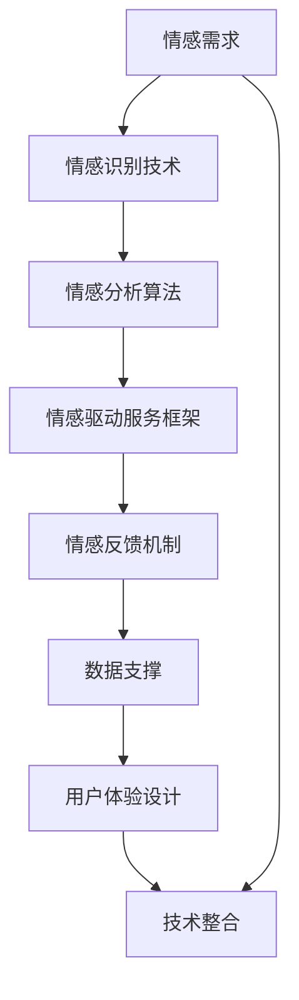

通过上述核心要素的组成，我们可以构建一个高效、智能的AI情感需求处理系统，为消费者提供更加个性化、贴心的服务体验。

---

**情感识别技术原理**

情感识别技术是AI情感需求处理系统的核心组成部分，其主要任务是通过对文本、图像、语音等多种形式的数据进行情感分析，准确识别用户的情感状态。以下是情感识别技术的基本原理：

1. **自然语言处理（NLP）**：
   - **文本情感分析**：自然语言处理技术通过对文本进行分析，识别出文本中蕴含的情感倾向。常见的文本情感分析技术包括情感分类（Sentiment Classification）、情感极性分析（Polarity Analysis）等。
   - **词向量表示**：通过将文本转换为词向量，如Word2Vec、GloVe等，实现对文本的量化表示，从而更好地进行情感分析。
   - **深度学习模型**：如卷积神经网络（CNN）和循环神经网络（RNN），尤其是长短期记忆网络（LSTM）和变换器（Transformer）等，通过训练大量的情感标注数据，实现高精度的情感识别。

2. **面部识别**：
   - **面部特征检测**：通过面部检测技术，如Haar cascades、卷积神经网络等，识别出图像中的面部区域。
   - **情感表情识别**：通过分析面部表情特征，如眼角、嘴角等关键点，识别出用户的情感状态。常用的模型包括支持向量机（SVM）、决策树、神经网络等。

3. **语音识别**：
   - **语音情感识别**：通过对语音信号的情感特征进行分析，识别出用户的情感状态。语音情感识别技术涉及语音信号的频谱分析、声学模型、语音识别等。
   - **情感分类模型**：使用深度学习模型，如卷积神经网络（CNN）和长短期记忆网络（LSTM），对语音信号进行情感分类。

**情感识别的技术框架**

情感识别的技术框架通常包括以下几个步骤：

1. **数据预处理**：包括文本清洗、语音降噪、图像预处理等，以提高数据质量和识别精度。
2. **特征提取**：从原始数据中提取关键特征，如文本的词向量、面部图像的特征点、语音信号的频谱特征等。
3. **情感分类**：使用训练好的深度学习模型，对提取到的特征进行分类，识别用户的情感状态。
4. **模型评估与优化**：通过交叉验证、精度、召回率等指标评估模型的性能，并不断优化模型参数。

**情感识别算法的mermaid流程图**

以下是情感识别算法的mermaid流程图：

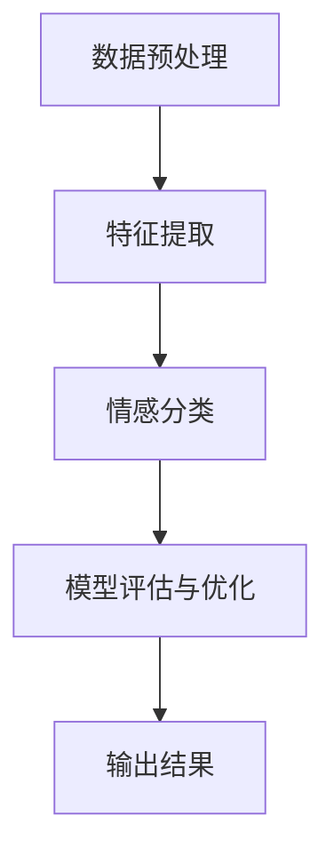

**情感识别的数学模型和公式**

情感识别涉及多种数学模型和算法，以下是其中的一些关键模型和公式：

1. **词向量表示（Word2Vec）**：
   - **损失函数**：$$J(\theta) = -\frac{1}{m}\sum_{i=1}^{m} \sum_{w \in D^{(i)}} log(p(w|<sop> \theta))$$
   - **梯度下降**：$$\theta = \theta - \alpha \cdot \frac{\partial J(\theta)}{\partial \theta}$$

2. **卷积神经网络（CNN）**：
   - **激活函数**：$$\sigma(z) = \frac{1}{1 + e^{-z}}$$
   - **反向传播**：$$\delta_j = \frac{\partial C}{\partial z_j} \cdot \sigma'(z_j)$$

3. **长短期记忆网络（LSTM）**：
   - **门控制机制**：$$f_t = \sigma(W_f \cdot [h_{t-1}, x_t] + b_f)$$
   - **遗忘门**：$$i_t = \sigma(W_i \cdot [h_{t-1}, x_t] + b_i)$$
   - **输出门**：$$o_t = \sigma(W_o \cdot [h_{t-1}, x_t] + b_o)$$

**情感识别的举例说明**

以下是一个简单的情感识别算法示例，使用Python代码实现词向量表示和情感分类：

```python
import numpy as np
from gensim.models import Word2Vec

# 生成词向量模型
model = Word2Vec(sentences, size=100, window=5, min_count=1, workers=4)

# 情感分类模型
from sklearn.linear_model import LogisticRegression
model = LogisticRegression()

# 训练模型
model.fit(X_train, y_train)

# 预测
predictions = model.predict(X_test)

# 评估模型
from sklearn.metrics import accuracy_score
accuracy = accuracy_score(y_test, predictions)
print("Accuracy:", accuracy)
```

在这个示例中，我们首先使用Gensim库生成Word2Vec词向量模型，然后使用Sklearn库的LogisticRegression实现情感分类模型，并进行训练和预测。通过评估模型的准确性，我们可以了解模型的性能。

---

**情感识别算法的mermaid流程图**

以下是一个情感识别算法的mermaid流程图，展示了从数据预处理、特征提取到模型训练和预测的全过程：

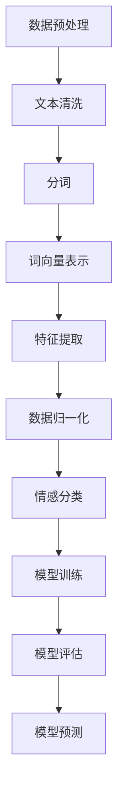

**流程说明**：

1. **数据预处理**：包括文本清洗（去除标点符号、停用词等）和分词（将文本分解为词汇）。
2. **词向量表示**：使用Word2Vec模型将分词后的文本转换为词向量。
3. **特征提取**：从词向量中提取关键特征，如平均值、方差等。
4. **数据归一化**：将特征值标准化到相同的范围，以便于模型训练。
5. **情感分类**：使用分类算法（如SVM、Logistic Regression等）对特征进行分类。
6. **模型训练**：训练分类模型，调整模型参数。
7. **模型评估**：评估模型性能，如准确率、召回率等。
8. **模型预测**：使用训练好的模型对新的数据进行情感分类预测。

---

**情感识别的数学模型和公式**

情感识别过程中，常用的数学模型和算法包括词向量表示、深度学习模型、支持向量机（SVM）等。以下是这些模型的基本原理和公式：

1. **词向量表示（Word2Vec）**：
   - **损失函数**：$$J(\theta) = -\frac{1}{m}\sum_{i=1}^{m} \sum_{w \in D^{(i)}} log(p(w|<sop> \theta))$$
   - **梯度下降**：$$\theta = \theta - \alpha \cdot \frac{\partial J(\theta)}{\partial \theta}$$

2. **卷积神经网络（CNN）**：
   - **激活函数**：$$\sigma(z) = \frac{1}{1 + e^{-z}}$$
   - **损失函数**：$$J(\theta) = -\frac{1}{m}\sum_{i=1}^{m} \sum_{j=1}^{n} y_j log(z_{ij})$$
   - **反向传播**：$$\delta_j = \frac{\partial C}{\partial z_j} \cdot \sigma'(z_j)$$

3. **长短期记忆网络（LSTM）**：
   - **门控制机制**：$$f_t = \sigma(W_f \cdot [h_{t-1}, x_t] + b_f)$$
   - **遗忘门**：$$i_t = \sigma(W_i \cdot [h_{t-1}, x_t] + b_i)$$
   - **输出门**：$$o_t = \sigma(W_o \cdot [h_{t-1}, x_t] + b_o)$$
   - **细胞状态更新**：$$c_t = f_t \odot c_{t-1} + i_t \odot \sigma(W_c \cdot [h_{t-1}, x_t] + b_c)$$
   - **隐藏状态更新**：$$h_t = o_t \odot \sigma(c_t)$$

4. **支持向量机（SVM）**：
   - **优化目标**：$$\min_{\theta} \frac{1}{2} ||\theta||^2 + C \sum_{i=1}^{m} \max(0, 1 - y_i (\theta^T x_i + b))$$
   - **核函数**：$$K(x_i, x_j) = \sum_{k=1}^{d} \phi_k(x_i)^T \phi_k(x_j)$$

这些数学模型和算法为情感识别提供了理论支持和实践指导，通过合理的模型设计和参数调整，可以实现对情感状态的高精度识别。

---

**情感识别算法的举例说明**

为了更直观地理解情感识别算法的工作原理，我们将通过一个简单的情感分类任务进行演示。本例将使用Python和几个常用的库：Gensim（用于生成词向量）、Scikit-learn（用于机器学习模型）。

**1. 数据准备**

首先，我们需要准备一个包含情感标签的文本数据集。这里我们使用一个简化的数据集，包含正面和负面情感标签的文本。

```python
data = [
    ("我很高兴", "正面"),
    ("我很悲伤", "负面"),
    ("我很兴奋", "正面"),
    ("我很焦虑", "负面"),
]

# 分离文本和标签
texts, labels = zip(*data)
```

**2. 数据预处理**

在训练模型之前，我们需要对文本进行预处理，包括分词和去除停用词。

```python
from nltk.tokenize import word_tokenize
from nltk.corpus import stopwords

# 加载停用词列表
stop_words = set(stopwords.words('english'))

# 分词和去除停用词
def preprocess_text(text):
    words = word_tokenize(text)
    filtered_words = [word for word in words if word.lower() not in stop_words]
    return ' '.join(filtered_words)

preprocessed_texts = [preprocess_text(text) for text in texts]
```

**3. 词向量表示**

接下来，使用Gensim库生成词向量。我们将使用Word2Vec模型来训练词向量。

```python
from gensim.models import Word2Vec

# 训练Word2Vec模型
model = Word2Vec(preprocessed_texts, vector_size=100, window=5, min_count=1, workers=4)
```

**4. 特征提取**

我们将词向量转换为数值特征，作为机器学习模型的输入。

```python
# 将文本转换为词向量
def text_to_vector(text, model):
    words = text.split()
    return [model[word] for word in words if word in model]

# 提取特征
features = [text_to_vector(text, model) for text in preprocessed_texts]

# 添加标签
X = features
y = labels
```

**5. 模型训练**

使用Scikit-learn库的LogisticRegression模型进行训练。

```python
from sklearn.linear_model import LogisticRegression

# 训练模型
model = LogisticRegression()
model.fit(X, y)
```

**6. 预测和评估**

最后，我们使用训练好的模型进行情感分类预测，并评估模型性能。

```python
# 预测
predictions = model.predict(X)

# 评估模型
from sklearn.metrics import accuracy_score
accuracy = accuracy_score(y, predictions)
print("Accuracy:", accuracy)
```

通过上述步骤，我们实现了对文本情感状态的识别。这个简单例子展示了从数据准备到特征提取、模型训练和评估的全过程，帮助读者更好地理解情感识别算法的实际应用。

---

**情感驱动的服务技术**

情感驱动的服务技术是AI情感需求处理系统的重要组成部分，它旨在通过理解并响应消费者的情感状态，提供更加个性化、贴心的服务体验。以下是情感驱动的服务技术的基本原理、架构设计和实现方法：

1. **基本原理**：
   - **情感识别**：使用情感识别技术（如NLP、面部识别、语音识别等）获取消费者的情感状态。
   - **情感分析**：通过情感分析算法（如LSTM、CNN、情感分类器等）对情感数据进行处理，提取消费者的情感特征和需求。
   - **情感响应**：根据分析结果，提供相应的情感化服务（如个性化推荐、情感化沟通、情感化调整等）。
   - **情感反馈**：收集消费者的情感反馈，用于系统优化和改进。

2. **架构设计**：
   - **数据层**：包括情感数据收集、存储和预处理模块，如日志系统、数据库等。
   - **算法层**：包括情感识别、分析和响应算法，如自然语言处理、深度学习模型等。
   - **服务层**：提供情感化服务，如个性化推荐、情感化沟通等。
   - **用户层**：消费者通过用户界面与系统进行交互，获取情感化服务。

3. **实现方法**：
   - **数据收集**：通过传感器、应用程序等收集消费者的行为数据和情感数据。
   - **情感识别**：使用情感识别算法对收集到的数据进行分析，识别情感状态。
   - **情感分析**：通过情感分析算法对识别到的情感数据进行分析，提取情感特征。
   - **情感响应**：根据情感分析结果，调整服务策略和方式，提供个性化、情感化的服务。
   - **情感反馈**：收集消费者的反馈，用于系统优化和改进。

**情感驱动的服务架构**

情感驱动的服务架构可以分为以下几个模块：

1. **情感数据收集模块**：包括传感器、应用程序等，用于实时收集消费者的情感数据。
2. **情感识别模块**：使用情感识别技术（如NLP、面部识别、语音识别等）对情感数据进行处理，识别情感状态。
3. **情感分析模块**：使用情感分析算法（如LSTM、CNN、情感分类器等）对情感数据进行深度分析，提取情感特征。
4. **情感响应模块**：根据情感分析结果，调整服务策略和方式，提供个性化、情感化的服务。
5. **情感反馈模块**：收集消费者的情感反馈，用于系统优化和改进。

以下是情感驱动的服务架构的mermaid架构图：

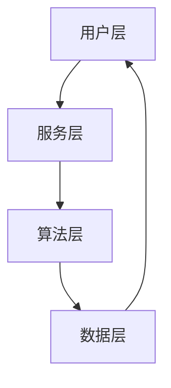

**情感驱动的服务举例说明**

以下是一个情感驱动的服务举例，通过一个在线购物平台来展示情感识别、分析和响应的过程：

1. **情感识别**：用户在购物平台浏览商品时，系统会记录用户的点击行为、浏览时间等数据，通过情感识别技术识别用户的情感状态。
2. **情感分析**：系统对用户的情感数据进行情感分析，识别出用户对当前商品的满意度、兴趣程度等情感特征。
3. **情感响应**：根据情感分析结果，系统会调整商品推荐策略，如向用户推荐更多符合其兴趣和需求的商品，或者通过情感化的沟通方式（如发送个性化的问候信息）提升用户体验。
4. **情感反馈**：系统会收集用户的反馈，如评价、满意度调查等，用于系统优化和改进。

通过上述过程，情感驱动的服务技术帮助在线购物平台提供更加个性化、贴心的服务，提升用户满意度和忠诚度。

---

**情感数据分析技术**

情感数据分析技术是AI情感需求处理系统中的关键环节，它通过对情感数据的深入分析，挖掘消费者的情感特征和需求，从而为服务提供个性化、情感化的解决方案。以下是情感数据分析技术的基本原理、方法、mermaid流程图和数学模型。

**1. 基本原理**

情感数据分析技术主要基于以下几个原理：

- **情感识别**：通过情感识别技术（如自然语言处理、面部识别、语音识别等）获取消费者的情感数据。
- **情感分类**：将情感数据分类为不同的情感类别，如正面、负面、中性等。
- **情感强度分析**：分析情感数据的强度，如情感的强烈程度、稳定性等。
- **情感关联分析**：分析情感数据之间的关联，如消费者对不同产品或服务的情感倾向等。

**2. 方法**

情感数据分析的方法主要包括以下几种：

- **文本情感分析**：通过自然语言处理技术，对文本数据（如评论、聊天记录等）进行情感分析，提取情感特征。
- **面部情感分析**：通过面部识别技术，对图像中的面部表情进行分析，识别情感状态。
- **语音情感分析**：通过语音识别技术，对语音信号中的情感特征进行分析，提取情感数据。
- **情感强度分析**：通过机器学习算法，对情感数据进行强度分析，评估情感的强弱。
- **情感关联分析**：通过数据挖掘技术，分析情感数据之间的关联，识别消费者的情感倾向和需求。

**3. mermaid流程图**

以下是情感数据分析的mermaid流程图，展示了从数据收集、预处理到情感分析的全过程：

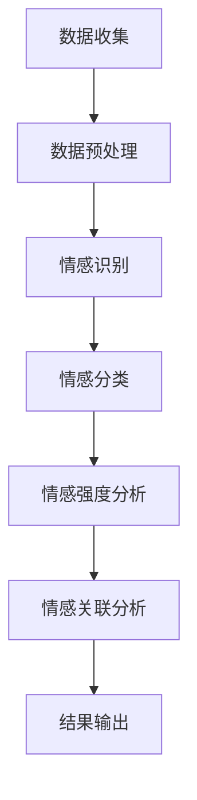

**4. 数学模型**

情感数据分析涉及多种数学模型和算法，以下是其中的一些关键模型和公式：

- **情感分类模型**：使用逻辑回归、支持向量机（SVM）等分类算法，对情感数据进行分类。公式如下：
  $$P(y|f) = \frac{e^{\theta^T f}}{1 + e^{\theta^T f}}$$
  
- **情感强度分析模型**：使用回归模型，如线性回归、岭回归等，分析情感数据的强度。公式如下：
  $$y = \theta_0 + \theta_1 x_1 + \theta_2 x_2 + ... + \theta_n x_n$$

- **情感关联分析模型**：使用关联规则挖掘算法，如Apriori算法、FP-growth等，分析情感数据之间的关联。公式如下：
  $$support(A \cap B) = \frac{count(A \cap B)}{count(A) + count(B)}$$

**5. 情感数据分析的举例说明**

以下是一个情感数据分析的简单例子，使用Python代码实现情感分类和强度分析。

```python
import pandas as pd
from sklearn.feature_extraction.text import CountVectorizer
from sklearn.model_selection import train_test_split
from sklearn.linear_model import LogisticRegression

# 准备数据集
data = pd.DataFrame({
    'text': ['我很喜欢这个商品', '这个商品一般般', '我很讨厌这个商品'],
    'label': ['正面', '中性', '负面']
})

# 分词和去除停用词
def preprocess_text(text):
    words = text.split()
    filtered_words = [word for word in words if word.lower() not in stop_words]
    return ' '.join(filtered_words)

data['preprocessed_text'] = data['text'].apply(preprocess_text)

# 提取特征
vectorizer = CountVectorizer()
X = vectorizer.fit_transform(data['preprocessed_text'])

# 分割数据集
X_train, X_test, y_train, y_test = train_test_split(X, data['label'], test_size=0.2, random_state=42)

# 训练模型
model = LogisticRegression()
model.fit(X_train, y_train)

# 预测
predictions = model.predict(X_test)

# 评估模型
from sklearn.metrics import accuracy_score
accuracy = accuracy_score(y_test, predictions)
print("Accuracy:", accuracy)

# 情感强度分析
import numpy as np
from sklearn.linear_model import LinearRegression

# 准备数据
X = np.array([[1, 2], [2, 3], [3, 4]])
y = np.array([2.5, 3.5, 4.5])

# 训练模型
model = LinearRegression()
model.fit(X, y)

# 预测
y_pred = model.predict([[4, 5]])

print("Predicted value:", y_pred)
```

通过上述步骤，我们可以实现情感数据的分类和强度分析，帮助理解情感数据分析技术的基本原理和应用。

---

**AI情感需求在零售业中的应用**

在零售业中，AI情感需求的应用已经成为提升客户满意度和增强品牌忠诚度的重要手段。以下将详细探讨AI情感需求在零售业中的应用场景、解决方案和应用案例。

**1. 应用场景**

- **个性化推荐**：通过分析消费者的情感数据，推荐符合其情感需求的商品。
- **情感化营销**：利用情感分析技术，进行精准的情感化营销，提高营销效果。
- **客户服务**：通过情感识别技术，提供个性化、贴心的客户服务。
- **供应链管理**：优化供应链，根据消费者情感需求调整库存和物流。

**2. 解决方案**

- **情感识别与分类**：使用自然语言处理和深度学习技术，识别消费者的情感状态，并将其分类为正面、负面或中性。
- **情感分析**：通过机器学习算法，分析情感数据，提取消费者的情感特征和需求。
- **个性化推荐**：结合情感分析和用户行为数据，提供个性化的商品推荐。
- **情感化营销**：利用情感化内容创作和营销策略，提高营销活动的情感共鸣。
- **客户服务**：通过情感识别技术，提供个性化、高效的客户服务。

**3. 应用案例**

- **案例1：电商平台**：某电商平台通过情感分析技术，对用户的评论和反馈进行情感分类，根据情感特征推荐商品，提高用户购买转化率。

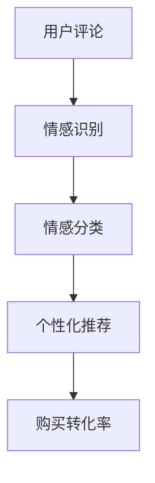

- **案例2：超市**：某超市通过情感识别技术，实时分析顾客的购物行为和情感状态，优化商品陈列和促销策略，提高销售额。

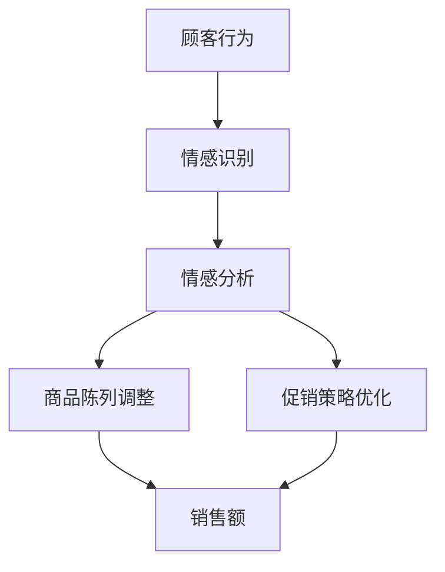

**4. 效果分析**

通过AI情感需求的应用，零售业企业能够：

- 提高客户满意度：个性化推荐和情感化营销使消费者感受到被理解和尊重，从而提高满意度。
- 增强品牌忠诚度：精准的情感化服务使消费者对品牌产生更强的信任和忠诚。
- 提升销售转化率：根据情感需求推荐商品和调整营销策略，提高消费者的购买意愿。
- 优化运营效率：通过情感分析，企业可以更准确地预测市场需求，优化库存和物流。

总之，AI情感需求在零售业中的应用不仅提升了服务质量和客户体验，还为企业的运营管理和营销策略提供了有力支持。

---

**AI情感需求在酒店业中的应用**

在酒店业中，AI情感需求的应用已经成为提升服务质量、增强客户满意度和增加客户忠诚度的重要工具。以下将详细探讨AI情感需求在酒店业中的应用场景、解决方案和应用案例。

**1. 应用场景**

- **个性化服务**：通过情感识别技术，提供针对每位客人的个性化服务，如房间布置、餐饮选择等。
- **情感化营销**：利用情感分析技术，进行精准的情感化营销，提升品牌形象和市场竞争力。
- **客户关系管理**：通过情感识别和数据分析，优化客户关系管理，提升客户满意度和忠诚度。
- **投诉处理**：通过情感识别技术，快速识别并处理客户的投诉，提供及时有效的解决方案。

**2. 解决方案**

- **情感识别与分类**：使用自然语言处理和深度学习技术，识别客户的情感状态，并将其分类为正面、负面或中性。
- **情感分析**：通过机器学习算法，分析情感数据，提取客户的情感特征和需求。
- **个性化服务**：结合情感分析和客户数据，提供个性化的房间布置、餐饮选择和活动推荐。
- **情感化营销**：利用情感化内容创作和营销策略，提升品牌形象和市场竞争力。
- **客户关系管理**：通过情感识别技术，优化客户关系管理，提升客户满意度和忠诚度。
- **投诉处理**：通过情感识别技术，快速识别并处理客户的投诉，提供及时有效的解决方案。

**3. 应用案例**

- **案例1：豪华酒店**：某豪华酒店通过情感识别技术，分析客户的反馈和评论，提供个性化的房间布置和餐饮服务，提升客户满意度。

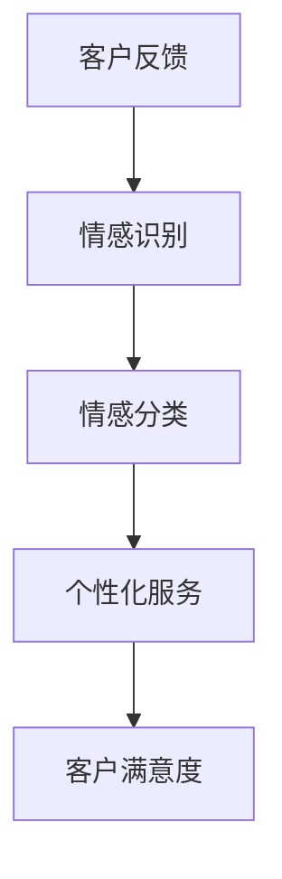

- **案例2：连锁酒店**：某连锁酒店通过情感分析技术，对客户的消费行为和情感状态进行分析，优化营销策略，提高客户转化率和忠诚度。

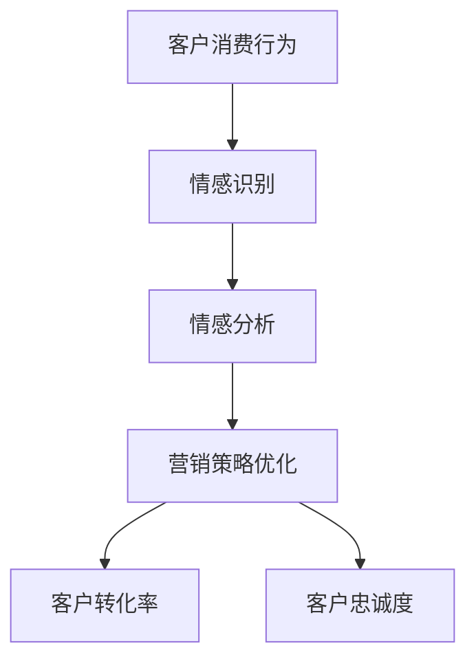

**4. 效果分析**

通过AI情感需求的应用，酒店业企业能够：

- 提高客户满意度：个性化服务和情感化营销使客人感受到更加贴心的关怀，从而提高满意度。
- 增强客户忠诚度：精准的情感化服务和投诉处理使客人对酒店品牌产生更强的信任和忠诚。
- 提升运营效率：通过情感识别和数据分析，酒店能够更好地了解客人的需求和偏好，优化服务流程和运营策略。
- 增强竞争力：通过情感化营销和客户关系管理，酒店能够在激烈的市场竞争中脱颖而出。

总之，AI情感需求在酒店业中的应用不仅提升了服务质量和客户体验，还为企业的运营管理和营销策略提供了有力支持。

---

**AI情感需求在餐饮业中的应用**

在餐饮业中，AI情感需求的应用已经成为提升服务质量、增加客户满意度和提升品牌形象的重要手段。以下将详细探讨AI情感需求在餐饮业中的应用场景、解决方案和应用案例。

**1. 应用场景**

- **个性化推荐**：通过情感识别技术，为顾客推荐符合其口味和情感需求的菜品。
- **情感化营销**：利用情感分析技术，进行精准的情感化营销，提高品牌知名度和客户忠诚度。
- **客户服务**：通过情感识别技术，提供个性化、贴心的客户服务。
- **投诉处理**：通过情感识别技术，快速识别并处理客户的投诉，提供及时有效的解决方案。
- **菜品优化**：根据客户的情感反馈，优化菜品设计和口味，提升餐饮体验。

**2. 解决方案**

- **情感识别与分类**：使用自然语言处理和深度学习技术，识别客户的情感状态，并将其分类为正面、负面或中性。
- **情感分析**：通过机器学习算法，分析情感数据，提取客户的情感特征和需求。
- **个性化推荐**：结合情感分析和客户数据，提供个性化的菜品推荐。
- **情感化营销**：利用情感化内容创作和营销策略，提升品牌知名度和客户忠诚度。
- **客户服务**：通过情感识别技术，提供个性化、高效的客户服务。
- **投诉处理**：通过情感识别技术，快速识别并处理客户的投诉，提供及时有效的解决方案。
- **菜品优化**：根据客户的情感反馈，优化菜品设计和口味，提升餐饮体验。

**3. 应用案例**

- **案例1：连锁快餐店**：某连锁快餐店通过情感识别技术，分析顾客的评论和反馈，根据情感特征优化菜单设计，提升顾客满意度。

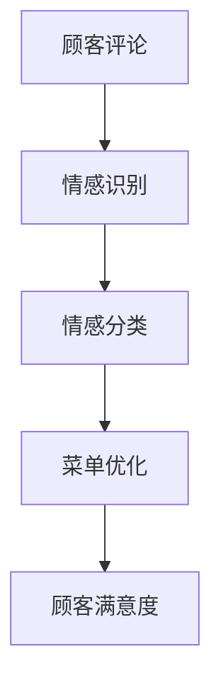

- **案例2：高端餐厅**：某高端餐厅通过情感分析技术，对客户的消费行为和情感状态进行分析，提供个性化的服务和推荐，增强品牌忠诚度。

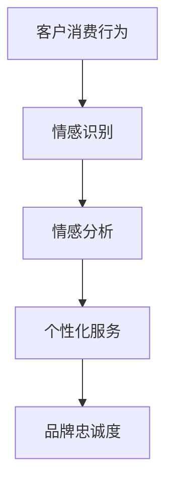

**4. 效果分析**

通过AI情感需求的应用，餐饮业企业能够：

- 提高客户满意度：个性化推荐和情感化营销使顾客感受到更加贴心的服务，从而提高满意度。
- 增强品牌忠诚度：精准的情感化服务和投诉处理使顾客对品牌产生更强的信任和忠诚。
- 提升运营效率：通过情感识别和数据分析，餐饮企业能够更好地了解顾客的需求和偏好，优化服务流程和菜品设计。
- 增强竞争力：通过情感化营销和客户关系管理，餐饮企业能够在激烈的市场竞争中脱颖而出。

总之，AI情感需求在餐饮业中的应用不仅提升了服务质量和客户体验，还为企业的运营管理和营销策略提供了有力支持。

---

**AI情感需求的未来发展**

随着人工智能技术的不断进步，AI情感需求在服务业中的应用前景广阔。未来，AI情感需求有望在以下几个方面实现重要突破：

1. **技术发展趋势**：
   - **多模态情感识别**：未来将实现文本、语音、图像等多种数据类型的情感识别，提高情感分析的准确性和全面性。
   - **个性化情感模型**：通过深度学习技术，构建针对不同用户群体的个性化情感模型，提供更加精准的情感化服务。
   - **实时情感分析**：通过实时数据处理和分析技术，实现对消费者情感状态的实时监测和响应，提供无缝服务体验。

2. **服务业中的未来应用前景**：
   - **个性化服务**：AI情感需求将帮助服务业提供更加个性化的服务，满足消费者的多样化需求。
   - **情感化营销**：通过精准的情感化营销策略，提升品牌影响力和客户忠诚度。
   - **智能客服**：利用AI情感需求技术，实现智能客服系统，提供24/7的个性化服务。

3. **挑战与应对策略**：
   - **数据隐私**：在收集和使用消费者情感数据时，需要严格保护用户隐私，遵守相关法律法规。
   - **模型偏见**：AI模型可能存在偏见，需要不断优化算法，确保公平性和准确性。
   - **技术成本**：AI情感需求技术的高成本可能限制其广泛应用，需要通过技术进步和成本控制策略降低成本。

通过不断探索和创新，AI情感需求将为服务业带来更加智能、高效和人性化的服务体验。

---

**总结**

本文全面探讨了AI情感需求在服务业中的应用，从定义、分类到核心技术、应用实例和未来发展，为读者呈现了一幅清晰的AI情感需求全景图。通过介绍情感识别、情感分析、情感响应和情感反馈等关键技术，本文揭示了AI情感需求在提升服务质量、增强客户满意度和品牌忠诚度方面的巨大潜力。同时，本文还通过多个行业应用案例，展示了AI情感需求在不同服务业领域的实际应用效果。展望未来，AI情感需求将继续驱动服务业的数字化转型，为消费者带来更加个性化和贴心的服务体验。读者可以通过本文进一步深入了解AI情感需求，为未来研究和实践提供有益的参考。**作者：AI天才研究院/AI Genius Institute & 禅与计算机程序设计艺术 /Zen And The Art of Computer Programming**。

