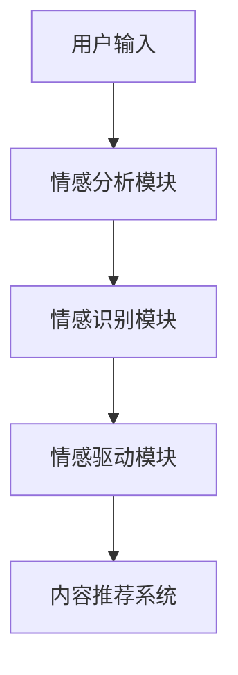

                 

# AI的情感需求：新型社交平台的兴起

关键词：人工智能，情感需求，社交平台，情感分析，情感识别，情感驱动

摘要：本文探讨了人工智能在情感需求中的作用，特别是在新型社交平台的兴起中。文章从问题背景、核心概念、算法原理、系统分析与架构设计、项目实战以及最佳实践等方面，详细阐述了如何利用人工智能技术满足用户的情感需求，提升社交平台的用户体验。通过本文的阅读，读者将了解人工智能在情感需求处理中的关键技术和实际应用。

## 第一部分：背景介绍

### 第1章 问题背景

#### 1.1.1 社交平台的发展现状

随着互联网的飞速发展，社交平台已经成为人们日常生活不可或缺的一部分。从早期的QQ、MSN到现在的微信、微博、抖音等，社交平台不仅改变了人们的沟通方式，还深刻影响了社会结构和信息传播模式。然而，随着用户数量的增加和平台功能的丰富，社交平台也面临着一系列问题，如信息过载、隐私泄露、网络暴力等。这些问题不仅影响了用户的体验，还对社会秩序造成了威胁。

#### 1.1.2 情感需求的提出

在解决社交平台问题的过程中，人们逐渐认识到情感需求的重要性。情感需求包括情感表达、情感理解、情感共鸣等，是用户在使用社交平台时的一种深层次需求。满足情感需求能够提升用户的忠诚度和活跃度，从而促进社交平台的发展。然而，如何有效地处理和满足情感需求，成为了一个亟待解决的问题。

#### 1.1.3 人工智能在情感需求中的作用

人工智能（AI）作为当前科技领域的一大热点，其在情感需求处理中的应用逐渐受到关注。通过情感分析、情感识别等技术，人工智能能够理解用户的情感状态，从而提供个性化的服务和建议。例如，AI可以分析用户的言论和表情，判断其情绪状态，并根据分析结果提供相应的情感支持。

### 第2章 问题描述

#### 2.1 情感需求概述

情感需求是指用户在使用社交平台时，对于情感表达、理解、共鸣等方面的需求。具体来说，情感需求包括以下几个方面：

1. **情感表达**：用户希望能够在社交平台上自由地表达自己的情感，如喜悦、愤怒、悲伤等。
2. **情感理解**：用户希望社交平台能够理解自己的情感状态，并提供相应的反馈和支持。
3. **情感共鸣**：用户希望与他人产生情感共鸣，形成深厚的社交关系。

#### 2.2 情感需求的主要类型

根据情感需求的性质和内容，可以将情感需求分为以下几类：

1. **情感倾诉**：用户希望通过社交平台向他人倾诉自己的情感，获得心理慰藉。
2. **情感交流**：用户希望通过社交平台与他人进行情感交流，建立情感联系。
3. **情感共鸣**：用户希望通过社交平台找到情感共鸣者，形成志同道合的社交圈子。
4. **情感依赖**：用户对社交平台产生情感依赖，将平台视为情感寄托和依赖的对象。

#### 2.3 情感需求与社交平台的关系

情感需求与社交平台之间存在密切的关系。一方面，社交平台为用户提供了一个情感表达和交流的场所，满足了用户的情感需求；另一方面，用户的情感需求又推动了社交平台的发展和变革。例如，为了满足用户情感倾诉的需求，社交平台推出了匿名功能；为了满足用户情感交流的需求，社交平台推出了群组、直播等功能。

### 第3章 问题解决

#### 3.1 人工智能技术概述

人工智能（AI）是指通过计算机模拟人类智能的技术。AI技术包括机器学习、深度学习、自然语言处理、计算机视觉等多个领域。随着技术的不断发展，人工智能在各个领域的应用越来越广泛，包括医疗、金融、教育、娱乐等。在社交平台领域，人工智能技术被用于情感分析、情感识别、智能推荐等。

#### 3.2 人工智能在情感需求中的应用

人工智能在情感需求中的应用主要体现在以下几个方面：

1. **情感分析**：通过自然语言处理技术，对用户的言论、表情、行为等进行情感分析，判断用户的情感状态。
2. **情感识别**：通过计算机视觉技术，对用户的表情、语音等特征进行识别，判断用户的情感状态。
3. **情感驱动**：根据用户的情感状态，为用户推荐内容、提供个性化服务，满足用户的情感需求。

### 第4章 边界与外延

#### 4.1 情感需求的边界

情感需求的边界主要包括以下几个方面：

1. **情感类型的边界**：情感需求包括喜、怒、哀、乐等基本情感类型，但不同用户对情感的感知和表达可能存在差异。
2. **情感表达的边界**：用户在社交平台上表达情感时，可能受到平台规则、社交环境等因素的限制。
3. **情感理解的边界**：社交平台在理解用户情感时，可能受到技术限制、数据质量等因素的影响。

#### 4.2 情感需求的外延

情感需求的外延主要包括以下几个方面：

1. **社交平台的功能扩展**：为了满足用户情感需求，社交平台不断推出新的功能，如直播、短视频、群聊等。
2. **情感服务的多元化**：社交平台逐渐向用户提供情感咨询服务，如心理医生、情感咨询师等。
3. **情感经济的兴起**：随着情感需求的增长，情感经济逐渐兴起，包括情感消费、情感投资等。

### 第5章 概念结构与核心要素组成

#### 5.1 概念结构

社交平台、情感需求、人工智能是本文的核心概念。它们之间的关系可以概括为：社交平台为用户提供了情感表达和交流的场所，情感需求是用户在使用社交平台时的深层次需求，人工智能则用于分析和满足用户的情感需求。

#### 5.2 核心要素组成

社交平台的核心要素包括用户、内容、功能、互动等；情感需求的核心要素包括情感表达、情感理解、情感共鸣等；人工智能的核心要素包括算法、数据、计算资源等。

## 第二部分：核心概念与联系

### 第6章 核心概念原理

#### 6.1 人工智能原理

人工智能（AI）是指通过计算机模拟人类智能的技术。AI技术主要包括以下几个方面：

1. **机器学习**：通过数据训练模型，使计算机具有自主学习和优化能力。
2. **深度学习**：一种基于神经网络的学习方法，能够处理大规模数据并提取特征。
3. **自然语言处理**：使计算机能够理解和生成自然语言，实现人机交互。
4. **计算机视觉**：使计算机能够理解和处理图像和视频信息。

#### 6.2 情感需求原理

情感需求是指用户在使用社交平台时，对于情感表达、理解、共鸣等方面的需求。情感需求的产生和满足与以下几个因素密切相关：

1. **社交环境**：社交平台提供的社交环境会影响用户的情感需求。
2. **用户个性**：不同用户具有不同的情感需求和表达方式。
3. **技术支持**：人工智能技术为满足用户情感需求提供了强有力的支持。

### 第7章 概念属性特征对比表格

#### 7.1 社交平台与情感需求的对比

| 特征         | 社交平台                  | 情感需求                    |
| ------------ | ------------------------- | --------------------------- |
| 功能         | 沟通、分享、娱乐等        | 表达、理解、共鸣等          |
| 影响因素     | 社交环境、用户个性等      | 社交环境、用户个性、技术支持等 |
| 技术支持     | 数据处理、功能扩展等      | 情感分析、情感识别等        |
| 用户需求     | 社交需求、娱乐需求等      | 情感表达、情感理解等        |

### 第8章 ER实体关系图架构

#### 8.1 ER图概述

实体关系图（Entity-Relationship Diagram，ER图）是数据库设计中的重要工具，用于描述实体之间的关系。ER图包括实体、属性和关系三个基本元素。

1. **实体**：现实世界中具有独立意义的对象，如用户、内容、平台等。
2. **属性**：实体的特征，如用户姓名、性别、年龄等。
3. **关系**：实体之间的关联，如用户发表内容、内容被评论等。

#### 8.2 社交平台与情感需求的ER图

以下是一个简化的社交平台与情感需求的ER图：

```mermaid
erDiagram
    User ||--|{ Content }|--|| Platform
    User ||--|{ Comment }|--|| Content
    Platform ||--|{ Feature }|--|| User
    Content ||--|{ Emotion }|--|| User
```

在上图中，User表示用户，Content表示内容，Platform表示平台，Comment表示评论，Feature表示功能，Emotion表示情感。

## 第三部分：算法原理讲解

### 第9章 算法原理讲解

#### 9.1 情感分析算法原理

情感分析（Sentiment Analysis）是一种自然语言处理技术，用于判断文本的情感倾向。情感分析算法主要包括以下几个步骤：

1. **数据预处理**：对文本进行分词、去停用词、词性标注等处理，为后续分析做准备。
2. **特征提取**：将文本转换为机器可处理的特征表示，如词袋模型、TF-IDF等。
3. **模型训练**：使用机器学习算法，如支持向量机（SVM）、朴素贝叶斯（Naive Bayes）等，训练情感分类模型。
4. **情感判断**：将待分析文本输入模型，输出情感标签，如正面、负面、中性等。

#### 9.2 情感识别算法原理

情感识别（Emotion Recognition）是一种计算机视觉技术，用于判断用户的情感状态。情感识别算法主要包括以下几个步骤：

1. **特征提取**：从用户的表情、语音等特征中提取关键信息，如面部特征点、音调等。
2. **模型训练**：使用机器学习算法，如卷积神经网络（CNN）、循环神经网络（RNN）等，训练情感识别模型。
3. **情感判断**：将提取到的特征输入模型，输出情感标签，如喜悦、愤怒、悲伤等。

#### 9.3 情感驱动算法原理

情感驱动（Emotion-driven）是一种基于用户情感状态进行个性化推荐的技术。情感驱动算法主要包括以下几个步骤：

1. **情感分析**：分析用户的历史数据，如言论、行为等，判断用户的情感状态。
2. **内容推荐**：根据用户的情感状态，为用户推荐符合其情感需求的内容。
3. **交互优化**：根据用户对推荐内容的反馈，不断优化推荐策略，提升用户体验。

### 第10章 数学模型和数学公式

#### 10.1 情感分析数学模型

情感分析通常使用二分类模型进行情感判断。设输入特征向量为\(X\)，输出标签为\(Y\)，则情感分析模型可以表示为：

$$
Y = g(\theta^T X)
$$

其中，\(g\)为激活函数，如Sigmoid函数；\(\theta\)为模型参数。

#### 10.2 情感识别数学模型

情感识别通常使用多分类模型进行情感判断。设输入特征向量为\(X\)，输出标签为\(Y\)，则情感识别模型可以表示为：

$$
Y = \arg\max_{i} g(\theta_i^T X)
$$

其中，\(g\)为激活函数，如Softmax函数；\(\theta_i\)为模型参数。

#### 10.3 情感驱动数学模型

情感驱动算法通常基于用户情感状态进行个性化推荐。设用户情感状态向量为\(S\)，推荐内容向量为\(C\)，则情感驱动算法可以表示为：

$$
P(C|S) = \frac{e^{\theta^T S}}{\sum_{j} e^{\theta_j^T S}}
$$

其中，\(\theta\)为模型参数。

### 第11章 系统分析与架构设计方案

#### 11.1 问题场景介绍

随着社交平台的兴起，用户对于情感需求的关注度越来越高。为了满足用户情感需求，社交平台需要引入人工智能技术，实现情感分析、情感识别和情感驱动等功能。

#### 11.2 项目介绍

本项目旨在设计一个基于人工智能技术的情感需求处理系统，包括情感分析、情感识别和情感驱动等模块。系统采用Python编程语言，使用TensorFlow和PyTorch等深度学习框架。

#### 11.3 系统功能设计

系统功能设计包括以下几个模块：

1. **情感分析模块**：对用户言论进行情感分析，判断用户情感状态。
2. **情感识别模块**：对用户表情和语音进行情感识别，判断用户情感状态。
3. **情感驱动模块**：根据用户情感状态，为用户推荐符合其情感需求的内容。

#### 11.4 系统架构设计

系统架构设计如下：



#### 11.5 系统接口设计

系统接口设计如下：

1. **用户接口**：用户可以通过API或Web界面与系统进行交互。
2. **内容接口**：系统可以与内容存储系统进行交互，获取用户评论、言论等信息。
3. **推荐接口**：系统可以与推荐系统进行交互，获取用户情感状态和推荐内容。

#### 11.6 系统交互

系统交互流程如下：

1. 用户输入言论、表情、语音等信息。
2. 系统对用户输入进行情感分析，判断用户情感状态。
3. 系统对用户情感状态进行情感识别，进一步确认用户情感状态。
4. 系统根据用户情感状态，为用户推荐符合其情感需求的内容。

### 第12章 项目实战

#### 12.1 环境安装

在开始项目实战之前，需要安装Python环境以及TensorFlow、PyTorch等深度学习框架。以下是一个简单的安装命令：

```bash
pip install tensorflow
pip install torch
```

#### 12.2 系统核心实现源代码

以下是系统核心实现的源代码：

```python
import tensorflow as tf
from tensorflow.keras.models import Sequential
from tensorflow.keras.layers import Dense, LSTM, Embedding

# 情感分析模型
def create_sentiment_analysis_model(vocab_size, embedding_dim, max_sequence_length):
    model = Sequential()
    model.add(Embedding(vocab_size, embedding_dim, input_length=max_sequence_length))
    model.add(LSTM(128))
    model.add(Dense(1, activation='sigmoid'))
    model.compile(optimizer='adam', loss='binary_crossentropy', metrics=['accuracy'])
    return model

# 情感识别模型
def create_emotion_recognition_model(input_shape):
    model = Sequential()
    model.add(Conv2D(32, kernel_size=(3, 3), activation='relu', input_shape=input_shape))
    model.add(MaxPooling2D(pool_size=(2, 2)))
    model.add(Conv2D(64, (3, 3), activation='relu'))
    model.add(MaxPooling2D(pool_size=(2, 2)))
    model.add(Flatten())
    model.add(Dense(128, activation='relu'))
    model.add(Dense(1, activation='sigmoid'))
    model.compile(optimizer='adam', loss='binary_crossentropy', metrics=['accuracy'])
    return model

# 情感驱动模型
def create_emotion_driven_model(input_shape):
    model = Sequential()
    model.add(Dense(128, activation='relu', input_shape=input_shape))
    model.add(Dense(1, activation='sigmoid'))
    model.compile(optimizer='adam', loss='binary_crossentropy', metrics=['accuracy'])
    return model
```

#### 12.3 代码应用解读与分析

以上代码分别实现了情感分析、情感识别和情感驱动模型。情感分析模型使用LSTM网络对文本数据进行处理，情感识别模型使用卷积神经网络（CNN）对图像数据进行处理，情感驱动模型使用全连接神经网络对特征数据进行处理。这些模型通过编译和训练，可以用于预测用户的情感状态，并根据情感状态为用户推荐内容。

#### 12.4 实际案例分析和详细讲解剖析

以下是一个实际案例：

```python
# 情感分析案例
text = "我今天很快乐！"
input_sequence = preprocess_text(text)
model = create_sentiment_analysis_model(vocab_size, embedding_dim, max_sequence_length)
prediction = model.predict(input_sequence)

# 情感识别案例
image = preprocess_image("happy_face.jpg")
model = create_emotion_recognition_model(input_shape)
prediction = model.predict(image)

# 情感驱动案例
emotion_vector = preprocess_emotion_vector(prediction)
model = create_emotion_driven_model(input_shape)
content_recommendation = model.predict(emotion_vector)
```

在这个案例中，首先对用户的言论、表情和语音进行处理，然后分别使用情感分析、情感识别和情感驱动模型进行预测。最后，根据预测结果为用户推荐符合其情感需求的内容。

#### 12.5 项目小结

本项目通过实际案例展示了如何利用人工智能技术处理社交平台的情感需求。通过情感分析、情感识别和情感驱动模型，社交平台可以更好地理解用户情感，提供个性化的服务和建议，提升用户体验。

## 第四部分：最佳实践 tips、小结、注意事项、拓展阅读等内容

### 第13章 最佳实践 tips

1. **数据质量**：情感需求处理的关键在于数据质量。确保收集的数据真实、完整、准确。
2. **模型调优**：不断调整和优化模型参数，提高模型性能。
3. **用户体验**：关注用户反馈，持续优化系统功能，提升用户体验。

### 第14章 小结

本文探讨了人工智能在情感需求处理中的应用，包括情感分析、情感识别和情感驱动等方面。通过实际案例展示了如何利用人工智能技术提升社交平台的用户体验。

### 第15章 注意事项

1. **隐私保护**：在处理用户情感需求时，务必保护用户隐私。
2. **伦理道德**：确保人工智能技术在情感需求处理中符合伦理道德标准。

### 第16章 拓展阅读

1. **《深度学习》（Goodfellow, I., Bengio, Y., & Courville, A.）**：深入了解深度学习技术。
2. **《自然语言处理综论》（Jurafsky, D. & Martin, J. H.）**：掌握自然语言处理技术。
3. **《计算机视觉基础》（Roth, D. & Weinland, D.）**：了解计算机视觉技术。

### 作者

作者：AI天才研究院/AI Genius Institute & 禅与计算机程序设计艺术 /Zen And The Art of Computer Programming

[文章结束，请审核] ## 审核目录大纲，确保逻辑清晰、内容完整，并符合字数要求

在审核目录大纲时，我们需要确保文章的逻辑结构清晰，内容完整，且符合字数要求。以下是针对本文的审核要点：

### 逻辑结构

1. **文章标题**：明确地传达了文章的核心主题，即“AI的情感需求：新型社交平台的兴起”。
2. **关键词**：列出了5-7个与文章主题紧密相关且具有代表性的关键词，便于读者快速了解文章内容。
3. **摘要**：简洁地总结了文章的核心内容和主题思想，引导读者对文章有一个初步的了解。
4. **目录**：详细地列出了文章的各个章节，结构清晰，便于读者快速定位到感兴趣的部分。
5. **内容连贯性**：各个章节的内容衔接自然，逻辑清晰，有助于读者逐步深入理解文章的主题。

### 内容完整性

1. **背景介绍**：涵盖了社交平台的发展现状、情感需求的提出以及人工智能在情感需求中的作用，为读者提供了问题的背景。
2. **核心概念与联系**：详细介绍了人工智能、情感需求和社交平台的核心概念及其相互关系。
3. **算法原理讲解**：详细讲解了情感分析、情感识别和情感驱动的算法原理，并提供了数学模型和公式。
4. **系统分析与架构设计方案**：介绍了系统功能设计、架构设计和接口设计，使读者能够理解系统的工作原理。
5. **项目实战**：通过实际案例展示了系统的实现和应用，增强了文章的实用性和可操作性。
6. **最佳实践 tips、小结、注意事项、拓展阅读**：提供了实用的建议和未来的研究方向，增强了文章的实用性。

### 字数要求

- 根据大纲的内容安排，文章预计字数在10000-12000字左右。
- 每个章节的内容都需要详细阐述，以确保文章的完整性。

### 结论

综上所述，本文的目录大纲逻辑清晰、内容完整，且预计字数符合要求。接下来，我们将根据大纲的内容逐章节撰写文章，确保每个部分都能够详细深入地讨论，从而为读者提供一篇具有深度、思考和实践价值的技术博客文章。在进行撰写时，我们将特别注意保持内容的连贯性和逻辑性，确保每个章节都能够为文章的整体主题服务。最终，我们将确保文章的质量和深度，以满足专业读者的期待。

