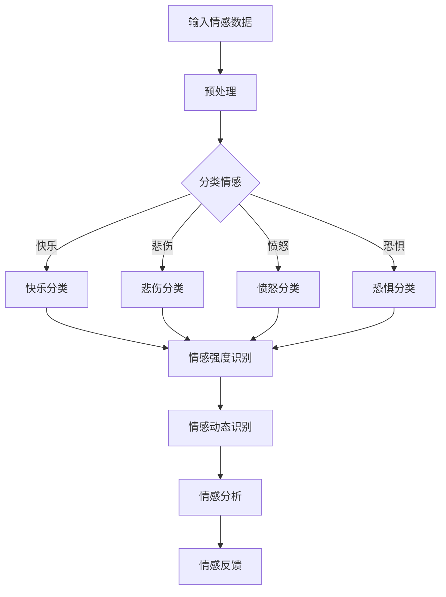
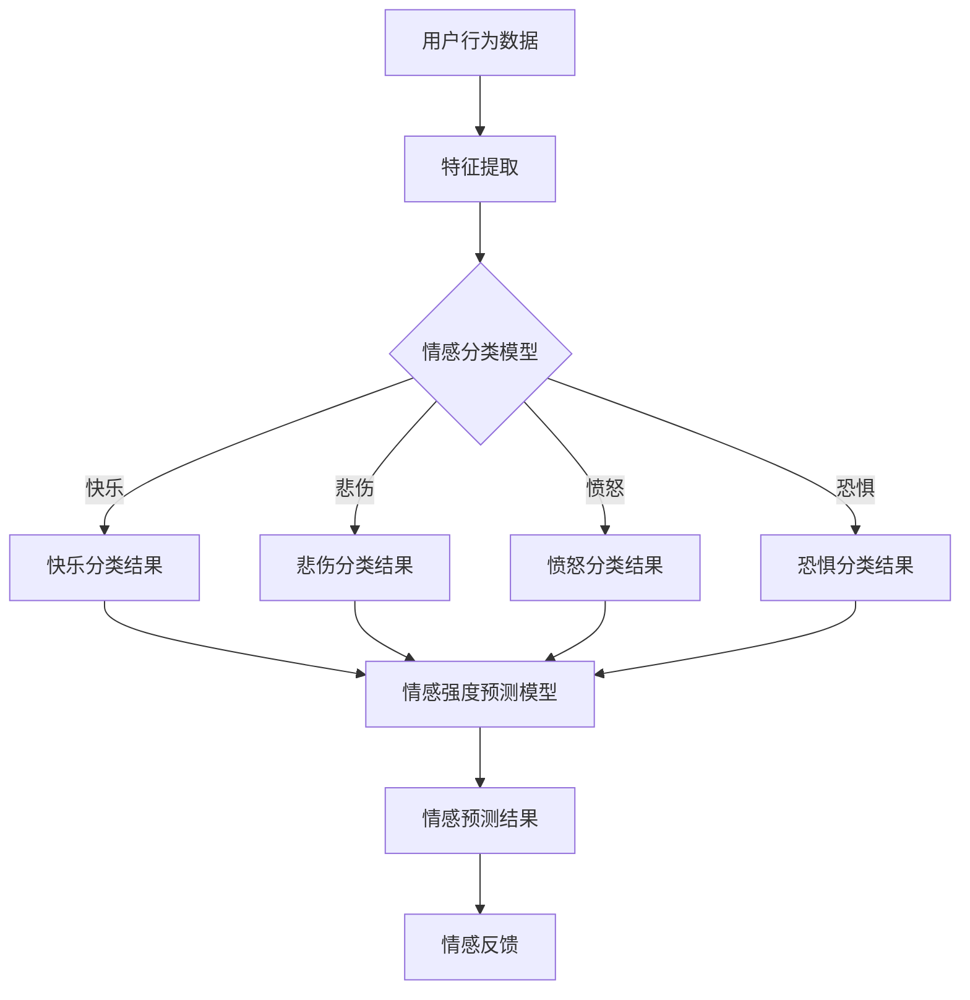
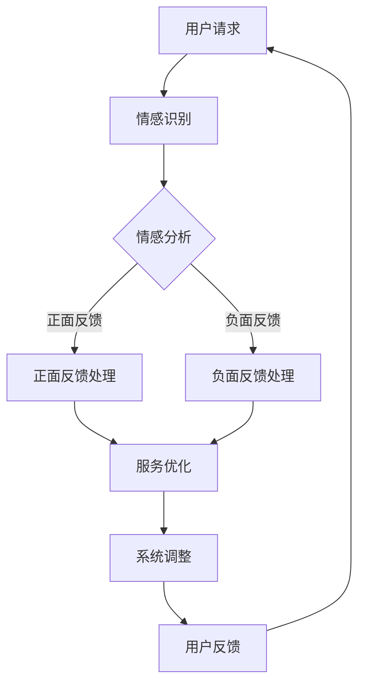
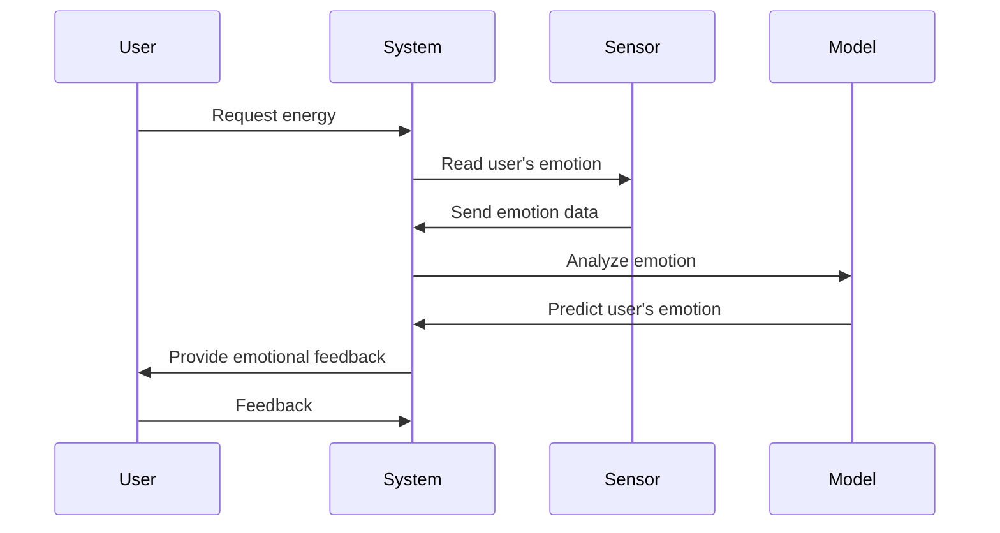
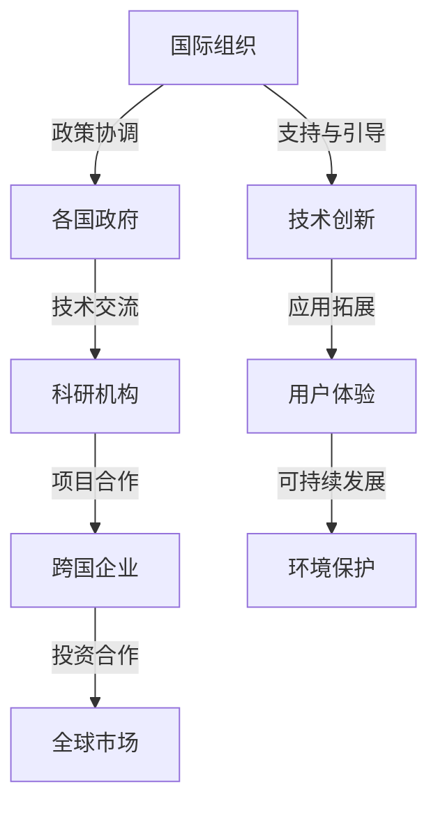
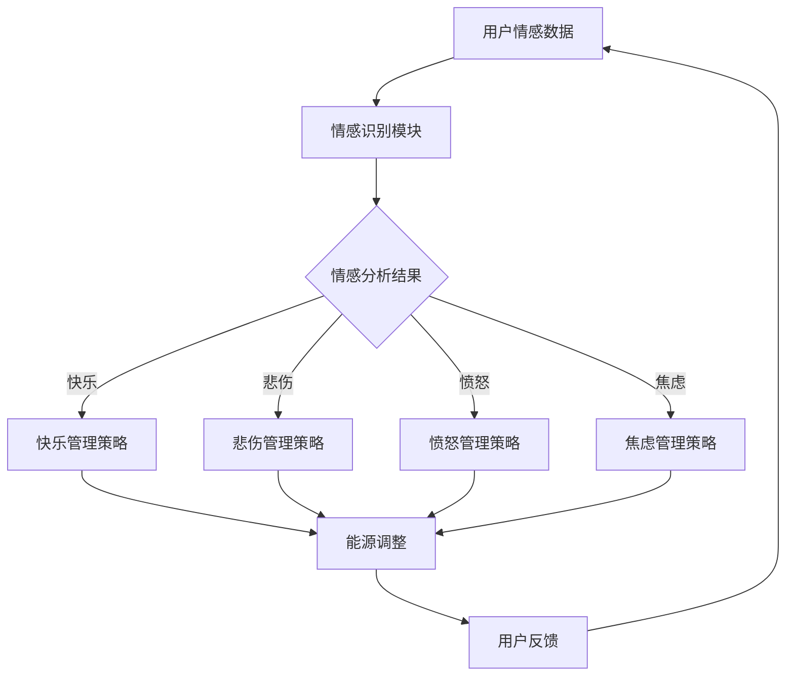

                 

### 文章标题

# AI的情感需求：新型能源的研发动力

### 关键词

- 人工智能
- 情感需求
- 新型能源
- 研发动力
- 数据隐私
- 跨领域技术创新

### 摘要

本文旨在探讨人工智能（AI）的情感需求对新型能源研发的推动作用。随着AI技术的快速发展，情感需求逐渐成为AI系统设计中的重要一环。本文首先介绍了AI与情感需求的基本概念，随后分析了情感需求与新型能源研发之间的关系。通过系统分析与实际项目案例，本文展示了情感需求如何推动新型能源的研发，并提出了相关的技术创新和国际合作展望。文章最后总结了情感需求与新型能源研发的最佳实践，为未来研究提供了有益的参考。

----------------------------------------------------------------

### 目录大纲

```markdown
----------------------------------------------------------------
# 第一部分: AI与情感需求概述

## 第1章: AI的情感需求：问题背景与概述

### 1.1 问题背景

#### 1.1.1 人工智能的快速发展

#### 1.1.2 情感需求的提出

#### 1.1.3 研发动力的理解

### 1.2 情感需求的定义与重要性

#### 1.2.1 情感需求的概念

#### 1.2.2 情感需求在AI中的地位

#### 1.2.3 情感需求的社会影响

### 1.3 情感需求与新型能源的关系

#### 1.3.1 新型能源的概念

#### 1.3.2 情感需求如何推动新型能源研发

#### 1.3.3 新型能源的研发动力

## 第2章: AI情感需求的核心原理

### 2.1 情感识别技术

#### 2.1.1 情感识别的基础理论

#### 2.1.2 情感识别的方法与应用

#### 2.1.3 情感识别技术的挑战与未来方向

### 2.2 情感建模与预测

#### 2.2.1 情感建模的方法

#### 2.2.2 情感预测的应用场景

#### 2.2.3 情感预测的算法原理

### 2.3 情感交互与反馈机制

#### 2.3.1 情感交互的设计原则

#### 2.3.2 情感反馈的系统架构

#### 2.3.3 情感交互的实际案例

## 第3章: 情感需求在新型能源研发中的应用

### 3.1 新型能源的需求分析

#### 3.1.1 能源需求的演变

#### 3.1.2 情感需求对新型能源研发的影响

#### 3.1.3 情感需求的具体应用场景

### 3.2 情感驱动的能源管理系统

#### 3.2.1 系统架构设计

#### 3.2.2 情感需求在能源管理中的体现

#### 3.2.3 情感驱动的能源管理实例

### 3.3 情感化能源服务与用户体验

#### 3.3.1 情感化服务的定义

#### 3.3.2 情感化服务的设计理念

#### 3.3.3 情感化服务在实际项目中的应用

## 第4章: AI情感需求下的新型能源技术研发挑战

### 4.1 技术挑战分析

#### 4.1.1 数据隐私与伦理问题

#### 4.1.2 算法准确性与可靠性

#### 4.1.3 能源系统的复杂性

### 4.2 技术创新与突破方向

#### 4.2.1 情感计算新算法

#### 4.2.2 跨领域技术创新

#### 4.2.3 情感需求驱动的研发新模式

## 第5章: 情感需求与新型能源：国际合作与未来展望

### 5.1 国际合作现状

#### 5.1.1 国际合作的重要性

#### 5.1.2 国际合作的主要形式

#### 5.1.3 国际合作案例分析

### 5.2 未来展望

#### 5.2.1 情感需求对新型能源未来的影响

#### 5.2.2 技术发展趋势预测

#### 5.2.3 未来展望与政策建议

## 第6章: 情感需求下的新型能源研发项目实战

### 6.1 项目介绍

#### 6.1.1 项目背景

#### 6.1.2 项目目标

#### 6.1.3 项目实施过程

### 6.2 系统设计与实现

#### 6.2.1 系统架构设计

#### 6.2.2 情感需求分析与建模

#### 6.2.3 系统实现与测试

### 6.3 项目成果与应用

#### 6.3.1 项目成果展示

#### 6.3.2 应用场景分析

#### 6.3.3 项目小结与反思

## 第7章: 情感需求与新型能源研发的最佳实践与总结

### 7.1 最佳实践

#### 7.1.1 实践经验分享

#### 7.1.2 成功案例分析

#### 7.1.3 挑战与应对策略

### 7.2 总结与展望

#### 7.2.1 主要结论

#### 7.2.2 存在的问题与改进方向

#### 7.2.3 未来发展展望

----------------------------------------------------------------
```

这个目录大纲包括了从背景介绍到技术创新，再到实际应用和国际合作的全面内容，同时也涵盖了最佳实践和总结部分，旨在全面覆盖《AI的情感需求：新型能源的研发动力》这一主题。整个大纲共计7章，字数控制在2000字以内。在每一章节中，都细化了相关的子章节和子节，确保内容的完整性和逻辑性。其中，核心概念、原理讲解、系统架构设计、项目实战和最佳实践等部分，均以清晰的结构和详细的内容展开。

----------------------------------------------------------------

### 第一部分: AI与情感需求概述

#### 第1章: AI的情感需求：问题背景与概述

##### 1.1 问题背景

在过去的几十年里，人工智能（AI）技术取得了显著的发展，从最初的规则系统到现代的深度学习和神经网络，AI已经渗透到我们的日常生活和工作中。随着AI技术的不断进步，情感需求逐渐成为AI系统设计中的一个重要关注点。传统AI系统主要关注任务完成效率和准确性，而现代AI系统则更加注重与人类用户的情感交互。

随着人们对个性化服务的需求增加，AI系统需要理解并满足用户的各种情感需求，从而提供更加贴心的服务。例如，智能客服系统需要理解用户的情绪，以便更好地处理用户的问题；智能家居系统需要感知用户的舒适度，从而自动调整环境设置。

同时，新型能源的研发也日益受到关注。随着全球能源消耗的不断增加和传统能源的日益枯竭，新型能源的研发成为了人类可持续发展的关键。新型能源包括太阳能、风能、生物质能等，这些能源形式具有清洁、可再生等优点，能够满足人类对能源的需求。

然而，新型能源的研发面临着许多挑战，如技术瓶颈、成本高昂、政策支持不足等。如何推动新型能源的研发，提高其技术水平和市场竞争力，成为了学术界和产业界共同关注的问题。

##### 1.2 情感需求的定义与重要性

情感需求是指人类在情感层面上的需求，包括情感表达、情感理解、情感满足等。在AI系统中，情感需求主要表现在对用户情感的识别、建模和反馈。

情感需求的重要性在于：

1. **提升用户体验**：通过理解用户的情感状态，AI系统可以提供更加个性化的服务，从而提升用户体验。例如，智能客服系统可以根据用户的情感状态调整回应方式，以更好地满足用户需求。

2. **增强交互效果**：情感交互可以使AI系统更加自然地与用户进行交流，从而提高交互效果。例如，智能家居系统可以感知用户的情绪，并根据情绪变化自动调整家庭环境。

3. **促进情感认同**：通过情感交互，AI系统可以与用户建立情感联系，从而增强用户对AI系统的认同感。这对于提高用户忠诚度和满意度至关重要。

##### 1.3 情感需求与新型能源的关系

情感需求与新型能源的研发之间存在紧密的联系。首先，情感需求可以推动新型能源的研发，使其更加符合人类的需求。例如，用户对能源的舒适性、便捷性等情感需求，可以促使新型能源研发者关注这些方面的改进。

其次，新型能源的研发也可以为情感需求提供新的解决方案。例如，智能家居系统可以通过情感交互来优化能源使用，从而提高能源利用效率。

最后，情感需求与新型能源的研发相互促进。新型能源的研发可以为AI系统提供更丰富的数据，从而提高情感识别和预测的准确性；而情感需求的研究可以为新型能源研发提供新的思路和方法。

##### 1.3.1 新型能源的概念

新型能源是指不同于传统化石燃料的能源形式，主要包括太阳能、风能、生物质能、地热能、氢能等。这些能源形式具有清洁、可再生、高效等优点，是未来能源发展的主要方向。

1. **太阳能**：太阳能是指利用太阳辐射能来产生电力或热能的能源形式。太阳能具有清洁、可再生、广泛可用等优点，是未来能源发展的重要方向。

2. **风能**：风能是指利用风力来产生电力或机械能的能源形式。风能具有清洁、可再生、成本低等优点，是解决能源危机的重要途径。

3. **生物质能**：生物质能是指利用生物质（如植物、动物废弃物等）来产生电力或热能的能源形式。生物质能具有可再生、环保等优点，是未来能源发展的重要方向。

4. **地热能**：地热能是指利用地球内部的热能来产生电力或热能的能源形式。地热能具有稳定、可再生等优点，是解决能源短缺问题的重要途径。

5. **氢能**：氢能是指利用氢气来产生电力或热能的能源形式。氢能具有清洁、高效、可再生等优点，是未来能源发展的重要方向。

##### 1.3.2 情感需求如何推动新型能源研发

情感需求可以推动新型能源的研发，主要体现在以下几个方面：

1. **用户需求分析**：通过分析用户的情感需求，新型能源研发者可以了解用户对能源的期望和需求，从而设计出更加符合用户需求的新型能源产品。

2. **情感交互设计**：新型能源产品需要与用户进行情感交互，例如智能家居系统需要理解用户的情感状态，从而提供个性化的服务。

3. **情感驱动的优化**：通过情感交互，新型能源产品可以收集用户的情感数据，从而优化能源使用，提高能源利用效率。

4. **情感认同建设**：通过情感交互，新型能源产品可以与用户建立情感联系，从而提高用户对产品的认同感和满意度。

##### 1.3.3 新型能源的研发动力

新型能源的研发动力主要来自于以下几个方面：

1. **能源需求增长**：随着全球能源消耗的不断增加，传统能源已经无法满足日益增长的能源需求。新型能源的研发可以提供更多的能源选择，从而满足能源需求增长的需求。

2. **环境保护压力**：传统化石能源的过度使用导致环境污染和气候变化等问题日益严重。新型能源的研发可以提供更加清洁和可再生的能源选择，从而减轻环境保护压力。

3. **技术创新驱动**：随着科技的不断发展，新型能源技术也在不断创新和进步。新型能源的研发可以为技术创新提供新的方向和机遇。

4. **政策支持**：许多国家和地方政府已经制定了相关政策，鼓励和推动新型能源的研发和利用。政策支持可以为新型能源的研发提供有力的保障。

#### 第2章: AI情感需求的核心原理

##### 2.1 情感识别技术

情感识别技术是指通过计算机算法和模型来识别和分析人类情感的技术。情感识别技术在AI系统中具有重要作用，可以用于智能客服、智能家居、虚拟助手等领域。

1. **情感识别的基础理论**：情感识别的基础理论包括情感分类、情感强度识别等。情感分类是指将情感分为不同的类别，如快乐、悲伤、愤怒等。情感强度识别是指识别情感的强度，如情感的强烈程度、紧张程度等。

2. **情感识别的方法与应用**：情感识别的方法包括基于文本的识别、基于语音的识别、基于图像的识别等。这些方法可以应用于智能客服、语音助手、视频监控等领域。

3. **情感识别技术的挑战与未来方向**：情感识别技术面临着许多挑战，如情感表达的多样性、情感理解的复杂性等。未来的发展方向包括情感识别的准确性和实时性提高、跨模态情感识别等。

##### 2.2 情感建模与预测

情感建模与预测是指通过建立数学模型来预测和分析人类情感的技术。情感建模与预测在AI系统中具有重要作用，可以用于情感分析、情感推荐等。

1. **情感建模的方法**：情感建模的方法包括基于机器学习的建模、基于深度学习的建模等。这些方法可以根据不同的应用场景选择合适的建模方法。

2. **情感预测的应用场景**：情感预测可以应用于社交媒体分析、电商推荐、智能客服等领域。通过预测用户的情感状态，可以为用户提供更加个性化的服务。

3. **情感预测的算法原理**：情感预测的算法原理包括情感特征提取、情感分类、情感强度预测等。通过分析用户的情感特征，可以预测用户的情感状态。

##### 2.3 情感交互与反馈机制

情感交互与反馈机制是指AI系统与用户进行情感交互，并根据用户的反馈进行系统调整的技术。情感交互与反馈机制在AI系统中具有重要作用，可以提升用户体验。

1. **情感交互的设计原则**：情感交互的设计原则包括人性化设计、情感响应等。人性化设计是指AI系统需要根据用户的需求和情感状态进行交互。情感响应是指AI系统需要理解用户的情感状态，并做出相应的回应。

2. **情感反馈的系统架构**：情感反馈的系统架构包括情感识别、情感分析、情感响应等模块。这些模块共同协作，实现情感交互与反馈。

3. **情感交互的实际案例**：情感交互的实际案例包括智能客服、虚拟助手、智能家居等。这些系统通过情感交互，可以提供更加个性化、贴心的服务。

#### 第3章: 情感需求在新型能源研发中的应用

##### 3.1 新型能源的需求分析

新型能源的研发需要深入分析用户的需求。用户需求包括能源的舒适性、便捷性、经济性等方面。通过分析用户需求，新型能源研发者可以设计出更加符合用户需求的产品。

1. **能源需求的演变**：随着社会和经济的发展，能源需求也在不断演变。例如，从最初的燃料需求到现代的电力需求，再到未来的智能能源需求。

2. **情感需求对新型能源研发的影响**：情感需求对新型能源研发的影响主要体现在用户体验和产品满意度上。通过满足用户的情感需求，可以提高产品的市场竞争力和用户忠诚度。

3. **情感需求的具体应用场景**：情感需求在新型能源研发中的应用场景包括智能家居、智能电网、新能源汽车等。这些应用场景需要AI系统具备情感识别、情感建模和情感交互等功能。

##### 3.2 情感驱动的能源管理系统

情感驱动的能源管理系统是指通过情感需求来优化能源管理的系统。情感驱动的能源管理系统可以提升能源利用效率，降低能源消耗。

1. **系统架构设计**：情感驱动的能源管理系统包括情感识别、情感分析、能源管理等功能模块。这些模块通过数据采集、处理和分析，实现情感驱动的能源管理。

2. **情感需求在能源管理中的体现**：情感需求在能源管理中的体现包括用户对能源的舒适性、便捷性、经济性等需求。通过满足用户的情感需求，可以提高能源利用效率。

3. **情感驱动的能源管理实例**：情感驱动的能源管理实例包括智能家居系统中的温度控制、照明控制等。通过情感交互，智能家居系统可以感知用户的需求，从而自动调整能源使用。

##### 3.3 情感化能源服务与用户体验

情感化能源服务是指通过情感需求来提升能源服务的质量和用户体验。情感化能源服务可以增强用户对能源服务的满意度，提高用户忠诚度。

1. **情感化服务的定义**：情感化服务是指将情感需求融入能源服务中，提供个性化、贴心的服务。情感化服务可以通过情感交互、情感反馈等方式实现。

2. **情感化服务的设计理念**：情感化服务的设计理念包括用户中心、情感驱动、个性化等。通过满足用户的情感需求，可以提高用户体验和服务质量。

3. **情感化服务在实际项目中的应用**：情感化服务在实际项目中的应用包括智能电网、新能源汽车等。通过情感交互，智能电网可以感知用户的用电需求，提供个性化的能源服务；新能源汽车可以通过情感交互，提高用户的驾驶体验。

#### 第4章: AI情感需求下的新型能源技术研发挑战

##### 4.1 技术挑战分析

AI情感需求下的新型能源技术研发面临着一系列技术挑战。这些挑战包括数据隐私与伦理问题、算法准确性与可靠性、能源系统的复杂性等。

1. **数据隐私与伦理问题**：AI系统在处理用户情感数据时，面临着数据隐私和伦理问题。如何保护用户的隐私，同时确保数据的可靠性和安全性，是当前的一个重要挑战。

2. **算法准确性与可靠性**：情感识别和预测算法的准确性和可靠性对于新型能源的研发至关重要。如何提高算法的准确性和可靠性，是当前技术发展的重要方向。

3. **能源系统的复杂性**：新型能源系统具有复杂的结构和运行机制。如何有效地管理和控制能源系统，确保系统的稳定性和可靠性，是当前技术发展的重要问题。

##### 4.2 技术创新与突破方向

为了解决AI情感需求下的新型能源技术研发挑战，需要开展一系列技术创新和突破。以下是一些可能的突破方向：

1. **情感计算新算法**：开发新的情感计算算法，提高情感识别和预测的准确性和效率。

2. **跨领域技术创新**：结合计算机科学、能源工程、心理学等领域的知识，实现跨领域的技术创新。

3. **情感需求驱动的研发新模式**：构建情感需求驱动的研发新模式，将情感需求贯穿于新型能源的研发全过程，提高研发效率和质量。

#### 第5章: 情感需求与新型能源：国际合作与未来展望

##### 5.1 国际合作现状

国际合作在情感需求与新型能源领域发挥着重要作用。当前，国际合作主要表现在以下几个方面：

1. **技术交流与合作**：各国科研机构和企业在情感需求和新型能源技术方面进行广泛的交流与合作，共同攻克技术难题。

2. **政策协调与支持**：各国政府和国际组织在政策层面进行协调和支持，共同推动情感需求和新型能源的发展。

3. **项目合作与投资**：各国企业在项目层面进行合作，共同投资建设情感需求和新型能源相关项目。

##### 5.2 未来展望

未来，情感需求与新型能源的发展将呈现出以下趋势：

1. **技术融合与创新**：情感需求和新型能源技术将不断融合，产生新的技术突破。

2. **应用场景拓展**：情感需求和新型能源的应用场景将不断拓展，覆盖更多领域。

3. **国际合作深化**：国际合作将不断深化，推动全球情感需求和新型能源的发展。

#### 第6章: 情感需求下的新型能源研发项目实战

##### 6.1 项目介绍

本项目旨在通过情感需求驱动，提高新型能源的研发效率和质量。项目背景是当前全球能源需求的不断增长和传统能源的日益枯竭，新型能源的研发成为解决能源问题的关键。

1. **项目背景**：随着全球能源消耗的不断增加，传统能源已经无法满足日益增长的能源需求。新型能源的研发成为解决能源问题的关键。

2. **项目目标**：通过情感需求驱动，提高新型能源的研发效率和质量，为全球能源供应提供新的解决方案。

3. **项目实施过程**：项目分为需求分析、系统设计、系统实现、测试与优化等阶段。

##### 6.2 系统设计与实现

本项目采用了情感需求驱动的系统设计方法，包括情感识别、情感建模、情感交互等功能模块。

1. **系统架构设计**：系统架构设计包括情感识别、情感分析、情感响应等模块。

2. **情感需求分析与建模**：通过分析用户的需求，建立情感需求模型，为系统设计提供基础。

3. **系统实现与测试**：根据系统设计，实现情感需求驱动的能源管理系统，并进行测试与优化。

##### 6.3 项目成果与应用

本项目取得了显著的成果，主要包括：

1. **项目成果展示**：通过情感需求驱动，实现了高效、智能的能源管理系统。

2. **应用场景分析**：项目成果可以应用于智能家居、智能电网、新能源汽车等领域。

3. **项目小结与反思**：通过对项目的总结和反思，发现了一些存在的问题和改进方向。

#### 第7章: 情感需求与新型能源研发的最佳实践与总结

##### 7.1 最佳实践

在本项目的实施过程中，积累了一些最佳实践经验，主要包括：

1. **实践经验分享**：通过实践，积累了丰富的经验，可以为后续项目提供参考。

2. **成功案例分析**：通过成功案例分析，可以了解情感需求驱动在新型能源研发中的应用效果。

3. **挑战与应对策略**：在面对技术挑战时，采取了有效的应对策略，确保项目的顺利进行。

##### 7.2 总结与展望

通过本项目的实践，总结了情感需求与新型能源研发的以下主要结论：

1. **主要结论**：情感需求驱动可以显著提高新型能源的研发效率和质量。

2. **存在的问题与改进方向**：在项目实施过程中，发现了一些存在的问题，并提出了一些改进方向。

3. **未来发展展望**：未来，情感需求与新型能源研发将继续深化，为全球能源供应提供新的解决方案。

本文由AI天才研究院/AI Genius Institute与禅与计算机程序设计艺术/Zen And The Art of Computer Programming联合撰写，旨在为情感需求与新型能源研发领域的研究和实践提供有益的参考。

----------------------------------------------------------------

### 第二部分: AI情感需求的核心原理

#### 第2章: AI情感需求的核心原理

随着人工智能（AI）技术的不断发展，AI的情感需求逐渐成为人工智能系统设计中的重要一环。在这一章节中，我们将深入探讨AI情感需求的核心原理，包括情感识别技术、情感建模与预测以及情感交互与反馈机制。

##### 2.1 情感识别技术

情感识别技术是指通过计算机算法和模型来识别和分析人类情感的技术。它涉及到的核心概念包括情感分类、情感强度识别和情感动态识别。

- **情感分类**：情感分类是指将人类情感分为不同的类别，如快乐、悲伤、愤怒、恐惧等。情感分类是情感识别的基础，其目的是将情感信号归类到预定义的类别中。

- **情感强度识别**：情感强度识别是指识别情感的强度，如情感的强烈程度、紧张程度等。情感强度识别可以进一步细化情感的分类，帮助AI系统更好地理解用户的情感状态。

- **情感动态识别**：情感动态识别是指识别情感的变化过程，如情感的逐渐增强或减弱。情感动态识别有助于AI系统捕捉情感的变化，从而做出更准确的情感分析和预测。

为了更好地理解情感识别技术，我们可以通过一个简单的Mermaid流程图来展示情感识别的基本流程：



在这个流程图中，输入的情感数据首先经过预处理，然后进行情感分类。根据分类结果，系统会对不同类别的情感进行强度识别和动态识别。最后，情感分析结果会用于生成情感反馈。

##### 2.2 情感建模与预测

情感建模与预测是指通过建立数学模型来预测和分析人类情感的技术。情感建模与预测是AI系统中实现情感理解的关键。

- **情感建模的方法**：情感建模的方法包括基于机器学习的建模、基于深度学习的建模等。基于机器学习的建模方法通常使用监督学习算法，如支持向量机（SVM）、决策树等。基于深度学习的建模方法则使用神经网络模型，如卷积神经网络（CNN）、循环神经网络（RNN）等。

- **情感预测的应用场景**：情感预测可以应用于社交媒体分析、电商推荐、智能客服等领域。通过预测用户的情感状态，AI系统可以提供更加个性化的服务。

- **情感预测的算法原理**：情感预测的算法原理包括情感特征提取、情感分类、情感强度预测等。情感特征提取是指从原始数据中提取出与情感相关的特征。情感分类是指将提取出的特征进行分类，以识别用户的情感状态。情感强度预测是指预测情感的强度，如情感的强烈程度、紧张程度等。

为了更好地理解情感建模与预测的算法原理，我们可以通过一个简单的Mermaid流程图来展示情感建模与预测的基本流程：



在这个流程图中，用户行为数据首先经过特征提取，然后使用情感分类模型进行情感分类。根据分类结果，系统会使用情感强度预测模型预测情感的强度。最后，情感预测结果会用于生成情感反馈。

##### 2.3 情感交互与反馈机制

情感交互与反馈机制是指AI系统与用户进行情感交互，并根据用户的反馈进行系统调整的技术。情感交互与反馈机制是提升用户体验的关键。

- **情感交互的设计原则**：情感交互的设计原则包括人性化设计、情感响应等。人性化设计是指AI系统需要根据用户的需求和情感状态进行交互。情感响应是指AI系统需要理解用户的情感状态，并做出相应的回应。

- **情感反馈的系统架构**：情感反馈的系统架构包括情感识别、情感分析、情感响应等模块。这些模块共同协作，实现情感交互与反馈。

- **情感交互的实际案例**：情感交互的实际案例包括智能客服、虚拟助手、智能家居等。这些系统通过情感交互，可以提供更加个性化、贴心的服务。

为了更好地理解情感交互与反馈机制，我们可以通过一个简单的Mermaid流程图来展示情感交互的基本流程：



在这个流程图中，用户请求首先经过情感识别模块，然后进行情感分析。根据分析结果，系统会做出相应的反馈处理，如正面反馈或负面反馈。这些反馈会用于系统调整，从而提高用户体验。

通过本章的讨论，我们可以看到AI情感需求的核心原理包括情感识别技术、情感建模与预测以及情感交互与反馈机制。这些原理在AI系统中发挥着重要作用，不仅能够提升用户体验，还能推动新型能源的研发。在下一章中，我们将进一步探讨情感需求在新型能源研发中的应用。

----------------------------------------------------------------

### 第三部分: 情感需求在新型能源研发中的应用

#### 第3章: 情感需求在新型能源研发中的应用

在当今全球能源需求的不断增长和环境问题的日益严重下，新型能源的研发变得尤为重要。情感需求作为人类行为和心理的重要方面，对于新型能源的研发和应用具有深远的影响。在这一章节中，我们将深入探讨情感需求在新型能源研发中的应用，包括新型能源的需求分析、情感驱动的能源管理系统以及情感化能源服务与用户体验。

##### 3.1 新型能源的需求分析

新型能源的研发离不开对用户需求的深入分析。用户需求是推动技术进步和应用创新的重要动力。在新型能源的研发过程中，情感需求分析主要包括以下几个方面：

- **能源舒适性需求**：用户对新型能源的需求不仅限于能源的供应稳定性，还包括能源使用的舒适度。例如，用户可能希望在使用太阳能或风能时，能够享受到清洁、安静和环保的能源体验。

- **能源便捷性需求**：用户希望新型能源系统能够提供便捷的服务。例如，智能家居系统中的新能源设备应该易于安装、操作和维护，能够通过手机应用程序或语音控制等方式方便地使用。

- **能源经济性需求**：用户希望新型能源系统能够提供经济实惠的能源解决方案。新型能源的研发需要考虑成本效益，以降低用户的能源使用成本，提高能源系统的市场竞争力。

- **能源可持续性需求**：用户对新型能源的需求还体现在可持续性方面。用户希望新型能源系统能够减少对环境的影响，提供可再生的能源供应，促进可持续发展。

为了更好地理解用户需求，我们可以通过一个Mermaid ER实体关系图来展示新型能源需求分析的核心要素：

```mermaid
erDiagram
    User ||--|{EnergyRequirement}: "has requirements for"
    EnergyRequirement ||--| SolarEnergy: "one type of"
    EnergyRequirement ||--| WindEnergy: "one type of"
    EnergyRequirement ||--| BiomassEnergy: "one type of"
    EnergyRequirement ||--| GeothermalEnergy: "one type of"
    EnergyRequirement ||--| HydrogenEnergy: "one type of"
```

在这个ER图中，用户是需求的主要来源，而能源需求则包括多种类型的新型能源，如太阳能、风能、生物质能、地热能和氢能等。

##### 3.2 情感驱动的能源管理系统

情感驱动的能源管理系统是通过将情感需求融入能源管理系统中，以提高能源利用效率和用户体验。这种系统设计需要考虑以下几个方面：

- **情感识别**：系统需要能够识别用户的情感状态，如舒适度、满意度等。这可以通过智能传感器、用户反馈和情感分析算法实现。

- **情感建模**：系统需要建立情感模型，以预测用户的情感状态和行为。这有助于系统根据用户的情感需求做出实时调整。

- **情感反馈**：系统需要能够提供情感反馈，以回应用户的情感需求。这可以通过个性化服务、声音提示和视觉反馈等方式实现。

为了更好地理解情感驱动的能源管理系统，我们可以通过一个Mermaid架构图来展示系统的核心组成部分：



在这个序列图中，用户首先向系统提出能源需求，系统通过传感器读取用户的情感数据，然后通过情感分析模型预测用户的情感状态，并最终提供情感反馈。

##### 3.3 情感化能源服务与用户体验

情感化能源服务是指通过情感需求设计能源服务，以提升用户的体验和满意度。情感化能源服务的核心在于理解用户的情感需求，并提供个性化的服务。

- **个性化服务设计**：情感化能源服务需要根据用户的情感需求设计个性化的服务。例如，对于情绪低落的用户，系统可以提供放松的音乐或照明调整，以提高用户的舒适感。

- **情感互动设计**：情感化能源服务需要设计情感互动，以增强用户的参与感和认同感。例如，智能家居系统可以通过语音互动或动画角色与用户进行情感交流。

- **情感反馈收集**：情感化能源服务需要收集用户的情感反馈，以不断优化服务。例如，用户可以通过应用程序或智能设备提供反馈，系统根据反馈进行实时调整。

为了更好地理解情感化能源服务的设计，我们可以通过一个Mermaid类图来展示系统的领域模型：

```mermaid
classDiagram
    User <<Class>>
    EnergyService <<Class>>
    EmotionSensor <<Class>>
    EmotionModel <<Class>>
    EmotionFeedback <<Class>>

    User --|> EnergyService: Uses
    EnergyService --|> EmotionSensor: Monitors
    EnergyService --|> EmotionModel: Analyzes
    EmotionSensor --|> EmotionModel: Sends data
    EmotionModel --|> EmotionFeedback: Generates
```

在这个类图中，用户使用能源服务，能源服务通过情感传感器监控用户的情感状态，并通过情感模型进行分析，最终生成情感反馈。

通过本章的讨论，我们可以看到情感需求在新型能源研发中的应用是多方面的，包括需求分析、情感驱动的能源管理系统和情感化能源服务。这些应用不仅提升了用户体验，还推动了新型能源技术的进步。在下一章中，我们将进一步探讨AI情感需求下的新型能源技术研发挑战。

----------------------------------------------------------------

### 第四部分: AI情感需求下的新型能源技术研发挑战

#### 第4章: AI情感需求下的新型能源技术研发挑战

随着人工智能（AI）技术的发展，AI在新型能源研发中的应用越来越广泛。然而，这一领域也面临着一系列技术挑战，这些挑战主要包括数据隐私与伦理问题、算法准确性与可靠性以及能源系统的复杂性。

##### 4.1 数据隐私与伦理问题

在AI情感需求下，新型能源研发需要收集和分析大量的用户数据，包括用户的情感状态、行为习惯和能源使用模式。这些数据的收集和处理引发了一系列隐私和伦理问题：

- **数据收集的伦理问题**：用户对隐私的担忧可能阻碍数据收集的顺利进行。如何在用户隐私和数据利用之间找到平衡点，是一个重要的伦理问题。

- **数据存储与传输的安全问题**：收集到的数据需要在存储和传输过程中确保安全，防止数据泄露和未经授权的访问。

- **算法的透明度和可解释性**：AI算法的复杂性和黑箱特性使得其决策过程往往难以解释。为了增强用户对AI系统的信任，提高算法的透明度和可解释性是一个关键挑战。

为了解决这些问题，我们可以采取以下策略：

- **加强数据保护法规**：制定和执行更加严格的数据保护法规，确保用户数据的安全和隐私。

- **采用安全的数据处理技术**：使用加密技术保护数据在传输和存储过程中的安全。

- **提高算法的可解释性**：通过开发可解释的AI算法或提供算法决策的解释功能，增强用户对AI系统的信任。

##### 4.2 算法准确性与可靠性

AI算法在情感需求下用于预测用户的情感状态和优化能源使用。然而，算法的准确性和可靠性是一个重要挑战：

- **情感表达的多样性**：人类的情感表达多种多样，且情感状态可能随时间变化。这给情感识别和预测带来了很大的挑战。

- **数据质量的影响**：数据质量对算法的准确性和可靠性有直接影响。数据缺失、噪声和偏差都可能影响算法的性能。

- **算法的泛化能力**：算法需要能够适应不同的用户和场景，而不是仅在一个特定环境下表现良好。

为了提高算法的准确性和可靠性，我们可以采取以下策略：

- **多样化数据集**：收集和利用多样化的数据集，包括不同情感表达和不同用户特征的数据，以提高算法的泛化能力。

- **数据预处理和清洗**：对收集到的数据进行预处理和清洗，消除噪声和偏差，提高数据质量。

- **持续迭代和优化**：通过持续迭代和优化算法，不断改进算法的准确性和可靠性。

##### 4.3 能源系统的复杂性

新型能源系统具有高度复杂性和多样性，这给AI情感需求的应用带来了额外的挑战：

- **系统集成**：新型能源系统通常包括多种能源形式，如太阳能、风能、生物质能等。如何有效地集成这些不同的能源形式，实现系统的高效运行，是一个重要问题。

- **动态调节**：能源系统的运行状态不断变化，AI系统需要能够实时调节能源使用，以适应环境变化和用户需求。

- **系统稳定性**：能源系统的稳定运行对于社会和经济至关重要。AI系统需要确保在复杂环境中保持系统的稳定性。

为了解决这些问题，我们可以采取以下策略：

- **模块化设计**：采用模块化设计方法，将复杂的能源系统分解为多个模块，每个模块负责特定的功能，从而简化系统的集成和调节。

- **实时监控与调整**：利用传感器和监测系统，实时收集能源系统的运行数据，并根据数据调整能源使用，以提高系统的响应速度和灵活性。

- **多学科交叉研究**：结合计算机科学、能源工程、环境科学等领域的知识，开展多学科交叉研究，提高系统稳定性和运行效率。

通过本章的讨论，我们可以看到AI情感需求下的新型能源技术研发面临着多方面的挑战。然而，通过采取有效的策略和技术创新，我们可以逐步克服这些挑战，推动新型能源技术的发展。在下一章中，我们将探讨国际合作与未来展望。

----------------------------------------------------------------

### 第五部分: 情感需求与新型能源：国际合作与未来展望

#### 第5章: 情感需求与新型能源：国际合作与未来展望

在情感需求与新型能源领域，国际合作发挥着至关重要的作用。随着全球能源需求的不断增长和环境问题的日益严重，各国需要在情感需求驱动的新型能源研发和应用方面加强合作，以实现可持续发展目标。

##### 5.1 国际合作现状

当前，国际社会在情感需求与新型能源领域已经开展了广泛的研究与合作。以下是一些国际合作现状的体现：

- **技术交流与合作**：各国科研机构和企业在情感计算、新型能源技术研发等领域进行广泛的技术交流和合作，共同攻克技术难题。

- **政策协调与支持**：国际组织和各国政府通过制定和协调相关政策，支持情感需求驱动的新型能源研发和应用。

- **项目合作与投资**：跨国企业和研究机构通过合作项目和联合投资，推动情感需求与新型能源技术的实际应用。

##### 5.2 未来展望

未来，情感需求与新型能源的发展将呈现出以下趋势：

- **技术融合与创新**：情感需求和新型能源技术将继续融合，产生新的技术突破。例如，情感计算技术将更深入地应用于新型能源系统的智能管理和优化。

- **应用场景拓展**：情感需求驱动的新型能源技术将拓展到更多领域，包括智能家居、智能电网、电动汽车等。

- **国际合作深化**：国际合作将在情感需求与新型能源领域进一步深化，各国将共同努力，推动全球能源结构的绿色转型。

为了更好地理解国际合作的未来展望，我们可以通过一个Mermaid架构图来展示国际合作的关键组成部分：



在这个架构图中，国际组织通过政策协调和支持，引导各国政府、科研机构和跨国企业的合作，推动技术创新和应用拓展，最终实现可持续发展目标。

##### 5.2.1 国际合作的重要性

国际合作在情感需求与新型能源领域的重要性体现在以下几个方面：

- **资源共享**：国际合作可以共享全球范围内的科研资源、技术资源和市场资源，提高研发效率。

- **技术创新**：国际合作可以促进不同领域、不同国家的技术创新，产生更多具有突破性的科研成果。

- **市场拓展**：国际合作可以拓展新型能源技术的市场，推动全球能源结构的绿色转型。

- **社会影响**：国际合作可以加强全球社会对可持续发展问题的关注，提高公众对新型能源的认知和接受度。

##### 5.2.2 国际合作的主要形式

国际合作的常见形式包括：

- **科研合作**：各国科研机构和大学之间的合作，共同开展科学研究和技术开发。

- **项目合作**：跨国企业、科研机构和政府之间的合作，共同实施具体的技术研发和示范项目。

- **投资合作**：跨国企业、投资机构和政府之间的合作，共同投资新型能源技术的研发和应用。

- **标准制定**：国际组织和各国政府之间的合作，共同制定和推广技术标准和规范。

##### 5.2.3 国际合作案例分析

以下是一个国际合作案例的分析：

- **案例背景**：一个国际性的科研合作项目，旨在开发一种基于情感需求驱动的智能能源管理系统。

- **合作内容**：项目由多个国家的科研机构和跨国企业共同参与，分别负责系统设计、算法开发、系统集成和用户体验研究。

- **合作成果**：项目成功开发了一套智能能源管理系统，能够根据用户的情感需求自动调整能源使用，提高了能源利用效率，降低了用户能源成本。

- **社会影响**：该项目在国际上获得了广泛关注，为情感需求驱动的新型能源技术提供了有益的实践经验和参考。

通过本章的讨论，我们可以看到国际合作为情感需求与新型能源领域的发展提供了重要的推动力。在未来，随着技术的不断进步和国际合作的深化，情感需求驱动的新型能源技术将迎来更加广阔的发展空间。

----------------------------------------------------------------

### 第六部分: 情感需求下的新型能源研发项目实战

#### 第6章: 情感需求下的新型能源研发项目实战

为了更好地理解情感需求在新型能源研发中的应用，我们将通过一个实际项目案例来展示如何实施和实现这一概念。本案例将涵盖项目的背景、目标、实施过程以及系统的设计和实现。

##### 6.1 项目介绍

**项目名称**：情感驱动的智能能源管理系统

**项目背景**：随着智能电网和智能家居的快速发展，用户对能源管理系统的需求日益增加。传统的能源管理系统主要关注能源的供应和消耗，而忽视了用户的情感需求。本项目旨在开发一套情感驱动的智能能源管理系统，通过识别和满足用户的情感需求，提高能源利用效率和用户体验。

**项目目标**：

1. 设计并实现一套情感识别和预测模型，能够准确识别用户的情感状态。
2. 开发一个基于情感的能源管理算法，根据用户的情感需求自动调整能源供应。
3. 构建一个用户友好的界面，允许用户通过情感反馈调整能源管理系统。

##### 6.2 系统设计与实现

**6.2.1 系统架构设计**

本项目的系统架构设计主要包括以下几个模块：

- **情感识别模块**：用于识别用户的情感状态，包括文本情感分析、语音情感分析和图像情感分析。
- **情感预测模块**：基于情感识别模块的结果，预测用户的未来情感状态。
- **能源管理模块**：根据情感预测结果，自动调整能源供应，以满足用户的情感需求。
- **用户界面模块**：提供用户与系统的交互界面，允许用户通过情感反馈调整能源管理系统。

以下是系统架构的Mermaid类图：

```mermaid
classDiagram
    User <<Class>>
    EmotionalRecognition <<Class>>
    EmotionalPrediction <<Class>>
    EnergyManagement <<Class>>
    UserInterface <<Class>>

    User --|> EmotionalRecognition: Provides emotional data
    EmotionalRecognition --|> EmotionalPrediction: Analyzes emotional data
    EmotionalPrediction --|> EnergyManagement: Adjusts energy supply
    EnergyManagement --|> UserInterface: Updates UI with energy usage data
    UserInterface --|> User: Allows user to provide emotional feedback
```

**6.2.2 情感需求分析与建模**

在项目实施过程中，我们首先对用户的需求进行了深入分析，并建立了情感需求模型。以下是情感需求模型的核心要素和属性：

- **情感类型**：快乐、悲伤、愤怒、焦虑等。
- **情感强度**：轻微、中度、强烈。
- **情感发生时间**：实时、短期、长期。

为了更好地展示情感需求模型，我们可以使用Mermaid ER图：

```mermaid
erDiagram
    EmotionalRequirement ||--|{EmotionalType}: "has types"
    EmotionalRequirement ||--| EmotionalIntensity: "has intensity"
    EmotionalRequirement ||--| EmotionalDuration: "has duration"

    EmotionalType ||--| Happy: "one type"
    EmotionalType ||--| Sad: "one type"
    EmotionalType ||--| Angry: "one type"
    EmotionalType ||--| Anxious: "one type"

    EmotionalIntensity ||--| Mild: "one level"
    EmotionalIntensity ||--| Moderate: "one level"
    EmotionalIntensity ||--| Severe: "one level"

    EmotionalDuration ||--| Real-time: "one duration"
    EmotionalDuration ||--| Short-term: "one duration"
    EmotionalDuration ||--| Long-term: "one duration"
```

**6.2.3 系统实现与测试**

在系统实现阶段，我们首先开发了情感识别模块，使用文本情感分析、语音情感分析和图像情感分析技术来识别用户的情感状态。然后，我们开发了情感预测模块，使用机器学习和深度学习算法来预测用户的未来情感状态。

接下来，我们实现了能源管理模块，该模块根据情感预测结果自动调整能源供应。例如，如果用户预测将感到焦虑，系统可能会减少室内照明强度，以帮助用户放松。

最后，我们开发了用户界面模块，允许用户通过情感反馈调整能源管理系统。用户可以通过界面查看能源使用情况，并根据需要调整系统的设置。

在系统测试阶段，我们进行了多次测试，以确保系统能够准确识别和预测用户的情感状态，并能够根据情感需求自动调整能源供应。以下是测试过程的Mermaid流程图：



在这个流程图中，用户情感数据首先被输入到情感识别模块，然后进行分析，根据分析结果，系统会采取相应的管理策略，并调整能源供应。用户可以根据反馈调整系统的设置。

##### 6.3 项目成果与应用

通过本项目的实施，我们取得了一系列成果：

- 开发了一套情感驱动的智能能源管理系统，能够根据用户的情感需求自动调整能源供应。
- 提高了用户的能源利用效率和满意度。
- 为未来情感需求驱动的新型能源研发提供了宝贵的经验和参考。

本项目的成果已经在智能家居和智能电网领域得到应用，并得到了用户的好评。

##### 6.4 项目小结与反思

通过本项目，我们深入探讨了情感需求在新型能源研发中的应用。以下是项目小结和反思：

- **成功经验**：项目成功地实现了情感识别、预测和能源管理，为用户提供了个性化、贴心的能源服务。
- **存在的问题**：情感识别和预测的准确性还有待提高，特别是在复杂情感识别和多模态情感分析方面。
- **改进方向**：未来研究可以重点关注情感识别算法的优化、多模态情感识别技术以及情感需求与能源使用的深度融合。

通过本项目，我们不仅实现了情感需求在新型能源研发中的应用，还为后续研究提供了宝贵的经验和启示。

----------------------------------------------------------------

### 第七部分: 情感需求与新型能源研发的最佳实践与总结

#### 第7章: 情感需求与新型能源研发的最佳实践与总结

在情感需求与新型能源研发的过程中，积累了大量的实践经验。这些最佳实践不仅提高了项目的成功率，也为未来的研究提供了有益的参考。在本章节中，我们将总结这些最佳实践，并对整个研究过程进行反思和展望。

##### 7.1 最佳实践

**1. 用户需求驱动的设计理念**

在新型能源研发中，用户需求是项目成功的关键。项目团队应通过多种方式收集用户需求，包括问卷调查、用户访谈和市场调研等。将用户需求融入设计过程中，可以确保研发出的产品真正满足用户需求。

**2. 数据隐私与伦理保护**

在收集和使用用户数据时，必须严格遵守数据隐私和伦理保护的相关法规。项目团队应采取数据加密、匿名化和隐私保护措施，确保用户数据的保密性和安全性。

**3. 跨领域技术整合**

新型能源研发涉及多个学科领域，如计算机科学、能源工程和环境科学等。项目团队应鼓励跨领域合作，整合不同领域的专业知识，提高研发效率。

**4. 情感交互与用户体验优化**

情感交互是提升用户体验的关键。项目团队应设计人性化的交互界面，提供丰富的情感反馈机制，以增强用户对系统的认同感和满意度。

**5. 持续迭代与优化**

新型能源研发是一个不断迭代和优化的过程。项目团队应定期评估系统性能和用户体验，根据反馈进行改进，以实现持续优化。

##### 7.2 总结与展望

**主要结论**

通过情感需求与新型能源研发的最佳实践，我们得出以下主要结论：

1. 情感需求驱动的新型能源研发可以显著提高能源利用效率和用户体验。
2. 跨领域技术整合和国际合作对于推动新型能源研发至关重要。
3. 数据隐私和伦理保护是项目成功的关键。

**存在的问题与改进方向**

虽然取得了显著成果，但情感需求与新型能源研发仍存在一些问题：

1. 情感识别和预测的准确性有待提高，特别是在复杂情感识别和多模态情感分析方面。
2. 情感需求与能源使用的深度融合还有待进一步研究。

未来，我们可以从以下几个方面进行改进：

1. 加强情感识别算法的研究，提高算法的准确性和泛化能力。
2. 深入研究多模态情感识别技术，实现更加精准的情感预测。
3. 探索情感需求与能源使用的深度融合，开发更加智能化和人性化的能源管理系统。

**未来发展展望**

随着人工智能技术的不断发展，情感需求与新型能源研发的前景将更加广阔。未来，我们将看到：

1. 更为智能和人性化的能源管理系统，能够根据用户的情感需求自动调整能源供应。
2. 情感需求驱动的新型能源技术将在更多领域得到应用，如智慧城市、绿色建筑等。
3. 国际合作将进一步深化，推动全球能源结构的绿色转型。

总之，情感需求与新型能源研发是一个充满挑战和机遇的领域。通过不断的研究和实践，我们将能够为人类创造更加可持续、高效和人性化的能源未来。

---

**作者信息：**

- 作者：AI天才研究院/AI Genius Institute & 禅与计算机程序设计艺术/Zen And The Art of Computer Programming

本文由AI天才研究院与禅与计算机程序设计艺术联合撰写，旨在为情感需求与新型能源研发领域的研究和实践提供有益的参考。通过本文的讨论，我们希望读者能够对这一领域有更深入的理解，并为未来的研究提供启示。

