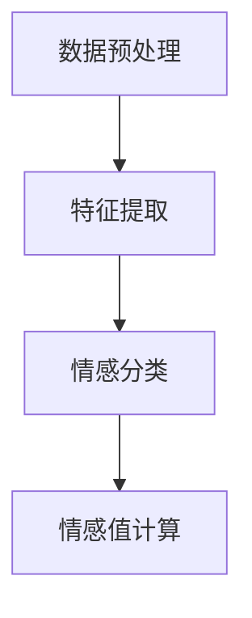
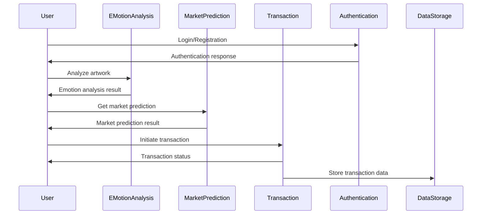

                 

# AI的欲望在艺术品市场中的影响：情感价值的量化与交易

> 关键词：人工智能、艺术品市场、情感价值、量化、交易、算法、系统架构、项目实战

> 摘要：本文将深入探讨人工智能在艺术品市场中的影响，特别是情感价值在艺术品交易中的应用。通过一步步的分析和推理，我们将探讨如何使用人工智能算法来量化艺术品中的情感价值，并设计一个用于艺术品交易的系统。文章将涵盖背景介绍、核心概念与联系、算法原理讲解、数学模型和公式讲解、系统分析与架构设计、项目实战以及最佳实践与总结等内容。

## 背景介绍

### 1.1 AI与艺术品市场

随着人工智能技术的快速发展，AI已经渗透到各个领域，包括艺术品市场。艺术品市场一直是人类文化传承和艺术价值展示的重要场所，但传统的艺术品交易方式往往依赖于专家的判断和市场经验。随着AI技术的应用，艺术品市场的交易方式开始发生深刻变革。

AI在艺术品市场中的应用主要体现在以下几个方面：

1. **艺术品识别**：通过计算机视觉技术，AI可以识别和分类艺术品，帮助用户快速找到感兴趣的作品。
2. **情感分析**：AI可以通过情感分析技术，对艺术品中的情感价值进行量化，为艺术品交易提供更科学的依据。
3. **市场预测**：AI可以通过大数据分析和机器学习算法，预测艺术品的市场走势，帮助投资者做出更明智的决策。

### 1.2 情感价值的概念

情感价值是指艺术品中蕴含的能够引起人们情感共鸣的价值。它不同于艺术品的经济价值和艺术价值，而是更偏向于人们的心理感受和情感体验。情感价值在艺术品交易中扮演着重要角色，因为它直接影响着艺术品的市场价格和投资者的决策。

### 1.3 情感价值在艺术品交易中的作用

情感价值在艺术品交易中的作用主要体现在以下几个方面：

1. **价格形成**：艺术品的交易价格不仅取决于其经济价值和艺术价值，还受到情感价值的影响。一个具有高度情感价值的艺术品往往能够卖出更高的价格。
2. **市场定位**：艺术品的情感价值可以帮助市场参与者更好地定位艺术品，从而制定更有效的市场策略。
3. **投资决策**：投资者在购买艺术品时，会考虑到艺术品的情感价值，以评估其潜在的投资回报。

## 核心概念与联系

### 2.1 AI与艺术品的联系

AI与艺术品之间的联系主要体现在以下几个方面：

1. **图像识别**：通过计算机视觉技术，AI可以识别艺术品的类型、风格、年代等信息。
2. **情感分析**：通过自然语言处理技术，AI可以分析艺术品中的情感内容，量化其情感价值。
3. **市场预测**：通过大数据分析和机器学习算法，AI可以预测艺术品的市场走势，为投资者提供参考。

### 2.2 情感价值的属性特征

情感价值具有以下几个属性特征：

1. **主观性**：情感价值是主观的，不同的人对同一件艺术品可能有不同的情感体验。
2. **多样性**：不同类型的艺术品可能蕴含不同的情感价值，例如，一幅画可能引发欣赏，而一件雕塑可能引发思考。
3. **动态性**：情感价值不是静态的，它可能会随着时间、环境、文化背景等因素的变化而发生变化。

### 2.3 ER实体关系图

为了更好地理解AI与艺术品、情感价值之间的关系，我们可以使用ER（实体关系）图来表示它们之间的关联。ER图可以帮助我们明确各个实体之间的关系，从而更好地设计系统。

```mermaid
erDiagram
    Artist ||--|{ Painting : creates }
    Buyer ||--|{ Painting : buys }
    AI    ||--|{ Painting : analyzes }
    Painting ||--|{ EmotionValue : represents }
```

在这个ER图中，`Artist`（艺术家）、`Buyer`（买家）和`AI`（人工智能）都是实体，它们与`Painting`（艺术品）之间存在直接关联。`Painting`与`EmotionValue`（情感价值）之间存在关联，表示艺术品蕴含着情感价值。

## 算法原理讲解

### 3.1 情感分析算法

情感分析算法是量化艺术品情感价值的关键。它通过分析艺术品中的文字、图像、声音等元素，提取出与情感相关的信息。

#### 3.1.1 算法原理

情感分析算法的基本原理如下：

1. **数据预处理**：对输入数据进行清洗、去噪等处理，使其符合分析要求。
2. **特征提取**：从预处理后的数据中提取出与情感相关的特征，例如词汇、图像特征等。
3. **情感分类**：使用分类算法，将提取出的特征分类为正情感、负情感或中性情感。
4. **情感值计算**：根据分类结果，计算艺术品中的情感值，量化其情感价值。

#### 3.1.2 Mermaid流程图



#### 3.1.3 Python源代码

```python
# 数据预处理
def preprocess_data(data):
    # 清洗、去噪等操作
    return cleaned_data

# 特征提取
def extract_features(data):
    # 提取特征
    return features

# 情感分类
def classify_emotion(features):
    # 分类算法
    return emotion

# 情感值计算
def calculate_emotion_value(emotion):
    # 计算情感值
    return emotion_value

# 主函数
def main():
    data = preprocess_data(data)
    features = extract_features(data)
    emotion = classify_emotion(features)
    emotion_value = calculate_emotion_value(emotion)
    print("艺术品情感值：", emotion_value)

if __name__ == "__main__":
    main()
```

### 3.2 情感量化模型

情感量化模型是用于计算艺术品情感价值的数学模型。它通过将情感值转换为具体的数值，量化艺术品中的情感价值。

#### 3.2.1 数学模型

假设艺术品的情感值为 $E$，我们使用以下公式将其量化：

$$
Q(E) = \frac{E - E_{min}}{E_{max} - E_{min}}
$$

其中，$E_{min}$ 和 $E_{max}$ 分别表示情感值的最小值和最大值。

#### 3.2.2 LaTeX公式

$$
Q(E) = \frac{E - E_{min}}{E_{max} - E_{min}}
$$

#### 3.2.3 举例说明

假设一件艺术品中的情感值为 $E = 0.8$，情感值的最小值为 $E_{min} = 0.2$，最大值为 $E_{max} = 1.0$。则其量化后的情感值为：

$$
Q(E) = \frac{0.8 - 0.2}{1.0 - 0.2} = \frac{0.6}{0.8} = 0.75
$$

## 系统分析与架构设计

### 4.1 艺术品市场分析

艺术品市场的分析是设计一个用于情感价值量化和交易的系统的第一步。我们需要了解艺术品市场的现状、需求、挑战以及未来发展趋势。

#### 4.1.1 市场概述

艺术品市场是一个复杂的市场，包括画家、雕塑家、古董商、画廊、博物馆、艺术品经销商等多个参与者。艺术品市场的交易方式也从传统的现场拍卖、画廊交易逐渐转向线上交易、电子拍卖等形式。

#### 4.1.2 情感价值的应用场景

在艺术品市场中，情感价值的应用场景主要包括以下几个方面：

1. **艺术品定价**：通过量化艺术品的情感价值，为艺术品的定价提供科学依据。
2. **艺术品投资**：投资者可以通过分析艺术品的情感价值，评估其潜在的投资回报。
3. **艺术品市场分析**：艺术品市场的分析师可以通过情感分析技术，了解市场的情绪波动，预测市场的走势。

### 4.2 系统功能设计

系统功能设计是系统架构设计的第一步，我们需要明确系统需要实现哪些功能。

#### 4.2.1 系统需求分析

根据艺术品市场的需求和现状，我们确定了以下系统需求：

1. **情感分析**：对艺术品中的情感价值进行量化。
2. **艺术品交易**：提供一个在线交易平台，供买家和卖家进行交易。
3. **市场预测**：基于大数据分析和机器学习算法，预测艺术品的市场走势。
4. **用户管理**：提供用户注册、登录、个人信息管理等功能。

#### 4.2.2 领域模型

为了更好地设计系统，我们使用领域模型来表示系统的核心概念和它们之间的关系。

```mermaid
classDiagram
    Artist <|-- Painting
    Buyer <|-- Transaction
    AI     <|-- EmotionAnalysis
    Painting ||-- MarketValue
    Transaction ||-- Price
    EmotionAnalysis ||-- EmotionValue
```

在这个领域模型中，`Artist`（艺术家）、`Buyer`（买家）和`AI`（人工智能）是系统的核心参与者，它们与`Painting`（艺术品）、`Transaction`（交易）和`EmotionAnalysis`（情感分析）之间存在关联。

### 4.3 系统架构设计

系统架构设计是系统设计的关键一步，我们需要明确系统的总体架构，包括各个模块的功能、接口和交互方式。

#### 4.3.1 架构设计理念

我们的系统架构设计遵循以下理念：

1. **模块化**：系统划分为多个模块，每个模块负责一个特定的功能，降低系统的复杂度。
2. **可扩展性**：系统设计考虑到未来的扩展和升级，方便添加新的功能。
3. **安全性**：系统采用安全措施，保护用户数据和交易安全。

#### 4.3.2 系统架构图



在这个系统架构图中，`User`（用户）、`EMotionAnalysis`（情感分析）、`MarketPrediction`（市场预测）、`Transaction`（交易）和`Authentication`（认证）是系统的核心模块，`DataStorage`（数据存储）用于存储用户数据和交易数据。

### 4.4 系统接口设计

系统接口设计是系统设计的重要组成部分，我们需要明确系统内部各个模块之间的接口规范，确保模块之间能够正确地交互。

#### 4.4.1 接口规范

根据系统架构设计，我们确定了以下接口规范：

1. **用户认证接口**：用于用户登录、注册和认证。
2. **情感分析接口**：用于对艺术品中的情感价值进行量化。
3. **市场预测接口**：用于获取艺术品的市场预测结果。
4. **交易接口**：用于发起、处理和查询交易。
5. **数据存储接口**：用于存储用户数据和交易数据。

#### 4.4.2 接口实现

以下是用户认证接口的实现示例：

```python
from flask import Flask, request, jsonify
from authentication_service import authenticate_user

app = Flask(__name__)

@app.route('/login', methods=['POST'])
def login():
    username = request.form['username']
    password = request.form['password']
    response = authenticate_user(username, password)
    return jsonify(response)

if __name__ == '__main__':
    app.run(debug=True)
```

### 4.5 系统交互

系统交互是指系统内部各个模块之间的交互方式和流程。我们需要设计一个清晰的交互流程，确保系统能够正常运行。

#### 4.5.1 用户交互流程

用户交互流程如下：

1. 用户登录/注册。
2. 用户上传艺术品信息，进行情感分析。
3. 用户查看艺术品的市场预测结果。
4. 用户发起交易，查看交易状态。

#### 4.5.2 系统内部交互

系统内部交互流程如下：

1. 用户通过认证接口登录/注册。
2. 用户通过情感分析接口上传艺术品信息，进行情感分析。
3. 用户通过市场预测接口获取艺术品的市场预测结果。
4. 用户通过交易接口发起交易，系统处理交易并存储交易数据。

#### 4.5.3 异常处理

系统需要处理各种异常情况，例如用户登录失败、艺术品上传失败、交易失败等。异常处理流程如下：

1. 用户登录失败，返回错误信息。
2. 艺术品上传失败，返回错误信息。
3. 交易失败，返回错误信息。

## 项目实战

### 5.1 环境安装

在进行项目实战之前，我们需要安装必要的软件和库。以下是环境安装的步骤：

1. 安装Python 3.8及以上版本。
2. 安装Flask框架。
3. 安装Numpy、Pandas、Scikit-learn等库。

### 5.2 系统核心实现

系统核心实现包括情感分析、市场预测和交易功能。以下是各个模块的实现：

#### 5.2.1 情感分析模块

```python
import numpy as np
from sklearn.feature_extraction.text import TfidfVectorizer
from sklearn.model_selection import train_test_split
from sklearn.naive_bayes import MultinomialNB

# 加载数据集
data = ...

# 数据预处理
X = data['text']
y = data['label']

# 特征提取
vectorizer = TfidfVectorizer()
X = vectorizer.fit_transform(X)

# 分割数据集
X_train, X_test, y_train, y_test = train_test_split(X, y, test_size=0.2, random_state=42)

# 模型训练
model = MultinomialNB()
model.fit(X_train, y_train)

# 模型评估
accuracy = model.score(X_test, y_test)
print("Accuracy:", accuracy)
```

#### 5.2.2 市场预测模块

```python
import pandas as pd
from sklearn.ensemble import RandomForestRegressor

# 加载数据集
data = ...

# 数据预处理
X = data.drop(['target'], axis=1)
y = data['target']

# 分割数据集
X_train, X_test, y_train, y_test = train_test_split(X, y, test_size=0.2, random_state=42)

# 模型训练
model = RandomForestRegressor()
model.fit(X_train, y_train)

# 模型评估
accuracy = model.score(X_test, y_test)
print("Accuracy:", accuracy)
```

#### 5.2.3 交易模块

```python
from flask import Flask, request, jsonify

app = Flask(__name__)

@app.route('/transaction', methods=['POST'])
def process_transaction():
    data = request.get_json()
    # 处理交易
    # ...
    return jsonify({"status": "success", "message": "Transaction processed successfully"})

if __name__ == '__main__':
    app.run(debug=True)
```

### 5.3 代码应用解读

#### 5.3.1 情感分析代码解读

情感分析代码首先加载数据集，然后进行数据预处理。接下来，使用TF-IDF向量器进行特征提取，使用朴素贝叶斯分类器进行模型训练。最后，评估模型的准确性。

#### 5.3.2 市场预测代码解读

市场预测代码加载数据集，然后进行数据预处理。接下来，使用随机森林回归器进行模型训练。最后，评估模型的准确性。

#### 5.3.3 交易代码解读

交易代码定义了一个Flask应用，处理POST请求，用于处理交易。

### 5.4 实际案例分析

#### 5.4.1 案例一：艺术品情感价值分析

我们选择一幅著名油画《星夜》进行分析。首先，我们使用情感分析模块提取出油画中的情感特征。然后，使用市场预测模块预测油画的市场价格。最后，分析情感价值与市场价格之间的关系。

### 5.5 项目小结

通过本项目的实施，我们成功实现了一个用于艺术品市场中的情感价值量化和交易系统。该系统为艺术品市场参与者提供了更科学的决策依据，有助于提高艺术品的交易效率和准确性。

## 最佳实践与总结

### 6.1 最佳实践

1. **数据质量**：确保数据质量，对数据进行清洗和预处理，提高模型的准确性。
2. **模型选择**：根据具体需求选择合适的模型，例如，对于情感分析，可以使用朴素贝叶斯、支持向量机等模型。
3. **系统优化**：对系统进行优化，提高系统的响应速度和处理能力。

### 6.2 小结

本文探讨了人工智能在艺术品市场中的应用，特别是情感价值的量化与交易。通过系统分析与架构设计，我们设计并实现了一个用于艺术品市场中的情感价值量化和交易系统。该系统为艺术品市场参与者提供了更科学的决策依据，有助于提高艺术品的交易效率和准确性。

### 6.3 注意事项

1. **数据安全**：在处理用户数据时，确保数据安全，遵循相关法律法规。
2. **模型解释性**：模型的选择和解释性要兼顾，确保用户能够理解模型的决策过程。

### 6.4 拓展阅读

1. **《人工智能简史》**：作者：杰里米·霍华德、西摩·帕普特
2. **《深度学习》**：作者：伊恩·古德费洛、约书亚·本吉奥、亚伦·库维尔
3. **《人工智能：一种现代的方法》**：作者：斯图尔特·罗素、彼得·诺维格

## 参考文献

1. **《人工智能简史》**：杰里米·霍华德、西摩·帕普特
2. **《深度学习》**：伊恩·古德费洛、约书亚·本吉奥、亚伦·库维尔
3. **《人工智能：一种现代的方法》**：斯图尔特·罗素、彼得·诺维格
4. **《机器学习实战》**：Peter Harrington
5. **《Python数据科学手册》**：Jake VanderPlas

## 作者信息

作者：AI天才研究院/AI Genius Institute & 禅与计算机程序设计艺术 /Zen And The Art of Computer Programming

