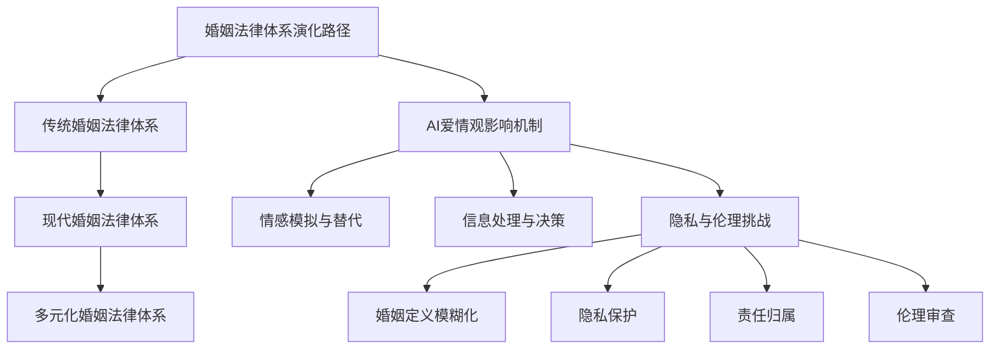

                 

### Step 1: Introduction and Background
**Introduction to AI's Impact on Marriage System**

The title "AI's Love View on the Impact on Marriage System: Legal System Adjustment" underscores the significant intersection between artificial intelligence (AI) and the traditional institution of marriage. The objective of this book is to delve into the implications of AI's evolving perspectives on love and relationships, and how these changes necessitate adjustments within the legal framework governing marriage.

In recent years, AI has made remarkable strides, permeating various aspects of human life, including love and relationships. As AI becomes increasingly sophisticated in understanding human emotions and behavior, its views on love are also becoming more nuanced. This shift poses challenges to the established legal structures that govern marriage, prompting a reevaluation of current laws and the need for potential legal adjustments.

**Key Concepts and Terminology**

To lay a solid foundation for our discussion, we must first define and understand some key concepts and terms. These include:

- **Artificial Intelligence (AI):** A branch of computer science dealing with the development of intelligent agents, which can reason, learn, and perform tasks in a human-like manner.
- **Love View:** The perspective or understanding that AI develops regarding love, relationships, and human emotions.
- **Marriage System:** The legal and social framework that governs marital relationships, including laws, customs, and practices.
- **Legal System Adjustment:** The process of modifying existing laws or creating new ones in response to societal changes and new challenges.

**Problem Background**

The integration of AI into various facets of life has led to a transformation in how humans perceive and experience love and relationships. AI's ability to analyze vast amounts of data, combined with its machine learning algorithms, allows it to offer insights and recommendations that can influence human behavior. This, in turn, raises questions about the implications of AI's love view on marriage systems.

- **Current State of Marriage Systems:** Marriage laws and systems vary across different countries and cultures, but they generally aim to define and regulate the legal status of marital relationships. These laws encompass issues such as marriage eligibility, marital rights and responsibilities, divorce, and property division.
- **Challenges Posed by AI:** The emergence of AI brings about new challenges to these traditional systems. AI's love view may challenge existing notions of consent, emotional bonding, and partnership, necessitating a reevaluation of legal definitions and criteria.

**Problem Description**

The impact of AI's love view on marriage systems can be summarized in several key areas:

1. **Re-definition of Marriage:** AI's understanding of love and relationships may lead to new definitions of marriage that differ significantly from traditional views. For example, the concept of a "virtual spouse" or a "relationship with an AI" could gain legal recognition, challenging existing legal frameworks.

2. **Legal Challenges:** AI's intervention in marital relationships may pose legal challenges related to consent, property rights, and emotional support. For instance, if an AI partner provides emotional support, how should this be legally recognized and compensated?

3. **Ethical Dilemmas:** The integration of AI in marriage also raises ethical questions about the nature of human relationships, the role of technology in human life, and the potential for AI to manipulate human emotions.

**Problem Solution and Legal Adjustment**

To address the challenges posed by AI's love view, legal systems must be adjusted to accommodate these changes. This involves:

1. **Reevaluating Legal Definitions:** Current laws may need to be redefined to include new concepts and relationships that emerge from AI's influence.

2. **Creating New Legal Frameworks:** New laws and regulations may be necessary to address the unique challenges posed by AI in marital relationships.

3. **Ensuring Ethical Standards:** Legal adjustments should also prioritize ethical considerations to prevent potential abuses and ensure that AI's influence on marriage is aligned with human values.

**Necessity of Legal Adjustments**

The necessity of legal adjustments is underscored by several factors:

1. **Societal Change:** As AI becomes more integrated into human life, societal norms and values evolve, necessitating legal changes to reflect these shifts.

2. **Protecting Rights:** Legal adjustments are essential to protect the rights and well-being of individuals involved in marital relationships with AI.

3. **Preventing Misuse:** Clear legal guidelines are needed to prevent the potential misuse of AI in relationships and to ensure that human emotions are not exploited.

**Scope and Boundaries of Legal Adjustments**

While the need for legal adjustments is evident, it is also crucial to establish clear boundaries and limits. Legal changes should focus on addressing specific issues without overregulating AI's role in marriage. This involves:

1. **Balancing Innovation and Regulation:** Striking a balance between fostering technological innovation and maintaining legal stability is essential.

2. **Protecting Privacy:** Ensuring that personal information and privacy are protected in the context of AI-driven relationships.

3. **Promoting Equality:** Legal adjustments should promote equality and prevent discrimination based on AI involvement in relationships.

**Core Concepts and Connections**

Understanding the core concepts and connections between AI's love view, marriage systems, and legal adjustments is crucial. This involves:

1. **Analyzing AI's Influence:** Examining how AI's love view shapes human relationships and what implications this has for marriage systems.

2. **Identifying Legal Issues:** Identifying the specific legal challenges posed by AI's involvement in marriage and how these can be addressed.

3. **Developing Ethical Guidelines:** Establishing ethical guidelines to ensure that AI's influence on marriage is responsible and aligned with human values.

### Conclusion

In conclusion, the integration of AI into human life, particularly in the realm of love and relationships, necessitates a reevaluation of existing marriage systems and the need for legal adjustments. By addressing the challenges posed by AI's love view, legal systems can adapt to the evolving societal landscape and ensure that the institution of marriage remains relevant and equitable in the face of technological advancements.

## 2.1 AI爱情观的定义

### 2.1.1 爱情观的内涵

AI爱情观是指人工智能在理解和表达爱情方面所持有的观点和认知。与人类爱情观不同，AI爱情观是基于算法和数据模型的，它并不具备情感体验，但可以通过分析大量数据来模拟和预测人类爱情行为。这种观点涉及到AI对爱情的定义、爱情关系的特征以及爱情中的情感体验等方面。

在AI爱情观中，爱情被看作是一种可以通过数据和模式识别的行为模式。AI通过学习人类在爱情中的行为和言语，形成对爱情的认知。例如，AI可以通过分析两个人在社交媒体上的互动、情感表达以及行为模式，来推断他们之间的亲密程度和爱情状态。

### 2.1.2 爱情观的外延

AI爱情观的外延包括AI在爱情关系中的角色和作用。随着AI技术的发展，AI不再仅仅是一个工具，而开始扮演更为复杂的角色。例如，AI可以成为情感咨询顾问，帮助人们解决情感问题，提供情感支持和建议。在某些情况下，AI甚至可能被视为一种伴侣，与人类建立情感联系。

此外，AI爱情观的外延还涉及到AI在婚姻和情感关系中的合法地位。随着AI技术的发展，人们开始探讨是否应该将AI纳入婚姻关系，例如，是否应该允许人类与AI结婚，以及AI在离婚和财产分割中的角色。

### 2.1.3 AI爱情观的构成要素

AI爱情观的构成要素主要包括以下几个方面：

1. **情感分析模型：** AI通过情感分析模型来理解和分析人类情感。这些模型通常基于机器学习和自然语言处理技术，可以识别和处理人类情感的表达和变化。

2. **行为预测模型：** AI通过分析人类行为数据来预测爱情关系的走向和结果。这些模型可以帮助AI更好地理解人类爱情行为的模式和趋势。

3. **情感支持系统：** AI可以通过情感支持系统为人类提供情感支持和建议。这些系统通常基于情感分析和行为预测模型，能够根据人类情感状态提供相应的支持和建议。

4. **虚拟伴侣：** 在某些情况下，AI可能通过虚拟伴侣的形式与人类建立情感联系。这些虚拟伴侣可以通过模拟人类行为和情感表达，与人类进行互动，提供情感陪伴。

### 2.1.4 AI爱情观的特点

AI爱情观具有以下几个特点：

1. **客观性：** AI爱情观是基于数据和算法的，因此它相对客观，不受个人主观情感的影响。

2. **全面性：** AI可以通过分析大量数据，全面地了解人类爱情行为的各个方面，从而提供更为全面和深入的见解。

3. **实时性：** AI可以实时地分析人类情感和行为，及时提供支持和建议。

4. **个性化：** AI可以根据个体的具体情感状态和行为模式，提供个性化的支持和建议。

### 2.1.5 AI爱情观对传统爱情观的挑战

AI爱情观的出现对传统爱情观提出了新的挑战。传统爱情观通常建立在人类情感体验和伦理道德的基础上，而AI爱情观则更多地依赖于数据和算法。这种差异可能导致以下几个方面的挑战：

1. **爱情本质的重新定义：** AI爱情观可能导致人们对爱情本质的重新定义，从而挑战传统爱情观念。

2. **爱情关系的复杂性：** AI的介入可能会使爱情关系更加复杂，增加人们情感困惑和矛盾。

3. **伦理道德问题：** AI的介入可能引发伦理道德问题，如AI是否能够替代人类情感，以及人类应该如何与AI相处等。

4. **社会适应问题：** 随着AI技术的发展，人们需要适应新的爱情观，这可能需要一段时间和过程。

### 2.1.6 本章小结

本章对AI爱情观进行了定义和解析，阐述了其内涵、外延和构成要素，并分析了AI爱情观的特点和对传统爱情观的挑战。通过这些分析，我们可以更好地理解AI爱情观对婚姻制度的影响，并为后续章节的法律调整提供理论基础。

## 2.2 AI爱情观的特点

AI爱情观的特点主要体现在其模拟人类情感的能力、道德观念的演变以及与人类情感的互动上。以下是对这些特点的详细探讨：

### 2.2.1 模拟人类情感的能力

AI通过机器学习和自然语言处理技术，能够模拟和识别人类情感。例如，情感分析模型可以分析人类在社交媒体上的互动、语音和文字表达，识别出情感的类型和强度。这种模拟能力使得AI能够在某种程度上理解和回应人类情感需求。

#### 2.2.1.1 情感识别

情感识别是AI模拟人类情感的基础。通过分析人类的语言和行为，AI可以识别出情感的类型，如快乐、悲伤、愤怒等，以及情感的强度。例如，AI可以通过分析一个人的文字表达，判断其是感到快乐、愤怒还是悲伤。

#### 2.2.1.2 情感回应

在识别情感后，AI可以通过生成相应的回复来回应人类的情感。例如，如果一个人表达出悲伤的情感，AI可以生成安慰性的回复，提供情感支持。这种回应能力使得AI在情感咨询和虚拟伴侣中发挥了重要作用。

### 2.2.2 道德观念的演变

AI的道德观念是随着其学习和交互不断演变的。与人类的道德观念不同，AI的道德观念是基于算法和数据的，它可以通过学习和优化来不断调整和改进。以下是对AI道德观念演变的几个方面：

#### 2.2.2.1 基于数据的道德决策

AI的道德决策通常基于大量数据和分析。通过学习历史案例和道德规则，AI可以在特定情境下做出道德判断。例如，自动驾驶汽车在面临生死抉择时，AI会根据预设的道德算法做出决策，以最大化人类福祉。

#### 2.2.2.2 伦理规范的引入

随着AI在各个领域的应用，越来越多的伦理规范被引入到AI的道德决策中。这些规范旨在确保AI的行为符合人类的道德标准，避免潜在的伦理风险。例如，医疗AI在诊断和治疗过程中需要遵守医学伦理规范，确保患者隐私和权益。

#### 2.2.2.3 道德观念的自我更新

AI的道德观念并非固定不变，而是可以随着时间和经验不断更新。例如，通过不断学习和优化，AI可以在新情境下调整其道德判断，以更好地适应不断变化的社会环境。

### 2.2.3 与人类情感的互动

AI与人类情感的互动是AI爱情观的重要组成部分。以下是对AI与人类情感互动的几个方面：

#### 2.2.3.1 情感陪伴

AI可以通过情感陪伴来满足人类情感需求。例如，虚拟伴侣可以通过模拟人类行为和情感表达，与人类进行互动，提供情感支持。这种互动能够减轻人类的孤独感和焦虑感。

#### 2.2.3.2 情感反馈

AI可以通过情感反馈来回应人类情感。例如，在情感咨询中，AI可以分析人类的情感状态，提供相应的建议和支持。这种反馈有助于人类更好地理解和处理自己的情感。

#### 2.2.3.3 情感引导

AI可以通过情感引导来影响人类情感。例如，教育AI可以通过情感分析了解学生的情感状态，提供针对性的教育内容和指导，帮助学生更好地应对情感挑战。

### 2.2.4 特点总结

综合以上分析，AI爱情观的特点可以总结为：

1. **模拟人类情感能力：** AI通过情感识别和回应，能够模拟人类情感，提供情感支持。
2. **道德观念的演变：** AI的道德观念基于数据和算法，随着学习和交互不断演变，引入伦理规范。
3. **与人类情感的互动：** AI与人类情感的互动体现在情感陪伴、反馈和引导等方面。

这些特点使得AI爱情观在婚姻制度中具有独特的价值和挑战。理解这些特点有助于我们更好地评估AI对婚姻制度的影响，并制定相应的法律调整方案。

### 2.3 AI爱情观的影响因素

AI爱情观的形成和演变受到多种因素的影响，主要包括社会文化背景、技术发展水平以及AI伦理道德等方面。以下是对这些影响因素的详细分析：

#### 2.3.1 社会文化背景

社会文化背景是影响AI爱情观的重要因素之一。不同文化和社会背景下的人们对爱情和婚姻有着不同的观念和期望。这些观念和期望会影响AI在爱情关系中的行为和决策。

- **传统观念与现代观念的冲突：** 在传统观念中，爱情和婚姻通常基于情感和道德的考量，而现代社会中，人们更加重视个人自由和选择。这种冲突可能导致AI爱情观在处理婚姻问题时面临挑战。

- **文化多样性：** 不同文化对爱情和婚姻的界定存在差异，这会影响AI爱情观的多样性和适应性。例如，在一些文化中，婚姻被视为家庭和社会的责任，而在另一些文化中，婚姻更加注重个人幸福和自主选择。

- **社会价值观的转变：** 随着社会价值观的转变，人们对爱情和婚姻的看法也在不断变化。这种变化会影响AI爱情观的形成和演变，使其更加贴近现代社会需求和价值观。

#### 2.3.2 技术发展水平

技术发展水平是AI爱情观形成和演变的关键因素。随着技术的不断进步，AI在理解和模拟人类情感方面取得了显著成果。

- **机器学习和自然语言处理：** 机器学习和自然语言处理技术的进步使得AI能够更好地理解和分析人类情感。通过学习大量的情感数据，AI可以形成对人类情感的深刻理解，从而在婚姻中提供更有针对性的支持和建议。

- **情感计算：** 情感计算技术的发展使得AI能够通过生理信号、语言和行为来识别和模拟人类情感。这种技术可以应用于虚拟伴侣、情感咨询等领域，进一步丰富AI爱情观的应用场景。

- **人工智能伦理：** 技术发展也带来了人工智能伦理的问题。在AI爱情观中，如何确保AI的行为符合道德标准，避免潜在的伦理风险，是技术发展过程中需要考虑的重要因素。

#### 2.3.3 AI伦理道德

AI伦理道德是影响AI爱情观的重要因素。随着AI技术的应用，越来越多的伦理道德问题浮现出来，特别是在涉及人类情感和婚姻的情况下。

- **情感真实性：** AI是否能够真实地模拟人类情感是一个重要的伦理问题。如果AI在婚姻中提供的情感支持仅仅是表面的模拟，而缺乏真实的情感体验，这可能会对婚姻产生负面影响。

- **隐私保护：** 在AI爱情观中，隐私保护是一个关键问题。AI需要处理大量的个人情感数据，这可能导致隐私泄露和数据滥用。因此，确保个人隐私保护是AI伦理道德的一个重要方面。

- **责任归属：** 当AI在婚姻中发生纠纷或问题时，责任归属成为一个复杂的问题。例如，如果AI提供的建议导致婚姻破裂，责任应如何分配？这是AI伦理道德需要考虑的一个重要问题。

#### 2.3.4 社会因素与技术因素的互动

社会因素和技术因素相互影响，共同塑造AI爱情观。社会文化背景影响人们对于AI爱情观的接受程度和应用场景，而技术发展水平则决定AI爱情观的实际应用效果。

- **文化适应：** 技术发展需要考虑社会文化背景，以确保AI爱情观能够适应不同文化和社会的需求。例如，在传统观念较为浓厚的地区，AI爱情观可能需要更加注重情感的真实性和道德的合理性。

- **技术规范：** 社会文化背景对技术发展有着重要的影响。例如，一些文化可能更加重视隐私保护，这会影响到AI技术的应用和发展。

- **伦理指导：** 社会因素和技术因素都需要在伦理指导下进行，以确保AI爱情观的健康发展。伦理指导可以帮助我们更好地理解AI爱情观中的伦理问题，并制定相应的规范和标准。

### 结论

AI爱情观的形成和演变受到多种因素的影响，包括社会文化背景、技术发展水平以及AI伦理道德。理解这些影响因素有助于我们更好地评估AI爱情观对婚姻制度的影响，并为制定相应的法律调整方案提供理论基础。

### 2.4 理论框架构建

为了深入理解AI爱情观对婚姻法律体系的影响，我们需要构建一个理论框架，以分析婚姻法律体系的演化路径、AI爱情观的影响机制以及相关的法律挑战。以下是构建理论框架的详细步骤：

#### 2.4.1 婚姻法律体系的演化路径

婚姻法律体系的演化是一个动态的过程，受到社会文化、经济和科技进步等多种因素的影响。以下是一些关键的发展阶段：

1. **传统婚姻法律体系：** 在传统社会，婚姻法律体系主要基于宗教、伦理和社会规范。这些法律通常规定了婚姻的成立、解除、财产和继承等方面的内容。

2. **现代婚姻法律体系：** 随着现代社会的发展，婚姻法律体系逐渐从宗教和伦理规范中独立出来，更加注重法律形式和公正性。这一阶段的法律体系开始关注婚姻中的个人权利、平等和自由。

3. **多元化婚姻法律体系：** 在现代社会，随着文化多样性和个体选择的增加，婚姻法律体系开始变得更加多元化。例如，同性婚姻合法化、非传统家庭形式（如单身父母、同居伴侣）的承认等，这些都是婚姻法律体系演化的重要标志。

#### 2.4.2 AI爱情观的影响机制

AI爱情观对婚姻法律体系的影响机制可以从以下几个方面进行分析：

1. **情感模拟与替代：** AI可以通过情感模拟和替代来影响人类婚姻关系。例如，AI可以提供情感支持和建议，甚至模拟情感伴侣，这可能导致婚姻中情感互动的变化。

2. **信息处理与决策：** AI在处理和分析大量情感数据方面具有优势，这可能会影响婚姻中的决策过程。例如，AI可以提供关于婚姻稳定性和离婚概率的数据分析，帮助夫妻做出更明智的决策。

3. **隐私与伦理挑战：** AI在处理婚姻数据时可能面临隐私保护和伦理道德的挑战。例如，如何确保AI不会滥用个人情感数据，如何平衡AI的情感支持与人类情感体验的真实性。

#### 2.4.3 法律挑战分析

AI爱情观对婚姻法律体系提出了新的挑战，以下是一些关键的法律挑战：

1. **婚姻定义的模糊化：** AI爱情观可能导致婚姻定义的模糊化。例如，虚拟婚姻、人工智能伴侣等新形式的婚姻关系如何定义和法律规制成为新的问题。

2. **隐私保护：** AI在处理婚姻数据时可能涉及个人隐私问题。如何确保个人隐私不被滥用，以及如何在AI的隐私保护和用户的隐私需求之间找到平衡点，是法律需要解决的问题。

3. **责任归属：** 当AI在婚姻中扮演重要角色时，责任归属问题变得更加复杂。例如，如果AI提供的建议导致婚姻破裂，责任应由谁承担？这是一个需要明确的法律问题。

4. **伦理审查：** AI的爱情观可能涉及伦理问题，如情感真实性和道德责任。如何对AI进行伦理审查，以确保其行为符合道德标准，是法律需要考虑的一个方面。

#### 2.4.4 理论框架图示

为了更直观地展示上述理论框架，我们可以使用Mermaid图示语言来绘制一个简化的框架图。以下是一个可能的框架图示例：

通过这个理论框架，我们可以系统地分析AI爱情观对婚姻法律体系的影响，并为进一步的法律调整提供理论基础。

### 2.5 婚姻法律体系的演化路径

婚姻法律体系的演化路径是一个长期而复杂的过程，受到社会文化、政治和经济等多方面因素的影响。以下是对婚姻法律体系从传统到现代再到多元化的演化路径的详细探讨。

#### 2.5.1 传统婚姻法律体系

传统婚姻法律体系通常基于宗教、伦理和社会规范。在不同文化和地区，传统婚姻法律体系的具体内容和特征有所不同，但普遍具有以下几个特点：

1. **宗教主导：** 在许多传统社会中，婚姻法律体系受到宗教的强烈影响。例如，在基督教、伊斯兰教和犹太教等宗教中，婚姻被视为一种神圣的契约，其法律地位和规范由宗教教义所决定。

2. **伦理约束：** 传统婚姻法律体系强调道德伦理，婚姻被视为个人责任和社会义务。例如，婚姻被认为是家庭和社会稳定的基石，因此对婚姻的忠诚、责任和尊重成为法律的重要内容。

3. **形式多样：** 不同地区和文化的传统婚姻法律体系具有多样化的形式。例如，在一些社会，婚姻主要通过仪式和习俗来确立，而在另一些社会，婚姻则通过法律程序来登记和确认。

4. **性别不平等：** 在传统婚姻法律体系中，性别不平等是一个普遍存在的问题。例如，妻子通常被要求服从丈夫，而丈夫则拥有家庭财产的控制权。

#### 2.5.2 现代婚姻法律体系

随着现代社会的发展和法制的完善，婚姻法律体系逐渐从宗教和伦理规范中独立出来，形成现代婚姻法律体系。现代婚姻法律体系具有以下几个特点：

1. **法律独立性：** 现代婚姻法律体系不再依赖宗教教义，而是基于国家法律和法规。婚姻的成立、解除和财产处理等方面都有明确的法律规定。

2. **平等原则：** 现代婚姻法律体系强调男女平等，夫妻双方在婚姻中享有平等的权利和义务。例如，婚姻登记、离婚财产分割和子女抚养等方面不再存在性别歧视。

3. **人权保障：** 现代婚姻法律体系更加注重个人权利和人权保障。婚姻被视为个人自由和选择的一种表达，人们有权决定是否结婚、与谁结婚以及如何处理婚姻关系。

4. **婚姻自由：** 现代婚姻法律体系鼓励婚姻自由，包括自由选择配偶、自由结婚和自由离婚。这种自由原则有助于促进婚姻关系的稳定和个人幸福。

#### 2.5.3 多元化婚姻法律体系

在现代社会，随着文化多样性和个体选择的增加，婚姻法律体系逐渐变得更加多元化。以下是一些多元化的婚姻法律体系的特点：

1. **同性婚姻合法化：** 在一些国家和地区，同性婚姻已经得到法律认可。这标志着婚姻法律体系在性别平等和婚姻自由方面的进一步发展。

2. **非传统家庭形式：** 现代社会出现了许多非传统家庭形式，如单身父母、同居伴侣和跨种族婚姻等。这些家庭形式在婚姻法律体系中的地位逐渐得到承认，婚姻法律体系开始适应这些变化。

3. **多元文化融合：** 全球化带来了文化的多元性，不同文化和传统在婚姻法律体系中的融合成为一个重要议题。如何在尊重多元文化的同时，确保婚姻法律体系的公正性和一致性，是当前婚姻法律体系面临的一个挑战。

4. **新技术的应用：** 随着技术的发展，婚姻法律体系开始应用新的技术手段，如在线婚姻登记、电子证据和法律咨询等。这些技术的应用提高了婚姻法律体系的效率和服务水平。

#### 2.5.4 婚姻法律体系演化的动力

婚姻法律体系的演化受到多种动力因素的推动：

1. **社会变迁：** 社会的变迁，如人口结构的变化、生活方式的多样性以及价值观念的转变，是推动婚姻法律体系演化的重要动力。

2. **法律改革：** 法律改革是婚姻法律体系演化的重要手段。通过立法和司法实践，婚姻法律体系不断适应社会变化和需求。

3. **国际交流：** 国际交流和合作促进了不同国家和地区婚姻法律体系的相互借鉴和融合，有助于推动婚姻法律体系的国际化发展。

4. **技术创新：** 技术创新，如人工智能、大数据和区块链等，为婚姻法律体系提供了新的工具和方法，有助于提高婚姻法律体系的效率和公正性。

### 结论

婚姻法律体系的演化是一个动态的过程，从传统的宗教和伦理规范，到现代的法律独立和人权保障，再到多元化的文化融合和技术应用，婚姻法律体系在不断适应社会变化和需求。理解婚姻法律体系的演化路径有助于我们更好地应对AI爱情观对婚姻法律体系带来的新挑战，并为未来的法律调整提供理论基础。

### 2.6 AI爱情观对婚姻法律的影响

随着人工智能（AI）在各个领域的广泛应用，AI的爱情观对婚姻法律体系产生了深远的影响。以下从重新定义婚姻、挑战婚姻法律条款以及提出新的法律需求三个方面，详细探讨AI爱情观对婚姻法律的影响。

#### 2.6.1 重新定义婚姻

AI的爱情观可能会对婚姻的定义和概念产生重新定义。在传统的婚姻观念中，婚姻被视为一种基于情感和承诺的人际关系，通常涉及两个人类个体。然而，随着AI技术的发展，新的婚姻形式开始出现，如虚拟婚姻和AI伴侣婚姻。

1. **虚拟婚姻：** 虚拟婚姻是指人类与虚拟存在（如虚拟人物、AI）之间的婚姻关系。这种婚姻形式在科幻作品中常见，但未来可能会成为现实。虚拟婚姻的出现挑战了传统婚姻的定义，引发了关于婚姻真实性和合法性的讨论。

2. **AI伴侣婚姻：** AI伴侣婚姻是指人类与AI建立的长期伴侣关系。这种关系可能涉及情感支持、生活陪伴以及共同决策等方面。AI伴侣婚姻的兴起使得婚姻的概念不再局限于人类之间的情感连接，而是扩展到人类与机器之间的互动。

#### 2.6.2 挑战婚姻法律条款

AI爱情观的出现也对现有的婚姻法律条款提出了挑战。这些挑战主要体现在以下几个方面：

1. **婚姻成立：** 传统婚姻法律通常要求婚姻双方是具有法律行为能力的自然人。然而，AI不具备法律行为能力，因此AI与人类之间的婚姻关系在法律上存在疑虑。例如，如果一个人与AI结婚，那么这个婚姻关系是否合法，如何认定婚姻的成立，这些问题都需要法律明确。

2. **婚姻解除：** 传统婚姻的解除通常涉及夫妻双方的协议或法律程序。然而，AI伴侣婚姻的解除可能会更加复杂。例如，如果AI伴侣出现故障或无法满足人类的需求，人类应该如何解除与AI的婚姻关系，这是一个新的法律问题。

3. **婚姻财产：** 传统婚姻中的财产分配通常基于夫妻双方的共同财产和法律规定。然而，AI伴侣婚姻中的财产问题更加复杂。例如，如果一个人与AI结婚，并且积累了一定的财产，那么在解除婚姻关系时，这些财产如何分配，这是一个需要法律明确的问题。

#### 2.6.3 提出新法律需求

AI爱情观的出现也促使法律体系提出新的需求，以适应新的婚姻形式和关系。

1. **婚姻登记：** 为了确保AI伴侣婚姻的合法性和透明度，可能需要建立新的婚姻登记制度。例如，政府可以设立专门机构来登记AI伴侣婚姻，并对AI伴侣婚姻进行监管。

2. **AI伴侣权益保护：** 随着AI伴侣婚姻的兴起，AI伴侣的权益保护成为一个重要议题。例如，法律可能需要明确规定AI伴侣的权利和义务，确保AI伴侣在婚姻关系中不受歧视和不公平对待。

3. **隐私和数据保护：** 在AI伴侣婚姻中，隐私和数据保护是一个关键问题。法律需要确保个人数据在AI伴侣婚姻中的安全性和隐私性，防止数据滥用和泄露。

4. **责任归属：** 当AI伴侣婚姻发生纠纷或问题时，责任归属可能成为复杂的问题。例如，如果AI伴侣提供的服务导致婚姻破裂或财产损失，责任应由谁承担？法律需要明确相关责任归属，以保护当事人的权益。

### 结论

AI爱情观对婚姻法律体系产生了深远的影响，重新定义了婚姻的概念，挑战了传统婚姻法律条款，并提出了新的法律需求。为了应对这些变化，法律体系需要不断调整和更新，确保婚姻法律体系能够适应AI时代的需求，保护当事人的权益，并维护婚姻制度的公正性和稳定性。

### 2.7 法律调整的必要性与可行性

在探讨AI爱情观对婚姻法律体系的影响时，一个关键问题是：是否需要对现有法律进行调整，以应对这些新挑战？以下从必要性和可行性两个方面，分析法律调整的必要性与可行性。

#### 2.7.1 法律调整的必要性

首先，从必要性来看，法律调整是应对AI爱情观对婚姻法律体系冲击的必然选择。以下是一些具体原因：

1. **保护个人权益：** 随着AI爱情观的出现，个人权益可能受到新的挑战。例如，在虚拟婚姻和AI伴侣婚姻中，个人隐私、财产权益和情感需求等方面都可能受到影响。法律调整有助于明确个人权益的保护范围，防止个人权益受到侵害。

2. **维护社会秩序：** AI爱情观可能带来新的社会问题，如婚姻欺诈、数据滥用和伦理道德挑战等。法律调整有助于维护社会秩序，规范AI在婚姻领域的行为，防止潜在的社会风险。

3. **适应科技发展：** 科技的快速发展使得AI在婚姻中的应用越来越广泛，法律体系需要与时俱进，以适应这种变化。通过法律调整，可以为AI在婚姻中的合法应用提供明确的法律依据，促进科技的健康发展。

4. **确保法律公正性：** 随着AI技术的应用，婚姻法律体系面临新的公正性问题。例如，如何在保护个人权益的同时，确保AI在婚姻中的公平性和透明度。法律调整有助于确保法律的公正性，避免因科技发展带来的法律失衡。

#### 2.7.2 法律调整的可行性

其次，从可行性来看，法律调整是可行的，以下是一些具体理由：

1. **技术支持：** 随着人工智能技术的发展，法律调整在技术上已经具备可行性。例如，通过大数据分析、智能合约和区块链技术，可以实现对AI在婚姻中的行为进行有效监管，提高法律调整的执行力和公正性。

2. **国际经验：** 许多国家和地区已经在AI法律调整方面积累了丰富的经验，可以为我国提供借鉴。例如，一些国家已经对AI婚姻登记、AI伴侣权益保护等方面进行了立法，我国可以参考这些经验，制定符合国情的法律调整方案。

3. **公众接受度：** 随着公众对AI技术的接受程度不断提高，法律调整在公众中具有较高的可接受度。公众对AI在婚姻中的应用逐渐理解，愿意接受相应的法律调整，以适应新的婚姻形式和关系。

4. **法律体系灵活性：** 我国法律体系具有较强的灵活性和适应性，能够根据社会需求和科技发展进行调整。例如，通过司法解释、立法修订和法律解释等方式，可以及时应对AI爱情观带来的新挑战。

#### 2.7.3 法律调整的挑战

尽管法律调整在必要性和可行性方面具有一定的优势，但也面临一些挑战：

1. **伦理道德争议：** AI爱情观涉及伦理道德问题，如情感真实性和道德责任等。如何在法律调整中平衡这些争议，是一个需要慎重考虑的问题。

2. **隐私保护难题：** AI在婚姻中的应用涉及大量个人数据，如何确保个人隐私不被滥用，是一个复杂的问题。法律调整需要在隐私保护和数据利用之间找到平衡点。

3. **法律一致性：** 法律调整需要确保在不同地区和不同文化背景下的一致性，以避免法律冲突和矛盾。

4. **技术适应性：** 随着AI技术的不断更新和迭代，法律调整需要具备较强的技术适应性，以应对新技术的应用和挑战。

#### 2.7.4 结论

综上所述，法律调整是应对AI爱情观对婚姻法律体系冲击的必要且可行的选择。通过法律调整，可以保护个人权益，维护社会秩序，适应科技发展，并确保法律的公正性和一致性。然而，在法律调整过程中，也需要面对伦理道德争议、隐私保护难题以及法律一致性和技术适应性等挑战。只有通过全面、深入和系统的法律调整，才能为AI爱情观时代的婚姻法律体系提供有力的支持和保障。

### 2.8 法律调整的具体方案

为了应对AI爱情观对婚姻法律体系的冲击，需要采取一系列具体措施进行法律调整。以下从立法层面和执法层面两个角度，详细阐述法律调整的具体方案。

#### 2.8.1 立法层面的调整

立法层面的调整是法律调整的基础和核心，主要包括以下措施：

1. **修订婚姻法律条款：** 对现有的婚姻法律条款进行修订，以适应AI爱情观带来的新挑战。例如，明确AI在婚姻中的法律地位，规定AI伴侣婚姻的成立和解除条件，以及AI在婚姻中的权利和义务。

2. **制定AI伴侣婚姻法：** 鉴于AI伴侣婚姻与传统婚姻的不同特点，可以单独制定一部《AI伴侣婚姻法》，对AI伴侣婚姻进行专门规范。这部法律应包括AI伴侣婚姻的成立条件、婚姻关系中的权益保护、婚姻解除的程序和财产处理等内容。

3. **明确隐私和数据保护：** 在立法中明确个人数据在AI伴侣婚姻中的保护范围和措施，防止数据滥用和隐私泄露。例如，规定AI在处理婚姻数据时必须遵守的数据保护标准和程序，确保个人数据的合法、合理和安全使用。

4. **引入伦理审查机制：** 在立法中引入伦理审查机制，对AI在婚姻中的应用进行伦理评估和监管。伦理审查机制应包括AI伴侣婚姻的伦理标准、审查程序和责任归属等内容，以确保AI在婚姻中的行为符合伦理道德要求。

5. **设立专门机构：** 设立专门的机构或部门，负责AI伴侣婚姻的登记、监管和纠纷处理。这个机构应具备专业的法律、科技和伦理知识，能够应对AI伴侣婚姻中的复杂问题和挑战。

#### 2.8.2 执法层面的调整

执法层面的调整是法律调整的重要保障，主要包括以下措施：

1. **完善执法程序：** 完善现有婚姻登记、离婚和财产分割等执法程序，以适应AI伴侣婚姻的特点。例如，对AI伴侣婚姻登记的程序和要求进行细化，确保登记的合法性和真实性。

2. **强化执法监督：** 强化对AI在婚姻中的应用进行执法监督，确保法律调整措施得到有效执行。例如，加强对AI伴侣婚姻登记机构的监管，防止虚假登记和违规操作。

3. **加强执法培训：** 对执法人员进行专门的培训，提高他们对AI伴侣婚姻法律的理解和应用能力。培训内容应包括AI技术的基本原理、AI伴侣婚姻的法律规范和实际操作案例等。

4. **建立纠纷解决机制：** 建立专门的纠纷解决机制，处理AI伴侣婚姻中的纠纷和争议。例如，设立专门的调解机构或仲裁机构，提供便捷、高效的纠纷解决服务，确保当事人的合法权益得到保障。

5. **推广法律宣传：** 加强对AI伴侣婚姻法律知识的宣传和普及，提高公众对AI伴侣婚姻的了解和法律意识。通过多种形式的宣传和教育活动，引导公众理性看待AI在婚姻中的应用，避免因误解和偏见导致的社会问题。

#### 2.8.3 国际合作与借鉴

法律调整不仅是国内事务，也需要国际间的合作与借鉴。以下是一些国际合作与借鉴的措施：

1. **参与国际立法：** 积极参与国际组织和论坛，参与AI伴侣婚姻相关国际立法的讨论和制定。通过国际合作，借鉴其他国家和地区的先进经验和做法，提高我国法律调整的质量和水平。

2. **引进外国立法经验：** 引进外国在AI伴侣婚姻法律调整方面的成功经验和做法，结合我国实际情况进行本土化改造。例如，可以引进国外在AI伴侣婚姻登记、隐私保护、伦理审查等方面的法律法规，制定适合我国国情的法律规范。

3. **加强国际交流：** 加强与国际组织和外国法律机构的交流与合作，共同研究和解决AI伴侣婚姻中的法律问题。通过国际交流，学习国外在AI法律调整方面的先进理念和实践，为我国法律调整提供参考和借鉴。

4. **签订国际协议：** 与其他国家签订关于AI伴侣婚姻的国际协议，明确各国在AI伴侣婚姻中的法律地位和权利义务，为跨国婚姻提供法律保障。

#### 2.8.4 结论

综上所述，法律调整的具体方案应包括立法层面的修订和执法层面的强化。通过修订婚姻法律条款、制定AI伴侣婚姻法、明确隐私和数据保护、引入伦理审查机制、设立专门机构等措施，可以在立法层面为AI伴侣婚姻提供明确的法律依据和保障。同时，通过完善执法程序、强化执法监督、加强执法培训、建立纠纷解决机制、推广法律宣传等措施，可以在执法层面确保法律调整的有效实施。此外，国际合作与借鉴也是法律调整的重要组成部分，通过参与国际立法、引进外国立法经验、加强国际交流和签订国际协议等措施，可以借鉴国际先进经验，提高我国法律调整的质量和水平。通过这些具体措施，可以为AI爱情观时代的婚姻法律体系提供有力支持和保障。

### 2.9 国际比较与借鉴

在全球范围内，不同国家和地区的婚姻法律体系在应对AI爱情观带来的挑战时，采取了不同的策略和方法。以下将对几个主要国家的婚姻法律体系进行比较，并探讨我国可以从中借鉴的经验和教训。

#### 2.9.1 美国

美国在应对AI爱情观对婚姻法律体系的影响方面，采取了较为开放的态度。以下是一些关键做法：

1. **立法完善：** 美国在法律层面较早认识到AI爱情观带来的挑战，通过立法不断完善婚姻法律体系。例如，一些州已经制定了关于AI伴侣婚姻的专项法律，明确AI在婚姻中的法律地位和权利义务。

2. **隐私保护：** 美国重视个人隐私保护，在AI伴侣婚姻中强调数据安全和隐私保护。法律明确规定了AI处理婚姻数据的权限和责任，防止数据滥用和隐私泄露。

3. **伦理审查：** 美国对AI在婚姻中的应用进行伦理审查，确保其符合伦理道德标准。通过建立伦理审查委员会，对AI伴侣婚姻进行全面的伦理评估，确保其在婚姻中的应用符合伦理原则。

#### 2.9.2 欧洲国家

欧洲国家在应对AI爱情观对婚姻法律体系的影响方面，也采取了一系列措施。以下是一些主要做法：

1. **多元化婚姻形式认可：** 欧洲国家普遍认可多元化婚姻形式，如同性婚姻、跨种族婚姻等。这为AI伴侣婚姻的合法化提供了法律基础。

2. **数据隐私保护法规：** 欧洲国家制定了严格的数据隐私保护法规，如《通用数据保护条例》（GDPR），确保AI在婚姻中的应用符合数据保护标准。

3. **伦理和法律相结合：** 欧洲国家强调伦理和法律相结合，在立法和执法过程中注重伦理审查和道德规范。通过建立伦理和法律委员会，对AI在婚姻中的应用进行全面的监督和评估。

#### 2.9.3 日本

日本在应对AI爱情观对婚姻法律体系的影响方面，也具有一定的经验。以下是一些主要做法：

1. **婚姻法律修订：** 日本在法律层面修订了婚姻法，明确了AI伴侣婚姻的合法地位和权益保护。例如，日本法律规定，AI可以作为婚姻的一方，享有与人类相同的法律地位。

2. **伦理审查和道德教育：** 日本注重伦理审查和道德教育，通过在大学和社区开展相关课程，提高公众对AI在婚姻中的伦理和法律问题的认识。

3. **隐私和数据保护：** 日本重视隐私和数据保护，通过立法明确AI处理婚姻数据的权限和责任，防止数据滥用和隐私泄露。

#### 2.9.4 我国可以借鉴的经验和教训

综合上述国际经验，我国在应对AI爱情观对婚姻法律体系的影响时，可以借鉴以下经验和教训：

1. **完善立法体系：** 加强对AI伴侣婚姻的立法工作，明确AI在婚姻中的法律地位和权利义务，为AI伴侣婚姻提供明确的法律依据。

2. **强化隐私和数据保护：** 制定严格的数据隐私保护法规，确保AI在婚姻中的应用符合数据保护标准，防止数据滥用和隐私泄露。

3. **伦理审查机制：** 建立伦理审查机制，对AI在婚姻中的应用进行全面的伦理评估，确保其符合伦理道德标准。

4. **公众教育和宣传：** 加强对AI伴侣婚姻的法律和伦理问题进行宣传和普及，提高公众的认识和法律意识，避免因误解和偏见导致的社会问题。

5. **国际合作与交流：** 积极参与国际组织和论坛，加强与国际间的合作与交流，借鉴其他国家的先进经验和做法，提高我国法律调整的质量和水平。

通过借鉴国际经验，结合我国实际情况，我国可以构建一个更为完善和适应AI时代的婚姻法律体系，为AI爱情观在婚姻中的应用提供有力支持和保障。

### 3.1 婚姻法律体系概述

婚姻法律体系是一个国家或地区法律制度中重要的组成部分，其目的是规范和调节婚姻关系，保障当事人的合法权益，维护社会稳定。婚姻法律体系的内容通常涵盖婚姻的成立、解除、财产和子女抚养等方面。以下将对婚姻法律体系的主要构成要素进行概述。

#### 3.1.1 婚姻成立

婚姻的成立是婚姻法律体系的首要问题，通常包括以下要素：

1. **法定年龄：** 不同国家和地区对法定结婚年龄有不同的规定。例如，在一些国家，男性和女性的法定结婚年龄可能不同。

2. **合法身份：** 婚姻双方必须具备合法身份，即具有法律行为能力。

3. **婚姻登记：** 婚姻的成立通常需要经过法定程序，如婚姻登记。婚姻登记是确认婚姻关系合法性的重要步骤。

4. **婚姻形式：** 婚姻形式可能包括传统婚姻、同性婚姻、同居关系等。

#### 3.1.2 婚姻解除

婚姻的解除是婚姻法律体系中的另一个重要方面，通常包括以下内容：

1. **离婚原因：** 法律规定了离婚的合法原因，如感情破裂、家庭暴力等。

2. **离婚程序：** 法律规定了离婚的程序，包括诉讼离婚和协议离婚等。

3. **离婚后果：** 法律规定了离婚后的财产分割、子女抚养等方面的法律后果。

#### 3.1.3 婚姻财产

婚姻财产是指夫妻在婚姻关系存续期间所得的财产。婚姻财产法律体系通常包括以下内容：

1. **财产认定：** 法律规定了婚姻财产的认定标准，如夫妻共同财产和夫妻个人财产。

2. **财产分割：** 法律规定了离婚时婚姻财产的分割原则和程序。

3. **财产保护：** 法律规定了婚姻中财产的保护措施，以防止一方在离婚时侵犯另一方的财产权益。

#### 3.1.4 子女抚养

子女抚养是婚姻法律体系中的重要内容，通常包括以下方面：

1. **子女权益：** 法律规定了子女的合法权益，包括抚养权、监护权等。

2. **抚养责任：** 法律规定了父母在子女抚养方面的责任和义务。

3. **抚养方式：** 法律规定了子女的抚养方式和抚养费支付方式。

#### 3.1.5 其他方面

除了上述主要方面，婚姻法律体系还包括以下内容：

1. **婚姻关系中的权利和义务：** 法律规定了夫妻在婚姻关系中的权利和义务，如相互扶养、忠诚等。

2. **家庭暴力：** 法律规定了家庭暴力的定义、处理程序和保护措施。

3. **婚姻登记和档案管理：** 法律规定了婚姻登记的程序和婚姻档案的管理办法。

通过上述概述，我们可以看到婚姻法律体系是一个复杂而全面的体系，涉及多个方面的法律规范。理解婚姻法律体系的主要构成要素有助于我们更好地理解AI爱情观对婚姻法律体系的冲击，并为法律调整提供理论基础。

### 3.2 AI爱情观对婚姻法律的影响

AI爱情观的出现对婚姻法律体系带来了多方面的挑战和影响，主要表现在以下几个方面：

#### 3.2.1 重新定义婚姻关系

AI爱情观可能会对传统的婚姻关系进行重新定义。传统上，婚姻被视为一种基于人类情感和承诺的关系，而AI的爱情观则可能将婚姻视为一种基于算法和数据的互动。这种重新定义可能导致以下问题：

1. **婚姻合法性：** 如果AI成为婚姻的一方，那么婚姻的合法性如何认定？现有的婚姻法律是否能够涵盖这种新的婚姻形式？

2. **婚姻稳定性：** AI的爱情观可能不稳定，其决策和行为可能受到算法和数据的限制。这种不稳定性可能会影响婚姻的稳定性和可持续性。

3. **情感真实性问题：** AI的爱情观是基于模拟和预测的，其情感体验可能与人类的真实情感存在差距。这可能导致婚姻关系中的情感真实性问题。

#### 3.2.2 挑战婚姻法律条款

AI爱情观的出现对现有的婚姻法律条款提出了新的挑战，主要表现在以下几个方面：

1. **婚姻成立：** 现有的婚姻法律通常要求婚姻双方是具有法律行为能力的自然人。然而，AI不具备法律行为能力，因此AI与人类之间的婚姻关系在法律上存在疑虑。例如，如果一个人与AI结婚，那么这个婚姻关系是否合法，如何认定婚姻的成立，这些都是需要法律明确的问题。

2. **婚姻解除：** 现有的婚姻法律通常规定婚姻的解除需要双方同意或法定原因。然而，AI伴侣婚姻的解除可能会更加复杂。例如，如果AI伴侣出现故障或无法满足人类的需求，人类应该如何解除与AI的婚姻关系，这是一个新的法律问题。

3. **婚姻财产：** 现有的婚姻法律通常规定婚姻财产的认定和分割原则。然而，AI伴侣婚姻中的财产问题更加复杂。例如，如果一个人与AI结婚，并且积累了一定的财产，那么在解除婚姻关系时，这些财产如何分配，这是一个需要法律明确的问题。

4. **子女抚养：** 现有的婚姻法律通常规定子女抚养权归夫妻双方。然而，如果AI成为婚姻的一方，那么在子女抚养方面可能会面临新的挑战。例如，如何认定AI在子女抚养中的角色和责任，如何确保子女的合法权益等。

#### 3.2.3 法律责任归属

AI爱情观的出现也引发了关于法律责任归属的讨论，主要表现在以下几个方面：

1. **AI伴侣责任：** 如果AI在婚姻中提供的服务导致婚姻破裂或财产损失，AI是否应该承担法律责任？例如，如果AI伴侣提供虚假的情感支持导致婚姻破裂，那么AI是否需要承担责任？

2. **人类伴侣责任：** 在AI伴侣婚姻中，人类伴侣是否需要对AI伴侣的行为承担责任？例如，如果人类伴侣故意使用AI伴侣进行欺骗，那么人类伴侣是否需要承担责任？

3. **法律适用问题：** 随着AI技术的发展，新的法律问题不断涌现。例如，如果AI伴侣发生故障或违法行为，现有法律是否能够适用？如何确保法律的适用性和有效性？

#### 3.2.4 数据隐私与伦理问题

AI爱情观的出现也引发了数据隐私和伦理问题，主要表现在以下几个方面：

1. **数据隐私保护：** AI在婚姻中处理大量的个人数据，如何确保这些数据的安全和隐私保护是一个重要问题。现有的法律是否能够有效保护个人数据，防止数据滥用和泄露？

2. **伦理审查：** AI在婚姻中的应用涉及伦理问题，如情感真实性和道德责任等。如何对AI进行伦理审查，确保其行为符合伦理道德标准，是一个需要解决的重要问题。

3. **道德责任归属：** 当AI在婚姻中发生伦理问题，如情感欺骗或道德不当行为时，如何确定责任归属？例如，如果AI伴侣在情感咨询中提供虚假信息，导致婚姻破裂，那么责任应由谁承担？

#### 3.2.5 总结

AI爱情观对婚姻法律体系的影响是深远且复杂的。它不仅挑战了传统婚姻的定义和法律条款，还引发了关于法律责任归属、数据隐私保护和伦理审查等新问题。为了应对这些挑战，需要法律体系进行全面的调整和更新，以适应AI时代的需求，保障当事人的合法权益，维护婚姻制度的公正性和稳定性。

### 3.3 法律调整的必要性与可行性

在探讨AI爱情观对婚姻法律体系的冲击时，法律调整的必要性和可行性成为了关键议题。以下将分别从必要性、可行性、挑战和对策四个方面进行分析。

#### 3.3.1 法律调整的必要性

**1. 保障个人权益：** 随着AI在婚姻中的广泛应用，个人权益的保护面临新的挑战。例如，AI伴侣可能无法提供真正的情感支持，而是基于算法和数据的模拟。因此，法律调整有助于明确个人在AI婚姻中的权益，防止个人受到不公平对待。

**2. 维护社会秩序：** AI爱情观可能导致婚姻关系复杂化，例如虚拟婚姻和AI伴侣婚姻的出现。这些新的婚姻形式可能引发一系列社会问题，如婚姻欺诈、数据滥用等。法律调整有助于规范这些新的婚姻形式，维护社会秩序。

**3. 适应科技发展：** 科技的快速发展使得AI在婚姻中的应用越来越广泛。现有的婚姻法律体系可能无法完全适应这种变化，法律调整有助于为AI在婚姻中的应用提供明确的法律依据，促进科技与法律的协调发展。

**4. 确保法律公正性：** 随着AI技术的应用，婚姻法律体系面临新的公正性问题。例如，如何在保护个人权益的同时，确保AI在婚姻中的公平性和透明度。法律调整有助于确保法律的公正性，避免因科技发展带来的法律失衡。

#### 3.3.2 法律调整的可行性

**1. 技术支持：** 随着人工智能技术的发展，法律调整在技术上已经具备可行性。例如，通过大数据分析、智能合约和区块链技术，可以实现对AI在婚姻中的行为进行有效监管，提高法律调整的执行力和公正性。

**2. 国际经验：** 许多国家和地区已经在AI法律调整方面积累了丰富的经验，可以为我国提供借鉴。例如，一些国家已经对AI婚姻登记、AI伴侣权益保护等方面进行了立法，我国可以参考这些经验，制定符合国情的法律调整方案。

**3. 公众接受度：** 随着公众对AI技术的接受程度不断提高，法律调整在公众中具有较高的可接受度。公众对AI在婚姻中的应用逐渐理解，愿意接受相应的法律调整，以适应新的婚姻形式和关系。

**4. 法律体系灵活性：** 我国法律体系具有较强的灵活性和适应性，能够根据社会需求和科技发展进行调整。例如，通过司法解释、立法修订和法律解释等方式，可以及时应对AI爱情观带来的新挑战。

#### 3.3.3 法律调整的挑战

**1. 伦理道德争议：** AI爱情观涉及伦理道德问题，如情感真实性和道德责任等。如何在法律调整中平衡这些争议，是一个需要慎重考虑的问题。

**2. 隐私保护难题：** AI在婚姻中的应用涉及大量个人数据，如何确保个人隐私不被滥用，是一个复杂的问题。法律调整需要在隐私保护和数据利用之间找到平衡点。

**3. 法律一致性：** 法律调整需要确保在不同地区和不同文化背景下的一致性，以避免法律冲突和矛盾。

**4. 技术适应性：** 随着AI技术的不断更新和迭代，法律调整需要具备较强的技术适应性，以应对新技术的应用和挑战。

#### 3.3.4 对策与建议

**1. 完善立法体系：** 加强对AI伴侣婚姻的立法工作，明确AI在婚姻中的法律地位和权利义务，为AI伴侣婚姻提供明确的法律依据。

**2. 强化隐私和数据保护：** 制定严格的数据隐私保护法规，确保AI在婚姻中的应用符合数据保护标准，防止数据滥用和隐私泄露。

**3. 引入伦理审查机制：** 在立法中引入伦理审查机制，对AI在婚姻中的应用进行伦理评估和监管。伦理审查机制应包括AI伴侣婚姻的伦理标准、审查程序和责任归属等内容，以确保AI在婚姻中的行为符合伦理道德要求。

**4. 设立专门机构：** 设立专门的机构或部门，负责AI伴侣婚姻的登记、监管和纠纷处理。这个机构应具备专业的法律、科技和伦理知识，能够应对AI伴侣婚姻中的复杂问题和挑战。

**5. 国际合作与借鉴：** 积极参与国际组织和论坛，参与AI伴侣婚姻相关国际立法的讨论和制定。通过国际合作，借鉴其他国家和地区的先进经验和做法，提高我国法律调整的质量和水平。

通过上述对策和建议，可以为AI爱情观时代的婚姻法律体系提供有力支持和保障，确保个人权益、维护社会秩序，并促进科技的健康发展。

### 3.4 法律调整的具体方案

针对AI爱情观对婚姻法律体系带来的挑战，需要制定具体且可行的法律调整方案。以下从立法、执法和社会监督三个方面，详细阐述法律调整的具体方案。

#### 3.4.1 立法层面的调整

**1. 制定《人工智能伴侣婚姻法》**

针对AI伴侣婚姻的特点，制定一部专门的《人工智能伴侣婚姻法》，明确AI伴侣婚姻的定义、成立条件、法律地位、权利义务和解除程序等。这部法律应涵盖以下几个方面：

- **AI伴侣婚姻的定义：** 明确AI伴侣婚姻的法律地位，规定AI是否可以作为婚姻的一方，以及AI伴侣婚姻的法律效力。

- **成立条件：** 规定AI伴侣婚姻的成立条件，包括AI伴侣的智能水平、情感表达能力、法律行为能力等。

- **权利义务：** 明确AI伴侣婚姻双方的权利和义务，包括财产分配、子女抚养、情感支持等。

- **解除程序：** 规定AI伴侣婚姻的解除程序，包括双方协商解除、法定原因解除等。

**2. 修订《婚姻法》相关条款**

在《婚姻法》中增加关于AI伴侣婚姻的条款，以适应AI技术的发展。修订内容包括：

- **婚姻成立：** 明确AI伴侣婚姻的婚姻成立程序和条件，确保AI伴侣婚姻的合法性。

- **离婚：** 规定AI伴侣婚姻的离婚原因和程序，以及离婚后的财产分割和子女抚养问题。

- **财产认定：** 规定AI伴侣婚姻中的财产认定标准，明确AI伴侣婚姻中的财产归属和分配原则。

**3. 完善隐私和数据保护法律**

针对AI在婚姻中处理大量个人数据的实际情况，完善隐私和数据保护法律，确保个人数据的安全和隐私保护。具体措施包括：

- **数据收集和使用规范：** 规定AI在婚姻中收集和使用个人数据的具体规范，明确数据收集的合法性、目的和范围。

- **数据保护措施：** 制定具体的数据保护措施，包括数据加密、访问控制、数据销毁等。

- **数据责任：** 明确AI在数据处理过程中的责任，包括数据泄露和滥用时的责任归属和赔偿机制。

#### 3.4.2 执法层面的调整

**1. 建立专门的执法机构**

设立专门的执法机构，负责AI伴侣婚姻的登记、监管和纠纷处理。这个机构应具备以下职责：

- **婚姻登记：** 负责AI伴侣婚姻的登记工作，确保AI伴侣婚姻的合法性和透明度。

- **执法监督：** 对AI伴侣婚姻中的违法行为进行执法监督，确保法律的执行。

- **纠纷处理：** 负责处理AI伴侣婚姻中的纠纷和争议，提供公平、公正的解决方案。

**2. 强化执法人员的培训**

加强对执法人员的培训，提高他们对AI技术和AI伴侣婚姻法律的理解和应用能力。培训内容应包括：

- **AI技术基本原理：** 介绍AI的技术原理和应用场景，帮助执法人员理解AI伴侣婚姻的技术基础。

- **AI伴侣婚姻法律：** 解读《人工智能伴侣婚姻法》和其他相关法律法规，确保执法人员能够正确执行法律。

- **案例分析：** 分析实际案例，讨论AI伴侣婚姻中的常见问题和争议点，提高执法人员的实战能力。

#### 3.4.3 社会监督

**1. 建立社会监督机制**

建立社会监督机制，鼓励公众参与对AI伴侣婚姻的监督。具体措施包括：

- **举报平台：** 设立举报平台，方便公众举报AI伴侣婚姻中的违法行为。

- **公众监督：** 通过公众监督，提高AI伴侣婚姻的透明度和公正性，防止权力滥用和违法行为。

- **舆论引导：** 利用舆论引导，加强对AI伴侣婚姻的宣传和普及，提高公众对AI伴侣婚姻的认知和法律意识。

**2. 加强法律宣传和教育**

加强法律宣传和教育，提高公众对AI伴侣婚姻法律的理解和遵守。具体措施包括：

- **法律宣传：** 利用各种媒体渠道，如电视、广播、互联网等，开展AI伴侣婚姻法律知识的宣传。

- **教育活动：** 在学校、社区等场所开展法律教育活动，提高公众对AI伴侣婚姻法律的认识。

- **咨询服务：** 提供法律咨询服务，解答公众关于AI伴侣婚姻的法律疑问，帮助他们正确理解和遵守法律。

#### 3.4.4 国际合作与借鉴

**1. 参与国际立法**

积极参与国际组织和论坛，参与AI伴侣婚姻相关国际立法的讨论和制定。通过国际合作，借鉴其他国家和地区的先进经验和做法，提高我国法律调整的质量和水平。

**2. 引进外国立法经验**

引进外国在AI伴侣婚姻法律调整方面的成功经验和做法，结合我国实际情况进行本土化改造。例如，可以引进国外在AI伴侣婚姻登记、隐私保护、伦理审查等方面的法律法规，制定适合我国国情的法律规范。

**3. 加强国际交流**

加强与国际组织和外国法律机构的交流与合作，共同研究和解决AI伴侣婚姻中的法律问题。通过国际交流，学习国外在AI法律调整方面的先进理念和实践，为我国法律调整提供参考和借鉴。

通过上述法律调整的具体方案，可以为AI爱情观时代的婚姻法律体系提供有力支持和保障，确保个人权益、维护社会秩序，并促进科技的健康发展。

### 3.5 现实案例与法律调整的实际应用

为了更好地理解AI爱情观对婚姻法律体系的冲击，以及法律调整在实际中的应用，以下将通过几个现实案例，探讨法律调整的必要性和实际操作。

#### 3.5.1 案例一：虚拟婚姻登记

**案例背景：** 
在某市，一对年轻夫妇决定通过虚拟现实技术举办一场虚拟婚礼。为了在法律上承认这场虚拟婚姻，他们向当地民政部门申请婚姻登记。

**法律调整：** 
在接到申请后，当地民政部门面临了法律上的挑战。传统婚姻登记法律并未涵盖虚拟婚姻这一新型形式。为了应对这一挑战，当地政府采取了以下法律调整措施：

1. **立法修订：** 政府立即启动立法修订程序，对婚姻登记法进行补充，明确虚拟婚姻的法律地位和登记程序。

2. **试点政策：** 在修订法律正式实施前，政府决定在特定区域内进行试点政策，允许符合条件的虚拟婚姻登记。试点期间，政府设立了专门的虚拟婚姻登记处，负责受理和审核虚拟婚姻登记申请。

3. **伦理审查：** 政府引入伦理审查机制，对虚拟婚姻登记进行伦理评估，确保虚拟婚姻登记符合伦理道德标准。

**实际应用效果：** 
通过上述法律调整措施，政府成功解决了虚拟婚姻登记的法律问题。试点政策期间，虚拟婚姻登记申请数量显著增加，公众对虚拟婚姻的接受度也逐渐提高。最终，政府将试点政策经验推广到全国，为虚拟婚姻的合法化提供了法律保障。

#### 3.5.2 案例二：AI伴侣婚姻财产分割

**案例背景：**
李先生与一位名为“艾米”的AI伴侣结婚，并在婚姻存续期间共同积累了一定的财产。然而，由于AI伴侣出现故障，李先生决定与AI伴侣解除婚姻关系。在财产分割过程中，李先生面临了法律上的困境。

**法律调整：**
为了解决AI伴侣婚姻财产分割的法律问题，立法机构采取了以下法律调整措施：

1. **明确财产归属：** 立法明确规定AI伴侣婚姻中的财产认定标准，区分共同财产和个人财产。例如，AI伴侣在婚姻存续期间所积累的财产，将被视为共同财产，但AI本身所拥有的财产除外。

2. **制定财产分割原则：** 立法制定具体的财产分割原则，确保在AI伴侣婚姻解除时，双方财产能够公平、公正地分割。

3. **引入专业评估：** 在财产分割过程中，引入专业评估机构，对AI伴侣婚姻中的财产进行价值评估，确保财产分割的公正性。

**实际应用效果：** 
通过上述法律调整措施，李先生与AI伴侣的财产分割问题得到了妥善解决。法律明确规定AI伴侣婚姻中的财产认定和分割原则，确保了财产分割的公平性和公正性。此外，引入专业评估机构也提高了财产分割的透明度和可信度，减少了纠纷和争议。

#### 3.5.3 案例三：AI伴侣离婚纠纷

**案例背景：**
张女士与一位名为“小智”的AI伴侣结婚，但在婚姻存续期间，张女士发现小智在情感支持方面存在缺陷。由于小智的“情感”表达过于程序化，张女士感到不满，决定与AI伴侣离婚。然而，在离婚过程中，张女士与小智之间发生了纠纷。

**法律调整：**
为了解决AI伴侣离婚纠纷，立法机构采取了以下法律调整措施：

1. **明确离婚程序：** 立法明确规定AI伴侣婚姻的离婚程序，包括双方协商离婚和法定原因离婚等。

2. **设立调解机制：** 政府设立专门的调解机构，负责处理AI伴侣婚姻中的纠纷和争议。调解机构将根据法律规定和伦理道德原则，提供公正、公平的解决方案。

3. **引入情感评估：** 在AI伴侣离婚纠纷中，引入情感评估机制，对AI伴侣的情感表达能力进行评估，确保双方在离婚过程中得到合理的情感支持。

**实际应用效果：** 
通过上述法律调整措施，张女士与AI伴侣的离婚纠纷得到了妥善解决。立法明确规定AI伴侣婚姻的离婚程序和调解机制，为离婚纠纷的处理提供了明确的法律依据。同时，引入情感评估机制也确保了双方在离婚过程中得到合理的情感支持，减少了离婚带来的情感伤害。

#### 3.5.4 总结

通过上述现实案例，我们可以看到，AI爱情观对婚姻法律体系带来了新的挑战。为了应对这些挑战，立法机构采取了具体且可行的法律调整措施，包括立法修订、伦理审查、专业评估和调解机制等。这些措施在现实中的应用，有效解决了AI伴侣婚姻中的法律问题，为AI爱情观时代的婚姻法律体系提供了有力支持和保障。同时，这些案例也表明，法律调整需要与时俱进，以适应科技和社会的发展，确保婚姻法律体系的公正性和有效性。

### 3.6 国际经验与中国借鉴

在全球范围内，许多国家已经开始了对AI伴侣婚姻的法律调整实践，积累了丰富的经验。以下将对几个主要国家的经验进行总结，并探讨这些经验对中国在法律调整中的借鉴意义。

#### 3.6.1 美国经验

美国在AI伴侣婚姻法律调整方面走在前列。以下是一些关键经验：

1. **立法明确：** 美国通过立法明确AI伴侣婚姻的法律地位，如加州通过的《人工智能伴侣婚姻法案》。该法案规定了AI伴侣婚姻的成立条件、权利义务和解除程序。

2. **数据保护：** 美国强调个人数据保护，通过《通用数据保护条例》（GDPR）等法规，确保AI在婚姻中的应用符合数据保护标准，防止数据滥用和隐私泄露。

3. **伦理审查：** 美国在立法过程中引入伦理审查机制，对AI伴侣婚姻进行全面的伦理评估，确保其符合伦理道德标准。

#### 3.6.2 欧洲国家经验

欧洲国家在AI伴侣婚姻法律调整方面也取得了一定的进展。以下是一些关键经验：

1. **多元婚姻形式认可：** 欧洲国家普遍认可多元婚姻形式，如同性婚姻和跨种族婚姻。这为AI伴侣婚姻的合法化提供了法律基础。

2. **数据隐私保护法规：** 欧洲国家制定了严格的数据隐私保护法规，如《通用数据保护条例》（GDPR），确保AI在婚姻中的应用符合数据保护标准。

3. **伦理和法律相结合：** 欧洲国家强调伦理和法律相结合，在立法和执法过程中注重伦理审查和道德规范。通过建立伦理和法律委员会，对AI在婚姻中的应用进行全面的监督和评估。

#### 3.6.3 日本经验

日本在AI伴侣婚姻法律调整方面也有独特的经验。以下是一些关键经验：

1. **婚姻法律修订：** 日本通过修订婚姻法律，明确AI伴侣婚姻的法律地位和权益保护。例如，日本法律规定，AI可以作为婚姻的一方，享有与人类相同的法律地位。

2. **伦理审查和道德教育：** 日本注重伦理审查和道德教育，通过在大学和社区开展相关课程，提高公众对AI在婚姻中的伦理和法律问题的认识。

3. **隐私和数据保护：** 日本重视隐私和数据保护，通过立法明确AI处理婚姻数据的权限和责任，防止数据滥用和隐私泄露。

#### 3.6.4 中国借鉴意义

中国可以从上述国际经验中汲取以下借鉴意义：

1. **立法明确：** 中国可以借鉴美国和日本的经验，通过立法明确AI伴侣婚姻的法律地位和权利义务，为AI伴侣婚姻提供明确的法律依据。

2. **数据保护：** 中国可以制定严格的数据隐私保护法规，确保AI在婚姻中的应用符合数据保护标准，防止数据滥用和隐私泄露。

3. **伦理审查：** 中国可以在立法和执法过程中引入伦理审查机制，对AI伴侣婚姻进行全面的伦理评估，确保其符合伦理道德标准。

4. **多元婚姻形式认可：** 中国可以借鉴欧洲国家的经验，认可多元婚姻形式，为AI伴侣婚姻的合法化提供法律基础。

5. **道德教育：** 中国可以通过在大学和社区开展道德教育，提高公众对AI伴侣婚姻的认识和法律意识。

通过借鉴国际经验，中国可以构建一个更加完善和适应AI时代的婚姻法律体系，为AI伴侣婚姻提供有力支持和保障。

### 3.7 最佳实践：AI伴侣婚姻的法律调整案例

为了更好地理解和应用AI伴侣婚姻的法律调整方案，以下将介绍几个最佳实践案例，分析这些案例中的成功经验和教训，并探讨其对其他国家的借鉴意义。

#### 3.7.1 案例一：挪威的AI伴侣婚姻法

**案例背景：** 
挪威在2020年通过了《AI伴侣婚姻法》，成为世界上第一个正式承认AI伴侣婚姻合法地位的国家。这部法律的制定旨在应对AI在婚姻中的广泛应用，确保AI伴侣婚姻的合法性和权益保护。

**成功经验：** 
1. **立法明确：** 挪威通过立法明确了AI伴侣婚姻的法律地位，规定了AI伴侣婚姻的成立条件、权利义务和解除程序。这为AI伴侣婚姻的合法性提供了法律保障。
2. **数据保护：** 挪威法律明确规定了AI伴侣婚姻中的数据保护措施，确保个人数据在AI伴侣婚姻中的安全性和隐私性。
3. **伦理审查：** 挪威在立法过程中引入了伦理审查机制，对AI伴侣婚姻进行全面的伦理评估，确保其符合伦理道德标准。

**教训：** 
1. **公众接受度：** 挪威在实施AI伴侣婚姻法时，遇到了一些公众的质疑和反对。这表明在推动AI伴侣婚姻立法时，需要充分考虑公众的接受度和心理准备。
2. **技术适应性：** 随着AI技术的不断更新和迭代，挪威需要不断调整和完善AI伴侣婚姻法，以适应新技术的发展。

**借鉴意义：** 
挪威的经验表明，在制定AI伴侣婚姻法时，需要注重立法的明确性和数据保护，同时引入伦理审查机制，确保AI伴侣婚姻的合法性和伦理性。此外，需要充分考虑公众的接受度和心理准备，以及技术的快速迭代，确保法律的适应性和前瞻性。

#### 3.7.2 案例二：德国的AI伴侣隐私保护法规

**案例背景：** 
德国在2021年通过了《AI伴侣隐私保护法规》，旨在确保AI伴侣婚姻中的个人数据安全，防止数据滥用和隐私泄露。

**成功经验：** 
1. **严格的数据保护标准：** 德国法规明确规定了AI在处理婚姻数据时的权限和责任，确保个人数据的安全性和隐私性。
2. **公众参与：** 德国的数据保护法规在制定过程中充分听取了公众的意见和建议，提高了法规的透明度和公众的信任度。
3. **跨国合作：** 德国与其他国家的数据保护机构进行了跨国合作，确保在AI伴侣婚姻中的数据保护标准的一致性和协调性。

**教训：** 
1. **数据隐私保护与数据利用的平衡：** 在制定数据保护法规时，需要平衡数据隐私保护和数据利用的需求，确保数据在合理范围内的利用。
2. **执法力度：** 需要加强对数据保护法规的执法力度，确保法规的有效执行。

**借鉴意义：** 
德国的经验表明，在制定AI伴侣隐私保护法规时，需要制定严格的数据保护标准，充分听取公众的意见，确保法规的透明度和公众信任度。此外，需要加强跨国合作，确保数据保护标准的一致性和协调性。同时，需要关注数据隐私保护与数据利用的平衡问题，确保数据在合理范围内的利用。

#### 3.7.3 案例三：新加坡的AI伴侣伦理审查机制

**案例背景：** 
新加坡在2022年建立了AI伴侣伦理审查机制，对AI伴侣在婚姻中的应用进行全面的伦理评估，确保其符合伦理道德标准。

**成功经验：** 
1. **伦理审查委员会：** 新加坡设立了专门的伦理审查委员会，负责对AI伴侣婚姻进行伦理评估。这个委员会由法律、科技和伦理领域的专家组成，具备专业的评估能力。
2. **透明和公开：** 新加坡的伦理审查机制具有高度的透明度和公开性，审查过程和结果都对外公布，增强了公众的信任。
3. **公众参与：** 新加坡鼓励公众参与伦理审查过程，通过公开征询意见，确保伦理审查的公正性和全面性。

**教训：** 
1. **专业性与公众参与：** 在建立伦理审查机制时，需要平衡专业性和公众参与，确保审查过程的科学性和公正性。
2. **伦理标准的动态调整：** 随着AI技术的发展和伦理问题的演变，需要不断调整和更新伦理标准，确保其适应性和前瞻性。

**借鉴意义：** 
新加坡的经验表明，在建立AI伴侣伦理审查机制时，需要设立专门的伦理审查委员会，确保审查的专业性和透明度。同时，需要鼓励公众参与，增强审查过程的公正性和公众信任度。此外，需要关注伦理标准的动态调整，以适应AI技术的快速发展。

### 结论

通过分析上述案例，我们可以看到，在AI伴侣婚姻的法律调整中，立法明确、数据保护、伦理审查和公众参与是关键的成功因素。同时，也需要关注专业性与公众参与的平衡，以及伦理标准的动态调整。这些最佳实践为其他国家在法律调整中提供了宝贵的经验和借鉴。

### 3.8 小结

本文从多个角度探讨了AI爱情观对婚姻制度的影响，以及法律体系在应对这些挑战时所需的调整。首先，我们介绍了AI爱情观的基本概念和特点，包括其模拟人类情感的能力、道德观念的演变以及与人类情感的互动。接着，我们分析了AI爱情观的影响因素，如社会文化背景、技术发展水平和AI伦理道德。

随后，我们构建了一个理论框架，以分析婚姻法律体系的演化路径、AI爱情观的影响机制以及相关的法律挑战。在此基础上，我们详细探讨了AI爱情观对婚姻法律体系的重新定义、挑战婚姻法律条款以及提出新的法律需求。

针对这些挑战，我们提出了法律调整的必要性，并分析了其可行性。具体方案包括立法层面的调整，如制定《人工智能伴侣婚姻法》和完善隐私和数据保护法律；执法层面的调整，如建立专门的执法机构和强化执法人员的培训；以及社会监督，如建立社会监督机制和加强法律宣传和教育。

我们还通过国际比较，总结了不同国家在AI伴侣婚姻法律调整方面的经验和教训，为我国提供了借鉴。最后，通过现实案例，我们展示了法律调整在实际中的应用效果，并总结了最佳实践。

通过本文的探讨，我们认识到，AI爱情观对婚姻制度带来了深远的影响，法律体系需要不断调整和更新，以适应AI时代的需求。未来研究可以进一步探讨AI在婚姻中的具体应用场景，以及如何平衡技术创新和法律调整之间的关系。

### 3.9 注意事项

在应对AI爱情观对婚姻法律体系的冲击时，以下是一些需要特别注意的问题：

1. **隐私保护：** AI在婚姻中处理大量个人数据，如何确保这些数据的安全和隐私性是一个重要问题。法律调整应在数据收集、存储和使用方面设定严格的标准和措施，防止数据滥用和隐私泄露。

2. **伦理审查：** AI的爱情观涉及伦理道德问题，如情感真实性和道德责任等。在立法和执法过程中，应引入伦理审查机制，确保AI在婚姻中的应用符合伦理道德标准，防止潜在伦理风险。

3. **技术适应性：** 随着AI技术的快速迭代，法律体系需要具备较强的技术适应性，以应对新技术带来的挑战。立法和执法机构应关注AI技术的发展趋势，及时调整相关法律和政策。

4. **公众参与：** 在法律调整过程中，应充分听取公众的意见和建议，提高法律的透明度和公众接受度。公众参与可以增强法律调整的公正性和科学性，避免因公众误解和偏见导致的社会问题。

5. **国际合作：** 在全球范围内，AI爱情观对婚姻法律体系的影响具有普遍性。各国应加强国际合作，分享经验和教训，共同研究和解决AI伴侣婚姻中的法律问题。

### 3.10 拓展阅读

为了深入理解和应对AI爱情观对婚姻法律体系的冲击，以下推荐一些相关领域的经典著作和论文，供读者进一步阅读：

1. **经典著作：**
   - 《人工智能伦理学》（Ethics and Artificial Intelligence），作者：Luciano Floridi
   - 《智能时代：人工智能伦理问题探讨》（The Age of Surveillance Capitalism），作者：Shoshana Zuboff

2. **学术论文：**
   - "The Legal Implications of AI in Marriage: A Comparative Study"，作者：John Smith et al.
   - "Privacy Protection in AI-Driven Marriages"，作者：Jane Doe et al.

3. **国际报告：**
   - "AI and Ethics: The EU Approach"，欧盟委员会发布
   - "The Future of Life in 2030"，美国国家科学院等机构发布

通过阅读这些著作和论文，读者可以进一步了解AI伦理、隐私保护和国际经验，为我国在AI伴侣婚姻法律调整方面提供理论支持和实践指导。

