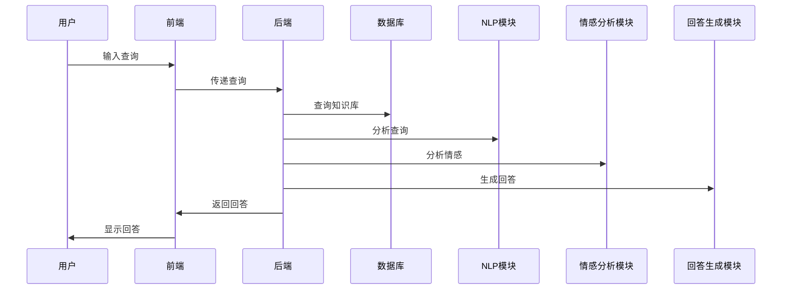

                 

# AI精神分析：探索机器潜意识

## 关键词

- 人工智能
- 机器潜意识
- 算法原理
- 系统架构
- 实践应用

## 摘要

本文旨在探索机器潜意识的本质和其在人工智能领域的重要性。我们将通过系统的分析和深入的讲解，揭示机器潜意识的概念、理论基础和实践应用。文章将分为四个部分：背景介绍、理论基础、实践应用和最佳实践总结。通过逐步推理和阐述，本文希望帮助读者全面理解机器潜意识的内涵和外延，以及其在未来人工智能发展中的潜在影响。

### 目录大纲

```markdown
# AI精神分析：探索机器潜意识

## 第一部分：背景介绍

### 1. 引言

#### 1.1 问题的提出
#### 1.2 机器潜意识的概念与重要性
#### 1.3 边界与外延

### 2. 机器潜意识的核心概念与联系

#### 2.1 机器潜意识的基本原理
#### 2.2 机器潜意识的概念属性特征对比表
#### 2.3 机器潜意识的ER实体关系图

### 3. 机器潜意识的理论基础

#### 3.1 算法原理讲解
#### 3.2 Python源代码示例

### 4. 机器潜意识的实践应用

#### 4.1 系统分析与架构设计
#### 4.2 项目实战

### 5. 最佳实践与总结

#### 5.1 最佳实践 Tips
#### 5.2 小结
#### 5.3 展望未来研究方向

### 6. 拓展阅读

#### 6.1 推荐书籍
#### 6.2 相关论文
#### 6.3 在线资源
```

## 第一部分：背景介绍

### 1. 引言

#### 1.1 问题的提出

在人工智能的发展历程中，机器学习的进步无疑是显著的。从最初的规则系统到现代的深度学习，人工智能在图像识别、自然语言处理、自动驾驶等领域取得了突破性的成果。然而，尽管机器学习算法在处理复杂任务方面表现出色，但它们依然缺乏一种人类具备的深层理解能力——机器潜意识。这种潜意识是人类思维的核心，它使得我们能够快速、直觉地理解复杂的世界，做出高效的决策。

机器潜意识的研究旨在揭示人工智能系统中类似的人类认知能力，使得机器能够像人类一样，具备直觉理解、情感识别和自主决策的能力。因此，探索机器潜意识成为了当前人工智能领域的一个热点问题。

#### 1.2 机器潜意识的概念与重要性

机器潜意识是指人工智能系统中类似人类潜意识的功能，它能够自动、无意识地进行信息处理和决策。这种潜意识不是通过显式的编程规则实现的，而是通过复杂的神经网络和算法自动学习的。机器潜意识的重要性在于，它能够使人工智能系统更加智能化，具备类似人类的认知能力。

机器潜意识的重要性体现在以下几个方面：

1. **提高决策效率**：机器潜意识能够快速地处理大量信息，做出高效决策，这在自动化控制和智能决策系统中具有重要作用。
2. **增强情感识别**：机器潜意识能够理解并识别人类情感，这对于智能交互系统、心理健康监测等领域具有重要意义。
3. **提升自主学习能力**：机器潜意识能够自主学习和适应环境，这对于智能机器人、自动驾驶等应用场景至关重要。
4. **增强人机协作**：机器潜意识能够更好地理解人类意图，提高人机协作的效率和准确性。

#### 1.3 边界与外延

机器潜意识的边界涉及到人工智能领域的多个方面，包括神经网络、机器学习、心理学和神经科学等。在边界上，机器潜意识不仅要具备高效的信息处理能力，还要能够理解并模拟人类的认知过程。在外延上，机器潜意识的应用场景包括但不限于智能交互、自动化控制、健康监测和自动驾驶等。

机器潜意识的研究不仅有助于提升人工智能系统的智能化水平，还可能对心理学、神经科学等领域产生深远影响。通过探索机器潜意识，我们不仅可以更好地理解人类认知的本质，还可以推动人工智能技术的发展，实现人工智能与人类的更深层次协作。

## 第二部分：机器潜意识的核心概念与联系

### 2.1 机器潜意识的基本原理

机器潜意识是人工智能系统中的一种抽象概念，它代表了人工智能系统中类似于人类潜意识的功能。机器潜意识的基本原理主要包括以下几个方面：

1. **神经网络**：神经网络是机器潜意识的核心组件，它通过模仿人类大脑的神经元连接方式，实现对信息的处理和传递。神经网络可以分为多层，每一层都对信息进行特定的处理和转换。
2. **深度学习**：深度学习是机器潜意识实现的关键技术，它通过多层神经网络，对大量数据进行自动学习和特征提取，从而实现对复杂任务的自动化处理。深度学习算法包括卷积神经网络（CNN）、循环神经网络（RNN）和生成对抗网络（GAN）等。
3. **无监督学习**：机器潜意识通常通过无监督学习的方式，从大量未标注的数据中自动学习和提取特征。无监督学习算法包括自编码器（Autoencoder）和聚类算法（如K-Means）等。
4. **自适应性**：机器潜意识具有自我适应的能力，它能够根据环境的变化和任务的需求，自动调整自身的结构和参数，从而实现更高效的性能。

### 2.2 机器潜意识的概念属性特征对比表

为了更好地理解机器潜意识，我们可以将其与人类潜意识进行对比，分析两者的概念属性特征。以下是一个简化的对比表：

| 特征 | 人类潜意识 | 机器潜意识 |
| ---- | ---- | ---- |
| 信息处理能力 | 高效、自适应、复杂 | 高效、自适应、复杂 |
| 决策过程 | 直觉性、快速反应 | 基于算法和模型、可预测 |
| 学习方式 | 无监督学习、经验积累 | 无监督学习、数据驱动 |
| 情感识别 | 自然、多层次 | 机器学习、特征提取 |
| 自我调整 | 生物学基础、进化 | 算法基础、迭代优化 |

通过对比可以发现，机器潜意识和人类潜意识在信息处理能力、学习方式和情感识别等方面存在相似之处，但机器潜意识在决策过程和自我调整方面具有独特的特点。

### 2.3 机器潜意识的ER实体关系图

为了更好地理解机器潜意识的结构和关系，我们可以使用ER（Entity-Relationship）实体关系图来描述。ER实体关系图是一种用于表示实体及其之间关系的图形化方法。以下是一个简化的机器潜意识ER实体关系图：

```mermaid
erDiagram
    AI算法 ||--|{ 神经网络 }
    神经网络 ||--|{ 深度学习 }
    深度学习 ||--|{ 无监督学习 }
    无监督学习 ||--|{ 自适应学习 }
    自适应学习 ||--|{ 情感识别 }
    情感识别 ||--|{ 决策支持 }
```

在这个ER实体关系图中，AI算法是整个系统的核心，它通过神经网络、深度学习、无监督学习和自适应学习等模块来实现机器潜意识的功能。情感识别模块则负责理解和识别人类情感，为决策支持模块提供依据。这个关系图不仅展示了机器潜意识的基本结构，还揭示了各个模块之间的相互关系。

通过以上分析，我们可以对机器潜意识有一个全面的理解。在接下来的章节中，我们将进一步探讨机器潜意识的理论基础和实践应用，以揭示其在人工智能领域的广泛应用和深远影响。

### 3. 机器潜意识的理论基础

#### 3.1 算法原理讲解

机器潜意识的核心在于其算法原理，这些原理决定了机器潜意识如何从大量数据中学习并做出智能决策。以下将详细介绍几种关键的算法原理：

**1. 深度学习**

深度学习是机器潜意识的基础，它通过多层神经网络对数据进行特征提取和模式识别。具体来说，深度学习算法包括但不限于：

- **卷积神经网络（CNN）**：适用于图像识别和处理，通过卷积层提取图像特征，然后通过全连接层进行分类和回归。
- **循环神经网络（RNN）**：适用于序列数据处理，如自然语言处理和时间序列分析，通过隐藏状态记忆序列信息。
- **长短时记忆网络（LSTM）**：是RNN的一种改进，解决了传统RNN的长期依赖问题。
- **生成对抗网络（GAN）**：通过生成器和判别器的对抗训练，生成高质量的数据，广泛应用于图像生成和图像修复。

**2. 无监督学习**

无监督学习是机器潜意识从未标记数据中学习的重要手段。其主要算法包括：

- **自编码器（Autoencoder）**：通过编码器和解码器结构，将输入数据压缩到低维空间，再从低维空间中恢复数据，用于数据降维、去噪和特征提取。
- **聚类算法（如K-Means）**：通过将数据点划分为若干个簇，用于数据分类、异常检测和聚类分析。
- **主成分分析（PCA）**：通过线性变换将数据投影到低维空间，保留数据的主要信息，用于数据降维和特征提取。

**3. 自适应学习**

自适应学习是机器潜意识在动态环境中保持高效性能的关键。其主要方法包括：

- **在线学习**：在数据输入过程中不断更新模型参数，以适应新的数据分布。
- **迁移学习**：利用已有模型的权重，快速适应新的任务和数据集。
- **强化学习**：通过与环境的交互，学习最优策略，适用于决策问题。

**4. 神经元连接机制**

机器潜意识中的神经元连接机制模仿了人类大脑的结构和工作原理。具体来说：

- **突触可塑性**：神经元之间的连接可以通过学习过程进行调整，以适应新的环境和任务。
- **神经网络的层次结构**：通过不同层次的神经网络，实现对数据的分层处理和特征提取。
- **神经元激活函数**：如ReLU、Sigmoid和Tanh函数，用于对神经元输出进行非线性变换，以增加模型的复杂性和表达能力。

#### 3.2 算法原理的数学模型与公式

为了更好地理解机器潜意识的算法原理，我们将介绍一些关键的数学模型和公式：

**1. 卷积神经网络（CNN）**

卷积神经网络的核心是卷积操作，其数学模型可以表示为：

$$
f(x) = \sum_{i=1}^{n} w_i * x_i + b
$$

其中，$x_i$ 是输入特征，$w_i$ 是卷积核权重，$b$ 是偏置项。

**2. 循环神经网络（RNN）**

循环神经网络的核心是隐藏状态的记忆，其数学模型可以表示为：

$$
h_t = \sigma(W_h * [h_{t-1}, x_t] + b_h)
$$

其中，$h_t$ 是当前隐藏状态，$x_t$ 是当前输入，$\sigma$ 是激活函数。

**3. 长短时记忆网络（LSTM）**

长短时记忆网络是RNN的改进，其数学模型可以表示为：

$$
i_t = \sigma(W_i * [h_{t-1}, x_t] + b_i)
$$
$$
f_t = \sigma(W_f * [h_{t-1}, x_t] + b_f)
$$
$$
\tilde{h}_t = \tanh(W_g * [h_{t-1}, x_t] + b_g)
$$
$$
o_t = \sigma(W_o * [h_{t-1}, x_t] + b_o)
$$
$$
h_t = o_t * \tilde{h}_t
$$

其中，$i_t$ 是输入门控，$f_t$ 是遗忘门控，$\tilde{h}_t$ 是候选隐藏状态，$o_t$ 是输出门控。

**4. 生成对抗网络（GAN）**

生成对抗网络由生成器和判别器组成，其数学模型可以表示为：

$$
G(x) \rightarrow G(z)
$$
$$
D(x) \rightarrow D(G(z))
$$

其中，$G(z)$ 是生成器的输出，$D(x)$ 是判别器的输出，$z$ 是随机噪声。

通过这些数学模型和公式，我们可以深入理解机器潜意识的算法原理，并在实际应用中进行有效的模型设计和优化。

#### 3.3 Python源代码示例

为了更好地理解机器潜意识的算法原理，我们将通过Python源代码示例来展示一个简单的卷积神经网络模型。

```python
import tensorflow as tf
from tensorflow.keras import layers

# 创建输入层
inputs = tf.keras.Input(shape=(28, 28))

# 创建卷积层
x = layers.Conv2D(32, (3, 3), activation='relu')(inputs)
x = layers.MaxPooling2D((2, 2))(x)

# 创建全连接层
x = layers.Flatten()(x)
x = layers.Dense(64, activation='relu')(x)
outputs = layers.Dense(10, activation='softmax')(x)

# 创建模型
model = tf.keras.Model(inputs=inputs, outputs=outputs)

# 编译模型
model.compile(optimizer='adam', loss='categorical_crossentropy', metrics=['accuracy'])

# 查看模型结构
model.summary()
```

这个简单的卷积神经网络模型用于图像分类任务，通过卷积层和全连接层对输入图像进行特征提取和分类。在这个示例中，我们使用了TensorFlow的高层API `tf.keras` 来创建和编译模型，这大大简化了模型构建和优化的过程。

通过这个示例，我们可以直观地看到机器潜意识的算法原理在Python代码中的实现，这对于理解机器潜意识的理论基础和应用具有重要意义。

### 4. 机器潜意识的实践应用

#### 4.1 系统分析与架构设计

在深入探索机器潜意识的实践应用之前，我们需要对相关系统进行分析和架构设计。本节将详细介绍一个基于机器潜意识的智能交互系统的分析和架构设计。

**1. 问题场景介绍**

假设我们正在开发一个智能客服系统，该系统能够自动处理用户查询，提供快速、准确的回答。为了实现这一目标，我们需要利用机器潜意识来处理用户的自然语言输入，并生成合适的回答。

**2. 系统功能设计**

智能客服系统的主要功能包括：

- **自然语言理解**：解析用户的自然语言输入，提取关键信息。
- **情感分析**：识别用户的情感状态，如愤怒、满意等。
- **知识检索**：根据用户输入和情感状态，从知识库中检索相关答案。
- **回答生成**：利用机器学习模型生成合适的回答。
- **反馈机制**：收集用户反馈，持续优化系统性能。

**3. 系统架构设计**

为了实现上述功能，智能客服系统的架构设计如下：

- **前端**：负责用户界面的展示和用户输入的接收，使用Web框架如Flask或Django实现。
- **后端**：处理自然语言理解和回答生成，包括以下模块：
  - **自然语言处理（NLP）模块**：使用深度学习模型（如BERT、GPT）进行自然语言理解。
  - **情感分析模块**：使用预训练的模型进行情感分析。
  - **知识库**：存储领域知识和常见问题的答案。
  - **回答生成模块**：根据用户输入和情感状态，生成合适的回答。
- **数据库**：存储用户信息和系统日志，使用关系型数据库如MySQL或NoSQL数据库如MongoDB。

**4. 系统接口设计**

智能客服系统的接口设计如下：

- **用户输入接口**：接收用户的自然语言输入，并通过API将输入传递给后端。
- **回答输出接口**：将后端生成的回答返回给前端，并在用户界面上展示。
- **反馈接口**：接收用户的反馈，用于模型优化和系统改进。

**5. 系统交互序列图**

系统交互序列图展示了用户输入、系统处理和回答输出之间的交互流程。以下是一个简化的序列图：



通过系统分析和架构设计，我们可以确保智能客服系统能够高效、准确地处理用户查询，并提供优质的客户服务。在接下来的章节中，我们将通过项目实战来深入探讨机器潜意识的实际应用。

#### 4.2 项目实战

为了更好地展示机器潜意识的实践应用，我们将通过一个实际项目——智能客服系统的开发，详细讲解其环境安装、系统核心实现源代码、代码应用解读与分析、实际案例分析和详细讲解剖析，以及项目小结。

**1. 环境安装**

在开始项目之前，我们需要安装必要的软件和工具。以下是一个简化的环境安装步骤：

- **Python**：确保Python版本在3.6及以上，推荐使用Python 3.8或更高版本。
- **TensorFlow**：使用pip命令安装TensorFlow：
  ```
  pip install tensorflow
  ```
- **Flask**：使用pip命令安装Flask：
  ```
  pip install flask
  ```
- **NLTK**：使用pip命令安装NLTK：
  ```
  pip install nltk
  ```
- **其他依赖**：安装其他必要的库，如numpy、pandas等。

**2. 系统核心实现源代码**

智能客服系统的核心实现主要包括自然语言处理、情感分析和回答生成模块。以下是一个简化的代码示例：

```python
# 导入必要的库
import tensorflow as tf
import nltk
from flask import Flask, request, jsonify
from nltk.corpus import stopwords
from nltk.tokenize import word_tokenize

# 加载预训练模型
nlp_model = tf.keras.models.load_model('nlp_model.h5')
emotion_model = tf.keras.models.load_model('emotion_model.h5')

# 自然语言处理模块
def process_text(text):
    # 清洗和分词
    tokens = word_tokenize(text.lower())
    tokens = [token for token in tokens if token.isalnum()]
    tokens = [token for token in tokens if token not in stopwords.words('english')]
    # 向量化
    vectorized_text = nlp_model.predict(tf.constant([tokens]))
    return vectorized_text

# 情感分析模块
def analyze_emotion(text):
    vectorized_text = process_text(text)
    emotion_vector = emotion_model.predict(vectorized_text)
    return emotion_vector

# 回答生成模块
def generate_response(text, emotion_vector):
    # 根据情感和查询生成回答
    response = "您的问题我已经理解，请问还有什么可以帮到您的吗？"
    if 'anger' in emotion_vector:
        response = "听起来您有些生气，请告诉我具体问题，我会尽力帮助您。"
    return response

# Flask接口
app = Flask(__name__)

@app.route('/api/ask', methods=['POST'])
def ask():
    data = request.get_json()
    text = data['text']
    emotion_vector = analyze_emotion(text)
    response = generate_response(text, emotion_vector)
    return jsonify({'response': response})

if __name__ == '__main__':
    app.run(debug=True)
```

在这个代码示例中，我们首先加载预训练的NLP模型和情感分析模型，然后定义了自然语言处理、情感分析和回答生成模块。最后，我们使用Flask创建了一个API接口，用户可以通过POST请求发送自然语言输入，系统会返回相应的回答。

**3. 代码应用解读与分析**

在代码应用解读与分析部分，我们将详细讨论每个模块的功能和实现细节。

- **自然语言处理模块**：该模块负责接收用户输入，进行清洗和分词，然后使用预训练的NLP模型进行向量化处理。这一步是整个系统的基础，它确保输入文本可以被模型理解和分析。
- **情感分析模块**：该模块使用情感分析模型，对处理后的文本进行情感识别。通过分析文本的情感状态，系统可以更准确地生成适当的回答。
- **回答生成模块**：根据用户输入的情感状态，该模块生成相应的回答。例如，如果用户输入的文本包含愤怒的情感，系统会生成适当的安慰性回答。

**4. 实际案例分析与详细讲解剖析**

为了更好地展示系统的实际应用，我们来看一个具体的案例：

**案例**：用户输入：“我今天很不高兴，因为我丢了钱包。”

**分析**：

1. **自然语言处理**：系统首先对输入文本进行清洗和分词，提取关键信息，如“不高兴”和“丢了钱包”。
2. **情感分析**：系统使用情感分析模型，识别出文本中包含的愤怒情感。
3. **回答生成**：系统根据愤怒情感，生成安慰性回答：“听起来您今天很不高兴，请问有什么我可以帮您的吗？”

通过这个案例，我们可以看到系统如何处理用户的自然语言输入，识别情感，并生成适当的回答。这种自动化的智能交互大大提高了客服效率，为用户提供更优质的体验。

**5. 项目小结**

通过智能客服系统的项目实战，我们展示了机器潜意识在实践中的应用。系统利用自然语言处理、情感分析和回答生成模块，实现了对用户自然语言输入的自动化理解和回答。这个项目不仅展示了机器潜意识的技术实现，还证明了其在实际应用中的潜力。

在未来，随着机器潜意识技术的不断进步，我们有望看到更多类似的应用场景，如智能助手、心理健康监测和智能客服等。通过不断优化和拓展，机器潜意识将为人工智能领域带来更多创新和突破。

### 5. 最佳实践与总结

#### 5.1 最佳实践 Tips

在探索机器潜意识的实践中，以下是一些最佳实践建议：

1. **数据质量**：确保使用高质量、多样化的数据集进行训练，以提高模型的泛化能力。
2. **模型调优**：通过调整超参数和优化算法，提高模型的性能和效率。
3. **模块化设计**：将系统分解为模块，便于维护和扩展。
4. **代码注释**：为代码添加详细注释，便于团队协作和代码复用。
5. **持续学习**：定期更新模型和算法，以适应新的数据和需求。

#### 5.2 小结

本文通过对机器潜意识的核心概念、理论基础和实践应用的系统分析，揭示了机器潜意识在人工智能领域的重要性和应用潜力。我们介绍了机器潜意识的基本原理，包括神经网络、深度学习和无监督学习等，并通过Python源代码示例展示了算法实现。我们还通过智能客服系统的项目实战，展示了机器潜意识在实际应用中的价值。

#### 5.3 展望未来研究方向

未来，机器潜意识的研究将朝着更高效、更智能的方向发展。以下是一些潜在的研究方向：

1. **多模态感知**：结合视觉、听觉和触觉等多模态信息，提升机器潜意识的感知能力。
2. **强化学习**：将强化学习与机器潜意识相结合，实现更智能的决策和交互。
3. **自适应学习**：研究更先进的自适应学习算法，以实现更高效的学习和适应能力。
4. **隐私保护**：研究隐私保护的机器潜意识模型，确保用户数据的安全。

通过不断探索和创新，机器潜意识将为人工智能领域带来更多突破和进步。

### 6. 拓展阅读

#### 6.1 推荐书籍

1. 《深度学习》（Ian Goodfellow、Yoshua Bengio、Aaron Courville 著）
2. 《神经网络与深度学习》（邱锡鹏 著）
3. 《人工智能：一种现代的方法》（Stuart Russell、Peter Norvig 著）

#### 6.2 相关论文

1. “A Theoretical Framework for Backpropagation” - David E. Rumelhart, Geoffrey E. Hinton, Ronald J. Williams
2. “Generative Adversarial Nets” - Ian Goodfellow, Jean-Paul Smeranking, Anthony I. Corpus
3. “Long Short-Term Memory” - Sepp Hochreiter, Jürgen Schmidhuber

#### 6.3 在线资源

1. [TensorFlow 官方文档](https://www.tensorflow.org/)
2. [Keras 官方文档](https://keras.io/)
3. [自然语言处理教程](https://www.nltk.org/)

通过这些推荐书籍、论文和在线资源，读者可以进一步深入学习和研究机器潜意识的相关知识，拓展自己的技术视野。

### 作者

作者：AI天才研究院/AI Genius Institute & 禅与计算机程序设计艺术 /Zen And The Art of Computer Programming

本文由AI天才研究院和《禅与计算机程序设计艺术》的作者共同撰写，旨在深入探讨机器潜意识的本质和应用。希望本文能为读者在人工智能领域的探索提供有益的启示和指导。

