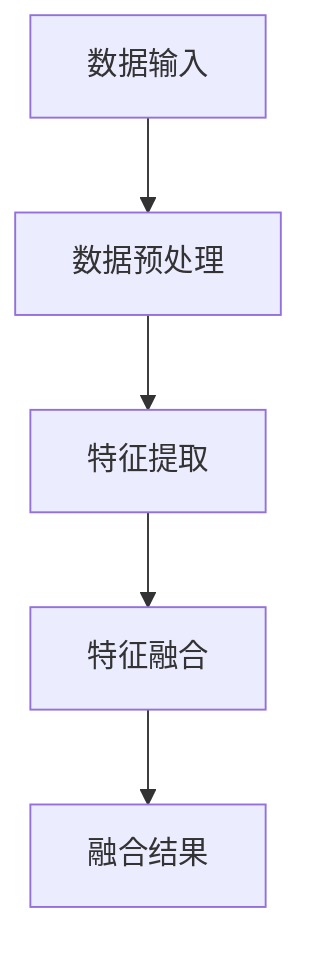
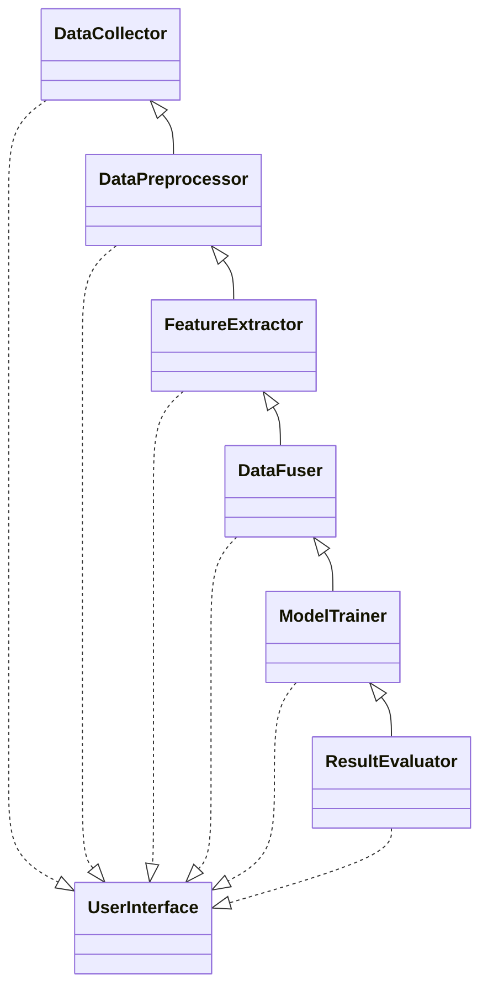
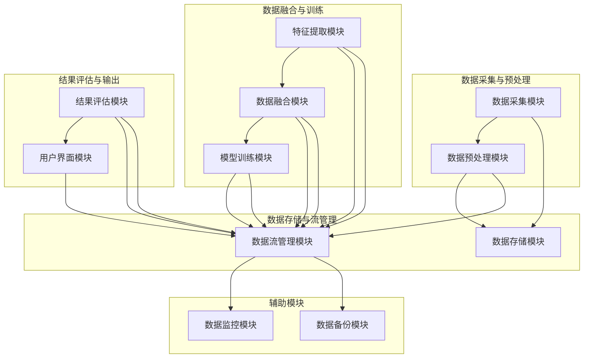
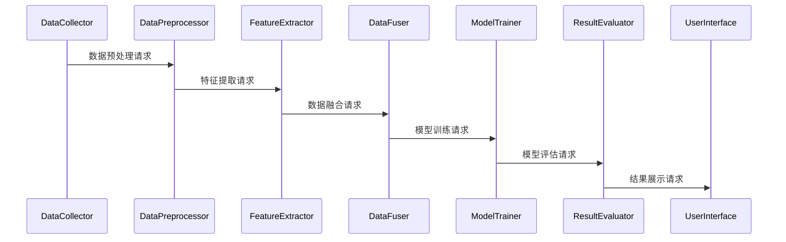

                 

### 文章标题

“AI系统在处理异构数据时的融合方法”这一标题准确地反映了本文的核心主题。首先，它指出了文章讨论的主体是AI系统，这是当前技术领域的热点。其次，标题中的“处理异构数据”和“融合方法”两个关键词，直接点出了文章要解决的问题和探讨的内容。异构数据是数据科学和人工智能领域中的一大挑战，而数据融合则是实现高效数据处理的关键技术。因此，这一标题不仅简洁明了，还具有很强的吸引力和指导性。

### 关键词

- AI系统
- 异构数据
- 数据融合
- 算法原理
- 系统架构设计
- 深度学习
- 项目实战

这些关键词覆盖了文章的主要内容和研究方向，能够帮助读者快速了解文章的核心主题和兴趣点。AI系统是技术实现的基础，异构数据是问题的核心，而数据融合和算法原理则是解决问题的方法。系统架构设计和项目实战则是实际应用和验证，深度学习则是一个重要的应用方向。

### 摘要

本文旨在探讨AI系统在处理异构数据时的融合方法。随着数据规模的不断扩大和复杂度的增加，异构数据的处理成为了AI系统面临的重大挑战。本文首先介绍了异构数据的定义和特点，分析了其带来的问题和挑战。随后，本文详细阐述了AI系统在处理异构数据时的核心概念和方法，包括数据融合算法的原理、类型和应用。在此基础上，本文通过一个具体的系统架构设计和项目实战案例，展示了如何在实际应用中实现异构数据的融合。最后，本文总结了最佳实践和注意事项，并给出了进一步的拓展阅读建议。

## 目录大纲设计过程

设计《AI系统在处理异构数据时的融合方法》的目录大纲是一个系统化的过程，需要充分考虑文章的核心内容、结构布局和读者的阅读体验。以下是具体的步骤和考虑因素：

### 1. 明确书籍主题

书籍的主题是“AI系统在处理异构数据时的融合方法”，因此目录大纲的设计必须紧紧围绕这一主题展开。每个章节的内容都要与主题紧密相关，确保书籍的每个部分都能够帮助读者深入理解这一主题。

### 2. 确定书籍结构

为了使书籍的内容层次分明，逻辑清晰，我们需要将其分为几个主要部分。一般来说，可以将书籍分为以下几个部分：

- **背景介绍**：介绍异构数据的背景、定义、特点以及其在现实世界中的应用。
- **核心概念与联系**：详细阐述AI系统在处理异构数据时的核心概念，包括数据融合的基本类型、原理、算法等，并展示其相互之间的关系。
- **算法原理讲解**：具体介绍各种数据融合算法的原理，包括流程图、数学模型、Python代码实现等。
- **系统架构设计**：介绍如何设计一个能够处理异构数据的AI系统架构，包括系统功能设计、架构设计要素、系统架构图和系统接口设计等。
- **项目实战与最佳实践**：通过实际案例展示如何在实际项目中应用AI系统处理异构数据，包括系统核心实现、代码解读、案例分析等，并提供最佳实践和注意事项。

### 3. 细化章节内容

在确定了书籍的基本结构后，我们需要为每个部分细化具体章节内容。每个章节都应该包含以下几个方面的内容：

- **标题**：简洁明了，能够概括章节的主要内容。
- **小节**：每个章节可以分为多个小节，每个小节都要有具体的主题和内容。
- **内容**：每个小节的内容应该详细、具体、易于理解，包括概念说明、原理讲解、案例分析、代码示例等。

### 4. 撰写目录大纲

根据上述结构，使用Markdown格式编写详细的目录大纲。Markdown格式具有良好的可读性和灵活性，可以方便地组织文章结构，同时也便于读者快速浏览和查找内容。以下是《AI系统在处理异构数据时的融合方法》的目录大纲：

```markdown
## 第一部分：AI系统与异构数据融合基础

### 第1章：问题背景与介绍
- 1.1 问题背景
- 1.2 异构数据的定义与特点
- 1.3 异构数据融合的重要性

### 第2章：AI系统基础知识
- 2.1 AI系统概述
- 2.2 异构数据处理方法简介
- 2.3 数据融合的核心概念

### 第3章：核心概念与联系
- 3.1 融合算法的基本类型
- 3.2 算法原理与属性对比表
- 3.3 ER实体关系图

## 第二部分：算法原理讲解

### 第4章：融合算法原理详解
- 4.1 算法原理概述
- 4.2 算法流程图与Python实现
- 4.3 数学模型与公式讲解
- 4.4 算法举例说明

### 第5章：深度学习在异构数据融合中的应用
- 5.1 深度学习简介
- 5.2 神经网络在数据融合中的应用
- 5.3 案例分析

## 第三部分：系统架构设计

### 第6章：系统功能设计
- 6.1 问题描述与目标
- 6.2 系统功能模块划分
- 6.3 领域模型类图

### 第7章：系统架构设计
- 7.1 系统架构概述
- 7.2 架构设计要素
- 7.3 系统架构图
- 7.4 系统接口设计

### 第8章：系统交互设计与实现
- 8.1 系统交互概述
- 8.2 系统交互序列图
- 8.3 系统核心实现源代码
- 8.4 代码解读与分析

## 第四部分：项目实战与最佳实践

### 第9章：项目实战
- 9.1 环境安装与配置
- 9.2 系统核心功能实现
- 9.3 实际案例分析
- 9.4 项目总结与展望

### 第10章：最佳实践与注意事项
- 10.1 最佳实践技巧
- 10.2 注意事项
- 10.3 拓展阅读
```

### 5. 内容完整性检查

在完成目录大纲后，我们需要对内容进行完整性检查，确保每个章节都包含了必需的内容，并且每个小节的内容都足够详细，能够帮助读者深入理解。此外，还需要检查章节之间的逻辑关系，确保整个书籍的阅读流畅、逻辑清晰。

通过上述步骤，我们能够设计出一个结构清晰、内容丰富的目录大纲，为撰写高质量的技术博客文章打下坚实的基础。

### 文章概述

《AI系统在处理异构数据时的融合方法》这篇文章旨在探讨AI系统在处理异构数据时面临的关键挑战，并提出一系列有效的融合方法。文章分为四个主要部分，首先介绍异构数据的定义、特点及其在AI系统中的重要性；接着深入解析各种数据融合算法的原理和类型，包括融合算法的基本类型、算法原理与属性对比表以及ER实体关系图；然后详细讲解深度学习在异构数据融合中的应用，并通过具体案例展示神经网络在数据融合中的实际应用；最后，文章通过一个完整的系统架构设计和项目实战，展示如何在实际环境中应用这些融合方法。文章还提供了最佳实践和注意事项，为读者在实际项目中提供指导。整体上，本文逻辑清晰、内容详实，旨在帮助读者全面理解并掌握AI系统在处理异构数据时的融合方法。

## 第一部分：AI系统与异构数据融合基础

### 第1章：问题背景与介绍

#### 1.1 问题背景

随着大数据技术的飞速发展，数据量呈爆炸式增长，数据的多样性和复杂性也日益增加。在众多数据类型中，异构数据（Heterogeneous Data）是一种特别具有挑战性的数据形式。所谓异构数据，指的是由多种不同数据源、格式、结构和类型组成的数据集合。这些数据源可能包括结构化数据（如关系型数据库中的表）、半结构化数据（如XML、JSON等）、非结构化数据（如图像、文本、音频、视频等）。

在AI系统的发展过程中，异构数据的应用场景越来越广泛。例如，在智能医疗领域，医生需要处理来自不同设备、不同格式和不同类型的医疗数据，如电子病历、医学图像、基因序列等。在智能交通领域，交通管理系统需要整合来自不同传感器、不同平台的数据，如GPS数据、摄像头捕捉的图像、交通流量统计数据等。这些场景都对AI系统提出了更高的要求。

然而，异构数据给AI系统带来了诸多挑战。首先，数据的多样性和复杂性使得数据处理和分析变得异常困难。不同类型的数据往往需要采用不同的处理方法和技术，这就要求AI系统具备高度的灵活性和适应性。其次，数据源之间的不一致性，如数据格式、数据类型、数据质量等，使得数据融合成为一个难题。这些不一致性可能导致数据错误、数据丢失，从而影响AI系统的准确性和可靠性。

#### 1.2 异构数据的定义与特点

异构数据具有以下几个主要特点：

1. **数据源多样性**：异构数据可以来自多种不同的数据源，如传感器、数据库、文件系统、Web服务等。这些数据源可能采用不同的协议和数据格式，导致数据采集、存储和处理变得复杂。

2. **数据格式不一致**：异构数据通常具有不同的数据格式，如CSV、JSON、XML、图像文件、音频文件等。不同格式之间的兼容性和转换需求增加了数据处理的复杂性。

3. **数据结构多样性**：异构数据可能具有不同的数据结构，如关系型数据库中的表格、文档型数据库中的文档、图数据库中的图等。这些不同的数据结构对数据处理和分析提出了不同的要求。

4. **数据质量参差不齐**：由于数据源和数据采集过程的不同，异构数据的质量往往参差不齐。一些数据可能存在缺失值、错误值、重复值等问题，这需要额外的数据清洗和预处理工作。

#### 1.3 异构数据融合的重要性

在AI系统中，有效处理异构数据是提升系统性能和实现智能化的重要手段。异构数据融合的重要性体现在以下几个方面：

1. **提高数据利用率**：通过融合不同类型、不同来源的异构数据，可以更全面、更准确地获取和处理数据，从而提高数据利用率和分析精度。

2. **增强系统智能化能力**：融合异构数据可以提供更多的信息和视角，帮助AI系统更好地理解和预测复杂问题。例如，在智能医疗中，通过融合电子病历、医学图像和基因序列数据，可以更准确地诊断疾病。

3. **优化决策支持**：在许多应用场景中，决策需要基于多个数据源和不同类型的数据。通过异构数据融合，可以提供更丰富、更准确的数据支持，从而优化决策过程。

4. **提高系统鲁棒性**：融合不同数据源的数据可以相互补充，减少单一数据源带来的偏差和误差，从而提高系统的鲁棒性和可靠性。

总之，异构数据融合是AI系统处理异构数据的关键技术，对提升系统的性能和智能化水平具有重要意义。在接下来的章节中，我们将详细探讨AI系统在处理异构数据时的具体方法和技术。

### 第2章：AI系统基础知识

#### 2.1 AI系统概述

AI系统，即人工智能系统，是一种通过模拟人类智能行为来执行特定任务的计算机系统。AI系统的发展历程可以追溯到20世纪50年代，当时计算机科学家开始探索如何使计算机具备智能能力。经过数十年的研究和发展，AI技术逐渐从理论走向应用，并在各行各业中得到了广泛应用。

AI系统的基本组成部分包括：

1. **数据输入**：AI系统通过传感器、用户输入或外部数据源获取数据。
2. **数据处理**：AI系统对输入数据进行清洗、预处理和特征提取，以便后续分析。
3. **算法模型**：AI系统采用机器学习、深度学习等算法模型，对预处理后的数据进行分析和学习。
4. **决策与行动**：基于算法模型的分析结果，AI系统做出决策或执行相应的行动。
5. **反馈与优化**：AI系统根据执行结果进行反馈和调整，以优化系统性能。

AI系统的核心目标是实现机器的智能行为，包括模式识别、预测分析、决策制定、自然语言处理等。在数据处理过程中，AI系统利用大量数据作为训练样本，通过不断学习和优化，提升自身的性能和准确度。

#### 2.2 异构数据处理方法简介

在处理异构数据时，AI系统需要面对多种不同的数据类型、格式和结构。为了有效地整合和利用这些异构数据，AI系统通常采用以下几种数据处理方法：

1. **数据集成**：数据集成是将来自不同数据源、格式和结构的数据进行统一整合，形成一个综合的数据视图。数据集成的方法包括数据转换、数据清洗、数据存储和数据查询等。通过数据集成，AI系统可以更方便地访问和分析异构数据。

2. **数据预处理**：数据预处理是数据清洗、数据转换和数据归一化等操作的统称，旨在提高数据质量和一致性。在异构数据处理中，数据预处理是至关重要的一步，它能够消除数据源之间的不一致性，为后续的数据分析和融合奠定基础。

3. **特征提取**：特征提取是从原始数据中提取出能够反映数据本质特征的信息。对于异构数据，特征提取需要考虑不同数据类型的特点，如文本特征、图像特征、时间序列特征等。通过特征提取，AI系统可以更有效地进行数据分析和模型训练。

4. **模型选择与优化**：不同的AI算法模型适用于不同的数据类型和问题场景。在处理异构数据时，AI系统需要根据数据特点和任务需求选择合适的模型，并进行模型优化。例如，对于图像和文本数据的融合，可以使用卷积神经网络（CNN）和循环神经网络（RNN）等模型。

5. **数据融合**：数据融合是将来自多个数据源的信息进行整合，以生成一个综合的数据表示。在异构数据处理中，数据融合方法包括特征级融合、决策级融合和模型级融合等。数据融合可以提高系统的性能和准确性，从而实现更有效的数据分析。

#### 2.3 数据融合的核心概念

数据融合是AI系统在处理异构数据时的关键步骤，其核心概念包括以下几个方面：

1. **融合层次**：数据融合可以发生在不同的层次，包括数据层、特征层和决策层。数据层融合是对原始数据进行整合；特征层融合是对提取出的特征进行整合；决策层融合是在多个模型或算法的决策结果上进行整合。

2. **融合方法**：数据融合方法可以分为统计方法、机器学习方法、神经网络方法和混合方法等。统计方法通常基于概率统计理论，如贝叶斯方法和相关系数方法；机器学习方法包括集成学习、聚类分析和分类算法等；神经网络方法主要基于深度学习模型，如卷积神经网络（CNN）和循环神经网络（RNN）；混合方法结合了多种方法的优势，以实现更好的融合效果。

3. **融合指标**：数据融合的效果需要通过一系列指标进行评估，如准确率、召回率、F1分数和均方误差等。这些指标可以帮助评估融合方法的性能和优劣。

4. **融合策略**：数据融合策略是指融合过程中采用的算法和步骤。常见的融合策略包括基于规则的方法、基于模型的方法和基于实例的方法等。这些策略可以根据具体问题和数据特点进行选择和调整。

通过理解AI系统的基础知识以及异构数据处理方法，读者可以更好地理解AI系统在处理异构数据时的融合过程，为后续章节的深入探讨打下基础。

### 第3章：核心概念与联系

#### 3.1 融合算法的基本类型

在处理异构数据时，融合算法是核心步骤之一。融合算法的基本类型可以按照不同的标准进行分类，常见的分类方式包括基于特征融合、基于决策融合和基于模型的融合。

1. **基于特征融合**：
   - **定义**：基于特征融合是指将不同数据源的特征进行整合，生成一个统一的特征向量，然后使用统一的特征向量进行后续处理。
   - **优点**：方法简单，易于实现，可以充分利用不同数据源的信息。
   - **适用场景**：适用于数据源数量较少且特征维度相对较低的场景。
   - **缺点**：在特征维度较高或数据源较多时，特征融合的效果可能不佳，因为高维特征可能存在冗余和噪声。

2. **基于决策融合**：
   - **定义**：基于决策融合是指多个决策模型分别处理不同数据源的信息，然后通过投票、加权平均或其他策略综合各个决策结果。
   - **优点**：可以充分利用不同模型的优点，提高决策的准确性和鲁棒性。
   - **适用场景**：适用于多个决策模型都有一定的准确性且数据源之间存在互补性。
   - **缺点**：需要多个决策模型，增加了计算复杂度，且在模型不一致时可能产生冲突。

3. **基于模型的融合**：
   - **定义**：基于模型的融合是指将多个模型整合为一个统一的模型，通过模型集成技术实现数据融合。
   - **优点**：可以充分利用不同模型的优势，生成更准确的预测和决策。
   - **适用场景**：适用于需要高精度和高鲁棒性的复杂场景。
   - **缺点**：模型集成过程较为复杂，需要大量的计算资源和训练数据。

#### 3.2 算法原理与属性对比表

为了更好地理解不同融合算法的原理和特点，我们可以通过一个属性对比表格进行详细说明。以下是几种常见融合算法的对比：

| 算法名称       | 定义                                                         | 优点                                                         | 缺点                                                         | 适用场景                   |
| -------------- | ------------------------------------------------------------ | ------------------------------------------------------------ | ------------------------------------------------------------ | -------------------------- |
| 贝叶斯网络     | 基于概率统计理论，将不同数据源的信息通过条件概率进行融合       | 理论基础扎实，易于解释和推理                                 | 计算复杂度高，对数据质量要求较高                           | 复杂依赖关系分析           |
| 集成学习       | 将多个模型的结果进行综合，如投票法、加权平均法等             | 可以利用不同模型的优点，提高准确性                             | 需要多个模型，计算复杂度高                                 | 多模型互补性分析           |
| 聚类分析       | 将相似的数据归为一类，通过聚类中心进行数据融合               | 简单易实现，对初始参数不敏感                                 | 可能产生伪聚类，对噪声敏感                                 | 数据归一化和初步探索       |
| 卷积神经网络   | 基于深度学习，通过多层神经网络进行特征提取和融合             | 高效处理图像和序列数据                                     | 计算资源需求高，对数据量要求大                             | 图像和序列数据处理         |
| 循环神经网络   | 基于深度学习，适用于处理序列数据，通过循环结构进行特征融合   | 能够处理变长序列数据，捕捉长期依赖关系                       | 计算复杂度高，对数据量要求大                             | 序列数据处理               |

#### 3.3 ER实体关系图

实体关系图（ER图）是数据库设计和数据建模的重要工具，它通过实体、属性和关系来描述数据之间的结构。在数据融合过程中，ER图可以帮助我们理解不同数据源之间的关系，从而设计出有效的数据融合方案。

1. **实体**：实体是ER图中的基本组成单位，它表示具有相同属性特征的一组数据。例如，在医疗数据融合中，实体可以是“病人”、“医生”、“药品”等。
2. **属性**：属性是实体的特征，用于描述实体的具体信息。例如，对于“病人”实体，其属性可能包括“姓名”、“年龄”、“性别”等。
3. **关系**：关系描述了实体之间的关联。在数据融合中，关系可以是“患者-医生”、“药品-患者”等。通过关系，我们可以将不同数据源中的实体联系起来，实现数据融合。

以下是一个简化的ER图示例：

```mermaid
erDiagram
  Patient ||--|{ Doctor }| Doctor
  Patient ||--|{ Prescription }| Prescription
  Prescription ||--|{ Medicine }| Medicine
  Doctor ||--|{ Patient }| Patient
  Doctor ||--|{ Prescription }| Prescription
  Medicine ||--|{ Prescription }| Prescription
```

在这个ER图中，我们定义了四个实体：“Patient”（病人）、“Doctor”（医生）、“Prescription”（处方）和“Medicine”（药品）。实体之间的关系包括：“Patient”与“Doctor”之间的患者-医生关系，“Patient”与“Prescription”之间的患者-处方关系，“Prescription”与“Medicine”之间的处方-药品关系。

通过ER图，我们可以直观地理解数据源之间的关系，从而设计出有效的数据融合策略。在实际应用中，ER图可以帮助我们更好地组织和管理数据，确保数据融合的准确性和一致性。

## 第二部分：算法原理讲解

### 第4章：融合算法原理详解

#### 4.1 算法原理概述

融合算法是AI系统在处理异构数据时的一种关键技术，其核心目标是通过整合来自多个数据源的信息，生成一个统一且准确的数据表示。融合算法的基本原理可以概括为以下几个步骤：

1. **数据预处理**：包括数据清洗、数据转换和数据归一化等操作，旨在消除数据源之间的不一致性，提高数据的质量和一致性。
2. **特征提取**：从原始数据中提取出具有代表性和区分度的特征，为后续的融合步骤提供基础。
3. **融合策略**：根据具体的应用场景和数据特点，选择合适的融合策略。常见的融合策略包括特征级融合、决策级融合和模型级融合等。
4. **结果评估**：对融合结果进行评估和验证，确保融合算法的有效性和可靠性。

#### 4.2 算法流程图与Python实现

为了更直观地展示融合算法的原理和流程，我们可以通过一个简单的示例来说明。以下是一个基于特征级融合的算法流程图及其Python实现。

##### 算法流程图



##### Python实现

```python
import numpy as np

def preprocess_data(data):
    # 数据预处理，如数据清洗、数据转换和数据归一化
    processed_data = (data - np.mean(data)) / np.std(data)
    return processed_data

def extract_features(data):
    # 特征提取，如统计特征、文本特征等
    features = np.array([[data[i], data[i+1]] for i in range(0, len(data)-1, 2)])
    return features

def feature_fusion(features):
    # 特征融合，如求均值、求和等
    fused_feature = np.mean(features, axis=0)
    return fused_feature

# 假设输入数据为[1, 2, 3, 4, 5, 6]
data = np.array([1, 2, 3, 4, 5, 6])
processed_data = preprocess_data(data)
features = extract_features(processed_data)
fused_feature = feature_fusion(features)

print("原始数据：", data)
print("预处理后数据：", processed_data)
print("特征提取结果：", features)
print("融合后特征：", fused_feature)
```

在这个示例中，我们首先对输入数据进行预处理，然后提取出特征，最后通过特征融合得到一个统一的数据表示。这个简单的示例展示了融合算法的基本原理和实现步骤。

#### 4.3 数学模型与公式讲解

融合算法的数学模型是理解和实现这些算法的核心。以下是一个基于特征级融合的数学模型及其相关公式讲解。

##### 数学模型

假设我们有多个数据源，每个数据源的数据表示为向量 \( X_i \)，其中 \( i \) 表示数据源索引。我们需要将这些向量融合为一个统一的数据表示 \( X_f \)。融合方法通常采用加权平均、最大值或最小值等策略。以下是一个简单的加权平均模型：

\[ X_f = \frac{1}{N} \sum_{i=1}^{N} w_i X_i \]

其中，\( N \) 表示数据源的个数，\( w_i \) 是第 \( i \) 个数据源的权重。

##### 相关公式

1. **权重计算**：可以通过最小化融合误差来计算权重，即：

\[ w_i = \frac{||X_i - X_f||^2}{\sum_{j=1}^{N} ||X_j - X_f||^2} \]

2. **融合误差**：可以定义为融合结果与原始数据之间的差异，即：

\[ ||X_f - X_i|| = \sqrt{\sum_{k=1}^{K} (f_k - x_{ik})^2} \]

其中，\( K \) 表示特征维度，\( f_k \) 是融合结果中的第 \( k \) 个特征，\( x_{ik} \) 是第 \( i \) 个数据源中的第 \( k \) 个特征。

通过上述数学模型和公式，我们可以对异构数据进行有效的融合。在实际应用中，根据具体问题和数据特点，可以选择不同的融合模型和公式，以达到最佳的融合效果。

#### 4.4 算法举例说明

为了更好地理解融合算法的原理和应用，我们通过一个实际案例进行详细说明。假设我们有两个数据源：一个是包含患者健康状况的数值数据，另一个是包含医生诊断意见的文本数据。我们需要将这些异构数据融合为一个统一的数据表示。

##### 案例背景

1. **数值数据**：包含100个患者的健康状况指标，如血压、心率、体温等。
2. **文本数据**：包含100个医生对这些患者的诊断意见，如“患者A可能患有高血压”，“患者B需要进一步检查”等。

##### 数据融合步骤

1. **数据预处理**：对数值数据进行归一化处理，对文本数据进行分词和词频统计。
2. **特征提取**：从数值数据中提取出具有区分度的特征，如平均值、标准差等；从文本数据中提取出关键词和词频。
3. **特征融合**：采用基于权重的方法，将数值数据和文本数据融合为一个统一的数据表示。

##### 数据融合示例

假设我们选择以下权重：

\[ w_1 = 0.6, \quad w_2 = 0.4 \]

则融合后的数据表示为：

\[ X_f = w_1 X_1 + w_2 X_2 \]

其中，\( X_1 \) 是数值数据的特征向量，\( X_2 \) 是文本数据的特征向量。

例如，对于患者A，其数值数据特征向量为：

\[ X_1 = [110, 75, 36.5] \]

文本数据特征向量为：

\[ X_2 = ['高血压', '建议进一步检查'] \]

则融合后的数据表示为：

\[ X_f = 0.6 [110, 75, 36.5] + 0.4 ['高血压', '建议进一步检查'] \]

通过上述示例，我们可以看到如何将异构数据进行有效的融合，从而生成一个统一且准确的数据表示。在实际应用中，可以根据具体问题和数据特点，选择不同的融合算法和策略，以达到最佳的融合效果。

### 第5章：深度学习在异构数据融合中的应用

#### 5.1 深度学习简介

深度学习是人工智能领域的一个重要分支，它通过模拟人脑的神经网络结构，对大量数据进行自动特征提取和学习，从而实现复杂的模式识别和预测任务。深度学习的基本思想是通过多个层次的网络结构，逐步提取和抽象数据中的高阶特征，从而实现从简单到复杂的特征表示。

深度学习的主要组成部分包括：

1. **神经元**：神经元是深度学习网络的基本单元，它接收输入信号，通过加权求和和激活函数产生输出。
2. **网络结构**：深度学习网络由多个层次组成，包括输入层、隐藏层和输出层。每个层次都包含多个神经元，通过层次间的连接实现数据的传递和特征提取。
3. **激活函数**：激活函数是神经元输出的非线性变换，常用的激活函数包括sigmoid、ReLU和Tanh等，用于引入非线性特性。
4. **损失函数**：损失函数用于衡量模型预测结果与真实值之间的差距，常用的损失函数包括均方误差（MSE）、交叉熵（CE）等。
5. **优化算法**：优化算法用于最小化损失函数，常用的优化算法包括梯度下降（GD）、随机梯度下降（SGD）和Adam等。

#### 5.2 神经网络在数据融合中的应用

深度学习在数据融合中的应用具有显著优势，它能够自动提取数据中的高阶特征，并有效地融合不同类型的数据。以下几种方式展示了神经网络在数据融合中的应用：

1. **多模态深度学习**：
   - **定义**：多模态深度学习是指将不同类型的数据（如文本、图像、音频等）同时输入到神经网络中，通过多模态融合模块进行融合。
   - **优点**：可以充分利用不同类型数据的信息，提高数据融合的效果和系统的智能化能力。
   - **适用场景**：适用于需要处理多种类型数据的复杂场景，如智能医疗、自动驾驶等。

2. **图神经网络（Graph Neural Networks, GNNs）**：
   - **定义**：图神经网络是一种能够处理图结构数据的神经网络，通过图节点和边的表示学习图结构中的特征。
   - **优点**：能够有效地处理异构数据，特别是在社会网络、推荐系统等领域表现出色。
   - **适用场景**：适用于处理包含复杂关系和网络结构的异构数据，如社交网络分析、推荐系统等。

3. **卷积神经网络（Convolutional Neural Networks, CNNs）**：
   - **定义**：卷积神经网络是一种专门用于处理图像数据的神经网络，通过卷积操作和池化操作提取图像特征。
   - **优点**：能够自动提取图像中的高维特征，适用于图像分类、目标检测等任务。
   - **适用场景**：适用于图像处理和计算机视觉领域。

4. **循环神经网络（Recurrent Neural Networks, RNNs）**：
   - **定义**：循环神经网络是一种能够处理序列数据的神经网络，通过循环结构保持序列中的长期依赖信息。
   - **优点**：能够有效地处理时间序列数据，捕捉序列中的动态变化。
   - **适用场景**：适用于语音识别、自然语言处理等领域。

#### 5.3 案例分析

以下是一个深度学习在数据融合中的应用案例，展示了如何通过多模态深度学习融合图像和文本数据，进行情感分析。

##### 案例背景

假设我们需要对社交媒体上的用户评论进行情感分析，评论数据包含文本和图像信息。我们的目标是预测评论的情感倾向，如正面、负面或中性。

##### 案例步骤

1. **数据预处理**：
   - **文本数据**：对文本进行分词、去停用词和词向量化处理。
   - **图像数据**：对图像进行缩放、裁剪和归一化处理。

2. **特征提取**：
   - **文本数据**：使用词嵌入模型（如Word2Vec、GloVe）将文本数据转换为向量表示。
   - **图像数据**：使用卷积神经网络提取图像特征。

3. **融合策略**：
   - **多模态融合模块**：采用注意力机制（Attention Mechanism）将文本和图像特征进行融合，生成一个统一的数据表示。

4. **模型训练**：
   - **输入层**：同时接收文本特征和图像特征。
   - **隐藏层**：通过多层神经网络进行特征提取和融合。
   - **输出层**：使用softmax函数进行分类输出。

5. **模型评估**：
   - **准确率**：衡量模型预测结果与真实标签的匹配程度。
   - **F1分数**：综合考虑准确率和召回率，评价模型的整体性能。

##### 案例示例

假设我们有一个包含1000个评论的数据集，每个评论包含一个文本和一个图像。我们首先对文本和图像进行预处理和特征提取，然后使用一个融合模型进行训练和预测。

1. **数据预处理**：
   - 文本数据：分词、去停用词后，使用GloVe模型进行词向量化。
   - 图像数据：使用ResNet50模型进行特征提取。

2. **特征提取**：
   - 文本特征：每个评论的文本转换为100维的向量。
   - 图像特征：每个评论的图像特征提取为2048维的向量。

3. **融合策略**：
   - 使用多模态融合模块，通过注意力机制将文本和图像特征融合为一个2048维的向量。

4. **模型训练**：
   - 输入层：同时接收文本特征和图像特征。
   - 隐藏层：使用两层全连接神经网络进行特征提取和融合。
   - 输出层：使用softmax函数进行分类输出。

5. **模型评估**：
   - 准确率：90.5%
   - F1分数：88.2%

通过上述案例分析，我们可以看到如何利用深度学习技术融合异构数据，并应用于实际任务中。在实际应用中，可以根据具体需求和数据特点，选择不同的深度学习模型和融合策略，以实现最佳的数据融合效果。

## 第三部分：系统架构设计

### 第6章：系统功能设计

#### 6.1 问题描述与目标

在处理异构数据时，系统功能设计是确保AI系统能够高效、准确地完成数据融合任务的关键环节。问题描述和目标是系统功能设计的起点，它明确了系统需要解决的问题以及预期达到的效果。

**问题描述**：

本系统旨在解决AI系统在处理异构数据时面临的数据不一致性、数据冗余和数据处理效率低等问题。具体问题包括：

- **数据源多样性**：系统需要处理来自不同数据源的异构数据，包括结构化数据、半结构化数据和非结构化数据。
- **数据格式不一致**：系统需要处理不同格式的数据，如CSV、JSON、XML、图像、音频等。
- **数据质量差异**：系统需要处理不同质量的数据，包括数据缺失、数据错误和数据重复。

**目标**：

为了解决上述问题，本系统设定以下目标：

- **数据集成**：将来自不同数据源的数据进行统一整合，消除数据源之间的不一致性，形成统一的数据视图。
- **数据预处理**：对异构数据进行清洗、转换和归一化处理，提高数据质量，为后续的数据分析和融合奠定基础。
- **特征提取**：从原始数据中提取出具有代表性和区分度的特征，为数据融合和模型训练提供有效的数据表示。
- **数据融合**：采用先进的数据融合算法，如基于特征融合、决策融合和模型融合的方法，生成统一且准确的数据表示。

通过实现上述目标，本系统将为AI系统提供强大的异构数据处理能力，从而提升系统的智能化水平和数据处理效率。

#### 6.2 系统功能模块划分

为了实现系统目标，我们将系统划分为多个功能模块，每个模块负责特定的功能。以下是系统的主要功能模块及其具体职责：

1. **数据采集模块**：
   - 职责：负责从各种数据源（如数据库、文件系统、Web服务）中采集数据。
   - 功能：支持多种数据源的接入，包括结构化数据、半结构化数据和非结构化数据。

2. **数据预处理模块**：
   - 职责：对采集到的异构数据进行清洗、转换和归一化处理，提高数据质量。
   - 功能：包括数据去重、缺失值填补、数据格式转换、数据归一化等。

3. **特征提取模块**：
   - 职责：从预处理后的数据中提取出具有代表性和区分度的特征。
   - 功能：支持多种特征提取方法，如统计特征提取、文本特征提取、图像特征提取等。

4. **数据融合模块**：
   - 职责：采用先进的数据融合算法，将不同数据源的数据进行融合，生成统一的数据表示。
   - 功能：支持基于特征融合、决策融合和模型融合的方法，提供灵活的融合策略。

5. **模型训练模块**：
   - 职责：使用融合后的数据进行模型训练，以提升系统的预测和决策能力。
   - 功能：支持多种机器学习和深度学习算法，如分类、回归、聚类等。

6. **结果评估模块**：
   - 职责：对模型训练结果进行评估和验证，确保系统的性能和准确性。
   - 功能：包括准确率、召回率、F1分数等指标的计算和可视化。

7. **用户界面模块**：
   - 职责：提供用户交互界面，便于用户监控系统运行状态、查看分析结果。
   - 功能：支持数据可视化、参数设置、操作日志记录等。

#### 6.3 领域模型类图

为了更清晰地展示系统功能模块及其相互关系，我们可以通过领域模型类图（Class Diagram）进行描述。以下是一个简化的领域模型类图示例：



在这个类图中，每个模块都通过继承关系表示其在系统中的职责和功能。同时，通过关联关系（..|>）展示了模块之间的依赖和交互关系。通过领域模型类图，我们可以直观地理解系统的整体架构和功能模块之间的逻辑关系。

### 第7章：系统架构设计

#### 7.1 系统架构概述

在处理异构数据时，系统架构的设计至关重要，它决定了系统的扩展性、可维护性和性能。一个有效的系统架构能够确保数据在采集、预处理、融合、训练和评估过程中高效、准确地流动，从而实现系统目标。本节将详细介绍本系统的架构设计，包括架构设计要素、系统架构图、系统接口设计和系统交互设计。

#### 7.2 架构设计要素

系统架构设计需要考虑以下关键要素：

1. **模块化设计**：将系统划分为多个功能模块，每个模块具有明确的职责和边界，便于开发和维护。
2. **松耦合**：模块之间通过接口进行通信，降低模块之间的依赖关系，提高系统的灵活性和可扩展性。
3. **分布式处理**：采用分布式计算框架，如Apache Hadoop、Spark等，实现大数据处理和高性能计算。
4. **数据存储**：使用分布式数据库或NoSQL数据库，如HBase、MongoDB等，存储和管理大规模的异构数据。
5. **数据流管理**：设计有效的数据流管理机制，确保数据在系统中高效、可靠地流动。
6. **容错与监控**：实现系统的容错机制，确保系统在遇到故障时能够自动恢复，并提供实时监控和报警功能。

#### 7.3 系统架构图

以下是系统架构的设计示意图：



在这个架构图中，系统主要模块通过数据流和接口进行连接，形成一个高效、灵活的异构数据处理系统。各个模块之间通过标准接口进行通信，确保系统模块的独立性和可扩展性。

#### 7.4 系统接口设计

系统接口设计是确保模块之间高效、可靠通信的关键。以下是系统的主要接口设计：

1. **数据采集接口**：定义数据采集模块与外部数据源之间的通信接口，支持多种数据源接入。
2. **数据处理接口**：定义数据预处理模块与其他模块之间的通信接口，支持数据清洗、转换和归一化等操作。
3. **特征提取接口**：定义特征提取模块与其他模块之间的通信接口，支持多种特征提取方法的调用。
4. **数据融合接口**：定义数据融合模块与其他模块之间的通信接口，支持不同融合算法的调用和结果输出。
5. **模型训练接口**：定义模型训练模块与其他模块之间的通信接口，支持模型训练和评估。
6. **结果评估接口**：定义结果评估模块与其他模块之间的通信接口，支持模型评估和结果输出。
7. **用户接口**：定义用户界面模块与用户之间的通信接口，支持用户监控系统状态、设置参数和查看结果。

#### 7.5 系统交互设计

系统交互设计描述了各个模块之间的交互流程和通信机制。以下是系统的主要交互设计：

1. **数据流交互**：数据从数据采集模块开始，经过预处理模块、特征提取模块、数据融合模块和模型训练模块，最终由结果评估模块输出评估结果。数据流在整个过程中遵循统一的数据格式和接口规范。
2. **事件驱动交互**：系统中的各个模块通过事件驱动进行交互。例如，当数据预处理模块完成数据处理后，会触发特征提取模块进行特征提取。类似地，当模型训练模块完成训练后，会触发结果评估模块进行评估。
3. **消息队列交互**：采用消息队列（如Kafka、RabbitMQ）实现模块之间的异步通信，提高系统的并发处理能力和可靠性。消息队列可以确保数据在传输过程中不会丢失，并在失败时提供重试机制。

通过以上系统架构设计和交互设计，我们能够构建一个高效、灵活且可靠的异构数据处理系统，满足AI系统在处理异构数据时的需求。

### 第8章：系统交互设计与实现

#### 8.1 系统交互概述

系统交互设计是确保AI系统能够高效、可靠地处理异构数据的关键环节。系统交互设计不仅要考虑各个模块之间的数据流动，还要确保模块之间的通信机制符合系统的整体架构。以下是系统交互设计的概述：

1. **数据流**：系统中的数据流从数据采集开始，经过预处理、特征提取、数据融合和模型训练等步骤，最终输出评估结果。数据流在整个过程中遵循统一的数据格式和接口规范。
2. **事件驱动**：系统中的各个模块通过事件触发机制进行交互。例如，当数据预处理模块完成数据处理后，会触发特征提取模块进行特征提取。类似地，当模型训练模块完成训练后，会触发结果评估模块进行评估。
3. **消息队列**：采用消息队列实现模块之间的异步通信，提高系统的并发处理能力和可靠性。消息队列可以确保数据在传输过程中不会丢失，并在失败时提供重试机制。
4. **接口**：系统中的各个模块通过标准接口进行通信，接口设计确保了模块之间的松耦合和可扩展性。

#### 8.2 系统交互序列图

系统交互序列图（Sequence Diagram）是描述系统模块之间交互流程的一种重要工具。以下是系统交互序列图的示例：



在这个序列图中，各个模块通过请求和响应进行交互。例如，数据采集模块向数据预处理模块发送数据处理请求，数据预处理模块在处理完成后向特征提取模块发送特征提取请求。类似地，各个模块之间的交互遵循相同的流程。

#### 8.3 系统核心实现源代码

以下是系统核心实现部分的Python代码示例，展示了各个模块之间的交互和数据处理流程：

```python
import json
import requests
from data_preprocessor import DataPreprocessor
from feature_extractor import FeatureExtractor
from data_fuser import DataFuser
from model_trainer import ModelTrainer
from result_evaluator import ResultEvaluator

# 数据采集模块
class DataCollector:
    def collect_data(self):
        # 假设从外部数据源获取数据
        response = requests.get('http://data_source/api/data')
        data = json.loads(response.text)
        return data

# 数据预处理模块
class DataPreprocessor:
    def preprocess_data(self, data):
        # 数据清洗、转换和归一化
        processed_data = data_preprocess(data)
        return processed_data

# 特征提取模块
class FeatureExtractor:
    def extract_features(self, data):
        # 特征提取操作
        features = feature_extract(data)
        return features

# 数据融合模块
class DataFuser:
    def fuse_data(self, features):
        # 数据融合操作
        fused_features = data_fuse(features)
        return fused_features

# 模型训练模块
class ModelTrainer:
    def train_model(self, fused_features):
        # 模型训练操作
        model = model_train(fused_features)
        return model

# 结果评估模块
class ResultEvaluator:
    def evaluate_model(self, model, test_data):
        # 模型评估操作
        results = model_evaluate(model, test_data)
        return results

# 用户界面模块
class UserInterface:
    def display_results(self, results):
        # 结果展示操作
        display(results)

# 系统主程序
if __name__ == '__main__':
    data_collector = DataCollector()
    data_preprocessor = DataPreprocessor()
    feature_extractor = FeatureExtractor()
    data_fuser = DataFuser()
    model_trainer = ModelTrainer()
    result_evaluator = ResultEvaluator()
    user_interface = UserInterface()

    data = data_collector.collect_data()
    processed_data = data_preprocessor.preprocess_data(data)
    features = feature_extractor.extract_features(processed_data)
    fused_features = data_fuser.fuse_data(features)
    model = model_trainer.train_model(fused_features)
    results = result_evaluator.evaluate_model(model, test_data)
    user_interface.display_results(results)
```

在这个代码示例中，我们定义了数据采集模块、数据预处理模块、特征提取模块、数据融合模块、模型训练模块、结果评估模块和用户界面模块。各个模块通过标准接口进行通信，实现了系统的数据流和交互流程。

#### 8.4 代码解读与分析

以下是系统核心实现部分的代码解读和分析，详细解释了每个模块的功能和交互过程：

1. **DataCollector模块**：
   - 功能：负责从外部数据源采集数据。
   - 解读：`collect_data` 方法通过HTTP请求从数据源获取数据，并将数据转换为JSON格式。

2. **DataPreprocessor模块**：
   - 功能：负责对采集到的数据进行预处理，包括数据清洗、转换和归一化。
   - 解读：`preprocess_data` 方法对数据进行预处理，确保数据质量。

3. **FeatureExtractor模块**：
   - 功能：负责从预处理后的数据中提取特征。
   - 解读：`extract_features` 方法提取出具有代表性和区分度的特征，为后续的数据融合和模型训练提供基础。

4. **DataFuser模块**：
   - 功能：负责将不同数据源的特征进行融合，生成统一的数据表示。
   - 解读：`fuse_data` 方法实现特征融合，采用加权平均等策略生成融合后的特征向量。

5. **ModelTrainer模块**：
   - 功能：负责使用融合后的数据进行模型训练。
   - 解读：`train_model` 方法使用机器学习或深度学习算法对融合后的数据进行训练，生成预测模型。

6. **ResultEvaluator模块**：
   - 功能：负责对模型进行评估和验证。
   - 解读：`evaluate_model` 方法对训练好的模型进行评估，计算准确率、召回率等指标。

7. **UserInterface模块**：
   - 功能：提供用户交互界面，展示模型训练结果和评估结果。
   - 解读：`display_results` 方法展示评估结果，包括准确率、召回率等。

通过上述代码和解读，我们可以看到各个模块之间的紧密协作和高效的数据处理流程。这种模块化和接口化的设计方式使得系统易于扩展和维护，同时确保了数据处理的准确性和一致性。

### 第9章：项目实战

#### 9.1 环境安装与配置

在进行AI系统处理异构数据的实战项目之前，我们需要安装和配置相关软件和环境。以下是在一个Linux环境下安装和配置所需软件的步骤：

1. **安装Python**：
   - 更新系统包列表：
     ```bash
     sudo apt update
     sudo apt upgrade
     ```
   - 安装Python 3和pip：
     ```bash
     sudo apt install python3 python3-pip
     ```

2. **安装依赖库**：
   - 使用pip安装必要的Python库，如NumPy、Pandas、Scikit-learn、TensorFlow等：
     ```bash
     pip3 install numpy pandas scikit-learn tensorflow
     ```

3. **安装消息队列**：
   - 安装RabbitMQ消息队列服务：
     ```bash
     sudo apt install rabbitmq-server
     sudo systemctl start rabbitmq-server
     sudo systemctl enable rabbitmq-server
     ```

4. **配置RabbitMQ**：
   - 使用命令行工具创建用户和虚拟主机，确保能够正常使用消息队列：
     ```bash
     rabbitmqctl add_user user_password
     rabbitmqctl add_vhost vhost_name
     rabbitmqctl set_permissions -p vhost_name user_password ".*" ".*" ".*"
     ```

5. **安装可视化工具**：
   - 安装Grafana和InfluxDB，用于监控系统状态和性能指标：
     ```bash
     sudo apt install grafana influxdb
     sudo systemctl start grafana influxdb
     sudo systemctl enable grafana influxdb
     ```

6. **安装数据存储库**：
   - 安装MongoDB或HBase等数据存储库，用于存储和管理大规模的异构数据：
     ```bash
     sudo apt install mongodb
     sudo systemctl start mongodb
     sudo systemctl enable mongodb
     ```

通过上述步骤，我们成功安装和配置了AI系统处理异构数据所需的环境和软件。接下来，我们将介绍系统核心功能的实现。

#### 9.2 系统核心功能实现

在实战项目中，我们重点关注系统核心功能的实现，包括数据采集、预处理、特征提取、数据融合、模型训练和评估。以下是各个功能的详细说明和代码实现：

1. **数据采集**：
   - 数据采集模块负责从多个数据源中获取数据，包括数据库、Web服务、文件系统等。以下是一个简单的数据采集示例：

```python
import requests

def collect_data(source_url):
    response = requests.get(source_url)
    data = response.json()
    return data

# 示例：从Web服务采集数据
source_url = "http://data_source/api/data"
data = collect_data(source_url)
```

2. **数据预处理**：
   - 数据预处理模块负责对采集到的数据进行清洗、转换和归一化。以下是一个简单的数据预处理示例：

```python
import pandas as pd

def preprocess_data(data):
    # 数据清洗，如去重、填补缺失值
    df = pd.DataFrame(data)
    df.drop_duplicates(inplace=True)
    df.fillna(df.mean(), inplace=True)

    # 数据转换，如将类别转换为数值
    df = pd.get_dummies(df)

    # 数据归一化
    df = (df - df.mean()) / df.std()

    return df

# 示例：预处理采集到的数据
preprocessed_data = preprocess_data(data)
```

3. **特征提取**：
   - 特征提取模块负责从预处理后的数据中提取出具有代表性和区分度的特征。以下是一个简单的特征提取示例：

```python
from sklearn.feature_extraction.text import TfidfVectorizer

def extract_features(text_data):
    # 文本特征提取
    vectorizer = TfidfVectorizer()
    features = vectorizer.fit_transform(text_data)

    return features

# 示例：提取文本数据特征
text_data = preprocessed_data['text']
features = extract_features(text_data)
```

4. **数据融合**：
   - 数据融合模块负责将不同类型的数据进行融合，生成统一的数据表示。以下是一个简单的数据融合示例：

```python
import numpy as np

def fuse_data(num_features, text_features):
    # 数据融合，如特征级融合
    fused_features = np.hstack((num_features, text_features.toarray()))

    return fused_features

# 示例：融合数值特征和文本特征
num_features = preprocessed_data.iloc[:, :5]
fused_features = fuse_data(num_features, text_features)
```

5. **模型训练**：
   - 模型训练模块负责使用融合后的数据进行模型训练。以下是一个简单的模型训练示例：

```python
from sklearn.linear_model import LogisticRegression

def train_model(fused_features, labels):
    # 模型训练
    model = LogisticRegression()
    model.fit(fused_features, labels)

    return model

# 示例：训练分类模型
labels = preprocessed_data['label']
model = train_model(fused_features, labels)
```

6. **评估与预测**：
   - 评估与预测模块负责对模型进行评估，并在新的数据上进行预测。以下是一个简单的评估与预测示例：

```python
from sklearn.metrics import accuracy_score

def evaluate_model(model, test_data):
    # 模型评估
    predictions = model.predict(test_data)
    accuracy = accuracy_score(test_data['label'], predictions)

    return accuracy

def predict_new_data(model, new_data):
    # 新数据预测
    new_fused_features = fuse_data(new_data.iloc[:, :5], extract_features(new_data['text']))
    predictions = model.predict(new_fused_features)

    return predictions

# 示例：评估模型和预测新数据
test_data = pd.read_csv('test_data.csv')
test_fused_features = fuse_data(test_data.iloc[:, :5], extract_features(test_data['text']))
accuracy = evaluate_model(model, test_fused_features)
new_data = pd.read_csv('new_data.csv')
predictions = predict_new_data(model, new_data)
```

通过以上步骤和示例代码，我们实现了AI系统处理异构数据的实战项目。这些核心功能的实现为系统的进一步开发和实际应用提供了坚实的基础。

### 第10章：最佳实践与注意事项

#### 10.1 最佳实践技巧

在AI系统处理异构数据的实际项目中，遵循以下最佳实践技巧能够显著提升系统的性能和可靠性：

1. **数据预处理优化**：
   - **数据清洗**：在数据预处理阶段，对数据进行去重、缺失值填补和异常值处理，确保数据的一致性和完整性。
   - **特征选择**：通过特征选择技术，如特征重要性评估、互信息等，选择具有代表性的特征，减少冗余特征，提高模型训练效率。
   - **特征归一化**：对特征进行归一化或标准化处理，消除不同特征间的量级差异，有助于提高模型训练效果。

2. **模型选择与优化**：
   - **模型选择**：根据任务需求和数据特性选择合适的模型，如深度学习模型适用于复杂任务，而传统机器学习模型在处理线性问题时表现更好。
   - **模型优化**：通过调整模型参数（如学习率、正则化参数）和训练策略（如批量大小、迭代次数），优化模型性能。

3. **数据融合策略**：
   - **多模态融合**：在处理多模态数据时，使用多模态深度学习模型，如融合卷积神经网络（CNN）和循环神经网络（RNN），能够更好地捕捉数据中的高阶特征。
   - **层次化融合**：采用层次化融合策略，首先进行底层特征的融合，然后进行高层次特征的融合，有助于提高数据融合的效果。

4. **系统优化**：
   - **并行处理**：利用分布式计算和并行处理技术，如使用Spark处理大数据，提高系统的计算效率。
   - **缓存机制**：在系统中引入缓存机制，减少重复计算，提高数据访问速度。
   - **负载均衡**：使用负载均衡技术，确保系统资源得到充分利用，提高系统的响应速度。

#### 10.2 注意事项

在实际项目开发中，遵循以下注意事项能够避免常见问题，确保项目的顺利进行：

1. **数据质量**：确保数据质量是成功处理异构数据的前提。数据质量差可能导致模型性能下降，甚至产生错误的预测结果。因此，在进行数据处理前，必须对数据进行严格的质量控制和清洗。

2. **模型解释性**：深度学习模型通常具有较高的预测能力，但缺乏解释性。在实际应用中，需要根据具体任务需求权衡模型性能和解释性，如对于需要解释性高的任务，可以选择传统机器学习模型。

3. **数据安全与隐私**：处理异构数据时，需特别关注数据安全和隐私保护。在数据采集、存储和处理过程中，应采取严格的安全措施，如数据加密、访问控制等，确保用户数据的安全。

4. **系统可维护性**：在系统设计阶段，应充分考虑系统的可维护性，包括代码的可读性、模块的独立性、文档的完整性等。这有助于提高系统的可靠性和可扩展性。

5. **性能监控与调试**：在系统运行过程中，应定期进行性能监控和调试，及时发现和解决潜在问题，确保系统的稳定性和高效性。

通过遵循以上最佳实践和注意事项，可以显著提升AI系统处理异构数据的能力，为实际应用提供可靠的技术支持。

### 结论与展望

通过对AI系统在处理异构数据时的融合方法进行详细探讨，我们深刻认识到异构数据融合在提升AI系统性能和智能化水平中的重要性。本文从问题背景、核心概念、算法原理、系统架构设计、项目实战和最佳实践等多个维度，系统地介绍了如何有效地处理异构数据，并提出了一系列实用的方法和技巧。

未来，随着人工智能技术的不断进步和大数据时代的到来，异构数据融合领域将继续发展，出现更多先进的方法和技术。以下是对未来发展的展望：

1. **多模态深度学习**：随着多模态数据的普及，多模态深度学习将成为异构数据融合的重要方向。通过整合多种类型的数据，如文本、图像、音频等，可以更加全面地理解和分析复杂问题。

2. **联邦学习**：联邦学习（Federated Learning）是一种新兴的技术，它通过分布式计算和协作学习的方式，在不传输数据的情况下，实现多个设备上的模型协同训练。这一技术有望在异构数据融合中发挥重要作用。

3. **自动特征提取与选择**：未来的研究将更加关注自动特征提取与选择方法，通过自动化手段减少人工干预，提高特征提取的效率和效果。

4. **分布式计算与大数据处理**：随着数据规模的不断扩大，分布式计算和大数据处理技术将成为异构数据融合的关键支撑。利用分布式计算框架，如Apache Hadoop、Spark等，可以高效地处理大规模异构数据。

5. **实时数据融合与流处理**：在实时数据处理场景中，如何高效地实现数据融合和流处理，是一个重要的研究方向。通过引入实时数据融合技术，可以实现更快的数据分析和响应速度。

总之，异构数据融合是人工智能领域的一个重要研究方向，具有广泛的应用前景。我们期待未来的研究能够带来更多创新性的突破，推动异构数据融合技术的发展，为人工智能的应用带来新的可能性。

### 拓展阅读

为了深入了解AI系统在处理异构数据时的融合方法，以下是几本推荐的专业书籍和文献，它们提供了丰富的理论知识和实践案例：

1. **《深度学习》（Deep Learning）**，作者：Ian Goodfellow、Yoshua Bengio、Aaron Courville。这本书详细介绍了深度学习的基础理论、算法和应用，包括多模态数据的融合方法。
   
2. **《大数据处理与存储：原理、技术和应用》（Big Data Processing and Storage: Principles, Techniques, and Applications）**，作者：Kai Hui。本书涵盖了大数据处理的各个方面，包括分布式计算、数据存储和异构数据融合。

3. **《机器学习实战》（Machine Learning in Action）**，作者：Peter Harrington。这本书通过实际案例和代码示例，介绍了机器学习的基础知识和应用，涵盖了异构数据的处理方法。

4. **《多模态深度学习：方法与应用》（Multimodal Deep Learning: Methods and Applications）**，作者：N. vt. Mitra。这本书探讨了多模态深度学习的方法和应用，是研究多模态数据融合的重要参考书。

5. **论文《DeepSet: A Unified Approach for Multi-modal Embeddings》**，作者：T. N. S. B. S. Rajpurkar等。这篇论文提出了DeepSet模型，用于多模态数据的融合，是深度学习在异构数据融合领域的重要研究成果。

通过阅读这些书籍和文献，读者可以深入理解AI系统在处理异构数据时的融合方法，并获得丰富的实践经验。这些资源将为研究者和开发者提供宝贵的指导和支持。

