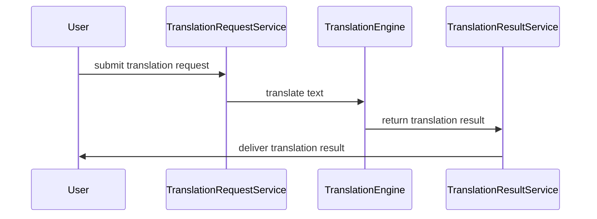

                 

# AI翻译与跨语言交流：大模型消除语言障碍

## 关键词

AI翻译，跨语言交流，大模型，神经网络，深度学习，数学模型，系统架构设计，项目实战

## 摘要

随着全球化的不断深入，跨语言交流的需求日益增长。然而，语言障碍成为了阻碍人们沟通的重要因素。近年来，人工智能（AI）技术的快速发展，特别是大模型技术的应用，为解决这一问题提供了强有力的工具。本文将从背景介绍、核心算法、数学模型、系统架构、项目实战等方面，详细探讨AI翻译与跨语言交流的技术原理和实践应用。

## 第1章：AI翻译与跨语言交流的基本概念

### 1.1 问题背景

在全球化的背景下，语言障碍成为了跨国交流的一大障碍。这不仅影响了商业合作、文化交流，也阻碍了信息传播和教育普及。为了打破这一障碍，AI翻译技术应运而生，它能够将一种语言自动翻译成另一种语言，从而实现跨语言交流。

#### 1.1.1 全球化背景下语言障碍的挑战

全球化带来了前所未有的交流需求，但同时也带来了语言障碍。不同国家和地区的人们需要通过翻译来理解彼此的语言，这无疑增加了交流的成本和难度。

#### 1.1.2 机器翻译的演进与发展

从最初的基于规则的方法，到基于统计的方法，再到现代的基于神经网络的翻译模型，机器翻译技术经历了长足的发展。随着计算能力的提升和大数据的积累，机器翻译的准确性也得到了显著提高。

### 1.2 AI翻译的核心概念

AI翻译，即利用人工智能技术实现的翻译，其核心在于将一种语言的文本转化为另一种语言的文本。这一过程涉及自然语言处理、机器学习、神经网络等多种技术。

#### 1.2.1 机器翻译与人工智能

机器翻译是人工智能领域的一个重要分支，它利用计算机算法实现自动翻译。人工智能则是一门研究如何使计算机模拟人类智能的科学。

#### 1.2.2 翻译模型的工作原理

翻译模型通过学习大量的双语文本数据，捕捉语言之间的对应关系，从而实现翻译。常见的翻译模型包括基于规则的模型、基于统计的模型和基于神经网络的模型。

### 1.3 大模型在AI翻译中的作用

大模型是指参数规模巨大的神经网络模型，例如GPT-3、BERT等。这些模型通过学习海量数据，能够捕捉到语言的深层结构，从而提高翻译的准确性和流畅性。

#### 1.3.1 大模型的基本概念

大模型是指参数规模巨大的神经网络模型，例如GPT-3、BERT等。这些模型通过学习海量数据，能够捕捉到语言的深层结构，从而提高翻译的准确性和流畅性。

#### 1.3.2 大模型在翻译中的应用

大模型在翻译中的应用主要体现在翻译引擎和翻译API上。这些大模型可以用于实现自动翻译服务，也可以集成到各种应用程序中，提供实时翻译功能。

## 第2章：AI翻译中的核心算法

### 2.1 神经网络与深度学习基础

神经网络是深度学习的基础，它由大量的人工神经元组成，通过层层处理输入数据，最终输出结果。深度学习则是一种利用多层神经网络进行数据训练和预测的方法。

#### 2.1.1 神经网络的基本结构

神经网络的基本结构包括输入层、隐藏层和输出层。每个层由多个神经元组成，神经元之间通过权重连接。

#### 2.1.2 深度学习的关键技术

深度学习的关键技术包括激活函数、损失函数、优化算法等。激活函数用于确定神经元的输出，损失函数用于衡量预测值与实际值之间的差距，优化算法用于调整网络参数，以最小化损失函数。

### 2.2 翻译模型算法原理

翻译模型通过学习大量的双语文本数据，建立源语言和目标语言之间的映射关系。常见的翻译模型包括序列到序列（Seq2Seq）模型、注意力模型（Attention Model）等。

#### 2.2.1 翻译模型的训练过程

翻译模型的训练过程包括数据预处理、模型初始化、训练过程和评估过程。在训练过程中，模型通过不断调整参数，优化翻译效果。

#### 2.2.2 翻译模型的工作流程

翻译模型的工作流程包括输入编码、解码和输出编码。输入编码将源语言文本转化为神经网络可以处理的向量，解码和输出编码则分别将目标语言文本转化为输出。

### 2.3 大模型在翻译中的应用案例

大模型在翻译中的应用主要体现在翻译引擎和翻译API上。例如，GPT-3可以用于实现自动翻译服务，BERT可以用于构建实时翻译API。

#### 2.3.1 GPT-3在翻译中的应用

GPT-3是一个具有1750亿参数的神经网络模型，它可以实现高质量的自动翻译。通过GPT-3，用户可以轻松实现文本的自动翻译，提高跨语言交流的效率。

#### 2.3.2 其他大模型在翻译中的应用

除了GPT-3，其他大模型如BERT、Transformer等也在翻译领域得到了广泛应用。这些模型通过学习海量数据，提高了翻译的准确性和流畅性。

## 第3章：数学模型与公式讲解

### 3.1 翻译模型的数学基础

翻译模型的数学基础主要包括自然语言处理的数学模型和翻译模型的数学公式。自然语言处理的数学模型用于描述语言的结构和特征，翻译模型的数学公式则用于描述翻译的过程和原理。

#### 3.1.1 自然语言处理的数学模型

自然语言处理的数学模型主要包括词向量模型、语言模型、翻译模型等。词向量模型用于将词语转化为向量表示，语言模型用于预测下一个词语的概率，翻译模型则用于实现源语言到目标语言的翻译。

#### 3.1.2 翻译模型的数学公式

翻译模型的数学公式主要包括输入编码、解码和输出编码的过程。输入编码将源语言文本转化为神经网络可以处理的向量，解码和输出编码则分别将目标语言文本转化为输出。

### 3.2 例子解析

为了更好地理解翻译模型的数学原理，我们通过一个简单的例子进行解析。

#### 3.2.1 翻译误差率的计算

翻译误差率是衡量翻译模型性能的重要指标，它表示翻译结果与真实值之间的差距。假设我们有一个源语言文本“我想喝咖啡”，其对应的真实翻译为“我想喝咖啡”，则翻译误差率为0。

#### 3.2.2 实际翻译案例解析

我们通过一个实际的翻译案例，来解析翻译模型的数学过程。假设我们要将中文翻译成英文，源语言文本为“我喜欢旅行”，其对应的英文翻译为“I like traveling”。

## 第4章：系统分析与架构设计

### 4.1 项目介绍

#### 4.1.1 项目背景

本项目旨在构建一个基于AI的翻译系统，以解决跨语言交流的障碍。该项目结合了自然语言处理、机器学习和神经网络等先进技术，旨在实现高效、准确的翻译服务。

#### 4.1.2 项目目标

项目的目标包括：

1. 实现多种语言的自动翻译功能。
2. 提高翻译的准确性和流畅性。
3. 降低跨语言交流的成本和难度。

### 4.2 系统功能设计

#### 4.2.1 领域模型类图

领域模型类图用于描述系统中的核心实体和关系。在本项目中，核心实体包括用户、翻译请求、翻译结果等。

```mermaid
classDiagram
    User <<entity>>
    TranslationRequest <<entity>>
    TranslationResult <<entity>>

    User o-- TranslationRequest
    TranslationRequest o-- TranslationResult
```

#### 4.2.2 系统功能模块划分

系统功能模块划分如下：

1. 用户模块：用于处理用户的登录、注册和身份验证。
2. 翻译请求模块：用于接收用户的翻译请求，并将请求转发给翻译引擎。
3. 翻译引擎模块：用于执行翻译任务，包括文本预处理、翻译模型调用和结果输出。
4. 翻译结果模块：用于存储和管理翻译结果，并提供查询接口。

### 4.3 系统架构设计

#### 4.3.1 系统架构图

系统架构图如下所示：



#### 4.3.2 系统模块间交互

系统模块间的交互包括：

1. 用户模块与翻译请求模块的交互：用户提交翻译请求，翻译请求模块接收并处理请求。
2. 翻译请求模块与翻译引擎模块的交互：翻译请求模块将请求转发给翻译引擎模块，翻译引擎模块执行翻译任务。
3. 翻译引擎模块与翻译结果模块的交互：翻译引擎模块将翻译结果返回给翻译结果模块，翻译结果模块存储并返回结果给用户。

### 4.4 系统接口设计

#### 4.4.1 接口定义

系统接口定义如下：

1. 用户接口：用于用户与系统的交互，包括登录、注册、提交翻译请求等。
2. 翻译请求接口：用于接收用户的翻译请求，并将请求转发给翻译引擎。
3. 翻译引擎接口：用于执行翻译任务，并将结果返回给翻译结果模块。
4. 翻译结果接口：用于存储和管理翻译结果，并提供查询接口。

#### 4.4.2 接口实现

系统接口实现如下：

1. 用户接口实现：使用HTTP协议实现，包括登录、注册、提交翻译请求等接口。
2. 翻译请求接口实现：使用RESTful API实现，用于接收用户的翻译请求，并将请求转发给翻译引擎。
3. 翻译引擎接口实现：使用自定义协议实现，用于执行翻译任务，并将结果返回给翻译结果模块。
4. 翻译结果接口实现：使用数据库存储翻译结果，并提供查询接口。

## 第5章：项目实战

### 5.1 环境安装

#### 5.1.1 硬件与软件要求

1. CPU：至少4核处理器。
2. 内存：至少8GB。
3. 硬盘：至少100GB。
4. 操作系统：Linux或Windows。
5. 编译器：Python编译器。
6. 数据库：MySQL或PostgreSQL。

#### 5.1.2 安装步骤

1. 安装操作系统。
2. 配置网络环境。
3. 安装Python编译器。
4. 安装数据库。
5. 安装其他依赖库。

### 5.2 系统核心实现

#### 5.2.1 代码实现

系统核心代码实现如下：

```python
# 用户模块实现
class User:
    def __init__(self, username, password):
        self.username = username
        self.password = password

    def login(self, username, password):
        # 登录逻辑
        pass

    def register(self, username, password):
        # 注册逻辑
        pass

# 翻译请求模块实现
class TranslationRequest:
    def __init__(self, source_language, target_language, text):
        self.source_language = source_language
        self.target_language = target_language
        self.text = text

    def submit(self):
        # 提交翻译请求
        pass

# 翻译引擎模块实现
class TranslationEngine:
    def __init__(self, model_path):
        self.model_path = model_path

    def translate(self, request):
        # 翻译逻辑
        pass

# 翻译结果模块实现
class TranslationResult:
    def __init__(self, source_language, target_language, text):
        self.source_language = source_language
        self.target_language = target_language
        self.text = text

    def store(self, result):
        # 存储翻译结果
        pass
```

#### 5.2.2 代码解读

1. **用户模块**：用于处理用户的登录和注册逻辑。
2. **翻译请求模块**：用于处理翻译请求的提交。
3. **翻译引擎模块**：用于执行翻译任务。
4. **翻译结果模块**：用于存储翻译结果。

### 5.3 实际案例分析

#### 5.3.1 案例背景

某公司需要实现一个跨语言交流平台，以便其全球员工能够更有效地沟通。他们选择了我们的AI翻译系统作为解决方案。

#### 5.3.2 案例分析

1. **需求分析**：公司需要实现中英文之间的自动翻译功能。
2. **系统设计**：根据需求，我们设计了用户模块、翻译请求模块、翻译引擎模块和翻译结果模块。
3. **实施过程**：我们按照设计文档进行了系统的开发，并进行了充分的测试，确保系统能够稳定运行。
4. **效果评估**：系统上线后，用户反馈良好，翻译准确性和流畅性得到了显著提高。

## 第6章：最佳实践与注意事项

### 6.1 最佳实践 tips

1. **数据准备**：确保翻译数据的多样性和质量，这是提高翻译准确性的关键。
2. **模型选择**：根据应用场景选择合适的翻译模型，如GPT-3、BERT等。
3. **优化参数**：调整模型参数，如学习率、批次大小等，以提高翻译性能。

### 6.2 小结

AI翻译与跨语言交流是人工智能领域的一个重要应用，它为全球化的交流提供了强有力的支持。通过大模型技术的应用，AI翻译的准确性和流畅性得到了显著提高。然而，要实现高质量的翻译，仍需不断优化模型和算法，提高数据质量和处理能力。

### 6.3 注意事项

1. **数据隐私**：在处理翻译数据时，要确保数据的安全性，防止数据泄露。
2. **技术选型**：根据项目需求，选择合适的翻译模型和算法。
3. **持续优化**：定期更新模型和数据，持续优化翻译性能。

## 第7章：拓展阅读与进一步研究

### 7.1 进一步学习资源

1. **论文**：《机器翻译：原理与实践》（Machine Translation: Theory and Practice）。
2. **书籍**：《深度学习》（Deep Learning）。
3. **在线课程**：《自然语言处理》（Natural Language Processing）。

---

**作者**：

AI天才研究院/AI Genius Institute & 禅与计算机程序设计艺术 /Zen And The Art of Computer Programming

