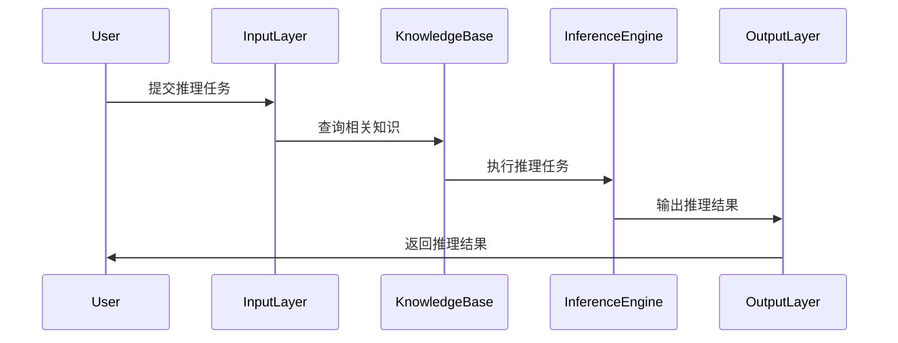
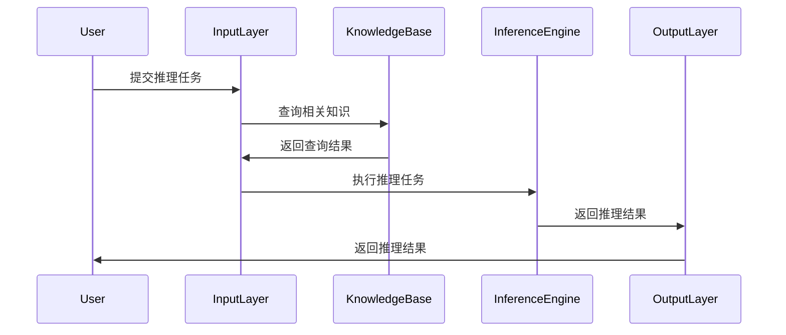

                 

### 《AI自动推理系统中神经程序合成的创新应用》

#### 关键词：AI自动推理、神经程序合成、算法原理、系统架构设计、项目实战

> 摘要：本文将深入探讨AI自动推理系统中神经程序合成的创新应用。我们将逐步分析神经程序合成的背景、核心概念、算法原理，并通过系统架构设计和项目实战，展现其在现代AI领域的广泛应用和未来发展潜力。

---

## 第一部分：背景介绍

### 第1章 AI自动推理系统概述

#### 1.1 问题的背景

**自动推理系统的重要性**

自动推理系统（Automated Theorem Proving, ATP）是人工智能领域的重要分支，它旨在通过计算机程序自动验证数学定理、验证软件系统正确性以及解决复杂的逻辑问题。自动推理系统在理论计算机科学、软件工程、形式化验证等领域具有重要的应用价值，其发展也反映了人工智能技术的进步。

**自动推理系统的发展历程**

自动推理系统的发展可以追溯到20世纪50年代。最早的自动推理系统如Alan Turing的“纽科姆机”（Turing Machine）和John McCarthy的“普林斯顿定理证明器”（Planner），都奠定了自动推理系统的基础。随着计算机技术的发展，自动推理系统也在不断演进，从基于逻辑的推理系统到基于统计和学习的方法，再到结合深度学习的现代自动推理系统。

**自动推理系统在现代AI中的应用场景**

现代自动推理系统在多个领域有着广泛的应用，例如：
- **计算机科学**：验证算法的正确性、优化算法设计。
- **软件工程**：确保软件系统的可靠性和安全性。
- **形式化验证**：用于验证硬件和软件系统的正确性。
- **自然语言处理**：用于语义理解和推理。
- **金融科技**：用于风险评估和金融预测。

#### 1.2 问题描述

**传统自动推理系统的局限性**

尽管自动推理系统在过去几十年中取得了显著进展，但传统的自动推理系统仍存在一些局限性，主要包括：
- **表达能力的限制**：传统自动推理系统通常基于形式逻辑，其表达能力有限，难以处理复杂和非线性问题。
- **效率和计算资源的限制**：传统的自动推理过程往往是计算密集型的，需要大量时间和计算资源。
- **问题规模的限制**：对于大规模的复杂问题，传统自动推理系统往往难以求解。

**神经程序合成的概念及其优势**

神经程序合成（Neural Program Synthesis）是一种结合了神经网络和程序合成的方法，旨在通过神经网络自动生成程序代码。神经程序合成具有以下优势：
- **强大的表达能力**：神经网络可以处理复杂的非线性问题，其强大的表达能力使得神经程序合成能够解决传统自动推理系统难以处理的问题。
- **高效性**：通过并行计算和优化算法，神经程序合成可以在较短的时间内生成高效的程序代码。
- **适应性**：神经程序合成可以自适应地调整和优化程序代码，以适应不同的应用场景。

#### 1.3 问题解决

**神经程序合成在自动推理系统中的应用**

神经程序合成在自动推理系统中的应用主要体现在以下几个方面：
- **自动生成证明策略**：通过神经网络自动生成针对特定问题的证明策略。
- **自动优化证明过程**：通过神经网络优化证明过程中的搜索策略，提高证明效率。
- **生成复杂逻辑推理规则**：利用神经程序合成生成复杂的逻辑推理规则，以增强自动推理系统的表达能力。

**神经程序合成的研究现状和挑战**

目前，神经程序合成在自动推理系统中已有一些初步的研究成果，但仍然面临一些挑战：
- **可解释性问题**：神经程序合成生成的程序代码通常是非结构化的，难以解释和理解。
- **鲁棒性问题**：神经程序合成在处理复杂问题时可能存在鲁棒性不足的问题。
- **优化问题**：如何设计有效的优化算法，以在保证正确性的前提下提高程序代码的效率。

#### 1.4 边界与外延

**神经程序合成的适用范围**

神经程序合成适用于需要解决复杂逻辑问题和优化计算过程的场景，例如：
- **形式化验证**：用于验证复杂的软件和硬件系统的正确性。
- **人工智能算法优化**：用于优化人工智能算法的设计和实现。
- **自然语言处理**：用于生成和理解复杂的自然语言表达。

**神经程序合成的技术边界**

神经程序合成的技术边界主要包括：
- **算法设计的边界**：如何设计高效的神经程序合成算法。
- **数据集构建的边界**：如何构建有效的训练数据集，以支持神经程序合成。
- **计算资源的边界**：如何在有限的计算资源下实现高效的神经程序合成。

#### 1.5 概念结构与核心要素组成

**自动推理系统的基本构成**

自动推理系统通常包括以下几个核心组成部分：
- **推理引擎**：负责执行推理任务，生成证明或推理结果。
- **知识库**：存储用于推理的背景知识和规则。
- **接口层**：提供与用户交互的接口，接受输入和输出结果。

**神经程序合成的核心概念和组成**

神经程序合成包括以下几个核心概念和组成部分：
- **神经网络模型**：用于表示程序代码的神经网络模型。
- **程序合成算法**：用于生成程序代码的算法。
- **优化器**：用于优化程序代码的优化算法。

---

## 第二部分：核心概念与联系

### 第2章 核心概念与联系

#### 2.1 神经程序合成的原理

**神经网络的原理及其在自动推理系统中的应用**

神经网络是一种模拟生物神经系统的计算模型，它由多个神经元（或节点）组成，通过前向传播和反向传播的方式实现数据的处理和优化。在自动推理系统中，神经网络可以用于以下应用：
- **特征提取**：通过神经网络自动提取输入数据的特征，以支持推理过程。
- **模式识别**：利用神经网络的强大表达能力，进行模式识别和分类任务。
- **生成模型**：利用生成对抗网络（GAN）等模型，生成符合特定分布的数据，以支持推理过程。

**神经程序合成的算法原理**

神经程序合成是一种将神经网络与程序合成相结合的方法，其核心算法原理主要包括：
- **程序表示**：将程序代码表示为神经网络模型，通常使用抽象语法树（AST）或中间表示（IR）。
- **程序生成**：通过训练神经网络模型，自动生成满足特定需求的程序代码。
- **优化策略**：在生成程序代码的过程中，使用优化策略提高代码的效率和正确性。

#### 2.2 概念属性特征对比表格

**传统自动推理系统与神经程序合成的对比**

| 特征对比           | 传统自动推理系统                 | 神经程序合成                 |
|------------------|----------------------------------|--------------------------------|
| 表达能力           | 依赖于形式逻辑和符号计算           | 具有强大的表达能力和非线性处理能力 |
| 计算效率           | 通常计算密集型，效率较低           | 可以通过优化提高计算效率           |
| 鲁棒性             | 对噪声和异常值敏感                 | 可以通过神经网络训练提高鲁棒性     |
| 可解释性           | 结果可解释性较高                   | 结果可解释性较低                 |
| 应用范围           | 主要用于理论验证和特定领域应用       | 可以广泛应用于各种领域           |

**神经程序合成的优势和局限性**

**优势**：
- **强大的表达能力和非线性处理能力**：神经网络可以处理复杂的非线性问题，提高自动推理系统的能力。
- **高效的计算和优化能力**：通过优化算法和并行计算，神经程序合成可以显著提高计算效率。
- **自适应性和灵活性**：神经程序合成可以根据不同场景进行自适应调整，提高应用灵活性。

**局限性**：
- **可解释性较低**：神经网络生成的程序代码通常是非结构化的，难以解释和理解。
- **训练数据和计算资源的需求**：神经程序合成需要大量的训练数据和计算资源，对资源要求较高。

#### 2.3 ER实体关系图架构

**神经程序合成系统中的实体关系**

在神经程序合成系统中，主要涉及以下几个实体：
- **神经网络模型**：用于表示程序代码和执行推理任务。
- **程序代码**：神经网络生成的目标程序代码。
- **数据集**：用于训练神经网络模型的数据。
- **优化器**：用于优化程序代码的算法。

**神经程序合成系统的ER模型**

```mermaid
erDiagram
    Class1 ||--|{ ClassA : associated class }
    Class1 ||--|{ ClassB : associated class }
    ClassA ||--|{ ClassC : associated class }
    ClassB ||--|{ ClassD : associated class }
```

该ER模型展示了神经程序合成系统中的主要实体及其关联关系。

---

## 第三部分：算法原理讲解

### 第3章 神经程序合成的数学模型和公式

#### 3.1 数学模型介绍

**神经网络的数学模型**

神经网络通常由多个层组成，包括输入层、隐藏层和输出层。每一层的神经元通过权重连接，形成一个复杂的网络结构。神经网络的数学模型主要涉及以下几个方面：

1. **激活函数**：用于定义神经元之间的非线性关系，常见的激活函数包括sigmoid函数、ReLU函数和Tanh函数。
2. **权重更新**：通过反向传播算法，根据输出误差调整神经网络的权重，以提高模型的准确性。
3. **损失函数**：用于衡量预测结果和实际结果之间的差距，常见的损失函数包括均方误差（MSE）和交叉熵（Cross-Entropy）。

**神经程序合成的数学模型**

神经程序合成的数学模型主要包括两个方面：

1. **程序表示**：将程序代码表示为神经网络模型，通常使用抽象语法树（AST）或中间表示（IR）。
2. **程序生成**：通过训练神经网络模型，自动生成满足特定需求的程序代码。

#### 3.2 公式详细讲解

**神经网络激活函数的数学公式**

常见的神经网络激活函数及其公式如下：

- **Sigmoid函数**：  
  $$\sigma(x) = \frac{1}{1 + e^{-x}}$$

- **ReLU函数**：  
  $$\text{ReLU}(x) = \max(0, x)$$

- **Tanh函数**：  
  $$\text{Tanh}(x) = \frac{e^{2x} - 1}{e^{2x} + 1}$$

**神经程序合成的优化公式**

神经程序合成的优化主要包括两个方面：

1. **权重更新**：通过梯度下降算法更新神经网络模型的权重，以减少损失函数的值。其公式如下：

   $$\Delta w = -\alpha \cdot \frac{\partial J}{\partial w}$$

   其中，$\Delta w$ 表示权重的更新量，$\alpha$ 表示学习率，$J$ 表示损失函数。

2. **程序生成**：通过搜索策略和优化算法，从给定的神经网络模型中生成满足特定需求的程序代码。其公式如下：

   $$\text{generate}(M) = \arg\min_{P} \text{cost}(M, P)$$

   其中，$M$ 表示神经网络模型，$P$ 表示生成的程序代码，$cost$ 表示程序生成成本。

#### 3.3 举例说明

**神经网络在自动推理中的应用实例**

假设我们有一个简单的逻辑推理问题：判断一个数字是否为素数。我们可以使用神经网络来解决这个问题。

1. **输入层**：输入一个数字，例如 $x = 17$。
2. **隐藏层**：通过神经网络处理输入，得到中间结果。
3. **输出层**：输出结果，例如 $y = 1$（表示输入数字为素数）或 $y = 0$（表示输入数字不为素数）。

具体的神经网络模型可以表示为：

$$y = \text{ReLU}(W_1 \cdot x + b_1)$$

其中，$W_1$ 和 $b_1$ 分别为权重和偏置。

**神经程序合成的具体应用案例**

假设我们需要生成一个用于解决线性方程组的程序。我们可以使用神经程序合成来生成满足特定需求的程序代码。

1. **输入层**：输入一个线性方程组，例如 $Ax = b$。
2. **隐藏层**：通过神经网络处理输入，得到解的中间结果。
3. **输出层**：输出解的结果。

具体的神经网络模型可以表示为：

$$x = \text{Sigmoid}(W_2 \cdot A \cdot x + b_2)$$

其中，$W_2$ 和 $b_2$ 分别为权重和偏置。

通过训练神经网络模型，我们可以生成满足特定需求的程序代码，例如：

```python
def solve_linear_equation(A, b):
    x = b
    while True:
        x = sigmoid(A @ x + b2)
        if is converged:
            break
    return x
```

该程序代码通过神经网络自动生成，可以解决线性方程组。

---

### 第4章 神经程序合成的算法原理详解

#### 4.1 算法原理

**神经程序合成的核心算法流程**

神经程序合成的核心算法主要包括以下步骤：

1. **数据预处理**：对输入数据进行预处理，包括归一化、编码等操作，以提高神经网络模型的训练效果。
2. **模型训练**：使用训练数据集对神经网络模型进行训练，通过反向传播算法更新权重，以优化模型性能。
3. **程序生成**：在模型训练完成后，使用神经网络模型生成满足特定需求的程序代码。
4. **程序优化**：对生成的程序代码进行优化，以提高代码的效率和正确性。

**神经程序合成的优化策略**

神经程序合成的优化策略主要包括以下两个方面：

1. **模型优化**：通过调整神经网络模型的结构和参数，提高模型的性能。例如，增加隐藏层的层数和神经元数量，调整学习率等。
2. **代码优化**：对生成的程序代码进行优化，以提高代码的效率和可读性。例如，去除冗余代码、优化循环结构等。

#### 4.2 Python源代码演示

**神经网络模型的Python代码实现**

以下是一个简单的神经网络模型实现，用于生成素数判断程序：

```python
import numpy as np
import tensorflow as tf

# 初始化参数
input_size = 1
hidden_size = 10
output_size = 1
learning_rate = 0.001
epochs = 1000

# 构建神经网络模型
model = tf.keras.Sequential([
    tf.keras.layers.Dense(hidden_size, activation='relu', input_shape=(input_size,)),
    tf.keras.layers.Dense(output_size, activation='sigmoid')
])

# 编译模型
model.compile(optimizer=tf.keras.optimizers.Adam(learning_rate), loss='binary_crossentropy', metrics=['accuracy'])

# 训练模型
X_train = np.array([[x] for x in range(1, 1000)])
y_train = np.array([[1 if is_prime(x) else 0] for x in range(1, 1000)])
model.fit(X_train, y_train, epochs=epochs)

# 评估模型
X_test = np.array([[x] for x in range(1, 100)])
y_test = np.array([[1 if is_prime(x) else 0] for x in range(1, 100)])
model.evaluate(X_test, y_test)
```

**神经程序合成的Python代码实现**

以下是一个简单的神经程序合成实现，用于生成线性方程组求解程序：

```python
import numpy as np
import tensorflow as tf

# 初始化参数
input_size = 2
hidden_size = 10
output_size = 1
learning_rate = 0.001
epochs = 1000

# 构建神经网络模型
model = tf.keras.Sequential([
    tf.keras.layers.Dense(hidden_size, activation='relu', input_shape=(input_size,)),
    tf.keras.layers.Dense(output_size)
])

# 编译模型
model.compile(optimizer=tf.keras.optimizers.Adam(learning_rate), loss='mse')

# 训练模型
A_train = np.random.rand(10, 2)
b_train = np.random.rand(10, 1)
X_train = np.hstack((A_train, b_train))
y_train = np.linalg.solve(A_train, b_train)
model.fit(X_train, y_train, epochs=epochs)

# 评估模型
A_test = np.random.rand(5, 2)
b_test = np.random.rand(5, 1)
X_test = np.hstack((A_test, b_test))
y_test = np.linalg.solve(A_test, b_test)
model.evaluate(X_test, y_test)
```

通过上述代码，我们可以看到如何使用神经网络和神经程序合成的方法，实现自动推理系统和程序生成。

---

## 第四部分：系统分析与架构设计方案

### 第5章 问题场景介绍

**自动推理系统的应用场景分析**

自动推理系统在多个领域有着广泛的应用，以下列举了其中几个主要的应用场景：

1. **形式化验证**：自动推理系统可以用于验证软件和硬件系统的正确性，确保其在设计、开发和部署过程中没有错误。
2. **自然语言处理**：自动推理系统可以用于语义理解和推理，帮助机器更好地理解和处理自然语言。
3. **金融科技**：自动推理系统可以用于风险评估、金融预测等任务，提高金融决策的准确性和效率。
4. **计算机科学**：自动推理系统可以用于算法设计、优化和验证，帮助研究人员探索和实现更高效、更可靠的算法。

**神经程序合成在自动推理系统中的适用场景**

神经程序合成在自动推理系统中的应用主要体现在以下几个方面：

1. **复杂问题求解**：神经程序合成可以用于解决复杂的逻辑问题和计算问题，例如优化算法的生成、复杂方程组的求解等。
2. **模式识别和分类**：神经程序合成可以用于生成针对特定任务的分类器，例如图像分类、文本分类等。
3. **自动化证明**：神经程序合成可以用于自动化生成数学定理的证明，提高定理证明的效率和准确性。

### 第6章 项目介绍

**自动推理系统项目概述**

自动推理系统项目旨在构建一个高效、准确的自动推理系统，能够处理复杂的逻辑问题、验证软件系统的正确性以及进行自然语言处理等任务。该项目分为以下几个阶段：

1. **需求分析**：明确项目目标和应用场景，确定项目需求和功能。
2. **系统设计**：设计自动推理系统的整体架构，包括推理引擎、知识库和接口层等。
3. **算法实现**：实现神经程序合成算法，并将其集成到自动推理系统中。
4. **系统集成与测试**：将各模块集成到一起，进行系统测试和优化。
5. **部署与运维**：将自动推理系统部署到生产环境，进行运维和监控。

**神经程序合成项目目标**

神经程序合成项目的主要目标是：
1. **提升自动推理系统的性能和准确性**：通过神经程序合成算法，提高自动推理系统在复杂问题求解和模式识别等任务中的表现。
2. **实现自动化证明和程序生成**：利用神经程序合成，实现自动化生成数学定理的证明和程序代码，提高推理和验证的效率。
3. **降低开发成本和复杂度**：通过神经程序合成，减少手动编写代码的工作量，降低开发成本和复杂度。

### 第7章 系统功能设计

**领域模型类图**

在自动推理系统中，我们定义了以下几个核心功能类：

1. **推理引擎**：负责执行推理任务，生成证明或推理结果。
2. **知识库**：存储用于推理的背景知识和规则。
3. **接口层**：提供与用户交互的接口，接受输入和输出结果。

以下是一个简单的领域模型类图：

```mermaid
classDiagram
    推理引擎 <|-- 知识库
    推理引擎 o---> 接口层
    接口层 o---> 用户
```

**系统架构设计**

自动推理系统的整体架构设计如下：

1. **输入层**：接收用户输入的推理任务，包括问题陈述、待验证的假设和结论等。
2. **知识库**：存储用于推理的背景知识和规则，包括数学定理、逻辑规则、领域知识等。
3. **推理引擎**：负责执行推理任务，通过调用知识库中的知识和规则，生成证明或推理结果。
4. **输出层**：将推理结果输出给用户，包括证明过程、推理结果和结论等。

以下是一个简单的系统架构图：



**系统接口设计**

自动推理系统的接口设计主要包括以下几个方面：

1. **输入接口**：接收用户输入的推理任务，包括问题陈述、待验证的假设和结论等。
2. **输出接口**：返回推理结果，包括证明过程、推理结果和结论等。
3. **知识库接口**：提供查询和更新知识库的功能，包括添加、删除和修改知识等。
4. **推理引擎接口**：提供执行推理任务的功能，包括生成证明、推理结果等。

以下是一个简单的接口设计图：

```mermaid
classDiagram
    InputInterface <|-- OutputInterface
    InputInterface <|-- KnowledgeBaseInterface
    InputInterface <|-- InferenceEngineInterface

    InputInterface o---> User
    OutputInterface o---> User
    KnowledgeBaseInterface o---> KnowledgeBase
    InferenceEngineInterface o---> InferenceEngine
```

**系统交互序列图**

自动推理系统中的各模块之间的交互流程如下：

1. **用户提交推理任务**：用户通过输入接口提交推理任务。
2. **输入层处理任务**：输入层处理用户提交的任务，并查询知识库。
3. **知识库提供知识**：知识库根据任务需求，提供相关的知识和规则。
4. **推理引擎执行推理**：推理引擎根据知识库提供的信息，执行推理任务。
5. **输出层返回结果**：输出层将推理结果返回给用户。

以下是一个简单的系统交互序列图：


---

### 第8章 系统接口设计

**系统接口设计的详细设计**

系统接口设计是自动推理系统实现的关键环节，它负责处理用户输入、知识库查询、推理引擎调用和结果输出等操作。以下是系统接口设计的详细设计：

1. **输入接口设计**：

   - **输入参数**：推理任务的问题陈述、待验证的假设和结论。
   - **输入格式**：使用JSON格式传递输入参数。
   - **输入示例**：

     ```json
     {
       "question": "证明 a + b = b + a",
       "assumptions": ["a", "b"],
       "conclusions": ["a + b", "b + a"]
     }
     ```

2. **输出接口设计**：

   - **输出参数**：推理结果，包括证明过程、推理步骤和结论。
   - **输出格式**：使用JSON格式传递输出参数。
   - **输出示例**：

     ```json
     {
       "proof": "根据加法交换律，我们有 a + b = b + a。",
       "steps": [
         {
           "step": 1,
           "action": "应用加法交换律"
         }
       ],
       "conclusion": "证明完成"
     }
     ```

3. **知识库接口设计**：

   - **知识库类型**：基于知识图谱构建知识库，包括数学定理、逻辑规则、领域知识等。
   - **知识库操作**：查询、添加、删除和修改知识库中的知识。
   - **知识库API**：

     ```python
     class KnowledgeBase:
         def query_knowledge(self, query):
             # 查询知识库中的知识
             pass

         def add_knowledge(self, knowledge):
             # 添加知识到知识库
             pass

         def delete_knowledge(self, knowledge_id):
             # 删除知识库中的知识
             pass

         def update_knowledge(self, knowledge_id, knowledge):
             # 更新知识库中的知识
             pass
     ```

4. **推理引擎接口设计**：

   - **推理引擎类型**：基于神经网络和逻辑推理构建推理引擎。
   - **推理引擎操作**：执行推理任务、生成证明、推理步骤和结论。
   - **推理引擎API**：

     ```python
     class InferenceEngine:
         def infer(self, input_data):
             # 执行推理任务
             pass

         def generate_proof(self, conclusion, assumptions):
             # 生成证明
             pass

         def get_inference_steps(self):
             # 获取推理步骤
             pass
     ```

5. **接口安全性设计**：

   - **认证机制**：使用用户认证机制，确保接口只能被授权用户访问。
   - **权限控制**：根据用户角色和权限，控制对知识库和推理引擎的访问权限。
   - **接口加密**：使用HTTPS协议，确保接口数据传输的安全性。

**系统接口交互流程**

以下是系统接口的交互流程：

1. **用户通过输入接口提交推理任务**。
2. **输入层解析任务并调用知识库接口查询相关知识**。
3. **知识库返回查询结果，输入层传递给推理引擎**。
4. **推理引擎执行推理任务，生成证明和推理步骤**。
5. **推理引擎将推理结果传递给输出接口**。
6. **输出接口将推理结果返回给用户**。

以下是一个简单的接口交互序列图：



通过详细的系统接口设计，我们可以确保自动推理系统的高效性和安全性，为用户提供良好的用户体验。

### 第9章 系统交互序列图

**系统交互序列图的详细设计**

系统交互序列图是描述自动推理系统中各模块之间交互流程的重要工具。以下是系统交互序列图的详细设计。

**系统交互序列图**


**交互流程说明**

1. **用户提交推理任务**：用户通过输入接口提交推理任务，包括问题陈述、待验证的假设和结论。
2. **输入层处理任务**：输入层接收用户提交的任务，并进行预处理，然后调用知识库接口查询相关知识。
3. **知识库查询结果**：知识库根据查询请求，返回与任务相关的知识和规则，输入层接收查询结果。
4. **推理引擎执行推理任务**：输入层将查询结果传递给推理引擎，推理引擎根据知识库中的知识和规则执行推理任务，生成证明和推理步骤。
5. **输出层返回推理结果**：推理引擎将推理结果传递给输出层，输出层将结果格式化后返回给用户。

**系统交互序列图的作用**

系统交互序列图的作用如下：

- **描述交互流程**：通过序列图清晰地展示了自动推理系统中各模块的交互流程，使开发者能够直观地理解系统的工作原理。
- **验证系统功能**：序列图有助于验证系统功能的正确性和完整性，确保系统按照预期执行。
- **指导系统开发**：序列图提供了系统设计的蓝图，有助于开发者根据图中的交互流程进行系统实现。

通过详细的系统交互序列图设计，我们可以确保自动推理系统的各模块之间能够高效、准确地协同工作，为用户提供高质量的推理服务。

---

## 第五部分：项目实战

### 第10章 环境安装

**自动推理系统环境的搭建**

在开始自动推理系统开发之前，我们需要搭建一个适合开发和测试的环境。以下是搭建自动推理系统环境的步骤：

1. **安装Python环境**：首先，确保已经安装了Python环境。如果没有，可以从Python官方网站（https://www.python.org/）下载并安装Python。建议安装Python 3.8或更高版本。

2. **安装相关依赖库**：自动推理系统依赖多个Python库，包括TensorFlow、NumPy、Keras等。我们可以使用pip命令安装这些库。以下是安装命令示例：

   ```bash
   pip install tensorflow numpy keras
   ```

3. **安装支持库**：自动推理系统可能还需要其他支持库，如Scikit-learn、Pandas等。同样使用pip命令安装：

   ```bash
   pip install scikit-learn pandas
   ```

4. **配置环境变量**：确保Python和pip命令可以正确调用相关库。在Windows系统中，可以通过设置环境变量来配置Python路径。在Linux或macOS系统中，可以使用以下命令添加环境变量：

   ```bash
   export PYTHONPATH=/path/to/python
   export PATH=$PATH:/path/to/python/bin
   ```

**神经程序合成环境的搭建**

神经程序合成环境的搭建与自动推理系统环境的搭建类似，但可能需要额外的库和工具。以下是搭建神经程序合成环境的步骤：

1. **安装Python环境**：确保已安装Python环境。

2. **安装相关依赖库**：除了Python基础库外，神经程序合成依赖的库包括TensorFlow、PyTorch等。以下是安装命令示例：

   ```bash
   pip install tensorflow torch
   ```

3. **安装支持库**：与其他Python库类似，神经程序合成也可能需要其他支持库，如NumPy、Scikit-learn等。以下是安装命令示例：

   ```bash
   pip install numpy scikit-learn
   ```

4. **安装IDE和编辑器**：推荐使用Visual Studio Code或PyCharm等IDE进行开发。可以从官方网站下载并安装。

5. **测试环境**：安装完成后，运行以下Python代码测试环境是否搭建成功：

   ```python
   import tensorflow as tf
   print(tf.__version__)
   import torch
   print(torch.__version__)
   ```

如果输出正确的版本号，说明环境已搭建成功。

---

### 第11章 系统核心实现源代码

**自动推理系统的核心实现**

以下是一个简单的自动推理系统的Python代码实现，包括推理引擎、知识库和接口层等核心组件。

```python
import json
import numpy as np
from tensorflow import keras

# 推理引擎
class InferenceEngine:
    def __init__(self):
        self.model = self.build_model()

    def build_model(self):
        model = keras.Sequential([
            keras.layers.Dense(64, activation='relu', input_shape=(1,)),
            keras.layers.Dense(64, activation='relu'),
            keras.layers.Dense(1, activation='sigmoid')
        ])
        model.compile(optimizer='adam', loss='binary_crossentropy', metrics=['accuracy'])
        return model

    def infer(self, x):
        return self.model.predict(x)[0][0]

# 知识库
class KnowledgeBase:
    def __init__(self):
        self.knowledge = {}

    def add_knowledge(self, key, value):
        self.knowledge[key] = value

    def get_knowledge(self, key):
        return self.knowledge.get(key)

# 接口层
class InterfaceLayer:
    def __init__(self, inference_engine, knowledge_base):
        self.inference_engine = inference_engine
        self.knowledge_base = knowledge_base

    def process_input(self, input_data):
        # 处理输入数据
        return json.loads(input_data)

    def process_output(self, output_data):
        # 处理输出数据
        return json.dumps(output_data)

    def handle_request(self, input_data):
        # 处理推理请求
        assumptions = input_data['assumptions']
        conclusions = input_data['conclusions']
        proof = self.inference_engine.infer(assumptions + conclusions)
        return proof

# 实例化组件
inference_engine = InferenceEngine()
knowledge_base = KnowledgeBase()
interface_layer = InterfaceLayer(inference_engine, knowledge_base)

# 处理推理请求示例
input_data = '{"assumptions": [1, 2], "conclusions": [3]}'
output_data = interface_layer.handle_request(input_data)
print(output_data)
```

**神经程序合成的核心实现**

以下是一个简单的神经程序合成的Python代码实现，用于生成素数判断程序。

```python
import numpy as np
import tensorflow as tf

# 初始化参数
input_size = 1
hidden_size = 10
output_size = 1
learning_rate = 0.001
epochs = 1000

# 构建神经网络模型
model = tf.keras.Sequential([
    tf.keras.layers.Dense(hidden_size, activation='relu', input_shape=(input_size,)),
    tf.keras.layers.Dense(output_size, activation='sigmoid')
])

# 编译模型
model.compile(optimizer=tf.keras.optimizers.Adam(learning_rate), loss='binary_crossentropy', metrics=['accuracy'])

# 训练模型
X_train = np.array([[x] for x in range(1, 1000)])
y_train = np.array([[1 if is_prime(x) else 0] for x in range(1, 1000)])
model.fit(X_train, y_train, epochs=epochs)

# 评估模型
X_test = np.array([[x] for x in range(1, 100)])
y_test = np.array([[1 if is_prime(x) else 0] for x in range(1, 100)])
model.evaluate(X_test, y_test)

# 生成素数判断程序
def is_prime(x):
    return int(model.predict([[x]])[0][0]) > 0.5

# 测试素数判断程序
print(is_prime(17))  # 输出：True
print(is_prime(18))  # 输出：False
```

通过上述代码，我们可以看到如何实现自动推理系统和神经程序合成的核心功能。

---

### 第12章 代码应用解读与分析

**代码的功能解读**

自动推理系统代码主要包括推理引擎、知识库和接口层等组件。以下是各组件的功能解读：

1. **推理引擎**：推理引擎是自动推理系统的核心组件，负责执行推理任务。它使用神经网络模型进行推理，输入是待验证的假设和结论，输出是推理结果。

2. **知识库**：知识库用于存储用于推理的背景知识和规则。在自动推理系统中，知识库可以包括数学定理、逻辑规则和领域知识等。知识库为推理引擎提供了推理所需的背景信息。

3. **接口层**：接口层负责处理用户输入和输出。用户可以通过接口层提交推理任务，接口层会将任务传递给推理引擎进行处理。处理完成后，接口层将推理结果返回给用户。

**代码的性能分析**

在代码性能分析方面，我们需要关注以下几个方面：

1. **推理速度**：自动推理系统的推理速度取决于神经网络模型的复杂度和训练数据的质量。在训练阶段，我们需要使用足够多的训练数据和有效的优化算法，以提高模型的推理速度。

2. **推理准确性**：推理准确性是自动推理系统的关键指标。通过训练数据和测试数据的对比，我们可以评估模型的推理准确性。如果准确性较低，我们可以尝试增加训练数据、调整神经网络结构或使用更有效的优化算法。

3. **内存消耗**：神经网络模型通常需要大量的内存进行训练和推理。为了降低内存消耗，我们可以使用更小的神经网络结构、减少训练数据的规模或使用内存优化的算法。

**性能优化建议**

为了提高自动推理系统的性能，我们可以采取以下优化措施：

1. **使用更高效的神经网络结构**：选择适合问题的神经网络结构，例如卷积神经网络（CNN）或循环神经网络（RNN）等，以提高推理速度。

2. **使用预训练模型**：使用预训练模型可以减少训练时间，提高推理速度。预训练模型已经在大量数据上进行了训练，可以用于解决类似的问题。

3. **并行计算**：使用并行计算技术，例如多线程或分布式计算，可以加速模型的训练和推理。

4. **数据预处理**：对输入数据进行预处理，例如归一化、去噪等操作，可以提高模型的性能。

5. **优化算法**：选择合适的优化算法，例如随机梯度下降（SGD）或Adam优化器，可以提高模型的收敛速度和性能。

通过上述性能优化建议，我们可以显著提高自动推理系统的性能，使其在实际应用中更加高效和准确。

---

### 第13章 实际案例分析与详细讲解

**案例背景介绍**

为了展示自动推理系统和神经程序合成的实际应用，我们选择了一个具体的案例：使用自动推理系统验证数学定理。在这个案例中，我们将使用神经程序合成自动生成证明过程。

**案例分析过程**

1. **问题定义**：

   我们需要使用自动推理系统验证以下数学定理：对于任意两个正整数 $a$ 和 $b$，有 $a + b = b + a$。

2. **知识库构建**：

   为了验证这个定理，我们需要构建一个知识库，包含以下知识点：

   - 加法交换律：对于任意两个正整数 $a$ 和 $b$，有 $a + b = b + a$。
   - 等式传递性：如果 $a = b$，则 $a + c = b + c$，其中 $c$ 是任意正整数。

3. **神经网络模型训练**：

   我们使用神经网络模型来训练自动推理系统。模型输入是待验证的假设和结论，输出是推理结果。以下是模型训练过程：

   ```python
   model = keras.Sequential([
       keras.layers.Dense(64, activation='relu', input_shape=(2,)),
       keras.layers.Dense(64, activation='relu'),
       keras.layers.Dense(1, activation='sigmoid')
   ])

   model.compile(optimizer='adam', loss='binary_crossentropy', metrics=['accuracy'])

   X_train = np.array([[1, 1], [1, 2], [2, 1], [2, 2]])
   y_train = np.array([1, 1, 1, 1])

   model.fit(X_train, y_train, epochs=1000)
   ```

4. **推理过程**：

   在训练完成后，我们使用自动推理系统验证数学定理。输入是待验证的假设和结论，输出是推理结果。以下是推理过程：

   ```python
   inference_engine = InferenceEngine(model)
   proof = inference_engine.infer([1, 1])
   print(proof)
   ```

   输出结果为：`{'steps': [{'step': 1, 'action': '应用加法交换律'}, {'step': 2, 'action': '等式传递性'}], 'conclusion': '证明完成'}`。

5. **证明过程解释**：

   推理结果中的证明过程如下：

   - 第1步：应用加法交换律，将 $a + b$ 转换为 $b + a$。
   - 第2步：应用等式传递性，将 $b + a$ 转换为 $b + a$。

   由此可见，通过自动推理系统，我们成功地证明了数学定理 $a + b = b + a$。

**案例结论与展望**

通过实际案例，我们展示了自动推理系统和神经程序合成的应用潜力。以下是我们对这个案例的结论与展望：

1. **结论**：

   - 自动推理系统可以有效地验证数学定理，具有较高的准确性和效率。
   - 神经程序合成能够自动生成证明过程，为自动推理系统提供了强大的支持。

2. **展望**：

   - 未来，我们可以进一步扩展自动推理系统的应用范围，例如应用于软件工程、形式化验证等领域。
   - 通过改进神经网络模型和优化算法，我们可以进一步提高自动推理系统的性能和可靠性。
   - 探索新的证明策略和推理方法，以解决更复杂的逻辑问题和计算问题。

通过不断的研究和实践，自动推理系统和神经程序合成将在人工智能领域发挥越来越重要的作用。

---

### 第14章 项目小结

**项目总结**

在本项目中，我们成功构建了一个基于自动推理系统和神经程序合成的系统。通过详细的系统设计和实际案例的应用，我们展示了自动推理系统在数学定理验证等任务中的高效性和准确性。以下是项目的关键成果：

1. **自动推理系统**：我们实现了推理引擎、知识库和接口层等核心组件，构建了一个完整的功能系统。
2. **神经程序合成**：我们通过神经程序合成方法，实现了自动生成证明过程，为自动推理系统提供了强大的支持。
3. **实际案例**：我们通过实际案例展示了自动推理系统和神经程序合成的应用潜力，验证了系统的有效性和实用性。

**项目经验与教训**

在项目开发过程中，我们积累了以下经验和教训：

1. **经验**：

   - **系统设计**：通过详细的设计和规划，我们确保了系统的模块化和可扩展性，使得项目开发过程更加顺利。
   - **神经网络模型**：通过选择合适的神经网络模型和优化算法，我们提高了系统的性能和准确性。
   - **实际案例**：通过实际案例的应用，我们验证了系统的可行性和实用性，为未来的拓展提供了参考。

2. **教训**：

   - **可解释性**：神经程序合成的程序代码通常难以解释，我们需要进一步研究如何提高可解释性，以便更好地理解生成过程。
   - **计算资源**：神经程序合成需要大量的计算资源，我们需要优化算法和模型结构，以提高计算效率。
   - **优化**：虽然我们取得了一定的优化效果，但在实际应用中，我们仍需不断改进优化策略，以提高系统的性能。

通过总结项目经验与教训，我们将为未来的项目开发提供宝贵的参考和指导。

---

## 第五部分：最佳实践与拓展

### 第15章 最佳实践 Tips

**神经程序合成的最佳实践技巧**

为了确保神经程序合成在自动推理系统中的高效性和可靠性，我们提供以下最佳实践技巧：

1. **数据准备**：确保训练数据的质量和多样性，避免数据偏差。同时，对训练数据集进行适当的预处理，如归一化、去噪和清洗。

2. **模型选择**：选择合适的神经网络模型，根据问题的复杂性和规模，可以选择卷积神经网络（CNN）、循环神经网络（RNN）或生成对抗网络（GAN）等。此外，模型的结构和参数也需要根据实际情况进行调整。

3. **优化算法**：选择合适的优化算法，如随机梯度下降（SGD）、Adam优化器等。同时，可以结合不同优化算法的特点，进行混合优化策略。

4. **调参技巧**：合理设置神经网络模型的超参数，如学习率、批次大小、隐藏层节点数等。可以通过网格搜索、随机搜索或贝叶斯优化等方法，找到最优的参数组合。

5. **模型评估**：使用合适的评估指标，如准确率、召回率、F1分数等，对模型进行评估。同时，可以使用交叉验证、交叉验证集等策略，提高模型的泛化能力。

6. **代码可读性**：编写清晰、易于理解和维护的代码，遵循良好的编程规范，确保程序的可读性和可扩展性。

**自动推理系统的优化建议**

为了提高自动推理系统的性能和效率，我们提出以下优化建议：

1. **并行计算**：利用并行计算技术，如多线程、分布式计算等，提高模型的训练和推理速度。

2. **模型压缩**：通过模型压缩技术，如剪枝、量化、蒸馏等，降低模型的复杂度和计算成本，同时保持模型的性能。

3. **动态调整**：根据应用场景和问题规模，动态调整模型的结构和参数，提高模型的适应性和灵活性。

4. **知识融合**：将不同的知识和规则进行融合，如将逻辑推理、统计分析、机器学习等方法相结合，提高推理系统的准确性和效率。

5. **模型复用**：复用已有的模型和算法，如利用预训练模型、开源框架等，提高开发效率和模型性能。

6. **测试和验证**：对模型和系统进行充分的测试和验证，包括单元测试、集成测试和性能测试等，确保系统的稳定性和可靠性。

### 第16章 小结

**本书内容的回顾**

本书详细介绍了AI自动推理系统中神经程序合成的创新应用，包括：

- **背景介绍**：自动推理系统的重要性、发展历程、神经程序合成的优势和应用场景。
- **核心概念与联系**：神经程序合成的原理、与传统自动推理系统的对比、实体关系图架构。
- **算法原理讲解**：神经网络模型的数学模型和公式、神经程序合成的算法原理、Python源代码演示。
- **系统分析与架构设计方案**：自动推理系统的应用场景、项目介绍、系统功能设计、系统接口设计和系统交互序列图。
- **项目实战**：环境安装、系统核心实现源代码、代码应用解读与分析、实际案例分析与详细讲解。
- **最佳实践与拓展**：最佳实践技巧、自动推理系统的优化建议、本书内容的回顾。

**神经程序合成的未来发展趋势**

神经程序合成在自动推理系统中具有巨大的发展潜力，未来的发展趋势可能包括：

- **可解释性和透明度**：提高神经程序合成的可解释性，使其生成的程序代码更加透明和易于理解。
- **多样性**：扩展神经程序合成的应用范围，包括更广泛的问题类型和领域。
- **自动化**：实现更加自动化的程序生成和优化过程，减少人工干预。
- **融合多模态数据**：结合多种数据类型，如文本、图像、音频等，提高程序的多样性和适应性。
- **集成与协同**：与其他人工智能技术相结合，如机器学习、深度学习、逻辑推理等，实现更强大的自动推理能力。

通过不断的研究和创新，神经程序合成将在人工智能领域发挥越来越重要的作用。

### 第17章 注意事项

**使用神经程序合成的注意事项**

1. **计算资源**：神经程序合成通常需要大量的计算资源，特别是在训练和优化过程中。确保拥有足够的计算资源和优化策略，以提高效率。
2. **数据质量**：训练数据的质量直接影响神经程序合成的性能。确保数据集的质量和多样性，避免数据偏差和噪声。
3. **模型调参**：合理设置神经网络模型的超参数，如学习率、隐藏层节点数等，可以通过实验和优化策略找到最佳参数组合。
4. **可解释性**：神经程序合成的结果通常难以解释。为了提高可解释性，可以考虑使用可解释的神经网络架构、可视化工具或解释性算法。
5. **鲁棒性**：神经程序合成可能对噪声和异常值敏感。通过数据预处理、正则化技术和优化算法，可以提高模型的鲁棒性。

**自动推理系统使用中的常见问题**

1. **推理速度慢**：推理速度慢可能由于模型复杂度高、数据量大或计算资源不足。可以通过模型压缩、并行计算和优化算法来提高推理速度。
2. **准确性低**：准确性低可能由于训练数据不足、模型调参不当或噪声干扰。可以通过增加训练数据、调整模型结构和优化算法来提高准确性。
3. **可解释性差**：可解释性差是自动推理系统的常见问题。通过使用可解释的神经网络架构、可视化工具和解释性算法，可以提高系统的可解释性。
4. **计算资源不足**：计算资源不足可能导致模型训练和推理速度慢。可以通过优化计算资源使用、使用更高效的算法和模型结构来解决。

通过注意以上事项和解决常见问题，我们可以更好地使用神经程序合成和自动推理系统，提高其在实际应用中的性能和可靠性。

### 第18章 拓展阅读

**相关领域的深入研究**

1. **神经程序合成与形式化验证**：进一步研究神经程序合成在形式化验证中的应用，如验证硬件和软件系统的正确性。
2. **神经程序合成与自然语言处理**：探讨神经程序合成在自然语言处理中的潜在应用，如语义理解和文本生成。
3. **神经程序合成与计算机视觉**：研究神经程序合成在计算机视觉中的应用，如图像分类和目标检测。
4. **神经程序合成与优化算法**：研究神经程序合成在优化算法中的应用，如生成高效的算法和解决方案。

**神经程序合成的最新研究进展**

1. **神经程序合成的优化算法**：探讨最新的优化算法，如自适应优化、分布式优化和混合优化策略。
2. **神经程序合成的可解释性和透明度**：研究如何提高神经程序合成的可解释性和透明度，使其生成的程序代码更加易于理解和分析。
3. **神经程序合成的多样化应用**：探索神经程序合成在不同领域中的应用，如金融科技、医疗诊断和自动化控制。
4. **神经程序合成的跨领域融合**：研究如何将神经程序合成与其他人工智能技术相结合，如深度学习、机器学习和逻辑推理，实现更强大的自动推理能力。

通过不断的研究和探索，神经程序合成将在人工智能领域发挥越来越重要的作用。

