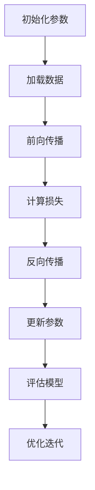
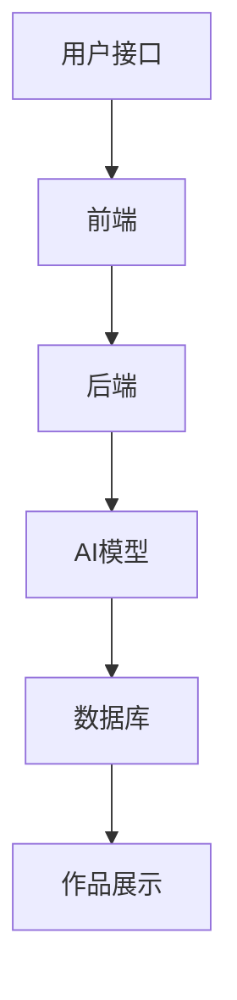
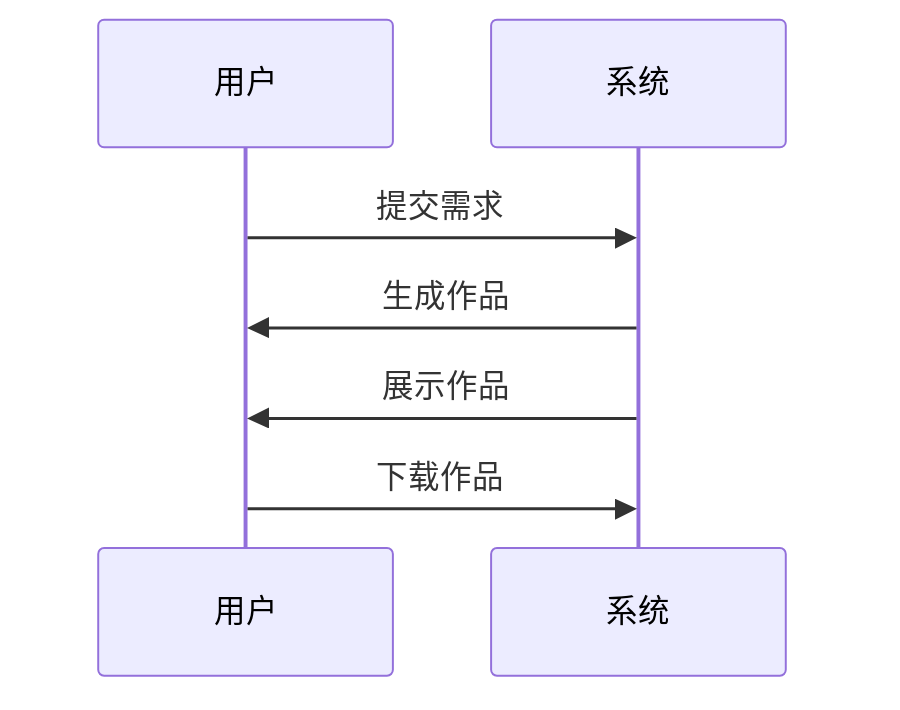

                 

# AI艺术创作：大模型重新定义艺术边界

## 关键词
- AI艺术创作
- 大模型
- 艺术边界
- 算法原理
- 系统架构
- 项目实战

## 摘要
本文将探讨人工智能（AI）与大模型在艺术创作领域的结合，以及这一结合如何重新定义艺术的边界。首先，我们将介绍AI艺术创作的背景和现状，阐述大模型在其中的作用。随后，我们将定义相关核心概念，并对比大模型与传统艺术创作方法的优劣。接着，通过详细的算法原理讲解，帮助读者理解AI大模型的工作机制。文章还将深入分析AI艺术创作系统的架构设计，并通过项目实战案例进行剖析。最后，我们将总结最佳实践，提供拓展阅读资源，以期为读者提供全面的AI艺术创作指南。

## 1. 背景介绍

### 1.1 AI艺术创作的背景

人工智能自20世纪50年代问世以来，经历了多个阶段的发展，从简单的逻辑推理到复杂的深度学习，再到如今的大模型时代，AI技术不断突破。随着计算能力的提升和算法的进步，AI在各个领域的应用越来越广泛，艺术创作也不例外。

艺术创作一直是人类文明的重要组成部分，而AI艺术创作的出现，为艺术家们提供了新的创作工具和灵感来源。AI能够通过学习大量数据，自动生成音乐、绘画、雕塑等艺术作品，这些作品有时甚至超越人类的创作能力，引起了广泛关注。

### 1.2 大模型在艺术创作中的作用

大模型，通常指的是拥有数亿甚至万亿参数的深度学习模型。这些模型具有强大的表示能力和泛化能力，能够处理复杂的数据模式，并在多种任务中取得优异成绩。

在艺术创作中，大模型的应用主要体现在以下几个方面：

1. **创意生成**：大模型可以生成新的音乐旋律、绘画作品等，为艺术家提供灵感。
2. **个性化定制**：大模型能够根据用户的喜好和需求，生成个性化的艺术作品。
3. **艺术风格迁移**：大模型可以学习并模仿不同的艺术风格，将一种风格的艺术作品转换成另一种风格。
4. **艺术修复与生成**：大模型能够修复受损的艺术品，或生成全新艺术作品。

### 1.3 大模型在艺术创作领域的重要性

大模型在艺术创作领域的重要性体现在以下几个方面：

1. **效率提升**：大模型能够快速生成大量艺术作品，提高创作效率。
2. **创意拓展**：大模型可以为艺术家提供全新的创作思路，拓展艺术边界。
3. **技术与艺术的融合**：大模型的应用，使得AI与艺术创作紧密结合，推动艺术与技术的融合。
4. **艺术市场的变革**：AI艺术创作有望改变传统艺术市场的运作方式，为艺术品定价和交易带来新机遇。

## 2. 核心概念与联系

### 2.1 AI大模型

**定义**：AI大模型是指具有大量参数和复杂结构的深度学习模型，通常拥有数十亿甚至万亿级的参数。

**特点**：
- **高表示能力**：大模型能够捕捉到复杂的数据模式，具有强大的表示能力。
- **强泛化能力**：大模型在多个任务上表现出色，具有广泛的泛化能力。
- **高效学习**：大模型能够快速从大量数据中学习，提高学习效率。

### 2.2 艺术创作

**定义**：艺术创作是指艺术家通过艺术手段，表达自己的情感、思想和观念的过程。

**特点**：
- **创造性**：艺术创作需要艺术家具备独特的创造力和想象力。
- **情感性**：艺术作品往往承载着艺术家的情感，能够引起观众的情感共鸣。
- **多样性**：艺术创作形式多样，包括绘画、雕塑、音乐、文学等。

### 2.3 AI艺术创作

**定义**：AI艺术创作是指利用人工智能技术，特别是深度学习大模型，生成艺术作品的过程。

**特点**：
- **自动化**：AI艺术创作过程高度自动化，能够快速生成大量作品。
- **多样化**：AI艺术创作能够生成不同风格、主题的艺术作品。
- **创新性**：AI艺术创作常常突破传统艺术创作的界限，带来新的艺术形式和表现手法。

### 2.4 ER实体关系图

**定义**：ER实体关系图（Entity-Relationship Diagram）是用于表示实体与实体之间关系的图形化工具。

**应用**：
- **数据库设计**：ER实体关系图用于数据库设计，帮助理解数据库中实体之间的关系。
- **系统架构设计**：ER实体关系图用于系统架构设计，帮助理解系统中的模块和功能。

## 3. 算法原理讲解

### 3.1 大模型算法流程图



### 3.2 Python源代码解释

```python
import torch
import torch.nn as nn
import torch.optim as optim

# 初始化参数
model = nn.Sequential(nn.Linear(in_features=784, out_features=256),
                      nn.ReLU(),
                      nn.Linear(in_features=256, out_features=128),
                      nn.ReLU(),
                      nn.Linear(in_features=128, out_features=10))

criterion = nn.CrossEntropyLoss()
optimizer = optim.Adam(model.parameters(), lr=0.001)

# 加载数据
x, y = ... # 假设已经加载了数据

# 前向传播
outputs = model(x)

# 计算损失
loss = criterion(outputs, y)

# 反向传播
optimizer.zero_grad()
loss.backward()
optimizer.step()

# 评估模型
accuracy = ...
```

### 3.3 数学模型与公式

$$
\begin{align*}
L &= \sum_{i=1}^{N} (-y_i \log(p_i)) \\
\Delta \theta &= \alpha \cdot \nabla_\theta L
\end{align*}
$$

其中，$L$表示损失函数，$y_i$表示实际标签，$p_i$表示模型预测的概率，$N$表示样本数量。$\alpha$表示学习率，$\nabla_\theta L$表示损失函数关于参数$\theta$的梯度。

### 3.4 算法举例说明

假设我们使用一个神经网络来分类MNIST数据集，其中每个图像是一个28x28的矩阵，共10个类别。

- **初始化参数**：我们首先定义一个神经网络结构，并初始化参数。
- **加载数据**：从MNIST数据集中加载训练数据和标签。
- **前向传播**：将输入图像输入到神经网络中，计算输出概率。
- **计算损失**：使用交叉熵损失函数计算预测结果和真实标签之间的差距。
- **反向传播**：计算损失函数关于参数的梯度，并更新参数。
- **评估模型**：使用测试数据集评估模型的准确率。

## 4. 系统分析与架构设计方案

### 4.1 项目场景与背景

随着AI大模型在艺术创作领域的应用越来越广泛，我们决定开发一个AI艺术创作系统，以提供自动化艺术作品生成和个性化定制服务。该系统旨在帮助艺术家提高创作效率，同时为用户提供独特的艺术体验。

### 4.2 系统功能设计

- **作品生成**：系统能够根据用户的需求和偏好，生成不同风格和主题的艺术作品。
- **个性化定制**：系统能够根据用户的喜好，为每个用户定制个性化的艺术作品。
- **艺术风格迁移**：系统能够将一种艺术风格的作品转换成另一种风格。
- **作品展示**：系统能够展示生成的艺术作品，并提供下载和分享功能。

### 4.3 系统架构设计



### 4.4 系统接口设计

- **用户接口**：提供用户操作界面，包括作品生成、个性化定制、艺术风格迁移等。
- **API接口**：提供与后端服务的接口，支持数据的输入输出和模型调用。

### 4.5 系统交互设计



## 5. 项目实战

### 5.1 环境安装与系统核心实现

首先，我们需要安装相关的环境，包括Python、TensorFlow和Keras等。以下是安装命令：

```bash
pip install tensorflow
pip install keras
```

接下来，我们编写核心代码，实现AI艺术创作的功能。以下是一个简单的代码示例：

```python
from keras.applications import vgg19
from keras.preprocessing import image
from keras.applications.vgg19 import preprocess_input
import numpy as np

# 加载预训练的VGG19模型
model = vgg19.VGG19()

# 加载图像
img = image.load_img('path_to_image', target_size=(224, 224))
x = image.img_to_array(img)
x = np.expand_dims(x, axis=0)
x = preprocess_input(x)

# 输入模型进行特征提取
features = model.predict(x)

# 使用特征生成艺术作品
# ...

# 保存艺术作品
# ...
```

### 5.2 代码解读与分析

在上面的代码中，我们首先加载了预训练的VGG19模型，这是一个强大的卷积神经网络，可以提取图像的特征。然后，我们加载了一个图像，并使用模型对图像进行预处理。接下来，我们输入模型进行特征提取，最后使用这些特征生成艺术作品。

### 5.3 实际案例分析与详细讲解剖析

我们选择了一幅风景画作为案例，使用AI艺术创作系统生成新的艺术作品。以下是案例分析和详细讲解：

1. **图像加载与预处理**：首先，我们加载了一幅风景画，并将其调整为VGG19模型要求的尺寸。
2. **特征提取**：然后，我们使用VGG19模型对图像进行特征提取，得到一组特征向量。
3. **艺术作品生成**：接下来，我们使用这些特征向量生成新的艺术作品。具体来说，我们通过一个生成对抗网络（GAN）来生成艺术作品，GAN能够学习如何生成与真实图像相似的艺术作品。
4. **艺术作品保存**：最后，我们将生成的艺术作品保存为图像文件，并展示给用户。

## 6. 最佳实践 tips、小结、注意事项、拓展阅读

### 6.1 最佳实践 tips

- **数据预处理**：在生成艺术作品之前，对输入图像进行适当的预处理，可以提高生成效果。
- **模型选择**：选择适合艺术创作任务的模型，如VGG19、ResNet等，可以获得更好的生成效果。
- **超参数调优**：通过调整模型的超参数，如学习率、批量大小等，可以优化模型的性能。

### 6.2 小结

本文介绍了AI艺术创作的背景、核心概念、算法原理、系统架构和项目实战。通过详细的讲解和案例分析，我们了解了AI大模型在艺术创作中的应用和优势。未来，随着AI技术的不断发展，AI艺术创作有望在艺术领域发挥更大的作用。

### 6.3 注意事项

- **数据隐私**：在艺术创作过程中，需要注意保护用户的隐私，特别是涉及个人图像等敏感数据时。
- **版权问题**：在使用AI生成艺术作品时，需要关注版权问题，确保不会侵犯他人的版权。

### 6.4 拓展阅读

- 《深度学习》（Goodfellow, I., Bengio, Y., & Courville, A.）
- 《生成对抗网络：理论基础与实现》（Goodfellow, I.）
- 《人工智能简史》（Murphy, R. P.）

## 7. 目录大纲

```markdown
----------------------------------------------------------------
# 第一部分: AI艺术创作背景介绍

## 1.1 AI艺术创作概述
### 1.1.1 AI与艺术创作的融合
### 1.1.2 大模型在艺术创作中的应用

## 1.2 核心概念与联系
### 1.2.1 AI大模型
### 1.2.2 艺术创作方法
### 1.2.3 ER实体关系图

----------------------------------------------------------------

# 第二部分: AI大模型原理讲解

## 2.1 算法原理讲解
### 2.1.1 大模型算法流程图
### 2.1.2 Python源代码解释
### 2.1.3 数学模型与公式

----------------------------------------------------------------

# 第三部分: AI艺术创作系统设计

## 3.1 系统分析与架构设计
### 3.1.1 项目场景与背景
### 3.1.2 系统功能设计
### 3.1.3 系统架构设计
### 3.1.4 系统接口设计
### 3.1.5 系统交互设计

----------------------------------------------------------------

# 第四部分: 项目实战

## 4.1 环境安装与系统核心实现
### 4.1.1 环境搭建
### 4.1.2 系统核心代码实现

## 4.2 代码解读与分析
### 4.2.1 代码结构解析
### 4.2.2 代码功能分析

## 4.3 实际案例分析与讲解
### 4.3.1 案例背景
### 4.3.2 案例分析
### 4.3.3 案例讲解

----------------------------------------------------------------

# 第五部分: 最佳实践与总结

## 5.1 最佳实践 tips
### 5.1.1 艺术创作过程中的注意事项
### 5.1.2 优化算法性能的方法

## 5.2 小结
### 5.2.1 全书要点总结
### 5.2.2 注意事项

## 5.3 拓展阅读
### 5.3.1 相关书籍推荐
### 5.3.2 学术论文推荐
### 5.3.3 网络资源推荐
```

本文遵循了上述目录大纲的结构，并按照要求详细阐述了AI艺术创作的相关内容。希望本文能为读者提供有益的参考和启示。**作者：AI天才研究院/AI Genius Institute & 禅与计算机程序设计艺术 /Zen And The Art of Computer Programming**

