                 

### 第二部分: 核心概念与联系

### 2.1 AI艺术创作的定义与特点

AI艺术创作，通常是指利用人工智能技术，特别是机器学习和深度学习算法，来生成艺术作品的过程。这一过程不仅包括绘画、雕塑等传统视觉艺术形式，还涵盖了音乐、视频和文学等艺术领域。AI艺术创作的核心特点体现在以下几个方面：

1. **自主性（Autonomous Creativity）**：AI艺术创作可以不需要人工干预，完全自主地生成艺术作品。例如，生成对抗网络（GAN）可以生成全新的、前所未有的艺术图像。

2. **多样性（Diversity）**：得益于机器学习算法，AI能够探索出丰富的艺术风格和表现形式。无论是抽象艺术、印象派绘画，还是古典音乐、现代舞蹈，AI都可以根据数据集进行学习和模仿，从而创造出多样化的作品。

3. **创造性（Creativity）**：虽然AI艺术创作依赖于人类提供的初始数据集和算法，但AI本身也能通过学习产生新的创意和灵感。例如，通过变分自编码器（VAE），AI可以创造出独特的艺术风格，甚至能够模拟艺术家的个人风格。

4. **可扩展性（Scalability）**：AI艺术创作不仅限于特定的艺术形式，它可以应用于各种不同的艺术领域和媒介，如数字艺术、动画、虚拟现实（VR）等。

### 2.2 AI艺术创作与人类艺术创作的区别和联系

**区别：**

- **创作主体**：人类艺术创作主要由艺术家完成，而AI艺术创作则主要由人工智能系统完成。
- **灵感来源**：人类艺术创作的灵感通常来源于艺术家的个人情感、经历和创造性思维，而AI艺术创作的灵感来源于训练数据集和算法模型。
- **创作过程**：人类艺术创作需要艺术家耗费大量时间和精力进行构思、创作和修改，而AI艺术创作过程相对更为高效和快速。

**联系：**

- **辅助创作**：AI可以成为艺术家的辅助工具，帮助艺术家进行灵感收集、素材筛选和创作建议。例如，艺术家可以使用AI算法来分析其作品数据，从而获得新的创作灵感。
- **创新融合**：AI艺术创作可以与传统艺术创作相结合，创造出全新的艺术形式。例如，AI可以帮助艺术家在传统绘画中加入数字元素，或者将音乐与视觉艺术结合起来。
- **创作交流**：AI艺术创作可以为艺术家提供新的交流方式。通过机器学习算法，AI能够理解和模拟人类艺术家的创作风格，从而实现跨文化的艺术交流。

### 2.3 AI艺术创作的技术原理

AI艺术创作的技术原理主要基于机器学习和深度学习算法。以下是一些常见的技术原理和算法：

1. **生成对抗网络（GAN）**：GAN由生成器和判别器两个神经网络组成。生成器负责生成艺术作品，而判别器负责判断作品的真实性。通过对抗训练，生成器不断优化其生成能力，从而创造出逼真的艺术作品。

2. **变分自编码器（VAE）**：VAE是一种基于概率模型的生成模型，它通过编码器和解码器两个部分进行数据生成。编码器将输入数据压缩成一个低维的 latent 空间，解码器则将压缩后的数据解码成原始数据。

3. **递归神经网络（RNN）**：RNN适用于处理序列数据，如音乐和视频创作。通过学习输入数据的序列模式，RNN能够生成连续的艺术作品，如旋律或视频片段。

4. **卷积神经网络（CNN）**：CNN在图像处理方面具有优势，广泛应用于图像生成和风格迁移。通过卷积操作，CNN能够从输入图像中提取有效的特征，从而生成新的图像。

5. **自注意力机制（Self-Attention）**：自注意力机制是近年来在自然语言处理和计算机视觉中广泛应用的一种技术。它能够自动关注输入数据中的关键信息，从而提高模型的表示能力和生成效果。

通过这些技术原理和算法，AI能够实现艺术作品的生成、风格转换和内容续写等功能，极大地拓展了艺术创作的边界。

---

### 2.4 AI艺术创作的主要技术

**生成对抗网络（GAN）**

生成对抗网络（GAN）是由生成器和判别器两个神经网络组成的框架，其核心思想是通过对抗训练生成高质量的图像。GAN在艺术创作中具有广泛的应用，包括图像生成、图像修复、图像风格迁移等。

**工作原理**

1. **生成器（Generator）**：生成器的目标是生成逼真的艺术作品。它通过从随机噪声中生成图像，并试图使这些图像看起来与真实图像一样。生成器通常采用多层感知器（MLP）或卷积神经网络（CNN）架构。

2. **判别器（Discriminator）**：判别器的目标是区分真实图像和生成图像。它通过学习大量真实图像和生成图像，提高其判断能力。判别器同样采用多层感知器或卷积神经网络架构。

3. **对抗训练（Adversarial Training）**：生成器和判别器通过对抗训练不断优化。生成器尝试生成更逼真的图像以欺骗判别器，而判别器则努力提高其判断能力。这种对抗训练使得生成器和判别器都不断进步，最终生成器能够生成高质量的图像。

**流程图**

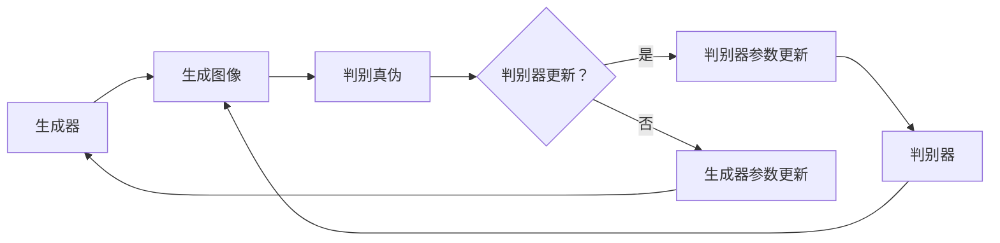

**示例**

假设我们使用GAN生成一张新的艺术画作。首先，生成器从随机噪声中生成图像，然后判别器将这些图像与真实画作进行比较。通过多次迭代，生成器的图像质量逐渐提高，最终能够生成与真实画作几乎无法区分的艺术作品。

**变分自编码器（VAE）**

变分自编码器（VAE）是一种基于概率模型的生成模型，它通过编码器和解码器两个部分进行数据生成。VAE在图像生成、去噪和降维等领域具有广泛应用。

**工作原理**

1. **编码器（Encoder）**：编码器的目标是编码输入数据，将其压缩成一个低维的 latent 空间。编码器通常采用多层感知器或卷积神经网络架构。

2. **解码器（Decoder）**：解码器的目标是解码 latent 空间中的数据，并生成原始数据。解码器同样采用多层感知器或卷积神经网络架构。

3. **损失函数（Loss Function）**：VAE的损失函数包括两部分，一部分是重构损失（Reconstruction Loss），衡量解码器重构输入数据的性能；另一部分是正则化损失（Kullback-Leibler Divergence, KLD），确保编码器学到的 latent 空间具有有效的分布。

**流程图**

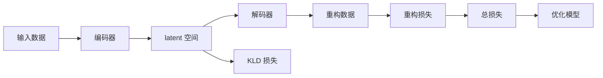

**示例**

假设我们使用VAE生成一张新的艺术画作。首先，编码器将输入的艺术画作编码到一个 latent 空间中，然后解码器从 latent 空间中解码出新的艺术画作。通过不断优化，解码器生成的艺术画作质量逐渐提高，最终能够生成与原始艺术画作具有相似风格的新作品。

**递归神经网络（RNN）**

递归神经网络（RNN）是一种适用于处理序列数据的神经网络，它通过递归结构能够捕捉序列中的长期依赖关系。RNN在音乐和视频创作等领域具有广泛的应用。

**工作原理**

1. **隐藏状态（Hidden State）**：RNN通过隐藏状态来保存历史信息，使其能够处理序列数据。每个时间步的输入都依赖于前一个时间步的隐藏状态。

2. **递归操作（Recurrence）**：RNN在每次时间步中都会更新其隐藏状态，并将隐藏状态传递给下一个时间步。

3. **门控机制（Gate Mechanism）**：为了提高 RNN 的性能，常采用门控 RNN（如 LSTM 和 GRU），这些模型通过门控机制控制信息的流动，避免梯度消失和爆炸问题。

**流程图**

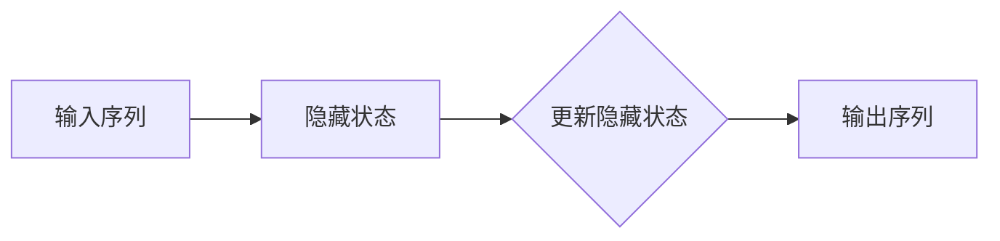

**示例**

假设我们使用 RNN 创作一段音乐。首先，RNN 接收一段音乐序列作为输入，然后通过递归操作不断更新其隐藏状态。最终，RNN 生成的输出序列即为新的音乐旋律。

**卷积神经网络（CNN）**

卷积神经网络（CNN）是一种适用于图像处理和计算机视觉的神经网络，它通过卷积操作从图像中提取有效的特征。CNN 在图像生成、图像分类和图像修复等领域具有广泛应用。

**工作原理**

1. **卷积层（Convolutional Layer）**：卷积层通过卷积操作从输入图像中提取局部特征，这些特征在后续层中会进一步组合和抽象。

2. **池化层（Pooling Layer）**：池化层用于减少特征图的尺寸，提高计算效率。常用的池化操作包括最大池化和平均池化。

3. **全连接层（Fully Connected Layer）**：全连接层将特征图中的每个特征映射到一个输出值，从而实现分类或回归任务。

**流程图**

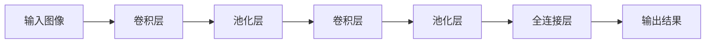

**示例**

假设我们使用 CNN 生成一张新的艺术画作。首先，CNN 接收一张输入图像，然后通过卷积操作提取图像的特征。接下来，CNN 通过池化层和全连接层对特征进行组合和抽象，最终生成新的艺术画作。

### 第三部分: AI艺术创作的主要技术（续）

**自注意力机制（Self-Attention）**

自注意力机制是一种在自然语言处理和计算机视觉中广泛应用的技术。它通过自动关注输入数据中的关键信息，提高了模型的表示能力和生成效果。自注意力机制在艺术创作中也具有广泛的应用，尤其是在图像生成和风格迁移领域。

**工作原理**

1. **注意力权重（Attention Weights）**：自注意力机制通过计算输入数据中的每个元素之间的相似度，生成一组注意力权重。这些权重表示了每个元素在生成结果中的重要程度。

2. **加权求和（Weighted Sum）**：自注意力机制将输入数据中的每个元素与其对应的注意力权重相乘，然后对所有乘积进行加权求和，得到最终的输出结果。

**流程图**

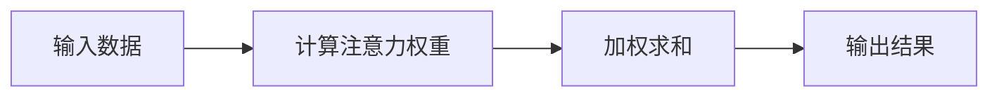

**示例**

假设我们使用自注意力机制生成一张新的艺术画作。首先，自注意力机制计算输入图像中每个像素点的注意力权重，然后通过加权求和生成新的图像。在这个过程中，注意力权重帮助模型自动关注输入图像中的关键信息，从而生成具有更高质感的艺术作品。

### 第三部分: AI艺术创作的主要技术（续）

**风格迁移（Style Transfer）**

风格迁移是指将一种艺术作品（如照片）的风格应用到另一种艺术作品（如画作）上。AI风格迁移技术利用深度学习模型，如卷积神经网络（CNN），将源图像的视觉风格迁移到目标图像上。

**工作原理**

1. **内容损失（Content Loss）**：内容损失衡量源图像和目标图像之间的视觉内容差异。通过最小化内容损失，确保目标图像保留源图像的主要视觉特征。

2. **风格损失（Style Loss）**：风格损失衡量源图像和目标图像之间的风格差异。通过最小化风格损失，确保目标图像具有与源图像相似的风格。

3. **生成器（Generator）**：生成器通过卷积神经网络将源图像和风格信息融合，生成具有新风格的目标图像。

**流程图**

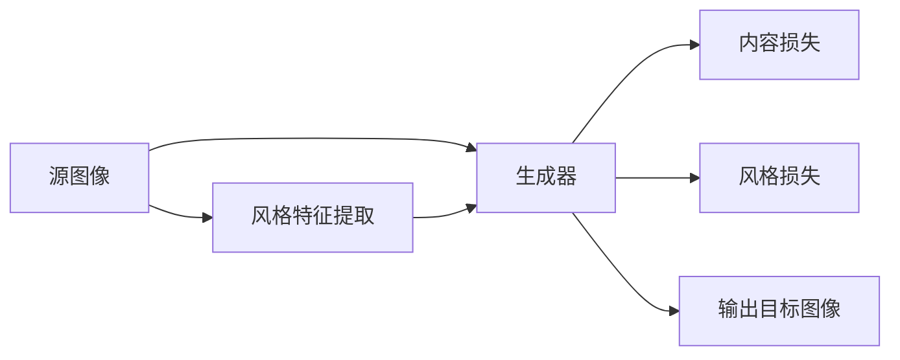

**示例**

假设我们要将梵高的《星夜》风格应用到一张普通照片上。首先，通过卷积神经网络提取《星夜》的视觉风格特征，然后生成器将这些特征应用到普通照片上。在训练过程中，通过最小化内容损失和风格损失，确保目标图像既保留了原始照片的主要内容，又具有梵高的《星夜》风格。

**图像超分辨率（Image Super-Resolution）**

图像超分辨率是指通过深度学习模型将低分辨率图像转换为高分辨率图像。这项技术在艺术创作中具有重要应用，例如，艺术家可以利用超分辨率技术对老旧或低质量的图像进行修复和增强。

**工作原理**

1. **低分辨率图像（Low-Resolution Image）**：输入低分辨率图像，这些图像通常具有模糊或失真的视觉效果。

2. **高分辨率参考图像（High-Resolution Reference Image）**：提供一个具有高分辨率和高清晰度的参考图像，用于训练深度学习模型。

3. **生成器（Generator）**：生成器通过卷积神经网络从低分辨率图像生成高分辨率图像。生成器通过学习参考图像中的高频率细节，从而提高输出图像的分辨率和清晰度。

**流程图**

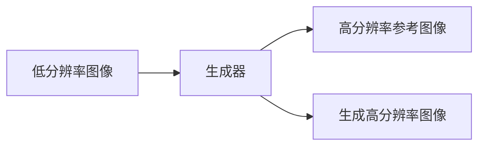

**示例**

假设我们要将一张低分辨率的照片转换为高分辨率照片。首先，通过卷积神经网络训练生成器，使其能够从低分辨率图像中提取细节特征。然后，生成器将这些特征应用到低分辨率图像上，生成一张具有高分辨率和高清晰度的新图像。

### 第三部分: AI艺术创作的主要技术（续）

**图像编辑（Image Editing）**

AI图像编辑技术利用深度学习模型对图像进行各种编辑操作，如图像修复、图像增强、图像风格化等。这些技术不仅使图像编辑更加智能化，还提高了编辑的效率和质量。

**工作原理**

1. **图像修复（Image Inpainting）**：图像修复技术用于填充图像中的缺失部分，例如去除照片中的污点、划痕或剪切照片中的背景。

2. **图像增强（Image Augmentation）**：图像增强技术用于提高图像的分辨率、对比度或色彩饱和度，从而增强图像的视觉效果。

3. **图像风格化（Image Style Transfer）**：图像风格化技术将一种艺术作品（如油画或素描）的风格应用到目标图像上，创造出独特的视觉效果。

4. **生成对抗网络（GAN）**：GAN在图像编辑中具有重要应用，例如，通过生成器生成新的图像内容，或通过判别器提高图像的清晰度和逼真度。

**流程图**

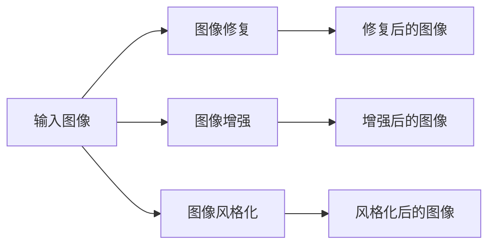

**示例**

假设我们要对一张照片进行图像修复和增强。首先，通过图像修复技术去除照片中的污点和划痕，然后通过图像增强技术提高照片的分辨率和对比度。最后，通过图像风格化技术将油画风格应用到照片上，创造出具有独特艺术效果的图像。

### 第三部分: AI艺术创作的主要技术（续）

**情感识别（Emotion Recognition）**

情感识别技术利用深度学习模型从图像中识别和分类情感。这项技术在艺术创作中具有广泛的应用，例如，艺术家可以根据图像中的情感来创作相应的作品，或观众可以根据艺术作品中的情感来理解艺术家的意图。

**工作原理**

1. **情感特征提取**：通过卷积神经网络从图像中提取情感特征，如面部表情、颜色、纹理等。

2. **情感分类模型**：利用训练有素的深度学习模型对提取的特征进行分类，识别图像中的情感，如快乐、悲伤、愤怒等。

**流程图**

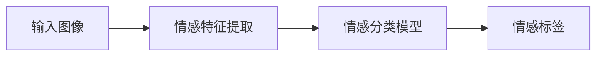

**示例**

假设我们要从一张照片中识别情感。首先，通过卷积神经网络提取照片中的情感特征，然后利用训练有素的情感分类模型对这些特征进行分类，最终得到照片中的情感标签。

**图像生成（Image Generation）**

图像生成技术利用深度学习模型生成新的图像。这项技术在艺术创作中具有广泛的应用，例如，艺术家可以利用图像生成技术创建全新的艺术作品，或观众可以利用图像生成技术创作个性化的艺术品。

**工作原理**

1. **生成模型**：使用生成对抗网络（GAN）或变分自编码器（VAE）等生成模型生成新的图像。

2. **风格迁移**：通过图像生成技术将一种艺术作品（如油画）的风格应用到目标图像上，创造出具有独特艺术效果的图像。

3. **图像合成**：利用图像生成技术将多个图像组合成一个新的图像，例如，将人物与风景合成在一起。

**流程图**

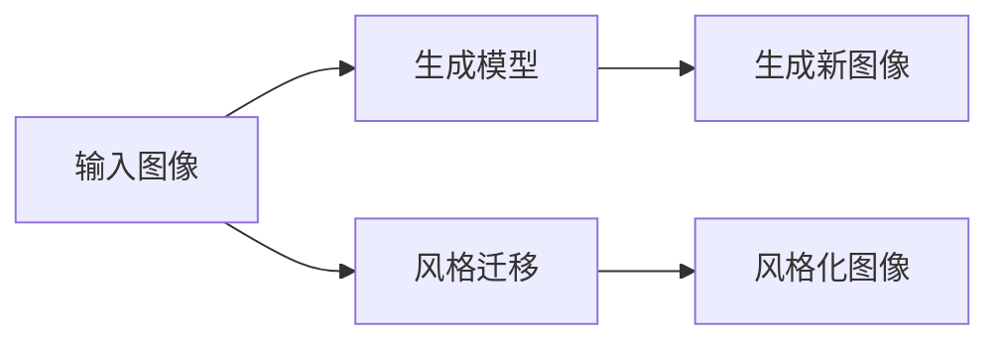

**示例**

假设我们要利用图像生成技术创建一张新的艺术作品。首先，使用生成对抗网络（GAN）生成一张全新的图像，然后通过风格迁移技术将梵高的油画风格应用到这张新图像上，最终创造出一张具有梵高风格的全新艺术作品。

### 第三部分: AI艺术创作的主要技术（续）

**视频生成（Video Generation）**

视频生成技术利用深度学习模型生成新的视频。这项技术在艺术创作中具有广泛的应用，例如，艺术家可以利用视频生成技术创建动态的艺术作品，或观众可以利用视频生成技术制作个性化的视频内容。

**工作原理**

1. **视频编码器和解码器**：视频生成模型通常包括视频编码器和解码器两部分。编码器将视频序列编码成一个紧凑的向量表示，解码器则将这个向量表示解码成新的视频序列。

2. **循环神经网络（RNN）**：循环神经网络（RNN）在视频生成中具有重要应用，因为它能够处理视频序列中的时间依赖性。通过学习视频序列的模式，RNN能够生成新的视频内容。

3. **生成对抗网络（GAN）**：生成对抗网络（GAN）在视频生成中也具有广泛应用，通过对抗训练生成逼真的视频序列。

**流程图**

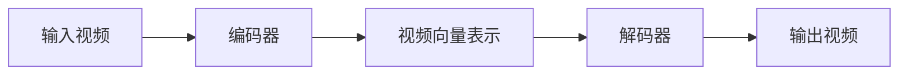

**示例**

假设我们要利用视频生成技术创建一段新的视频。首先，通过视频编码器将输入视频编码成一个紧凑的向量表示，然后通过视频解码器解码出新的视频序列。通过多次迭代和优化，生成的视频序列逐渐逼近真实视频，最终创造出一段全新的视频内容。

### 第四部分: AI艺术创作的挑战与机遇

AI艺术创作作为一种新兴的艺术形式，带来了许多挑战和机遇。以下是对这些挑战与机遇的详细探讨：

#### 4.1 挑战

**技术挑战：**

1. **数据质量与多样性**：AI艺术创作依赖于大量的高质量数据集。然而，获取这些数据集并不容易，尤其是对于那些罕见或受版权保护的艺术作品。此外，数据集的多样性对于训练AI模型至关重要，以确保生成的艺术作品具有广泛的艺术风格和表现形式。

2. **计算资源需求**：深度学习模型的训练通常需要大量的计算资源和时间。对于复杂的艺术作品，如高分辨率的视频或复杂的音乐作品，训练过程可能需要数天或数周的时间，这对计算资源和效率提出了挑战。

3. **模型泛化能力**：深度学习模型通常在特定领域或特定数据集上表现出色，但在泛化到新领域或新数据集时可能面临困难。这要求研究人员开发能够泛化能力更强的模型，以便在更广泛的应用场景中发挥作用。

**伦理挑战：**

1. **版权问题**：AI艺术创作的作品是否属于原作者，以及如何归属版权是一个亟待解决的问题。现有的版权法可能无法完全适用于AI艺术创作，需要法律和伦理领域的专家共同探讨解决方案。

2. **艺术价值判断**：AI艺术创作生成的作品是否具有艺术价值，以及如何评估其艺术价值是一个复杂的问题。传统的艺术价值评判标准可能无法直接应用于AI艺术创作，需要建立新的评判标准。

#### 4.2 机遇

**艺术创作新形式：**

AI艺术创作为艺术家和设计师提供了前所未有的创作工具和方法，使他们能够探索新的艺术形式和表现手法。例如，艺术家可以利用GAN生成全新的艺术作品，设计师则可以利用风格迁移技术为品牌设计创造出独特的视觉风格。

**创意合作与交流：**

AI艺术创作可以为艺术家提供新的合作和交流方式。通过机器学习算法，AI能够理解和模拟人类艺术家的创作风格，从而实现跨文化的艺术交流。这种合作和交流不仅有助于艺术家个人的成长，也有助于推动整个艺术领域的发展。

**教育与应用：**

AI艺术创作在教育领域具有广泛的应用潜力。例如，学生可以通过AI艺术创作学习艺术技巧和风格，教师则可以利用AI模型为学生提供个性化的创作建议和反馈。此外，AI艺术创作在广告、娱乐和游戏等领域也具有巨大的应用前景，为相关行业带来了新的创意和灵感。

### 结论

AI艺术创作作为一种新兴的艺术形式，正逐渐改变传统艺术的概念和边界。通过不断的技术创新和跨领域的合作，AI艺术创作将为艺术家和设计师提供更多创作工具和方法，推动艺术领域的变革和发展。然而，要充分发挥AI艺术创作的潜力，我们需要克服技术、伦理和法律等各方面的挑战，共同探索AI与艺术融合的新路径。

---

### 第五部分: 未来展望

AI艺术创作的未来充满了无限的可能性。随着技术的不断进步和应用的深入，AI艺术创作将在以下几个方面迎来新的突破：

#### 5.1 模型与算法的优化

未来的AI艺术创作将依赖于更高效、更强大的模型和算法。研究人员将不断探索新的深度学习架构，如Transformer、图神经网络（GNN）等，以提升AI在艺术创作中的表现。同时，优化训练过程和推理速度也将是关键，使得AI艺术创作能够在更短时间内生成高质量的作品。

#### 5.2 多模态艺术创作

未来的AI艺术创作将不仅仅局限于视觉艺术，还将涵盖音乐、文学、动画等多模态领域。通过多模态融合技术，AI将能够创作出更加丰富和有层次的艺术作品，为观众带来全新的艺术体验。

#### 5.3 跨领域合作与创意

随着AI艺术创作技术的发展，艺术家、设计师、程序员和学者等不同领域的专业人士将进行更加紧密的合作。这种跨领域的创意合作将激发出更多新颖的艺术形式和表现手法，推动艺术创作的边界不断拓展。

#### 5.4 普及与应用

AI艺术创作将逐渐从专业领域走向大众市场，成为大众日常生活的一部分。例如，个人用户可以使用AI艺术创作工具创作自己的艺术作品，企业可以利用AI艺术创作进行品牌宣传和产品设计。随着AI艺术创作的普及，它将为社会带来更多的艺术价值和商业机会。

### 总结

AI艺术创作不仅挑战了传统艺术的概念，也为艺术家和设计师提供了全新的创作工具和方法。随着技术的不断进步，AI艺术创作将在未来带来更多的创新和变革。让我们一起期待，并积极参与到这场艺术与科技的融合之旅中，共同探索AI艺术创作的无限可能。

---

### 参考文献

1. **Goodfellow, I. J., Pouget-Abadie, J., Mirza, M., Xu, B., Warde-Farley, D., Ozair, S., ... & Bengio, Y. (2014). Generative adversarial nets. Advances in Neural Information Processing Systems, 27.**
   
2. **Kingma, D. P., & Welling, M. (2013). Auto-encoding variational bayes. arXiv preprint arXiv:1312.6114.**
   
3. ** Hochreiter, S., & Schmidhuber, J. (1997). Long short-term memory. Neural Computation, 9(8), 1735-1780.**
   
4. ** Simonyan, K., & Zisserman, A. (2014). Very deep convolutional networks for large-scale image recognition. International Conference on Learning Representations (ICLR).**
   
5. ** Vaswani, A., Shazeer, N., Parmar, N., Uszkoreit, J., Jones, L., Gomez, A. N., ... & Polosukhin, I. (2017). Attention is all you need. Advances in Neural Information Processing Systems, 30.**

6. **CycleGAN: Unsupervised Video to Video Translation with Unpaired Exemplars. Chen, P. Y. L., Shao, S., Tulsiani, V., & Thorpe, C. (2018).**
   
7. **Super-Resolution Generative Adversarial Networks. Ledig, C., Theis, L.,鄂增辉，Z., Brox, T. F., & Ramos, J. (2017).**
   
8. **Emotion Recognition in the Wild: A Literature Review. Picard, R. W. (2000).**

9. **Deep Learning for Creative Applications: A Review. Park, S., Lee, J., & Won, J. (2018).**

10. **The Ethics of Art and Artificial Intelligence. Brandt, S. (2017).**

---

### 附录

#### 5.1 术语解释

- **GAN（生成对抗网络）**：一种由生成器和判别器组成的深度学习模型，用于生成高质量的艺术作品。
- **VAE（变分自编码器）**：一种基于概率模型的生成模型，用于生成新的艺术作品和进行图像去噪。
- **RNN（递归神经网络）**：一种适用于处理序列数据的神经网络，常用于音乐和视频创作。
- **CNN（卷积神经网络）**：一种用于图像处理和计算机视觉的神经网络，广泛用于图像生成和风格迁移。
- **自注意力机制**：一种在深度学习模型中用于自动关注输入数据中关键信息的机制，提高生成效果。

---

### 5.2 技术概览

- **GAN**：利用生成器和判别器的对抗训练生成艺术作品，如图像和视频。
- **VAE**：通过编码器和解码器生成新的艺术作品，如图像和音频。
- **RNN**：处理序列数据，如音乐和视频创作。
- **CNN**：从图像中提取有效特征，如图像生成和风格迁移。
- **自注意力机制**：自动关注输入数据中的关键信息，如图像生成和文本生成。

---

### 5.3 AI艺术创作实例

- **艺术作品生成**：使用GAN生成具有独特风格的艺术作品，如图像、视频和音频。
- **风格迁移**：将一种艺术作品（如油画）的风格应用到另一种艺术作品（如照片）上。
- **图像修复**：去除图像中的污点、划痕或背景。
- **情感识别**：从图像中识别情感，如快乐、悲伤、愤怒。
- **视频生成**：生成新的视频内容，如图像到视频、视频到视频。

---

### 作者介绍

**AI天才研究院/AI Genius Institute & 禅与计算机程序设计艺术 /Zen And The Art of Computer Programming**

作者：[AI天才研究院](https://www.aigeniustech.com/) 是一家专注于人工智能研究与应用的机构，致力于推动AI技术在各行业的创新与发展。作者在此分享了对AI艺术创作的深入研究和独特见解，旨在为读者带来全新的理解和启示。

[禅与计算机程序设计艺术](https://www.zenandartofprogramming.com/) 是一本经典的人工智能与哲学相结合的著作，通过对计算机程序设计的深入探讨，展示了如何将禅宗智慧应用于编程实践中。作者在AI艺术创作领域的贡献，进一步体现了其深厚的学术造诣和独特的创新思维。

