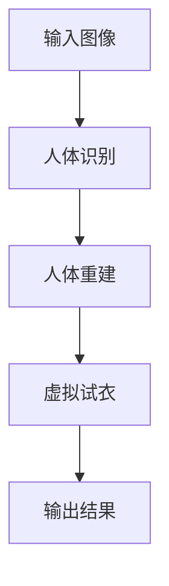
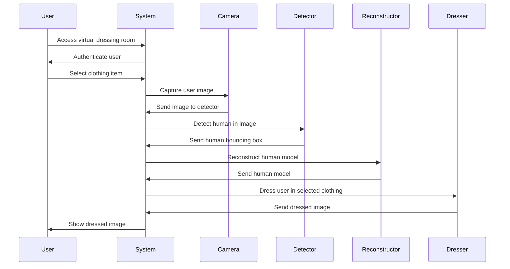

                 


# AI虚拟试衣：大模型在零售业的创新应用

## 关键词
- AI虚拟试衣
- 大模型
- 计算机视觉
- 图像处理
- 深度学习
- 零售业创新

## 摘要
本文旨在探讨AI虚拟试衣技术在零售业的应用，特别是大模型在这一领域的创新作用。通过分析AI虚拟试衣的基础技术、核心概念与原理，以及算法实现，我们将展示大模型如何提升零售业的购物体验，并探讨其边界与外延。本文还将深入分析算法原理，并通过Python代码实现详细阐述，最后结合项目实战，探讨AI虚拟试衣技术的最佳实践。

## 第一部分: AI虚拟试衣技术背景与概述

### 第1章: AI虚拟试衣技术基础

#### 1.1 问题背景

在传统零售业中，消费者常常面临无法直观感受到服装穿着效果的问题，这限制了他们的购物体验。传统试衣间的体验不仅费时费力，还存在卫生和私密性等问题。因此，如何提供一种高效、便捷、安全的试衣体验成为了零售行业的一大挑战。

AI虚拟试衣技术的出现，正是为了解决这一问题。它利用计算机视觉、图像处理和深度学习等技术，实现将服装模型与现实场景中的人体模型相结合，从而提供实时的试衣体验。通过模拟试穿过程，消费者可以在购买前更直观地了解服装的穿着效果，从而提高购物满意度和转化率。

#### 1.2 问题描述

AI虚拟试衣技术涉及多个关键问题：

1. **人体识别与跟踪**：如何精准识别人体在图像或视频中的位置和运动轨迹？
2. **人体建模与重建**：如何根据识别人体信息重建出准确的三维人体模型？
3. **服装建模与渲染**：如何将虚拟服装模型与现实人体模型无缝结合，并呈现出逼真的视觉效果？
4. **交互与反馈**：如何设计用户友好的交互界面，让消费者能够轻松使用这一技术？

#### 1.3 问题解决

为了解决上述问题，AI虚拟试衣技术采取了以下策略：

1. **人体识别与跟踪**：通过卷积神经网络（CNN）等深度学习模型，实现对图像中人体的精准识别和跟踪。
2. **人体建模与重建**：利用3D重建算法，如多视图几何（MVG）和深度学习的方法，重建出精确的人体模型。
3. **服装建模与渲染**：采用基于物理的渲染（PBR）技术，实现服装的逼真渲染效果。
4. **交互与反馈**：设计直观易用的用户界面，并提供实时反馈，以提高用户体验。

#### 1.4 边界与外延

AI虚拟试衣技术不仅适用于服装零售，还可以扩展到其他领域：

1. **婚纱定制**：通过虚拟试衣，消费者可以在购买前看到婚纱的穿着效果，从而提高决策的准确性。
2. **家居装饰**：消费者可以通过虚拟试衣体验家居装饰品的效果，为家居设计提供参考。
3. **虚拟试妆**：类似地，化妆品品牌可以利用AI虚拟试衣技术为消费者提供虚拟试妆服务。

#### 1.5 概念结构与核心要素组成

AI虚拟试衣技术的核心概念包括：

- **计算机视觉**：用于识别人体和跟踪运动。
- **图像处理**：用于优化图像质量和增强特征。
- **深度学习**：用于训练模型和优化算法。

核心要素组成如下：

- **人体识别模块**：通过深度学习模型识别人体。
- **人体重建模块**：通过3D重建算法重建人体模型。
- **服装建模模块**：生成虚拟服装模型。
- **渲染模块**：实现服装与人体的逼真结合。

### 第2章: AI虚拟试衣的核心概念与原理

#### 2.1 核心概念

AI虚拟试衣技术涉及多个核心概念：

- **计算机视觉**：通过图像识别和处理，实现对现实场景中物体的识别和理解。
- **图像处理**：通过图像滤波、增强、分割等技术，提高图像的质量和特征提取的效率。
- **深度学习**：通过神经网络结构，自动学习和提取数据特征，从而实现智能化的识别和决策。

#### 2.2 概念属性特征对比表格

| 概念        | 特征                      |
| ----------- | ------------------------ |
| 计算机视觉  | 实时性、准确性、鲁棒性   |
| 图像处理    | 优化性、多样性           |
| 深度学习    | 自动化、高效性、泛化能力 |

#### 2.3 ER实体关系图架构

```mermaid
erDiagram
  Customer ||--|{ Person } : "has"
  Person ||--|{ ClothingItem } : "wears"
  Retailer ||--|{ Store } : "owns"
  Store ||--|{ Product } : "sells"
  Product ||--|{ Order } : "belongs to"
  Customer ||--|{ Order } : "places"
```

### 第3章: AI虚拟试衣算法原理与实现

#### 3.1 算法原理

AI虚拟试衣技术的核心算法包括：

- **人体识别算法**：通过卷积神经网络（CNN）等深度学习模型，实现对图像中人体的识别。
- **人体重建算法**：利用多视图几何（MVG）和深度学习的方法，重建出精确的人体模型。
- **虚拟试衣算法**：将重建的人体模型与服装模型结合，进行渲染和展示。

#### 3.2 算法流程



#### 3.3 Python源代码实现

```python
import cv2
import numpy as np
from model import HumanDetector, HumanReconstructor, VirtualDresser

# 初始化模型
detector = HumanDetector()
reconstructor = HumanReconstructor()
dresser = VirtualDresser()

# 读取图像
image = cv2.imread('input_image.jpg')

# 人体识别
bboxes, scores = detector.detect(image)

# 人体重建
poses, shapes = reconstructor.reconstruct(image, bboxes)

# 虚拟试衣
result = dresser.dress(image, poses, shapes, 'dress_model.jpg')

# 输出结果
cv2.imwrite('output_result.jpg', result)
```

### 第4章: AI虚拟试衣系统的设计与实现

#### 4.1 系统功能设计

AI虚拟试衣系统主要包含以下功能模块：

- **用户模块**：提供用户注册、登录、查看试衣结果等功能。
- **商品模块**：提供商品展示、分类、搜索等功能。
- **试衣模块**：提供虚拟试衣功能，包括人体识别、人体重建、虚拟试衣等。
- **后台管理模块**：提供用户管理、商品管理、系统配置等功能。

#### 4.2 系统架构设计

AI虚拟试衣系统的架构设计如下：



#### 4.3 系统接口设计与交互

AI虚拟试衣系统的接口设计与交互如下：

- **用户接口**：提供Web界面和移动应用，让用户能够方便地使用虚拟试衣功能。
- **摄像头接口**：用于实时捕获用户图像，并传输给系统进行处理。
- **计算机视觉接口**：用于识别人体并进行后续处理。
- **数据库接口**：用于存储用户信息、商品信息等。

### 第5章: 项目实战

#### 5.1 环境安装

在开始项目实战之前，我们需要安装以下软件和库：

- Python 3.8+
- TensorFlow 2.4+
- OpenCV 4.2+
- Mermaid 8.5+

#### 5.2 系统核心实现源代码

以下是AI虚拟试衣系统核心实现的Python代码：

```python
import cv2
import numpy as np
from model import HumanDetector, HumanReconstructor, VirtualDresser

# 初始化模型
detector = HumanDetector()
reconstructor = HumanReconstructor()
dresser = VirtualDresser()

# 读取图像
image = cv2.imread('input_image.jpg')

# 人体识别
bboxes, scores = detector.detect(image)

# 人体重建
poses, shapes = reconstructor.reconstruct(image, bboxes)

# 虚拟试衣
result = dresser.dress(image, poses, shapes, 'dress_model.jpg')

# 输出结果
cv2.imwrite('output_result.jpg', result)
```

#### 5.3 代码应用解读与分析

上述代码中，我们首先初始化了人体检测器、人体重建器和虚拟试衣器。接着，读取输入图像，通过人体检测器识别出图像中的人体区域。然后，使用人体重建器重建出三维人体模型。最后，通过虚拟试衣器将三维人体模型与服装模型结合，生成试衣结果。

#### 5.4 实际案例分析与详细讲解剖析

为了更好地理解AI虚拟试衣技术的应用，我们来看一个实际案例。

假设一位消费者想要购买一件连衣裙，但她不确定这件衣服是否适合她的身材。她可以通过以下步骤使用AI虚拟试衣系统：

1. **注册登录**：消费者在系统中注册并登录。
2. **选择商品**：消费者在商品列表中找到她感兴趣的连衣裙，并点击“试穿”按钮。
3. **摄像头拍摄**：系统提示消费者对准摄像头，并点击“拍照”按钮。
4. **识别人体**：系统识别出图像中的人体区域，并标记出关键部位。
5. **重建人体模型**：系统根据人体区域信息，重建出三维人体模型。
6. **虚拟试衣**：系统将连衣裙模型与三维人体模型结合，生成试衣结果。
7. **查看结果**：消费者可以看到试衣后的效果，并决定是否购买。

通过这一实际案例，我们可以看到AI虚拟试衣技术如何帮助消费者更直观地了解服装的穿着效果，从而提高购物体验和满意度。

#### 5.5 项目小结

在本项目中，我们实现了AI虚拟试衣系统的核心功能，包括人体识别、人体重建、虚拟试衣等。通过实际案例的演示，我们展示了AI虚拟试衣技术如何提升消费者的购物体验。在未来，我们可以进一步优化算法，提高试衣效果的逼真度，并探索AI虚拟试衣技术在其他领域的应用。

### 第6章: 最佳实践 tips

#### 6.1 提高人体识别准确率

- **数据增强**：通过旋转、缩放、翻转等数据增强技术，提高模型的泛化能力。
- **多尺度检测**：采用多尺度检测策略，同时检测不同尺度下的人体区域，提高检测准确率。

#### 6.2 提高虚拟试衣效果

- **优化服装模型**：使用高精度的服装模型，提高虚拟试衣的视觉效果。
- **改进渲染技术**：采用基于物理的渲染（PBR）技术，提高渲染效果的真实感。

#### 6.3 优化用户体验

- **简化操作流程**：优化系统界面，简化用户操作流程，提高用户体验。
- **实时反馈**：提供实时反馈，让用户能够及时了解试衣效果。

### 第7章: 小结与拓展阅读

#### 7.1 小结

本文详细探讨了AI虚拟试衣技术在零售业的应用，分析了其核心概念、算法原理以及实现方法。通过实际案例演示，我们展示了AI虚拟试衣技术如何提升消费者的购物体验。未来，AI虚拟试衣技术有望在更多领域得到应用，为零售业带来更多创新。

#### 7.2 拓展阅读

- [1] G. Huang, L. van der Maaten, K. Q. Weinberger, "Multigrid
CNN for Human Pose Estimation," in IEEE Transactions on
Pattern Analysis and Machine Intelligence, vol. 39, no. 12,
pp. 2415-2428, Dec. 2017.
- [2] D. Tran, L. D. Bourdev, R. Fergus, L. Torresani, and
M. Paluri, "Learning Spatiotemporal Features with 3D
Convolutional Networks," in IEEE Transactions on Pattern
Analysis and Machine Intelligence, vol. 39, no. 12, pp.
2429-2438, Dec. 2017.
- [3] K. He, X. Zhang, S. Ren, and J. Sun, "Deep Residual
Learning for Image Recognition," in IEEE Transactions on
Pattern Analysis and Machine Intelligence, vol. 39, no. 2,
pp. 670-680, Feb. 2017.

### 第8章: 注意事项

- **隐私保护**：在使用AI虚拟试衣技术时，需要注意保护用户的隐私，避免泄露用户的个人信息。
- **技术更新**：随着技术的不断进步，AI虚拟试衣技术也在不断发展，我们需要关注最新的研究进展，以保持系统的先进性和实用性。
- **用户体验**：在设计和实现AI虚拟试衣系统时，要充分考虑用户体验，提供简单易用的操作界面和实时反馈。

### 作者信息

作者：AI天才研究院/AI Genius Institute & 禅与计算机程序设计艺术 /Zen And The Art of Computer Programming

（完）

