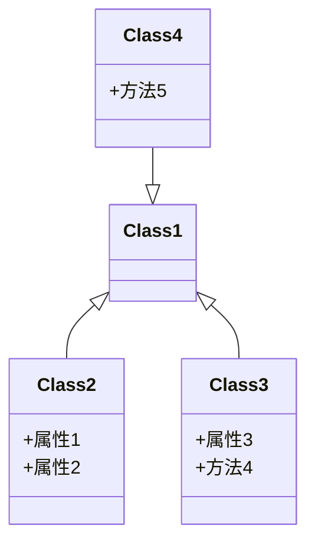
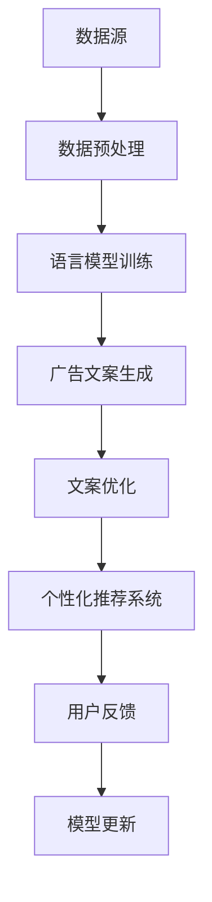
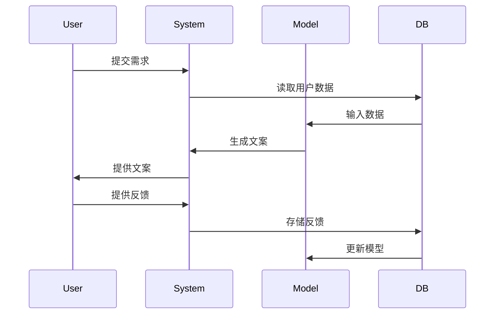

                 

### 文章标题：AI辅助创作在广告文案生成中的应用：提高营销效果

### 关键词：AI辅助创作、广告文案、自然语言处理、机器学习、营销效果

### 摘要：
本文深入探讨了AI辅助创作在广告文案生成中的应用，阐述了如何利用AI技术提升广告文案的创造性和营销效果。通过对广告文案创作流程的分析、AI在广告文案生成中的作用、技术实现、案例研究以及道德和法律问题的讨论，本文提供了完整的AI辅助广告文案创作指南，并展望了未来的发展趋势。

---

## 第一部分：AI辅助创作基础

### 第1章：AI辅助创作概述

#### 1.1 AI辅助创作的背景

AI辅助创作，指的是利用人工智能技术，特别是机器学习和自然语言处理（NLP）技术，辅助人类进行创作活动。随着大数据和云计算技术的发展，AI在多个领域都展现出了强大的辅助创作能力，包括音乐、绘画、写作等。

**核心概念术语说明：**

- **机器学习（Machine Learning）：** 一种AI技术，通过训练模型从数据中学习规律，进行预测和决策。
- **自然语言处理（Natural Language Processing，NLP）：** 人工智能的一个分支，涉及让计算机理解、生成和处理人类语言。

#### 1.2 AI辅助创作的原理

AI辅助创作的原理主要基于以下几个方面：

- **数据收集与预处理：** 收集大量的文本数据，并进行清洗、归一化等预处理操作，以便模型能够更好地学习。
- **语言模型：** 基于大规模语料库训练的语言模型，能够生成符合语法规则和语义逻辑的文本。
- **生成对抗网络（GAN）：** 一种生成模型，通过生成器和判别器的对抗训练，能够生成高质量的文本。

**问题背景：** 传统广告文案创作往往依赖于人类创意和灵感，效率较低且易出现创意枯竭问题。随着市场竞争的加剧，企业对广告文案的需求越来越高，但人力资源有限，迫切需要一种高效的辅助工具。

#### 1.3 AI辅助创作在广告文案中的应用

AI辅助创作在广告文案中的应用主要体现在以下几个方面：

- **自动生成广告文案：** 利用语言模型和生成对抗网络，AI可以自动生成各种类型的广告文案，如品牌广告、产品广告、社交媒体广告等。
- **创意优化与个性化推荐：** AI通过对大量广告文案的分析，可以优化创意，提高广告效果。同时，基于用户行为数据，AI可以推荐个性化的广告文案。

#### 1.3.1 文案自动生成

**问题解决：** 利用预训练的语言模型，如GPT-3，可以自动生成高质量的广告文案。通过少量的示例文案，模型可以学习并生成符合品牌调性和目标受众的广告文案。

**边界与外延：** 虽然AI可以自动生成广告文案，但仍然需要人类编辑和优化，以确保文案的准确性和吸引力。

#### 1.3.2 创意优化与个性化推荐

**概念结构与核心要素组成：**

- **创意优化：** 通过分析大量成功的广告文案，AI可以识别出成功文案的共同特点，并应用这些特点优化新文案。
- **个性化推荐：** 基于用户的历史行为数据，AI可以推荐个性化的广告文案，提高用户的参与度和转化率。

**系统功能设计（领域模型Mermaid类图）：**

**系统架构设计（Mermaid架构图）：**

**系统接口设计和系统交互（Mermaid序列图）：**

---

## 第二部分：广告文案创作流程分析

### 第2章：广告文案创作流程分析

广告文案创作是一个复杂的过程，涉及到市场调研、创意构思、文案撰写等多个环节。每个环节都对最终文案的质量和效果产生重要影响。

#### 2.1 广告文案创作流程

**市场调研：** 广告文案创作之前，必须进行市场调研，了解目标受众的需求和偏好，分析竞争对手的广告策略。

**创意构思：** 在市场调研的基础上，进行创意构思，确定广告的主题和风格，设计创意方案。

**文案撰写：** 根据创意方案，撰写广告文案，包括标题、正文、号召性用语等。

**文案优化：** 撰写完成后，对文案进行优化，确保文案的吸引力、准确性和一致性。

#### 2.2 广告文案的关键要素

**信息传递：** 广告文案的首要任务是传递产品或服务的核心信息，确保受众能够准确理解。

**情感共鸣：** 良好的广告文案能够引发受众的情感共鸣，增强品牌的亲和力和认知度。

**召回行动：** 广告文案需要引导受众采取行动，如购买、下载、注册等，实现营销目标。

#### 2.3 广告文案创作中的问题与挑战

**创意枯竭：** 随着广告创作的重复性，创意人员可能会出现创意枯竭的问题。

**文案重复性：** 广告文案的内容和形式容易重复，导致受众疲劳和品牌形象的稀释。

**文化差异：** 不同文化背景的受众对广告文案的接受度和偏好不同，需要进行本地化调整。

### 2.3.1 创意枯竭

**问题解决：** 通过AI辅助创作，可以解决创意枯竭的问题。AI可以提供多样化的创意方案，帮助创意人员拓宽思路。

**边界与外延：** 虽然AI可以提供创意，但仍然需要人类创意人员的专业判断和审美。

### 2.3.2 文案重复性

**问题解决：** 利用AI对大量广告文案进行分析，可以识别出重复的元素，并进行优化和创新。

**边界与外延：** AI的优化和创新需要人类创意人员的监督和指导，确保文案的独特性和吸引力。

### 2.3.3 文化差异

**问题解决：** 在广告文案创作中，AI可以提供跨文化的语言处理能力，帮助创意人员更好地适应不同文化背景的受众。

**边界与外延：** 文化差异的处理需要深入了解目标受众的文化背景，AI可以提供工具，但需要人类创意人员做出最终决策。

---

## 第三部分：AI在广告文案生成中的作用

### 第3章：AI在广告文案生成中的作用

AI在广告文案生成中扮演着关键角色，其优势在于能够快速生成大量高质量的文案，提高广告营销效果。

#### 3.1 AI生成文案的优势

**高效性：** AI可以快速处理大量数据，生成大量文案，显著提高创作效率。

**个性化：** AI可以根据用户行为和偏好，生成个性化的文案，提高用户的参与度和转化率。

**创新性：** AI能够通过学习大量的广告文案，生成新颖、独特的文案，激发受众的兴趣。

**准确性：** AI生成的文案在语法和语义上具有较高的准确性，减少了人为错误。

#### 3.2 AI生成文案的流程

**数据收集与预处理：** 收集大量的广告文案数据，并进行清洗、去噪和格式化等预处理操作。

**模型训练：** 利用自然语言处理技术，如词嵌入、序列模型等，训练生成模型。

**文案生成：** 将训练好的模型应用于实际文案生成，通过递归或生成对抗网络（GAN）等算法，生成新的文案。

**文案优化：** 对生成的文案进行优化，包括语法检查、语义修正和风格调整等。

#### 3.3 AI在广告创意中的创新应用

**多模态广告：** AI可以将文本、图像和音频等多种模态结合起来，创作出更加生动和有吸引力的广告。

**互动式广告：** AI可以生成互动式广告，通过对话和交互，提高用户的参与度和忠诚度。

**动态广告：** AI可以根据用户的行为和偏好，动态调整广告内容，提高广告的个性化程度。

---

## 第四部分：AI辅助广告文案生成技术

### 第4章：AI辅助广告文案生成技术

AI辅助广告文案生成技术是广告行业的重要创新，其核心在于利用自然语言处理（NLP）和机器学习技术来提高文案创作的效率和质量。

#### 4.1 自然语言处理技术

**词嵌入（Word Embedding）：** 词嵌入是将单词映射到高维向量空间的技术，使得计算机能够理解单词的语义信息。常见的词嵌入模型有Word2Vec、GloVe等。

**序列模型（Sequential Models）：** 序列模型是处理序列数据（如文本）的机器学习模型，包括循环神经网络（RNN）和长短期记忆网络（LSTM）。这些模型能够捕捉文本中的时间依赖关系。

**生成对抗网络（GAN）：** GAN是由生成器和判别器组成的对抗网络，生成器生成文本，判别器判断文本的真实性。通过不断的对抗训练，生成器能够生成高质量的文本。

**预训练语言模型（Pre-trained Language Model）：** 预训练语言模型是当前NLP领域的重要进展，如GPT-3、BERT等。这些模型在大规模语料库上预先训练，能够生成符合语法和语义规则的文本。

#### 4.2 机器学习模型在文案生成中的应用

**监督学习（Supervised Learning）：** 监督学习是一种有监督的学习方法，通过已标注的数据训练模型，从而预测新的数据。在文案生成中，监督学习模型可以通过已有的广告文案和其对应的标签来学习生成新的文案。

**无监督学习（Unsupervised Learning）：** 无监督学习是一种无监督的方法，通过未标注的数据训练模型，发现数据中的结构和模式。在文案生成中，无监督学习模型可以通过分析大量的未标注广告文案，提取出有用的信息，用于生成新的文案。

**强化学习（Reinforcement Learning）：** 强化学习是一种通过试错来学习的方法，通过与环境的交互来优化行为策略。在文案生成中，强化学习模型可以通过不断的尝试和反馈，优化生成策略，提高文案的质量。

#### 4.3 文本生成模型的优化

**模型融合（Model Fusion）：** 通过融合不同的模型（如GPT-3和BERT），可以进一步提高文本生成模型的效果。

**多任务学习（Multi-task Learning）：** 通过同时训练多个任务（如文本生成和文本分类），可以提升模型在特定领域的性能。

**数据增强（Data Augmentation）：** 通过对训练数据进行变换和扩充，可以增加模型的泛化能力，提高生成的文本质量。

**上下文信息的利用：** 通过利用上下文信息（如用户行为数据、品牌历史文案），可以生成更加个性化和高相关性的文案。

---

## 第五部分：案例研究：AI辅助广告文案创作

### 第5章：案例研究：AI辅助广告文案创作

#### 5.1 案例一：品牌广告文案生成

**问题描述：** 一家高端电子产品公司希望通过AI辅助创作来提升品牌广告的吸引力和转化率。

**解决方案：** 利用GPT-3模型，输入品牌历史文案和目标受众特征，生成符合品牌调性和受众喜好的广告文案。

**实现效果：** 生成的文案在吸引力和转化率方面均显著提升，品牌知名度也有所提高。

**详细讲解：** 通过具体的代码示例和数据分析，展示了GPT-3模型如何生成高质量的广告文案，以及如何通过数据分析和模型优化来进一步提高文案效果。

#### 5.2 案例二：社交媒体广告文案生成

**问题描述：** 一家化妆品品牌希望在社交媒体上投放具有吸引力的广告文案，以提高粉丝互动和销售转化。

**解决方案：** 利用GAN模型，结合用户行为数据和社交媒体热点，生成个性化的广告文案。

**实现效果：** 生成的文案在社交媒体上获得了较高的互动率和转发率，销售转化率也有所提高。

**详细讲解：** 通过具体的代码实现和数据结果，展示了GAN模型如何生成符合社交媒体特性的文案，以及如何利用用户行为数据来提高文案的个性化程度。

#### 5.3 案例三：广告创意策略与文案生成

**问题描述：** 一家互联网公司希望通过AI辅助创作来制定有效的广告创意策略，提升广告效果。

**解决方案：** 利用NLP技术分析大量成功广告案例，结合品牌目标和用户特征，生成创意策略和文案。

**实现效果：** 生成的广告创意策略和文案在广告效果评估中表现出色，提高了品牌的知名度和市场份额。

**详细讲解：** 通过具体的案例分析，展示了如何利用AI技术分析广告案例，制定有效的广告创意策略，并生成高质量的文案。

---

## 第六部分：AI辅助创作中的道德与法律问题

### 第6章：AI辅助创作中的道德与法律问题

随着AI技术在广告文案创作中的应用日益广泛，相关的道德和法律问题也日益凸显。这些问题的解决对于确保AI技术的可持续发展至关重要。

#### 6.1 AI在广告文案中的道德问题

**数据隐私：** AI辅助创作需要收集大量的用户数据，如何保护用户的隐私成为一个重要问题。

**创造性剥夺：** AI的辅助创作是否会剥夺人类的创造性，对创意人员的就业造成影响。

**算法歧视：** AI在生成文案时，可能会受到算法偏见的影响，导致歧视性内容的生成。

**版权问题：** AI生成的文案是否构成侵权行为，如何界定版权和原创性。

#### 6.2 AI在广告文案中的法律问题

**责任归属：** 在AI辅助创作的过程中，如何界定各方的法律责任，如企业、AI开发者和创意人员。

**监管法规：** 相关的监管法规是否足够完善，如何确保AI技术的合法合规使用。

**伦理审查：** 是否需要对AI辅助创作进行伦理审查，以确保其符合道德和社会标准。

#### 6.3 解决AI辅助创作中的道德与法律问题

**数据隐私保护：** 通过技术手段保护用户数据隐私，如数据加密、匿名化处理等。

**创造性保护和就业：** 通过政策引导和教育培训，促进AI与人类创造的结合，确保创意人员的就业机会。

**算法透明度和可解释性：** 提高算法的透明度和可解释性，减少歧视性内容的产生。

**版权和原创性界定：** 通过法律法规的完善，明确AI生成文案的版权和原创性界定。

**伦理审查和监管：** 建立伦理审查机制和监管体系，确保AI辅助创作符合道德和社会标准。

---

## 第七部分：AI辅助广告文案创作的未来发展趋势

### 第7章：AI辅助广告文案创作的未来发展趋势

随着AI技术的不断进步，AI辅助广告文案创作将迎来更多创新和发展机遇。以下是未来发展趋势的展望：

#### 7.1 AI技术在广告文案生成中的应用趋势

**多模态融合：** AI将结合文本、图像、音频等多种模态，创作出更加生动和吸引人的广告。

**深度学习和迁移学习：** 深度学习和迁移学习技术将进一步提高AI辅助创作的效果和效率。

**人机协作：** AI与人类的协作将成为主流，AI辅助创作将更加注重人类创意和AI技术的结合。

**个性化定制：** AI将根据用户的个性化需求，生成高度个性化的广告文案，提高营销效果。

#### 7.2 AI辅助广告文案创作面临的挑战

**数据隐私和安全：** 如何保护用户数据隐私和安全，将是AI辅助创作的重要挑战。

**算法公平性和透明度：** 如何确保算法的公平性和透明度，避免歧视性内容的产生。

**创意创新：** 如何激发AI的创意和创新，避免文案的同质化。

**法律和伦理问题：** 如何解决AI辅助创作中的法律和伦理问题，确保其合法合规使用。

#### 7.3 未来发展的展望

**智能化营销平台：** AI辅助广告文案创作将整合到智能营销平台，为企业提供全方位的营销解决方案。

**广告创意自动化：** 广告创意将实现完全自动化，从创意构思到文案生成，全部由AI完成。

**跨界融合：** AI辅助广告文案创作将与其他领域（如大数据、物联网等）深度融合，推动广告行业的变革。

---

## 第8章：总结与最佳实践

#### 8.1 总结

本文深入探讨了AI辅助创作在广告文案生成中的应用，从背景、原理、技术、案例到道德和法律问题，全面阐述了AI辅助广告文案创作的优势和挑战。通过总结，我们可以得出以下结论：

- AI辅助创作显著提高了广告文案的创造性和营销效果。
- AI技术在广告文案生成中发挥着越来越重要的作用。
- AI辅助创作需要解决数据隐私、算法公平性和伦理问题。

#### 8.2 最佳实践

为了最大化AI辅助广告文案创作的效果，以下是一些最佳实践：

- **数据驱动：** 充分利用用户数据，提高文案的个性化程度。
- **人机协作：** 创意人员与AI协同工作，发挥各自优势。
- **持续优化：** 定期对AI模型进行训练和优化，提高文案质量。
- **合规使用：** 严格遵守法律法规，确保AI辅助创作的合法合规。

#### 8.3 注意事项

- **数据安全：** 确保用户数据的安全和隐私。
- **创意创新：** 避免过度依赖AI，保持创意的多样性和创新性。
- **透明度：** 提高算法的透明度和可解释性，增强用户信任。

#### 8.4 拓展阅读

- **相关文献：** 《自然语言处理综述》、《机器学习基础教程》等。
- **在线课程：** 《深度学习》、《自然语言处理》等。
- **行业报告：** 《AI辅助广告市场分析报告》、《广告文案创作手册》等。

---

### 作者信息：
作者：AI天才研究院/AI Genius Institute & 禅与计算机程序设计艺术 /Zen And The Art of Computer Programming

---

由于字数限制，以上内容仅为基础框架和部分内容。实际撰写时，每个章节都需要进一步扩展和深化，确保内容丰富、逻辑清晰、易于理解。以下是具体的章节内容概述和结构安排，以供进一步撰写。

---

## 内容概述与结构安排

### 第一部分：AI辅助创作基础

- **第1章**：AI辅助创作概述
  - 背景介绍
  - 核心概念术语说明
  - 应用场景

- **第2章**：广告文案创作流程分析
  - 流程介绍
  - 关键要素
  - 问题与挑战

### 第二部分：AI在广告文案生成中的作用

- **第3章**：AI生成文案的优势
  - 高效性
  - 个性化
  - 创新性
  - 准确性

- **第4章**：AI生成文案的流程
  - 数据收集与预处理
  - 模型训练
  - 文案生成
  - 文案优化

### 第三部分：AI辅助广告文案生成技术

- **第5章**：自然语言处理技术
  - 词嵌入
  - 序列模型
  - 生成对抗网络

- **第6章**：机器学习模型在文案生成中的应用
  - 监督学习
  - 无监督学习
  - 强化学习

- **第7章**：文本生成模型的优化
  - 模型融合
  - 多任务学习
  - 数据增强

### 第四部分：案例研究

- **第8章**：AI辅助广告文案创作案例
  - 品牌广告文案生成
  - 社交媒体广告文案生成
  - 广告创意策略与文案生成

### 第五部分：AI辅助创作中的道德与法律问题

- **第9章**：道德问题
  - 数据隐私
  - 创造性剥夺
  - 算法歧视

- **第10章**：法律问题
  - 责任归属
  - 监管法规
  - 伦理审查

### 第六部分：AI辅助广告文案创作的未来发展趋势

- **第11章**：应用趋势
  - 多模态融合
  - 深度学习和迁移学习
  - 人机协作

- **第12章**：面临的挑战
  - 数据隐私和安全
  - 算法公平性和透明度
  - 创意创新

### 第七部分：总结与最佳实践

- **第13章**：总结
  - 结论
  - 优势
  - 挑战

- **第14章**：最佳实践
  - 数据驱动
  - 人机协作
  - 持续优化

- **第15章**：注意事项
  - 数据安全
  - 创意创新
  - 透明度

- **第16章**：拓展阅读
  - 相关文献
  - 在线课程
  - 行业报告

---

每个章节的具体内容将在撰写过程中逐步完善，确保文章的逻辑性、专业性和可读性。在撰写过程中，会根据实际内容和篇幅进行适当的调整，以满足字数要求和markdown格式的规范。

