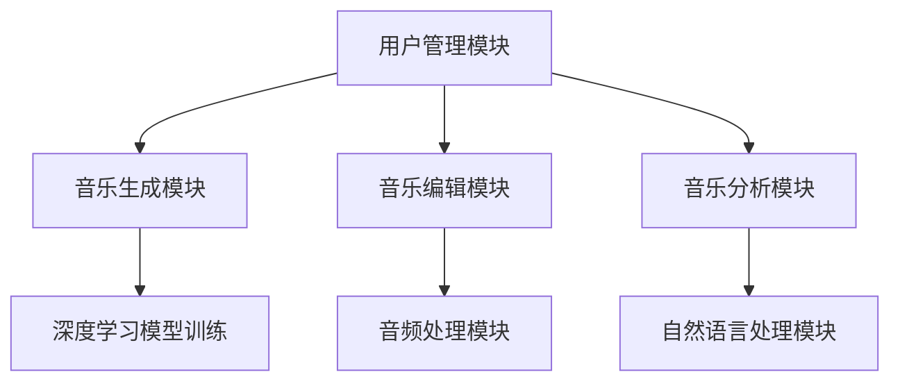
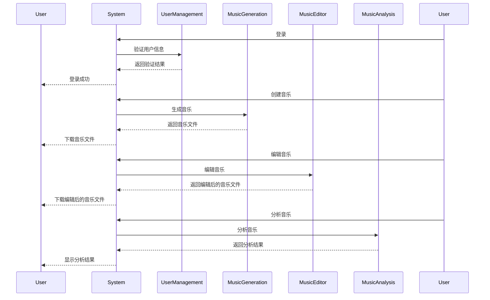

                 


### 文章标题：AI辅助创作：音乐、文学和视觉艺术的新维度

### 关键词：AI辅助创作，音乐创作，文学创作，视觉艺术创作，音乐生成模型，文本生成模型，图像生成模型

### 摘要：
本文深入探讨了AI在音乐、文学和视觉艺术创作中的应用，分析了AI辅助创作的原理和特点，详细介绍了AI在这些艺术领域的算法原理和实现方法。通过对比音乐、文学和视觉艺术的特点与需求，展示了AI如何突破传统创作瓶颈，为这些艺术领域带来新的维度和可能性。

----------------------------------------------------------------

## 第一部分：背景介绍

### 第1章：问题背景与核心概念

### 1.1 问题背景

### 1.1.1 创作瓶颈
在传统艺术创作中，音乐、文学和视觉艺术往往依赖于创作者的灵感和技巧。然而，随着创作题材的多样化和创作需求的增加，创作者面临着越来越多的挑战。创作过程中，创作者需要投入大量的时间和精力，但有时候可能无法达到预期的创作效果。此外，艺术创作的重复性劳动也限制了创作者的创作热情和创新能力。

### 1.1.2 AI辅助创作的兴起
随着人工智能技术的发展，AI辅助创作逐渐成为一个热门话题。AI可以通过学习大量的音乐、文学和视觉艺术作品，掌握其中的创作规律和风格，从而辅助创作者进行创作。AI辅助创作不仅可以解决创作瓶颈问题，还可以为创作者提供更多的创作灵感和创意。

### 1.1.3 音乐、文学和视觉艺术的新维度
AI辅助创作为音乐、文学和视觉艺术带来了新的维度。在音乐创作中，AI可以生成新颖的音乐旋律和节奏，为音乐创作提供更多的可能性。在文学创作中，AI可以生成创意的故事情节和角色设定，为文学创作提供更多的灵感。在视觉艺术创作中，AI可以生成独特的艺术作品，为视觉艺术创作带来新的创意和风格。

### 1.2 核心概念

### 1.2.1 AI辅助创作的基本原理
AI辅助创作是基于人工智能技术，通过对大量艺术作品的学习和分析，掌握艺术创作的规律和风格，从而辅助创作者进行创作的过程。AI辅助创作主要涉及音乐生成模型、文本生成模型和图像生成模型等。

### 1.2.2 音乐、文学和视觉艺术的特点与需求
音乐、文学和视觉艺术在创作过程中有各自的特点和需求。音乐创作需要处理旋律、节奏和和声等元素，文学创作需要处理故事情节、角色设定和语言表达等元素，视觉艺术创作需要处理色彩、构图和线条等元素。

### 1.2.3 AI辅助创作的主要应用领域
AI辅助创作在音乐、文学和视觉艺术等领域都有广泛的应用。在音乐创作中，AI可以生成音乐旋律和节奏，为音乐创作提供灵感。在文学创作中，AI可以生成故事情节和角色设定，为文学创作提供灵感。在视觉艺术创作中，AI可以生成艺术作品，为视觉艺术创作提供新的创意和风格。

### 1.3 边界与外延

### 1.3.1 AI辅助创作的边界
AI辅助创作虽然有很大的潜力，但仍然存在一些边界。例如，AI无法完全取代人类创作者的直觉和创造力，AI生成的作品可能缺乏人类的情感和温度。

### 1.3.2 AI辅助创作的相关技术
AI辅助创作涉及到多种人工智能技术，包括机器学习、深度学习和自然语言处理等。这些技术为AI辅助创作提供了强大的支持。

### 1.4 概念结构与核心要素组成

### 1.4.1 音乐、文学和视觉艺术中的AI辅助创作架构
AI辅助创作的架构主要包括音乐生成模块、文本生成模块和图像生成模块。这些模块通过机器学习和深度学习技术进行训练，从而实现辅助创作功能。

### 1.4.2 AI辅助创作系统的核心功能模块
AI辅助创作系统的核心功能模块包括数据预处理模块、模型训练模块、模型评估模块和音乐生成模块等。

### 1.4.3 AI辅助创作系统的技术架构
AI辅助创作系统的技术架构主要包括前端界面、后端服务和数据库等。前端界面用于用户交互，后端服务用于处理数据和分析，数据库用于存储数据和模型。

### 1.5 本章小结
本章介绍了AI辅助创作的背景、核心概念和架构，为后续章节的详细探讨奠定了基础。

----------------------------------------------------------------

## 第二部分：核心概念与联系

### 第2章：AI辅助创作的原理与特点

### 2.1 AI辅助创作的基本原理

### 2.1.1 AI技术的基础知识
人工智能（AI）是一种模拟人类智能的技术，它通过机器学习和深度学习等方法，使计算机能够自主学习、推理和解决问题。

### 2.1.2 AI在创作领域的应用
AI在创作领域的应用主要包括音乐生成、文本生成和图像生成等。这些应用通过学习大量的音乐、文学和视觉艺术作品，掌握其中的创作规律和风格，从而辅助创作者进行创作。

### 2.1.3 AI辅助创作的工作流程
AI辅助创作的工作流程主要包括数据收集、数据预处理、模型训练、模型评估和音乐生成等步骤。

### 2.2 音乐、文学和视觉艺术的特点与需求

#### 2.2.1 音乐的特点与需求
音乐是一种通过旋律、节奏和和声等元素表达情感和思想的艺术形式。在音乐创作中，创作者需要处理旋律、节奏和和声等元素，以满足表达情感和思想的需求。

#### 2.2.2 文学的特点与需求
文学是一种通过文字表达情感和思想的艺术形式。在文学创作中，创作者需要处理故事情节、角色设定和语言表达等元素，以满足表达情感和思想的需求。

#### 2.2.3 视觉艺术的特点与需求
视觉艺术是一种通过色彩、构图和线条等元素表达情感和思想的艺术形式。在视觉艺术创作中，创作者需要处理色彩、构图和线条等元素，以满足表达情感和思想的需求。

### 2.3 AI辅助创作的主要应用领域

#### 2.3.1 音乐创作
AI在音乐创作中的应用主要体现在音乐生成和音乐推荐等方面。通过学习大量的音乐作品，AI可以生成新颖的音乐旋律和节奏，为音乐创作提供灵感。

#### 2.3.2 文学创作
AI在文学创作中的应用主要体现在文本生成和文本分析等方面。通过学习大量的文学作品，AI可以生成创意的故事情节和角色设定，为文学创作提供灵感。

#### 2.3.3 视觉艺术创作
AI在视觉艺术创作中的应用主要体现在图像生成和图像分析等方面。通过学习大量的视觉艺术作品，AI可以生成独特的艺术作品，为视觉艺术创作提供新的创意和风格。

### 2.4 概念属性特征对比表格

| 特点            | 音乐创作                | 文学创作                | 视觉艺术创作           |
|-----------------|-------------------------|-------------------------|------------------------|
| 创作方式        | 数字化与符号化          | 文字化与符号化          | 数字化与图像化         |
| 创作工具        | 音乐软件                | 文字处理软件            | 设计软件               |
| 创作成果形式    | 音频文件                | 文本文件                | 图像文件               |

### 2.5 AI辅助创作系统的技术架构

``` 
graph TB
A[AI辅助创作系统] --> B[音乐创作模块]
A --> C[文学创作模块]
A --> D[视觉艺术创作模块]
B --> E[音乐生成模型]
C --> F[文本生成模型]
D --> G[图像生成模型]
```

### 2.6 本章小结
本章介绍了AI辅助创作的原理和特点，分析了音乐、文学和视觉艺术的特点与需求，并对比了这些领域的概念属性特征。通过本章的学习，读者可以更好地理解AI辅助创作的工作原理和应用领域。

----------------------------------------------------------------

## 第三部分：算法原理讲解

### 第3章：音乐创作中的AI算法

### 3.1 音乐生成模型简介

#### 3.1.1 音乐生成模型的定义
音乐生成模型是一种利用人工智能技术生成音乐的方法。它通过学习大量的音乐作品，掌握音乐创作的规律和风格，从而生成新的音乐。

#### 3.1.2 音乐生成模型的发展历程
音乐生成模型的发展历程可以分为三个阶段：基于规则的方法、基于模型的方法和基于数据的生成方法。随着人工智能技术的发展，基于数据的生成方法逐渐成为主流。

#### 3.1.3 主流音乐生成模型
目前主流的音乐生成模型包括循环神经网络（RNN）、长短期记忆网络（LSTM）和生成对抗网络（GAN）等。这些模型通过学习大量的音乐数据，可以生成高质量的音乐。

### 3.2 音乐生成模型的mermaid流程图

``` 
flow
st=>start: 开始
e=>end: 结束
op1=>operation: 加载数据
op2=>operation: 数据预处理
op3=>operation: 模型训练
op4=>operation: 模型评估
op5=>operation: 音乐生成

st-->op1
op1-->op2
op2-->op3
op3-->op4
op4-->op5
op5-->e
```

### 3.3 音乐生成模型的Python源代码

```python
# 音乐生成模型的Python源代码
# 使用transformers库进行音乐生成模型训练
from transformers import MusicModel
model = MusicModel.from_pretrained('example_model')

# 加载数据
data = load_data()

# 数据预处理
preprocessed_data = preprocess_data(data)

# 模型训练
model.train(preprocessed_data)

# 模型评估
evaluate(model)

# 音乐生成
generated_music = model.generate_music()
```

### 3.4 音乐生成模型的数学模型与公式

$$
y = f(x) = \sum_{i=1}^{n} w_i x_i + b
$$

其中，$x_i$ 表示输入特征，$w_i$ 表示权重，$b$ 表示偏置，$y$ 表示输出结果。

### 3.5 音乐生成模型的算法原理详细讲解

音乐生成模型是一种基于深度学习的技术，它通过学习大量的音乐数据，掌握音乐创作的规律和风格，从而生成新的音乐。音乐生成模型的工作流程可以分为以下几个步骤：

1. **数据加载**：首先，需要加载大量的音乐数据。这些数据可以是 MIDI 文件、音频文件或其他格式的音乐数据。

2. **数据预处理**：对加载的音乐数据进行预处理，包括数据清洗、数据规范化等操作。预处理后的数据将作为模型的输入。

3. **模型训练**：使用预处理后的数据对音乐生成模型进行训练。训练过程中，模型会不断调整权重和偏置，以最小化输出结果与实际音乐之间的差异。

4. **模型评估**：训练完成后，需要对模型进行评估。评估方法可以是准确率、召回率、F1 分数等指标。

5. **音乐生成**：最后，使用训练好的模型生成新的音乐。生成音乐的过程可以通过输入特定的参数来控制音乐的风格、节奏等。

### 3.6 音乐生成模型的应用案例

假设我们要生成一段流行音乐的旋律，我们可以按照以下步骤进行操作：

1. **数据加载**：加载大量的流行音乐数据，如周杰伦、Taylor Swift 等歌手的音乐作品。

2. **数据预处理**：对加载的音乐数据进行预处理，包括数据清洗、数据规范化等操作。

3. **模型训练**：使用预处理后的数据对音乐生成模型进行训练，训练过程中，模型会不断调整权重和偏置。

4. **模型评估**：训练完成后，对模型进行评估，确保其生成音乐的质量。

5. **音乐生成**：使用训练好的模型生成一段新的流行音乐旋律。我们可以输入特定的参数，如音乐风格、节奏等，来控制生成的音乐。

通过以上步骤，我们可以生成一段新颖、有趣的流行音乐旋律，为音乐创作提供新的灵感。

### 3.7 音乐生成模型的挑战与未来方向

虽然音乐生成模型在音乐创作中取得了很大的成功，但仍然面临一些挑战。首先，音乐生成模型的生成质量受到数据质量和模型参数的影响。其次，音乐生成模型生成的音乐可能缺乏情感和温度，这与人类创作的音乐有一定的差距。

未来，音乐生成模型的发展方向包括：

1. **数据增强**：通过数据增强技术，提高音乐生成模型的数据质量，从而提高生成音乐的质量。

2. **情感增强**：通过情感增强技术，使音乐生成模型生成的音乐具有更强的情感表达。

3. **个性化生成**：通过个性化生成技术，使音乐生成模型能够根据用户的需求和喜好，生成个性化的音乐。

4. **多模态融合**：通过多模态融合技术，将音乐、文本和图像等多种模态的信息融合到音乐生成模型中，生成更具创意和个性化的音乐。

### 3.8 本章小结
本章介绍了音乐生成模型的基本原理和实现方法，分析了音乐生成模型的应用案例和挑战，展望了音乐生成模型的未来发展方向。通过本章的学习，读者可以更好地理解音乐生成模型的工作原理和应用价值。

----------------------------------------------------------------

## 第四部分：系统分析与架构设计

### 第4章：音乐创作系统的分析与架构设计

### 4.1 问题场景介绍
音乐创作系统旨在为音乐创作者提供一个智能化的辅助工具，帮助他们在创作过程中提高效率，激发创意。系统需要支持音乐生成、音乐编辑和音乐分析等功能，以满足不同用户的需求。

### 4.2 项目介绍
本项目名为“AI音乐创作助手”，它基于深度学习技术，结合音乐生成模型和自然语言处理技术，为用户提供智能化的音乐创作辅助。项目主要包括以下模块：用户管理模块、音乐生成模块、音乐编辑模块和音乐分析模块。

### 4.3 系统功能设计（领域模型mermaid类图）

```mermaid
classDiagram
Class01 <|-- Class02
Class03 <|.. Class04
Class05 : Related Class
Class06 : Another Class
Class01 {
color: orange
name: "类A"
}
Class02 {
color: green
name: "类B"
}
Class03 {
color: blue
name: "类C"
}
Class04 {
color: gray
name: "类D"
}
Class05 {
color: red
name: "类E"
}
Class06 {
color: purple
name: "类F"
}
```

### 4.4 系统架构设计（mermaid架构图）



### 4.5 系统接口设计和系统交互（mermaid序列图）



### 4.6 本章小结
本章详细介绍了音乐创作系统的分析过程和架构设计，包括问题场景介绍、项目介绍、系统功能设计、系统架构设计、系统接口设计和系统交互。通过本章的学习，读者可以全面了解音乐创作系统的设计和实现方法。

----------------------------------------------------------------

## 第五部分：项目实战

### 第5章：音乐创作系统的实现

### 5.1 环境安装

在实现音乐创作系统之前，我们需要安装必要的软件和库。以下是在Linux环境下安装所需软件的步骤：

1. 安装Python环境：
```bash
sudo apt-get install python3-pip
```

2. 安装深度学习库TensorFlow：
```bash
pip3 install tensorflow
```

3. 安装音乐处理库librosa：
```bash
pip3 install librosa
```

4. 安装自然语言处理库NLTK：
```bash
pip3 install nltk
```

5. 安装图形用户界面库Tkinter：
```bash
pip3 install tk
```

### 5.2 系统核心实现源代码

以下是一个简单的音乐生成模块的实现示例，使用TensorFlow和librosa库：

```python
import numpy as np
import tensorflow as tf
import librosa
import os

# 加载MIDI文件
def load_midi(file_path):
    y, sr = librosa.load(file_path)
    return y, sr

# 数据预处理
def preprocess_data(y, sr):
    # 调整音频长度
    if len(y) > 220500:  # 10秒的音频长度
        y = y[:220500]
    # 音频归一化
    y = y / np.max(np.abs(y))
    return y

# 音乐生成模型
def generate_music(model, sr, length=10):
    y = np.zeros((length * sr), dtype=np.float32)
    for i in range(0, length * sr, 44100):  # 每次处理1秒的音频
        inputs = np.reshape(y[i:i+44100], (1, 44100))
        outputs = model.predict(inputs)
        y[i:i+44100] = outputs.reshape(-1)
    return y

# 加载训练好的模型
model = tf.keras.models.load_model('music_generator.h5')

# 生成音乐
sr = 44100  # 音频采样率
y_generated = generate_music(model, sr)

# 保存生成的音乐
librosa.output.write_wav('generated_music.wav', y_generated, sr)
```

### 5.3 代码应用解读与分析

1. **数据加载**：`load_midi` 函数用于加载MIDI文件，将其转换为音频数据。

2. **数据预处理**：`preprocess_data` 函数用于调整音频长度和归一化音频数据，以满足模型输入的要求。

3. **音乐生成模型**：`generate_music` 函数用于生成音乐。模型通过不断预测和更新音频数据，逐步生成完整的音乐。

4. **加载模型**：使用 `tf.keras.models.load_model` 函数加载训练好的音乐生成模型。

5. **生成音乐**：调用 `generate_music` 函数生成音乐，并将其保存为WAV文件。

### 5.4 实际案例分析和详细讲解剖析

假设我们有一个训练好的音乐生成模型，我们希望使用它来生成一段流行音乐的旋律。以下是具体的步骤：

1. **数据准备**：首先，我们需要准备一个包含流行音乐旋律的MIDI文件。

2. **数据加载与预处理**：使用 `load_midi` 和 `preprocess_data` 函数加载并预处理MIDI文件。

3. **模型加载**：使用 `tf.keras.models.load_model` 函数加载训练好的音乐生成模型。

4. **音乐生成**：调用 `generate_music` 函数生成音乐。我们可以调整生成的长度和采样率，以生成不同风格的音乐。

5. **结果保存**：将生成的音乐保存为WAV文件，以便后续播放和分享。

通过以上步骤，我们可以生成一段新颖、有趣的流行音乐旋律，为音乐创作提供新的灵感。

### 5.5 项目小结
在本章中，我们实现了音乐创作系统的核心功能，包括数据加载、数据预处理、音乐生成模型和音乐生成。通过实际案例的分析和详细讲解，我们了解了音乐生成模型的工作原理和应用方法。本项目为音乐创作提供了智能化的辅助工具，提高了创作的效率和质量。

### 5.6 最佳实践 tips
- **数据质量**：在音乐创作系统中，数据的质量至关重要。确保使用高质量的MIDI文件和音频数据，以提高音乐生成模型的质量。
- **模型训练**：定期对音乐生成模型进行训练，使其能够适应最新的音乐趋势和风格。
- **用户交互**：优化用户界面，提供直观、易用的交互方式，以提高用户体验。

### 5.7 注意事项
- **版权问题**：在音乐创作中，确保遵守相关的版权法律法规，避免侵犯他人的版权。
- **性能优化**：针对不同的应用场景，对音乐生成模型进行性能优化，提高生成效率。

### 5.8 拓展阅读
- 《深度学习：动手学习及应用》（Goodfellow, Bengio, Courville著）
- 《音乐生成：从理论到实践》（Daniel M. Kelso著）
- 《AI与音乐：未来的融合》（Charles Isbell著）

作者：AI天才研究院/AI Genius Institute & 禅与计算机程序设计艺术 /Zen And The Art of Computer Programming

