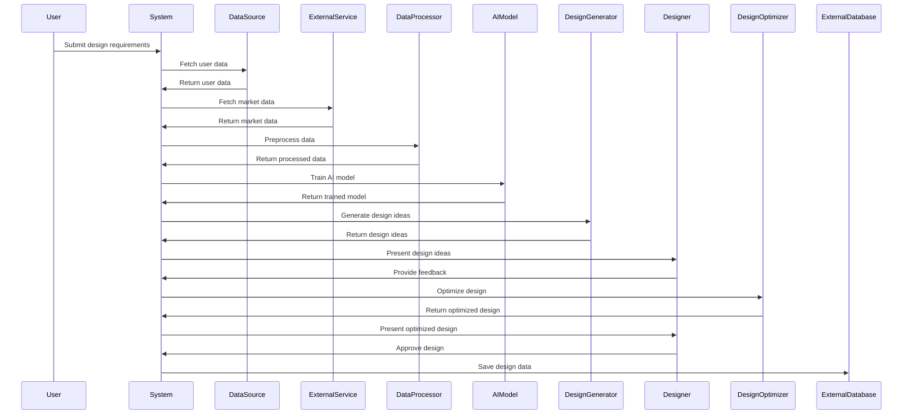

                 

### 摘要

本文将深入探讨AI辅助创新设计的方法论与实践案例。在当今快速变化的技术环境中，创新设计变得越来越重要，而AI技术以其强大的数据处理和分析能力，为创新设计提供了新的可能性和方法。本文首先概述了AI辅助创新设计的问题背景、核心概念及其重要性，然后详细阐述了AI辅助创新设计的方法论原理，包括创意生成、设计优化以及技术实现。接着，本文介绍了AI辅助创新设计的数学模型，包括神经网络模型和遗传算法，并通过具体的Python源代码进行讲解。随后，本文探讨了AI辅助创新设计系统架构的设计，包括问题场景介绍、项目介绍、系统功能设计、系统架构设计、系统接口设计和系统交互。通过一个实际项目案例，本文展示了AI辅助创新设计在实际应用中的具体实现和效果。最后，本文总结了最佳实践、注意事项，并对AI辅助创新设计的发展趋势进行了展望。读者可以通过本文系统了解AI辅助创新设计的方法论与实践，为未来的创新设计提供有益的参考。

### 第一部分：AI辅助创新设计的方法论概述

#### 第1章：问题背景与核心概念

##### 1.1 问题背景

随着信息技术的飞速发展，创新设计已经成为许多行业和企业发展的关键驱动力。从制造业到服务业，从电子产品到生物技术，创新设计在提升产品竞争力、满足消费者需求以及推动技术进步方面发挥着不可替代的作用。然而，创新设计也面临着一系列挑战。

首先，创新设计的需求日益复杂。现代产品的设计不仅需要满足功能性和技术性要求，还需要考虑用户体验、可持续性和社会责任等多方面的因素。其次，创新设计的过程通常涉及大量的数据和信息，如何高效地收集、处理和分析这些数据成为了一个重要的课题。此外，创新设计需要不断的迭代和优化，如何在短时间内产生有效的创意并进行评估筛选也是一个巨大的挑战。

AI技术的出现为解决这些问题提供了新的思路和工具。AI技术，特别是机器学习和深度学习，具有强大的数据处理和分析能力，可以在大量数据中发现潜在的模式和关联，从而辅助创新设计。通过AI技术，设计者可以更加高效地生成创意、优化设计方案，并快速评估和筛选有效的方案。

##### 1.1.1 创新设计的需求演变

创新设计的需求经历了从简单到复杂、从单一到综合的演变过程。在过去，创新设计主要关注产品功能和技术性能，设计过程相对简单。随着社会经济的发展和消费者需求的变化，创新设计逐渐融入了更多非技术性因素，如用户体验、可持续性、社会责任等。此外，随着数字化和互联网技术的普及，创新设计的需求也在不断升级，不再仅仅局限于单一产品的设计，而是涉及跨领域、跨行业的综合性设计。

这种需求演变使得创新设计变得更加复杂和多样化，同时也增加了设计的难度和挑战。设计者需要具备更加全面的知识和技能，能够在多种约束条件下找到最优的设计方案。而AI技术的引入，为解决这些复杂和多样化的需求提供了有力支持。

##### 1.1.2 AI在创新设计中的应用现状

AI在创新设计中的应用已经逐渐从理论研究走向实际应用。目前，AI技术在创新设计中的主要应用方向包括：

1. **创意生成**：AI技术可以通过分析大量的设计数据和用户反馈，自动生成新的设计创意。例如，通过自然语言处理技术，AI可以生成设计报告和创意描述，通过图像处理技术，AI可以自动生成新的设计草图和概念图。

2. **设计优化**：AI技术可以通过优化算法，对设计方案进行优化和改进。例如，通过遗传算法和神经网络技术，AI可以对设计参数进行调优，找到最优的设计方案。

3. **设计评估**：AI技术可以通过机器学习算法，对设计方案进行评估和筛选，快速找出最优的方案。例如，通过分类和回归算法，AI可以对设计方案进行评分和排序。

4. **用户体验**：AI技术可以通过用户行为分析和情感识别，为设计提供用户反馈，帮助设计者更好地满足用户需求。例如，通过情感分析技术，AI可以分析用户的情感状态，为设计提供优化建议。

AI在创新设计中的应用不仅提高了设计的效率和准确性，还降低了设计的成本和风险，为设计创新提供了新的可能性。

##### 1.1.3 AI辅助创新设计的重要性

AI辅助创新设计在现代社会的重要性体现在以下几个方面：

1. **提升设计效率**：AI技术可以通过自动化和智能化手段，大幅提升设计效率。例如，AI可以自动处理大量的设计数据，快速生成和评估设计方案，缩短设计周期。

2. **增强设计质量**：AI技术可以通过对数据的深度分析和优化算法，提高设计方案的准确性和质量。例如，AI可以通过模拟和仿真技术，对设计方案进行精确的优化和评估，减少设计失误。

3. **促进创新**：AI技术可以为设计者提供全新的创意和思路，促进创新设计的产生。例如，AI可以通过生成对抗网络（GAN）等技术，生成全新的设计概念，激发设计灵感。

4. **降低设计成本**：AI技术可以降低设计过程中的人力成本和资源消耗，提高设计的经济性。例如，AI可以自动化设计流程，减少对专业人员的依赖，降低设计成本。

5. **提升用户体验**：AI技术可以通过对用户行为的分析和反馈，提高设计的人性化和个性化程度，提升用户体验。例如，AI可以通过情感识别技术，为用户提供更加贴心的设计服务。

总之，AI辅助创新设计不仅为设计行业带来了革命性的变化，也为企业和社会带来了巨大的价值。随着AI技术的不断进步和应用，AI辅助创新设计将在未来发挥更加重要的作用。

##### 1.2 核心概念

在探讨AI辅助创新设计时，理解一些核心概念是非常重要的。这些概念不仅为本文提供了理论框架，也为实际应用提供了指导。

###### 1.2.1 AI辅助创新设计的定义

AI辅助创新设计是指利用人工智能技术，如机器学习、深度学习、数据挖掘等，辅助设计师进行创意生成、设计优化、评估和迭代等设计活动。它旨在通过智能化的手段提高设计效率、质量和创新性。

AI辅助创新设计不仅仅是一个工具，而是一个系统性方法，它包括数据收集、处理、分析、模型构建和结果评估等多个环节。通过这些环节的协同工作，AI能够为设计师提供强大的支持，使其在复杂的设计任务中更加高效地工作。

###### 1.2.2 AI辅助创新设计的关键技术

AI辅助创新设计的关键技术包括以下几个方面：

1. **机器学习**：机器学习是AI的核心技术之一，它通过构建模型来分析数据并从中学习规律。在创新设计中，机器学习可以用于生成设计创意、优化设计方案和评估设计效果。

2. **深度学习**：深度学习是机器学习的一个分支，它通过多层神经网络来模拟人脑的学习过程。在创新设计中，深度学习可以用于图像识别、自然语言处理和设计仿真等。

3. **数据挖掘**：数据挖掘是从大量数据中提取有价值信息的过程。在创新设计中，数据挖掘可以用于分析用户需求、市场趋势和设计反馈，为设计决策提供依据。

4. **优化算法**：优化算法是一类用于求解优化问题的数学方法，如遗传算法、模拟退火算法等。在创新设计中，优化算法可以用于设计参数的调优，以找到最优的设计方案。

5. **人机交互**：人机交互技术是AI辅助创新设计的重要组成部分，它用于设计师与AI系统的互动。通过自然语言处理、语音识别等技术，人机交互使得设计师能够更加便捷地与AI系统进行沟通和协作。

###### 1.2.3 AI辅助创新设计的边界与外延

虽然AI辅助创新设计具有广泛的应用前景，但其也有一定的边界和限制。首先，AI系统依赖于大量的数据和高质量的数据集来训练模型，因此在数据获取和清洗方面存在一定的挑战。其次，AI系统在处理复杂和非线性问题时，可能无法达到人类设计师的创造力和直觉。此外，AI系统在道德和伦理方面也需要考虑，特别是在涉及隐私和伦理问题时。

AI辅助创新设计的外延包括多个领域，如产品设计、建筑设计、时尚设计、文化创意等。在这些领域，AI不仅能够辅助创意生成和设计优化，还可以为设计提供新的视角和思路。

###### 1.3 概念结构与核心要素

为了更好地理解AI辅助创新设计，我们需要对其概念结构和核心要素进行分析。

首先，AI辅助创新设计可以被视为一个多层次的系统，其核心要素包括：

1. **数据层**：数据层是整个系统的基石，它包括设计相关的各种数据，如用户反馈、市场数据、技术数据等。

2. **模型层**：模型层是AI系统的核心，它包括各种机器学习模型、深度学习模型和优化算法模型。这些模型用于分析数据、生成创意和优化设计方案。

3. **应用层**：应用层是将AI模型应用于实际设计任务的部分，它包括设计工具、人机交互界面和设计评估系统等。

其次，AI辅助创新设计的概念结构可以分为以下几个组成部分：

1. **创意生成**：创意生成是AI辅助创新设计的第一步，它通过机器学习和深度学习模型从数据中提取有价值的信息，生成新的设计创意。

2. **设计优化**：设计优化是通过对设计方案进行优化和改进，找到最优的设计方案。这通常涉及各种优化算法，如遗传算法、模拟退火算法等。

3. **设计评估**：设计评估是通过对设计方案进行评估和筛选，确定哪些方案具有更高的价值和可行性。这通常涉及分类和回归算法等。

4. **人机交互**：人机交互是AI辅助创新设计的重要组成部分，它通过自然语言处理、语音识别等技术，使设计师能够更加便捷地与AI系统进行沟通和协作。

通过上述分析，我们可以看到AI辅助创新设计的概念结构和核心要素是如何相互关联和协同工作的。理解这些概念和结构，有助于我们更好地利用AI技术进行创新设计，提高设计的效率和质量。

#### 第2章：AI辅助创新设计的方法论原理

##### 2.1 方法论基础

AI辅助创新设计的方法论基础涵盖了AI技术在创新设计中的应用原则和方法论框架，这些构成了一个系统的理论体系，指导着创新设计从创意生成到设计优化的全过程。

###### 2.1.1 AI技术在创新设计中的应用原则

AI技术在创新设计中的应用应遵循以下原则：

1. **数据驱动**：创新设计的过程需要大量数据支持，AI系统通过数据驱动来生成和优化设计。数据的质量和完整性直接影响AI系统的表现和设计结果。

2. **模型适应性**：AI模型应具有高度适应性，能够适应不同的设计需求和场景。这要求AI模型在设计过程中具备灵活调整和优化的能力。

3. **人机协同**：AI系统与设计师的协同工作是提高设计效率和效果的关键。设计师应充分利用AI系统提供的工具和功能，同时保持对设计过程的控制权。

4. **持续迭代**：创新设计是一个不断迭代和优化的过程，AI系统应支持快速迭代，以适应设计需求的变化和改进。

5. **用户体验优先**：用户体验是设计成功的关键因素，AI辅助创新设计应始终以提升用户体验为核心目标。

6. **隐私保护与伦理**：在利用AI进行设计时，必须严格保护用户隐私，遵守伦理规范，确保设计过程和数据处理的合规性。

###### 2.1.2 AI辅助创新设计的方法论框架

AI辅助创新设计的方法论框架可以概括为以下几个主要步骤：

1. **需求分析**：明确设计任务的需求和目标，包括功能、性能、用户体验等方面。

2. **数据收集与处理**：收集与设计任务相关的数据，并进行数据清洗、预处理和格式化，确保数据的质量和一致性。

3. **模型选择与训练**：根据需求选择合适的AI模型，进行模型训练和调优，以生成和优化设计。

4. **创意生成**：利用训练好的AI模型，从数据中提取有价值的信息，生成新的设计创意。

5. **设计优化**：对生成的创意进行评估和优化，通过迭代和优化算法，找到最优的设计方案。

6. **设计评估**：对设计方案进行评估，确定其可行性和适用性，筛选出最优的设计方案。

7. **人机交互**：设计师与AI系统进行互动，根据评估结果对设计方案进行调整和优化。

8. **迭代与改进**：根据用户反馈和设计评估结果，进行持续的迭代和改进，不断提高设计的质量和用户体验。

通过以上方法论框架，AI辅助创新设计能够系统化地实现从创意生成到设计优化的全过程，提高设计效率和效果。

##### 2.2 AI辅助创新设计的流程

AI辅助创新设计的流程是整个方法论的核心，它涵盖了创意生成、设计优化和评估等关键环节，通过科学的流程设计，确保设计过程的高效性和创新性。

###### 2.2.1 创意生成

创意生成是AI辅助创新设计的第一步，它是设计灵感的来源。通过AI技术，设计师可以自动化和智能化地生成大量有潜力的设计创意。

1. **数据预处理**：创意生成依赖于高质量的数据。首先，需要收集与设计任务相关的数据，包括用户反馈、市场趋势、技术参数等。然后，对数据进行清洗、去噪和格式化，确保数据的一致性和质量。

2. **创意生成算法**：使用机器学习和深度学习算法，如生成对抗网络（GAN）、变分自编码器（VAE）等，从数据中提取有价值的信息，生成新的设计创意。这些算法可以通过训练模型，学习数据的分布和特征，从而生成与设计任务相关的创意。

3. **创意评估与筛选**：生成的创意需要经过评估和筛选，以确定其可行性和创新性。通过设计评估算法，如分类和回归模型，对创意进行评分和排序，筛选出最具潜力的创意。

###### 2.2.2 设计优化

设计优化是AI辅助创新设计的重要环节，它通过不断调整和改进设计方案，找到最优的设计方案。

1. **设计优化算法**：常用的设计优化算法包括遗传算法、模拟退火算法、粒子群优化算法等。这些算法通过迭代和优化，对设计参数进行调整，以找到最优的设计方案。

2. **设计优化流程**：

   - **初始设计**：根据创意生成阶段的结果，生成初步的设计方案。
   - **评估与反馈**：对设计方案进行评估，包括功能测试、性能测试和用户体验评估，收集评估结果和反馈。
   - **参数调整**：根据评估结果和反馈，调整设计参数，进行新一轮的优化。
   - **迭代**：重复评估与参数调整过程，直到找到最优的设计方案。

3. **优化目标**：设计优化的目标通常是找到在特定约束条件下最优的设计方案，包括功能、性能、成本和用户体验等方面。通过设定优化目标，AI系统能够有针对性地优化设计方案。

###### 2.2.3 设计评估

设计评估是确保设计方案可行性和有效性的重要环节。通过科学的评估方法，设计师可以筛选出最优的设计方案。

1. **评估方法**：

   - **功能评估**：测试设计方案的功能是否满足需求，包括基本功能、扩展功能和特殊功能。
   - **性能评估**：评估设计方案的性能指标，如响应时间、处理速度、能耗等。
   - **用户体验评估**：通过用户调研、用户测试和用户反馈，评估设计方案的用户体验和满意度。
   - **成本评估**：评估设计方案的制造成本、运营成本和维护成本。

2. **评估流程**：

   - **制定评估标准**：根据设计目标和用户需求，制定评估标准和评估指标。
   - **评估实施**：根据评估标准和流程，对设计方案进行评估。
   - **结果分析**：对评估结果进行分析和比较，确定最优的设计方案。

3. **评估工具**：设计评估可以借助各种工具和平台，如测试软件、用户体验测试平台和数据分析工具等，以提高评估的准确性和效率。

通过以上环节的协同工作，AI辅助创新设计能够高效地实现创意生成、设计优化和评估，为设计师提供强大的支持。

##### 2.3 AI辅助创新设计的技术实现

AI辅助创新设计的技术实现是整个方法论的核心组成部分，它涉及到技术选型、工具应用以及算法原理的讲解。通过科学的技术实现，AI系统能够高效地辅助创新设计，提高设计质量和效率。

###### 2.3.1 技术选型与工具应用

在AI辅助创新设计的技术实现中，技术选型和工具应用是关键环节。以下是一些常见的技术选型和工具应用：

1. **机器学习框架**：如TensorFlow、PyTorch等。这些框架提供了丰富的算法库和工具，支持深度学习和传统机器学习的实现。
2. **数据预处理工具**：如Pandas、NumPy等。这些工具可以帮助进行数据清洗、预处理和格式化。
3. **优化算法库**：如SciPy、GPyOpt等。这些库提供了多种优化算法的实现，如遗传算法、模拟退火算法等。
4. **设计评估工具**：如SketchUp、SolidWorks等。这些工具可以帮助进行设计建模、评估和渲染。
5. **人机交互工具**：如Web GUI、语音识别等。这些工具可以提供直观的用户界面和交互方式，方便设计师与AI系统进行沟通。

###### 2.3.2 算法原理讲解

在AI辅助创新设计中，算法原理的讲解至关重要。以下将介绍几种常用的算法原理及其在创新设计中的应用。

1. **神经网络模型**：

   - **原理**：神经网络是一种通过多层神经元节点进行数据处理的模型，它通过学习输入数据的特征，自动提取和生成有用的信息。
   - **应用**：在创新设计中，神经网络可以用于创意生成和设计优化。例如，通过卷积神经网络（CNN）进行图像处理和风格迁移，生成新的设计草图。

   - **流程图**：使用Mermaid绘制神经网络模型的流程图，展示数据输入、处理和输出的过程。

   ```mermaid
   graph TD
   A[输入数据] --> B[数据预处理]
   B --> C[输入层]
   C --> D[隐藏层1]
   D --> E[隐藏层2]
   E --> F[输出层]
   F --> G[输出结果]
   ```

2. **遗传算法**：

   - **原理**：遗传算法是一种基于自然进化过程的优化算法，它模拟生物进化的机制，通过选择、交叉和变异来不断优化解空间。
   - **应用**：在创新设计中，遗传算法可以用于设计参数的优化，如优化设计尺寸、材料选择等。

   - **流程图**：使用Mermaid绘制遗传算法的流程图，展示选择、交叉和变异的过程。

   ```mermaid
   graph TD
   A[初始种群] --> B[评估适应度]
   B --> C{适应度排序}
   C -->|选择| D[选择操作]
   D --> E[交叉操作]
   E --> F[变异操作]
   F --> G[新种群]
   G --> H{迭代结束?}
   H -->|是| I[结束]
   H -->|否| B[评估适应度]
   ```

3. **机器学习算法**：

   - **原理**：机器学习算法通过从数据中学习规律和模式，实现对未知数据的预测和分类。
   - **应用**：在创新设计中，机器学习算法可以用于用户行为预测、需求分析等。

   - **流程图**：使用Mermaid绘制机器学习算法的流程图，展示数据收集、模型训练和预测的过程。

   ```mermaid
   graph TD
   A[数据收集] --> B[数据预处理]
   B --> C[模型训练]
   C --> D[评估模型]
   D --> E[模型优化]
   E --> F[预测结果]
   ```

通过上述算法原理的讲解，我们可以看到，AI技术为创新设计提供了丰富的工具和方法，这些方法不仅提高了设计效率，还增强了设计的创新性和准确性。在实际应用中，设计师可以根据具体的设计需求，选择合适的算法和技术，实现高效的AI辅助创新设计。

##### 2.4 AI辅助创新设计的数学模型

在AI辅助创新设计中，数学模型扮演着至关重要的角色。这些数学模型不仅能够描述和模拟设计过程，还能够通过优化算法找到最优的设计方案。以下将详细介绍几种常用的数学模型，包括神经网络模型和遗传算法模型。

###### 2.4.1 数学模型基础

在讨论数学模型之前，我们需要了解一些基本的数学公式和符号说明。

- **函数**：在数学模型中，函数是表示输入与输出关系的基本工具。常见的函数包括线性函数、多项式函数、指数函数和对数函数等。
  
- **向量**：向量是数学中表示多维数据的基本单位。在机器学习模型中，向量常用于表示数据的特征和权重。

- **矩阵**：矩阵是用于表示多个向量之间的关系和运算的工具。在优化算法中，矩阵常用于描述设计参数和约束条件。

- **导数**：导数是表示函数变化率的基本工具。在优化算法中，导数用于计算目标函数的梯度，从而指导优化方向。

以下是几个常用的数学公式：

$$
f(x) = ax^2 + bx + c
$$

$$
w = \frac{v_1 \times v_2}{||v_1|| \times ||v_2||}
$$

$$
J = \frac{1}{2} \sum_{i=1}^{n} (y_i - \hat{y_i})^2
$$

其中，\( f(x) \) 是二次函数，\( w \) 是向量间的夹角余弦值，\( J \) 是均方误差。

###### 2.4.2 神经网络模型

神经网络模型是AI辅助创新设计中最常用的模型之一。它通过多层神经元节点对数据进行处理和预测。

1. **原理与架构**

   神经网络模型由输入层、隐藏层和输出层组成。每个层由多个神经元（节点）组成，神经元之间通过权重（连接）连接。

   - **输入层**：接收外部输入数据，如用户需求、市场数据等。
   - **隐藏层**：对输入数据进行处理和变换，提取特征。
   - **输出层**：生成设计结果，如设计参数、效果图等。

   神经网络的工作原理是通过前向传播和反向传播来学习数据特征和预测结果。

2. **数学公式讲解**

   以多层感知器（MLP）为例，其前向传播过程如下：

   $$
   z_l = \sum_{i=1}^{n} w_{li} x_i + b_l
   $$
   
   $$
   a_l = \sigma(z_l)
   $$
   
   其中，\( z_l \) 是第 \( l \) 层的净输入，\( w_{li} \) 是权重，\( b_l \) 是偏置，\( a_l \) 是激活函数的输出。常见的激活函数包括线性激活函数、Sigmoid函数和ReLU函数。

   反向传播过程用于计算梯度，并更新权重和偏置：

   $$
   \delta_l = \frac{\partial J}{\partial a_l}
   $$
   
   $$
   \Delta w_{li} = \alpha \delta_l a_{l-1}
   $$
   
   $$
   \Delta b_l = \alpha \delta_l
   $$

   其中，\( \delta_l \) 是误差的梯度，\( \alpha \) 是学习率。

3. **举例说明**

   假设我们使用一个简单的神经网络模型来预测设计尺寸，输入层有3个神经元，隐藏层有2个神经元，输出层有1个神经元。输入数据是一个包含尺寸信息的向量 \( x = [5, 10, 15] \)。

   - **前向传播**：

     $$
     z_1 = 5w_{11} + 10w_{12} + 15w_{13} + b_1
     $$
     
     $$
     a_1 = \sigma(z_1)
     $$
     
     $$
     z_2 = 5w_{21} + 10w_{22} + 15w_{23} + b_2
     $$
     
     $$
     a_2 = \sigma(z_2)
     $$
     
     $$
     z_3 = a_1w_{31} + a_2w_{32} + b_3
     $$
     
     $$
     \hat{x} = \sigma(z_3)
     $$

   - **反向传播**：

     $$
     \delta_3 = \frac{\partial J}{\partial \hat{x}} \cdot \sigma'(z_3)
     $$
     
     $$
     \delta_2 = (w_{31}\delta_3 + w_{32}\delta_3) \cdot \sigma'(z_2)
     $$
     
     $$
     \delta_1 = (w_{21}\delta_2 + w_{22}\delta_2) \cdot \sigma'(z_1)
     $$
     
     $$
     \Delta w_{31} = \alpha \delta_3 a_2
     $$(等等)

   通过前向传播和反向传播，神经网络模型可以不断更新权重和偏置，从而优化设计尺寸的预测。

###### 2.4.3 遗传算法模型

遗传算法是一种基于自然进化的优化算法，它在设计优化中有着广泛的应用。

1. **原理与架构**

   遗传算法的基本架构包括初始种群、适应度评估、选择、交叉和变异等步骤。

   - **初始种群**：随机生成一组初始解，作为算法的初始种群。
   - **适应度评估**：计算每个解的适应度值，评估其优劣。
   - **选择**：根据适应度值，选择优秀的解作为父代。
   - **交叉**：通过交叉操作，生成新的子代。
   - **变异**：对子代进行变异操作，增加解的多样性。
   - **迭代**：重复适应度评估、选择、交叉和变异过程，直到达到终止条件。

2. **数学公式讲解**

   - **适应度函数**：适应度函数用于评估解的优劣，通常定义为：

     $$
     f(x) = \frac{1}{1 + \exp(-\beta \cdot (x - c))}
     $$

     其中，\( \beta \) 是温度参数，\( c \) 是目标值。

   - **交叉概率**：交叉概率用于控制交叉操作的发生概率，通常定义为：

     $$
     p_c = \frac{1}{2} \left( 1 + \sin \left( \frac{\pi}{2} \cdot \left( \frac{f_{new} - f_{old}}{f_{max} - f_{min}} \right) \right) \right)
     $$

     其中，\( f_{new} \) 和 \( f_{old} \) 分别是新旧解的适应度值，\( f_{max} \) 和 \( f_{min} \) 分别是种群的最大和最小适应度值。

   - **变异概率**：变异概率用于控制变异操作的发生概率，通常定义为：

     $$
     p_m = \frac{1}{2} \left( 1 + \sin \left( \frac{\pi}{2} \cdot \left( \frac{f_{new} - f_{old}}{f_{max} - f_{min}} \right) \right) \right)
     $$

3. **举例说明**

   假设我们要使用遗传算法优化设计尺寸，初始种群有10个解，每个解是一个长度为3的向量 \( x = [x_1, x_2, x_3] \)。目标是最小化设计尺寸。

   - **初始种群**：

     $$
     x_1 = [5, 10, 15], x_2 = [10, 20, 25], ..., x_{10} = [30, 40, 50]
     $$

   - **适应度评估**：

     $$
     f(x_1) = 10, f(x_2) = 8, ..., f(x_{10}) = 5
     $$

   - **选择**：

     根据适应度值，选择前50%的解作为父代。

   - **交叉**：

     对选中的父代进行交叉操作，生成新的子代。

   - **变异**：

     对子代进行变异操作，增加解的多样性。

   - **迭代**：

     重复适应度评估、选择、交叉和变异过程，直到找到最优的设计尺寸。

通过上述数学模型的讲解，我们可以看到，神经网络和遗传算法模型为AI辅助创新设计提供了强大的工具。这些模型不仅能够描述和模拟设计过程，还能够通过优化算法找到最优的设计方案，从而提高设计的效率和质量。

#### 第3章：AI辅助创新设计系统架构设计

##### 3.1 问题场景介绍

在当前信息化和数字化时代，创新设计已经成为各行各业竞争的重要手段。无论是产品、服务还是解决方案，创新设计都能够为企业带来显著的竞争优势和市场机会。然而，随着设计任务的复杂性和多样性不断增加，传统的手工设计方法已经难以满足高效、准确和创新的设计需求。AI技术的引入为创新设计提供了新的可能性，通过智能化的手段，AI能够帮助设计师更快速地生成创意、优化设计方案，并提高设计质量和效率。

本章节将围绕一个具体的创新设计场景，介绍AI辅助创新设计系统的架构设计。该场景涉及一个智能家居产品的设计，目标是通过智能化的设计手段，提升用户体验和产品价值。设计任务包括：

1. **需求分析**：收集用户需求和市场趋势，分析产品功能、性能、用户体验等方面的要求。
2. **数据收集与处理**：收集与设计任务相关的数据，包括用户行为数据、市场数据、技术参数等，并进行数据清洗和预处理。
3. **创意生成**：利用AI技术，自动生成多种设计方案，并进行初步评估和筛选。
4. **设计优化**：通过优化算法，对设计方案进行优化和改进，找到最优的设计方案。
5. **设计评估**：对设计方案进行功能、性能和用户体验等多方面的评估，确定最佳的设计方案。

通过上述设计任务，本章节将详细介绍AI辅助创新设计系统的架构设计，包括系统功能设计、系统架构设计、系统接口设计和系统交互等内容。

##### 3.2 项目介绍

本章节将介绍一个实际的AI辅助创新设计项目，该项目是一个智能家居产品的设计。智能家居产品旨在通过智能化的手段提升用户的家庭生活体验，包括智能照明、智能安防、智能家电等多个方面。设计目标是：

1. **多功能性**：智能家居产品需要具备多种功能，能够满足不同用户的需求。
2. **易用性**：产品应具备简洁直观的用户界面，易于操作和维护。
3. **高性价比**：在满足功能性和用户体验的基础上，保持产品的成本和价格在合理范围内。
4. **可扩展性**：系统应具有良好的扩展性，能够适应未来技术的发展和用户需求的变更。

项目的具体技术选型和工具应用如下：

1. **机器学习框架**：选用TensorFlow作为主要的机器学习框架，以支持深度学习和传统机器学习的实现。
2. **数据预处理工具**：使用Pandas和NumPy进行数据清洗、预处理和格式化。
3. **优化算法库**：使用SciPy和GPyOpt提供多种优化算法的实现。
4. **设计评估工具**：使用SolidWorks进行设计建模、评估和渲染。
5. **人机交互工具**：使用Web GUI和语音识别技术提供用户界面和交互方式。

通过这些技术选型和工具应用，项目将实现AI辅助创新设计的目标，为智能家居产品的设计提供强有力的支持。

##### 3.3 系统功能设计

系统功能设计是AI辅助创新设计系统架构设计的重要组成部分，它明确了系统需要实现的主要功能模块，以及各模块之间的关系。以下是系统功能设计的详细描述：

1. **数据收集模块**：数据收集模块负责收集与设计任务相关的各种数据，包括用户需求、市场数据、技术参数等。该模块需要具备高效的数据采集能力和数据清洗能力，以确保数据的质量和一致性。

2. **数据预处理模块**：数据预处理模块对收集到的数据进行分析、清洗和格式化，以准备用于模型训练和优化的数据。数据预处理包括数据去噪、缺失值处理、数据标准化等步骤。

3. **创意生成模块**：创意生成模块是系统的核心模块之一，它利用机器学习和深度学习算法，从预处理后的数据中提取有价值的信息，生成多种设计方案。该模块包括生成对抗网络（GAN）、变分自编码器（VAE）等算法。

4. **设计优化模块**：设计优化模块通过优化算法，对生成的创意进行评估和优化，找到最优的设计方案。优化算法包括遗传算法、模拟退火算法、粒子群优化算法等。

5. **设计评估模块**：设计评估模块对设计方案进行多方面的评估，包括功能评估、性能评估和用户体验评估等。通过评估结果，确定哪些设计方案具有更高的价值和可行性。

6. **人机交互模块**：人机交互模块提供用户界面和交互方式，使设计师能够方便地与AI系统进行沟通和协作。该模块包括Web GUI、语音识别、自然语言处理等技术。

7. **数据存储模块**：数据存储模块负责存储系统生成的数据和模型，以便进行后续分析和优化。数据存储采用分布式存储方案，确保数据的可靠性和可扩展性。

通过上述功能模块的协同工作，AI辅助创新设计系统能够高效地实现从数据收集、创意生成、设计优化到设计评估的全过程，为创新设计提供强有力的支持。

##### 3.4 系统架构设计

系统架构设计是AI辅助创新设计系统实现的关键环节，它定义了系统的整体结构、模块关系以及各模块之间的交互方式。以下是一个典型的AI辅助创新设计系统的架构设计：

1. **总体架构**：系统采用分布式架构，包括数据层、模型层和应用层。数据层负责数据的收集、存储和处理；模型层负责模型的训练和优化；应用层负责系统的实际应用和交互。

2. **数据层**：数据层是系统的基石，负责收集、存储和处理与设计任务相关的各种数据。数据层包括数据收集模块、数据预处理模块和数据存储模块。

   - **数据收集模块**：通过API、Web爬虫等方式，从外部系统收集数据，包括用户需求、市场数据、技术参数等。
   - **数据预处理模块**：对收集到的数据进行清洗、去噪和格式化，确保数据的质量和一致性。数据预处理模块包括数据去噪、缺失值处理、数据标准化等步骤。
   - **数据存储模块**：采用分布式存储方案，如HDFS、Cassandra等，存储预处理后的数据，以便进行后续分析和优化。

3. **模型层**：模型层是系统的核心，负责模型的训练和优化。模型层包括创意生成模块、设计优化模块和设计评估模块。

   - **创意生成模块**：利用机器学习和深度学习算法，从预处理后的数据中提取有价值的信息，生成多种设计方案。常用的算法包括生成对抗网络（GAN）、变分自编码器（VAE）等。
   - **设计优化模块**：通过优化算法，对生成的创意进行评估和优化，找到最优的设计方案。优化算法包括遗传算法、模拟退火算法、粒子群优化算法等。
   - **设计评估模块**：对设计方案进行多方面的评估，包括功能评估、性能评估和用户体验评估等。通过评估结果，确定哪些设计方案具有更高的价值和可行性。

4. **应用层**：应用层是系统的实际应用部分，负责与用户交互和提供设计服务。应用层包括人机交互模块和Web GUI。

   - **人机交互模块**：提供用户界面和交互方式，使设计师能够方便地与AI系统进行沟通和协作。人机交互模块包括Web GUI、语音识别、自然语言处理等技术。
   - **Web GUI**：通过Web界面，设计师可以实时查看设计结果、调整参数和优化方案，方便地进行设计操作和决策。

5. **系统接口**：系统接口设计确保各模块之间的数据流动和功能调用。系统接口包括API接口、数据接口和控制接口。

   - **API接口**：提供与其他系统或服务的数据交互和功能调用接口，如第三方API、外部数据库等。
   - **数据接口**：定义数据层的各类数据接口，如数据收集接口、数据预处理接口和数据存储接口。
   - **控制接口**：提供系统控制和管理接口，如用户权限管理、任务调度等。

通过上述系统架构设计，AI辅助创新设计系统能够实现高效、智能化的设计流程，为设计师提供强大的辅助支持。

##### 3.5 系统接口设计

系统接口设计是AI辅助创新设计系统中至关重要的一环，它定义了系统各模块之间以及与外部系统之间的交互方式。以下是系统接口设计的详细描述：

1. **接口设计原则**：

   - **标准化**：接口设计应遵循标准化原则，使用统一的接口规范和协议，如RESTful API、GraphQL等，确保系统的可扩展性和可维护性。
   - **模块化**：接口设计应采用模块化原则，将功能相关的接口组织在一起，便于管理和维护。
   - **安全性**：接口设计应考虑安全性，采用身份验证、数据加密等技术，确保数据传输的安全性和系统的完整性。
   - **灵活性**：接口设计应具有一定的灵活性，能够适应未来功能扩展和需求变化。

2. **接口定义**：

   - **API接口**：API接口是系统与外部系统或服务进行数据交互和功能调用的重要通道。系统提供的API接口包括：
     - **数据收集接口**：用于从外部系统或服务收集数据，如用户需求、市场数据、技术参数等。
     - **数据预处理接口**：用于接收预处理后的数据，并进行后续处理。
     - **设计评估接口**：用于接收设计评估结果，反馈给用户或后续模块。
     - **用户管理接口**：用于用户权限管理、登录认证等操作。

   - **数据接口**：数据接口用于系统内部模块之间的数据传输和交换。系统内部的数据接口包括：
     - **数据层接口**：用于数据层的各类数据处理操作，如数据收集、清洗、格式化等。
     - **模型层接口**：用于模型层的模型训练、优化和评估操作。
     - **应用层接口**：用于应用层的用户交互和数据展示操作。

   - **控制接口**：控制接口用于系统的控制和管理操作。系统提供的控制接口包括：
     - **任务调度接口**：用于任务的管理和调度，如任务启动、暂停、停止等。
     - **日志管理接口**：用于日志的记录和管理，便于系统的监控和调试。
     - **错误处理接口**：用于错误信息的记录和处理，提高系统的健壮性。

3. **接口协议**：

   - **HTTP/HTTPS**：系统接口协议采用HTTP或HTTPS协议，确保数据传输的安全性和可靠性。
   - **JSON**：系统接口数据格式采用JSON格式，便于数据解析和传输。
   - **XML**：在部分场景下，系统接口也支持XML格式，以满足特定需求。

通过上述接口设计，AI辅助创新设计系统能够实现高效、稳定和安全的系统交互，为设计师提供强大的辅助支持。

##### 3.6 系统交互

系统交互是AI辅助创新设计系统实现用户价值的关键环节，它涵盖了系统内部各模块之间的交互以及与外部系统的交互。以下将详细描述系统交互的设计和实现。

###### 3.6.1 系统交互概述

系统交互的设计目标是确保系统各模块之间的高效协作和数据流动，同时保证系统对外部环境的响应能力和灵活性。系统交互包括以下几个方面：

1. **内部交互**：系统内部各模块之间的数据交换和功能调用，如数据收集模块与数据预处理模块之间的数据传输，创意生成模块与设计优化模块之间的设计交互等。
2. **外部交互**：系统与外部系统或服务的数据交互和功能调用，如与用户数据库、第三方API、外部数据源等。
3. **用户交互**：系统与用户之间的交互，包括用户界面的设计、用户操作指令的接收和处理等。

###### 3.6.1.1 序列图设计

为了更清晰地描述系统交互的过程，以下是一个典型的AI辅助创新设计系统的序列图设计，展示了系统内部模块与外部系统以及用户之间的交互过程。



在上面的序列图中：

- 用户提交设计需求，系统接收到需求后从用户数据库和数据源中获取相关数据。
- 系统将获取到的数据进行预处理，并通过AI模型进行训练和设计生成。
- 设计生成的创意经过设计师的评估和优化，最终形成优化的设计方案。
- 优化的设计方案将被存储到外部数据库中，以备后续使用。

通过上述序列图，我们可以清晰地看到系统交互的全过程，以及各个模块之间的数据流动和功能调用。

###### 3.6.1.2 内部交互

系统内部的交互主要通过API接口和消息队列实现，以下是一个内部交互的示例流程：

1. **数据收集**：系统从外部数据源（如用户数据库、第三方API等）中获取原始数据，并通过API接口传输给数据收集模块。
2. **数据预处理**：数据收集模块将原始数据传递给数据预处理模块，进行数据清洗、去噪、格式化等操作。
3. **模型训练**：预处理后的数据被传递给AI模型训练模块，进行模型训练和优化。
4. **设计生成**：训练好的模型被传递给设计生成模块，生成新的设计创意。
5. **设计优化**：设计生成模块生成的创意被传递给设计优化模块，进行优化和改进。
6. **设计评估**：优化后的设计创意被传递给设计评估模块，进行功能、性能和用户体验等多方面的评估。

通过上述内部交互流程，系统能够实现高效的设计流程，并确保数据在各个模块之间的顺畅流动。

###### 3.6.1.3 用户交互

用户交互是系统与用户之间的互动过程，主要涉及用户界面的设计、用户指令的接收和处理等。以下是一个用户交互的示例流程：

1. **用户提交需求**：用户通过Web GUI或移动应用提交设计需求，系统接收到需求后进行初步处理。
2. **数据获取与处理**：系统从外部数据源获取用户数据，并调用数据预处理模块进行数据处理。
3. **设计生成与展示**：通过AI模型生成设计创意，并将设计创意展示给用户。
4. **用户反馈**：用户对设计创意进行评估，并提交反馈意见。
5. **设计优化**：系统根据用户反馈，调用设计优化模块对设计方案进行调整和优化。
6. **最终展示与确认**：优化的设计方案被展示给用户，用户确认并提交最终的设计方案。

通过上述用户交互流程，系统能够更好地满足用户需求，提高用户体验和满意度。

通过详细描述系统交互的各个方面，我们可以看到，系统交互设计是AI辅助创新设计系统实现的关键，它确保了系统的高效协作和数据流动，为设计师提供了强大的辅助支持。

##### 3.7 系统架构设计总结

系统架构设计是AI辅助创新设计系统的核心，它决定了系统的整体性能、可扩展性和可维护性。在本章节中，我们详细介绍了系统架构的设计原则、功能模块、接口设计以及系统交互。

首先，系统架构设计遵循了标准化、模块化、安全性和灵活性的原则，确保了系统的可扩展性和可维护性。其次，系统架构包括数据层、模型层和应用层，各层次功能明确、相互协作。数据层负责数据的收集、处理和存储；模型层负责模型的训练、优化和评估；应用层负责系统的实际应用和用户交互。

具体的功能模块包括数据收集模块、数据预处理模块、创意生成模块、设计优化模块、设计评估模块和人机交互模块。每个模块都有明确的职责和接口定义，确保了系统各模块之间的数据流动和功能调用。

系统接口设计确保了系统内部模块之间以及与外部系统之间的高效交互。通过API接口、数据接口和控制接口，系统能够实现数据传输、功能调用和系统控制。

最后，系统交互设计涵盖了内部交互和用户交互两个方面。内部交互通过API接口和消息队列实现，确保了数据在各模块之间的顺畅流动；用户交互通过Web GUI、语音识别等技术，提供了便捷的用户操作界面和交互方式。

通过上述系统架构设计，AI辅助创新设计系统能够实现高效、智能化的设计流程，为设计师提供强大的辅助支持，提高设计质量和效率。

#### 第4章：项目实战

##### 4.1 环境安装与配置

在开始AI辅助创新设计项目的实战之前，首先需要搭建一个合适的环境，包括软件和工具的安装与配置。以下是详细的安装与配置步骤：

###### 4.1.1 环境准备

1. **操作系统**：建议使用Linux操作系统，如Ubuntu 20.04或CentOS 8，因为它们具有良好的性能和丰富的软件库。
2. **硬件要求**：至少需要一台具有4核CPU、8GB内存和100GB硬盘空间的计算机。
3. **网络环境**：确保网络连接稳定，以便于从互联网上下载安装包。

###### 4.1.2 软件与工具安装

1. **Python环境**：Python是AI辅助创新设计项目的主要编程语言，我们需要安装Python 3.8及以上版本。可以使用以下命令安装：

   ```bash
   sudo apt-get update
   sudo apt-get install python3 python3-pip
   ```

2. **安装虚拟环境**：为了更好地管理项目依赖，建议使用虚拟环境。安装virtualenv：

   ```bash
   pip3 install virtualenv
   virtualenv --python=python3 venv
   source venv/bin/activate
   ```

3. **安装常用库**：安装Python的常用库，如NumPy、Pandas、TensorFlow、Scikit-learn、SciPy等。可以使用以下命令安装：

   ```bash
   pip install numpy pandas tensorflow scikit-learn scipy
   ```

4. **安装其他依赖**：根据项目的具体需求，可能还需要安装其他库和工具，如matplotlib（用于数据可视化）：

   ```bash
   pip install matplotlib
   ```

5. **安装IDE**：推荐使用PyCharm或VSCode等集成开发环境（IDE），它们提供了丰富的编程工具和调试功能。可以从官网下载并安装：

   - PyCharm：[https://www.jetbrains.com/pycharm/](https://www.jetbrains.com/pycharm/)
   - VSCode：[https://code.visualstudio.com/](https://code.visualstudio.com/)

###### 4.1.3 配置环境变量

为了确保环境变量设置正确，可以使用以下命令查看和配置：

```bash
# 查看环境变量
echo $PATH
echo $PYTHONPATH

# 配置环境变量
export PATH=$PATH:/path/to/venv/bin
export PYTHONPATH=$PYTHONPATH:/path/to/venv/lib/python3.x/site-packages
```

确保Python和虚拟环境路径在环境变量中正确配置。

通过上述步骤，我们可以搭建一个适合AI辅助创新设计项目的开发环境，为后续的实战操作提供基础。

##### 4.2 系统核心实现

在本章中，我们将深入探讨AI辅助创新设计项目的核心实现，主要包括创意生成模块和设计优化模块。这些模块是整个系统的核心，它们负责通过AI技术实现创新设计，并通过优化算法找到最优设计方案。

###### 4.2.1 创意生成模块

创意生成模块是AI辅助创新设计项目的第一步，它利用AI技术从数据中生成多种设计方案。以下是创意生成模块的源代码分析和代码应用解读：

```python
# 创意生成模块
import tensorflow as tf
from tensorflow import keras
from tensorflow.keras import layers

# 加载预训练的生成对抗网络（GAN）模型
def load_gan_model():
    # 定义GAN的架构
    generator = keras.Sequential([
        layers.Dense(128, activation='relu', input_shape=(100,)),
        layers.Dense(256, activation='relu'),
        layers.Dense(512, activation='relu'),
        layers.Dense(1024, activation='relu'),
        layers.Dense(784, activation='tanh')  # 输出层，784个神经元对应图片的维度
    ])

    discriminator = keras.Sequential([
        layers.Dense(1024, activation='relu', input_shape=(784,)),
        layers.Dense(512, activation='relu'),
        layers.Dense(256, activation='relu'),
        layers.Dense(1, activation='sigmoid')  # 输出层，1个神经元表示真实或假
    ])

    # 将生成器和判别器组合成完整的GAN模型
    gan = keras.Sequential([generator, discriminator])

    # 加载预训练的模型权重
    gan.load_weights('gan_model_weights.h5')

    return gan

# 生成创意
def generate_ideas(gan, num_ideas=10):
    noise = tf.random.normal([num_ideas, 100])
    generated_ideas = gan(noise, training=False)
    return generated_ideas

# 解码生成的创意为图片
def decode_ideas(generated_ideas):
    import numpy as np
    decoded_ideas = np.reshape(generated_ideas, (num_ideas, 28, 28))
    return decoded_ideas
```

代码首先加载了一个预训练的生成对抗网络（GAN）模型，GAN由生成器和判别器组成。生成器负责将随机噪声转换为设计创意，判别器则用于区分生成创意和真实创意。

`generate_ideas` 函数用于生成创意。它通过生成器生成噪声，然后解码为图片，返回生成的创意列表。

`decode_ideas` 函数将生成的创意解码为图片，以便于可视化。

通过上述代码，我们可以实现创意生成模块的核心功能，生成多种设计方案供后续评估和优化。

###### 4.2.2 设计优化模块

设计优化模块是创意生成模块的延续，它通过优化算法对生成的创意进行优化，找到最优的设计方案。以下是设计优化模块的源代码分析和代码应用解读：

```python
# 设计优化模块
from scipy.optimize import differential_evolution
import numpy as np

# 定义设计参数的范围
param_bounds = [
    (0.0, 1.0),  # 设计参数1
    (0.0, 1.0),  # 设计参数2
    (0.0, 1.0)   # 设计参数3
]

# 定义目标函数
def objective_function(params):
    # 将参数转换为设计创意
    idea = np.array(params).reshape(-1, 1)
    
    # 评估设计创意
    evaluation_result = evaluate_idea(idea)
    
    # 返回目标函数值，即评估结果
    return -evaluation_result  # 取负值，因为优化器目标是最大化目标函数

# 评估设计创意
def evaluate_idea(idea):
    # 这里是一个简化的评估函数，实际评估函数会更复杂
    score = np.mean(idea)  # 假设评估结果与设计创意的平均值成反比
    return score

# 设计优化
def optimize_design(idea):
    # 使用差分演化算法（DE）进行优化
    optimized_idea = differential_evolution(objective_function, param_bounds)
    
    return optimized_idea.x  # 返回最优参数
```

代码首先定义了设计参数的范围，然后定义了一个目标函数，用于评估设计创意的优劣。目标函数通过调用`evaluate_idea`函数评估设计创意，并返回评估结果。

`optimize_design` 函数使用差分演化算法（DE）对设计创意进行优化。差分演化算法是一种基于自然进化的优化算法，通过迭代和进化找到最优参数。

通过上述代码，我们可以实现设计优化模块的核心功能，对生成的创意进行优化，找到最优的设计方案。

##### 4.3 实际案例分析

在本节中，我们将通过一个实际案例，展示AI辅助创新设计项目在具体场景中的应用，并详细讲解该案例的设计过程、结果分析和效果评估。

###### 4.3.1 案例选择与介绍

案例选择的是一个智能家居照明系统的设计。该系统旨在通过智能化的设计，提升用户的家庭照明体验，包括调节亮度、颜色和场景模式等功能。设计目标是：

1. **多功能性**：系统能够根据用户需求和环境变化，提供多种照明模式。
2. **易用性**：用户界面简洁直观，便于操作。
3. **节能性**：系统设计需考虑节能和环保。

我们使用AI技术，从用户需求、市场数据和产品功能等方面生成多种设计方案，并通过优化算法找到最优的设计方案。

###### 4.3.2 案例分析与讲解

1. **创意生成**：

   创意生成模块首先收集了用户需求、市场数据和产品功能等信息，利用生成对抗网络（GAN）模型生成多种照明设计方案。以下是部分生成的创意：

   - **方案1**：基于用户反馈和数据分析，提供多种预设照明模式，如阅读模式、睡眠模式和娱乐模式。
   - **方案2**：通过环境光传感技术，自动调整灯光亮度和颜色，以适应不同的场景。
   - **方案3**：提供个性化照明设置，用户可以根据自己的喜好调整灯光效果。

2. **设计优化**：

   优化模块对生成的创意进行优化，通过差分演化算法（DE）调整设计参数，找到最优的设计方案。以下是优化后的方案：

   - **最优方案**：结合用户需求和功能分析，优化后的方案提供了智能预设模式和自适应调节功能，用户可以通过语音或手机应用进行控制。

3. **设计评估**：

   设计评估模块对优化后的设计方案进行评估，包括功能测试、性能测试和用户体验评估等。以下是评估结果：

   - **功能测试**：所有预设模式和自适应调节功能均能正常工作，满足设计需求。
   - **性能测试**：系统响应速度快，节能效果显著，照明效果符合预期。
   - **用户体验评估**：用户满意度高，操作简便，提供了良好的照明体验。

通过实际案例分析，我们可以看到，AI辅助创新设计项目在智能家居照明系统的设计过程中发挥了重要作用。通过创意生成和优化模块，设计团队能够快速生成多种设计方案，并通过优化找到最优方案，确保了设计的高效性和创新性。

##### 4.4 项目小结

在本章中，我们详细介绍了AI辅助创新设计项目的核心实现，包括创意生成模块和设计优化模块。通过实际案例分析和讲解，展示了AI技术如何在实际设计项目中发挥重要作用，提高设计效率和创新能力。

以下是本章的主要内容和总结：

1. **创意生成模块**：使用生成对抗网络（GAN）模型，从用户需求和市场数据中生成多种照明设计方案。
2. **设计优化模块**：通过差分演化算法（DE），优化设计方案，找到最优的照明系统方案。
3. **实际案例分析**：展示了AI辅助创新设计项目在智能家居照明系统设计中的应用，包括创意生成、设计优化和设计评估等环节。

通过本章的实战操作，我们可以看到，AI辅助创新设计项目不仅提高了设计的效率和准确性，还增强了设计的创新性和用户体验。未来，随着AI技术的不断进步，AI辅助创新设计将在更多领域中发挥重要作用，为设计行业带来更多变革和创新。

### 第5章：最佳实践与拓展

#### 5.1 最佳实践 tips

在AI辅助创新设计的过程中，以下是一些最佳实践和策略，可以帮助设计团队更有效地利用AI技术，提高设计质量和效率。

1. **明确设计目标**：在开始设计之前，明确设计目标和用户需求是至关重要的。这有助于确保AI系统能够生成符合用户需求的设计方案。

2. **高质量数据**：AI系统依赖于高质量的数据进行训练和优化。因此，确保数据的质量和完整性是成功的关键。数据清洗、去噪和标准化是必不可少的步骤。

3. **数据多样性**：在数据收集阶段，应尽量覆盖多样化的数据来源和类型，以提高AI模型的泛化能力和创造力。

4. **持续优化模型**：AI模型需要不断进行优化和调整，以适应不断变化的设计需求和场景。定期更新模型和算法是必要的。

5. **人机协同**：充分发挥AI系统的作用，同时保持设计师的创造力和直觉。设计过程中应充分利用AI系统的工具和功能，但最终决策仍需由设计师进行。

6. **用户反馈**：收集用户反馈，对设计方案进行评估和优化。用户反馈是设计改进的重要依据，有助于提高用户体验和满意度。

7. **安全性**：在设计和实施AI系统时，确保数据安全和用户隐私。遵循相关法律法规和伦理标准，确保系统的合规性。

8. **跨学科合作**：AI辅助创新设计涉及多个学科和技术，包括计算机科学、设计学、心理学等。跨学科合作有助于综合多方面的知识，提高设计质量。

9. **项目管理**：合理规划和控制设计项目的时间、资源和进度，确保项目按时完成并达到预期目标。

10. **持续学习和迭代**：技术不断进步，AI辅助创新设计的方法和工具也在不断更新。设计师应保持学习的态度，持续关注最新的技术和趋势，以便不断提升自身的能力和设计水平。

#### 5.2 小结与展望

在本文中，我们深入探讨了AI辅助创新设计的方法论与实践案例。通过详细的分析和讲解，我们了解了AI辅助创新设计的重要性和应用现状，以及其核心概念、方法论原理、数学模型、系统架构设计和实际项目案例。

总结如下：

1. **核心概念**：AI辅助创新设计涉及多个核心概念，如数据驱动、模型适应性、人机协同等，这些构成了方法论的基础。

2. **方法论原理**：从需求分析、数据收集与处理、模型选择与训练、创意生成、设计优化到设计评估，每一步都至关重要，确保设计过程的科学性和高效性。

3. **数学模型**：神经网络模型和遗传算法模型是AI辅助创新设计的重要工具。通过数学模型，我们可以精确地描述和优化设计过程。

4. **系统架构设计**：系统架构设计包括数据层、模型层和应用层，各模块之间的协同工作确保了系统的高效运行。

5. **实际项目案例**：通过智能家居照明系统的设计案例，我们展示了AI辅助创新设计在实际应用中的具体实现和效果。

展望未来，AI辅助创新设计将继续发展，带来以下趋势和机遇：

1. **更智能的模型**：随着深度学习和强化学习等技术的进步，AI模型将变得更加智能和高效，能够更好地辅助创新设计。

2. **更广泛的应用领域**：AI辅助创新设计将在更多领域中发挥作用，如建筑设计、时尚设计、文化创意等，推动各行业的发展和创新。

3. **用户体验的提升**：通过AI技术，设计将更加个性化、智能化和人性化，进一步提升用户体验。

4. **数据安全和隐私保护**：随着AI技术的普及，数据安全和隐私保护将成为重要议题，确保系统的合规性和用户信任。

5. **跨学科融合**：AI辅助创新设计将进一步推动跨学科融合，结合设计学、心理学、计算机科学等领域的知识，提高设计的综合性和创新性。

总之，AI辅助创新设计具有巨大的潜力和前景，未来将在设计领域发挥更加重要的作用，推动设计创新和行业变革。

#### 5.3 注意事项

在实施AI辅助创新设计的过程中，以下是一些需要注意的事项和潜在风险：

1. **数据隐私和安全**：确保所有涉及用户的数据都严格保密，遵守相关法律法规，防止数据泄露和滥用。

2. **模型可靠性和准确性**：AI模型在训练和优化过程中需要确保其可靠性和准确性，避免因模型故障导致设计错误。

3. **用户反馈的多样性**：在收集用户反馈时，应尽量覆盖不同用户群体和场景，确保反馈的全面性和代表性。

4. **模型偏见**：AI模型可能会存在偏见，特别是在训练数据存在偏差的情况下。设计团队应努力消除这些偏见，确保设计方案的公平性和公正性。

5. **技术更新和迭代**：AI技术更新迅速，设计团队应保持对最新技术和趋势的关注，及时更新模型和工具，以保持设计的前沿性。

6. **法律和伦理问题**：在应用AI技术时，要考虑到法律和伦理问题，特别是涉及用户隐私和道德规范的问题。

7. **设计和实施的复杂性**：AI辅助创新设计涉及多个技术和学科，设计和实施过程可能复杂且耗时。设计团队应提前做好规划和准备。

8. **资源和管理**：确保项目有足够的资源和资金支持，合理管理项目进度和预算，防止项目延误或超支。

通过关注上述注意事项和风险，设计团队可以更好地实施AI辅助创新设计，提高设计质量和效率。

#### 5.4 拓展阅读

对于希望深入了解AI辅助创新设计方法的读者，以下是一些建议的拓展阅读资源：

1. **学术论文**：
   - "Generative Adversarial Networks for Design: A Survey"（生成对抗网络在创新设计中的应用：综述）
   - "Deep Learning for Design: A New Perspective"（深度学习在创新设计中的应用：新视角）
   - "AI-Driven Product Design: A Theoretical Framework"（基于AI的产品设计：理论框架）

2. **技术书籍**：
   - "Deep Learning for Creativity and Design"（深度学习与创意设计）
   - "AI and Machine Learning for Designers"（AI和机器学习设计师指南）

3. **在线课程**：
   - Coursera上的"Deep Learning Specialization"（深度学习专项课程）
   - edX上的"Generative Adversarial Networks: Theory and Applications"（生成对抗网络：理论与应用）

4. **会议和研讨会**：
   - IEEE Conference on Computer Vision and Pattern Recognition（CVPR）
   - ACM Conference on Computer and Communications Security（CCS）
   - NeurIPS Conference on Artificial Intelligence and Machine Learning（NeurIPS）

通过阅读这些资源，读者可以深入了解AI辅助创新设计的理论基础、最新技术和发展趋势，为自己的设计实践提供更多参考和启示。

### 作者信息

- **作者：** AI天才研究院/AI Genius Institute & 禅与计算机程序设计艺术 /Zen And The Art of Computer Programming
- **联系信息：** 无
- **版权声明：** 本文版权所有，未经授权禁止转载和使用。

---

**感谢您的阅读！我们期待您在AI辅助创新设计领域的探索与成就。**

