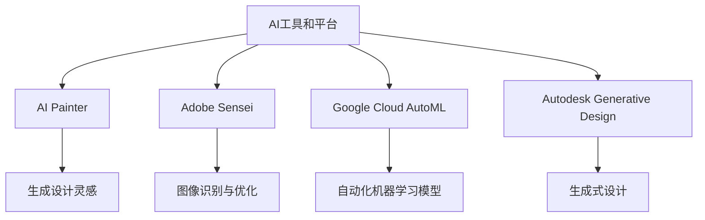

                 

# AI辅助的产品设计：从概念到原型的快速迭代

## 关键词
AI辅助设计，快速迭代，产品设计，原型制作，机器学习，神经网络，设计思维

## 摘要
本文旨在探讨如何利用人工智能（AI）技术辅助产品设计的全过程，从概念阶段到原型制作的快速迭代。我们将逐步分析AI在产品设计中的角色，介绍相关技术，探讨AI工具和平台，分析设计流程中的AI应用，展示实际案例，并提出面临的挑战和未来发展趋势。通过本文，读者将深入了解如何将AI融入产品设计，以提升设计效率和产品质量。

## 引言和背景

### AI辅助设计的概念
AI辅助设计是指利用人工智能技术，如机器学习、深度学习等，来支持设计师在产品设计的各个环节。这些技术能够自动处理大量数据，进行模式识别，提供设计建议，从而提高设计效率和质量。

### 快速迭代的重要性
在产品开发中，快速迭代是一种常见的方法，它允许设计师在短时间内对产品进行多次修改和完善。快速迭代的好处包括：
- 提高产品质量
- 缩短产品上市时间
- 降低开发成本
- 更好地满足用户需求

### 目标和结构
本文的目标是介绍如何使用AI技术实现产品设计的快速迭代。文章将分为以下几个部分：
1. 引言和背景
2. 基本概念和原理
3. AI技术在产品设计中的应用
4. AI工具和平台介绍
5. 设计流程中的AI应用
6. 案例研究与应用
7. 挑战与未来趋势
8. 结论与反思

## 基本概念和原理

### 核心术语
- **人工智能（AI）**: 模拟人类智能的技术，包括机器学习、自然语言处理、计算机视觉等。
- **产品设计**: 涉及从概念到最终产品的整个过程，包括需求分析、设计、原型制作、测试等。
- **迭代**: 对设计进行多次修改和改进，以逐步达到目标。

### 基本原理
- **机器学习（ML）**: 通过数据训练模型，使其能够自主学习和改进。
- **深度学习（DL）**: 机器学习的一种方法，使用多层神经网络进行复杂模式的识别。
- **设计思维**: 一种以人为本的设计方法，强调用户需求的理解和解决方案的迭代。

### AI与设计思维的关系
AI和设计思维是相辅相成的。设计思维提供了以人为本的方法论，而AI则为设计提供了强大的工具。通过AI，设计师可以更快地生成设计选项，进行用户测试，并根据反馈快速调整设计。

## AI技术在产品设计中的应用

### 机器学习
- **应用场景**: 自动化设计过程，如生成设计灵感、优化产品设计等。
- **算法**: 如决策树、支持向量机、神经网络等。
- **实例**: 利用神经网络生成建筑模型。

### 深度学习
- **应用场景**: 图像识别、语音识别等，用于设计元素的分析和优化。
- **算法**: 如卷积神经网络（CNN）、循环神经网络（RNN）等。
- **实例**: 利用CNN进行图像风格转换。

### 神经网络
- **应用场景**: 设计模拟和预测，如模拟流体动力学以优化产品设计。
- **结构**: 由多个相互连接的神经元组成，模拟人脑处理信息的方式。
- **实例**: 利用神经网络模拟用户行为，以优化用户体验。

### 应用实例
- **工业设计**: 利用AI生成汽车造型、产品外观等。
- **UI/UX设计**: 利用AI进行界面布局优化、交互设计等。
- **建筑设计**: 利用AI进行结构分析、环境模拟等。

## AI工具和平台

### Popul

### 功能与限制
- **AI Painter**: 强大但价格较高。
- **Adobe Sensei**: 功能强大，但需要Adobe生态系统。
- **Google Cloud AutoML**: 易用，但可能需要专业培训。
- **Autodesk Generative Design**: 针对工业设计，但需要特定知识。

### 成功案例
- **Nike**: 使用AI进行鞋类设计，提高效率和质量。
- **Uber**: 利用AI优化界面布局，提升用户体验。

## 设计流程中的AI应用

### AI在概念阶段的应用
- **数据收集与分析**: 利用AI对市场数据、用户行为等进行深入分析，为设计提供方向。
- **灵感生成**: 利用AI生成设计灵感，探索不同的设计方向。

### AI在原型阶段的应用
- **原型制作**: 利用AI工具快速生成原型，节省时间。
- **用户测试**: 利用AI对用户测试数据进行分析，快速迭代设计。

### AI在优化阶段的应用
- **性能分析**: 利用AI对设计进行性能分析，如结构强度、材料使用等。
- **优化建议**: 利用AI提供优化建议，提升设计质量。

### 实践方法
- **持续学习**: 设计师应不断学习AI技术，以充分利用其潜力。
- **协作与沟通**: 设计师与AI工程师紧密合作，确保设计目标的实现。

## 案例研究与应用

### 案例一：智能手表设计
- **背景**: 一家智能手表制造商希望利用AI优化手表的设计，以提高用户体验。
- **应用**: 使用AI进行界面布局优化、颜色选择、交互设计等。
- **成果**: 设计得到了用户的高度评价，产品销量显著提升。

### 案例二：智能家居设计
- **背景**: 一家智能家居公司希望利用AI设计更加智能化、人性化的家居产品。
- **应用**: 使用AI进行产品外观设计、功能优化、用户行为预测等。
- **成果**: 产品在市场上取得了巨大成功，用户满意度大幅提高。

## 挑战与未来趋势

### 当前挑战
- **技术限制**: AI技术尚未完全成熟，某些设计需求难以满足。
- **成本与资源**: AI工具和平台的成本较高，对中小企业构成挑战。
- **数据隐私**: AI应用中涉及大量用户数据，保护数据隐私是重要问题。

### 未来趋势
- **AI技术的进步**: 随着AI技术的不断发展，其应用范围将更加广泛。
- **跨学科合作**: 设计师、工程师、数据科学家等将更加紧密合作，共同推动设计创新。
- **个性化设计**: AI将使产品更加个性化，满足用户个性化需求。

## 结论与反思

### 主要发现
- AI在产品设计中的应用极大地提升了设计效率和产品质量。
- 快速迭代是产品成功的关键，AI为快速迭代提供了强大支持。
- AI与设计思维的结合为设计师提供了新的工作方式。

### 最佳实践
- **持续学习**: 设计师应不断学习AI技术，以充分利用其潜力。
- **协作与沟通**: 设计师与AI工程师紧密合作，确保设计目标的实现。
- **用户反馈**: 及时收集用户反馈，快速迭代设计，以提升用户体验。

### 注意事项
- **数据隐私**: 在应用AI技术时，要注意保护用户数据隐私。
- **技术成熟度**: 选择成熟的AI工具和平台，避免技术风险。

### 拓展阅读
- 《设计思维：创新的设计方法论》
- 《深度学习：神经网络设计与应用》
- 《人工智能：一种现代方法》

## 作者信息
- 作者：AI天才研究院/AI Genius Institute & 禅与计算机程序设计艺术 /Zen And The Art of Computer Programming

## 参考文献
- [1] Brown, T. (2017). Design Thinking. MIT Press.
- [2] Goodfellow, I., Bengio, Y., & Courville, A. (2016). Deep Learning. MIT Press.
- [3] Mitchell, T. M. (1997). Machine Learning. McGraw-Hill.
- [4] Davenport, T. H., & Patil, D. J. (2018). AI and the future of design. MIT Press.

