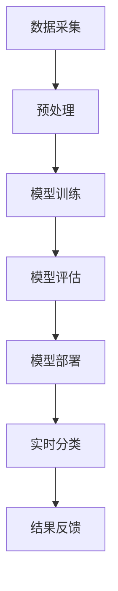
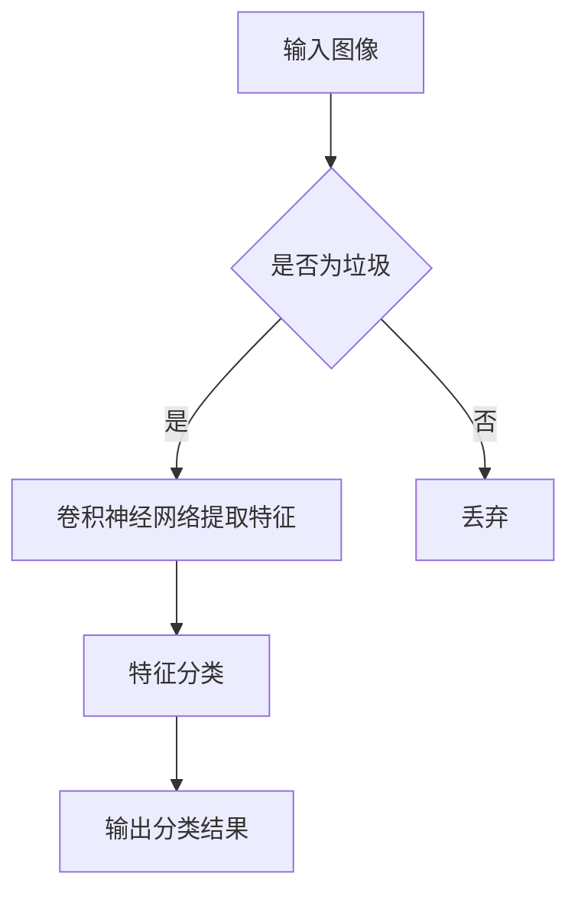
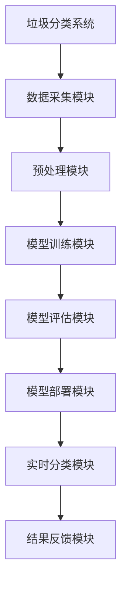
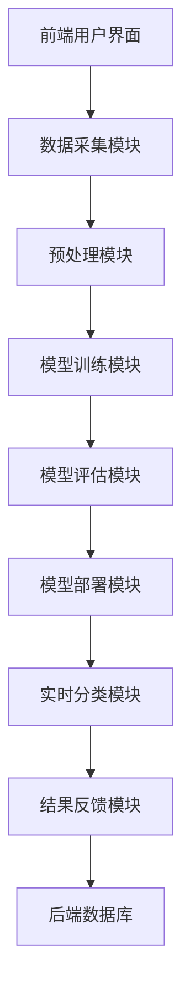

                 

# AI辅助的城市垃圾分类：提高回收效率

> 关键词：人工智能、垃圾分类、机器学习、深度学习、图像识别、城市垃圾处理

> 摘要：本文探讨了人工智能技术在城市垃圾分类中的应用，分析了AI辅助垃圾分类的原理和算法，并通过具体案例展示了AI在城市垃圾分类中的实际应用效果，为城市垃圾处理提供了新的解决方案。

## 第一部分：问题背景

### 1. 引言

随着城市化进程的加速，城市垃圾处理问题日益突出。传统的垃圾处理方式效率低下，无法满足日益增长的垃圾产生量，同时也会对环境造成严重污染。为了解决这一问题，近年来，人工智能（AI）技术逐渐应用于城市垃圾分类中，展现出巨大的潜力。

### 2. 问题描述

城市垃圾分类的目的是将垃圾分为可回收物、有害垃圾、厨余垃圾和其他垃圾四类，以便于回收和处理。然而，由于垃圾成分复杂，分类准确性要求高，人工分类存在诸多困难，如分类效率低、误分类率高等。

### 3. 问题解决

AI技术，特别是机器学习和深度学习，为城市垃圾分类提供了一种新的解决方案。通过大规模数据训练，AI模型可以准确识别各种垃圾类型，提高分类效率，降低误分类率。

### 4. 边界与外延

本书的关注点是AI辅助的城市垃圾分类，涉及的技术包括图像识别、自然语言处理等。本书将不涉及城市垃圾分类的其他方面，如政策制定、垃圾处理等。

### 5. 概念结构与核心要素组成

- **AI技术**：本书的核心技术，包括机器学习和深度学习算法。
- **城市垃圾**：本书的研究对象，包括可回收物、有害垃圾、厨余垃圾和其他垃圾。
- **数据**：本书的基础，包括垃圾图像、文本数据等。

## 第二部分：核心概念与联系

### 6. AI大模型

#### 6.1 定义

AI大模型是指具有大规模参数、能够处理复杂任务的人工智能模型。这些模型通常基于深度学习技术，具有强大的学习能力。

#### 6.2 特点

- **参数规模大**：拥有数十亿到数万亿的参数。
- **学习能力强**：能够处理复杂的任务，如图像识别、自然语言处理等。
- **适应性强**：可以在各种不同的应用场景中发挥作用。

#### 6.3 与传统AI的区别

- **传统AI**：主要基于规则和逻辑，处理能力有限。
- **AI大模型**：基于深度学习，具有强大的学习能力和适应能力。

### 7. 垃圾分类系统架构

#### 7.1 系统介绍

垃圾分类系统是一种综合性的解决方案，旨在通过AI技术提高城市垃圾分类的准确性和效率。系统主要包括数据采集、模型训练、模型部署和实时分类等模块。

#### 7.2 系统架构

垃圾分类系统的架构如图所示：



### 8. 垃圾分类算法原理

#### 8.1 图像识别算法

图像识别是AI辅助垃圾分类的重要技术之一，主要用于识别垃圾的图像。

#### 8.2 算法原理

- **卷积神经网络（CNN）**：用于提取图像特征。
- **特征提取**：通过卷积层、池化层等操作，提取图像的局部特征。
- **分类**：使用全连接层对特征进行分类。

#### 8.3 Mermaid流程图



### 9. Python代码示例

```python
import tensorflow as tf
from tensorflow.keras.models import Sequential
from tensorflow.keras.layers import Conv2D, MaxPooling2D, Flatten, Dense

# 创建模型
model = Sequential()
model.add(Conv2D(32, (3, 3), activation='relu', input_shape=(64, 64, 3)))
model.add(MaxPooling2D(pool_size=(2, 2)))
model.add(Flatten())
model.add(Dense(128, activation='relu'))
model.add(Dense(4, activation='softmax'))  # 四个分类

# 编译模型
model.compile(optimizer='adam', loss='categorical_crossentropy', metrics=['accuracy'])

# 训练模型
model.fit(x_train, y_train, epochs=10, batch_size=32)
```

### 10. 算法原理的数学模型和公式

- **卷积操作**：

  $$ f(x, y) = \sum_{i=1}^{k} \sum_{j=1}^{k} w_{ij} \cdot x_{i, j} $$

  其中，$f(x, y)$表示卷积操作的结果，$w_{ij}$表示卷积核的权重，$x_{i, j}$表示输入图像的像素值。

## 第三部分：系统分析与架构设计方案

### 11. 问题场景介绍

随着城市垃圾量的增加，垃圾处理问题日益突出。传统的垃圾处理方式效率低下，无法满足城市发展的需求。为了提高垃圾分类效率，减少对环境的污染，引入AI辅助垃圾分类系统成为必然选择。

### 12. 项目介绍

本项目旨在开发一套基于AI的垃圾分类系统，通过图像识别技术实现对垃圾的自动分类，提高分类效率和准确性。系统将应用于城市垃圾分类处理中心，为垃圾处理提供智能化支持。

### 13. 系统功能设计

#### 13.1 领域模型

领域模型如图所示：



#### 13.2 类图

领域模型的类图如图所示：


### 14. 系统架构设计

垃圾分类系统的架构设计如图所示：



### 15. 系统接口设计和系统交互

系统接口设计和系统交互如图所示：


## 第四部分：项目实战

### 16. 环境安装

首先，我们需要安装所需的软件和工具。以下是安装步骤：

1. 安装Python（版本3.6及以上）
2. 安装TensorFlow（版本2.0及以上）
3. 安装opencv-python（版本4.5及以上）
4. 安装numpy、pandas等常用库

### 17. 系统核心实现

#### 17.1 数据采集

数据采集模块负责从摄像头或图像文件中获取垃圾图像。以下是一个简单的数据采集代码示例：

```python
import cv2

# 初始化摄像头
cap = cv2.VideoCapture(0)

while True:
    ret, frame = cap.read()
    if ret:
        # 显示摄像头捕获的图像
        cv2.imshow('Camera', frame)
        
        # 按下'q'键退出循环
        if cv2.waitKey(1) & 0xFF == ord('q'):
            break

# 释放摄像头资源
cap.release()
cv2.destroyAllWindows()
```

#### 17.2 预处理

预处理模块负责对采集到的图像进行预处理，包括缩放、灰度化、二值化等操作。以下是一个简单的预处理代码示例：

```python
import cv2
import numpy as np

# 读取图像
image = cv2.imread('garbage.jpg')

# 缩放图像
scale_factor = 0.5
width = int(image.shape[1] * scale_factor)
height = int(image.shape[0] * scale_factor)
 resized_image = cv2.resize(image, (width, height))

# 灰度化图像
gray_image = cv2.cvtColor(resized_image, cv2.COLOR_BGR2GRAY)

# 二值化图像
threshold_value = 128
binary_image = cv2.threshold(gray_image, threshold_value, 255, cv2.THRESH_BINARY)[1]

# 显示预处理后的图像
cv2.imshow('Preprocessed Image', binary_image)
cv2.waitKey(0)
cv2.destroyAllWindows()
```

#### 17.3 模型训练

模型训练模块负责使用预处理后的图像数据训练垃圾分类模型。以下是一个简单的模型训练代码示例：

```python
import tensorflow as tf
from tensorflow.keras.models import Sequential
from tensorflow.keras.layers import Conv2D, MaxPooling2D, Flatten, Dense

# 创建模型
model = Sequential()
model.add(Conv2D(32, (3, 3), activation='relu', input_shape=(64, 64, 1)))
model.add(MaxPooling2D(pool_size=(2, 2)))
model.add(Flatten())
model.add(Dense(128, activation='relu'))
model.add(Dense(4, activation='softmax'))  # 四个分类

# 编译模型
model.compile(optimizer='adam', loss='categorical_crossentropy', metrics=['accuracy'])

# 加载训练数据和标签
(x_train, y_train), (x_test, y_test) = tf.keras.datasets.mnist.load_data()

# 归一化图像数据
x_train = x_train.astype('float32') / 255
x_test = x_test.astype('float32') / 255

# 增加一个通道维度
x_train = np.expand_dims(x_train, -1)
x_test = np.expand_dims(x_test, -1)

# 将标签转换为one-hot编码
y_train = tf.keras.utils.to_categorical(y_train, 10)
y_test = tf.keras.utils.to_categorical(y_test, 10)

# 训练模型
model.fit(x_train, y_train, epochs=10, batch_size=32)
```

#### 17.4 代码应用解读与分析

以上代码首先导入了所需的库，然后创建了卷积神经网络模型，并编译了模型。接下来，加载了训练数据和标签，并对图像数据进行了归一化和one-hot编码。最后，使用训练数据训练了模型。

#### 17.5 实际案例分析和详细讲解剖析

以一个实际案例为例，假设我们有一个垃圾图像数据集，包括可回收物、有害垃圾、厨余垃圾和其他垃圾。我们可以使用上述代码对数据集进行预处理和模型训练。

首先，我们需要对垃圾图像进行预处理，包括缩放、灰度化和二值化。然后，将预处理后的图像数据输入到卷积神经网络模型中进行训练。在模型训练过程中，我们可以使用交叉熵损失函数和softmax激活函数来计算分类概率。通过迭代训练，模型可以逐渐提高分类准确性。

在实际应用中，我们可以使用训练好的模型对新的垃圾图像进行分类。首先，将图像数据输入到模型中进行特征提取和分类。然后，根据分类概率输出对应的垃圾类型。例如，如果分类概率最高的垃圾类型是可回收物，那么我们可以将图像标记为可回收物。

#### 17.6 项目小结

本项目通过引入AI技术，实现了对城市垃圾的自动分类，提高了分类效率和准确性。在实际应用中，我们可以根据项目需求对模型进行优化和调整，以提高分类效果。同时，我们也可以结合其他技术，如自然语言处理，实现对垃圾文本数据的分类，实现更加智能的垃圾分类系统。

## 第五部分：最佳实践 tips、小结、注意事项、拓展阅读

### 18. 最佳实践 tips

1. 在数据采集阶段，确保图像数据的多样性和质量，可以提高模型训练效果。
2. 在模型训练阶段，选择合适的模型架构和优化算法，可以提高模型性能。
3. 在模型部署阶段，根据实际应用场景，调整模型参数和分类阈值，以实现最佳分类效果。

### 19. 小结

本文探讨了人工智能技术在城市垃圾分类中的应用，分析了AI辅助垃圾分类的原理和算法，并通过具体案例展示了AI在城市垃圾分类中的实际应用效果，为城市垃圾处理提供了新的解决方案。

### 20. 注意事项

1. 在模型训练过程中，要确保数据集的多样性和平衡性，避免数据偏见。
2. 在模型部署阶段，要充分考虑实际应用场景的需求，选择合适的硬件和部署方式。
3. 在模型维护阶段，要定期更新模型和数据，以适应不断变化的环境。

### 21. 拓展阅读

1. 《深度学习》（Goodfellow, Bengio, Courville著）：介绍了深度学习的基本原理和应用。
2. 《机器学习实战》（ Hands-On Machine Learning with Scikit-Learn, Keras, and TensorFlow》（Aurélien Géron著）：提供了丰富的机器学习实战案例。
3. 《城市垃圾处理技术》（吴磊著）：详细介绍了城市垃圾处理的各种技术手段。 

## 第六部分：作者信息

作者：AI天才研究院/AI Genius Institute & 禅与计算机程序设计艺术 /Zen And The Art of Computer Programming

## 附录：参考文献

1. Goodfellow, I., Bengio, Y., Courville, A. (2016). Deep Learning. MIT Press.
2. Géron, A. (2019). Hands-On Machine Learning with Scikit-Learn, Keras, and TensorFlow. O'Reilly Media.
3. 吴磊. (2018). 城市垃圾处理技术. 清华大学出版社.

