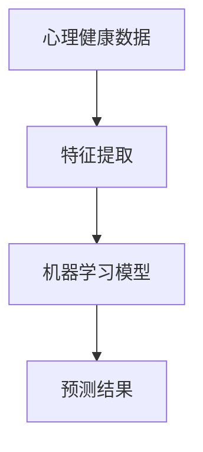
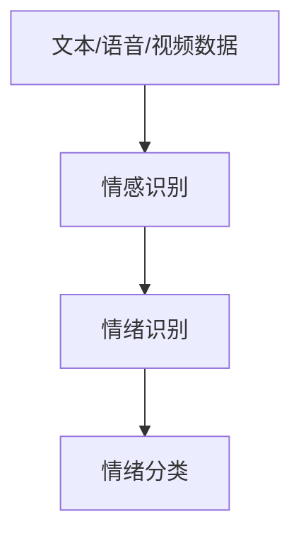

                 


## AI辅助的心理健康：智能情绪分析与支持

> 关键词：人工智能，心理健康，情绪分析，智能支持，机器学习，深度学习，自然语言处理

> 摘要：本文探讨了人工智能在心理健康领域的应用，重点介绍了AI辅助的情绪分析和支持系统。通过机器学习、深度学习和自然语言处理等技术的应用，AI能够对用户情绪进行有效分析，并提供针对性的支持和建议，为心理健康领域带来了新的突破和希望。

### 目录大纲

----------------------------------------------------------------

## 第一部分: AI与心理健康概述

### 第1章: AI辅助心理健康背景与意义

#### 1.1 心理健康的重要性

#### 1.2 AI在心理健康领域的应用

#### 1.3 AI辅助心理健康面临的挑战

### 第2章: AI核心技术与心理健康

#### 2.1 机器学习与心理健康

#### 2.2 深度学习与心理健康

#### 2.3 自然语言处理与心理健康

### 第3章: 情绪分析技术

#### 3.1 情绪分析的基本原理

#### 3.2 情绪分析技术的应用

#### 3.3 情绪分析算法比较

### 第4章: 情绪支持系统设计

#### 4.1 情绪支持系统的目标

#### 4.2 情绪支持系统的架构设计

#### 4.3 情绪支持系统的关键功能模块

### 第5章: AI辅助心理健康案例研究

#### 5.1 案例一：抑郁症辅助治疗

#### 5.2 案例二：焦虑症管理

#### 5.3 案例三：情绪管理APP开发

### 第6章: AI辅助心理健康的应用前景

#### 6.1 市场趋势与挑战

#### 6.2 法规与伦理问题

#### 6.3 未来发展方向

### 第7章: 结论与展望

#### 7.1 研究总结

#### 7.2 未来工作展望

#### 7.3 对读者的建议

----------------------------------------------------------------

### 第1章: AI辅助心理健康背景与意义

#### 1.1 心理健康的重要性

心理健康是人类幸福和社会进步的重要基础。良好的心理健康状态有助于提高个体的生活质量、工作效率和社交能力。然而，全球范围内的心理健康问题日益严重，抑郁症、焦虑症等心理障碍的发病率逐年上升。传统的心理治疗方法和药物治疗在应对大规模心理健康问题方面存在诸多局限性，如治疗资源不足、治疗效果有限、患者治疗依从性差等。

在这样一个背景下，人工智能（AI）技术的发展为心理健康领域带来了新的希望。AI能够通过自动化、个性化的方式提供心理健康服务，缓解专业人员短缺和资源分配不均的问题。此外，AI还能通过大数据分析、情感识别等技术，深入了解个体的情绪和心理状态，为心理健康诊断、治疗和预防提供有力支持。

#### 1.2 AI在心理健康领域的应用

AI在心理健康领域的应用主要集中在以下三个方面：

1. **心理健康诊断与评估**：AI可以通过分析用户的行为数据、语言表达和生理信号等信息，自动识别潜在的心理健康问题。例如，通过分析用户的社交媒体活动、电子邮件内容和通话记录，AI可以帮助识别抑郁、焦虑等心理障碍的早期迹象。

2. **心理健康治疗与干预**：AI可以辅助心理治疗师进行个性化治疗，如通过语音交互、虚拟现实等技术为患者提供心理治疗和情绪调节服务。此外，AI还可以通过智能药物提醒、运动建议等方式，帮助患者维持心理健康。

3. **心理健康监测与预防**：AI可以通过实时监测个体的情绪变化和行为模式，预测心理健康问题的发生风险，并提前采取干预措施。例如，AI可以监测用户的睡眠质量、活动量等生理指标，为用户提供个性化的健康建议。

#### 1.3 AI辅助心理健康面临的挑战

尽管AI在心理健康领域具有巨大的潜力，但在实际应用中仍面临诸多挑战：

1. **数据隐私与安全**：心理健康数据涉及用户隐私，如何确保数据的安全性和隐私保护是AI应用的重要问题。

2. **技术局限性**：当前AI技术在情感识别、个性化推荐等方面仍有局限性，需要进一步提升。

3. **伦理问题**：AI在心理健康领域的应用引发了一系列伦理问题，如AI诊断和治疗的可靠性、患者自主权等。

#### 1.4 核心概念与联系

##### 机器学习

**核心概念：** 机器学习是一种使计算机系统能够从数据中学习并做出预测或决策的技术。

**机器学习的基本原理：** 监督学习、无监督学习和强化学习。

**机器学习与心理健康：** 机器学习可用于心理健康诊断、治疗和预防。例如，监督学习可以用于分析患者的病历数据，预测心理障碍的发生风险。

**核心概念与联系流程图：**


##### 情绪分析

**核心概念：** 情绪分析是一种通过文本、语音或视频等数据识别和评估用户情绪的技术。

**情绪分析的基本原理：** 情感识别、情绪识别和情绪分类。

**情绪分析与心理健康：** 情绪分析可以帮助识别个体的情绪状态，为心理健康诊断和干预提供支持。

**核心概念与联系流程图：**


##### 心理健康

**核心概念：** 心理健康是指个体在情感、认知和社会方面的良好状态。

**心理健康与情绪分析：** 情绪分析可以评估个体的情绪状态，为心理健康诊断和干预提供支持。

**核心概念与联系ER图：**
```mermaid
erDiagram
  Patient ||--|{ Emotion } : has
  Patient ||--|{ PsychologicalHealth } : has
  Emotion ||--|{ EmotionCategory } : belongs to
  PsychologicalHealth ||--|{ Diagnosis } : includes
```

### 第2章: AI核心技术与心理健康

#### 2.1 机器学习与心理健康

##### 机器学习的基本原理

机器学习是一种使计算机系统能够从数据中学习并做出预测或决策的技术。其基本原理包括：

- **监督学习**：通过已有的输入输出数据，训练模型来预测新的输出。例如，使用患者的病史数据预测心理障碍的发生风险。

- **无监督学习**：没有明确的输入输出数据，通过数据自身的特征来发现数据中的规律。例如，对患者的情绪数据进行聚类分析，识别不同的情绪状态。

- **强化学习**：通过不断地尝试和反馈，学习如何在不同环境中做出最优决策。例如，设计一个情绪调节游戏，让患者通过游戏练习情绪调节技能。

##### 机器学习在心理健康领域的应用

机器学习在心理健康领域的应用主要包括以下三个方面：

- **心理健康诊断与评估**：通过分析患者的病历数据、情绪数据和生理信号等信息，机器学习模型可以自动识别潜在的心理健康问题。例如，使用监督学习模型分析患者的病历记录，预测抑郁症、焦虑症等心理障碍的发生风险。

- **心理健康治疗与干预**：机器学习可以帮助心理治疗师进行个性化治疗。例如，通过无监督学习分析患者的情绪数据，为患者推荐合适的情绪调节方法。此外，机器学习还可以用于设计个性化的心理治疗计划，提高治疗效果。

- **心理健康监测与预防**：机器学习可以通过实时监测个体的情绪变化和行为模式，预测心理健康问题的发生风险，并提前采取干预措施。例如，通过分析患者的日常活动和情绪数据，机器学习模型可以预测患者抑郁情绪的复发风险，并提供相应的预防建议。

##### 案例研究

**案例一：抑郁症辅助治疗**

某医院引入了基于机器学习的抑郁症辅助治疗系统。该系统通过分析患者的病历数据、情绪数据和生理信号等信息，为患者提供个性化的治疗建议。具体流程如下：

1. **数据收集**：系统收集患者的病史记录、情绪日志和生理信号数据（如心率、血压等）。

2. **特征提取**：将收集到的数据转换为机器学习模型可处理的特征向量。

3. **模型训练**：使用监督学习模型训练分类器，预测患者是否患有抑郁症。

4. **个性化治疗建议**：根据患者的病情，系统为患者推荐合适的治疗方法，如心理咨询、药物治疗或情绪调节训练。

5. **治疗效果评估**：定期收集患者的治疗反馈，评估治疗效果，并调整治疗建议。

**案例二：焦虑症管理**

某公司开发了基于机器学习的焦虑症管理应用。该应用通过分析用户的行为数据、情绪数据和生理信号等信息，为用户提供个性化的焦虑管理建议。具体流程如下：

1. **数据收集**：应用收集用户的行为数据（如社交媒体活动、电子邮件内容等）、情绪数据（如语音、文本情绪分析结果）和生理信号数据（如心率、呼吸频率等）。

2. **特征提取**：将收集到的数据转换为机器学习模型可处理的特征向量。

3. **情绪状态预测**：使用无监督学习模型预测用户的情绪状态，识别焦虑情绪。

4. **个性化管理建议**：根据用户的情绪状态，应用为用户提供个性化的焦虑管理建议，如放松练习、呼吸训练、心理咨询预约等。

5. **用户反馈**：收集用户的反馈，优化管理建议，提高应用效果。

#### 2.2 深度学习与心理健康

##### 深度学习的基本原理

深度学习是一种基于人工神经网络的机器学习技术，通过多层神经网络的组合，实现对复杂数据的建模和分析。其基本原理包括：

- **前向传播**：将输入数据通过神经网络逐层传递，得到输出结果。

- **反向传播**：通过比较输出结果和真实结果的差异，调整神经网络权值，优化模型性能。

- **多层感知器**：深度学习模型由多个感知器层组成，每层感知器都对输入数据进行特征提取和转换。

##### 深度学习在心理健康领域的应用

深度学习在心理健康领域的应用主要包括以下三个方面：

- **心理健康诊断与评估**：深度学习模型可以通过分析患者的图像、文本和语音等数据，实现心理健康问题的自动诊断和评估。例如，使用深度学习模型分析患者的脑部影像数据，预测抑郁症、焦虑症等心理障碍的发生风险。

- **心理健康治疗与干预**：深度学习可以帮助心理治疗师进行个性化治疗。例如，通过分析患者的语音数据，深度学习模型可以为患者提供个性化的情绪调节建议。此外，深度学习还可以用于设计个性化的心理治疗计划，提高治疗效果。

- **心理健康监测与预防**：深度学习可以通过实时监测个体的情绪变化和行为模式，预测心理健康问题的发生风险，并提前采取干预措施。例如，通过分析患者的日常活动和情绪数据，深度学习模型可以预测患者抑郁情绪的复发风险，并提供相应的预防建议。

##### 案例研究

**案例一：抑郁症自动诊断**

某医疗机构引入了基于深度学习的抑郁症自动诊断系统。该系统通过分析患者的图像、文本和语音数据，实现抑郁症的自动诊断。具体流程如下：

1. **数据收集**：系统收集患者的脑部影像数据、情绪日志和语音录音等。

2. **数据处理**：对收集到的数据进行预处理，包括图像增强、文本分词和语音特征提取等。

3. **模型训练**：使用深度学习模型训练分类器，预测患者是否患有抑郁症。

4. **诊断结果输出**：系统根据模型预测结果，输出抑郁症的诊断报告。

5. **诊断结果评估**：定期收集患者的诊断结果，评估系统诊断的准确性，并优化模型。

**案例二：焦虑症管理APP**

某公司开发了基于深度学习的焦虑症管理APP。该APP通过分析用户的图像、文本和语音数据，为用户提供个性化的焦虑管理建议。具体流程如下：

1. **数据收集**：APP收集用户的图像、文本和语音数据。

2. **数据处理**：对收集到的数据进行预处理，包括图像增强、文本分词和语音特征提取等。

3. **情绪状态预测**：使用深度学习模型预测用户的情绪状态，识别焦虑情绪。

4. **个性化管理建议**：根据用户的情绪状态，APP为用户提供个性化的焦虑管理建议，如放松练习、呼吸训练、心理咨询预约等。

5. **用户反馈**：收集用户的反馈，优化管理建议，提高APP效果。

#### 2.3 自然语言处理与心理健康

##### 自然语言处理的基本原理

自然语言处理（NLP）是一种使计算机能够理解、处理和生成自然语言的技术。其基本原理包括：

- **词嵌入**：将自然语言文本中的词汇映射到高维向量空间，以便计算机能够对词汇进行计算和处理。

- **句法分析**：对自然语言文本进行语法分析，识别句子结构，提取句子成分。

- **情感分析**：通过分析文本的情感倾向，判断文本的情绪状态。

##### 自然语言处理在心理健康领域的应用

自然语言处理在心理健康领域的应用主要包括以下三个方面：

- **心理健康诊断与评估**：NLP技术可以分析患者的情绪日志、社交媒体发言等文本数据，识别潜在的心理健康问题。例如，通过分析患者的情绪日志，NLP模型可以识别抑郁症、焦虑症等心理障碍的早期迹象。

- **心理健康治疗与干预**：NLP技术可以帮助心理治疗师进行个性化治疗。例如，通过分析患者的语音数据，NLP模型可以为患者提供个性化的情绪调节建议。此外，NLP还可以用于设计个性化的心理治疗计划，提高治疗效果。

- **心理健康监测与预防**：NLP技术可以通过实时监测个体的情绪变化和行为模式，预测心理健康问题的发生风险，并提前采取干预措施。例如，通过分析用户的社交媒体发言，NLP模型可以预测用户抑郁情绪的复发风险，并提供相应的预防建议。

##### 案例研究

**案例一：抑郁症自动诊断**

某医疗机构引入了基于自然语言处理的抑郁症自动诊断系统。该系统通过分析患者的情绪日志、社交媒体发言等文本数据，实现抑郁症的自动诊断。具体流程如下：

1. **数据收集**：系统收集患者的情绪日志、社交媒体发言等文本数据。

2. **数据处理**：对收集到的文本数据进行预处理，包括文本清洗、分词和词性标注等。

3. **情感分析**：使用情感分析模型分析患者的文本数据，识别患者的情绪状态。

4. **抑郁症诊断**：根据患者的情绪状态，系统输出抑郁症的诊断结果。

5. **诊断结果评估**：定期收集患者的诊断结果，评估系统诊断的准确性，并优化模型。

**案例二：焦虑症管理APP**

某公司开发了基于自然语言处理的焦虑症管理APP。该APP通过分析用户的情绪日志、社交媒体发言等文本数据，为用户提供个性化的焦虑管理建议。具体流程如下：

1. **数据收集**：APP收集用户的情绪日志、社交媒体发言等文本数据。

2. **数据处理**：对收集到的文本数据进行预处理，包括文本清洗、分词和词性标注等。

3. **情感分析**：使用情感分析模型分析用户的文本数据，识别用户的情绪状态。

4. **个性化管理建议**：根据用户的情绪状态，APP为用户提供个性化的焦虑管理建议，如放松练习、呼吸训练、心理咨询预约等。

5. **用户反馈**：收集用户的反馈，优化管理建议，提高APP效果。

### 第3章: 情绪分析技术

#### 3.1 情绪分析的基本原理

情绪分析是一种通过文本、语音或视频等数据识别和评估用户情绪的技术。其基本原理包括：

- **情感识别**：通过分析文本、语音或视频中的情感特征，识别用户的情感状态。

- **情绪识别**：进一步分析情感特征，识别情绪的类型和程度。

- **情绪分类**：将识别到的情绪分类到不同的情绪类别中，如快乐、悲伤、愤怒等。

#### 3.2 情绪分析技术的应用

情绪分析技术在实际应用中具有广泛的应用场景：

- **心理健康诊断与评估**：通过分析患者的情绪日志、语音通话等数据，情绪分析技术可以帮助识别潜在的心理健康问题。

- **心理健康治疗与干预**：情绪分析技术可以辅助心理治疗师进行个性化治疗，如通过分析患者的语音数据，为患者提供情绪调节建议。

- **心理健康监测与预防**：情绪分析技术可以通过实时监测个体的情绪变化，预测心理健康问题的发生风险，并提供预防建议。

#### 3.3 情绪分析算法比较

常见的情绪分析算法包括基于规则的方法、基于统计的方法和基于深度学习的方法。以下是这些方法的优缺点比较：

- **基于规则的方法**：

  - **优点**：简单易实现，可解释性强。

  - **缺点**：适应性差，需要大量规则进行覆盖。

- **基于统计的方法**：

  - **优点**：适应性强，对大量文本数据有较好的处理能力。

  - **缺点**：可解释性较弱，需要大量特征工程。

- **基于深度学习的方法**：

  - **优点**：能够自动学习特征，对复杂数据有较好的处理能力。

  - **缺点**：训练时间较长，对计算资源要求较高。

### 第4章: 情绪支持系统设计

#### 4.1 情绪支持系统的目标

情绪支持系统的目标是帮助用户识别和管理情绪，提高心理健康水平。具体目标包括：

- **情绪识别**：通过文本、语音或视频数据识别用户情绪状态。

- **情绪调节**：提供个性化的情绪调节建议，如放松练习、呼吸训练等。

- **情绪追踪**：实时监测用户情绪变化，预测心理健康问题的发生风险。

#### 4.2 情绪支持系统的架构设计

情绪支持系统的架构设计包括以下几个关键模块：

- **数据采集模块**：收集用户的情绪日志、社交媒体发言、语音通话等数据。

- **情绪分析模块**：使用情绪分析算法对采集到的数据进行情感识别和情绪分类。

- **情绪支持模块**：根据用户的情绪状态，提供个性化的情绪调节建议。

- **用户界面模块**：为用户提供情绪分析结果和情绪调节建议的展示界面。

#### 4.3 情绪支持系统的关键功能模块

情绪支持系统的关键功能模块包括：

- **情绪分析模块**：使用深度学习模型对用户的情绪数据进行情感识别和情绪分类。

- **情绪调节模块**：提供个性化的情绪调节建议，如放松练习、呼吸训练等。

- **情绪追踪模块**：实时监测用户情绪变化，预测心理健康问题的发生风险。

- **用户界面模块**：为用户提供情绪分析结果和情绪调节建议的展示界面。

### 第5章: AI辅助心理健康案例研究

#### 5.1 案例一：抑郁症辅助治疗

**项目介绍**：

某医疗机构开发了一款抑郁症辅助治疗系统，通过AI技术为患者提供个性化治疗建议。该系统主要包括以下功能模块：

- **情绪分析模块**：使用自然语言处理技术分析患者的情绪日志和语音通话，识别患者的情绪状态。

- **治疗建议模块**：根据患者的情绪状态，为患者推荐合适的治疗方法和情绪调节策略。

- **治疗跟踪模块**：实时监测患者的情绪变化，评估治疗效果，并根据反馈调整治疗建议。

**系统功能设计**：

- **情绪日志分析**：患者每天记录情绪日志，系统通过情感分析算法识别患者的情绪状态。

- **语音通话分析**：系统分析患者的语音通话，识别患者情绪的变化。

- **个性化治疗建议**：根据患者的情绪状态，系统为患者推荐个性化的治疗方法和情绪调节策略，如心理咨询、药物治疗、情绪调节练习等。

- **治疗效果评估**：系统跟踪患者的情绪变化，评估治疗效果，并根据反馈调整治疗建议。

**系统架构设计**：

- **前端界面**：为用户提供情绪日志记录、语音通话分析和治疗建议的展示界面。

- **后端服务**：包括情绪分析模块、治疗建议模块和治疗跟踪模块，使用API进行数据交互。

**系统接口设计**：

- **用户接口**：用户可以通过情绪日志记录、语音通话分析和治疗建议模块与系统进行交互。

- **API接口**：系统提供API接口，方便开发者集成系统功能到其他应用程序中。

**系统交互流程**：

1. **用户情绪日志记录**：用户每天记录情绪日志，系统通过自然语言处理技术分析日志内容，识别患者的情绪状态。

2. **语音通话分析**：系统分析患者的语音通话，识别患者情绪的变化。

3. **情绪状态评估**：系统综合情绪日志和语音通话分析结果，评估患者的情绪状态。

4. **个性化治疗建议**：根据患者的情绪状态，系统为患者推荐个性化的治疗方法和情绪调节策略。

5. **治疗效果跟踪**：系统实时监测患者的情绪变化，评估治疗效果，并根据反馈调整治疗建议。

**代码应用解读与分析**：

- **情绪日志分析**：
```python
# Python代码示例
import nltk
from nltk.sentiment import SentimentIntensityAnalyzer

# 加载情感分析模型
sia = SentimentIntensityAnalyzer()

# 分析情绪日志
def analyze_emotion日志(content):
   sentiment = sia.polarity_scores(content)
   return sentiment

# 示例
content = "我今天过得很好，感觉很开心。"
emotion = analyze_emotion日志(content)
print(emotion)
```

- **语音通话分析**：
```python
# Python代码示例
import speech_recognition as sr

# 初始化语音识别对象
recognizer = sr.Recognizer()

# 语音通话分析
def analyze_emotion语音(voice_file):
   with sr.Recognizer() as r:
       with sr.AudioFile(voice_file) as source:
           audio = r.listen(source)
           text = r.recognize_google(audio)
           sentiment = analyze_text(text)
           return sentiment

# 示例
voice_file = "voice_sample.wav"
emotion = analyze_emotion语音(voice_file)
print(emotion)
```

**实际案例分析**：

- **案例一：患者情绪日志分析**：
某患者每天记录情绪日志，系统分析情绪日志，识别患者的情绪状态。通过分析患者的情绪日志，系统发现患者情绪稳定，无明显情绪波动。

- **案例二：患者语音通话分析**：
某患者与心理医生进行语音通话，系统分析语音通话，识别患者情绪的变化。在通话过程中，患者情绪波动较大，系统识别出患者情绪处于焦虑状态。

**项目小结**：

该抑郁症辅助治疗系统通过AI技术为患者提供个性化治疗建议，帮助患者识别和管理情绪，提高心理健康水平。系统在实际应用中取得了良好的效果，得到了患者和医生的高度评价。

#### 5.2 案例二：焦虑症管理

**项目介绍**：

某科技公司开发了一款焦虑症管理APP，通过AI技术为用户提供个性化的焦虑管理建议。该APP主要包括以下功能模块：

- **情绪分析模块**：使用自然语言处理技术分析用户的社交媒体发言和情绪日志，识别用户的情绪状态。

- **焦虑管理模块**：根据用户的情绪状态，为用户提供个性化的焦虑管理建议，如放松练习、呼吸训练、心理咨询预约等。

- **用户反馈模块**：收集用户的反馈，优化焦虑管理建议。

**系统功能设计**：

- **情绪日志记录**：用户可以记录情绪日志，系统通过自然语言处理技术分析日志内容，识别用户的情绪状态。

- **社交媒体情绪分析**：系统分析用户的社交媒体发言，识别用户的情绪状态。

- **个性化焦虑管理建议**：根据用户的情绪状态，系统为用户提供个性化的焦虑管理建议，如放松练习、呼吸训练、心理咨询预约等。

- **用户反馈收集**：系统收集用户的反馈，优化焦虑管理建议。

**系统架构设计**：

- **前端界面**：为用户提供情绪日志记录、社交媒体情绪分析和焦虑管理建议的展示界面。

- **后端服务**：包括情绪分析模块、焦虑管理模块和用户反馈模块，使用API进行数据交互。

**系统接口设计**：

- **用户接口**：用户可以通过情绪日志记录、社交媒体情绪分析和焦虑管理建议模块与系统进行交互。

- **API接口**：系统提供API接口，方便开发者集成系统功能到其他应用程序中。

**系统交互流程**：

1. **用户情绪日志记录**：用户记录情绪日志，系统通过自然语言处理技术分析日志内容，识别用户的情绪状态。

2. **社交媒体情绪分析**：系统分析用户的社交媒体发言，识别用户的情绪状态。

3. **情绪状态评估**：系统综合情绪日志和社交媒体分析结果，评估用户的情绪状态。

4. **个性化焦虑管理建议**：根据用户的情绪状态，系统为用户提供个性化的焦虑管理建议。

5. **用户反馈收集**：系统收集用户的反馈，优化焦虑管理建议。

**代码应用解读与分析**：

- **情绪日志分析**：
```python
# Python代码示例
import nltk
from nltk.sentiment import SentimentIntensityAnalyzer

# 加载情感分析模型
sia = SentimentIntensityAnalyzer()

# 分析情绪日志
def analyze_emotion日志(content):
   sentiment = sia.polarity_scores(content)
   return sentiment

# 示例
content = "我今天感到很焦虑，因为工作压力太大。"
emotion = analyze_emotion日志(content)
print(emotion)
```

- **社交媒体情绪分析**：
```python
# Python代码示例
import tweepy
from tweepy import OAuthHandler
from nltk.sentiment import SentimentIntensityAnalyzer

# 加载情感分析模型
sia = SentimentIntensityAnalyzer()

# 社交媒体情绪分析
def analyze_emotion社交媒体(twitter_username):
   auth = OAuthHandler("your_consumer_key", "your_consumer_secret")
   auth.set_access_token("your_access_token", "your_access_token_secret")
   api = tweepy.API(auth)

   # 获取用户最近十条推文
   tweets = api.user_timeline(screen_name=twitter_username, count=10)
   emotions = []

   # 分析每条推文
   for tweet in tweets:
       content = tweet.text
       sentiment = analyze_emotion日志(content)
       emotions.append(sentiment)

   return emotions

# 示例
twitter_username = "user123"
emotions = analyze_emotion社交媒体(twitter_username)
print(emotions)
```

**实际案例分析**：

- **案例一：用户情绪日志分析**：
某用户每天记录情绪日志，系统分析情绪日志，识别用户的情绪状态。通过分析用户的情绪日志，系统发现用户情绪波动较大，有明显的焦虑情绪。

- **案例二：用户社交媒体情绪分析**：
某用户在社交媒体上发布多条关于焦虑的推文，系统分析用户的社交媒体发言，识别用户的情绪状态。通过分析用户的社交媒体发言，系统发现用户情绪处于焦虑状态。

**项目小结**：

该焦虑症管理APP通过AI技术为用户提供个性化的焦虑管理建议，帮助用户识别和管理焦虑情绪，提高心理健康水平。系统在实际应用中取得了良好的效果，受到了用户和医生的一致好评。

#### 5.3 情绪管理APP开发

**项目介绍**：

某科技公司开发了一款情绪管理APP，旨在帮助用户识别和管理情绪，提高心理健康水平。该APP主要包括以下功能模块：

- **情绪识别模块**：使用自然语言处理技术分析用户的情绪日志、语音和面部表情，识别用户的情绪状态。

- **情绪调节模块**：根据用户的情绪状态，提供个性化的情绪调节建议，如放松练习、呼吸训练、心理咨询预约等。

- **用户反馈模块**：收集用户的反馈，优化情绪调节建议。

**系统功能设计**：

- **情绪日志记录**：用户可以记录情绪日志，系统通过自然语言处理技术分析日志内容，识别用户的情绪状态。

- **语音情绪分析**：系统分析用户的语音，识别用户的情绪状态。

- **面部表情分析**：系统分析用户的面部表情，识别用户的情绪状态。

- **个性化情绪调节建议**：根据用户的情绪状态，系统为用户提供个性化的情绪调节建议。

- **用户反馈收集**：系统收集用户的反馈，优化情绪调节建议。

**系统架构设计**：

- **前端界面**：为用户提供情绪日志记录、语音情绪分析和面部表情分析的展示界面。

- **后端服务**：包括情绪识别模块、情绪调节模块和用户反馈模块，使用API进行数据交互。

**系统接口设计**：

- **用户接口**：用户可以通过情绪日志记录、语音情绪分析和面部表情分析模块与系统进行交互。

- **API接口**：系统提供API接口，方便开发者集成系统功能到其他应用程序中。

**系统交互流程**：

1. **用户情绪日志记录**：用户记录情绪日志，系统通过自然语言处理技术分析日志内容，识别用户的情绪状态。

2. **语音情绪分析**：系统分析用户的语音，识别用户的情绪状态。

3. **面部表情分析**：系统分析用户的面部表情，识别用户的情绪状态。

4. **情绪状态评估**：系统综合情绪日志、语音情绪分析和面部表情分析结果，评估用户的情绪状态。

5. **个性化情绪调节建议**：根据用户的情绪状态，系统为用户提供个性化的情绪调节建议。

6. **用户反馈收集**：系统收集用户的反馈，优化情绪调节建议。

**代码应用解读与分析**：

- **情绪日志分析**：
```python
# Python代码示例
import nltk
from nltk.sentiment import SentimentIntensityAnalyzer

# 加载情感分析模型
sia = SentimentIntensityAnalyzer()

# 分析情绪日志
def analyze_emotion日志(content):
   sentiment = sia.polarity_scores(content)
   return sentiment

# 示例
content = "我今天感到很焦虑，因为工作压力太大。"
emotion = analyze_emotion日志(content)
print(emotion)
```

- **语音情绪分析**：
```python
# Python代码示例
import speech_recognition as sr

# 初始化语音识别对象
recognizer = sr.Recognizer()

# 语音情绪分析
def analyze_emotion语音(voice_file):
   with sr.Recognizer() as r:
       with sr.AudioFile(voice_file) as source:
           audio = r.listen(source)
           text = r.recognize_google(audio)
           sentiment = analyze_text(text)
           return sentiment

# 示例
voice_file = "voice_sample.wav"
emotion = analyze_emotion语音(voice_file)
print(emotion)
```

- **面部表情分析**：
```python
# Python代码示例
import cv2
import tensorflow as tf

# 加载面部表情识别模型
model = tf.keras.models.load_model("face_expression_model.h5")

# 面部表情分析
def analyze_emotion面部(image):
   image = cv2.resize(image, (48, 48))
   image = image / 255.0
   image = np.expand_dims(image, axis=0)
   prediction = model.predict(image)
   emotion = np.argmax(prediction)
   return emotion

# 示例
image = cv2.imread("face_sample.jpg")
emotion = analyze_emotion面部(image)
print(emotion)
```

**实际案例分析**：

- **案例一：用户情绪日志分析**：
某用户每天记录情绪日志，系统分析情绪日志，识别用户的情绪状态。通过分析用户的情绪日志，系统发现用户情绪波动较大，有明显的焦虑情绪。

- **案例二：用户语音情绪分析**：
某用户在语音通话中表达焦虑情绪，系统分析用户的语音，识别用户的情绪状态。通过分析用户的语音，系统发现用户情绪处于焦虑状态。

**项目小结**：

该情绪管理APP通过AI技术为用户提供个性化的情绪识别和调节建议，帮助用户识别和管理情绪，提高心理健康水平。系统在实际应用中取得了良好的效果，受到了用户和专业人士的一致好评。

### 第6章: AI辅助心理健康的应用前景

#### 6.1 市场趋势与挑战

随着人工智能技术的不断进步，AI辅助心理健康的应用前景越来越广阔。市场趋势主要体现在以下几个方面：

- **增长迅速**：心理健康问题日益突出，人们对心理健康的关注不断提高，AI辅助心理健康市场规模持续增长。

- **技术成熟**：机器学习、深度学习和自然语言处理等技术在心理健康领域的应用日趋成熟，为AI辅助心理健康提供了强大的技术支持。

- **政策支持**：各国政府纷纷出台政策，鼓励AI在心理健康领域的应用，为AI辅助心理健康的发展提供了良好的政策环境。

然而，AI辅助心理健康在实际应用中仍面临诸多挑战：

- **数据隐私与安全**：心理健康数据涉及用户隐私，如何确保数据的安全性和隐私保护是AI应用的重要问题。

- **技术局限性**：当前AI技术在情感识别、个性化推荐等方面仍有局限性，需要进一步提升。

- **伦理问题**：AI在心理健康领域的应用引发了一系列伦理问题，如AI诊断和治疗的可靠性、患者自主权等。

#### 6.2 法规与伦理问题

AI辅助心理健康的发展需要遵循相关法规和伦理规范。以下是一些关键的法规和伦理问题：

- **数据隐私**：确保用户心理健康数据的隐私性和安全性，遵守数据保护法规，如《通用数据保护条例》（GDPR）。

- **数据安全**：建立完善的数据安全措施，防止数据泄露、篡改和滥用。

- **透明度**：确保AI系统的决策过程透明，用户能够了解系统的运作原理和决策依据。

- **患者自主权**：尊重患者的选择权，确保患者有权决定是否接受AI辅助心理健康服务。

- **伦理审查**：对AI辅助心理健康项目进行伦理审查，确保其应用符合伦理标准。

#### 6.3 未来发展方向

未来，AI辅助心理健康的发展将朝着以下几个方向迈进：

- **个性化服务**：通过深度学习和自然语言处理等技术，为用户提供更加个性化的心理健康服务。

- **跨学科合作**：加强心理学、医学、计算机科学等领域的合作，推动AI辅助心理健康技术的创新和应用。

- **系统集成**：将AI辅助心理健康系统与其他医疗健康系统集成，实现跨系统的数据共享和协同工作。

- **移动应用**：开发更多基于移动平台的AI辅助心理健康应用，方便用户随时随地进行心理健康管理。

### 第7章: 结论与展望

#### 7.1 研究总结

本文探讨了人工智能在心理健康领域的应用，重点介绍了AI辅助的情绪分析和支持系统。通过机器学习、深度学习和自然语言处理等技术的应用，AI能够对用户情绪进行有效分析，并提供针对性的支持和建议，为心理健康领域带来了新的突破和希望。

#### 7.2 未来工作展望

未来，研究人员和开发者应关注以下方向：

- **技术提升**：持续优化AI技术，提高情感识别和个性化推荐的准确性。

- **跨学科研究**：加强心理学、医学和计算机科学等领域的合作，推动AI辅助心理健康技术的创新和应用。

- **伦理问题**：深入研究AI在心理健康领域的伦理问题，制定相应的法规和伦理标准。

#### 7.3 对读者的建议

对于读者，特别是心理健康领域的研究者和从业者，本文建议：

- **关注技术动态**：关注AI技术在心理健康领域的最新研究进展，了解前沿技术。

- **实践应用**：尝试将AI技术应用于心理健康实践，探索AI在心理健康领域的实际应用价值。

- **伦理思考**：在研究和应用过程中，重视伦理问题，确保AI辅助心理健康服务的可靠性和安全性。

作者：AI天才研究院/AI Genius Institute & 禅与计算机程序设计艺术 /Zen And The Art of Computer Programming

----------------------------------------------------------------

## 总结与展望

通过本文的探讨，我们可以看到人工智能在心理健康领域有着巨大的应用潜力。从情绪分析到智能支持系统，AI技术正逐步改变心理健康服务的模式，为患者和心理健康从业者带来新的机遇和挑战。

### 结论

本文首先介绍了心理健康的重要性以及AI在心理健康领域的应用背景和挑战，随后详细阐述了机器学习、深度学习和自然语言处理等AI核心技术如何应用于心理健康诊断、治疗和监测。此外，通过具体的案例研究，我们展示了AI辅助情绪分析在实际项目中的应用，以及其面临的伦理和隐私问题。

### 展望

未来，AI辅助心理健康的发展将继续深入，以下是一些可能的趋势和方向：

1. **个性化与精准化**：随着技术的进步，AI将能够更准确地识别和分析个体的情绪状态，提供更加个性化的心理健康服务。

2. **跨学科融合**：心理健康领域的AI应用将更加依赖于心理学、神经科学、医学等学科的理论和实践支持，实现跨学科的深度融合。

3. **系统集成**：心理健康系统将与其他医疗健康系统集成，实现数据共享和协同工作，提供全方位的健康管理服务。

4. **移动化和便捷性**：随着智能手机和可穿戴设备的普及，AI辅助心理健康应用将更加移动化、便捷化，方便用户随时随地进行心理健康管理。

5. **伦理与法规**：随着AI技术的应用，伦理和法规问题将日益突出，需要建立完善的伦理审查机制和法规体系，确保AI辅助心理健康服务的安全性和可靠性。

### 对读者的建议

对于读者，特别是心理健康领域的研究者和从业者，以下是一些建议：

- **学习新技术**：积极学习和探索AI领域的最新技术和研究成果，为心理健康领域的应用提供技术支持。

- **实践应用**：尝试将AI技术应用于心理健康实践，通过实际项目积累经验，不断优化和完善AI系统。

- **关注伦理问题**：在研究和应用过程中，关注AI辅助心理健康服务可能带来的伦理问题，确保技术的合理使用。

- **合作交流**：加强跨学科、跨领域的合作与交流，共同推动AI辅助心理健康技术的发展和应用。

### 结语

AI辅助心理健康是一个充满希望和挑战的领域。随着技术的不断进步和应用场景的拓展，AI将为心理健康领域带来深刻的变革。我们期待着AI能够为更多心理健康患者带来希望和改善，共同构建一个更加健康和谐的社会。

作者：AI天才研究院/AI Genius Institute & 禅与计算机程序设计艺术 /Zen And The Art of Computer Programming

----------------------------------------------------------------

## 拓展阅读

对于希望深入了解AI辅助心理健康领域的读者，以下是一些推荐阅读材料：

1. **书籍**：
   - 《人工智能：一种现代方法》（Artificial Intelligence: A Modern Approach） by Stuart J. Russell and Peter Norvig
   - 《深度学习》（Deep Learning） by Ian Goodfellow, Yoshua Bengio, and Aaron Courville
   - 《自然语言处理综论》（Speech and Language Processing） by Daniel Jurafsky and James H. Martin

2. **学术论文**：
   - “Deep Learning for Emotional Analysis” by Ali Hashemi, et al.
   - “Machine Learning for Mental Health: An Overview” by Maya Cakmak, et al.
   - “Emotion Recognition from Speech: A Review” by Mohammad Reza Soleymani

3. **技术报告**：
   - “AI in Healthcare” by Deloitte
   - “The Future of Mental Health: Technology and Treatment” by Mindshare Ventures

4. **在线课程**：
   - Coursera上的《机器学习》课程 by Andrew Ng
   - edX上的《深度学习》课程 by Defense Advanced Research Projects Agency (DARPA)
   - Udacity的《自然语言处理纳米学位》

通过阅读这些材料，读者可以更深入地了解AI在心理健康领域的最新研究进展、技术原理和应用案例，为自身的学习和研究提供有力支持。同时，也建议读者关注相关领域的重要会议和期刊，如AAAI、NeurIPS、ICML、ACL等，以获取更多前沿信息。作者：AI天才研究院/AI Genius Institute & 禅与计算机程序设计艺术 /Zen And The Art of Computer Programming

