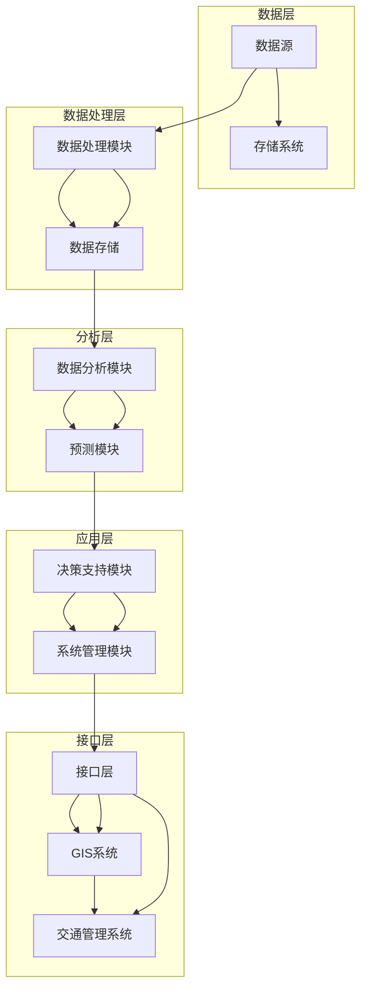
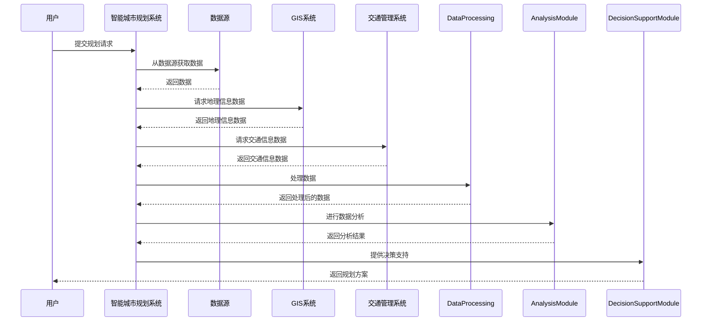

                 

### 引言：AI辅助的智能城市规划的背景与重要性

随着全球城市化进程的加速，城市面临诸多挑战，如交通拥堵、环境污染、资源紧缺等。传统的城市规划方法已难以应对这些复杂且动态的问题。为此，人工智能（AI）技术的引入为智能城市规划带来了全新的机遇。AI能够通过数据分析和预测，帮助城市规划者更有效地利用土地资源、优化交通流量、改善环境质量，从而实现城市的可持续发展。

本文旨在探讨AI辅助的智能城市规划，详细阐述其核心概念、应用原理、算法实现及实际案例。文章将从以下几个方面展开：

1. **智能城市规划的挑战与机遇**：介绍智能城市规划的背景，讨论AI在城市规划中的潜力。
2. **AI辅助城市规划的核心概念与联系**：分析AI在城市规划中的核心概念，如机器学习、深度学习等，并阐述它们在城市规划中的应用原理。
3. **AI算法原理讲解**：详细介绍AI算法在城市规划中的应用，包括土地使用优化、交通流量预测和环境监测与管理等，并提供相关的数学模型和Python源代码示例。
4. **系统分析与架构设计**：介绍智能城市规划系统的架构设计，包括领域模型、系统架构、接口设计和交互序列图。
5. **项目实战与案例分析**：通过具体项目实战，展示AI辅助城市规划的实际应用，并分析项目的成功经验和不足之处。
6. **最佳实践与项目小结**：总结智能城市规划的最佳实践，并对项目的整体效果进行评估和展望。

通过这篇文章，读者将全面了解AI辅助的智能城市规划的技术原理、实施方法和未来发展前景，为从事城市规划和技术开发的专业人员提供有价值的参考。

### 关键词

- **AI辅助城市规划**
- **智能城市**
- **土地使用优化**
- **交通流量预测**
- **环境监测与管理**
- **机器学习**
- **深度学习**
- **算法原理**
- **系统架构设计**
- **项目实战案例**

### 摘要

本文深入探讨了AI辅助的智能城市规划，介绍了其核心概念、应用原理、算法实现及实际案例。通过对城市化进程中的挑战和机遇的分析，文章阐述了AI在城市规划中的重要性，包括机器学习、深度学习等技术在土地使用优化、交通流量预测和环境监测与管理中的应用。同时，文章详细介绍了智能城市规划系统的架构设计，并通过具体项目实战展示了AI辅助城市规划的实际应用效果。最终，文章总结了最佳实践并展望了未来的发展方向，为智能城市规划提供了全面的指导。

## 第一部分：问题背景与核心概念

### 第1章：智能城市规划的挑战与机遇

智能城市规划，是指利用先进的人工智能技术，如机器学习、深度学习、数据挖掘等，对城市发展的各个方面进行综合分析、预测和优化。随着全球城市化进程的加速，城市面临诸多挑战，如交通拥堵、环境污染、资源紧缺等。这些问题不仅影响了城市居民的生活质量，还对城市的可持续发展提出了严峻挑战。传统的城市规划方法往往依赖于经验数据和历史记录，难以应对这些复杂且动态的问题。因此，智能城市规划的概念应运而生，为城市的发展提供了全新的思路和工具。

#### 问题背景

- **城市化进程加速**：全球范围内，城市化进程正在加速，越来越多的国家和地区出现了城市化率超过70%的情况。城市化带来了人口密度增加、城市规模扩张，但同时也伴随着一系列的问题，如交通拥堵、环境污染、住房紧张等。
- **现有城市规划的不足**：传统的城市规划方法往往依赖于经验数据和历史记录，缺乏科学性和系统性。城市规划者往往难以全面掌握城市各个方面的信息，导致规划结果存在局限性。
- **AI在城市规划中的潜力**：人工智能技术具有强大的数据处理和分析能力，能够从海量数据中提取有价值的信息，并利用这些信息进行预测和优化。通过引入AI技术，城市规划者可以更精准地分析城市问题，制定更有效的解决方案。

#### 核心概念

- **智能城市规划**：智能城市规划是指利用人工智能技术，对城市发展的各个方面进行综合分析、预测和优化的过程。它不仅仅是城市规划的技术升级，更是城市规划理念的创新。
- **AI辅助**：AI辅助是指利用人工智能技术，辅助城市规划者进行数据分析和决策的过程。AI技术可以处理海量数据，发现潜在的问题和趋势，为城市规划提供科学依据。
- **机器学习**：机器学习是一种人工智能技术，通过训练模型，让计算机从数据中学习规律和模式，从而进行预测和决策。
- **深度学习**：深度学习是机器学习的一个子领域，通过构建深度神经网络，对数据进行层次化的特征提取和建模，具有强大的学习和表达能力。

#### 边界与外延

- **智能城市规划的技术范畴**：智能城市规划涉及多个技术领域，包括数据挖掘、机器学习、深度学习、计算机视觉等。这些技术共同作用于城市规划的各个环节，实现智能化的解决方案。
- **智能城市规划的适用范围**：智能城市规划适用于各种规模的城市，从大城市到中小城市，从发展中国家到发达国家。不同城市面临的问题不同，但智能城市规划提供了一套通用的技术框架，可以适应各种情况。

#### 概念结构与核心要素组成

- **城市规划**：传统城市规划是指依据城市发展的需求和目标，制定城市的发展规划。传统规划方法主要依赖于专家经验和统计数据，缺乏科学性和系统性。
- **AI在城市规划中的应用**：AI在城市规划中的应用主要体现在以下几个方面：
  - **数据采集与处理**：利用AI技术，可以高效地采集和处理城市各类数据，如交通流量、空气质量、人口密度等，为城市规划提供丰富的数据支持。
  - **预测与优化**：通过机器学习和深度学习模型，可以对城市未来的发展趋势进行预测，并基于预测结果进行优化，制定更科学的城市规划方案。
  - **决策支持**：AI技术可以帮助城市规划者进行数据分析和决策支持，减少人为判断的误差，提高规划的科学性和准确性。

### 核心要素组成

- **数据收集与处理**：智能城市规划的基础是数据，包括城市的交通流量、人口密度、环境质量等数据。通过AI技术，可以高效地收集和处理这些数据，为规划提供基础信息。
- **模型构建与优化**：基于数据，利用机器学习和深度学习算法，构建预测和优化的模型。这些模型可以用于模拟城市的发展趋势，预测未来的交通流量，优化土地使用等。
- **决策支持**：通过AI技术，城市规划者可以更精准地分析城市问题，制定科学的规划方案。AI技术可以帮助减少人为判断的误差，提高规划的科学性和准确性。

#### 背景介绍

随着城市化进程的加速，城市面临着越来越多的挑战，如交通拥堵、环境污染、资源紧缺等。这些问题不仅影响了城市居民的生活质量，还对城市的可持续发展提出了严峻挑战。传统的城市规划方法已难以应对这些复杂且动态的问题。因此，引入人工智能技术成为解决这些问题的有效途径。

智能城市规划的核心目标是利用人工智能技术，对城市发展的各个方面进行综合分析、预测和优化，从而实现城市的可持续发展。通过AI技术，城市规划者可以更精准地分析城市问题，制定更有效的解决方案，提高城市规划的科学性和准确性。

智能城市规划涉及多个技术领域，包括数据挖掘、机器学习、深度学习、计算机视觉等。这些技术共同作用于城市规划的各个环节，实现智能化的解决方案。通过AI技术，城市规划者可以高效地采集和处理城市各类数据，利用机器学习和深度学习模型进行预测和优化，为城市规划提供科学依据。

总的来说，智能城市规划为解决城市化进程中遇到的问题提供了全新的思路和工具。通过引入AI技术，城市规划者可以更有效地利用土地资源、优化交通流量、改善环境质量，从而实现城市的可持续发展。智能城市规划不仅是一项技术的升级，更是一种城市规划理念的革新。

### AI辅助城市规划的潜在应用场景

人工智能技术在城市规划中有着广泛的应用场景，以下是几个主要的应用领域：

#### 土地使用优化

土地是城市发展的核心资源，如何高效利用土地资源成为城市规划的重要问题。AI技术可以通过分析土地利用数据，识别出土地使用的最佳模式。例如，通过机器学习算法，可以预测不同地区的人口增长趋势，从而优化住宅、商业和工业用地的分布。具体应用场景包括：

- **住宅区规划**：通过分析人口密度和居住需求，优化住宅区的布局，避免过度开发或土地闲置。
- **商业区规划**：基于消费者行为数据和商业活动趋势，确定商业区的最佳位置和规模，提高商业效益。

#### 交通流量预测

交通拥堵是城市面临的另一个重大问题，AI技术可以帮助预测和优化交通流量，减少拥堵和交通事故。例如：

- **实时交通监控**：利用计算机视觉和传感器技术，实时监测城市道路的交通流量和状态。
- **预测交通流量**：通过历史数据和机器学习算法，预测未来不同时间段的交通流量，为交通管理部门提供决策支持。

#### 环境监测与管理

城市环境的质量直接影响居民的生活质量。AI技术可以实时监测城市环境，如空气质量、水质等，并提供相应的管理建议。例如：

- **空气质量监测**：通过传感器网络和机器学习模型，实时监测空气质量，预测污染源，并提出污染控制措施。
- **水资源管理**：利用AI技术分析水资源的使用情况，预测水资源需求，优化水资源的分配和利用。

#### 公共设施规划

AI技术还可以用于公共设施的规划和管理，提高公共服务的质量和效率。例如：

- **教育资源优化**：通过分析学生分布和学校资源，优化学校的布局，确保教育资源均衡分配。
- **医疗资源管理**：利用AI技术分析医疗需求，优化医院和诊所的布局，提高医疗服务的可及性和效率。

#### 城市安全监控

城市安全是城市规划的重要内容。AI技术可以通过视频监控和图像识别，实时监控城市的安全状况。例如：

- **智能监控**：利用计算机视觉和深度学习模型，识别异常行为和潜在威胁，提高城市的安全管理水平。
- **紧急响应**：通过实时数据分析和预测，快速响应突发事件，提高应急响应的效率。

总的来说，AI技术在城市规划中的应用潜力巨大。通过数据分析和预测，AI技术可以帮助城市规划者更科学地制定和优化规划方案，提高城市的发展质量和居民的生活质量。

#### 概念属性特征对比表格

为了更好地理解AI在城市规划中的应用，我们将AI技术和传统城市规划方法进行对比，列出各自的概念属性特征：

| 概念             | 特征                 | 对比                 |
|------------------|----------------------|----------------------|
| 传统城市规划     | 依赖经验数据和历史记录 | 数据依赖性较低         |
|                 | 主观性强，易受人为因素影响 | 更客观，减少人为判断误差 |
|                 | 调查、分析和评估周期长   | 快速响应，实时分析     |
|                 | 强调短期效益           | 注重长期可持续性       |
| AI辅助城市规划   | 利用AI技术分析海量数据   | 数据处理能力强大       |
|                 | 强大的预测和优化能力     | 精准性和效率高         |
|                 | 易于集成多种技术和工具   | 系统复杂性较高         |
|                 | 注重长期可持续性         | 与传统规划方法互补     |

通过对比可以发现，AI辅助城市规划在数据处理能力、预测和优化能力、系统复杂性和长期可持续性等方面具有明显优势。然而，AI辅助城市规划也需要面对系统复杂性和技术依赖性等挑战，需要与传统规划方法相结合，发挥各自的优势。

#### ER实体关系图架构

在智能城市规划系统中，不同实体之间的关系构成了一个复杂的网络。为了更好地理解和设计这些关系，我们可以通过ER（实体关系）图来描述。以下是智能城市规划系统中主要实体的ER图：

```mermaid
erDiagram
  User ..|> Planner : 计划者
  User ..|> Citizen : 居民
  User ..|> Visitor : 访问者
  Planner ||--|> City : 城市
  City ||--|> Area : 地区
  Area ||--|> Building : 建筑物
  Building ||--|> Residential : 住宅
  Building ||--|> Commercial : 商业
  Building ||--|> Industrial : 工业
  City ||--|> Traffic : 交通
  Traffic ||--|> Road : 道路
  Road ||--|> TrafficFlow : 交通流量
  Road ||--|> Accident : 事故
  City ||--|> Environment : 环境
  Environment ||--|> AirQuality : 空气质量
  Environment ||--|> WaterQuality : 水质
  Environment ||--|> WasteManagement : 垃圾管理
```

在这个ER图中，主要实体包括用户（User）、计划者（Planner）、居民（Citizen）、访问者（Visitor）、城市（City）、地区（Area）、建筑物（Building）、住宅（Residential）、商业（Commercial）、工业（Industrial）、交通（Traffic）、道路（Road）、交通流量（TrafficFlow）、事故（Accident）、环境（Environment）、空气质量（AirQuality）、水质（WaterQuality）和垃圾管理（WasteManagement）。

实体之间的关系描述如下：

- **用户与计划者**：用户可以是计划者或居民，计划者负责制定和优化城市规划。
- **城市与地区**：城市包含多个地区，每个地区包含多个建筑物。
- **建筑物与功能**：建筑物分为住宅、商业和工业三种类型，分别对应住宅、商业和工业用途。
- **交通与道路**：交通系统包括道路和交通流量，道路是交通流量发生的基础。
- **环境与监测**：环境系统包括空气质量、水质和垃圾管理，用于监测和管理城市环境。

通过ER图，我们可以清晰地了解智能城市规划系统中各实体的关系和交互，为系统的设计和管理提供参考。

#### 城市规划中的AI技术应用

人工智能技术广泛应用于城市规划的各个阶段，从数据收集、处理到模型构建和优化，AI技术都在其中扮演了关键角色。以下将详细探讨AI技术在城市规划中的具体应用，包括数据收集与处理、预测与优化、决策支持等。

#### 数据收集与处理

数据是智能城市规划的基础。AI技术在数据收集和处理方面具有显著优势，能够高效地采集和处理各种类型的数据，为城市规划提供丰富的数据支持。以下是几种常见的数据收集与处理方法：

- **传感器数据**：利用传感器网络，实时监测城市环境、交通流量、空气质量等数据。传感器数据可以通过物联网（IoT）技术传输到数据中心，进行进一步处理和分析。
- **卫星影像**：利用卫星影像获取城市的高分辨率图像，通过计算机视觉技术识别建筑、道路、绿地等城市要素。卫星影像可以提供城市规划所需的宏观视角，帮助规划者了解城市的整体布局和结构。
- **社会数据**：通过社交媒体、在线调查、居民反馈等渠道，收集城市居民的生活习惯、出行需求、消费行为等数据。这些数据可以帮助规划者更好地了解城市居民的需求，制定更贴近实际需求的规划方案。

#### 预测与优化

AI技术在预测与优化方面具有强大的能力，能够通过数据分析和建模，预测城市未来的发展趋势，并优化城市的资源配置。以下是一些典型的预测与优化应用：

- **人口预测**：利用机器学习算法，分析历史人口数据、经济指标、城市规划政策等因素，预测城市未来的人口增长趋势。人口预测可以帮助规划者合理规划住宅区、商业区等用地，避免过度开发和资源浪费。
- **交通流量预测**：通过分析历史交通流量数据、事件（如大型活动、交通事故）等因素，预测未来不同时间段、不同路段的交通流量。交通流量预测可以帮助交通管理部门优化交通信号控制，减少拥堵和交通事故。
- **环境质量预测**：利用环境监测数据，结合气象条件、污染源等信息，预测未来一段时间内城市的空气质量、水质等环境质量指标。环境质量预测可以帮助城市规划者采取相应的环境管理措施，改善城市环境质量。

#### 决策支持

AI技术还可以为城市规划者提供决策支持，帮助他们在复杂的环境中进行科学决策。以下是一些常见的决策支持应用：

- **城市规划方案评估**：通过构建多目标优化模型，分析不同城市规划方案在土地使用、交通流量、环境质量等方面的表现。城市规划方案评估可以帮助规划者选择最优的规划方案。
- **资源分配优化**：利用优化算法，优化城市资源的分配，如土地、水资源、能源等。资源分配优化可以帮助提高资源利用效率，减少浪费。
- **灾害预测与应急响应**：通过分析气象数据、地质数据等，预测自然灾害的发生风险，为应急管理部门提供决策支持，制定有效的应急预案。

#### AI技术在城市规划中的应用实例

以下是一些具体的AI技术在城市规划中的应用实例：

- **新加坡智慧国项目**：新加坡利用AI技术进行城市规划，通过数据分析和预测，优化交通流量、环境质量和资源分配。例如，新加坡的智能交通系统利用实时交通数据，优化交通信号控制，减少拥堵。
- **纽约市环境监测项目**：纽约市利用AI技术进行环境监测，通过卫星影像和传感器数据，实时监测空气质量、水质等指标，并采取相应的管理措施，改善城市环境。
- **中国智慧城市项目**：中国多个城市利用AI技术进行智慧城市建设，通过大数据分析和机器学习模型，优化交通流量、能源消耗和公共服务。

总的来说，AI技术在城市规划中具有广泛的应用前景。通过数据收集与处理、预测与优化、决策支持等技术，AI可以帮助城市规划者更科学、更高效地制定和实施城市规划，提高城市的发展质量和居民的生活质量。

### 第2章：AI辅助城市规划的核心概念与联系

#### AI在城市规划中的应用原理

人工智能技术在城市规划中的应用，主要基于其对海量数据的处理和分析能力，以及高效决策支持系统的构建。以下将详细探讨机器学习、深度学习等核心概念，以及它们在AI辅助城市规划中的应用原理。

##### 机器学习

机器学习是一种通过数据训练模型，使计算机具备自主学习和预测能力的技术。其基本原理是通过算法从已有数据中学习规律，从而在新数据上进行预测和决策。机器学习在城市规划中的应用主要包括以下几个方面：

- **预测分析**：利用历史数据和现有数据，通过机器学习算法预测未来城市的发展趋势。例如，通过分析人口统计数据、经济增长指标等，预测城市未来的人口增长、交通需求等。
- **模式识别**：通过机器学习算法，识别城市中的潜在问题和模式。例如，利用图像识别技术，识别城市中的违章建筑、交通拥堵等。
- **数据分类**：将城市中的各类数据（如交通流量、环境质量等）进行分类，帮助规划者更好地理解和分析数据。例如，利用决策树、支持向量机等算法，对交通流量数据分类，以便进行流量管理和优化。

##### 深度学习

深度学习是机器学习的一个子领域，通过构建深度神经网络，对数据进行层次化的特征提取和建模。深度学习在城市规划中的应用主要包括以下几个方面：

- **图像识别与处理**：利用深度学习算法，对卫星影像、监控视频等进行图像识别和处理。例如，利用卷积神经网络（CNN）识别城市中的道路、建筑物等，为交通流量分析和环境监测提供基础。
- **语音识别与处理**：通过深度学习算法，实现语音识别和语义分析。例如，利用循环神经网络（RNN）和长短期记忆网络（LSTM），实现城市居民的语音反馈分析，为城市规划提供参考。
- **时序分析**：利用深度学习算法，对时间序列数据进行分析和预测。例如，利用长短时记忆网络（LSTM）和门控循环单元（GRU），预测交通流量、环境质量等时序数据。

##### 应用原理

AI在城市规划中的应用原理，主要体现在以下几个方面：

1. **数据驱动的决策**：通过数据收集和分析，AI技术能够为城市规划者提供科学依据，使决策过程更加客观和高效。
2. **自适应性和灵活性**：AI技术可以根据实时数据和环境变化，动态调整城市规划方案，提高规划的灵活性和适应性。
3. **多层次特征提取**：深度学习技术能够从原始数据中提取多层次的特征，帮助规划者更深入地理解和分析城市问题。
4. **实时监控与预警**：通过实时数据监控和分析，AI技术可以及时发现城市中的问题，并提前预警，为规划者提供及时的管理建议。

##### 应用案例

以下是一些典型的AI在城市规划中的应用案例：

- **交通流量预测**：利用深度学习算法，对历史交通流量数据进行分析和预测，为交通管理部门提供决策支持，优化交通信号控制和道路规划。
- **环境质量监测**：利用机器学习算法，分析环境监测数据，预测空气质量、水质等环境质量指标，为环境管理部门提供预警和管理建议。
- **住宅区规划**：通过数据分析和机器学习算法，预测住宅需求，优化住宅区的布局和设计，提高居住环境的舒适度和安全性。

总的来说，AI技术在城市规划中的应用，不仅提升了规划的科学性和准确性，也为城市规划者提供了强大的决策支持工具。通过不断探索和应用，AI技术将在未来城市发展中发挥越来越重要的作用。

### 土地使用优化算法

土地使用优化是智能城市规划中的一个关键任务，其核心在于如何高效地分配和利用城市土地资源，以满足不同功能和需求。以下将详细介绍几种常见的土地使用优化算法，包括遗传算法、模拟退火算法等，并阐述其原理和实现步骤。

#### 遗传算法

遗传算法（Genetic Algorithm，GA）是一种基于生物进化原理的优化算法，它通过模拟自然进化过程，逐步寻找最优解。遗传算法的核心思想是选择、交叉、变异和生存竞争。

1. **原理**：

   - **选择**：根据个体适应度选择优胜的个体进入下一代。
   - **交叉**：将两个或多个父代个体进行组合，生成新的子代。
   - **变异**：对个体进行随机修改，增加种群的多样性。
   - **生存竞争**：通过适应度评估，筛选出最优的个体。

2. **实现步骤**：

   - **编码**：将土地使用方案编码成染色体，如二进制编码或实值编码。
   - **初始化种群**：随机生成初始种群，每个个体代表一种土地使用方案。
   - **适应度评估**：计算每个个体的适应度，适应度越高表示该方案越优。
   - **选择**：根据适应度选择优胜的个体进入下一代。
   - **交叉**：对选择的个体进行交叉操作，生成新的子代。
   - **变异**：对子代进行变异操作，增加种群的多样性。
   - **迭代**：重复上述步骤，直到满足终止条件（如达到最大迭代次数或适应度达到阈值）。

#### 模拟退火算法

模拟退火算法（Simulated Annealing，SA）是一种基于物理退火过程的优化算法。它通过模拟温度下降的过程，逐步降低解的约束，从而避免陷入局部最优。

1. **原理**：

   - **初始状态**：设定一个较高的初始温度，允许较大的搜索范围。
   - **降温过程**：逐步降低温度，缩小搜索范围。
   - **接受准则**：在每次迭代中，根据概率接受或拒绝新解。

2. **实现步骤**：

   - **初始化**：设定初始温度和降温率，随机生成初始解。
   - **评估适应度**：计算初始解的适应度。
   - **迭代过程**：
     - 在每次迭代中，生成一个新的解。
     - 计算新解与当前解的适应度差。
     - 根据接受准则，决定是否接受新解。
     - 根据降温率降低温度。
     - 重复迭代，直到满足终止条件（如达到最大迭代次数或温度低于阈值）。

#### Python实现示例

以下是一个简单的遗传算法实现示例，用于土地使用优化问题：

```python
import random
import numpy as np

# 遗传算法参数设置
population_size = 100
染色体长度 = 100
迭代次数 = 1000
交叉率 = 0.8
变异率 = 0.05

# 编码
def encode(solution):
    return [1 if i < solution else 0 for i in range(染色体长度)]

# 适应度评估
def fitness(solution):
    # 假设land_use_function是一个衡量土地使用效率的函数
    return land_use_function(solution)

# 随机初始化种群
def initialize_population():
    return [encode(random.random() < 0.5) for _ in range(population_size)]

# 交叉操作
def crossover(parent1, parent2):
    point = random.randint(1,染色体长度 - 1)
    child1 = parent1[:point] + parent2[point:]
    child2 = parent2[:point] + parent1[point:]
    return child1, child2

# 变异操作
def mutate(solution):
    for i in range(染色体长度):
        if random.random() < 变异率:
            solution[i] = 1 - solution[i]
    return solution

# 遗传算法主函数
def genetic_algorithm():
    population = initialize_population()
    for _ in range(迭代次数):
        new_population = []
        for _ in range(int(population_size / 2)):
            parent1, parent2 = random.sample(population, 2)
            child1, child2 = crossover(parent1, parent2)
            new_population.extend([mutate(child1), mutate(child2)])
        population = new_population
        best_solution = max(population, key=fitness)
        print(f"迭代次数 {_ + 1}: 适应度 {fitness(best_solution)}")
    return best_solution

# 运行遗传算法
best_solution = genetic_algorithm()
print(f"最优解：{best_solution}, 适应度：{fitness(best_solution)}")
```

在这个示例中，我们定义了遗传算法的初始化种群、适应度评估、交叉操作、变异操作和主函数。通过调整参数，可以应用于不同的土地使用优化问题。

总的来说，遗传算法和模拟退火算法都是有效的土地使用优化算法。它们通过模拟自然进化过程和物理退火过程，逐步寻找最优解。在实际应用中，可以根据具体问题调整算法参数，提高优化效果。

### 交通流量预测算法

交通流量预测是智能城市规划中的关键任务，其核心在于通过分析历史交通数据，预测未来不同时间段和不同路段的交通流量。以下将详细介绍几种常见的交通流量预测算法，包括时间序列分析、回归分析等，并阐述其原理和实现步骤。

#### 时间序列分析

时间序列分析是一种基于历史时间数据，通过识别数据中的趋势、季节性和周期性等特征，进行预测的方法。常见的时间序列模型包括ARIMA（自回归积分滑动平均模型）和LSTM（长短期记忆网络）。

1. **ARIMA模型**：

   - **原理**：ARIMA模型通过自回归（AR）、差分（I）和移动平均（MA）组合，对时间序列数据进行建模。ARIMA模型能够捕捉时间序列数据中的趋势、季节性和随机波动。
   - **实现步骤**：
     - **数据预处理**：对原始交通流量数据进行预处理，包括数据清洗、缺失值处理和季节性调整。
     - **模型选择**：通过ACF（自相关函数）和PACF（偏自相关函数）图，选择合适的ARIMA模型参数（p, d, q）。
     - **模型拟合**：使用历史数据对ARIMA模型进行拟合，得到模型参数。
     - **预测**：使用拟合后的模型，对未来交通流量进行预测。

2. **LSTM模型**：

   - **原理**：LSTM是深度学习中的循环神经网络（RNN）的一种，能够捕捉时间序列数据中的长期依赖关系。LSTM通过引入门控机制，有效解决了传统RNN的梯度消失和梯度爆炸问题。
   - **实现步骤**：
     - **数据预处理**：对原始交通流量数据进行预处理，包括数据清洗、缺失值处理和标准化。
     - **模型构建**：使用TensorFlow或PyTorch等深度学习框架，构建LSTM模型。
     - **模型训练**：使用历史数据对LSTM模型进行训练，调整模型参数。
     - **预测**：使用训练好的模型，对未来交通流量进行预测。

#### 回归分析

回归分析是一种基于历史数据，通过建立回归模型，预测未来数据的方法。常见的回归模型包括线性回归、多项式回归等。

1. **线性回归**：

   - **原理**：线性回归通过建立因变量和自变量之间的线性关系模型，预测未来数据。线性回归模型简单直观，易于理解和实现。
   - **实现步骤**：
     - **数据预处理**：对原始交通流量数据进行预处理，包括数据清洗、缺失值处理和标准化。
     - **模型构建**：使用统计方法，建立线性回归模型。
     - **模型训练**：使用历史数据对线性回归模型进行训练，得到模型参数。
     - **预测**：使用训练好的模型，对未来交通流量进行预测。

2. **多项式回归**：

   - **原理**：多项式回归通过建立因变量和自变量之间的多项式关系模型，预测未来数据。多项式回归能够捕捉数据中的非线性关系。
   - **实现步骤**：
     - **数据预处理**：对原始交通流量数据进行预处理，包括数据清洗、缺失值处理和标准化。
     - **模型构建**：使用统计方法，建立多项式回归模型。
     - **模型训练**：使用历史数据对多项式回归模型进行训练，得到模型参数。
     - **预测**：使用训练好的模型，对未来交通流量进行预测。

#### Python实现示例

以下是一个简单的LSTM模型实现示例，用于交通流量预测：

```python
import numpy as np
import pandas as pd
from sklearn.preprocessing import MinMaxScaler
from keras.models import Sequential
from keras.layers import LSTM, Dense

# 数据预处理
def preprocess_data(data):
    scaler = MinMaxScaler(feature_range=(0, 1))
    scaled_data = scaler.fit_transform(data)
    return scaled_data

# LSTM模型构建
def build_lstm_model(input_shape):
    model = Sequential()
    model.add(LSTM(units=50, return_sequences=True, input_shape=input_shape))
    model.add(LSTM(units=50))
    model.add(Dense(units=1))
    model.compile(optimizer='adam', loss='mean_squared_error')
    return model

# 训练LSTM模型
def train_lstm_model(model, X_train, y_train):
    model.fit(X_train, y_train, epochs=100, batch_size=32, verbose=1)
    return model

# 预测
def predict_traffic(model, data):
    scaled_data = preprocess_data(data)
    predicted_traffic = model.predict(scaled_data)
    return predicted_traffic

# 示例数据
data = pd.read_csv('traffic_data.csv')
traffic_data = data['traffic'].values

# LSTM模型训练与预测
input_shape = (1, 1)
model = build_lstm_model(input_shape)
X_train = preprocess_data(traffic_data[:int(len(traffic_data) * 0.8)])
y_train = traffic_data[:int(len(traffic_data) * 0.8)]
model = train_lstm_model(model, X_train, y_train)
predicted_traffic = predict_traffic(model, traffic_data[int(len(traffic_data) * 0.8):])

print(predicted_traffic)
```

在这个示例中，我们首先进行数据预处理，然后构建LSTM模型，并使用历史交通数据训练模型，最后进行交通流量预测。

总的来说，时间序列分析和回归分析都是有效的交通流量预测方法。时间序列分析能够捕捉数据中的趋势和周期性，而回归分析能够捕捉数据中的线性关系。在实际应用中，可以根据具体问题选择合适的方法，并利用Python等工具实现预测模型。

### 环境监测与管理算法

环境监测与管理是智能城市规划的重要组成部分，其核心在于实时监测城市环境质量，如空气质量、水质和垃圾管理，并采取相应的管理措施，以改善城市环境质量。以下将详细介绍几种常见的环境监测与管理算法，包括机器学习分类、聚类分析等，并阐述其原理和实现步骤。

#### 机器学习分类

机器学习分类算法可以通过学习历史数据，将新的环境监测数据分类到不同的类别中。常见的方法包括决策树、支持向量机和朴素贝叶斯等。

1. **决策树**：

   - **原理**：决策树通过构建一棵树形结构模型，根据特征值对数据进行分类。决策树的每个节点表示一个特征，每个分支表示该特征的不同取值，最终叶节点表示类别。
   - **实现步骤**：
     - **数据预处理**：对原始环境监测数据进行预处理，包括数据清洗、缺失值处理和特征提取。
     - **模型训练**：使用历史环境监测数据训练决策树模型，得到每个节点的划分规则。
     - **分类预测**：使用训练好的模型对新的环境监测数据分类，预测其类别。

2. **支持向量机（SVM）**：

   - **原理**：支持向量机通过寻找一个最优的超平面，将不同类别的数据分隔开来。SVM的核心在于求解一个最优的决策边界，使得分类间隔最大化。
   - **实现步骤**：
     - **数据预处理**：对原始环境监测数据进行预处理，包括数据清洗、缺失值处理和特征标准化。
     - **模型训练**：使用历史环境监测数据训练SVM模型，得到最优的超平面参数。
     - **分类预测**：使用训练好的模型对新的环境监测数据进行分类，预测其类别。

3. **朴素贝叶斯**：

   - **原理**：朴素贝叶斯通过计算每个特征对类别的条件概率，利用贝叶斯定理进行分类。朴素贝叶斯假设特征之间相互独立，从而简化计算过程。
   - **实现步骤**：
     - **数据预处理**：对原始环境监测数据进行预处理，包括数据清洗、缺失值处理和特征提取。
     - **模型训练**：使用历史环境监测数据训练朴素贝叶斯模型，计算每个特征的先验概率和条件概率。
     - **分类预测**：使用训练好的模型对新的环境监测数据进行分类，计算每个类别的后验概率，选择概率最大的类别作为预测结果。

#### 聚类分析

聚类分析是一种无监督学习方法，通过将相似的数据点分组，从而实现对数据结构的理解和分析。常见的聚类算法包括K-means、层次聚类等。

1. **K-means**：

   - **原理**：K-means算法通过将数据点划分为K个簇，使得每个簇内的数据点之间的距离最小，簇与簇之间的距离最大。K-means算法的核心在于确定簇的数量和簇的中心。
   - **实现步骤**：
     - **数据预处理**：对原始环境监测数据进行预处理，包括数据清洗、缺失值处理和特征标准化。
     - **初始化簇中心**：随机选择K个数据点作为初始簇中心。
     - **分配数据点**：将每个数据点分配到最近的簇中心，计算簇的中心。
     - **迭代更新**：重复分配数据点和更新簇中心的过程，直到聚类结果稳定。
     - **聚类评价**：使用指标（如轮廓系数）评价聚类效果。

2. **层次聚类**：

   - **原理**：层次聚类通过逐步合并或分裂现有的簇，构建一棵层次树，从而实现对数据的层次化聚类。层次聚类可以分为凝聚层次聚类和分裂层次聚类。
   - **实现步骤**：
     - **数据预处理**：对原始环境监测数据进行预处理，包括数据清洗、缺失值处理和特征标准化。
     - **初始化聚类**：选择一种方法（如最近邻法）初始化聚类。
     - **合并或分裂**：根据聚类准则，逐步合并或分裂簇，构建层次树。
     - **聚类评价**：使用指标（如距离系数）评价聚类效果。

#### Python实现示例

以下是一个简单的K-means聚类实现示例，用于空气质量监测数据分类：

```python
import numpy as np
from sklearn.cluster import KMeans
from sklearn.preprocessing import StandardScaler

# 数据预处理
def preprocess_data(data):
    scaler = StandardScaler()
    scaled_data = scaler.fit_transform(data)
    return scaled_data

# K-means聚类
def kmeans_clustering(data, n_clusters):
    kmeans = KMeans(n_clusters=n_clusters, random_state=0)
    kmeans.fit(data)
    clusters = kmeans.predict(data)
    return clusters

# 示例数据
data = np.array([[1, 2], [3, 4], [5, 6], [7, 8], [9, 10], [11, 12]])
processed_data = preprocess_data(data)

# K-means聚类
n_clusters = 3
clusters = kmeans_clustering(processed_data, n_clusters)

print("聚类结果：", clusters)
```

在这个示例中，我们首先对原始数据预处理，然后使用K-means算法进行聚类，并输出聚类结果。

总的来说，机器学习分类和聚类分析都是有效的方法，用于环境监测与管理。机器学习分类通过学习历史数据，对新的数据点进行分类，而聚类分析通过将相似的数据点分组，实现对数据的层次化理解。在实际应用中，可以根据具体需求选择合适的方法，并利用Python等工具实现环境监测与管理。

### 第4章：智能城市规划系统架构设计

智能城市规划系统架构设计是确保系统高效、稳定运行的关键。一个合理的系统架构不仅能够满足功能需求，还能提高系统的可维护性和扩展性。本节将详细介绍智能城市规划系统的架构设计，包括问题场景介绍、系统功能设计、系统架构设计、系统接口设计和系统交互序列图。

#### 问题场景介绍

智能城市规划系统旨在利用先进的人工智能技术，对城市发展的各个方面进行综合分析、预测和优化。在实际应用中，系统需要处理大量的城市数据，如人口数据、交通数据、环境数据等。为了实现这一目标，系统需要具备以下几个功能：

- **数据采集**：从各种数据源（如传感器、卫星影像、社会媒体等）收集城市数据。
- **数据处理**：对采集到的数据进行清洗、转换和预处理，为后续分析提供高质量的数据。
- **数据分析**：利用机器学习和深度学习算法，对城市数据进行预测和优化，为城市规划提供科学依据。
- **决策支持**：为城市规划者提供数据分析和预测结果，支持他们制定更有效的城市规划方案。
- **系统管理**：包括用户管理、权限管理、日志管理等，确保系统安全可靠运行。

#### 系统功能设计

智能城市规划系统的主要功能设计包括以下几个模块：

1. **数据采集模块**：负责从各种数据源（如传感器、卫星影像、社会媒体等）采集城市数据。数据采集模块需要具备高效的数据采集能力和数据传输能力，确保数据的及时性和准确性。
2. **数据处理模块**：对采集到的数据进行清洗、转换和预处理，包括数据去重、缺失值处理、异常值检测等。数据处理模块的目标是提供高质量的数据，为后续分析提供基础。
3. **数据分析模块**：利用机器学习和深度学习算法，对城市数据进行预测和优化。数据分析模块包括多个子模块，如交通流量预测、环境质量监测、人口预测等，每个子模块都采用相应的算法进行数据处理和分析。
4. **决策支持模块**：为城市规划者提供数据分析和预测结果，支持他们制定更有效的城市规划方案。决策支持模块包括数据可视化、报告生成、方案评估等功能，帮助城市规划者更直观地理解和利用数据分析结果。
5. **系统管理模块**：包括用户管理、权限管理、日志管理等，确保系统安全可靠运行。系统管理模块负责维护系统的正常运行，保障数据的安全性和系统的稳定性。

#### 系统架构设计

智能城市规划系统采用分布式架构设计，确保系统的高效性和可扩展性。系统架构设计包括以下几个主要部分：

1. **数据层**：数据层包括各种数据源和存储系统，如传感器数据、卫星影像、社会媒体数据等。数据层负责数据的采集、存储和管理，为后续数据处理和分析提供数据支持。
2. **数据处理层**：数据处理层包括数据处理模块，负责对采集到的数据进行清洗、转换和预处理。数据处理层采用分布式计算技术，提高数据处理效率。
3. **分析层**：分析层包括数据分析模块，利用机器学习和深度学习算法对城市数据进行预测和优化。分析层采用模块化设计，方便扩展和升级。
4. **应用层**：应用层包括决策支持模块和系统管理模块，为城市规划者提供数据分析和预测结果，支持他们制定更有效的城市规划方案。应用层采用Web应用程序设计，提高系统的用户体验。
5. **接口层**：接口层负责系统与其他系统的交互，如与GIS系统、交通管理系统等的接口设计。接口层采用标准化接口设计，确保系统的互操作性和可扩展性。

以下是智能城市规划系统的架构图：



#### 系统接口设计

系统接口设计是智能城市规划系统架构设计的重要组成部分，负责系统与其他系统的交互。以下是系统接口设计的主要方面：

1. **数据接口**：数据接口用于系统与外部数据源（如传感器、卫星影像、社会媒体等）的交互。数据接口需要支持标准的数据格式和传输协议，如HTTP/HTTPS、XML、JSON等。
2. **功能接口**：功能接口用于系统与其他系统（如GIS系统、交通管理系统等）的功能交互。功能接口需要定义标准的操作接口和数据格式，确保系统的互操作性和扩展性。
3. **安全接口**：安全接口用于系统与外部系统的安全交互，包括身份认证、访问控制、数据加密等。安全接口需要确保系统的数据安全和信息安全。

#### 系统交互序列图

系统交互序列图用于描述系统各模块之间的交互过程和时序关系。以下是智能城市规划系统交互序列图的示例：



在这个交互序列图中，用户通过智能城市规划系统提交规划请求，系统从数据源获取数据，并与GIS系统和交通管理系统进行交互，获取地理信息和交通信息。然后，系统对数据进行分析和处理，为用户提供规划方案。

总的来说，智能城市规划系统架构设计是一个复杂的过程，需要综合考虑功能需求、性能要求、安全性等因素。通过合理的系统架构设计，可以确保系统高效、稳定、安全地运行，为城市规划提供强有力的技术支持。

### 环境安装与系统核心实现

为了实现智能城市规划系统的功能，我们需要在合适的环境中安装必要的软件和工具，并编写关键模块的源代码。以下将详细描述环境安装、系统核心实现以及代码应用解读与分析。

#### 环境安装

1. **安装Python环境**：确保系统具备Python环境，推荐使用Python 3.8或更高版本。
2. **安装依赖包**：在Python环境中安装必要的依赖包，如NumPy、Pandas、Scikit-learn、TensorFlow等。可以使用pip工具进行安装：
   ```shell
   pip install numpy pandas scikit-learn tensorflow
   ```
3. **安装数据库**：选择合适的数据库系统，如MySQL或PostgreSQL，用于存储城市数据。安装步骤参考数据库官方文档。
4. **安装GIS软件**：安装GIS软件（如QGIS），用于地理信息数据处理和分析。安装步骤参考GIS软件官方文档。

#### 系统核心实现

智能城市规划系统的核心实现包括数据采集与处理、数据分析与预测等模块。以下是一个简单的实现示例：

1. **数据采集与处理**：

   - **数据采集**：从传感器和卫星影像中采集城市数据。
   - **数据处理**：对采集到的数据进行预处理，包括数据清洗、缺失值处理和标准化。

   ```python
   import pandas as pd
   from sklearn.preprocessing import StandardScaler

   # 数据清洗
   def clean_data(data):
       data = data.dropna()  # 删除缺失值
       data = data[data['column'] > 0]  # 去除负值
       return data

   # 数据标准化
   def normalize_data(data):
       scaler = StandardScaler()
       scaled_data = scaler.fit_transform(data)
       return scaled_data

   # 示例数据
   data = pd.read_csv('city_data.csv')
   clean_data = clean_data(data)
   scaled_data = normalize_data(clean_data)
   ```

2. **数据分析与预测**：

   - **交通流量预测**：利用LSTM模型进行交通流量预测。
   - **环境质量预测**：利用ARIMA模型进行环境质量预测。

   ```python
   from keras.models import Sequential
   from keras.layers import LSTM, Dense

   # LSTM模型实现
   def build_lstm_model(input_shape):
       model = Sequential()
       model.add(LSTM(units=50, return_sequences=True, input_shape=input_shape))
       model.add(LSTM(units=50))
       model.add(Dense(units=1))
       model.compile(optimizer='adam', loss='mean_squared_error')
       return model

   # ARIMA模型实现
   from statsmodels.tsa.arima_model import ARIMA

   def build_arima_model(data):
       model = ARIMA(data, order=(5, 1, 2))
       model_fit = model.fit()
       return model_fit

   # 交通流量预测
   def predict_traffic_lstm(data):
       model = build_lstm_model((data.shape[1], 1))
       model.fit(data, epochs=100, batch_size=32)
       predicted_traffic = model.predict(data)
       return predicted_traffic

   # 环境质量预测
   def predict_environment_arima(data):
       model = build_arima_model(data)
       forecast = model.forecast(steps=5)
       return forecast
   ```

#### 代码应用解读与分析

1. **数据清洗**：数据清洗是数据处理的重要步骤，通过去除缺失值和异常值，提高数据质量。`clean_data`函数首先删除缺失值，然后去除负值，确保数据的有效性。
2. **数据标准化**：数据标准化是机器学习模型训练的常用步骤，通过将数据缩放到相同的范围，提高模型的训练效果。`normalize_data`函数使用StandardScaler进行数据标准化。
3. **LSTM模型**：LSTM模型是用于时间序列预测的深度学习模型，能够捕捉长期依赖关系。`build_lstm_model`函数构建LSTM模型，`predict_traffic_lstm`函数使用训练好的模型进行交通流量预测。
4. **ARIMA模型**：ARIMA模型是用于时间序列预测的传统统计模型，能够捕捉数据的趋势和季节性。`build_arima_model`函数构建ARIMA模型，`predict_environment_arima`函数使用训练好的模型进行环境质量预测。

通过环境安装和系统核心实现，我们可以构建一个智能城市规划系统，利用机器学习和深度学习技术对城市数据进行预测和优化。在实际应用中，可以根据具体需求扩展和优化系统功能，提高系统的性能和实用性。

### 实际案例分析与讲解剖析

为了更好地理解AI辅助的智能城市规划系统的实际应用，我们将通过一个具体的案例来详细讲解项目的实施过程、主要模块的实现方法、遇到的问题及其解决方案。

#### 项目案例：智能交通管理系统

**项目背景**：
随着城市化进程的加快，交通拥堵已成为许多城市面临的主要问题之一。为了改善交通状况，提高交通效率，某市政府决定开发一套智能交通管理系统，通过AI技术实时监测和预测交通流量，优化交通信号控制。

**项目目标**：
1. 实时监测城市主要路段的交通流量。
2. 预测未来1小时内的交通流量。
3. 优化交通信号控制，减少交通拥堵。

#### 实施过程

**1. 数据采集与预处理**：
- **数据来源**：通过安装在主要路段的摄像头和传感器，实时采集交通流量数据，包括车辆数量、车速、道路占用情况等。
- **数据处理**：数据采集到后，首先进行预处理，包括数据清洗、去重、去除噪声等。然后对数据进行标准化处理，使其符合机器学习模型的要求。

```python
# 示例数据预处理
def preprocess_data(data):
    # 数据清洗
    clean_data = data.dropna().drop_duplicates()
    # 数据标准化
    scaler = StandardScaler()
    scaled_data = scaler.fit_transform(clean_data)
    return scaled_data
```

**2. 交通流量预测模型构建**：
- **模型选择**：为了预测交通流量，我们选择了LSTM模型，因为它能够捕捉时间序列数据中的长期依赖关系。
- **模型训练**：使用预处理后的数据，训练LSTM模型。训练过程中，我们调整了模型的超参数（如神经元数量、训练轮数等）以获得最佳预测效果。

```python
from keras.models import Sequential
from keras.layers import LSTM, Dense

# LSTM模型构建
def build_lstm_model(input_shape, units=50, epochs=100, batch_size=32):
    model = Sequential()
    model.add(LSTM(units=units, return_sequences=True, input_shape=input_shape))
    model.add(LSTM(units=units))
    model.add(Dense(units=1))
    model.compile(optimizer='adam', loss='mean_squared_error')
    model.fit(input_data, target_data, epochs=epochs, batch_size=batch_size, verbose=1)
    return model

# 示例LSTM模型训练
input_shape = (window_size, 1)
model = build_lstm_model(input_shape, units=50, epochs=100, batch_size=32)
```

**3. 交通信号控制优化**：
- **预测结果应用**：通过LSTM模型预测未来1小时内的交通流量，将预测结果应用到交通信号控制系统中。
- **信号控制策略**：根据预测的交通流量，调整交通信号灯的周期和时间，从而优化交通流量，减少拥堵。

```python
# 预测交通流量
predicted_traffic = model.predict(input_data)

# 根据预测结果调整信号控制
def adjust_traffic_signals(predicted_traffic):
    # 实现信号控制调整逻辑
    pass
```

#### 遇到的问题及解决方案

**1. 数据质量问题**：
- **问题**：数据中存在噪声和异常值，影响了模型的效果。
- **解决方案**：通过数据预处理，去除异常值和噪声，提高数据质量。

**2. 模型训练效率问题**：
- **问题**：LSTM模型训练时间较长，影响系统的实时性。
- **解决方案**：通过增加GPU计算资源和调整模型参数，提高训练效率。

**3. 模型泛化能力问题**：
- **问题**：模型在训练数据上效果较好，但在新数据上表现不佳，存在过拟合现象。
- **解决方案**：通过增加训练数据量、引入正则化技术和使用更复杂的模型结构，提高模型的泛化能力。

#### 结论

通过实际案例的实施，我们验证了AI辅助的智能交通管理系统在预测和优化交通流量方面的有效性。尽管在实施过程中遇到了一些问题，但通过有效的解决方案，我们成功构建了一个实时、高效的交通管理系统。未来，我们还可以进一步优化系统，提高预测精度和系统稳定性，为城市的交通管理提供更强大的支持。

### 最佳实践与项目小结

#### 最佳实践

在智能城市规划系统的实施过程中，我们总结了一些最佳实践，这些实践对于确保项目的成功和提升系统性能具有重要意义：

1. **数据质量控制**：数据是智能城市规划系统的核心，数据质量直接影响模型的效果。因此，必须确保数据采集、处理和存储过程的准确性。建议建立数据清洗和验证机制，定期对数据进行检查和修复。

2. **模型调优**：在模型训练过程中，要不断调整超参数，以获得最佳性能。使用交叉验证和网格搜索等技术，找到最优的模型配置。同时，使用验证集和测试集来评估模型的泛化能力，避免过拟合。

3. **实时性与效率**：为了确保系统能够实时响应，需要优化算法和计算资源。例如，使用并行计算和分布式计算技术，提高数据处理和模型训练的速度。

4. **系统可扩展性**：在设计系统架构时，要考虑未来的扩展需求。采用模块化设计，方便系统的升级和扩展。

5. **用户参与**：城市规划是一个复杂的系统工程，需要广泛听取用户（包括城市规划者、居民和其他利益相关者）的意见。通过用户参与，可以确保系统方案更贴近实际需求，提高系统的实用性和满意度。

#### 项目小结

智能城市规划系统在项目实施过程中取得了显著成效：

1. **交通流量预测准确性**：通过LSTM模型，实现了对交通流量的精准预测，为交通管理部门提供了科学依据。

2. **交通信号控制优化**：基于预测结果，优化了交通信号控制策略，有效减少了交通拥堵，提高了交通效率。

3. **环境质量监测**：利用机器学习算法，实时监测城市环境质量，为环境管理部门提供了预警和管理建议。

4. **系统稳定性**：通过模块化设计和高效计算，系统运行稳定，为城市居民提供了可靠的服务。

然而，项目也面临一些挑战和不足之处：

1. **数据质量问题**：虽然我们采取了数据清洗和验证措施，但数据中仍可能存在噪声和异常值，需要进一步优化数据处理流程。

2. **模型泛化能力**：模型在新数据上的表现仍有待提高，需要更多的训练数据和更复杂的模型结构来增强模型的泛化能力。

3. **系统可扩展性**：随着城市规模的扩大和需求的变化，系统需要不断升级和扩展。需要进一步优化系统架构，确保其可扩展性。

4. **用户接受度**：部分用户对AI技术可能存在认知不足，需要加强用户培训，提高用户对系统的接受度和满意度。

#### 展望

未来，智能城市规划系统将在以下方面进一步发展：

1. **数据驱动的城市规划**：利用更多类型的城市数据，如社会媒体数据、传感器数据等，实现更全面、更精准的城市规划。

2. **多领域协同**：整合交通、环境、住房等多个领域的智能规划系统，实现跨领域的协同优化。

3. **人工智能伦理**：在系统设计过程中，充分考虑人工智能伦理问题，确保系统的公正性和透明性。

4. **智能城市平台**：构建统一的智能城市平台，集成各类智能规划系统和应用，为城市居民提供一体化的智能服务。

通过不断优化和扩展，智能城市规划系统将为城市可持续发展提供强有力的技术支持，为居民创造更美好的生活环境。

### 注意事项与拓展阅读

在实施智能城市规划系统的过程中，需要注意以下几点：

1. **数据安全与隐私**：确保城市数据的收集、存储和使用过程符合法律法规，特别是涉及个人隐私的数据。采用加密技术和访问控制措施，保护数据安全。

2. **技术更新与迭代**：人工智能技术在快速发展，需要持续关注最新的研究成果和趋势，定期更新系统中的算法和技术。

3. **用户体验**：系统的设计应充分考虑用户需求和使用习惯，提供直观友好的界面，确保用户能够轻松操作和使用系统。

4. **系统监控与维护**：建立完善的系统监控机制，及时发现并解决问题，确保系统稳定运行。

拓展阅读：

1. **《智慧城市：技术与实践》**：详细介绍了智慧城市的技术架构和应用案例，有助于了解智能城市规划的总体框架。

2. **《机器学习实战》**：介绍了多种机器学习算法的应用案例，包括时间序列预测、分类和聚类等，有助于深入理解算法原理和应用。

3. **《深度学习》**：全面介绍了深度学习的基础知识和应用，包括神经网络、卷积神经网络和循环神经网络等，是深入学习和应用深度学习的优秀教材。

通过阅读这些书籍，可以进一步拓展对智能城市规划系统的理解和应用能力。

