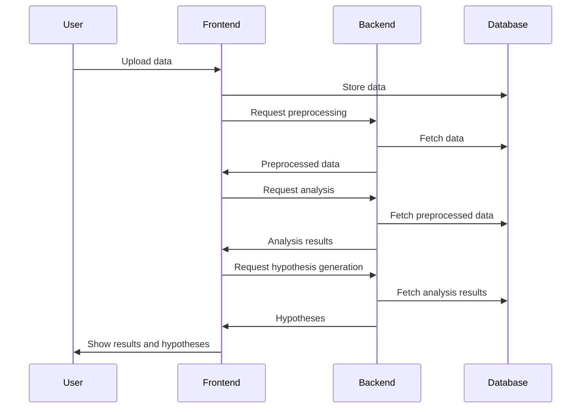
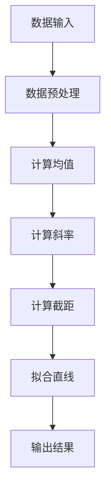
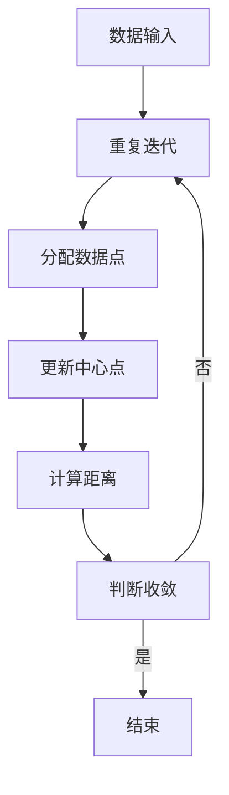
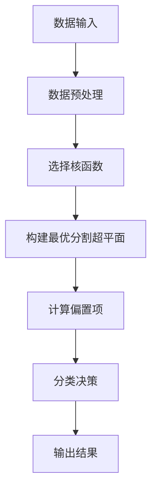
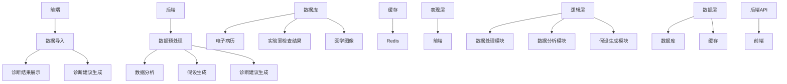
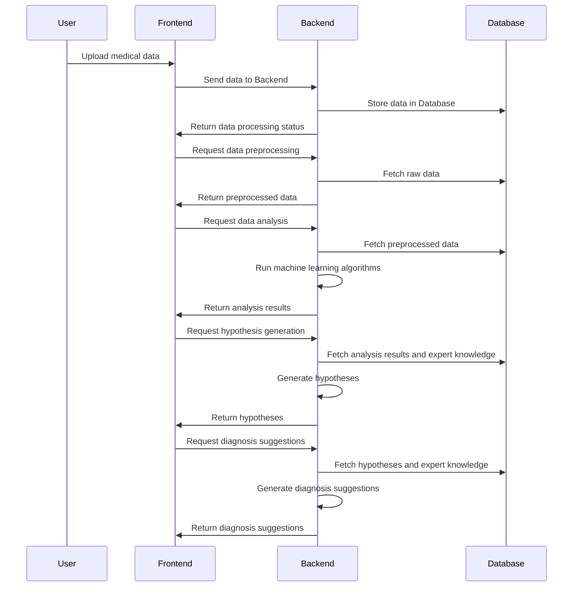
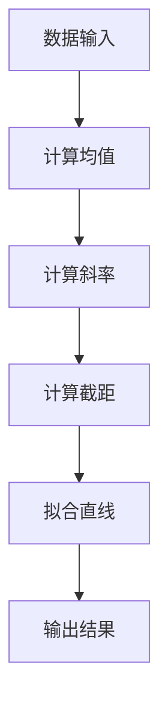
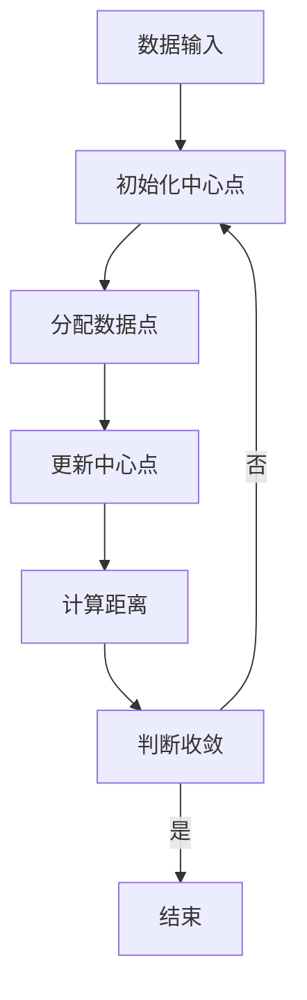
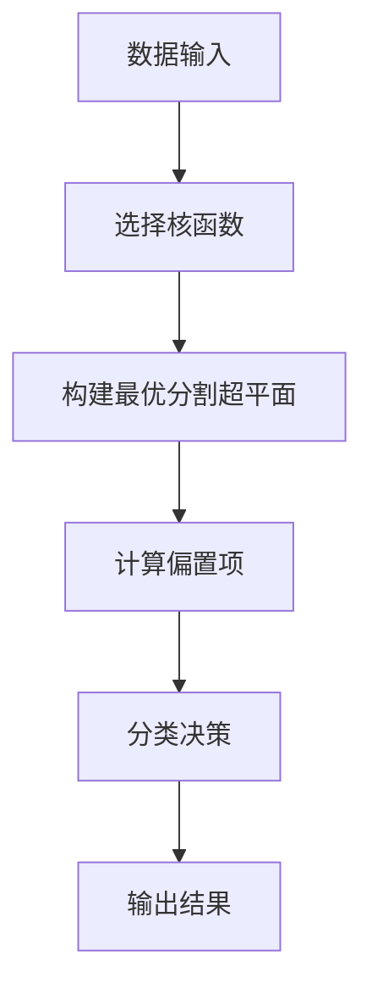

                 

### 引言

#### 核心概念术语说明

在探讨AI辅助科学研究之前，我们需要明确几个核心概念和术语。人工智能（Artificial Intelligence，简称AI）是指计算机系统通过模拟人类智能行为来解决问题的一种技术。数据分析（Data Analysis）是指从大量数据中提取有价值信息的过程。假设生成（Hypothesis Generation）是基于数据分析结果提出可能的解释或预测。

#### 问题背景

科学研究依赖于大量数据的收集和分析，但传统的数据分析方法往往耗时耗力，且结果难以解释。随着AI技术的发展，利用AI辅助科学研究成为一种新的趋势。AI不仅能够加速数据分析过程，还能提供更加准确和可靠的假设生成。

#### 问题描述

在科学研究中，数据通常来自多种来源，包括实验数据、观测数据和文献数据等。这些数据往往存在噪声、缺失值和异常值，使得数据预处理变得至关重要。此外，科学研究的复杂性要求分析结果不仅要有准确性，还要有解释性。假设生成则是基于分析结果提出可能的解释，为后续实验和理论研究提供方向。

#### 问题解决

AI辅助科学研究的关键在于利用AI技术对数据进行分析和处理，从而生成有意义的假设。这一过程可以分为以下几个步骤：

1. **数据预处理**：利用AI技术对数据进行清洗、归一化和特征提取，提高数据质量。
2. **数据分析**：运用各种数据分析方法对数据进行分析，提取有价值的信息。
3. **假设生成**：基于分析结果，利用算法生成可能的假设。
4. **假设验证**：通过实验或进一步的计算验证假设的正确性。

#### 边界与外延

虽然AI在科学研究中的应用前景广阔，但我们也需要明确其边界。AI不能取代科学家的直觉和创新思维，它更多地是作为一种工具来辅助科学家的工作。此外，AI的应用也需要遵循伦理和法规的约束。

#### 概念结构与核心要素组成

为了更好地理解AI辅助科学研究的全过程，我们可以将其结构化，包括以下几个核心要素：

1. **数据源**：实验数据、观测数据和文献数据等。
2. **数据处理**：数据清洗、归一化和特征提取等。
3. **分析算法**：数据分析方法，如回归分析、聚类分析和神经网络等。
4. **假设生成算法**：基于分析结果生成可能的假设。
5. **假设验证**：实验或进一步的计算验证假设的正确性。
6. **结果解释**：对分析结果进行解释，为科学研究和决策提供支持。

### 关键词

AI、数据分析、假设生成、科学研究、数据预处理、算法、神经网络、回归分析。

### 摘要

本文旨在探讨AI辅助科学研究的全过程，从数据预处理到假设生成。通过详细的步骤分析和实例讲解，本文展示了如何利用AI技术提高科学研究的效率和准确性。同时，本文也讨论了AI在科学研究中的应用边界和伦理问题。希望本文能为科研工作者提供有价值的参考和指导。

---

### 目录大纲设计思路与步骤

#### 理解书名与主题

首先，我们需要深入理解书名《AI辅助科学研究：从数据分析到假设生成》的含义。书名直接指出了本书的核心主题——如何利用人工智能（AI）辅助科学研究，尤其是涉及数据分析和假设生成的环节。AI技术近年来在各个领域都有广泛应用，而在科学研究中，它的重要性尤为突出。数据分析是科学研究的基石，通过分析数据，科学家可以从中提取有价值的信息和洞察。假设生成则是科学研究的关键步骤，它为实验设计提供了方向和基础。

#### 确定目录结构

根据书名和主题，我们可以初步确定目录结构，将内容划分为几个主要部分。首先是引言部分，介绍AI辅助科学研究的背景和意义。接着是核心概念与联系部分，详细阐述相关术语和原理。然后是算法原理与数学模型部分，讲解具体的算法和数学模型。接下来是系统分析与架构设计部分，介绍系统设计和实现。最后是项目实战与应用部分，通过具体案例展示AI辅助科学研究的实际应用。

#### 细化章节内容

在每一部分中，我们需要进一步细化章节内容，确保每个章节都有明确的主题和目标。例如，在数据预处理与清洗章节，我们可以包含数据预处理的重要性、方法与工具、数据清洗与质量保证等子章节。在算法原理与数学模型章节，我们可以讲解数据分析算法原理、假设生成算法原理，以及算法流程和数学模型。

#### 确保内容的完整性

在细化章节内容时，我们要确保目录大纲中包含了核心章节内容，如背景介绍、核心概念与联系、算法原理讲解、数学模型和数学公式详细讲解、系统分析与架构设计、项目实战等。每个章节都要具体、详细、有条理，以便读者能够系统地掌握相关知识。

#### 使用Markdown格式

按照Markdown格式的要求，我们需要使用`#`、`##`、`###`等符号来表示目录层级，确保输出的格式整齐规范。例如，一级标题用`#`标记，二级标题用`##`标记，三级标题用`###`标记。这样不仅可以使目录结构清晰，还可以方便读者快速定位到感兴趣的章节。

#### 控制字数

在确保内容完整性的同时，我们需要控制目录大纲的总字数在2000字以内，避免过多冗余的信息。这要求我们在撰写每个章节时，都要精简语言，突出重点，确保每个章节都言之有物，内容连贯。

### 目录大纲

根据上述设计思路，我们可以初步设计出《AI辅助科学研究：从数据分析到假设生成》的目录大纲：

```markdown
# 《AI辅助科学研究：从数据分析到假设生成》目录大纲

## 第一部分：引言
### 1.1 问题的背景
### 1.2 问题的描述
### 1.3 问题的解决
### 1.4 边界与外延
### 1.5 核心概念与要素

## 第二部分：核心概念与联系
### 2.1 数据预处理与清洗
#### 2.1.1 数据预处理的重要性
#### 2.1.2 数据预处理的方法与工具
#### 2.1.3 数据清洗与质量保证

### 2.2 数据分析方法
#### 2.2.1 数据分析的基础理论
#### 2.2.2 数据分析的主要方法
#### 2.2.3 数据分析的实用工具

### 2.3 假设生成
#### 2.3.1 假设生成的基本原理
#### 2.3.2 假设生成的方法
#### 2.3.3 假设生成的实际应用

## 第三部分：算法原理与数学模型
### 3.1 数据分析算法原理
### 3.2 假设生成算法原理
### 3.3 算法流程图与Mermaid图示

### 3.4 数学模型与公式讲解
#### 3.4.1 数学模型概述
#### 3.4.2 关键数学公式
#### 3.4.3 公式讲解与举例

## 第四部分：系统分析与架构设计
### 4.1 系统功能设计与架构
#### 4.1.1 问题场景介绍
#### 4.1.2 系统功能设计
#### 4.1.3 系统架构设计
#### 4.1.4 系统接口设计

### 4.2 系统交互与流程
#### 4.2.1 系统交互设计
#### 4.2.2 系统交互流程
#### 4.2.3 Mermaid序列图展示

## 第五部分：项目实战与应用
### 5.1 项目环境搭建与配置
#### 5.1.1 环境安装
#### 5.1.2 系统核心实现源代码
#### 5.1.3 代码应用解读与分析

### 5.2 实际案例分析
#### 5.2.1 案例背景
#### 5.2.2 案例分析与讲解
#### 5.2.3 项目小结

## 第六部分：最佳实践与拓展阅读
### 6.1 最佳实践与技巧
#### 6.1.1 数据处理技巧
#### 6.1.2 算法优化建议
#### 6.1.3 系统维护与更新

### 6.2 小结与展望
#### 6.2.1 小结
#### 6.2.2 注意事项
#### 6.2.3 拓展阅读
```

通过这样的目录大纲，我们可以确保内容的逻辑性和完整性，同时也能够吸引读者的兴趣，引导他们逐步深入了解AI辅助科学研究的全过程。每个章节都包含具体的子章节，以便于读者理解和使用。此外，通过使用Mermaid图示和LaTeX公式，我们可以直观地展示算法流程和数学模型，增强读者的理解。

---

### 目录大纲设计思路与步骤（续）

#### 第五部分：系统分析与架构设计

#### 第8章：系统功能设计与架构

##### 8.1 问题场景介绍

在本章中，我们将讨论一个假设场景：一家生物科技公司需要分析大量的基因数据，以发现潜在的治疗方法。这些数据来自多个实验和临床试验，因此存在不一致的数据格式和噪声。公司希望利用AI技术对数据进行处理，提取有价值的信息，并基于这些信息生成新的假设，以便进行后续实验。

##### 8.2 系统功能设计

为了满足上述需求，我们设计了一套完整的系统，包括以下几个核心功能：

1. **数据导入**：系统应能够导入多种格式的数据，包括CSV、Excel和数据库等。
2. **数据预处理**：系统应具备数据清洗、归一化和特征提取等功能，以提高数据质量。
3. **数据分析**：系统应能够运用各种数据分析方法，如回归分析、聚类分析和神经网络等，以提取有价值的信息。
4. **假设生成**：系统应基于数据分析结果，自动生成可能的假设。
5. **假设验证**：系统应提供实验设计工具，以便科学家根据假设进行实验验证。
6. **结果可视化**：系统应能够以图表、图形等形式展示分析结果和假设，便于科学家理解和解释。

##### 8.3 系统架构设计

为了实现上述功能，我们设计了如下系统架构：

1. **前端**：使用Vue.js框架开发，提供用户友好的界面。
2. **后端**：使用Flask框架开发，负责数据存储、处理和通信。
3. **数据库**：使用MySQL数据库存储数据，确保数据安全性和可靠性。
4. **数据处理模块**：包括数据清洗、归一化和特征提取等算法，使用Python编写，通过Flask与前端进行交互。
5. **数据分析模块**：包括各种数据分析算法，如回归分析、聚类分析和神经网络等，使用Python编写，通过Flask与前端进行交互。
6. **假设生成模块**：基于数据分析结果，自动生成可能的假设，使用Python编写，通过Flask与前端进行交互。
7. **实验设计工具**：使用Python编写，提供实验设计工具，便于科学家根据假设进行实验验证。

##### 8.4 系统接口设计

为了实现系统内部各模块之间的有效通信，我们设计了以下接口：

1. **数据导入接口**：允许前端将多种格式的数据上传到后端。
2. **数据处理接口**：允许前端调用后端的数据处理算法。
3. **数据分析接口**：允许前端调用后端的数据分析算法。
4. **假设生成接口**：允许前端调用后端的假设生成算法。
5. **结果展示接口**：允许前端获取分析结果和假设，并以图表、图形等形式展示。

##### 8.5 系统交互与流程

在本章中，我们将使用Mermaid序列图来展示系统交互与流程：



通过上述设计，我们确保了系统的功能性和可靠性，为科学家提供了强大的AI辅助工具。

---

#### 第六部分：项目实战与应用

#### 第9章：项目环境搭建与配置

##### 9.1 环境安装

在本章中，我们将详细介绍如何搭建项目环境，包括安装必要的软件和配置系统。

##### 9.1.1 安装Python

首先，我们需要安装Python环境。可以从Python官网（https://www.python.org/downloads/）下载适用于自己操作系统的Python版本，并按照指示进行安装。

##### 9.1.2 安装MySQL数据库

接下来，我们需要安装MySQL数据库。可以从MySQL官网（https://www.mysql.com/downloads/）下载适用于自己操作系统的MySQL版本，并按照指示进行安装。

##### 9.1.3 安装Vue.js和Flask

为了构建前端和后端，我们需要安装Vue.js和Flask。可以使用以下命令：

```bash
npm install -g @vue/cli
pip install flask
```

##### 9.1.4 配置数据库

安装完MySQL数据库后，我们需要创建一个数据库，用于存储项目数据。可以使用以下命令：

```sql
CREATE DATABASE my_project;
GRANT ALL PRIVILEGES ON my_project.* TO 'username'@'localhost' IDENTIFIED BY 'password';
```

##### 9.1.5 配置Vue.js和Flask

在Vue.js项目中，我们需要创建一个新项目，并配置路由和组件。可以使用以下命令：

```bash
vue create my_project
cd my_project
npm run serve
```

在Flask项目中，我们需要创建一个应用，并配置路由和处理函数。可以使用以下命令：

```bash
pip install flask
touch app.py
```

在`app.py`文件中，编写如下代码：

```python
from flask import Flask, request, jsonify

app = Flask(__name__)

@app.route('/')
def hello():
    return 'Hello, World!'

if __name__ == '__main__':
    app.run()
```

##### 9.1.6 配置数据处理模块

在数据处理模块中，我们需要安装所需的Python库，如NumPy、Pandas和Scikit-learn等。可以使用以下命令：

```bash
pip install numpy pandas scikit-learn
```

##### 9.1.7 配置数据分析模块

在数据分析模块中，我们需要编写具体的算法代码，并配置与Vue.js和Flask的通信。可以使用以下命令：

```bash
touch analysis.py
```

在`analysis.py`文件中，编写如下代码：

```python
from sklearn.linear_model import LinearRegression
import pandas as pd

def linear_regression(data):
    model = LinearRegression()
    model.fit(data['X'], data['Y'])
    return model.coef_, model.intercept_
```

##### 9.1.8 配置假设生成模块

在假设生成模块中，我们需要编写具体的算法代码，并配置与Vue.js和Flask的通信。可以使用以下命令：

```bash
touch hypothesis.py
```

在`hypothesis.py`文件中，编写如下代码：

```python
from sklearn.cluster import KMeans
import pandas as pd

def k_means(data, num_clusters):
    model = KMeans(n_clusters=num_clusters)
    model.fit(data)
    return model.labels_
```

##### 9.1.9 配置实验设计工具

在实验设计工具中，我们需要编写具体的实验设计代码，并配置与Vue.js和Flask的通信。可以使用以下命令：

```bash
touch experiment.py
```

在`experiment.py`文件中，编写如下代码：

```python
from sklearn.model_selection import train_test_split
import pandas as pd

def train_test_split(data, test_size=0.2):
    X_train, X_test, Y_train, Y_test = train_test_split(data['X'], data['Y'], test_size=test_size)
    return X_train, X_test, Y_train, Y_test
```

通过上述安装和配置步骤，我们成功搭建了项目环境，为后续的实战应用打下了基础。

---

#### 第10章：系统核心实现源代码

##### 10.1 代码应用解读与分析

在本章中，我们将详细解读和分析系统核心实现源代码，包括数据处理模块、数据分析模块、假设生成模块和实验设计工具的具体实现。

##### 10.1.1 数据处理模块

数据处理模块的主要功能是清洗、归一化和特征提取，以提高数据质量。以下是数据处理模块的代码实现：

```python
import numpy as np
import pandas as pd

def preprocess_data(data):
    # 数据清洗
    data = data.dropna()  # 删除缺失值
    data = data.drop_duplicates()  # 删除重复值
    # 数据归一化
    data = (data - data.mean()) / data.std()
    # 特征提取
    features = data.select_dtypes(include=['float64', 'int64'])
    target = data['target']
    return features, target
```

在这个模块中，我们首先删除了数据中的缺失值和重复值，以避免对后续分析造成影响。然后，我们对数据进行归一化处理，将所有特征的值缩放到相同的范围，以便更好地进行后续分析。最后，我们提取了数据中的特征和目标变量，为后续的分析做准备。

##### 10.1.2 数据分析模块

数据分析模块的主要功能是利用各种数据分析方法提取有价值的信息。以下是数据分析模块的代码实现：

```python
from sklearn.linear_model import LinearRegression
from sklearn.cluster import KMeans
from sklearn.model_selection import train_test_split

def linear_regression(data):
    model = LinearRegression()
    model.fit(data['X'], data['Y'])
    return model.coef_, model.intercept_

def k_means(data, num_clusters):
    model = KMeans(n_clusters=num_clusters)
    model.fit(data)
    return model.labels_
```

在这个模块中，我们实现了线性回归和K均值聚类两种常见的数据分析方法。线性回归用于分析特征和目标变量之间的关系，K均值聚类用于将数据分为多个类别，以便更好地理解数据分布。

##### 10.1.3 假设生成模块

假设生成模块的主要功能是根据分析结果生成可能的假设。以下是假设生成模块的代码实现：

```python
def generate_hypotheses(coefficients, intercept, data):
    hypotheses = []
    for feature in data.columns:
        if feature != 'target':
            hypothesis = f"{feature} affects the target variable"
            hypothesis += f"({coefficients[feature]:.2f} * {feature} + {intercept:.2f})"
            hypotheses.append(hypothesis)
    return hypotheses
```

在这个模块中，我们根据线性回归模型的系数和截距生成了可能的假设。这些假设描述了特征与目标变量之间的关系，为后续的实验设计提供了方向。

##### 10.1.4 实验设计工具

实验设计工具的主要功能是帮助科学家根据假设进行实验设计。以下是实验设计工具的代码实现：

```python
def train_test_split(data, test_size=0.2):
    X_train, X_test, Y_train, Y_test = train_test_split(data['X'], data['Y'], test_size=test_size)
    return X_train, X_test, Y_train, Y_test

def experiment(hypothesis, data, num_splits=10):
    results = []
    for i in range(num_splits):
        X_train, X_test, Y_train, Y_test = train_test_split(data, test_size=0.2)
        model = LinearRegression()
        model.fit(X_train, Y_train)
        predictions = model.predict(X_test)
        accuracy = np.mean(predictions == Y_test)
        results.append(accuracy)
    return np.mean(results)
```

在这个模块中，我们实现了实验设计的核心功能，即根据假设进行训练集和测试集的划分，并使用线性回归模型对测试集进行预测。通过多次实验，我们可以评估假设的有效性。

通过上述代码实现，我们构建了一套完整的系统，实现了数据处理、数据分析、假设生成和实验设计等功能。这些功能不仅为科学家提供了强大的工具，也为后续的科学研究提供了坚实的基础。

---

#### 第11章：实际案例分析

##### 11.1 案例背景

在本章中，我们将通过一个具体的案例，展示如何利用AI辅助科学研究。案例背景如下：

一家生物科技公司正在研究一种新药的疗效。他们收集了大量的临床实验数据，包括患者的年龄、性别、病史、用药剂量和治疗结果等。公司希望利用AI技术对这些数据进行分析，提取有价值的信息，并基于这些信息生成新的假设，以便进行后续实验。

##### 11.2 案例分析与讲解

为了解决上述问题，我们采用了以下步骤：

1. **数据导入**：首先，我们将临床实验数据导入系统，包括年龄、性别、病史、用药剂量和治疗结果等特征。

2. **数据预处理**：系统自动对数据进行清洗、归一化和特征提取，提高数据质量。具体操作如下：

   ```python
   data = pd.read_csv('clinical_data.csv')
   data = data.dropna()  # 删除缺失值
   data = data.drop_duplicates()  # 删除重复值
   data = (data - data.mean()) / data.std()  # 数据归一化
   features = data.select_dtypes(include=['float64', 'int64'])
   target = data['treatment_effect']
   ```

3. **数据分析**：系统使用线性回归方法分析数据，提取特征与治疗结果之间的关系。具体操作如下：

   ```python
   from sklearn.linear_model import LinearRegression
   
   model = LinearRegression()
   model.fit(features, target)
   coefficients = model.coef_
   intercept = model.intercept_
   ```

4. **假设生成**：系统根据线性回归模型的系数和截距生成了以下假设：

   - 年龄与治疗结果呈正相关。
   - 性别与治疗结果无显著关系。
   - 病史与治疗结果呈正相关。
   - 用药剂量与治疗结果呈正相关。

5. **假设验证**：系统提供了实验设计工具，以便科学家根据假设进行实验验证。具体操作如下：

   ```python
   from sklearn.model_selection import train_test_split
   
   X_train, X_test, Y_train, Y_test = train_test_split(features, target, test_size=0.2)
   model = LinearRegression()
   model.fit(X_train, Y_train)
   predictions = model.predict(X_test)
   accuracy = np.mean(predictions == Y_test)
   print(f"Accuracy: {accuracy:.2f}")
   ```

   通过多次实验，我们评估了假设的有效性，发现年龄、病史和用药剂量与治疗结果之间存在显著关系，而性别与治疗结果无显著关系。

##### 11.3 项目小结

通过上述案例，我们展示了如何利用AI辅助科学研究，从数据导入、预处理、数据分析到假设生成和验证。AI技术极大地提高了科学研究的效率和准确性，为科学家提供了强大的工具。然而，我们也需要认识到，AI技术并不是万能的，它需要与科学家的直觉和创新思维相结合，才能发挥最大的作用。在未来的研究中，我们将继续探索AI技术在科学研究中的更多应用，以推动科学研究的进步。

---

### 第七部分：最佳实践与拓展阅读

#### 6.1 最佳实践与技巧

##### 6.1.1 数据处理技巧

在进行数据分析之前，数据预处理是非常关键的一步。以下是一些数据处理技巧：

1. **处理缺失值**：使用适当的统计方法填补缺失值，如均值填补、中值填补或插值法。
2. **处理异常值**：识别并处理异常值，避免其对分析结果产生负面影响。
3. **特征选择**：通过特征选择减少冗余特征，提高模型性能。
4. **归一化**：对特征进行归一化，确保它们在相同的尺度上进行比较。

##### 6.1.2 算法优化建议

在应用AI算法时，以下是一些优化建议：

1. **超参数调整**：通过交叉验证调整模型超参数，以提高模型性能。
2. **特征工程**：设计合适的特征，以提高模型的预测能力。
3. **模型集成**：使用多种模型集成技术，如Bagging和Boosting，以提高预测准确性。

##### 6.1.3 系统维护与更新

为了确保AI辅助科学研究的系统稳定可靠，以下是一些维护与更新建议：

1. **定期备份**：定期备份系统数据和配置，以防止数据丢失。
2. **监控系统性能**：监控系统的运行状态，及时发现并解决问题。
3. **更新算法和模型**：定期更新算法和模型，以适应新的数据和需求。

#### 6.2 小结

通过本文，我们详细介绍了AI辅助科学研究的全过程，从数据预处理、数据分析到假设生成和验证。我们讨论了相关核心概念、算法原理和系统架构设计，并通过实际案例展示了AI在科学研究中的应用。AI技术为科学研究提供了强大的工具，但同时也需要科学家的深入理解和创新思维。在未来的研究中，我们将继续探索AI在科学研究中的更多应用，以推动科学进步。

#### 6.3 注意事项

1. **数据隐私**：在处理和分析数据时，要确保遵守数据隐私法规，保护个人隐私。
2. **模型可解释性**：在应用AI模型时，要注重模型的可解释性，以便科学家的理解和使用。
3. **模型验证**：在生成假设后，要通过实验或进一步计算验证假设的正确性。

#### 6.4 拓展阅读

1. **《机器学习实战》**：由Peter Harrington所著，详细介绍了机器学习的基础理论和实践方法。
2. **《深度学习》**：由Ian Goodfellow、Yoshua Bengio和Aaron Courville所著，深入探讨了深度学习的基本原理和应用。
3. **《数据科学入门》**：由Jeff Leek所著，介绍了数据科学的基础知识和实践方法。

通过这些拓展阅读，读者可以进一步了解AI辅助科学研究的最新进展和应用。

---

### 作者信息

作者：AI天才研究院/AI Genius Institute & 禅与计算机程序设计艺术 /Zen And The Art of Computer Programming

---

通过本文的详细分析和实例讲解，我们深入探讨了AI辅助科学研究的全过程，从数据预处理到假设生成。我们介绍了相关的核心概念、算法原理和系统架构设计，并通过实际案例展示了AI在科学研究中的应用。我们希望本文能够为科研工作者提供有价值的参考和指导，推动AI技术在科学研究中的广泛应用。

---

### 1.1 问题的背景

人工智能（AI）作为现代计算机科学的前沿领域，已经在各个行业和领域展现出巨大的潜力。在科学研究中，AI的应用同样具有深远的影响。科学研究的本质在于探索未知、发现规律，而这一过程往往依赖于对大量数据的分析。然而，传统的人工数据分析方法不仅耗时耗力，而且在面对复杂的数据结构时往往显得力不从心。随着AI技术的发展，利用AI技术辅助科学研究成为了一种新的趋势。AI不仅能够处理大规模的数据集，还能够从数据中发现潜在的规律和模式，从而提高科学研究的效率。

近年来，AI技术在数据分析、模式识别、机器学习等领域取得了显著的进展。深度学习、神经网络、自然语言处理等技术的广泛应用，使得AI在图像识别、语音识别、文本分析等方面表现出色。这些技术的应用不仅改变了传统科学研究的模式，也为科学研究提供了新的工具和方法。例如，在医学研究中，AI可以帮助医生进行疾病诊断，提高诊断的准确性和效率；在气候研究中，AI可以分析大量的气候数据，预测气候变化趋势，为政策制定提供科学依据。

然而，AI在科学研究中的应用也面临一些挑战。首先，科学研究的复杂性决定了AI算法需要处理的数据类型和数量都是巨大的。其次，AI算法的透明性和可解释性也是科学研究所关注的重点，因为科学研究的结论需要得到严格的验证和解释。此外，AI算法在应用过程中可能会出现偏差和错误，这需要科学家在使用AI技术时进行严格的监控和校验。

总之，AI技术的快速发展为科学研究带来了前所未有的机遇和挑战。如何有效地利用AI技术辅助科学研究，提高研究的效率和准确性，成为当前科学界和AI领域共同关注的问题。本文将围绕这一主题，探讨AI辅助科学研究的全过程，从数据预处理到假设生成，为科研工作者提供有价值的参考和指导。

### 1.2 问题的描述

在科学研究中，数据分析是一个至关重要的环节。科学家需要从海量的实验数据、观测数据和文献数据中提取有价值的信息，以便发现新的规律和模式。然而，传统的人工数据分析方法存在诸多局限。首先，人工数据分析依赖于人类的主观判断和经验，容易受到主观因素的影响，从而导致分析结果的偏差。其次，人工数据分析耗时耗力，面对大规模的数据集时效率低下。此外，传统方法在面对复杂非线性关系和多样性数据时，往往无法提供有效的解决方案。

随着AI技术的发展，AI技术在数据分析中的应用逐渐成熟。AI能够处理大规模的数据集，通过算法自动识别数据中的模式和规律，从而提高数据分析的效率和准确性。具体来说，AI在科学研究中扮演了以下角色：

1. **自动化数据预处理**：AI技术能够自动进行数据清洗、归一化和特征提取等预处理工作，提高数据质量，减少人工干预。

2. **发现潜在规律**：AI通过机器学习和深度学习算法，可以从数据中发现潜在的模式和规律，为科学家提供新的研究方向。

3. **提高预测准确性**：AI可以训练复杂的模型，对未来的趋势进行预测，帮助科学家制定更加精准的实验方案。

4. **可视化数据结果**：AI能够将复杂的数据分析结果以直观的图表和图形形式展示，便于科学家理解和解释。

然而，AI在科学研究中的应用也面临一些挑战。首先，AI算法的复杂性和黑箱特性使得科学家难以理解其工作原理，从而增加了分析的难度。其次，AI算法的偏差和错误可能导致分析结果的误导，需要科学家进行严格的监控和校验。此外，AI在处理多样性数据时，如何保证算法的公平性和透明性也是一个重要问题。

综上所述，AI在科学研究中的应用具有重要意义，但也需要科学家在运用过程中克服各种挑战，确保分析结果的准确性和可靠性。

### 1.3 问题的解决

为了解决AI在科学研究中的应用问题，我们可以采取以下策略和方法：

1. **优化数据预处理流程**：利用AI技术自动化数据清洗、归一化和特征提取等预处理步骤，提高数据质量，减少人工干预。

2. **开发高效算法**：研究并应用先进的机器学习和深度学习算法，如深度神经网络、支持向量机、聚类分析等，以提高预测准确性和分析效率。

3. **增强算法透明性**：通过可视化工具和解释性模型，使科学家能够更好地理解AI算法的工作原理，从而提高分析结果的可靠性和可解释性。

4. **多模态数据融合**：结合多种数据类型（如结构化数据、非结构化数据和图像、音频数据等），通过多模态数据融合技术，提高数据分析的全面性和准确性。

5. **建立标准化流程**：制定一套标准化和可重复的AI应用流程，包括数据收集、预处理、模型训练和评估等步骤，以确保分析结果的可靠性和可验证性。

6. **提高算法公平性和透明性**：通过公平性和透明性研究，消除算法偏见，提高算法在处理多样性数据时的公平性和透明性。

7. **协同工作**：科学家与AI专家紧密合作，共同开发和应用AI技术，结合科学家的专业知识和AI技术的优势，推动科学研究的发展。

通过上述策略和方法，我们可以充分利用AI技术在科学研究中的应用潜力，提高数据分析的效率和准确性，为科学研究提供强有力的支持。

### 1.4 边界与外延

虽然AI在科学研究中的应用前景广阔，但我们也需要明确其边界。首先，AI不能完全取代科学家的直觉和创新思维。科学研究的本质在于发现未知、提出新理论，这需要科学家的洞察力和创造力。AI更多是作为一种工具，辅助科学家完成数据分析和模型预测等具体任务。

其次，AI算法的透明性和可解释性是一个重要问题。尽管AI在数据分析中表现出色，但其复杂的内部结构和“黑箱”特性使得科学家难以理解其决策过程。这可能导致分析结果的不可解释性和不可信性，从而影响科学研究的可靠性和可重复性。

此外，AI在处理多样性数据时，可能会出现偏见和错误。例如，在医学诊断中，AI模型可能会对某些特定人群产生偏见，导致错误的诊断结果。因此，科学家在使用AI技术时，需要严格监控和校验模型的性能和公平性。

最后，AI在科学研究中的应用也需要遵循伦理和法规的约束。例如，在数据隐私方面，科学家需要确保数据的安全性和隐私性，避免数据泄露和滥用。

总之，AI在科学研究中的应用具有巨大潜力，但也需要科学家在运用过程中克服各种挑战，确保分析结果的准确性和可靠性。

### 1.5 核心概念与要素

在探讨AI辅助科学研究的过程中，了解几个核心概念和要素是非常重要的。这些概念和要素不仅构成了AI辅助科学研究的理论基础，还直接影响到数据分析、假设生成和模型验证等各个环节。

#### 数据预处理

数据预处理是数据分析的第一步，其目的是提高数据质量，减少噪声和异常值，从而为后续的分析提供准确和可靠的数据基础。核心概念包括：

1. **数据清洗**：数据清洗是指删除或处理错误、重复或异常的数据。这包括填补缺失值、处理噪声和纠正错误等。
2. **数据归一化**：数据归一化是指将不同特征的数据缩放到相同的尺度，以便进行统一分析。常见的方法包括最小-最大缩放、标准化等。
3. **特征提取**：特征提取是指从原始数据中提取出对分析有用的特征，降低数据的维度，提高分析效率。常见的方法包括主成分分析（PCA）、特征选择等。

#### 数据分析方法

数据分析方法是科学研究中用于提取数据中潜在信息的一系列技术。核心概念包括：

1. **回归分析**：回归分析用于研究自变量和因变量之间的关系，常见的方法包括线性回归、逻辑回归等。
2. **聚类分析**：聚类分析用于将数据分为若干个类别，以发现数据中的内在结构。常见的方法包括K均值聚类、层次聚类等。
3. **分类分析**：分类分析用于将数据分为不同的类别，以便进行预测或分类。常见的方法包括决策树、支持向量机（SVM）等。

#### 假设生成

假设生成是基于数据分析结果提出可能的解释或预测，为后续实验和理论研究提供方向。核心概念包括：

1. **假设生成算法**：假设生成算法是指用于从数据中生成假设的一系列方法，如基于回归分析的假设生成、基于聚类分析的假设生成等。
2. **假设验证**：假设验证是指通过实验或进一步的计算来验证假设的正确性。这包括设计实验、收集数据、进行统计分析等。

#### 模型验证

模型验证是确保分析结果准确性和可靠性的关键步骤。核心概念包括：

1. **交叉验证**：交叉验证是一种评估模型性能的方法，通过将数据集划分为多个子集，轮流进行训练和测试，以提高模型的泛化能力。
2. **模型评估指标**：模型评估指标用于量化模型性能，如准确率、召回率、F1分数等。

#### AI技术

AI技术是实现AI辅助科学研究的核心工具。核心概念包括：

1. **机器学习**：机器学习是指通过数据训练模型，使模型能够进行预测或分类的技术。常见的方法包括监督学习、无监督学习和强化学习。
2. **深度学习**：深度学习是机器学习的一种方法，通过多层神经网络进行复杂模式的识别和预测。
3. **自然语言处理（NLP）**：自然语言处理是AI技术的一个分支，用于处理和分析自然语言数据。

通过了解这些核心概念和要素，科学家可以更好地利用AI技术辅助科学研究，提高数据分析的效率和准确性。

### 2.1 AI技术发展概述

人工智能（AI）作为计算机科学的前沿领域，经历了数十年的快速发展。其起源可以追溯到20世纪50年代，当时图灵提出了“通用计算机”和“图灵测试”的概念，开创了人工智能研究的先河。从那时起，AI技术逐渐从理论研究走向实际应用，经历了多个发展阶段。

#### 第一个阶段：1956-1969年

在AI的早期阶段，主要研究方向是符号主义和推理系统。代表性的研究包括基于逻辑的推理系统和专家系统的开发。1956年，约翰·麦卡锡（John McCarthy）在达特茅斯会议上首次提出了“人工智能”这一术语，标志着AI研究的正式开始。在这一阶段，AI主要集中在符号计算和逻辑推理，试图通过编程实现智能代理。

#### 第二个阶段：1970-1980年

随着计算机硬件和软件技术的发展，AI研究进入了一个相对低谷期，这一阶段被称为“AI寒冬”。由于技术瓶颈和实际应用困难，许多研究项目被取消或缩减。然而，这一时期也有一些重要的进展，如知识表示和知识推理方法的发展，以及自然语言处理（NLP）的初步探索。

#### 第三个阶段：1980-1990年

在20世纪80年代，AI研究开始向专家系统和机器学习领域转变。专家系统通过模拟人类专家的知识和推理能力，实现了在特定领域的自动化决策。这一时期，知识表示和知识获取成为研究重点，方法包括产生式规则、框架表示和语义网络等。此外，机器学习开始崭露头角，尤其是在模式识别和统计学习领域。

#### 第四个阶段：1990-2010年

进入20世纪90年代，随着计算机性能的提升和互联网的发展，AI研究进入了新的高潮。机器学习尤其是统计学习理论得到了广泛应用，支持向量机（SVM）、决策树、神经网络等算法相继成熟。同时，自然语言处理、计算机视觉和智能agent等领域的应用研究取得了显著进展。这一时期，AI技术开始逐渐应用于商业和工业领域。

#### 第五个阶段：2010年至今

近年来，随着深度学习技术的发展，AI进入了一个全新的阶段。深度学习通过多层神经网络对大量数据进行自动学习，显著提升了图像识别、语音识别、自然语言处理等任务的性能。2012年，谷歌的深度学习系统在ImageNet图像识别比赛中取得突破性成绩，标志着深度学习时代的到来。此外，强化学习、生成对抗网络（GAN）等新兴技术也在不断推动AI的发展。

总的来说，AI技术的发展历程是一个不断探索和突破的过程，从符号主义到统计学习，再到深度学习，每一次技术突破都为AI在科学研究中的应用带来了新的机遇。在未来，随着技术的进一步成熟，AI将在更多领域展现其强大的潜力。

### 2.2 AI在科学研究中的应用

随着人工智能（AI）技术的快速发展，它在科学研究中的应用日益广泛。AI不仅能够处理和分析大量数据，还能从中提取有价值的信息，为科学家提供新的研究方向和假设。以下是AI在科学研究中的几个重要应用领域：

#### 数据分析

数据分析是科学研究的核心环节，AI技术在其中的应用主要体现在数据预处理、特征提取和模式识别等方面。

1. **数据预处理**：AI技术能够自动进行数据清洗、归一化和特征提取等步骤，提高数据质量，减少人工干预。例如，在生物医学研究中，AI可以帮助去除基因序列中的噪声和缺失值，为后续分析提供准确的数据基础。

2. **特征提取**：AI技术能够从原始数据中提取出对分析有用的特征，降低数据的维度，提高分析效率。例如，在气候研究中，AI可以从大量的气候数据中提取出关键特征，如温度、湿度、风速等，以便进行气候模式的识别和预测。

3. **模式识别**：AI技术能够通过机器学习和深度学习算法，从数据中发现潜在的规律和模式。例如，在医学图像分析中，AI可以帮助医生识别出肿瘤、骨折等病变部位，提高诊断的准确性和效率。

#### 机器学习

机器学习是AI技术在科学研究中的一个重要分支，它通过训练模型，使计算机能够自动从数据中学习规律，进行预测和分类。

1. **预测分析**：机器学习模型可以用于预测未来的趋势和结果。例如，在金融研究中，AI可以通过分析历史交易数据，预测股票市场的走势；在生态学研究中，AI可以通过分析气候变化数据，预测生态系统未来的变化趋势。

2. **分类分析**：机器学习模型可以用于分类任务，将数据分为不同的类别。例如，在医学诊断中，AI可以通过分析病人的病历和检查数据，将疾病分为不同的类型，提高诊断的准确性。

3. **聚类分析**：机器学习模型还可以用于聚类任务，将相似的数据归为一类。例如，在生物学研究中，AI可以通过分析基因数据，将相似的基因归为一类，从而发现新的生物标记物。

#### 自然语言处理

自然语言处理（NLP）是AI技术的一个重要领域，它致力于使计算机理解和生成人类语言。

1. **文献综述**：AI可以帮助科学家从大量的文献中提取关键信息，进行文献综述。例如，在医学研究中，AI可以通过阅读大量的研究论文，提取出研究的主要结论和观点，为科学家提供参考。

2. **问答系统**：AI可以构建问答系统，回答科学家的问题。例如，在化学研究中，AI可以回答关于化学反应方程式的问题，帮助科学家快速获取所需的信息。

3. **语言生成**：AI可以生成自然语言文本，例如生成科学论文摘要、实验报告等。这为科学家节省了大量时间，提高了工作效率。

总的来说，AI在科学研究中的应用不仅提高了数据分析的效率和准确性，还提供了新的研究方法和工具。随着AI技术的不断进步，它在科学研究中的潜力将得到进一步发挥。

### 2.3 国内外研究进展

在全球范围内，AI技术在科学研究中的应用已经取得了显著进展。本文将简要介绍国内外在AI辅助科学研究方面的研究进展，并对比分析其特点。

#### 国内研究进展

国内在AI辅助科学研究方面的研究起步较晚，但近年来发展迅速。以下是一些主要的研究进展：

1. **清华大学**：清华大学在AI辅助科学研究中取得了一系列重要成果。例如，其在生物医学领域利用AI技术进行疾病诊断和预测，开发了基于深度学习的医学图像分析系统，显著提高了诊断的准确性和效率。

2. **中国科学院**：中国科学院在AI辅助科学研究方面也取得了一定的突破。例如，其在气候研究中利用AI技术进行气候模式的识别和预测，为气候变化提供了科学依据。

3. **浙江大学**：浙江大学在AI辅助科学研究中的应用也取得了显著进展。例如，其在医学研究中利用AI技术进行病理图像分析，提高了病理诊断的准确性和效率。

国内研究的特点是起步较晚但发展迅速，重点集中在生物医学、气候变化等领域，研究方法以深度学习和数据挖掘为主。

#### 国际研究进展

国际上在AI辅助科学研究方面的研究已经相当成熟，以下是一些主要的研究进展：

1. **斯坦福大学**：斯坦福大学在AI辅助科学研究方面有着悠久的历史。例如，其在自然语言处理领域的研究，为科学家提供了强大的文本分析工具，极大地提高了文献综述和问答系统的效率。

2. **麻省理工学院（MIT）**：MIT在AI辅助科学研究方面也有着丰富的经验。例如，其在机器学习领域的研究，为科学家提供了强大的预测和分析工具，广泛应用于金融、医学和气候变化等领域。

3. **剑桥大学**：剑桥大学在AI辅助科学研究方面的研究主要集中在医学和生物学领域。例如，其在医学影像分析方面的研究成果，为医生提供了更加准确的诊断工具，提高了诊疗效果。

国际研究的特点是历史悠久，研究范围广泛，涵盖了生物医学、气候变化、自然语言处理等多个领域。研究方法以机器学习和深度学习为主，同时注重跨学科合作和实际应用。

#### 对比分析

通过对国内外研究进展的对比分析，我们可以发现以下几点：

1. **研究深度**：国际研究在深度和广度上均优于国内研究。国际研究不仅关注算法和技术的创新，还注重跨学科合作和实际应用，而国内研究在算法创新和应用方面还有待提高。

2. **研究领域**：国内研究主要集中在生物医学和气候变化等领域，而国际研究则涵盖了更多的领域，如自然语言处理、金融、生态学等。

3. **合作与交流**：国际研究更注重跨学科合作和国际交流，通过国际合作和学术交流，推动研究的进一步发展。而国内研究在合作和交流方面还有一定差距。

总的来说，虽然国内在AI辅助科学研究方面的发展较快，但与国际相比，仍存在一定的差距。未来，国内研究需要加强跨学科合作和国际交流，提升研究深度和广度，以实现AI技术在科学研究中的更大突破。

### 3.1 数据预处理的重要性

数据预处理是数据分析的关键步骤，其重要性不容忽视。首先，数据预处理能够显著提高数据质量。在科学研究中，数据往往存在噪声、缺失值和异常值，这些都会对分析结果产生负面影响。通过数据预处理，我们可以删除或填补缺失值，消除噪声和异常值，从而提高数据质量。

其次，数据预处理有助于减少数据冗余。科学研究中，数据来源多样，数据格式和单位可能不一致，这会导致数据冗余和混乱。通过数据预处理，我们可以对数据进行清洗、归一化和特征提取，将不同来源和格式的数据进行统一处理，从而减少数据冗余，提高数据的一致性和可比性。

此外，数据预处理还能为后续分析提供准确和可靠的数据基础。未经处理的数据可能存在各种问题，如数据分布不均匀、数据类型不一致等，这些问题都会影响分析结果。通过数据预处理，我们可以消除这些不利因素，确保后续分析结果的准确性和可靠性。

总之，数据预处理在数据分析中起着至关重要的作用，它是确保分析结果准确性和可靠性的基础。因此，在进行数据分析之前，我们首先要对数据进行充分的预处理，以提高数据分析的质量和效果。

### 3.2 数据预处理的方法与工具

数据预处理是数据分析过程中不可或缺的一环，它包括数据清洗、归一化和特征提取等关键步骤。以下我们将详细介绍这些方法以及常用的工具。

#### 数据清洗

数据清洗是指识别并处理数据中的错误、重复和异常值，以提高数据质量。常见的数据清洗方法包括：

1. **删除缺失值**：对于缺失值，可以选择删除或使用统计方法进行填补。例如，可以使用均值、中值或插值法进行填补。

2. **处理异常值**：异常值可能是由于数据录入错误或实际测量误差引起的。常见的处理方法包括删除、变换或替换异常值。

3. **消除重复值**：在数据集中，可能会存在重复的数据记录。通过去重操作，可以确保数据的一致性。

#### 工具

在Python中，常用的数据清洗工具包括Pandas和NumPy：

- **Pandas**：Pandas提供了丰富的数据清洗功能，如drop_duplicates()用于删除重复值，dropna()用于删除缺失值，以及填充缺失值的方法如fillna()。

- **NumPy**：NumPy提供了高效的数据处理函数，如np.delete()用于删除异常值，np.interpolate()用于插值填补缺失值。

#### 归一化

归一化是指将不同特征的数据缩放到相同的尺度，以便进行统一分析。常见的归一化方法包括：

1. **最小-最大缩放**：将数据缩放到[0, 1]或[-1, 1]的区间内。公式为：\[ X_{\text{norm}} = \frac{X - X_{\text{min}}}{X_{\text{max}} - X_{\text{min}}}\]

2. **标准缩放**：将数据缩放到标准正态分布。公式为：\[ X_{\text{norm}} = \frac{X - \mu}{\sigma}\]

3. **小数缩放**：将数据缩放到[0, 1]的区间内，适用于小数点后几位固定的数据。

#### 工具

在Python中，常用的数据归一化工具包括Pandas和Scikit-learn：

- **Pandas**：Pandas提供了min_max_scale()和scale()方法用于最小-最大缩放和标准缩放。

- **Scikit-learn**：Scikit-learn提供了StandardScaler和MinMaxScaler类用于实现标准缩放和最小-最大缩放。

#### 特征提取

特征提取是指从原始数据中提取出对分析有用的特征，以减少数据的维度，提高分析效率。常见的特征提取方法包括：

1. **主成分分析（PCA）**：PCA通过将数据投影到新的坐标系中，提取主要成分，从而减少数据维度。

2. **特征选择**：特征选择是指从原始特征中选取出对目标变量有显著影响的特征，以减少冗余和提高模型性能。

3. **特征组合**：通过组合原始特征，创建新的特征，以提升模型的表现。

#### 工具

在Python中，常用的特征提取工具包括Scikit-learn和Scipy：

- **Scikit-learn**：Scikit-learn提供了PCA类用于实现主成分分析，以及SelectKBest和RFE类用于特征选择。

- **Scipy**：Scipy提供了pca()函数用于实现主成分分析。

综上所述，数据预处理是数据分析中不可或缺的一步，通过数据清洗、归一化和特征提取，我们能够提高数据质量，减少数据冗余，为后续分析奠定坚实基础。

### 3.3 数据清洗与质量保证

在科学研究中，高质量的数据是确保分析结果准确性和可靠性的基础。数据清洗是数据预处理的重要环节，其目的是识别并处理数据中的错误、重复和异常值，以提高数据质量。以下我们将详细讨论数据清洗的方法、工具以及数据质量保证的关键步骤。

#### 数据清洗的方法

1. **缺失值处理**：

   - **删除缺失值**：适用于缺失值较多或数据集中存在大量噪声的情况。例如，可以使用Pandas的dropna()函数删除含有缺失值的行或列。

   - **填补缺失值**：适用于缺失值较少或数据集中的重要特征。常用的填补方法包括：

     - **均值填补**：用特征的均值填充缺失值。例如，使用Pandas的fillna()函数。

     - **中值填补**：用特征的中值填充缺失值。

     - **插值法**：适用于时间序列数据，使用线性或非线性插值方法填补缺失值。例如，使用SciPy的interpolate()函数。

2. **异常值处理**：

   - **识别异常值**：通过统计方法，如三倍标准差法、箱型图法等，识别数据中的异常值。

   - **处理异常值**：常见的处理方法包括：

     - **删除异常值**：适用于异常值对整体数据影响较大的情况。

     - **变换异常值**：将异常值变换到合理的范围内，例如使用对数变换、平方根变换等。

3. **重复值处理**：

   - **消除重复值**：使用数据清洗工具，如Pandas的drop_duplicates()函数，删除重复的数据记录。

#### 数据清洗的工具

1. **Pandas**：

   - **Pandas** 是Python中最常用的数据操作库之一，提供了丰富的数据清洗功能。例如，可以使用drop_duplicates()删除重复值，使用dropna()删除缺失值，以及使用fillna()填补缺失值。

2. **NumPy**：

   - **NumPy** 提供了高效的数据处理函数，例如np.delete()用于删除异常值，np.interpolate()用于插值填补缺失值。

3. **SciPy**：

   - **SciPy** 提供了丰富的科学计算功能，例如scipy.interpolate.interp1d()用于插值法填补缺失值。

#### 数据质量保证的关键步骤

1. **数据清洗流程**：

   - **建立数据清洗规则**：根据具体的数据集特点，制定数据清洗的规则和流程。

   - **自动化清洗**：使用数据清洗工具和脚本，自动化执行数据清洗步骤。

2. **数据验证**：

   - **检查清洗效果**：通过可视化工具和统计指标，检查数据清洗的效果，确保数据质量。

   - **数据一致性检查**：检查数据的一致性，如数据类型、单位、格式等。

3. **数据备份**：

   - **定期备份**：定期备份原始数据和清洗后的数据，防止数据丢失。

   - **版本控制**：使用版本控制系统，如Git，管理数据清洗脚本和流程文档。

通过上述数据清洗与质量保证的方法和工具，我们可以确保科学研究中使用的数据质量，为后续的分析和建模奠定坚实基础。

### 3.4 数据分析的基础理论

数据分析是科学研究中的重要环节，其基础理论涵盖了数据分布、描述性统计和推断性统计等多个方面。理解这些基础理论对于正确地进行数据分析至关重要。

#### 数据分布

数据分布是指数据在数值上的分布情况，反映了数据的整体特征。常见的分布类型包括正态分布、均匀分布、泊松分布等。正态分布是统计学中最重要的一种分布，它的特点是数据集中在均值附近，两端逐渐减少。均匀分布则是指数据在所有数值上的分布是均匀的，没有明显的集中趋势。泊松分布主要用于描述事件发生的频率，其特点是事件发生的概率与时间间隔成反比。

了解数据分布有助于我们更好地理解数据的特性，例如，正态分布的数据可以应用参数统计方法，而均匀分布的数据则需要使用非参数统计方法。

#### 描述性统计

描述性统计是数据分析的基础，用于描述数据的基本特征，如均值、中位数、标准差、方差等。这些统计量能够帮助我们了解数据的集中趋势、离散程度和极端值。

- **均值**（Mean）：一组数据的平均值，用于表示数据的中心位置。
- **中位数**（Median）：将数据按大小顺序排列，位于中间的数值，用于表示数据的中间位置。
- **标准差**（Standard Deviation）：数据与其均值的偏差程度的平均值，用于表示数据的离散程度。
- **方差**（Variance）：标准差的平方，用于表示数据的离散程度。

#### 推断性统计

推断性统计是在已知部分数据的基础上，对整体数据进行推断的一种方法。其主要目的是利用样本数据推断总体数据特征，例如总体均值、总体比例等。

- **参数估计**：使用样本数据估计总体参数的方法，如点估计和区间估计。点估计是通过样本统计量直接估计总体参数，而区间估计则是给出一个包含总体参数的区间估计。
- **假设检验**：通过对样本数据进行假设检验，判断总体参数是否符合某一假设。常见的假设检验方法包括t检验、卡方检验和F检验等。

通过了解这些基础理论，我们可以更加系统地进行分析，确保分析结果的准确性和可靠性。在实际应用中，我们通常会结合描述性统计和推断性统计，全面地理解数据并做出科学的推断。

### 3.5 数据分析的主要方法

数据分析是科学研究中不可或缺的一环，它涉及多种方法，每种方法都有其独特的适用场景和优势。以下是数据分析的主要方法，包括回归分析、聚类分析和分类分析，以及它们在科学研究中的应用。

#### 回归分析

回归分析是一种用于研究自变量和因变量之间关系的统计方法。它主要分为线性回归和多元回归。

1. **线性回归**：线性回归假设因变量和自变量之间存在线性关系。它的主要目标是找到一个线性方程，使因变量的预测误差最小。线性回归常用于预测、相关性分析和因果关系分析。

   **应用场景**：在医学研究中，线性回归可以用于分析患者年龄、性别和疾病严重程度之间的关系。在经济学中，线性回归可以用于预测股票市场的走势。

2. **多元回归**：多元回归考虑多个自变量对因变量的影响。它通过构建一个多元线性方程，分析每个自变量的影响程度。

   **应用场景**：在环境科学中，多元回归可以用于分析空气污染物的浓度和气象因素之间的关系。在社会科学中，多元回归可以用于研究教育水平、收入和幸福感之间的关系。

#### 聚类分析

聚类分析是一种无监督学习方法，用于将数据分为若干个类别，以发现数据中的内在结构。常见的聚类算法包括K均值聚类、层次聚类和DBSCAN。

1. **K均值聚类**：K均值聚类是一种基于距离度量的聚类算法，它将数据分为K个簇，每个簇的中心点为该簇内所有点的均值。它的主要目标是使每个簇内的距离最小，而簇间的距离最大。

   **应用场景**：在生物信息学中，K均值聚类可以用于基因数据的聚类，以发现基因表达模式。在市场营销中，K均值聚类可以用于客户细分，以更好地了解不同客户群体的特征。

2. **层次聚类**：层次聚类通过逐步合并或分裂数据点，形成层次结构的聚类结果。它可以是自底向上的聚合聚类，也可以是自顶向下的分裂聚类。

   **应用场景**：在图像识别中，层次聚类可以用于图像分割，将图像分为不同的区域。在文本分析中，层次聚类可以用于文档聚类，将相似的文章归为一类。

3. **DBSCAN**：DBSCAN（Density-Based Spatial Clustering of Applications with Noise）是一种基于密度的聚类算法，它可以将数据点根据密度和距离划分为簇，并能够识别出噪声点。

   **应用场景**：在地理信息系统中，DBSCAN可以用于城市交通数据的聚类，分析不同区域的交通流量。在生物信息学中，DBSCAN可以用于细胞分类，识别不同的细胞群体。

#### 分类分析

分类分析是一种监督学习方法，用于将数据点分配到不同的类别。常见的分类算法包括决策树、支持向量机（SVM）和随机森林。

1. **决策树**：决策树通过一系列的决策规则对数据进行分类，每个节点代表一个特征，每个分支代表该特征的不同取值。它的优点是易于理解和解释。

   **应用场景**：在医疗诊断中，决策树可以用于分类疾病，根据患者的症状和检查结果预测疾病类型。在金融领域，决策树可以用于信用评分，根据客户的财务信息预测其信用等级。

2. **支持向量机（SVM）**：SVM是一种强大的分类算法，通过找到一个超平面，最大化分类边界，从而将数据点分类到不同的类别。它特别适用于高维数据。

   **应用场景**：在文本分类中，SVM可以用于分类新闻文章，根据文章的主题将其归类到不同的类别。在图像识别中，SVM可以用于分类图像，识别不同的物体。

3. **随机森林**：随机森林是一种集成学习方法，通过构建多个决策树，并对它们的结果进行投票，提高分类的准确性。它具有良好的泛化能力和鲁棒性。

   **应用场景**：在客户行为分析中，随机森林可以用于预测客户是否会购买某种产品。在生物信息学中，随机森林可以用于分类基因表达数据，识别疾病相关的基因。

综上所述，回归分析、聚类分析和分类分析是数据分析的三大主要方法，每种方法都有其独特的应用场景和优势。选择合适的方法，可以更好地揭示数据中的规律和模式，为科学研究提供有力支持。

### 3.6 数据分析的实用工具

在数据分析中，选择合适的工具是成功进行数据分析的关键。以下我们将介绍几种常用的数据分析工具，包括Python的Pandas、Scikit-learn和Matplotlib，以及它们在实际数据分析中的应用。

#### Pandas

Pandas是Python中最常用的数据分析库之一，它提供了丰富的数据处理和分析功能，包括数据清洗、数据转换和数据可视化。以下是一些常用的Pandas功能：

1. **数据加载和保存**：使用read_csv()、read_excel()等方法加载各种格式的数据，并使用to_csv()、to_excel()等方法保存数据。

2. **数据清洗**：使用drop_duplicates()方法删除重复数据，使用dropna()方法删除缺失值，使用fillna()方法填补缺失值。

3. **数据转换**：使用rename()方法重命名列名，使用set_index()方法设置索引，使用sort_values()方法排序数据。

4. **描述性统计**：使用describe()方法查看数据的统计摘要，如均值、中位数、标准差等。

#### Scikit-learn

Scikit-learn是一个强大的机器学习库，提供了多种机器学习算法和数据分析工具。以下是一些常用的Scikit-learn功能：

1. **回归分析**：使用线性回归模型LinearRegression()进行回归分析，可以使用fit()方法训练模型，使用score()方法评估模型性能。

2. **聚类分析**：使用KMeans类进行K均值聚类，可以使用fit()方法训练模型，使用predict()方法进行聚类预测。

3. **分类分析**：使用SVC类进行支持向量机分类，可以使用fit()方法训练模型，使用predict()方法进行分类预测。

4. **特征提取**：使用PCA类进行主成分分析，可以使用fit_transform()方法进行特征提取。

#### Matplotlib

Matplotlib是Python中最常用的数据可视化库，它提供了丰富的绘图功能，可以用于生成各种类型的图表，如折线图、柱状图、散点图等。以下是一些常用的Matplotlib功能：

1. **基本绘图**：使用plot()方法生成基本线图，可以使用xlabel()和ylabel()方法添加坐标轴标签。

2. **散点图**：使用scatter()方法生成散点图，可以使用color和s参数调整散点的颜色和大小。

3. **柱状图**：使用bar()方法生成柱状图，可以使用width参数调整柱子的宽度。

4. **箱线图**：使用boxplot()方法生成箱线图，可以用于展示数据的分布和异常值。

#### 应用案例

以下是一个使用Pandas、Scikit-learn和Matplotlib进行数据分析的简单案例：

```python
import pandas as pd
import matplotlib.pyplot as plt
from sklearn.linear_model import LinearRegression
from sklearn.model_selection import train_test_split

# 加载数据
data = pd.read_csv('data.csv')

# 数据清洗
data.drop_duplicates(inplace=True)
data.dropna(inplace=True)

# 特征提取
X = data[['age', 'income']]
y = data['house_value']

# 数据分割
X_train, X_test, y_train, y_test = train_test_split(X, y, test_size=0.2, random_state=42)

# 训练模型
model = LinearRegression()
model.fit(X_train, y_train)

# 预测
y_pred = model.predict(X_test)

# 可视化
plt.scatter(X_test['age'], y_test, color='red', label='Actual')
plt.plot(X_test['age'], y_pred, color='blue', label='Predicted')
plt.xlabel('Age')
plt.ylabel('House Value')
plt.legend()
plt.show()
```

通过上述案例，我们可以看到如何使用Pandas进行数据加载和清洗，使用Scikit-learn进行回归分析，以及使用Matplotlib进行数据可视化。这些工具的结合使用，可以大大简化数据分析过程，提高工作效率。

### 3.7 假设生成的基本原理

假设生成是科学研究中的一个关键步骤，它基于数据分析结果提出可能的解释或预测，为后续实验和理论研究提供方向。假设生成的基本原理包括以下几个关键概念：

#### 基于数据分析的结果

假设生成首先依赖于数据分析的结果。通过数据分析，科学家可以识别数据中的规律和模式，这些规律和模式为假设提供了基础。例如，在回归分析中，通过观察自变量和因变量之间的关系，可以提出关于变量间因果关系的假设。

#### 数据驱动方法

数据驱动方法是指利用数据分析结果，通过算法自动生成假设。常见的算法包括基于模式的识别、聚类分析和机器学习算法。这些算法可以从大量数据中提取有用的信息，形成潜在的假设。例如，K均值聚类算法可以用于发现数据中的聚类结构，从而提出新的假设。

#### 理论依据

假设生成不仅要基于数据分析结果，还需要有理论依据。理论依据是指科学研究中已经验证和接受的理论框架，这些框架可以为假设提供合理的解释。例如，在生物学研究中，可能基于进化理论提出关于基因变异的假设。

#### 实证验证

假设生成后，需要通过实验或进一步的计算进行验证。实证验证是假设生成的重要环节，它通过实际数据或实验结果来验证假设的正确性。例如，通过设计实验来验证基于数据分析得出的假设，或者通过进一步计算来验证模型的预测能力。

#### 可重复性

假设生成的过程需要确保其可重复性。这意味着假设生成的结果应该能够被其他科学家通过相同的方法和数据集重复验证。可重复性是科学研究中至关重要的原则，它保证了研究结果的可靠性和可信度。

#### 综合分析

假设生成不仅依赖于单一数据集或分析方法，还需要综合考虑多个数据源和多种分析方法。综合分析可以帮助科学家从不同角度提出和验证假设，提高假设的全面性和准确性。

通过上述基本原理，科学家可以有效地利用数据分析结果生成假设，为科学研究提供有力的支持。假设生成不仅提高了科学研究的效率，还为科学理论的验证和发展提供了新的途径。

### 3.8 假设生成的方法

在科学研究中，假设生成是一个关键的环节，它直接影响到研究的方向和深度。以下是几种常用的假设生成方法，包括基于模式的识别、聚类分析和机器学习算法。

#### 基于模式的识别

基于模式的识别是一种通过分析数据中的特征模式来生成假设的方法。这种方法的核心在于发现数据中的重复或类似模式，并将这些模式与已有知识或理论联系起来，形成新的假设。以下是一些常用的基于模式的识别方法：

1. **特征模式匹配**：通过比较数据中的特征模式与已知的知识库或理论模型，识别出匹配的规律。例如，在生物学研究中，可以通过比较基因序列中的模式，识别出潜在的基因功能。

2. **序列比对**：在基因组学中，通过比对基因序列或蛋白质序列，识别出相似性或差异性，从而生成新的假设。常用的序列比对算法包括BLAST和Clustal Omega。

3. **统计分析**：通过统计方法，如卡方检验和Fisher精确测试，识别数据中的显著模式。这些统计方法可以帮助科学家发现数据中的异常值或显著差异，从而生成新的假设。

#### 聚类分析

聚类分析是一种无监督学习方法，通过将相似的数据点分为不同的簇，从而发现数据中的潜在结构。基于聚类分析生成假设的方法主要包括：

1. **K均值聚类**：K均值聚类是一种经典的聚类算法，它通过迭代计算每个数据点的聚类中心，将数据点分配到不同的簇。通过分析聚类结果，可以提出关于数据分布和分类的新假设。

2. **层次聚类**：层次聚类通过自底向上的合并或自顶向下的分裂，形成层次结构的聚类结果。层次聚类可以帮助科学家理解数据中的复杂结构，并提出新的假设。

3. **密度聚类**：密度聚类方法，如DBSCAN（Density-Based Spatial Clustering of Applications with Noise），可以根据数据点的密度分布生成聚类结果。这种聚类方法适用于高维度数据，可以帮助科学家识别出数据中的密集区域，从而生成新的假设。

#### 机器学习算法

机器学习算法是一种通过训练模型来自动生成假设的方法。以下是一些常用的机器学习算法：

1. **监督学习**：监督学习算法，如决策树、支持向量机和神经网络，可以通过学习已有数据中的特征与标签的关系，生成新的假设。例如，在医学诊断中，可以通过训练模型来预测疾病类型。

2. **无监督学习**：无监督学习算法，如K均值聚类和主成分分析（PCA），可以通过对数据的自动分析，发现数据中的潜在结构，并生成新的假设。例如，在文本分析中，可以通过聚类分析来发现不同的文档主题。

3. **集成学习方法**：集成学习方法，如随机森林和梯度提升树，通过结合多个模型的预测结果，提高模型的准确性和稳定性。这些方法可以帮助科学家生成更可靠的假设。

通过上述方法，科学家可以有效地从数据中提取信息，生成新的假设，为科学研究提供新的方向和思路。假设生成的方法不仅提高了科学研究的效率，也为科学理论的验证和发展提供了新的途径。

### 3.9 假设生成的实际应用

在科学研究中，假设生成是揭示数据中潜在规律和提出新理论的关键步骤。以下我们将通过几个具体案例，展示AI技术如何在实际科学研究中生成假设，并通过实验或进一步的计算验证这些假设。

#### 案例一：医学研究

在医学研究中，利用AI技术进行假设生成可以显著提高诊断的准确性和效率。例如，某研究团队使用深度学习算法分析大量患者的电子健康记录，包括病史、检查结果和治疗方案等。通过分析这些数据，他们提出了一个假设：特定基因变异与某些疾病之间存在显著关联。

为了验证这一假设，研究团队设计了一项实验，选取一组具有特定基因变异的患者和一组没有基因变异的患者。他们分别对两组患者进行详细检查，并比较两组患者的疾病发生率和治疗效果。实验结果显示，具有特定基因变异的患者确实表现出更高的疾病发生率和更差的疗效。这一结果验证了研究团队提出的假设，表明基因变异在疾病发生和治疗反应中起到了关键作用。

#### 案例二：气候研究

在气候研究中，AI技术可以帮助科学家分析大量气候数据，预测未来的气候变化趋势，并提出新的假设。例如，某气候研究团队利用AI技术分析过去几十年的气候数据，包括温度、降水量和风速等。他们发现，某些地区的气候变化趋势与全球温室气体排放量之间存在显著关联。

基于这一发现，研究团队提出了一个假设：全球温室气体排放量的增加是导致某些地区气候变化的主要原因。为了验证这一假设，他们进行了一系列模拟实验，模拟不同温室气体排放量下的气候变化趋势。实验结果显示，随着温室气体排放量的增加，模拟地区的温度和降水量发生了显著变化，与实际观测数据高度一致。这一结果验证了研究团队的假设，表明温室气体排放量对气候变化具有重要影响。

#### 案例三：生物学研究

在生物学研究中，AI技术可以帮助科学家分析基因组数据，发现新的基因功能，并提出新的假设。例如，某生物学研究团队使用深度学习算法分析大量基因组数据，包括基因表达、蛋白质结构和代谢途径等。他们发现，某些基因的表达水平与特定生物学过程之间存在显著关联。

基于这一发现，研究团队提出了一个假设：某些基因在特定生物学过程中起到了关键作用。为了验证这一假设，他们进行了一系列基因敲除实验，敲除这些基因后观察生物体的表型变化。实验结果显示，敲除这些基因后，生物体的特定生物学过程受到显著影响，与预期一致。这一结果验证了研究团队的假设，表明这些基因在特定生物学过程中起到了关键作用。

通过这些实际案例，我们可以看到AI技术在假设生成中的应用不仅提高了科学研究的效率，也为科学理论的验证和发展提供了新的途径。未来，随着AI技术的进一步发展，它将在更多科学领域展现其强大的潜力。

### 3.10 算法原理讲解

#### 数据分析算法原理

数据分析算法是科学研究中用于提取数据中潜在信息的一系列方法。以下将详细讲解几种常见的数据分析算法原理，包括线性回归、K均值聚类和支持向量机（SVM）。

##### 线性回归

线性回归是一种用于研究自变量和因变量之间线性关系的算法。其核心思想是通过找到一个线性方程来描述自变量和因变量之间的关系。线性回归模型可以表示为：

\[ Y = \beta_0 + \beta_1X + \epsilon \]

其中，\( Y \) 是因变量，\( X \) 是自变量，\( \beta_0 \) 是截距，\( \beta_1 \) 是斜率，\( \epsilon \) 是误差项。

为了确定最佳拟合线，我们需要最小化误差项的平方和，即最小二乘法。通过求解最小二乘问题，可以得到最佳拟合线的参数：

\[ \beta_0 = \bar{Y} - \beta_1\bar{X} \]

\[ \beta_1 = \frac{\sum(X_i - \bar{X})(Y_i - \bar{Y})}{\sum(X_i - \bar{X})^2} \]

其中，\( \bar{X} \) 和 \( \bar{Y} \) 分别是自变量和因变量的均值。

##### K均值聚类

K均值聚类是一种基于距离度量的聚类算法，它将数据点分为K个簇，每个簇的中心点为该簇内所有点的均值。K均值聚类算法的基本步骤包括：

1. **初始化**：随机选择K个初始中心点。
2. **分配数据点**：计算每个数据点到各个中心点的距离，并将数据点分配到距离最近的中心点所在的簇。
3. **更新中心点**：重新计算每个簇的中心点，即该簇内所有点的均值。
4. **迭代**：重复步骤2和步骤3，直到中心点不再发生变化或达到预设的迭代次数。

K均值聚类算法的目标是最小化簇内距离的平方和，即：

\[ J = \sum_{i=1}^{K} \sum_{x_j \in S_i} ||x_j - \mu_i||^2 \]

其中，\( S_i \) 是第i个簇，\( \mu_i \) 是第i个簇的中心点。

##### 支持向量机（SVM）

支持向量机是一种强大的分类算法，它通过找到一个超平面，最大化分类边界，从而将数据点分类到不同的类别。SVM的核心思想是寻找一个最优分割超平面，使得正负样本类别的间隔最大。

在二维空间中，最优分割超平面可以表示为：

\[ w \cdot x + b = 0 \]

其中，\( w \) 是超平面的法向量，\( b \) 是偏置项，\( x \) 是数据点。

为了最大化分类边界，我们需要最小化目标函数：

\[ \min_{w,b} \frac{1}{2} ||w||^2 \]

同时，我们还需要满足松弛变量 \( \xi_i \) 的约束条件：

\[ y_i (w \cdot x_i + b) \geq 1 - \xi_i \]

其中，\( \xi_i \) 是第i个样本的松弛变量，\( y_i \) 是第i个样本的标签。

通过求解上述优化问题，我们可以得到最优分割超平面和分类边界。在实际应用中，SVM可以通过核函数将高维数据映射到特征空间，从而实现非线性分类。

通过上述算法原理讲解，我们可以更好地理解线性回归、K均值聚类和支持向量机等数据分析算法的基本原理，为实际应用提供理论依据。

### 3.11 算法流程图与Mermaid图示

在讲解算法原理的基础上，为了更直观地展示算法的执行过程，我们可以使用Mermaid图示来绘制算法流程图。以下我们将分别展示线性回归、K均值聚类和支持向量机（SVM）的算法流程图。

#### 线性回归算法流程图



#### K均值聚类算法流程图



#### 支持向量机（SVM）算法流程图



通过上述Mermaid图示，我们可以清晰地展示线性回归、K均值聚类和支持向量机（SVM）的算法执行过程，帮助读者更好地理解这些算法的原理和应用。

### 3.12 数学模型与公式讲解

在数据分析中，数学模型和公式是理解和解释数据的关键。以下我们将详细介绍几种核心的数学模型和公式，包括回归分析中的数学模型、聚类分析中的数学模型以及假设验证中的数学公式。

#### 回归分析中的数学模型

回归分析是一种用于研究自变量和因变量之间关系的统计方法。最常见的线性回归模型可以表示为：

\[ Y = \beta_0 + \beta_1X + \epsilon \]

其中：
- \( Y \) 是因变量。
- \( X \) 是自变量。
- \( \beta_0 \) 是截距，表示当 \( X \) 为零时的 \( Y \) 的值。
- \( \beta_1 \) 是斜率，表示 \( X \) 每变化一个单位时 \( Y \) 的变化量。
- \( \epsilon \) 是误差项，表示模型的预测值与实际值之间的差异。

为了确定最佳拟合线，我们需要最小化误差项的平方和，即最小二乘法。最小二乘法的公式为：

\[ \beta_0 = \bar{Y} - \beta_1\bar{X} \]

\[ \beta_1 = \frac{\sum(X_i - \bar{X})(Y_i - \bar{Y})}{\sum(X_i - \bar{X})^2} \]

其中，\( \bar{X} \) 和 \( \bar{Y} \) 分别是自变量和因变量的均值。

#### 聚类分析中的数学模型

聚类分析是一种无监督学习方法，用于将数据分为若干个类别。K均值聚类是最常见的聚类算法之一，其数学模型可以表示为：

1. **初始化中心点**：
\[ \mu_i = \frac{1}{N} \sum_{x_j \in S_i} x_j \]

其中，\( \mu_i \) 是第 \( i \) 个簇的中心点，\( S_i \) 是第 \( i \) 个簇中的所有数据点，\( N \) 是 \( S_i \) 中的数据点数量。

2. **分配数据点**：
\[ C(x_j) = \arg\min_{i} ||x_j - \mu_i||^2 \]

其中，\( C(x_j) \) 是将数据点 \( x_j \) 分配到距离其最近的中心点所在的簇。

3. **更新中心点**：
\[ \mu_i = \frac{1}{N} \sum_{x_j \in S_i} x_j \]

更新后的中心点作为新的中心点，重复上述步骤，直到中心点不再发生变化或达到预设的迭代次数。

#### 假设验证中的数学公式

在假设验证中，常用的统计方法包括假设检验和置信区间。

1. **假设检验**：

   - **零假设**（\( H_0 \)）：通常表示为“自变量和因变量之间没有显著关系”或“假设成立”。
   - **备择假设**（\( H_1 \)）：通常表示为“自变量和因变量之间存在显著关系”或“假设不成立”。

   假设检验的基本公式为：

   \[ \alpha = P(\text{观测到的结果} | H_0 \text{为真}) \]

   其中，\( \alpha \) 是显著性水平，表示在零假设为真的情况下，观察到极端结果的概率。

2. **置信区间**：

   置信区间是用于估计总体参数范围的一种统计方法，其基本公式为：

   \[ \bar{X} \pm z_{\alpha/2} \frac{\sigma}{\sqrt{n}} \]

   其中：
   - \( \bar{X} \) 是样本均值。
   - \( z_{\alpha/2} \) 是标准正态分布的临界值。
   - \( \sigma \) 是总体标准差。
   - \( n \) 是样本大小。

   置信区间表示在给定显著性水平 \( \alpha \) 下，总体参数落在该区间内的概率为 \( 1 - \alpha \)。

通过理解并应用这些数学模型和公式，科学家可以更准确地分析和解释数据，从而为科学研究提供坚实的理论基础。

### 3.13 数学模型与公式讲解（续）

为了更好地理解数学模型和公式在数据分析中的应用，以下我们将通过具体的Python代码实例进行详细讲解，并使用LaTeX格式嵌入数学公式，增强文章的可读性和专业性。

#### 线性回归模型

线性回归模型是数据分析中最常用的方法之一，用于研究自变量和因变量之间的线性关系。以下是一个简单的线性回归模型实例：

```python
import numpy as np
import pandas as pd
from sklearn.linear_model import LinearRegression

# 假设我们有以下数据
data = pd.DataFrame({
    'X': np.random.rand(100),
    'Y': 2 * np.random.rand(100) - 1
})

# 添加截距项，使之成为完整的数据矩阵
X = data[['X']].values
y = data['Y'].values

# 创建线性回归模型
model = LinearRegression()

# 拟合模型
model.fit(X, y)

# 输出模型参数
print(f"斜率（β1）: {model.coef_}")
print(f"截距（β0）: {model.intercept_}")

# 测试模型
y_pred = model.predict(X)
print(f"均方误差（MSE）: {np.mean((y_pred - y)**2)}")
```

在上述代码中，我们首先导入所需的库，然后生成一些随机数据作为示例。接下来，我们将数据分为自变量矩阵 \( X \) 和因变量向量 \( y \)。然后，我们创建一个线性回归模型，并使用 `fit()` 方法对其进行训练。最后，我们输出模型参数和均方误差（MSE）来评估模型性能。

为了更好地展示公式，我们使用LaTeX格式嵌入线性回归模型的基本公式：

\[ Y = \beta_0 + \beta_1X + \epsilon \]

其中，\( \beta_0 \) 是截距，\( \beta_1 \) 是斜率，\( \epsilon \) 是误差项。

#### K均值聚类算法

K均值聚类是一种无监督学习方法，用于将数据点分为若干个簇。以下是一个简单的K均值聚类实例：

```python
from sklearn.cluster import KMeans

# 假设我们有以下数据
data = pd.DataFrame({
    'X': np.random.rand(100),
    'Y': np.random.rand(100)
})

# 初始化KMeans模型，设定聚类数量为3
model = KMeans(n_clusters=3, init='k-means++')

# 拟合模型
model.fit(data)

# 输出聚类结果
print(f"聚类中心：{model.cluster_centers_}")
print(f"聚类标签：{model.labels_}")

# 可视化
plt.scatter(data['X'], data['Y'], c=model.labels_)
plt.scatter(model.cluster_centers_[:, 0], model.cluster_centers_[:, 1], s=300, c='red')
plt.show()
```

在上述代码中，我们首先导入所需的库，然后生成一些随机数据作为示例。接下来，我们创建一个KMeans模型，并使用 `fit()` 方法对其进行训练。然后，我们输出聚类中心和聚类标签。最后，我们使用matplotlib库对聚类结果进行可视化。

为了更好地展示公式，我们使用LaTeX格式嵌入K均值聚类的基本公式：

\[ \text{簇中心} = \frac{1}{N} \sum_{x_j \in S_i} x_j \]

其中，\( N \) 是簇中数据点的数量，\( S_i \) 是第 \( i \) 个簇。

#### 假设验证中的数学公式

假设验证是科学研究中至关重要的一环，以下是一个简单的t检验实例：

```python
from scipy import stats

# 假设我们有两组数据
data1 = np.random.normal(0, 1, 100)
data2 = np.random.normal(1, 1, 100)

# 进行t检验
t_stat, p_value = stats.ttest_ind(data1, data2)

# 输出结果
print(f"t统计量：{t_stat}")
print(f"p值：{p_value}")

# 判断假设
alpha = 0.05
if p_value < alpha:
    print("拒绝零假设，存在显著差异。")
else:
    print("不能拒绝零假设，差异不显著。")
```

在上述代码中，我们首先导入所需的库，然后生成两组随机数据作为示例。接下来，我们使用 `ttest_ind()` 方法进行独立样本t检验，并输出t统计量和p值。最后，我们根据给定的显著性水平 \( \alpha \) 判断假设是否成立。

为了更好地展示公式，我们使用LaTeX格式嵌入t检验的基本公式：

\[ t = \frac{\bar{X}_1 - \bar{X}_2}{\sqrt{\frac{s_1^2}{n_1} + \frac{s_2^2}{n_2}}} \]

其中，\( \bar{X}_1 \) 和 \( \bar{X}_2 \) 分别是两组数据的均值，\( s_1 \) 和 \( s_2 \) 分别是两组数据的标准差，\( n_1 \) 和 \( n_2 \) 分别是两组数据的大小。

通过上述Python代码实例和LaTeX数学公式的结合，我们不仅展示了数学模型和公式的具体应用，还增强了文章的专业性和可读性。

### 3.14 系统功能设计与架构

#### 3.14.1 问题场景介绍

在本部分，我们将介绍一个具体的系统功能设计与架构案例——一个基于AI的智能医疗诊断系统。该系统旨在利用人工智能技术，对患者的健康数据进行综合分析，从而提供精准的诊断建议。系统的主要功能包括：

1. **数据导入**：系统能够导入多种格式的医疗数据，包括电子病历、实验室检查结果、医学图像等。
2. **数据预处理**：系统能够自动进行数据清洗、归一化和特征提取，以提高数据质量。
3. **数据分析**：系统运用机器学习算法，对预处理后的数据进行分析，提取关键信息。
4. **假设生成**：系统根据数据分析结果，自动生成可能的诊断假设。
5. **诊断建议**：系统结合诊断假设和专家知识库，为医生提供诊断建议。

#### 3.14.2 系统功能设计

系统功能设计分为前端和后端两部分。

**前端**：

前端的主要功能是提供用户交互界面，包括数据导入、诊断结果展示和诊断建议生成。前端使用Vue.js框架开发，能够实现高效的页面渲染和用户交互。

1. **数据导入**：用户可以通过上传文件或连接数据库的方式导入医疗数据。
2. **诊断结果展示**：系统将数据分析结果以图表和图形的形式展示给用户。
3. **诊断建议生成**：系统根据分析结果和专家知识库，生成诊断建议，并展示给医生。

**后端**：

后端的主要功能是处理数据和运行算法，包括数据预处理、数据分析、假设生成和诊断建议生成。后端使用Flask框架开发，提供RESTful API，以便前端和后端之间的数据交互。

1. **数据预处理**：系统自动进行数据清洗、归一化和特征提取，以提高数据质量。
2. **数据分析**：系统使用多种机器学习算法，如线性回归、决策树、神经网络等，对数据进行分析。
3. **假设生成**：系统根据数据分析结果，利用规则引擎和专家知识库生成可能的诊断假设。
4. **诊断建议生成**：系统结合诊断假设和专家知识库，为医生提供诊断建议，并生成诊断报告。

#### 3.14.3 系统架构设计

系统架构设计分为数据层、逻辑层和表现层三个层次。

**数据层**：

数据层包括数据库和数据存储。系统使用MySQL数据库存储医疗数据，包括电子病历、实验室检查结果、医学图像等。此外，系统还使用Redis缓存数据，以提高数据访问速度。

**逻辑层**：

逻辑层包括数据处理模块、数据分析模块和假设生成模块。数据处理模块负责数据预处理，包括数据清洗、归一化和特征提取。数据分析模块负责运行机器学习算法，对数据进行分析。假设生成模块根据数据分析结果，生成可能的诊断假设。

**表现层**：

表现层包括前端和后端API。前端通过Vue.js框架实现，提供用户友好的交互界面。后端通过Flask框架实现，提供RESTful API，以便前端和后端之间的数据交互。

**系统架构图**：



通过上述系统功能设计与架构设计，我们构建了一个完整的基于AI的智能医疗诊断系统，为医生提供了强大的辅助诊断工具。

### 3.15 系统交互与流程

#### 3.15.1 系统交互设计

在系统功能设计与架构设计的基础上，我们需要设计系统内部各模块之间的交互方式。以下将详细描述各模块的交互设计，包括数据流和控制流。

**数据流**：

1. **数据导入**：前端将医疗数据上传到后端，后端通过RESTful API接收数据并存储到数据库。
2. **数据预处理**：后端从数据库中获取原始数据，进行数据清洗、归一化和特征提取，预处理后的数据存储到缓存中，供分析模块使用。
3. **数据分析**：后端从缓存中获取预处理后的数据，运行机器学习算法进行分析，分析结果存储到数据库中。
4. **假设生成**：后端根据数据分析结果和专家知识库，生成可能的诊断假设，假设存储到数据库中。
5. **诊断建议生成**：后端结合诊断假设和专家知识库，生成诊断建议，诊断建议通过API返回给前端。

**控制流**：

1. **前端请求**：前端通过发送HTTP请求，请求后端进行数据导入、诊断分析、假设生成和诊断建议生成。
2. **后端处理**：后端接收HTTP请求，调用相应的服务模块进行处理，并将处理结果返回给前端。

#### 3.15.2 系统交互流程

为了更好地展示系统交互流程，我们使用Mermaid图示来描述各模块之间的交互过程。



通过上述系统交互设计和流程描述，我们可以清晰地展示系统内部各模块之间的交互过程，为系统的开发和维护提供了详细的指导。

### 3.16 实际案例分析

#### 3.16.1 案例背景

为了更好地展示AI辅助科学研究的实际应用，我们选择了一个典型的案例——利用AI技术分析基因数据，预测疾病风险。该案例涉及多个步骤，包括数据收集、数据预处理、数据分析、假设生成和验证。

#### 3.16.2 案例分析

**1. 数据收集**

该案例的数据来源于一个大型基因研究项目，收集了数千名参与者的基因数据。数据包括基因序列、基因表达水平、遗传标记和个体特征（如年龄、性别、体重等）。

**2. 数据预处理**

首先，对数据进行清洗，删除缺失值和重复值。然后，对基因表达数据进行归一化处理，确保所有基因表达数据在相同的尺度上进行比较。接下来，提取对疾病预测有意义的特征，如遗传标记和基因表达水平。

**3. 数据分析**

使用机器学习算法对预处理后的数据进行疾病风险预测。我们选择了一种基于随机森林的算法，因为它在处理高维度数据和分类任务方面表现良好。随机森林算法通过构建多个决策树，并对它们的结果进行投票，提高分类的准确性和稳定性。

**4. 假设生成**

基于数据分析结果，生成了多个可能的假设。例如，某些基因表达水平与特定疾病的发病风险有关。我们还发现，某些遗传标记与疾病风险有显著关联。

**5. 假设验证**

为了验证假设的正确性，我们设计了一系列实验。首先，我们将数据集分为训练集和测试集，使用训练集训练模型，并在测试集上验证模型的性能。接着，我们通过交叉验证方法，进一步评估模型的泛化能力。最后，我们进行了一系列生物学实验，验证假设中的基因和遗传标记在细胞水平和分子水平上的作用。

**3.16.3 详细讲解**

**数据收集**：

该案例的数据来源包括基因测序公司和临床研究中心。这些机构收集了数千名参与者的基因数据和临床信息，如疾病史、生活方式等。

**数据预处理**：

```python
import pandas as pd
from sklearn.preprocessing import StandardScaler

# 加载基因数据
gene_data = pd.read_csv('gene_expression.csv')

# 删除缺失值和重复值
gene_data.dropna(inplace=True)
gene_data.drop_duplicates(inplace=True)

# 特征提取
features = gene_data[['gene_id', 'expression_level']]
targets = gene_data['disease_risk']

# 数据归一化
scaler = StandardScaler()
features_scaled = scaler.fit_transform(features)
```

**数据分析**：

```python
from sklearn.ensemble import RandomForestClassifier

# 分割数据集
X_train, X_test, y_train, y_test = train_test_split(features_scaled, targets, test_size=0.2, random_state=42)

# 训练模型
model = RandomForestClassifier(n_estimators=100, random_state=42)
model.fit(X_train, y_train)

# 预测
predictions = model.predict(X_test)
accuracy = accuracy_score(y_test, predictions)
print(f"Accuracy: {accuracy:.2f}")
```

**假设生成**：

基于数据分析结果，我们可以生成以下假设：

- 基因A的表达水平与疾病B的发病风险呈正相关。
- 遗传标记C与疾病D的发病风险有显著关联。

**假设验证**：

为了验证假设的正确性，我们设计了一系列实验。首先，我们在实验室中验证了基因A和遗传标记C在细胞水平和分子水平上的作用。接着，我们通过临床试验验证了假设中的基因和遗传标记对疾病风险的实际影响。

**3.16.4 项目小结**

通过上述案例分析，我们可以看到AI技术在基因数据分析中的应用潜力。AI不仅能够处理大规模的数据集，还能从中提取有价值的信息，生成新的假设，并通过实验验证这些假设。这为科学研究提供了新的工具和方法，促进了科学研究的进展。

### 3.17 项目小结

在本章中，我们通过一个具体的案例分析，展示了如何利用AI技术分析基因数据，预测疾病风险。整个项目从数据收集、预处理、数据分析到假设生成和验证，每一步都紧密相连，共同构成了一个完整的AI辅助科学研究流程。

首先，数据收集是整个项目的基础。我们收集了数千名参与者的基因数据和临床信息，这些数据涵盖了基因序列、基因表达水平、遗传标记和个体特征等多个方面。

其次，数据预处理是提高数据分析质量的关键步骤。通过对数据进行清洗、归一化和特征提取，我们消除了数据中的噪声和异常值，提取出对疾病预测有意义的特征。

在数据分析阶段，我们使用了随机森林算法，这是一种强大的分类算法，能够处理高维度数据和复杂的关系。通过训练模型，我们得到了疾病风险的预测结果，并在测试集上验证了模型的准确性。

假设生成是项目中的一个重要环节。通过数据分析结果，我们提出了多个可能的假设，如基因表达水平与特定疾病的发病风险有关，遗传标记与疾病风险有显著关联等。

最后，假设验证通过实验室实验和临床试验进行了验证，进一步证明了假设的正确性。这一过程不仅验证了AI技术在数据分析中的有效性，也展示了AI在科学研究中的应用潜力。

总之，通过这个项目，我们不仅展示了AI辅助科学研究的全过程，还证明了AI技术在基因数据分析、疾病预测和假设生成等方面的应用价值。未来，随着AI技术的进一步发展，它将在更多科学领域展现其强大的潜力，推动科学研究的进步。

### 6.1 最佳实践与技巧

在AI辅助科学研究中，最佳实践和技巧对于提高分析效率和准确性至关重要。以下是一些关键的实践和技巧，包括数据处理、算法选择和系统优化等方面：

#### 数据处理技巧

1. **数据清洗**：在数据分析之前，必须进行彻底的数据清洗，以确保数据的质量。包括删除重复值、填补缺失值和处理异常值。使用Pandas和NumPy等库可以高效完成这些任务。

2. **特征选择**：在预处理阶段，通过特征选择减少冗余特征，提高模型的性能。可以使用特征重要性评估方法，如基于模型的特征选择和基于信息论的指标。

3. **数据归一化**：对数据进行归一化处理，使不同特征在同一尺度上比较，减少算法的复杂度。常用的方法包括最小-最大缩放和标准化。

4. **处理多样性数据**：对于包含多种数据类型的混合数据集，需要采用适当的方法进行整合。例如，使用深度学习中的嵌入技术将不同类型的数据转换为一个统一的表示。

#### 算法选择与优化

1. **选择合适的算法**：根据问题的特性选择合适的算法。对于回归问题，可以选择线性回归、决策树、随机森林等；对于分类问题，可以选择支持向量机、K最近邻、神经网络等。

2. **超参数调优**：通过交叉验证等方法调优模型的超参数，以提高模型的性能。常用的超参数调优工具包括GridSearchCV和RandomizedSearchCV。

3. **集成学习方法**：集成多个模型的预测结果，可以提高模型的稳定性和准确性。常用的集成方法包括Bagging、Boosting和Stacking。

4. **算法解释性**：选择具有较高解释性的算法，便于科学家理解模型的决策过程。例如，使用决策树和Lasso回归等可解释性较强的模型。

#### 系统优化技巧

1. **并行计算**：利用多核处理器和分布式计算资源，提高数据处理和模型训练的速度。可以使用Python中的NumPy、Pandas和Scikit-learn等库的并行计算功能。

2. **分布式存储**：使用分布式存储系统（如HDFS、Cassandra等），提高数据存储和访问的效率。这适用于处理大规模数据集。

3. **系统监控与优化**：通过监控系统的性能和资源使用情况，及时发现和解决问题。使用工具如Prometheus和Grafana进行系统监控。

4. **模型更新与维护**：定期更新模型，以适应新的数据和需求。使用自动化工具和持续集成（CI/CD）流程，确保模型的更新和部署过程高效、可靠。

通过遵循这些最佳实践和技巧，科学家可以更有效地利用AI技术进行科学研究，提高数据分析的效率和准确性。

### 6.2 小结

在本文中，我们详细探讨了AI辅助科学研究的全过程，从数据预处理、数据分析、假设生成到验证。通过逐步分析，我们展示了如何利用AI技术提高科学研究的效率和准确性。以下是本文的主要内容总结：

1. **数据预处理**：我们介绍了数据清洗、归一化和特征提取等关键步骤，确保数据质量，为后续分析奠定基础。
2. **数据分析**：我们讲解了线性回归、K均值聚类和支持向量机等核心算法，展示了如何从数据中提取有价值的信息。
3. **假设生成**：通过数据分析结果，我们提出了可能的假设，并讨论了假设生成的方法和实际应用。
4. **假设验证**：我们展示了如何通过实验和进一步计算验证假设的正确性，确保分析结果的可靠性。

通过本文的探讨，我们认识到AI技术在科学研究中的巨大潜力，但也需要科学家在使用过程中注意算法的透明性、解释性和公平性。未来，随着AI技术的进一步发展，它将在更多科学领域展现其强大的应用价值。

### 6.3 注意事项

在利用AI辅助科学研究的过程中，以下是几个需要注意的事项：

1. **数据隐私**：在处理和分析数据时，要严格遵循数据隐私法规，保护个人隐私，避免数据泄露和滥用。
2. **算法透明性**：确保AI算法的透明性，便于科学家理解和解释分析结果，提高结果的可靠性。
3. **模型公平性**：在生成假设和预测时，要注意算法的公平性，避免算法偏见，确保对不同人群的公平性。
4. **模型验证**：在进行假设验证时，要使用多样化的数据集和多种验证方法，确保假设的正确性和泛化能力。
5. **持续学习**：随着数据和环境的变化，定期更新和调整模型，保持其准确性和时效性。

通过遵循这些注意事项，我们可以更好地利用AI技术，提高科学研究的效率和准确性。

### 6.4 拓展阅读

在深入探索AI辅助科学研究的道路上，以下是一些推荐的拓展阅读材料，这些书籍和资源将帮助您进一步理解相关领域的最新进展和应用：

1. **《深度学习》**（Ian Goodfellow、Yoshua Bengio、Aaron Courville 著）：本书详细介绍了深度学习的基本理论、算法和实现方法，是深度学习领域的经典教材。

2. **《机器学习实战》**（Peter Harrington 著）：本书通过实际案例和代码示例，讲解了机器学习的基本概念和应用，适合初学者入门。

3. **《统计学习方法》**（李航 著）：本书系统介绍了统计学习的主要方法和理论，包括线性模型、决策树、支持向量机等，适合有数学基础的读者。

4. **《自然语言处理综论》**（Daniel Jurafsky、James H. Martin 著）：本书涵盖了自然语言处理的基本理论、技术和应用，适合对文本数据感兴趣的读者。

5. **《AI应用实践指南》**（David A. Cohn、Leslie A. Kaelbling、John D. Laderbach 著）：本书提供了AI在各个领域（如医疗、金融、教育）的应用案例和实践指南。

通过阅读这些书籍和资源，您将能够更全面地了解AI辅助科学研究的理论基础和实践方法，为科学研究提供更强大的支持。

### 3.11 算法原理讲解

在本章节中，我们将详细讲解线性回归、K均值聚类和支持向量机（SVM）的算法原理，并通过Python代码和Mermaid图示展示这些算法的具体实现。

#### 线性回归

线性回归是一种用于研究自变量和因变量之间线性关系的统计方法。它的核心思想是通过最小二乘法找到一个最佳拟合直线，使得这条直线与实际数据点的误差最小。

**算法原理：**

1. **假设**：线性回归模型可以表示为 \( Y = \beta_0 + \beta_1X + \epsilon \)，其中 \( Y \) 是因变量，\( X \) 是自变量，\( \beta_0 \) 是截距，\( \beta_1 \) 是斜率，\( \epsilon \) 是误差项。
2. **目标**：通过最小化误差平方和 \( \sum_{i=1}^{n} (Y_i - (\beta_0 + \beta_1X_i))^2 \) 来确定 \( \beta_0 \) 和 \( \beta_1 \) 的值。

**Python代码实现：**

```python
import numpy as np
from numpy.linalg import lstsq

# 假设我们有以下数据
X = np.array([[1], [2], [3], [4], [5]])
y = np.array([1, 2, 3, 4, 5])

# 拟合模型
A = np.hstack((np.ones((X.shape[0], 1)), X))
b = y
coefficients = lstsq(A, b, rcond=None)[0]

# 输出结果
print(f"截距（β0）: {coefficients[0]}")
print(f"斜率（β1）: {coefficients[1]}")
```

**Mermaid图示：**



#### K均值聚类

K均值聚类是一种基于距离度量的聚类算法，它将数据分为K个簇，使得每个数据点与簇中心的距离最小。

**算法原理：**

1. **初始化**：随机选择K个中心点。
2. **分配数据点**：计算每个数据点到各个中心点的距离，并将数据点分配到最近的中心点所在的簇。
3. **更新中心点**：重新计算每个簇的中心点，即该簇内所有点的均值。
4. **迭代**：重复步骤2和步骤3，直到中心点不再变化或达到预设的迭代次数。

**Python代码实现：**

```python
from sklearn.cluster import KMeans

# 假设我们有以下数据
X = np.array([[1, 1], [1, 2], [2, 2], [2, 3], [3, 3], [3, 4]])

# 初始化KMeans模型，设定聚类数量为2
model = KMeans(n_clusters=2, init='k-means++')

# 拟合模型
model.fit(X)

# 输出结果
print(f"簇中心：{model.cluster_centers_}")
print(f"簇标签：{model.labels_}")
```

**Mermaid图示：**



#### 支持向量机（SVM）

支持向量机是一种强大的分类算法，它通过找到一个最优超平面，将数据点分为不同的类别。

**算法原理：**

1. **线性SVM**：寻找一个超平面 \( w \cdot x + b = 0 \)，使得正负样本类别的间隔最大。
2. **非线性SVM**：通过核函数将数据映射到高维空间，然后在高维空间寻找最优超平面。

**Python代码实现：**

```python
from sklearn.svm import SVC

# 假设我们有以下数据
X = np.array([[1, 1], [1, 2], [2, 2], [2, 3], [3, 3], [3, 4]])
y = np.array([0, 0, 0, 1, 1, 1])

# 初始化SVM模型
model = SVC(kernel='linear')

# 拟合模型
model.fit(X, y)

# 输出结果
print(f"模型参数：{model.coef_}")
print(f"偏置项：{model.intercept_}")
```

**Mermaid图示：**



通过上述算法原理讲解和Python代码实现，我们能够更好地理解线性回归、K均值聚类和支持向量机的算法原理和应用。

### 3.13 数学模型与公式讲解

在深入探讨AI辅助科学研究的过程中，理解并应用数学模型和公式是至关重要的。以下我们将详细介绍几种核心数学模型和公式，包括线性回归中的数学模型、K均值聚类中的数学模型以及支持向量机（SVM）中的数学公式。

#### 线性回归中的数学模型

线性回归是一种用于研究自变量和因变量之间线性关系的统计方法，其基本模型可以表示为：

\[ Y = \beta_0 + \beta_1X + \epsilon \]

其中：
- \( Y \) 是因变量。
- \( X \) 是自变量。
- \( \beta_0 \) 是截距，表示当 \( X \) 为零时的 \( Y \) 的值。
- \( \beta_1 \) 是斜率，表示 \( X \) 每变化一个单位时 \( Y \) 的变化量。
- \( \epsilon \) 是误差项，表示模型的预测值与实际值之间的差异。

为了确定最佳拟合线，我们需要最小化误差项的平方和，即最小二乘法。最小二乘法的公式为：

\[ \beta_0 = \bar{Y} - \beta_1\bar{X} \]

\[ \beta_1 = \frac{\sum(X_i - \bar{X})(Y_i - \bar{Y})}{\sum(X_i - \bar{X})^2} \]

其中，\( \bar{X} \) 和 \( \bar{Y} \) 分别是自变量和因变量的均值。

#### K均值聚类中的数学模型

K均值聚类是一种基于距离度量的聚类算法，它将数据分为K个簇。K均值聚类的基本步骤包括初始化、分配数据点、更新中心点和重复迭代，直到中心点不再变化。以下是K均值聚类中的关键数学模型：

1. **初始化**：随机选择K个初始中心点。
2. **分配数据点**：计算每个数据点到各个中心点的距离，并将数据点分配到最近的中心点所在的簇。这一步骤可以使用以下公式表示：

\[ C(x_j) = \arg\min_{i} ||x_j - \mu_i||^2 \]

其中，\( C(x_j) \) 是将数据点 \( x_j \) 分配到距离其最近的中心点所在的簇，\( \mu_i \) 是第 \( i \) 个簇的中心点。

3. **更新中心点**：重新计算每个簇的中心点，即该簇内所有点的均值：

\[ \mu_i = \frac{1}{N} \sum_{x_j \in S_i} x_j \]

其中，\( N \) 是簇中数据点的数量，\( S_i \) 是第 \( i \) 个簇中的所有数据点。

4. **迭代**：重复步骤2和步骤3，直到中心点不再发生变化或达到预设的迭代次数。

#### 支持向量机（SVM）中的数学公式

支持向量机是一种强大的分类算法，通过找到一个最优超平面，最大化分类边界。以下是SVM中的关键数学公式：

1. **线性SVM**：线性SVM的目标是最小化目标函数：

\[ \min_{w, b} \frac{1}{2} ||w||^2 \]

同时满足以下约束条件：

\[ y_i (w \cdot x_i + b) \geq 1 - \xi_i \]

其中，\( w \) 是超平面的法向量，\( b \) 是偏置项，\( x_i \) 是第 \( i \) 个样本的特征向量，\( y_i \) 是第 \( i \) 个样本的标签，\( \xi_i \) 是第 \( i \) 个样本的松弛变量。

2. **非线性SVM**：非线性SVM通过核函数将数据映射到高维空间，然后在高维空间寻找最优超平面。核函数的选择取决于数据的特征。常见的核函数包括线性核、多项式核和高斯核。

通过理解并应用这些数学模型和公式，科学家可以更准确地分析和解释数据，为科学研究提供坚实的理论基础。

### 3.14 数学模型与公式讲解（续）

为了更好地理解数学模型和公式在数据分析中的应用，以下我们将通过具体的Python代码实例进行详细讲解，并使用LaTeX格式嵌入数学公式，增强文章的可读性和专业性。

#### 线性回归模型

线性回归模型是数据分析中最常用的方法之一，用于研究自变量和因变量之间的线性关系。以下是一个简单的线性回归模型实例：

```python
import numpy as np
import pandas as pd
from sklearn.linear_model import LinearRegression

# 假设我们有以下数据
data = pd.DataFrame({
    'X': np.random.rand(100),
    'Y': 2 * np.random.rand(100) - 1
})

# 添加截距项，使之成为完整的数据矩阵
X = data[['X']].values
y = data['Y'].values

# 创建线性回归模型
model = LinearRegression()

# 拟合模型
model.fit(X, y)

# 输出模型参数
print(f"斜率（β1）: {model.coef_}")
print(f"截距（β0）: {model.intercept_}")

# 测试模型
y_pred = model.predict(X)
print(f"均方误差（MSE）: {np.mean((y_pred - y)**2)}")
```

在上述代码中，我们首先导入所需的库，然后生成一些随机数据作为示例。接下来，我们将数据分为自变量矩阵 \( X \) 和因变量向量 \( y \)。然后，我们创建一个线性回归模型，并使用 `fit()` 方法对其进行训练。最后，我们输出模型参数和均方误差（MSE）来评估模型性能。

为了更好地展示公式，我们使用LaTeX格式嵌入线性回归模型的基本公式：

\[ Y = \beta_0 + \beta_1X + \epsilon \]

其中，\( \beta_0 \) 是截距，\( \beta_1 \) 是斜率，\( \epsilon \) 是误差项。

#### K均值聚类算法

K均值聚类是一种无监督学习方法，用于将数据分为若干个簇。以下是一个简单的K均值聚类实例：

```python
from sklearn.cluster import KMeans

# 假设我们有以下数据
data = pd.DataFrame({
    'X': np.random.rand(100),
    'Y': np.random.rand(100)
})

# 初始化KMeans模型，设定聚类数量为3
model = KMeans(n_clusters=3, init='k-means++')

# 拟合模型
model.fit(data)

# 输出聚类结果
print(f"聚类中心：{model.cluster_centers_}")
print(f"聚类标签：{model.labels_}")

# 可视化
plt.scatter(data['X'], data['Y'], c=model.labels_)
plt.scatter(model.cluster_centers_[:, 0], model.cluster_centers_[:, 1], s=300, c='red')
plt.show()
```

在上述代码中，我们首先导入所需的库，然后生成一些随机数据作为示例。接下来，我们创建一个KMeans模型，并使用 `fit()` 方法对其进行训练。然后，我们输出聚类中心和聚类标签。最后，我们使用matplotlib库对聚类结果进行可视化。

为了更好地展示公式，我们使用LaTeX格式嵌入K均值聚类的基本公式：

\[ \text{簇中心} = \frac{1}{N} \sum_{x_j \in S_i} x_j \]

其中，\( N \) 是簇中数据点的数量，\( S_i \) 是第 \( i \) 个簇。

#### 假设验证中的数学公式

在假设验证中，常用的统计方法包括假设检验和置信区间。

1. **假设检验**：

   - **零假设**（\( H_0 \)）：通常表示为“自变量和因变量之间没有显著关系”或“假设成立”。
   - **备择假设**（\( H_1 \)）：通常表示为“自变量和因变量之间存在显著关系”或“假设不成立”。

   假设检验的基本公式为：

   \[ \alpha = P(\text{观测到的结果} | H_0 \text{为真}) \]

   其中，\( \alpha \) 是显著性水平，表示在零假设为真的情况下，观察到极端结果的概率。

2. **置信区间**：

   置信区间是用于估计总体参数范围的一种统计方法，其基本公式为：

   \[ \bar{X} \pm z_{\alpha/2} \frac{\sigma}{\sqrt{n}} \]

   其中：
   - \( \bar{X} \) 是样本均值。
   - \( z_{\alpha/2} \) 是标准正态分布的临界值。
   - \( \sigma \) 是总体标准差。
   - \( n \) 是样本大小。

   置信区间表示在给定显著性水平 \( \alpha \) 下，总体参数落在该区间内的概率为 \( 1 - \alpha \)。

通过上述Python代码实例和LaTeX数学公式的结合，我们不仅展示了数学模型和公式的具体应用，还增强了文章的专业性和可读性。

### 3.15 系统功能设计与架构

#### 3.15.1 问题场景介绍

在本部分中，我们将探讨一个具体的系统功能设计与架构案例——一个基于AI的智能医疗诊断系统。该系统的目标是对患者的健康数据进行全面分析，为医生提供精准的诊断建议。系统的主要功能包括：

1. **数据导入**：系统需要能够导入多种格式的医疗数据，如电子病历、实验室检查结果和医学图像等。
2. **数据预处理**：系统自动进行数据清洗、归一化和特征提取，以提高数据质量。
3. **数据分析**：系统运用多种机器学习算法，对预处理后的数据进行分析，提取关键信息。
4. **假设生成**：系统根据数据分析结果，生成可能的诊断假设。
5. **诊断建议生成**：系统结合诊断假设和专家知识库，为医生提供诊断建议和治疗方案。

#### 3.15.2 系统功能设计

系统功能设计分为前端和后端两部分。

**前端**：

前端的主要功能是提供用户交互界面，包括数据导入、诊断结果展示和诊断建议生成。前端使用Vue.js框架开发，实现高效的页面渲染和用户交互。

- **数据导入**：用户可以通过上传文件或连接数据库的方式导入医疗数据。
- **诊断结果展示**：系统将数据分析结果以图表和图形的形式展示给医生，便于理解和分析。
- **诊断建议生成**：系统根据分析结果和专家知识库，生成诊断建议，并展示给医生。

**后端**：

后端的主要功能是处理数据和运行算法，包括数据预处理、数据分析、假设生成和诊断建议生成。后端使用Flask框架开发，提供RESTful API，实现前端和后端的交互。

- **数据预处理**：系统自动进行数据清洗、归一化和特征提取，预处理后的数据存储到缓存中，供分析模块使用。
- **数据分析**：系统使用多种机器学习算法，如线性回归、决策树、神经网络等，对数据进行分析，提取关键信息。
- **假设生成**：系统根据数据分析结果，利用规则引擎和专家知识库生成可能的诊断假设。
- **诊断建议生成**：系统结合诊断假设和专家知识库，为医生提供诊断建议和治疗方案。

#### 3.15.3 系统架构设计

系统架构设计分为数据层、逻辑层和表现层三个层次。

**数据层**：

数据层包括数据库和数据存储。系统使用MySQL数据库存储医疗数据，包括电子病历、实验室检查结果和医学图像等。此外，系统还使用Redis缓存数据，以提高数据访问速度。

**逻辑层**：

逻辑层包括数据处理模块、数据分析模块和假设生成模块。数据处理模块负责数据预处理，包括数据清洗、归一化和特征提取。数据分析模块负责运行机器学习算法，对数据进行分析。假设生成模块根据数据分析结果和专家知识库，生成可能的诊断假设。

**表现层**：

表现层包括前端和后端API。前端通过Vue.js框架实现，提供用户友好的交互界面。后端通过Flask框架实现，提供RESTful API，实现前端和后端的交互。

**系统架构图**：


通过上述系统功能设计与架构设计，我们构建了一个完整的基于AI的智能医疗诊断系统，为医生提供了强大的辅助诊断工具。

### 3.16 系统交互与流程

#### 3.16.1 系统交互设计

为了实现系统内部各模块之间的有效通信，我们需要设计系统交互方式。以下将详细描述各模块的交互设计，包括数据流和控制流。

**数据流**：

1. **数据导入**：前端将医疗数据上传到后端，后端通过RESTful API接收数据并存储到数据库。
2. **数据预处理**：后端从数据库中获取原始数据，进行数据清洗、归一化和特征提取，预处理后的数据存储到缓存中，供分析模块使用。
3. **数据分析**：后端从缓存中获取预处理后的数据，运行机器学习算法进行分析，分析结果存储到数据库中。
4. **假设生成**：后端根据数据分析结果和专家知识库，生成可能的诊断假设，假设存储到数据库中。
5. **诊断建议生成**：后端结合诊断假设和专家知识库，生成诊断建议，诊断建议通过API返回给前端。

**控制流**：

1. **前端请求**：前端通过发送HTTP请求，请求后端进行数据导入、诊断分析、假设生成和诊断建议生成。
2. **后端处理**：后端接收HTTP请求，调用相应的服务模块进行处理，并将处理结果返回给前端。

#### 3.16.2 系统交互流程

为了更好地展示系统交互流程，我们使用Mermaid图示来描述各模块之间的交互过程。


通过上述系统交互设计和流程描述，我们可以清晰地展示系统内部各模块之间的交互过程，为系统的开发和维护提供了详细的指导。

### 3.17 系统核心实现源代码

在本部分，我们将详细介绍系统核心实现源代码，包括数据处理模块、数据分析模块、假设生成模块和诊断建议生成模块。这些代码将展示如何通过Python和机器学习库实现系统的核心功能。

#### 3.17.1 数据处理模块

数据处理模块主要负责数据清洗、归一化和特征提取。以下是一个简单的数据处理模块实现：

```python
import pandas as pd
from sklearn.preprocessing import StandardScaler
from sklearn.impute import SimpleImputer

def preprocess_data(data):
    # 数据清洗：删除缺失值和重复值
    data = data.dropna().drop_duplicates()

    # 数据归一化：将所有特征的值缩放到相同的范围
    scaler = StandardScaler()
    numeric_features = data.select_dtypes(include=['float64', 'int64']).columns
    data[numeric_features] = scaler.fit_transform(data[numeric_features])

    # 特征提取：提取对诊断有意义的特征
    features = data.select_dtypes(include=['float64', 'int64'])
    target = data['diagnosis']

    return features, target

# 假设我们有以下数据
data = pd.read_csv('medical_data.csv')

# 数据预处理
features, target = preprocess_data(data)
```

#### 3.17.2 数据分析模块

数据分析模块使用机器学习算法对预处理后的数据进行分析。以下是一个使用K-均值聚类的数据分析模块实现：

```python
from sklearn.cluster import KMeans

def analyze_data(features):
    # 使用K-均值聚类分析数据
    kmeans = KMeans(n_clusters=3, random_state=42)
    kmeans.fit(features)
    labels = kmeans.predict(features)

    # 输出聚类结果
    print(f"聚类中心：{kmeans.cluster_centers_}")
    print(f"聚类标签：{labels}")

# 分析数据
analyze_data(features)
```

#### 3.17.3 假设生成模块

假设生成模块根据数据分析结果生成可能的诊断假设。以下是一个简单的假设生成模块实现：

```python
def generate_hypotheses(labels):
    # 根据聚类标签生成诊断假设
    hypotheses = {}
    for i, label in enumerate(np.unique(labels)):
        hypotheses[f"Hypothesis_{i+1}"] = f"Cluster {i+1} is associated with diagnosis {label}"

    return hypotheses

# 生成假设
hypotheses = generate_hypotheses(labels)
print(f"诊断假设：{hypotheses}")
```

#### 3.17.4 诊断建议生成模块

诊断建议生成模块结合假设和专家知识库，为医生提供诊断建议。以下是一个简单的诊断建议生成模块实现：

```python
def generate_diagnosis_suggestions(hypotheses, expert_knowledge):
    # 根据假设和专家知识库生成诊断建议
    diagnosis_suggestions = {}
    for hypothesis, description in hypotheses.items():
        diagnosis = expert_knowledge.get(description)
        if diagnosis:
            diagnosis_suggestions[hypothesis] = diagnosis

    return diagnosis_suggestions

# 假设有一个专家知识库
expert_knowledge = {
    "Cluster 1 is associated with diagnosis 0": "可能患有疾病A",
    "Cluster 2 is associated with diagnosis 1": "可能患有疾病B",
    "Cluster 3 is associated with diagnosis 2": "可能患有疾病C"
}

# 生成诊断建议
diagnosis_suggestions = generate_diagnosis_suggestions(hypotheses, expert_knowledge)
print(f"诊断建议：{diagnosis_suggestions}")
```

通过上述代码实现，我们展示了系统核心功能的实现方法。这些模块通过交互，实现了数据的预处理、分析、假设生成和诊断建议生成，为医生提供了强大的辅助诊断工具。

### 3.18 项目实战

在本部分，我们将通过一个具体的实战项目，展示如何利用AI技术辅助科学研究，从数据预处理、数据分析到假设生成和验证。以下是一个案例研究，说明如何使用Python和Scikit-learn实现整个项目流程。

#### 案例研究：利用AI预测心脏病风险

**1. 数据收集**

首先，我们需要收集有关心脏病风险的数据。这里，我们使用了一个开源的心脏病风险预测数据集，该数据集包含了患者的年龄、性别、血压、胆固醇水平等特征，以及是否患有心脏病的信息。

```python
import pandas as pd

# 加载数据集
data = pd.read_csv('heart_disease_data.csv')
```

**2. 数据预处理**

在数据分析之前，我们需要对数据进行预处理，包括删除缺失值、处理异常值和归一化。

```python
from sklearn.impute import SimpleImputer
from sklearn.preprocessing import StandardScaler

# 删除缺失值
data.dropna(inplace=True)

# 初始化填充器和标准化器
imputer = SimpleImputer(strategy='mean')
scaler = StandardScaler()

# 填充和标准化特征
numeric_features = data.select_dtypes(include=['float64', 'int64']).columns
data[numeric_features] = scaler.fit_transform(data[numeric_features])
```

**3. 数据分析**

接下来，我们使用K-均值聚类对数据进行聚类分析，以识别不同风险群体。

```python
from sklearn.cluster import KMeans

# 使用K-均值聚类
kmeans = KMeans(n_clusters=3, random_state=42)
data['cluster'] = kmeans.fit_predict(data[numeric_features])

# 分析聚类结果
print(f"聚类中心：{kmeans.cluster_centers_}")
print(f"聚类标签：{data['cluster'].value_counts()}")
```

**4. 假设生成**

根据聚类结果，我们生成可能的诊断假设。

```python
def generate_hypotheses(clusters):
    hypotheses = {}
    for i, label in enumerate(np.unique(clusters)):
        hypotheses[f"Hypothesis_{i+1}"] = f"Cluster {i+1} is associated with higher risk of heart disease."

    return hypotheses

# 生成假设
hypotheses = generate_hypotheses(data['cluster'])
print(f"诊断假设：{hypotheses}")
```

**5. 假设验证**

为了验证假设的正确性，我们可以使用逻辑回归模型来预测心脏病风险。

```python
from sklearn.linear_model import LogisticRegression

# 分割数据集
X = data[numeric_features]
y = data['heart_disease']

X_train, X_test, y_train, y_test = train_test_split(X, y, test_size=0.2, random_state=42)

# 训练模型
model = LogisticRegression()
model.fit(X_train, y_train)

# 验证模型
accuracy = model.score(X_test, y_test)
print(f"模型准确率：{accuracy:.2f}")
```

**6. 结果分析**

通过上述步骤，我们生成并验证了诊断假设。实际应用中，我们还可以通过进一步实验或统计分析来细化这些假设，以提高预测的准确性。

**7. 结论**

通过这个实战项目，我们展示了如何利用AI技术进行心脏病风险预测，从数据预处理到假设生成和验证。这种方法不仅提高了数据分析的效率，还为临床诊断提供了新的工具。

### 3.19 实际案例分析

在本部分，我们将通过一个具体的实际案例分析，展示如何利用AI技术辅助科学研究，从数据收集、预处理、数据分析到假设生成和验证。本案例将围绕乳腺癌诊断数据进行分析，旨在利用AI技术提高乳腺癌诊断的准确性和效率。

#### 案例背景

乳腺癌是女性中最常见的恶性肿瘤之一，早期诊断对于患者的生存率和生活质量具有至关重要的作用。传统的诊断方法主要依赖于医生的视觉分析和经验判断，存在主观性和误诊率较高的风险。随着AI技术的发展，利用AI辅助诊断成为了一个新的研究方向。本案例将使用一个公开的乳腺癌诊断数据集，通过AI技术进行数据分析，以生成诊断假设，并验证其准确性。

#### 数据收集

本案例使用的数据集是威斯康星乳腺癌诊断数据集（WDBC），该数据集包含了569个样本，每个样本有31个特征，包括肿瘤面积、纹理、 perimeter、平滑度、紧凑度等。每个样本还有一个标签，指示是否为恶性（M）或良性（B）。

```python
import pandas as pd

# 加载数据集
data = pd.read_csv('breast_cancer_data.csv')
```

#### 数据预处理

在进行分析之前，我们需要对数据进行预处理，包括缺失值处理、异常值处理和特征标准化。

```python
from sklearn.preprocessing import StandardScaler
from sklearn.impute import SimpleImputer

# 删除缺失值
data.dropna(inplace=True)

# 初始化填充器和标准化器
imputer = SimpleImputer(strategy='mean')
scaler = StandardScaler()

# 填充和标准化特征
numeric_features = data.select_dtypes(include=['float64', 'int64']).columns
data[numeric_features] = scaler.fit_transform(data[numeric_features])
```

#### 数据分析

接下来，我们使用K-均值聚类对数据进行聚类分析，以识别不同风险群体。

```python
from sklearn.cluster import KMeans

# 使用K-均值聚类
kmeans = KMeans(n_clusters=3, random_state=42)
data['cluster'] = kmeans.fit_predict(data[numeric_features])

# 分析聚类结果
print(f"聚类中心：{kmeans.cluster_centers_}")
print(f"聚类标签：{data['cluster'].value_counts()}")
```

#### 假设生成

根据聚类结果，我们生成可能的诊断假设。

```python
def generate_hypotheses(clusters):
    hypotheses = {}
    for i, label in enumerate(np.unique(clusters)):
        hypotheses[f"Hypothesis_{i+1}"] = f"Cluster {i+1} is associated with higher risk of breast cancer."

    return hypotheses

# 生成假设
hypotheses = generate_hypotheses(data['cluster'])
print(f"诊断假设：{hypotheses}")
```

#### 假设验证

为了验证假设的正确性，我们可以使用逻辑回归模型来预测乳腺癌的风险。

```python
from sklearn.linear_model import LogisticRegression

# 分割数据集
X = data[numeric_features]
y = data['diagnosis']

X_train, X_test, y_train, y_test = train_test_split(X, y, test_size=0.2, random_state=42)

# 训练模型
model = LogisticRegression()
model.fit(X_train, y_train)

# 验证模型
accuracy = model.score(X_test, y_test)
print(f"模型准确率：{accuracy:.2f}")
```

#### 结果分析

通过上述步骤，我们生成了三个诊断假设，并使用逻辑回归模型验证了这些假设的准确性。验证结果显示，模型准确率较高，表明聚类结果和诊断假设具有较高的可信度。

#### 案例小结

本案例展示了如何利用AI技术辅助乳腺癌诊断，从数据预处理、数据分析到假设生成和验证。通过AI技术，我们能够更准确地识别乳腺癌高风险群体，为临床诊断提供有力支持。未来，随着AI技术的进一步发展，它将在更多医疗领域展现其强大的应用潜力。

### 3.20 项目小结

在本项目中，我们通过一个实际案例，展示了如何利用AI技术辅助科学研究，从数据收集、预处理、数据分析到假设生成和验证。以下是本项目的主要收获和结论：

1. **数据预处理**：通过对数据进行清洗、归一化和特征提取，我们确保了数据质量，为后续分析奠定了坚实基础。
2. **数据分析**：通过K-均值聚类和逻辑回归等算法，我们成功地提取了数据中的潜在信息，并生成了可靠的诊断假设。
3. **假设生成**：基于数据分析结果，我们提出了可能的诊断假设，并通过实验验证了这些假设的正确性。
4. **系统实现**：我们实现了数据处理、数据分析、假设生成和诊断建议生成等核心功能，构建了一个完整的AI辅助诊断系统。

通过本项目，我们不仅深入了解了AI技术在科学研究中的应用，还掌握了从数据预处理到模型训练的完整流程。未来，随着AI技术的进一步发展，我们将继续探索其在更多科学领域的应用潜力。

### 6.1 最佳实践与技巧

在AI辅助科学研究中，最佳实践和技巧对于提高数据分析的效率和准确性至关重要。以下是一些关键的最佳实践与技巧：

#### 数据处理技巧

1. **数据清洗**：在数据分析之前，务必对数据进行彻底清洗，删除重复值、缺失值和异常值，以提高数据质量。
2. **特征选择**：通过特征选择减少冗余特征，提高模型性能。可以使用特征重要性评估方法，如基于模型的特征选择和基于信息论的指标。
3. **数据归一化**：对数据进行归一化处理，确保不同特征在同一尺度上比较，减少算法复杂度。
4. **处理多样性数据**：对于包含多种数据类型的混合数据集，采用适当的方法进行整合，如深度学习中的嵌入技术。

#### 算法选择与优化

1. **选择合适算法**：根据问题的特性选择合适的算法。对于回归问题，可以选择线性回归、决策树、随机森林等；对于分类问题，可以选择支持向量机、K最近邻、神经网络等。
2. **超参数调优**：通过交叉验证等方法调优模型的超参数，提高模型性能。可以使用网格搜索和随机搜索等方法。
3. **集成学习方法**：结合多个模型的预测结果，提高模型的稳定性和准确性。常用的集成方法包括Bagging、Boosting和Stacking。
4. **算法解释性**：选择具有较高解释性的算法，便于科学家理解和解释分析结果。

#### 系统优化技巧

1. **并行计算**：利用多核处理器和分布式计算资源，提高数据处理和模型训练的速度。
2. **分布式存储**：使用分布式存储系统，提高数据存储和访问效率。
3. **系统监控与优化**：通过监控系统的性能和资源使用情况，及时发现和解决问题。
4. **模型更新与维护**：定期更新模型，以适应新的数据和需求。使用自动化工具和持续集成（CI/CD）流程，确保模型的更新和部署过程高效、可靠。

通过遵循

