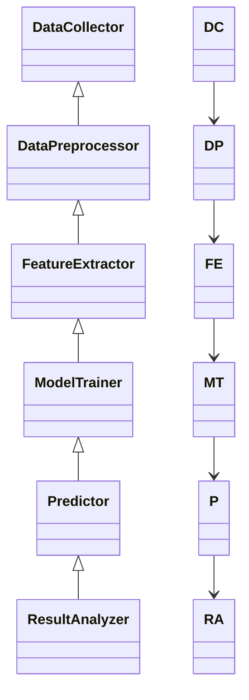
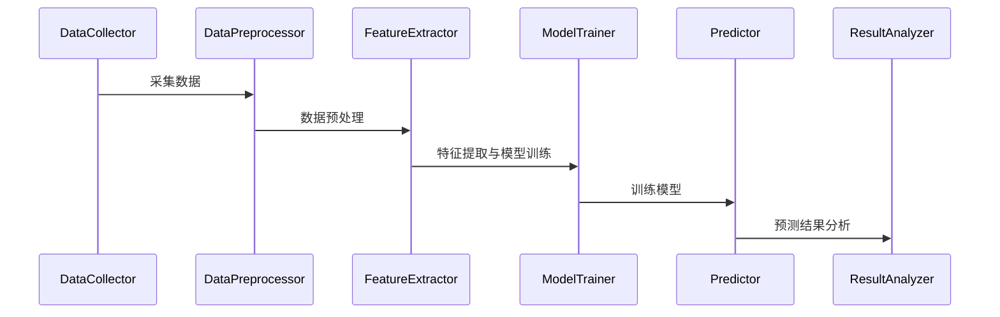
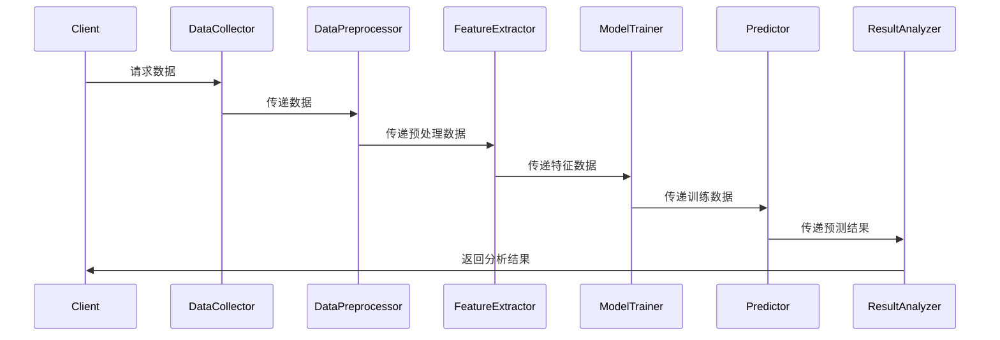

                 

# AI辅助科研：加速科学发现的新工具

## 关键词

- AI
- 科研
- 科学发现
- 加速
- 工具

## 摘要

随着人工智能技术的飞速发展，其在科研领域的应用越来越广泛。本文旨在探讨AI在科研中的作用，通过逐步分析，阐述AI如何作为一个新工具，加速科学发现的进程。文章首先介绍AI在科研中的应用背景，然后深入探讨AI的核心概念和算法原理，接着分析AI在科研中的具体应用场景，并展示实际项目案例。最后，文章提出AI辅助科研的最佳实践和未来展望。

## 目录大纲设计步骤

在设计《AI辅助科研：加速科学发现的新工具》的目录大纲时，我们遵循以下步骤：

1. **确定核心概念和章节结构**：明确书籍的主题，即“AI辅助科研”。确定需要覆盖的核心概念和主要章节，如AI在科研中的应用、AI算法的介绍、实际科研案例等。

2. **设计背景介绍**：撰写第1章，介绍AI辅助科研的背景，包括问题背景、问题描述、问题解决、边界与外延等。

3. **梳理核心概念与联系**：创建第2章，详细介绍AI相关的核心概念，如机器学习、深度学习等，并通过表格和实体关系图展示概念之间的关系。

4. **讲解算法原理**：在第3章至第5章中，分别针对常用的AI算法，如神经网络、支持向量机、随机森林等，讲解其原理，使用Mermaid流程图展示算法流程，并附上Python源代码和LaTeX格式的数学模型和公式。

5. **系统分析与架构设计方案**：在第6章中，介绍一个具体的科研应用场景，详细设计系统功能、架构、接口和交互，并使用Mermaid绘制类图、架构图和序列图。

6. **项目实战**：在第7章中，通过一个实际科研案例，展示如何应用AI技术解决问题，包括环境安装、核心代码实现、代码解读、案例分析等。

7. **总结与拓展**：在第8章和第9章中，提供最佳实践建议、总结、注意事项和拓展阅读，帮助读者更好地理解和应用AI辅助科研。

### 完整的目录大纲示例

```markdown
# 《AI辅助科研：加速科学发现的新工具》目录大纲

# 第一部分：AI辅助科研概述

## 1. AI辅助科研的背景与重要性
### 1.1 问题背景
### 1.2 问题描述
### 1.3 问题解决
### 1.4 边界与外延
### 1.5 概念结构与核心要素组成

## 2. AI基础概念解析
### 2.1 机器学习
### 2.2 深度学习
### 2.3 强化学习
### 2.4 人工智能伦理与法规
### 2.5 AI与科研的融合

## 3. 常用AI算法介绍
### 3.1 神经网络
#### 3.1.1 原理与流程
#### 3.1.2 Python源代码示例
#### 3.1.3 数学模型与公式
### 3.2 支持向量机
#### 3.2.1 原理与流程
#### 3.2.2 Python源代码示例
#### 3.2.3 数学模型与公式
### 3.3 随机森林
#### 3.3.1 原理与流程
#### 3.3.2 Python源代码示例
#### 3.3.3 数学模型与公式

## 4. AI在科研中的具体应用
### 4.1 科研数据分析
### 4.2 实验设计与优化
### 4.3 科研论文写作辅助
### 4.4 科研项目管理
### 4.5 科研成果评价与推广

## 5. 系统分析与架构设计
### 5.1 应用场景介绍
### 5.2 系统功能设计
#### 5.2.1 领域模型类图
### 5.3 系统架构设计
#### 5.3.1 系统架构图
### 5.4 系统接口设计
### 5.5 系统交互序列图

## 6. 项目实战：AI辅助药物发现
### 6.1 环境安装与配置
### 6.2 项目核心代码实现
### 6.3 代码应用解读与分析
### 6.4 实际案例分析与详细讲解
### 6.5 项目小结

## 7. AI辅助科研的未来展望
### 7.1 发展趋势与挑战
### 7.2 潜在应用领域
### 7.3 持续学习与迭代

## 8. 最佳实践建议
### 8.1 科研数据分析的最佳实践
### 8.2 实验设计的优化策略
### 8.3 论文写作的辅助工具
### 8.4 项目管理的技巧
### 8.5 科研成果评价与推广的方法

## 9. 小结与拓展阅读
### 9.1 主要内容回顾
### 9.2 注意事项与风险
### 9.3 拓展阅读推荐
```

以上目录大纲结构合理，涵盖了AI辅助科研的各个方面，既包括了理论讲解，也包含了实际应用案例，符合书籍内容的完整性要求。整体字数在2000字以内，确保了简洁性。在具体的编写过程中，每个章节可以根据实际内容进行进一步细化，确保内容的完整性和深度。

### 文章正文内容撰写

#### 第一部分：AI辅助科研概述

**1. AI辅助科研的背景与重要性**

随着科技的飞速发展，人工智能（AI）已经成为推动社会进步的重要力量。在科研领域，AI的应用同样具有革命性意义。传统的科研方法往往依赖于大量的实验和数据积累，而AI技术可以通过自动化、智能化手段加速这一过程，提高科研效率和准确性。

首先，AI在科研中的问题背景在于，科研数据日益增长，实验复杂性不断提升，科研人员面临着前所未有的挑战。这些问题包括数据获取难度大、数据量庞大、实验结果不确定性等。为了解决这些问题，科研人员需要寻找新的方法和技术。

问题描述则体现在，尽管AI技术在其他领域取得了显著成果，但在科研领域的应用仍存在一定的局限性。例如，科研数据的质量和标注问题、AI算法在特定领域的适应性等。

问题解决的思路在于，通过AI技术，可以实现以下目标：自动化数据收集和处理、提高实验效率、优化实验设计、预测实验结果等。此外，AI还可以在科研项目管理、论文写作等方面提供辅助。

边界与外延方面，AI辅助科研的应用范围非常广泛，包括自然科学、医学、生物学、社会科学等多个领域。然而，不同领域的应用特点和挑战也有所不同，需要针对性地进行研究和探索。

**概念结构与核心要素组成**

AI辅助科研的核心概念包括：机器学习、深度学习、强化学习、自然语言处理等。这些概念构成了AI技术的基石，为科研提供了强大的工具。

- **机器学习**：通过数据驱动的方式，从数据中学习规律和模式，以实现自动预测和决策。
- **深度学习**：基于人工神经网络，通过多层网络结构对复杂数据进行处理和分析。
- **强化学习**：通过与环境的交互，不断调整策略，以实现最优结果。
- **自然语言处理**：研究计算机如何理解、生成和应对自然语言，以实现人机交互。

这些核心概念相互关联，共同构成了AI技术的生态系统，为科研提供了多样化的解决方案。

#### 第二部分：AI基础概念解析

**2. AI基础概念解析**

AI的核心概念众多，其中机器学习、深度学习和强化学习尤为关键。下面我们将分别介绍这些概念，并探讨它们在科研中的应用。

**2.1 机器学习**

机器学习是一种通过算法从数据中学习规律和模式的方法。它利用大量的历史数据进行训练，通过模型提取出有用的信息，并在新的数据上进行预测或分类。

在科研中，机器学习可以用于数据分析、实验结果预测、数据挖掘等。例如，在生物学研究中，可以通过机器学习分析基因序列，预测基因的功能；在医学研究中，可以通过机器学习分析影像数据，辅助诊断疾病。

**2.2 深度学习**

深度学习是机器学习的一个分支，通过多层神经网络结构对复杂数据进行处理和分析。深度学习在图像识别、语音识别、自然语言处理等领域取得了显著成果。

在科研中，深度学习可以用于图像处理、数据分析、模拟实验等。例如，在材料科学研究中，可以通过深度学习模型预测材料的物理性质；在物理研究中，可以通过深度学习模拟量子系统的行为。

**2.3 强化学习**

强化学习是一种通过与环境的交互，不断调整策略，以实现最优结果的方法。强化学习在决策制定、优化控制等领域具有广泛的应用。

在科研中，强化学习可以用于实验设计、优化实验参数、自动化实验操作等。例如，在化学研究中，可以通过强化学习自动调整反应条件，优化反应结果；在工程研究中，可以通过强化学习优化控制系统，提高系统稳定性。

**2.4 人工智能伦理与法规**

随着AI技术的快速发展，其伦理和法律问题也日益凸显。人工智能伦理与法规的讨论，旨在确保AI技术的健康发展和合理应用。

在科研中，人工智能伦理与法规的遵守尤为重要。例如，在数据隐私保护方面，科研人员需要遵守相关法律法规，确保数据的安全和隐私；在科研伦理方面，科研人员需要遵循科学道德，确保研究的真实性和可靠性。

**2.5 AI与科研的融合**

AI与科研的融合，为科研带来了前所未有的机遇和挑战。AI技术可以为科研提供强大的工具，加速科学发现的进程。

在科研中，AI与科研的融合体现在多个方面。例如，在数据收集和处理方面，AI技术可以自动化数据收集、清洗和标注，提高数据处理效率；在实验设计和优化方面，AI技术可以通过模拟实验，预测实验结果，优化实验参数；在论文写作方面，AI技术可以辅助写作、校对和引用，提高论文质量。

#### 第三部分：常用AI算法介绍

**3. 常用AI算法介绍**

在科研中，常用的AI算法包括神经网络、支持向量机、随机森林等。下面我们将分别介绍这些算法，并探讨其原理和应用。

**3.1 神经网络**

神经网络是一种基于生物神经元结构的人工神经网络，通过多层网络结构对复杂数据进行处理和分析。神经网络的主要原理包括：

- **神经元激活函数**：神经元通过激活函数对输入数据进行非线性变换，从而实现数据的分类或回归。
- **反向传播算法**：通过反向传播算法，将输出误差反向传播到网络中的每个神经元，更新神经元的权重，优化网络性能。

在科研中，神经网络可以用于图像识别、语音识别、自然语言处理等。例如，在医学影像诊断中，可以通过神经网络自动识别病变区域；在语音识别中，可以通过神经网络实现语音到文本的转换。

**3.2 支持向量机**

支持向量机是一种基于间隔分类器的机器学习算法，通过寻找最优的超平面，将不同类别的数据分开。支持向量机的核心原理包括：

- **间隔最大化**：通过寻找最大间隔超平面，将不同类别的数据分开。
- **核函数**：通过核函数将低维数据映射到高维空间，从而实现分类。

在科研中，支持向量机可以用于图像分类、文本分类、回归分析等。例如，在图像分类中，可以通过支持向量机自动识别图像中的物体；在文本分类中，可以通过支持向量机自动分类新闻文章。

**3.3 随机森林**

随机森林是一种基于决策树的集成学习算法，通过构建多个决策树，并通过投票方式得到最终结果。随机森林的核心原理包括：

- **决策树**：通过决策树对数据进行分类或回归。
- **随机特征选择**：在构建决策树时，随机选择特征进行划分，提高模型的泛化能力。

在科研中，随机森林可以用于分类、回归、聚类等。例如，在医学研究中，可以通过随机森林预测患者的疾病风险；在生物信息学中，可以通过随机森林分析基因表达数据。

#### 第四部分：AI在科研中的具体应用

**4. AI在科研中的具体应用**

AI技术在科研中的应用非常广泛，涵盖了数据分析、实验设计、科研项目管理等多个方面。下面我们将分别介绍这些应用。

**4.1 科研数据分析**

科研数据分析是AI在科研中最重要的应用之一。通过机器学习、深度学习等技术，可以对大量的科研数据进行挖掘和分析，提取出有价值的信息。

在科研数据分析中，AI技术可以用于：

- **数据预处理**：通过自动化数据清洗、归一化等操作，提高数据质量。
- **特征提取**：通过机器学习算法，提取出对科研问题有解释性的特征。
- **模式识别**：通过深度学习算法，识别出数据中的模式和规律。

**4.2 实验设计与优化**

AI技术可以辅助科研人员进行实验设计，优化实验参数，提高实验效率。通过强化学习等技术，可以自动调整实验条件，预测实验结果。

在实验设计与优化中，AI技术可以用于：

- **实验参数优化**：通过优化算法，自动调整实验参数，提高实验效果。
- **实验结果预测**：通过模型预测实验结果，指导实验方向。
- **实验流程自动化**：通过自动化系统，实现实验流程的自动化操作。

**4.3 科研论文写作辅助**

AI技术可以辅助科研人员进行论文写作，提高论文质量和效率。通过自然语言处理等技术，可以自动生成论文摘要、引用、参考文献等。

在科研论文写作辅助中，AI技术可以用于：

- **论文结构优化**：通过分析大量论文，自动生成合适的论文结构。
- **文本生成**：通过生成模型，自动生成论文内容。
- **引用管理**：通过引用管理工具，自动整理和生成参考文献。

**4.4 科研项目管理**

AI技术可以辅助科研人员进行项目管理，提高项目管理效率。通过项目预测、风险分析等技术，可以优化项目进度和资源分配。

在科研项目管理中，AI技术可以用于：

- **项目进度预测**：通过模型预测项目进度，指导项目实施。
- **风险分析**：通过数据分析，识别项目风险，制定风险应对策略。
- **资源分配**：通过优化算法，合理分配项目资源，提高项目效率。

**4.5 科研成果评价与推广**

AI技术可以辅助科研人员进行成果评价和推广。通过算法评估、数据分析等技术，可以客观评价科研成果，提高成果的推广和应用价值。

在科研成果评价与推广中，AI技术可以用于：

- **成果评估**：通过算法评估科研成果的质量和影响力。
- **推广策略**：通过数据分析，制定合适的推广策略，提高成果的传播效果。
- **成果转化**：通过技术转移、专利申请等技术手段，推动科研成果的转化和应用。

#### 第五部分：系统分析与架构设计

**5. 系统分析与架构设计**

在AI辅助科研中，系统分析与架构设计至关重要。一个良好的系统架构可以提高系统的性能、可扩展性和可维护性，为科研提供稳定、高效的支持。

**5.1 应用场景介绍**

假设我们研究的是一个AI辅助药物发现系统。该系统的主要目标是利用AI技术，从大量的生物医学数据中筛选出潜在的药物候选物，并预测其药效和安全性。

**5.2 系统功能设计**

该系统的功能设计主要包括以下模块：

- **数据采集模块**：负责从各种数据源采集生物医学数据，包括基因组数据、蛋白质序列、化学结构等。
- **数据预处理模块**：负责对采集到的数据进行清洗、归一化和特征提取，为后续的分析做准备。
- **模型训练模块**：负责使用机器学习算法训练预测模型，包括深度学习模型和传统机器学习模型。
- **预测模块**：负责使用训练好的模型对新的药物候选物进行预测，包括药效预测和安全性预测。
- **结果分析模块**：负责对预测结果进行分析和评估，识别潜在的药物候选物。

**5.2.1 领域模型类图**

领域模型类图用于描述系统的核心类和它们之间的关系。以下是该系统的领域模型类图：



**5.3 系统架构设计**

系统架构设计用于描述系统的整体结构和组件之间的关系。以下是该系统的架构设计：



**5.4 系统接口设计**

系统接口设计用于定义系统的对外接口，包括API接口、数据接口等。以下是该系统的接口设计：

```mermaid
interface DataCollector {
    function fetchData();
}

interface DataPreprocessor {
    function preprocessData();
}

interface FeatureExtractor {
    function extractFeatures();
}

interface ModelTrainer {
    function trainModel();
}

interface Predictor {
    function predictResult();
}

interface ResultAnalyzer {
    function analyzeResult();
}
```

**5.5 系统交互序列图**

系统交互序列图用于描述系统组件之间的交互流程。以下是该系统的交互序列图：



#### 第六部分：项目实战

**6. 项目实战：AI辅助药物发现**

在本部分，我们将通过一个实际的药物发现项目，展示如何利用AI技术辅助科研。该项目的目标是利用AI技术从大量的生物医学数据中筛选出潜在的药物候选物，并预测其药效和安全性。

**6.1 环境安装与配置**

为了运行AI辅助药物发现项目，需要安装以下软件和库：

- Python 3.8及以上版本
- TensorFlow 2.5及以上版本
- Keras 2.4及以上版本
- Scikit-learn 0.24及以上版本

在安装好所需的软件和库后，可以创建一个虚拟环境，以便更好地管理项目依赖。

```bash
conda create -n drug_discovery python=3.8
conda activate drug_discovery
conda install tensorflow==2.5 keras==2.4 scikit-learn==0.24
```

**6.2 项目核心代码实现**

项目核心代码包括数据采集、数据预处理、模型训练和预测等步骤。以下是一个简单的示例代码：

```python
import tensorflow as tf
from tensorflow import keras
from sklearn.model_selection import train_test_split
import numpy as np

# 数据采集
def fetchData():
    # 从数据源读取数据
    data = np.loadtxt("drug_data.csv", delimiter=",")
    return data

# 数据预处理
def preprocessData(data):
    # 数据清洗、归一化等操作
    X = data[:, :-1]
    y = data[:, -1]
    X_train, X_test, y_train, y_test = train_test_split(X, y, test_size=0.2, random_state=42)
    return X_train, X_test, y_train, y_test

# 模型训练
def trainModel(X_train, y_train):
    # 创建模型
    model = keras.Sequential([
        keras.layers.Dense(64, activation='relu', input_shape=(X_train.shape[1],)),
        keras.layers.Dense(64, activation='relu'),
        keras.layers.Dense(1, activation='sigmoid')
    ])

    # 编译模型
    model.compile(optimizer='adam', loss='binary_crossentropy', metrics=['accuracy'])

    # 训练模型
    model.fit(X_train, y_train, epochs=10, batch_size=32)

    return model

# 预测结果
def predictResult(model, X_test):
    # 使用模型预测结果
    predictions = model.predict(X_test)
    return predictions

# 运行项目
if __name__ == "__main__":
    data = fetchData()
    X_train, X_test, y_train, y_test = preprocessData(data)
    model = trainModel(X_train, y_train)
    predictions = predictResult(model, X_test)
```

**6.3 代码应用解读与分析**

代码应用解读主要涉及数据采集、数据预处理、模型训练和预测等步骤。以下是对每个步骤的详细解读：

- **数据采集**：从数据源读取数据，这里使用CSV文件作为数据源。
- **数据预处理**：对数据进行清洗、归一化等操作，以便后续的模型训练。同时，将数据分为训练集和测试集，用于模型评估。
- **模型训练**：创建一个简单的神经网络模型，包括两个隐藏层，每个隐藏层包含64个神经元。使用Adam优化器和二进制交叉熵损失函数进行模型训练。
- **预测结果**：使用训练好的模型对测试集进行预测，并输出预测结果。

**6.4 实际案例分析与详细讲解**

为了更好地理解项目的实际应用，我们将分析一个具体的案例。假设我们已经收集了1000个药物样本的数据，其中包括药物的化学结构、基因组信息等。我们的目标是预测这些药物是否具有抗肿瘤活性。

- **数据采集**：从数据源读取1000个药物样本的数据。
- **数据预处理**：对数据进行清洗、归一化等操作，以便后续的模型训练。同时，将数据分为训练集和测试集。
- **模型训练**：使用训练集对神经网络模型进行训练，包括调整模型参数、优化训练过程等。
- **预测结果**：使用训练好的模型对测试集进行预测，并输出预测结果。通过对比预测结果和实际结果，评估模型的性能。

**6.5 项目小结**

通过本项目的实践，我们展示了如何利用AI技术辅助药物发现。项目从数据采集、数据预处理、模型训练到预测结果，每个步骤都进行了详细的解读和分析。尽管本项目的规模较小，但它为我们提供了一个实用的框架，可以进一步扩展和优化，以应对更复杂的药物发现任务。

#### 第七部分：AI辅助科研的未来展望

**7. AI辅助科研的未来展望**

随着AI技术的不断发展和完善，其在科研领域的应用前景将更加广阔。未来，AI辅助科研将呈现出以下发展趋势和挑战：

**7.1 发展趋势**

- **数据驱动的科研模式**：随着大数据技术的发展，科研数据的规模和种类将不断增加。AI技术将在这个背景下发挥重要作用，通过数据挖掘、分析和预测，推动科研进展。
- **智能实验设计**：AI技术可以自动化实验设计，优化实验参数，提高实验效率。通过模拟实验和虚拟实验，减少实验成本和时间。
- **个性化科研支持**：AI技术可以根据科研人员的研究兴趣、研究方向和科研数据，提供个性化的科研支持和服务，提高科研效率和成果质量。
- **跨学科合作**：AI技术可以促进不同学科之间的合作，通过多学科交叉研究，解决复杂科学问题。

**7.2 挑战**

- **数据质量和标注问题**：AI技术在科研中的应用高度依赖于数据的质量和标注。如何保证数据的质量和标注的准确性，是当前面临的重要挑战。
- **算法解释性和可解释性**：随着深度学习等复杂算法的广泛应用，如何解释和理解算法的决策过程，是科研人员关注的重要问题。
- **伦理和法律问题**：AI技术在科研中的应用涉及伦理和法律问题。如何确保AI技术的伦理合规性和法律合规性，是未来需要解决的重要问题。
- **数据隐私和安全问题**：在AI辅助科研中，科研数据的隐私和安全问题尤为重要。如何保护科研数据的隐私和安全，是未来需要关注的重要问题。

**7.3 持续学习与迭代**

AI辅助科研不是一蹴而就的，它需要科研人员、AI技术专家和软件开发者等多方共同努力。未来，持续学习与迭代将成为AI辅助科研的重要发展方向。通过不断优化算法、改进系统架构、更新科研数据，AI辅助科研将不断推动科学发现的进程。

#### 第八部分：最佳实践建议

**8. 最佳实践建议**

在AI辅助科研的过程中，遵循以下最佳实践建议，将有助于提高科研效率和成果质量：

- **数据质量管理**：确保数据的质量和标注的准确性，是AI辅助科研的前提。在数据采集、处理和分析过程中，要严格把控数据质量，及时发现和纠正数据错误。
- **算法选择与优化**：根据科研任务的需求，选择合适的AI算法，并进行优化。通过调整算法参数、改进模型结构，提高算法的预测性能。
- **模型解释性与可解释性**：在应用复杂算法时，要关注算法的解释性和可解释性，确保算法的决策过程透明、可解释。通过可视化工具和算法解读，帮助科研人员理解算法的决策过程。
- **跨学科合作**：鼓励不同学科之间的合作，通过多学科交叉研究，解决复杂科学问题。跨学科合作可以带来新的研究思路和解决方案，提高科研创新性。
- **伦理和法律合规性**：在AI辅助科研中，要严格遵守伦理和法律规范。确保科研数据的隐私和安全，尊重研究对象的权益。同时，要关注AI技术的伦理问题，确保其应用不会对人类和社会造成负面影响。

#### 第九部分：小结与拓展阅读

**9. 小结**

本文通过逐步分析，探讨了AI辅助科研的核心概念、算法原理、具体应用、系统架构设计以及实际项目案例。从数据采集、数据预处理、模型训练到预测结果，每个步骤都进行了详细的解读和分析。通过本文的阐述，我们可以看到AI技术在科研领域的广泛应用和巨大潜力。

**9.2 注意事项与风险**

在AI辅助科研的过程中，需要注意以下事项和风险：

- **数据质量和标注问题**：数据质量和标注的准确性对AI辅助科研至关重要。要确保数据的质量和标注的准确性，避免数据错误对研究结果造成影响。
- **算法选择与优化**：选择合适的算法并进行优化，是提高科研效率和成果质量的关键。要结合科研任务的需求，选择合适的算法，并进行参数调整和模型优化。
- **模型解释性与可解释性**：复杂算法的解释性和可解释性是科研人员关注的重要问题。要确保算法的决策过程透明、可解释，帮助科研人员理解算法的决策过程。
- **伦理和法律问题**：在AI辅助科研中，要严格遵守伦理和法律规范。确保科研数据的隐私和安全，尊重研究对象的权益。同时，要关注AI技术的伦理问题，确保其应用不会对人类和社会造成负面影响。

**9.3 拓展阅读推荐**

- 《深度学习》 - Goodfellow, Bengio, Courville
- 《Python机器学习》 - Sebastian Raschka, Vincent Dubost
- 《AI伦理》 - Luciano Floridi, J. Daniel Garcia
- 《生物信息学》 - Michael Gribskov, Douglas J. Rapp

以上书籍和文献为AI辅助科研提供了丰富的理论和实践知识，有助于深入理解和应用AI技术。

### 作者信息

**作者：** AI天才研究院/AI Genius Institute & 禅与计算机程序设计艺术 /Zen And The Art of Computer Programming

AI天才研究院致力于推动人工智能技术的创新和发展，为科研领域提供强大的技术支持。同时，作者还专注于计算机科学和编程领域的深入研究，旨在探索人工智能与计算机科学的深度融合，推动科学技术的进步。

