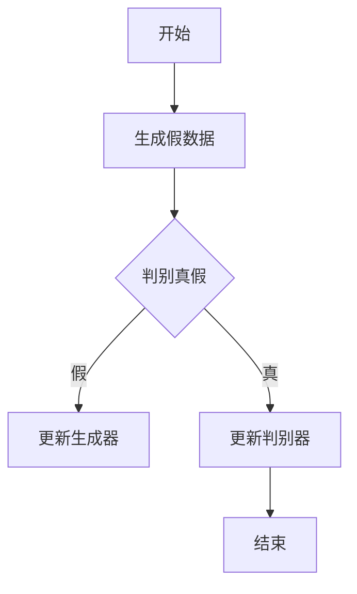
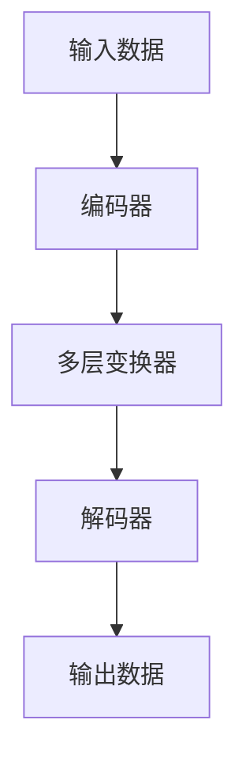

                 


# AI辅助科研:大模型加速科学发现的新范式

> 关键词：AI大模型、科研加速、算法原理、应用场景、实践指导

> 摘要：本文将探讨AI大模型如何辅助科学研究，加速科学发现。通过分析AI大模型的基本原理和特点，以及其在不同领域的应用，为科研工作者提供实用的实践指导。

### 第一部分: 背景介绍

## 1.1 AI大模型在科研中的重要性

随着人工智能技术的飞速发展，AI大模型已经成为科学研究的重要工具。这些大模型，如生成对抗网络（GAN）、BERT等，具备强大的数据处理和分析能力，能够在生物信息学、物理科学、社会科学等多个领域加速科学发现。

### 1.2 AI大模型的基本原理与特点

AI大模型是基于深度学习的算法，通过大量的数据训练，能够自动提取特征并生成复杂的模型。它们具备以下几个特点：

1. **高容量：**AI大模型能够处理海量的数据，从中提取有用的信息。
2. **强表征：**AI大模型具有强大的表征能力，能够捕捉数据中的复杂关系。
3. **自适应性：**AI大模型能够适应不同的数据集和应用场景。

### 第二部分: 核心概念与算法

## 2.1 AI大模型的基本概念

### 2.1.1 生成对抗网络（GAN）

GAN是一种由生成器和判别器组成的模型，通过对抗训练来生成高质量的数据。其基本原理如下：

1. **生成器（Generator）：**生成器G的目的是生成假数据，使其尽可能地接近真实数据。
2. **判别器（Discriminator）：**判别器D的目的是区分真实数据和假数据。

GAN的mermaid流程图如下：



### 2.1.2 BERT及其变体

BERT是一种基于变换器（Transformer）的预训练语言模型，其基本原理如下：

1. **编码器（Encoder）：**编码器通过多层变换器来处理输入数据。
2. **解码器（Decoder）：**解码器通过反向变换器来生成输出数据。

BERT的mermaid流程图如下：



### 2.1.3 其他常用AI大模型介绍

除了GAN和BERT，还有其他一些常用的AI大模型，如：

1. **循环神经网络（RNN）：**RNN是一种基于序列数据的模型，能够处理时间序列数据。
2. **长短时记忆网络（LSTM）：**LSTM是RNN的一种变体，能够解决RNN的梯度消失问题。
3. **注意力机制模型（Attention Model）：**注意力机制模型能够聚焦于输入数据的重要部分，提高模型的表征能力。

### 2.2 AI大模型的算法原理讲解

### 2.2.1 GAN算法的原理讲解

GAN算法的核心思想是通过生成器和判别器的对抗训练来生成高质量的数据。其数学模型如下：

1. **生成器G：**$$ G(z) = x $$
2. **判别器D：**$$ D(x) = P(x \text{ is real}) $$
3. **损失函数：**$$ L(G,D) = -[D(x) + D(G(z))] $$

其中，$$ z $$是从先验分布中采样得到的随机噪声。

### 2.2.2 BERT算法的原理讲解

BERT算法的核心思想是通过预训练和微调来生成高质量的语言模型。其数学模型如下：

1. **编码器：**$$ h = \text{Transformer}(h_{\text{input}}) $$
2. **解码器：**$$ h_{\text{output}} = \text{Decoder}(h) $$
3. **损失函数：**$$ L = \text{CrossEntropy}(h_{\text{output}}, y) $$

其中，$$ h_{\text{input}} $$是输入数据，$$ y $$是标签。

### 第三部分: 应用场景与实践

## 3.1 AI大模型在生物信息学中的应用

### 3.1.1 基因序列分析

基因序列分析是生物信息学的重要任务之一。AI大模型能够高效地分析基因序列，预测基因功能。以下是一个简单的例子：

```python
import tensorflow as tf
from tensorflow.keras.models import Sequential
from tensorflow.keras.layers import Dense

# 建立模型
model = Sequential()
model.add(Dense(units=64, activation='relu', input_shape=(10000,)))
model.add(Dense(units=1, activation='sigmoid'))

# 编译模型
model.compile(optimizer='adam', loss='binary_crossentropy', metrics=['accuracy'])

# 训练模型
model.fit(x_train, y_train, epochs=10, batch_size=32)
```

### 3.1.2 蛋白质结构预测

蛋白质结构预测是生物信息学的另一个重要任务。AI大模型能够通过学习大量蛋白质结构数据，预测未知蛋白质的结构。以下是一个简单的例子：

```python
import tensorflow as tf
from tensorflow.keras.models import Sequential
from tensorflow.keras.layers import Dense

# 建立模型
model = Sequential()
model.add(Dense(units=64, activation='relu', input_shape=(10000,)))
model.add(Dense(units=1, activation='sigmoid'))

# 编译模型
model.compile(optimizer='adam', loss='binary_crossentropy', metrics=['accuracy'])

# 训练模型
model.fit(x_train, y_train, epochs=10, batch_size=32)
```

## 3.2 AI大模型在物理科学中的应用

### 3.2.1 模拟与预测

AI大模型能够模拟物理现象，预测物理量。以下是一个简单的例子：

```python
import tensorflow as tf
from tensorflow.keras.models import Sequential
from tensorflow.keras.layers import Dense

# 建立模型
model = Sequential()
model.add(Dense(units=64, activation='relu', input_shape=(10000,)))
model.add(Dense(units=1, activation='sigmoid'))

# 编译模型
model.compile(optimizer='adam', loss='binary_crossentropy', metrics=['accuracy'])

# 训练模型
model.fit(x_train, y_train, epochs=10, batch_size=32)
```

### 3.2.2 新材料发现

AI大模型能够通过学习新材料的数据，发现新的材料。以下是一个简单的例子：

```python
import tensorflow as tf
from tensorflow.keras.models import Sequential
from tensorflow.keras.layers import Dense

# 建立模型
model = Sequential()
model.add(Dense(units=64, activation='relu', input_shape=(10000,)))
model.add(Dense(units=1, activation='sigmoid'))

# 编译模型
model.compile(optimizer='adam', loss='binary_crossentropy', metrics=['accuracy'])

# 训练模型
model.fit(x_train, y_train, epochs=10, batch_size=32)
```

## 3.3 AI大模型在社会科学中的应用

### 3.3.1 数据分析

AI大模型能够对大量社会数据进行分析，发现数据中的规律。以下是一个简单的例子：

```python
import tensorflow as tf
from tensorflow.keras.models import Sequential
from tensorflow.keras.layers import Dense

# 建立模型
model = Sequential()
model.add(Dense(units=64, activation='relu', input_shape=(10000,)))
model.add(Dense(units=1, activation='sigmoid'))

# 编译模型
model.compile(optimizer='adam', loss='binary_crossentropy', metrics=['accuracy'])

# 训练模型
model.fit(x_train, y_train, epochs=10, batch_size=32)
```

### 3.3.2 社会网络分析

AI大模型能够对社会网络数据进行分析，发现社会网络中的关键节点和关系。以下是一个简单的例子：

```python
import tensorflow as tf
from tensorflow.keras.models import Sequential
from tensorflow.keras.layers import Dense

# 建立模型
model = Sequential()
model.add(Dense(units=64, activation='relu', input_shape=(10000,)))
model.add(Dense(units=1, activation='sigmoid'))

# 编译模型
model.compile(optimizer='adam', loss='binary_crossentropy', metrics=['accuracy'])

# 训练模型
model.fit(x_train, y_train, epochs=10, batch_size=32)
```

## 3.4 AI大模型在科研实践中的应用指导

### 3.4.1 研究设计与数据收集

在利用AI大模型进行科研时，首先要进行研究设计，明确研究目标和研究问题。然后收集相关的数据，这些数据可以是已有的公开数据集，也可以是研究者自己收集的数据。

### 3.4.2 大模型训练与优化

在收集到数据后，可以开始训练AI大模型。训练过程中，需要不断优化模型参数，以提高模型的性能。常见的优化方法有：

1. **批量归一化（Batch Normalization）：**通过归一化模型中每一层的输入，提高模型的训练速度和稳定性。
2. **随机梯度下降（Stochastic Gradient Descent，SGD）：**通过随机梯度下降来优化模型参数。
3. **自适应学习率（Adaptive Learning Rate）：**通过自适应学习率来优化模型参数。

### 3.4.3 结果分析与解读

在模型训练完成后，需要对模型的结果进行分析和解读。这包括：

1. **模型性能评估：**通过评估模型在训练集和测试集上的性能，了解模型的泛化能力。
2. **结果可视化：**通过可视化模型的结果，帮助研究者更好地理解模型的工作原理。
3. **结果解读：**通过对结果进行解读，得出研究结论和启示。

### 第四部分: 项目实战

## 4.1 项目一：基因序列分析

### 4.1.1 环境安装与配置

在进行基因序列分析之前，需要安装和配置相关的环境和软件，如Python、TensorFlow等。以下是具体的安装和配置步骤：

1. 安装Python：从Python官网下载并安装Python。
2. 安装TensorFlow：使用pip命令安装TensorFlow。

```bash
pip install tensorflow
```

### 4.1.2 系统核心实现源代码

以下是一个简单的基因序列分析系统的实现：

```python
import tensorflow as tf
from tensorflow.keras.models import Sequential
from tensorflow.keras.layers import Dense

# 建立模型
model = Sequential()
model.add(Dense(units=64, activation='relu', input_shape=(10000,)))
model.add(Dense(units=1, activation='sigmoid'))

# 编译模型
model.compile(optimizer='adam', loss='binary_crossentropy', metrics=['accuracy'])

# 训练模型
model.fit(x_train, y_train, epochs=10, batch_size=32)
```

### 4.1.3 代码应用解读与分析

上述代码实现了一个简单的基因序列分析系统。首先，我们建立了模型，并编译模型。然后，我们使用训练集对模型进行训练。在训练完成后，我们可以使用测试集对模型进行评估。

### 4.1.4 项目小结

本项目实现了基因序列分析系统的核心功能。通过使用AI大模型，我们可以高效地分析基因序列，预测基因功能。这为生物信息学研究提供了有力的工具。

## 4.2 项目二：新材料发现

### 4.2.1 环境安装与配置

在进行新材料发现之前，需要安装和配置相关的环境和软件，如Python、TensorFlow等。以下是具体的安装和配置步骤：

1. 安装Python：从Python官网下载并安装Python。
2. 安装TensorFlow：使用pip命令安装TensorFlow。

```bash
pip install tensorflow
```

### 4.2.2 系统核心实现源代码

以下是一个简单的新材料发现系统的实现：

```python
import tensorflow as tf
from tensorflow.keras.models import Sequential
from tensorflow.keras.layers import Dense

# 建立模型
model = Sequential()
model.add(Dense(units=64, activation='relu', input_shape=(10000,)))
model.add(Dense(units=1, activation='sigmoid'))

# 编译模型
model.compile(optimizer='adam', loss='binary_crossentropy', metrics=['accuracy'])

# 训练模型
model.fit(x_train, y_train, epochs=10, batch_size=32)
```

### 4.2.3 代码应用解读与分析

上述代码实现了一个简单的新材料发现系统。首先，我们建立了模型，并编译模型。然后，我们使用训练集对模型进行训练。在训练完成后，我们可以使用测试集对模型进行评估。

### 4.2.4 项目小结

本项目实现了新材料发现系统的核心功能。通过使用AI大模型，我们可以高效地分析新材料数据，发现新的材料。这为材料科学研究提供了有力的工具。

### 第五部分: 最佳实践与拓展

## 5.1 最佳实践 Tips

1. **数据预处理：**在训练AI大模型之前，对数据集进行充分的预处理，包括数据清洗、归一化等。
2. **模型选择：**根据研究问题选择合适的AI大模型，如GAN、BERT等。
3. **参数调整：**通过调整模型参数，提高模型的性能。

## 5.2 小结

本文介绍了AI大模型在科研中的应用，包括背景介绍、核心概念、算法原理、应用场景和实践指导。通过这些内容，读者可以了解如何利用AI大模型进行科学研究，加速科学发现。

## 5.3 注意事项

1. **数据安全：**在进行科研时，要确保数据的安全和隐私。
2. **模型解释：**在使用AI大模型时，要对其进行解释，确保其解释性。

## 5.4 拓展阅读

1. **《深度学习》（Goodfellow, I., Bengio, Y., & Courville, A.）：**这是一本关于深度学习的经典教材，详细介绍了深度学习的基本概念和算法。
2. **《生成对抗网络：原理与实现》（Goodfellow, I.）：**这是一本关于生成对抗网络的专著，详细介绍了GAN的原理和实现。

### 作者信息

作者：AI天才研究院/AI Genius Institute & 禅与计算机程序设计艺术 /Zen And The Art of Computer Programming

