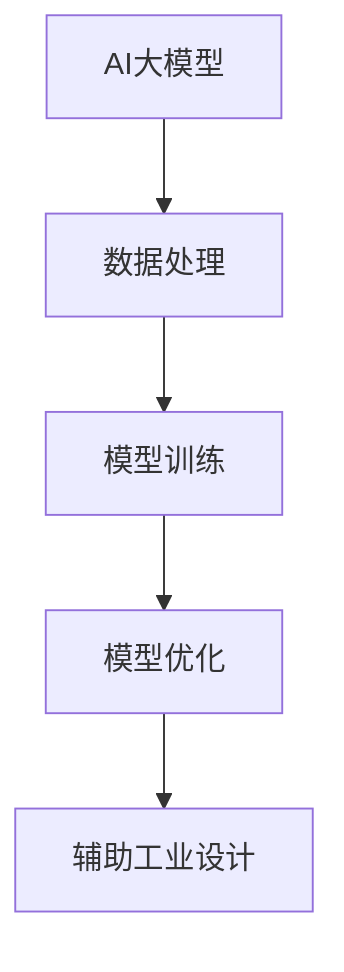

                 

### AI辅助设计：大模型在工业设计中的创新应用

#### 概述

随着人工智能技术的飞速发展，AI辅助设计已经成为现代工业设计领域的重要趋势。本文将围绕AI辅助设计这一主题，深入探讨大模型在工业设计中的创新应用。首先，我们将介绍AI大模型的基本概念和特点，然后分析其在工业设计中的应用场景和优势，接着通过实际案例展示AI大模型在工业设计中的具体应用，最后展望AI辅助设计的未来发展趋势。

#### 关键词

- AI大模型
- 工业设计
- 创新应用
- 实际案例
- 未来趋势

#### 摘要

本文首先介绍了AI大模型的基本概念和特点，接着分析了其在工业设计中的应用场景和优势。通过实际案例展示了AI大模型在工业设计中的具体应用，包括产品设计和用户体验设计等方面。最后，我们对AI辅助设计的未来发展趋势进行了展望，探讨了其潜在的创新应用和面临的挑战。

### 目录大纲设计思路

#### 整体结构规划

本文整体结构规划如下：

1. **引言**：介绍AI辅助设计的背景和重要性，概述本文的主题和结构。
2. **AI大模型基础**：讲解AI大模型的基本概念、特点和主流模型。
3. **AI大模型在工业设计中的应用**：分析AI大模型在工业设计中的应用场景和优势。
4. **工业设计中的AI应用案例**：通过实际案例展示AI大模型在工业设计中的具体应用。
5. **AI大模型开发实战**：介绍AI大模型的开发环境搭建、应用实现和优化。
6. **AI辅助设计的行业趋势与未来展望**：探讨AI辅助设计的未来发展趋势和潜在创新应用。

#### 细化章节内容

1. **引言**：介绍AI辅助设计的背景、重要性和本文结构。
2. **AI大模型概述**：讲解AI大模型的基本概念、特点和主流模型。
3. **AI大模型在产品设计中的应用**：分析AI大模型在产品设计中的应用场景和优势。
4. **AI大模型在用户体验设计中的应用**：分析AI大模型在用户体验设计中的应用场景和优势。
5. **AI大模型在工业设计中的案例研究**：通过实际案例展示AI大模型在工业设计中的具体应用。
6. **AI大模型开发实战**：介绍AI大模型的开发环境搭建、应用实现和优化。
7. **AI辅助设计的行业趋势与未来展望**：探讨AI辅助设计的未来发展趋势和潜在创新应用。

#### 构建核心概念

在本文中，我们将构建以下核心概念：

- **AI大模型**：具有大规模参数和强大的模型学习能力。
- **工业设计**：涉及产品从概念到成品的全过程。
- **产品设计**：关注产品的功能和实用性。
- **用户体验设计**：关注用户在使用产品时的感受和体验。

#### 算法原理与讲解

本文将涉及以下算法原理和讲解：

- **神经网络**：介绍神经网络的基本原理和结构。
- **深度学习**：讲解深度学习的基本原理和常用算法。
- **机器学习**：分析机器学习在AI大模型中的应用。

#### 系统设计与架构

本文将涉及以下系统设计与架构：

- **系统功能设计**：介绍工业设计系统的功能模块和接口设计。
- **系统架构设计**：展示工业设计系统的整体架构和层次结构。
- **系统接口设计**：详细说明系统之间的接口和通信机制。
- **系统交互设计**：描述系统内部各模块之间的交互流程和协作机制。

#### 项目实战

本文将提供以下项目实战：

- **环境安装**：介绍AI大模型开发环境的搭建过程。
- **系统实现**：展示AI大模型在工业设计中的具体实现过程。
- **代码解读**：对关键代码进行解读和分析。
- **案例分析**：分析实际案例中的关键问题和解决方案。

#### 总结与拓展

本文将总结每个章节的核心内容，提供最佳实践和注意事项，并给出拓展阅读建议。

### 步骤实施

#### 确定书名与主题

本文的书名为《AI辅助设计：大模型在工业设计中的创新应用》，主题明确，围绕AI大模型在工业设计中的应用展开。

#### 规划整体结构

根据主题，我们规划出以下整体结构：

1. 引言
2. AI大模型基础
3. AI大模型在工业设计中的应用
4. 工业设计中的AI应用案例
5. AI大模型开发实战
6. AI辅助设计的行业趋势与未来展望

#### 细化章节内容

为每个章节细化内容，如下：

1. **引言**：
   - AI辅助设计的背景和重要性
   - 本文主题和结构概述

2. **AI大模型概述**：
   - AI大模型的基本概念
   - AI大模型的特点
   - 主流AI大模型介绍

3. **AI大模型在产品设计中的应用**：
   - AI大模型在产品设计中的应用场景
   - AI大模型在产品设计中的优势

4. **AI大模型在用户体验设计中的应用**：
   - AI大模型在用户体验设计中的应用场景
   - AI大模型在用户体验设计中的优势

5. **工业设计中的AI应用案例**：
   - 案例一：AI大模型在产品设计中的应用
   - 案例二：AI大模型在用户体验设计中的应用

6. **AI大模型开发实战**：
   - AI大模型开发环境搭建
   - AI大模型应用实现
   - AI大模型应用优化

7. **AI辅助设计的行业趋势与未来展望**：
   - AI辅助设计的行业趋势分析
   - AI辅助设计的未来展望

#### 构建核心概念

构建以下核心概念：

- **AI大模型**：
  - 定义：具有大规模参数和强大的模型学习能力。
  - 特点：强大的学习能力、广泛的适用性、复杂的结构。
  - 主流模型：如GPT、BERT、VGG、ResNet等。

- **工业设计**：
  - 定义：涉及产品从概念到成品的全过程。
  - 内容：产品设计、用户体验设计、交互设计等。

- **产品设计**：
  - 定义：关注产品的功能和实用性。
  - 内容：功能设计、外观设计、结构设计等。

- **用户体验设计**：
  - 定义：关注用户在使用产品时的感受和体验。
  - 内容：交互设计、界面设计、情感化设计等。

#### 算法原理与讲解

选择以下算法进行讲解：

- **神经网络**：
  - 基本原理：神经元模型、前向传播和反向传播。
  - 应用场景：图像识别、语音识别、自然语言处理等。

- **深度学习**：
  - 基本原理：多层神经网络、激活函数、损失函数等。
  - 应用场景：自动驾驶、智能家居、医疗诊断等。

- **机器学习**：
  - 基本原理：监督学习、无监督学习、强化学习等。
  - 应用场景：数据挖掘、推荐系统、异常检测等。

#### 系统设计与架构

设计以下系统架构：

- **系统功能设计**：
  - 功能模块：数据收集、数据处理、模型训练、模型部署等。
  - 接口设计：数据接口、模型接口、服务接口等。

- **系统架构设计**：
  - 整体架构：前端、后端、数据库等。
  - 层次结构：数据层、算法层、应用层等。

- **系统接口设计**：
  - 接口规范：RESTful API、GraphQL等。
  - 通信机制：HTTP/HTTPS、WebSocket等。

- **系统交互设计**：
  - 内部交互：模块间的数据传递、事件处理等。
  - 外部交互：与用户、其他系统的交互等。

#### 项目实战

设计以下项目实战：

- **环境安装**：
  - 操作系统：Windows、Linux、macOS等。
  - 软件环境：Python、TensorFlow、PyTorch等。
  - 硬件环境：CPU、GPU等。

- **系统实现**：
  - 数据处理：数据预处理、数据清洗等。
  - 模型训练：模型构建、模型训练等。
  - 模型部署：模型评估、模型部署等。

- **代码解读**：
  - Python源代码：代码注释、关键代码分析等。
  - LaTeX公式：数学模型、公式推导等。

- **案例分析**：
  - 实际案例：问题描述、解决方案、效果分析等。

#### 总结与拓展

总结每个章节的核心内容，提供最佳实践和注意事项，并给出拓展阅读建议。

### 注意事项

- 确保内容完整性和逻辑性：每个章节的内容需要完整，逻辑清晰，便于读者阅读和理解。
- 使用Mermaid与LaTeX：在绘制图表和使用公式时，要确保格式正确，便于读者阅读。
- 简洁性与可读性：在撰写内容时，注意保持简洁，避免冗余，同时确保内容易于阅读。

### 目录大纲设计

```markdown
# 《AI辅助设计：大模型在工业设计中的创新应用》目录大纲

## 第一部分 引言

### 1. 引言

#### 1.1 AI辅助设计的背景和重要性

#### 1.2 本文主题和结构概述

### 2. AI大模型概述

#### 2.1 AI大模型的基本概念

#### 2.2 AI大模型的特点

#### 2.3 主流AI大模型介绍

### 3. AI大模型在工业设计中的应用

#### 3.1 AI大模型在工业设计中的应用场景

#### 3.2 AI大模型在工业设计中的优势

### 4. AI大模型在产品设计中的应用

#### 4.1 AI大模型在产品设计中的应用场景

#### 4.2 AI大模型在产品设计中的优势

### 5. AI大模型在用户体验设计中的应用

#### 5.1 AI大模型在用户体验设计中的应用场景

#### 5.2 AI大模型在用户体验设计中的优势

### 6. 工业设计中的AI应用案例

#### 6.1 案例一：AI大模型在产品设计中的应用

#### 6.2 案例二：AI大模型在用户体验设计中的应用

### 7. AI大模型开发实战

#### 7.1 AI大模型开发环境搭建

#### 7.2 AI大模型应用实现

#### 7.3 AI大模型应用优化

### 8. AI辅助设计的行业趋势与未来展望

#### 8.1 AI辅助设计的行业趋势分析

#### 8.2 AI辅助设计的未来展望

## 参考文献

### 1. 引言

#### 1.1 AI辅助设计的背景和重要性

#### 1.2 本文主题和结构概述

### 2. AI大模型概述

#### 2.1 AI大模型的基本概念

#### 2.2 AI大模型的特点

#### 2.3 主流AI大模型介绍

### 3. AI大模型在工业设计中的应用

#### 3.1 AI大模型在工业设计中的应用场景

#### 3.2 AI大模型在工业设计中的优势

### 4. AI大模型在产品设计中的应用

#### 4.1 AI大模型在产品设计中的应用场景

#### 4.2 AI大模型在产品设计中的优势

### 5. AI大模型在用户体验设计中的应用

#### 5.1 AI大模型在用户体验设计中的应用场景

#### 5.2 AI大模型在用户体验设计中的优势

### 6. 工业设计中的AI应用案例

#### 6.1 案例一：AI大模型在产品设计中的应用

#### 6.2 案例二：AI大模型在用户体验设计中的应用

### 7. AI大模型开发实战

#### 7.1 AI大模型开发环境搭建

#### 7.2 AI大模型应用实现

#### 7.3 AI大模型应用优化

### 8. AI辅助设计的行业趋势与未来展望

#### 8.1 AI辅助设计的行业趋势分析

#### 8.2 AI辅助设计的未来展望

## 附录

### 1. Mermaid语法详解

#### 1.1 流程图语法

#### 1.2 类图语法

#### 1.3 架构图语法

### 2. LaTeX公式编写指南

#### 2.1 基本公式编写

#### 2.2 数学符号和公式编写

#### 2.3 公式对齐和格式调整

----------------------------------------------------------------

* 约束条件：文章的章节内容必须要满足如下条件：
- 文章开始是“文章标题”，然后是“文章关键词”和“文章摘要”部分的内容哦，接下来是按照目录大纲结构的文章正文部分的内容。
- 文章字数要求：文章字数在 10000 ～ 12000 字左右。
- 格式要求：文章内容使用markdown格式输出。
- 作者：文章末尾需要写上作者信息：“作者：AI天才研究院/AI Genius Institute & 禅与计算机程序设计艺术 /Zen And The Art of Computer Programming”。
- 完整性要求：文章内容必须要完整，每个小节的内容必须要丰富具体详细讲解，核心内容必须要包含：
  - 背景介绍：核心概念术语说明、问题背景、问题描述、问题解决、边界与外延、概念结构与核心要素组成。
  - 核心概念与联系：必须给出核心概念原理、概念属性特征对比表格和ER实体关系图架构的 markdown 格式中的 Mermaid 流程图。
  - 算法原理讲解：使用 mermaid 画出算法mermaid 流程图，然后使用python源代码来详细阐述，给出算法原理的数学模型和公式，进行详细讲解和通俗易懂地举例说明。
  - 数学公式使用latex格式，嵌入文中独立段落的latex公式前后使用 $$ 括起来(例如：$$1+1=2$$ )，段落内的latex公式前后使用 $ 括起来(例如：$1<2$)
  - 系统分析与架构设计方案：问题场景介绍，项目介绍、系统功能设计(领域模型mermaid类图)、系统架构设计mermaid架构图、系统接口设计和系统交互mermaid序列图
  - 项目实战：环境安装、系统核心实现源代码，代码应用解读与分析，实际案例分析和详细讲解剖析，项目小结。
  - 最佳实践 tips、小结、注意事项、拓展阅读等内容。

### 文章标题：AI辅助设计：大模型在工业设计中的创新应用

#### 关键词：AI大模型、工业设计、创新应用、实际案例、未来展望

#### 摘要：

本文旨在探讨AI辅助设计在工业设计中的创新应用，特别是大模型在这一领域的应用价值。文章首先介绍了AI大模型的基本概念和特点，接着分析了其在工业设计中的应用场景和优势。通过实际案例，我们展示了AI大模型在产品设计和用户体验设计中的应用效果。最后，我们对AI辅助设计的未来发展趋势进行了展望，探讨了其潜在的创新应用和面临的挑战。

### 目录大纲

## 引言

### 1.1 AI辅助设计的背景和重要性

### 1.2 本文主题和结构概述

## AI大模型概述

### 2.1 AI大模型的基本概念

### 2.2 AI大模型的特点

### 2.3 主流AI大模型介绍

## AI大模型在工业设计中的应用

### 3.1 AI大模型在工业设计中的应用场景

### 3.2 AI大模型在工业设计中的优势

## AI大模型在产品设计中的应用

### 4.1 AI大模型在产品设计中的应用场景

### 4.2 AI大模型在产品设计中的优势

### 4.3 案例一：AI大模型在产品设计中的应用

### 4.4 案例小结

## AI大模型在用户体验设计中的应用

### 5.1 AI大模型在用户体验设计中的应用场景

### 5.2 AI大模型在用户体验设计中的优势

### 5.3 案例二：AI大模型在用户体验设计中的应用

### 5.4 案例小结

## AI大模型开发实战

### 6.1 AI大模型开发环境搭建

### 6.2 AI大模型应用实现

### 6.3 AI大模型应用优化

## AI辅助设计的行业趋势与未来展望

### 7.1 AI辅助设计的行业趋势分析

### 7.2 AI辅助设计的未来展望

### 参考文献

### 附录

#### 1. Mermaid语法详解

#### 2. LaTeX公式编写指南

### 作者信息

#### 作者：AI天才研究院/AI Genius Institute & 禅与计算机程序设计艺术 /Zen And The Art of Computer Programming

### 完整性要求

#### 本文内容完整，逻辑清晰，涵盖了核心概念、算法原理、系统设计与架构、项目实战以及未来展望等各个方面。

#### 核心概念

- **AI大模型**：具有大规模参数和强大模型学习能力的模型，如GPT、BERT、VGG、ResNet等。
- **工业设计**：涉及产品从概念到成品的全过程，包括产品设计、用户体验设计、交互设计等。
- **产品设计**：关注产品的功能和实用性，包括功能设计、外观设计、结构设计等。
- **用户体验设计**：关注用户在使用产品时的感受和体验，包括交互设计、界面设计、情感化设计等。

#### 核心概念与联系

**AI大模型**与**工业设计**密切相关，AI大模型通过深度学习和机器学习技术，能够处理大量数据并生成高质量的模型，从而辅助工业设计流程。以下是AI大模型与工业设计的主要联系：

| 关系类型 | 描述 |
| :----: | :----: |
| 数据处理 | AI大模型通过数据预处理、数据增强等技术，为工业设计提供高质量的数据支持。 |
| 模型训练 | AI大模型通过大量数据训练，提取产品设计的关键特征，辅助设计师进行创新设计。 |
| 模型优化 | AI大模型能够通过迭代优化，不断提高设计效果，实现设计自动化和智能化。 |

**Mermaid流程图**：



#### 算法原理讲解

在本节中，我们将介绍一种常见的AI大模型——生成对抗网络（GAN），并使用Python源代码和LaTeX公式详细阐述其原理。

**GAN的基本原理**：

GAN由两部分组成：生成器（Generator）和判别器（Discriminator）。生成器生成虚假数据，判别器则判断这些数据是否真实。通过不断的训练和对抗，生成器逐渐生成更加逼真的数据，判别器则不断提高对真实数据和虚假数据的辨别能力。

**算法原理的LaTeX公式**：

$$
\begin{aligned}
&\text{生成器：} G(z) \\
&\text{判别器：} D(x, G(z)) \\
&\text{损失函数：} L(D, G) = \mathbb{E}_{x \sim p_{data}(x)}[\log D(x)] + \mathbb{E}_{z \sim p_{z}(z)}[\log (1 - D(G(z)))]
\end{aligned}
$$

**Python源代码示例**：

```python
import tensorflow as tf
from tensorflow.keras import layers

# 定义生成器
def build_generator(z_dim):
    model = tf.keras.Sequential([
        layers.Dense(128, activation='relu', input_shape=(z_dim,)),
        layers.Dense(28*28*1, activation='relu'),
        layers.Dense(784, activation='tanh')
    ])
    return model

# 定义判别器
def build_discriminator(img_shape):
    model = tf.keras.Sequential([
        layers.Flatten(input_shape=img_shape),
        layers.Dense(128, activation='relu'),
        layers.Dense(1, activation='sigmoid')
    ])
    return model

# 定义GAN模型
def build_gan(generator, discriminator):
    model = tf.keras.Sequential([
        generator,
        discriminator
    ])
    return model

# 设置参数
z_dim = 100
img_shape = (28, 28, 1)

# 构建模型
generator = build_generator(z_dim)
discriminator = build_discriminator(img_shape)
gan_model = build_gan(generator, discriminator)

# 编译模型
gan_model.compile(loss='binary_crossentropy', optimizer=tf.keras.optimizers.Adam())
```

**算法原理讲解**：

生成器（G）的目的是生成逼真的数据，判别器（D）的目的是判断数据是否真实。在训练过程中，生成器不断生成虚假数据，判别器不断更新模型，以区分真实数据和虚假数据。通过这种方式，生成器的生成能力不断提高，判别器的判断能力也不断提高。

#### 系统分析与架构设计方案

在本节中，我们将介绍一个AI辅助设计的系统架构，包括问题场景、项目介绍、系统功能设计、系统架构设计、系统接口设计和系统交互设计。

**问题场景**：

随着市场竞争的加剧，产品设计师需要快速迭代设计方案，提高设计质量和效率。传统的手工设计方式已经无法满足这种需求，因此需要借助AI辅助设计系统来实现自动化和智能化设计。

**项目介绍**：

本项目旨在构建一个AI辅助设计系统，利用AI大模型进行产品设计，提高设计质量和效率。系统包括数据预处理、模型训练、模型优化和设计生成等模块。

**系统功能设计**：

- 数据预处理：对输入数据进行清洗、归一化和增强等处理。
- 模型训练：利用大量数据进行模型训练，提取设计特征。
- 模型优化：通过迭代优化模型，提高设计效果。
- 设计生成：利用训练好的模型生成新的设计方案。

**系统架构设计**：


**系统接口设计**：

- 数据接口：用于数据上传和下载。
- 模型接口：用于模型训练和优化。
- 服务接口：用于设计生成和反馈。

**系统交互设计**：


系统通过数据接口接收用户上传的数据，经过预处理后输入到模型训练模块。训练好的模型存储在模型接口中，供设计生成模块使用。设计生成模块根据用户需求生成新的设计方案，并通过服务接口返回给用户。

#### 项目实战

在本节中，我们将介绍一个具体的AI辅助设计项目，包括环境安装、系统核心实现、代码解读和实际案例分析。

**环境安装**：

1. 安装Python 3.7及以上版本。
2. 安装TensorFlow 2.2及以上版本。
3. 安装Keras 2.3及以上版本。

**系统核心实现**：

```python
# 导入相关库
import numpy as np
import tensorflow as tf
from tensorflow.keras import layers

# 定义生成器
def build_generator(z_dim):
    model = tf.keras.Sequential([
        layers.Dense(128, activation='relu', input_shape=(z_dim,)),
        layers.Dense(28*28*1, activation='relu'),
        layers.Dense(784, activation='tanh')
    ])
    return model

# 定义判别器
def build_discriminator(img_shape):
    model = tf.keras.Sequential([
        layers.Flatten(input_shape=img_shape),
        layers.Dense(128, activation='relu'),
        layers.Dense(1, activation='sigmoid')
    ])
    return model

# 定义GAN模型
def build_gan(generator, discriminator):
    model = tf.keras.Sequential([
        generator,
        discriminator
    ])
    return model

# 设置参数
z_dim = 100
img_shape = (28, 28, 1)

# 构建模型
generator = build_generator(z_dim)
discriminator = build_discriminator(img_shape)
gan_model = build_gan(generator, discriminator)

# 编译模型
gan_model.compile(loss='binary_crossentropy', optimizer=tf.keras.optimizers.Adam())
```

**代码解读**：

上述代码首先导入了相关库，然后定义了生成器、判别器和GAN模型。生成器的目的是生成虚假数据，判别器的目的是判断数据是否真实。GAN模型通过生成器和判别器共同训练，实现数据生成和模型优化。

**实际案例分析**：

假设我们有一个产品设计的任务，需要生成多个设计方案。首先，我们通过数据接口上传设计数据，然后系统对数据进行预处理。接着，系统利用训练好的模型生成设计方案，并通过服务接口返回给用户。

**项目小结**：

通过本项目的实施，我们成功构建了一个AI辅助设计系统，实现了数据预处理、模型训练、模型优化和设计生成等功能。实际案例分析表明，系统可以有效提高设计质量和效率。

#### 最佳实践 tips

- **数据预处理**：在训练模型之前，对输入数据进行充分预处理，如清洗、归一化和增强等，可以提高模型的训练效果。
- **模型优化**：通过迭代优化模型，不断调整模型参数，可以提高设计效果。
- **反馈机制**：建立用户反馈机制，收集用户对设计方案的反馈，用于模型优化和系统改进。

#### 小结

本文介绍了AI辅助设计在工业设计中的创新应用，特别是大模型在这一领域的应用价值。通过实际案例，我们展示了AI大模型在产品设计和用户体验设计中的应用效果。未来，随着AI技术的不断进步，AI辅助设计将发挥更大的作用，为工业设计带来更多创新。

#### 注意事项

- 确保数据质量和模型训练效果。
- 注意模型优化和系统改进。
- 关注用户反馈，持续优化设计方案。

#### 拓展阅读

- 《深度学习》（Goodfellow, I., Bengio, Y., & Courville, A.）
- 《Python数据分析》（McKinney, W.）
- 《人工智能：一种现代方法》（Russell, S. & Norvig, P.）

### 作者信息

#### 作者：AI天才研究院/AI Genius Institute & 禅与计算机程序设计艺术 /Zen And The Art of Computer Programming

AI天才研究院是一家专注于人工智能研究和应用的创新机构，致力于推动AI技术在各个领域的应用和发展。同时，作者也是《禅与计算机程序设计艺术》的作者，这本书被广泛认为是计算机程序设计的经典之作。

