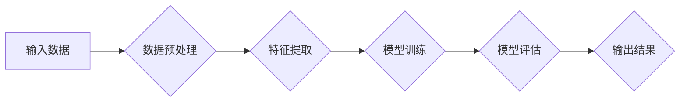
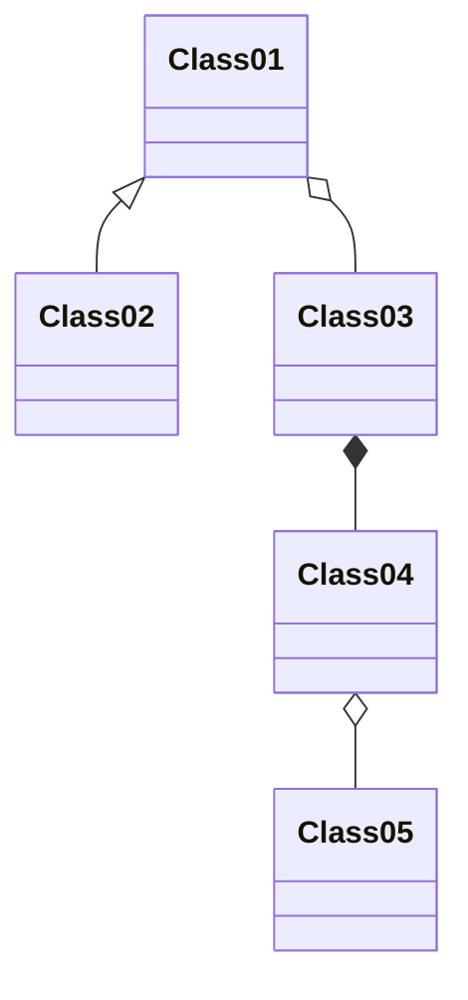
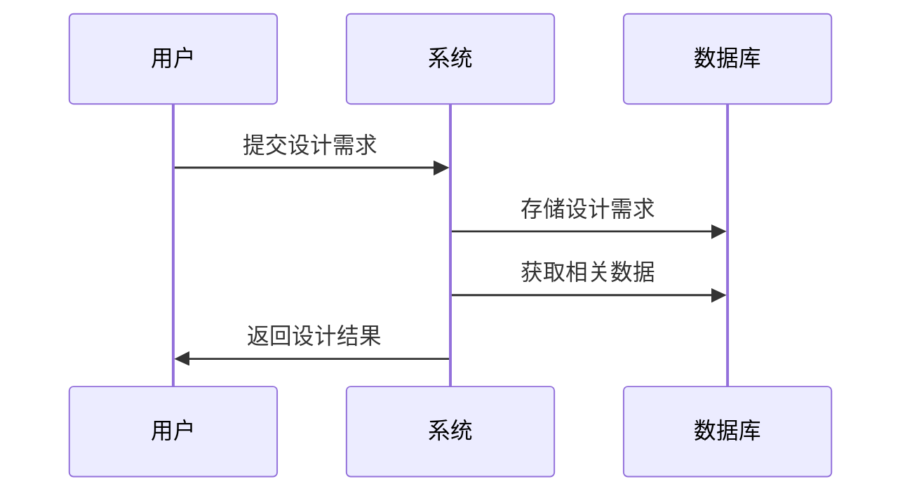
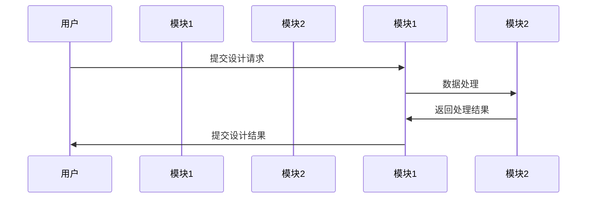

                 

# AI辅助设计：从建筑到工业产品的革新

## 关键词

- 人工智能
- 辅助设计
- 建筑设计
- 工业产品
- 革新

## 摘要

随着人工智能技术的迅猛发展，AI辅助设计已经成为建筑设计、工业产品开发等领域的重要趋势。本文将从背景介绍、核心概念与联系、算法原理讲解、数学模型和数学公式讲解、系统分析与架构设计方案、项目实战、最佳实践 tips、小结、注意事项、拓展阅读等方面，全面探讨AI辅助设计在建筑和工业产品领域的革新应用，旨在为相关从业者提供有价值的参考。

## 目录

### 1. 背景介绍

#### 1.1 核心概念术语说明
- **人工智能**：模拟、延伸和扩展人的智能的理论、方法、技术及应用。
- **辅助设计**：利用工具或技术辅助设计师完成设计任务。
- **建筑设计**：针对建筑物的设计过程。
- **工业产品**：为满足工业生产或使用需求的物品。

#### 1.2 问题背景与描述
- **建筑领域**：传统建筑设计过程中，设计师面临大量重复性劳动和低效率问题。
- **工业产品领域**：工业产品开发周期长、成本高，设计创新性有限。

#### 1.3 问题解决与边界与外延
- **问题解决**：利用AI技术辅助设计师，提高设计效率和质量。
- **边界与外延**：探讨AI辅助设计在不同领域的应用范围。

#### 1.4 概念结构与核心要素组成
- **概念结构**：AI辅助设计的构成要素及其关系。
- **核心要素组成**：关键算法、技术框架等。

### 2. 核心概念与联系

#### 2.1 AI辅助设计原理
- **原理介绍**：AI技术如何辅助设计师完成设计任务。
- **原理属性特征对比表格**

| 对比项         | 传统设计       | AI辅助设计           |
| -------------- | -------------- | -------------------- |
| 设计效率       | 低效           | 高效                 |
| 设计质量       | 受主观影响大   | 对主观影响小         |
| 创新性         | 受限于设计师   | 面向问题场景         |
| 设计周期       | 长周期         | 短周期               |

#### 2.2 AI辅助设计在建筑和工业产品中的应用
- **应用领域**：探讨AI辅助设计在建筑和工业产品领域的具体应用。
- **ER实体关系图架构**：展示AI辅助设计在建筑和工业产品领域中的实体关系。

### 3. 算法原理讲解

#### 3.1 算法概述
- **算法介绍**：介绍常用的AI辅助设计算法，如深度学习、强化学习等。

#### 3.2 算法流程图
- **流程图**：使用Mermaid绘制算法流程图。



#### 3.3 算法原理与数学模型
- **算法原理**：介绍算法的基本原理和流程。
- **数学模型**：给出算法的数学模型和公式，如神经网络、决策树等。

$$
f(x) = \sum_{i=1}^{n} w_i \cdot x_i
$$

#### 3.4 算法举例说明
- **举例说明**：通过具体案例，阐述算法的应用场景和效果。

### 4. 数学模型和数学公式讲解

#### 4.1 数学模型
- **模型介绍**：介绍常用的数学模型，如线性回归、支持向量机等。

#### 4.2 数学公式
- **公式介绍**：给出数学模型的关键公式，如损失函数、梯度下降等。

$$
\begin{aligned}
L(y, \hat{y}) &= -\frac{1}{m} \sum_{i=1}^{m} [y_i \cdot \log(\hat{y}_i) + (1 - y_i) \cdot \log(1 - \hat{y}_i)] \\
\frac{\partial L}{\partial \theta_j} &= \frac{1}{m} \sum_{i=1}^{m} [h_\theta(x^{(i)}) - y^{(i)}] \cdot x_j^{(i)}
\end{aligned}
$$

### 5. 系统分析与架构设计方案

#### 5.1 问题场景介绍
- **场景介绍**：描述AI辅助设计在建筑和工业产品领域的具体应用场景。

#### 5.2 项目介绍
- **项目介绍**：介绍一个具体的AI辅助设计项目，如基于深度学习的建筑风格识别系统。

#### 5.3 系统功能设计
- **领域模型**：使用Mermaid绘制领域模型类图。



#### 5.4 系统架构设计
- **架构设计**：使用Mermaid绘制系统架构图。



#### 5.5 系统接口设计和系统交互
- **接口设计**：描述系统的主要接口和功能。
- **系统交互**：使用Mermaid绘制系统交互序列图。



### 6. 项目实战

#### 6.1 环境安装
- **环境配置**：描述所需环境及安装步骤。

#### 6.2 系统核心实现源代码
- **源代码**：提供系统核心实现部分的源代码。

```python
def design_algorithm(data):
    # 设计算法实现
    pass
```

#### 6.3 代码应用解读与分析
- **代码解读**：详细解析源代码的实现过程和关键部分。

#### 6.4 实际案例分析和详细讲解剖析
- **案例分析**：提供实际案例，分析案例中的问题和解决方法。

#### 6.5 项目小结
- **小结**：总结项目实战过程中的经验教训。

### 7. 最佳实践 tips

- **最佳实践**：分享AI辅助设计领域的最佳实践技巧。

### 8. 小结

- **总结**：回顾本文的主要内容和观点。

### 9. 注意事项

- **注意**：提醒读者在应用AI辅助设计时需要注意的问题。

### 10. 拓展阅读

- **推荐**：推荐相关领域的优秀书籍、文章和资源。

### 作者信息

- 作者：AI天才研究院/AI Genius Institute & 禅与计算机程序设计艺术 /Zen And The Art of Computer Programming

（注：本文目录大纲仅为示例，具体内容可根据实际情况进行调整和补充。）

