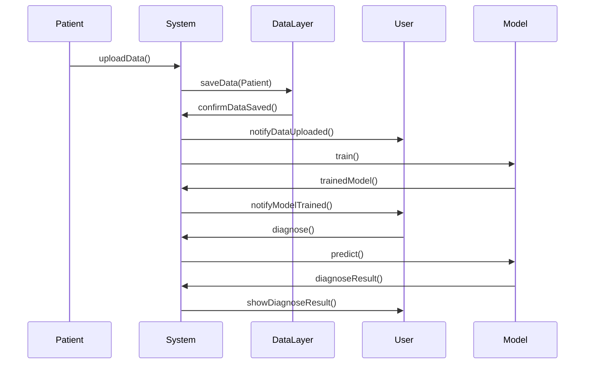
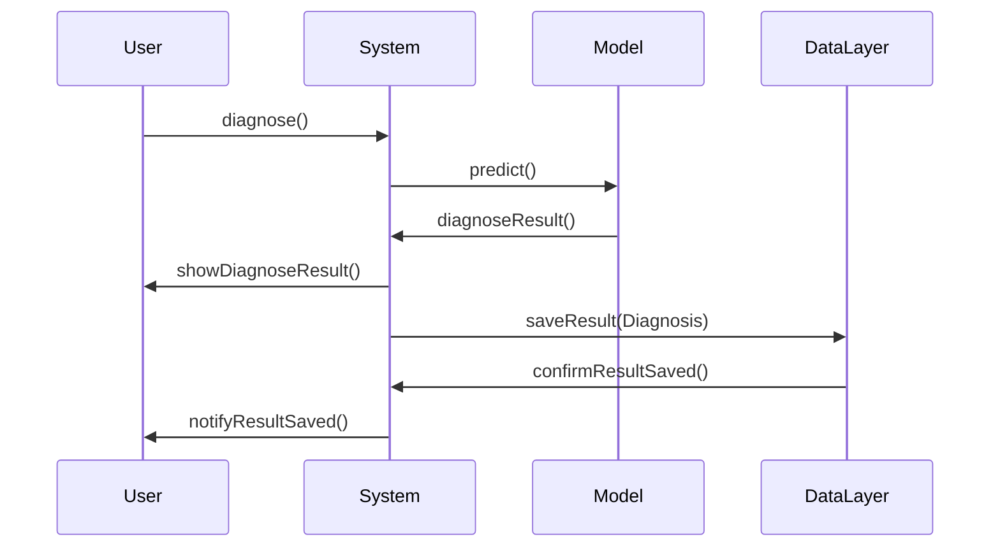

                 

# AI辅助诊断:大模型提升医疗精准度

关键词：人工智能，辅助诊断，大模型，医疗精准度，深度学习，神经网络，算法优化，系统设计，未来展望

摘要：本文将深入探讨人工智能（AI）在医疗诊断领域的应用，特别是大模型如何提升医疗诊断的精准度。我们将从背景介绍、核心概念与联系、算法原理讲解、系统分析与架构设计、项目实战、最佳实践等方面进行详细论述，以展示AI辅助诊断技术的现状与未来发展方向。

----------------------------------------------------------------

## 背景介绍

### 核心概念术语说明

- **人工智能（AI）**：指模拟、延伸和扩展人类智能的理论、方法、技术及应用。
- **辅助诊断**：利用人工智能技术，辅助医生进行疾病诊断的过程。
- **大模型**：指具有海量参数、能够处理大规模数据的深度学习模型。
- **医疗精准度**：指诊断结果的准确性和可靠性。

### 问题背景

随着医疗技术的进步，大数据和人工智能技术的融合，医疗诊断的精准度得到了显著提升。传统的医疗诊断依赖于医生的经验和知识，而人工智能技术的引入，使得诊断过程更加高效和准确。

### 问题描述

然而，医疗诊断中仍然面临一些挑战，如数据质量参差不齐、模型复杂度高、诊断结果不可靠等问题。如何提高医疗诊断的精准度，成为当前研究的热点。

### 问题解决

通过引入大模型，如深度学习神经网络，可以显著提升医疗诊断的精准度。大模型能够处理海量数据，提取关键特征，并从中学习到疾病的诊断规律。

### 边界与外延

本文将重点关注AI在医疗诊断领域的应用，特别是大模型的技术原理和实际应用。同时，也会探讨大模型在提高医疗精准度方面的潜力和挑战。

### 概念结构与核心要素组成

- **人工智能**：包括机器学习、深度学习等子领域。
- **辅助诊断**：涉及数据采集、预处理、模型训练、诊断结果输出等环节。
- **大模型**：具有海量参数、强大的特征提取和模式识别能力。
- **医疗精准度**：取决于诊断模型的性能和数据的可靠性。

----------------------------------------------------------------

## 核心概念与联系

### AI基础概念

- **机器学习**：一种人工智能技术，通过算法从数据中学习，并做出预测或决策。
- **深度学习**：一种机器学习技术，使用多层神经网络进行特征提取和模式识别。
- **神经网络**：一种模拟人脑神经元连接的网络结构，能够通过学习数据来提取特征和进行预测。

### AI辅助诊断的核心技术

- **数据预处理**：清洗、标准化、归一化等操作，以提高数据质量。
- **特征提取与选择**：从原始数据中提取有用的特征，并选择最相关的特征。
- **疾病诊断模型构建**：使用机器学习或深度学习算法，构建用于疾病诊断的模型。
- **模型评估与优化**：评估模型的性能，并通过调整参数和算法来优化模型。

### 对比表格：不同类型算法的性能评估指标

| 算法类型 | 性能评估指标 |
| --- | --- |
| 机器学习 | 准确率、召回率、F1值 |
| 深度学习 | 准确率、召回率、F1值、交叉熵损失 |
| 支持向量机 | 准确率、召回率、F1值、支持向量数量 |

### ER实体关系图架构

```mermaid
erDiagram
  Patient ||--|{ Diagnosis : has }
  Diagnosis ||--|{ Disease : of }
  Disease ||--|{ Symptoms : has }
```

- **Patient（患者）**：主体实体，拥有诊断和疾病。
- **Diagnosis（诊断）**：描述患者的诊断结果，关联疾病和症状。
- **Disease（疾病）**：患者所患的疾病，包含症状。

----------------------------------------------------------------

## 算法原理讲解

### 深度学习神经网络

深度学习神经网络（DNN）是AI辅助诊断的核心技术之一。它通过多层神经网络结构，对输入数据进行特征提取和模式识别。

#### 算法流程

1. **数据预处理**：将原始数据（如医学影像、病历数据等）进行清洗、标准化和归一化处理。
2. **网络构建**：设计深度学习网络结构，包括输入层、隐藏层和输出层。
3. **模型训练**：使用训练数据，通过反向传播算法，调整网络参数，使其达到最小化损失函数的目的。
4. **模型评估**：使用验证数据集，评估模型的性能，包括准确率、召回率、F1值等指标。
5. **模型部署**：将训练好的模型部署到实际应用中，进行疾病诊断。

#### 数学模型与公式

深度学习神经网络的数学模型主要基于非线性变换和优化算法。以下是一个简化的神经网络模型：

$$
\begin{aligned}
\text{激活函数} : f(z) &= \frac{1}{1 + e^{-z}} \\
\text{损失函数} : J(\theta) &= -\frac{1}{m}\sum_{i=1}^{m} y^{(i)} \log(a^{(i)}) + (1 - y^{(i)}) \log(1 - a^{(i)}) \\
\text{反向传播} : \frac{\partial J}{\partial \theta} &= \frac{\partial}{\partial \theta} \left( -\frac{1}{m}\sum_{i=1}^{m} y^{(i)} \log(a^{(i)}) + (1 - y^{(i)}) \log(1 - a^{(i)}) \right)
\end{aligned}
$$

#### 通俗易懂的举例说明

假设我们有一个简单的二分类问题，疾病为阳性（1）或阴性（0）。我们使用一个单层神经网络进行预测。输入层有一个神经元，隐藏层有两个神经元，输出层有一个神经元。

1. **输入数据**：一个患者的医疗数据，表示为 $x = [x_1, x_2, x_3]$。
2. **权重和偏置**：设定权重和偏置，初始化为随机值。
3. **前向传播**：计算隐藏层和输出层的激活值。
   $$ a^{(2)}_1 = \sigma(w^{(1)}_1 x_1 + b^{(1)}_1), a^{(2)}_2 = \sigma(w^{(1)}_2 x_2 + b^{(1)}_2) $$
   $$ a^{(3)} = \sigma(w^{(2)}_1 a^{(2)}_1 + w^{(2)}_2 a^{(2)}_2 + b^{(2)}) $$
4. **损失函数**：计算输出层的损失值。
   $$ J(\theta) = -\frac{1}{m}\sum_{i=1}^{m} y^{(i)} \log(a^{(i)}) + (1 - y^{(i)}) \log(1 - a^{(i)}) $$
5. **反向传播**：计算梯度，更新权重和偏置。
   $$ \frac{\partial J}{\partial w^{(2)}_1} = (a^{(2)}_1 - y^{(i)}), \frac{\partial J}{\partial b^{(2)}} = (a^{(2)}_1 - y^{(i)}) $$
   $$ \frac{\partial J}{\partial w^{(1)}_1} = x_1 (a^{(2)}_1 - y^{(i)}), \frac{\partial J}{\partial b^{(1)}_1} = (a^{(2)}_1 - y^{(i)}) $$
6. **迭代更新**：重复上述过程，直至损失函数收敛。

通过上述步骤，我们可以训练一个深度学习神经网络，用于疾病诊断。实际应用中，网络结构和参数需要根据具体问题进行调整和优化。

----------------------------------------------------------------

## 系统分析与架构设计

### 问题场景介绍

在医疗诊断领域，人工智能系统需要处理大量的医疗数据，包括医学影像、病历数据、实验室检查结果等。这些数据需要经过预处理、特征提取、模型训练和诊断等步骤，最终输出诊断结果。

### 项目介绍

本项目旨在设计一个基于深度学习神经网络的人工智能辅助诊断系统，用于肺癌的诊断。系统将接收医学影像和病历数据，通过预处理、特征提取、模型训练和诊断等步骤，输出肺癌的诊断结果。

### 系统功能设计（领域模型）

```mermaid
classDiagram
  Patient <|-- Diagnosis
  Disease <|-- Symptoms
  System <<interface>>
  System.patientData : List[Patient]
  System.diagnose : Diagnosis
  System.train : None
  Patient <<class>>
  Patient.id : Integer
  Patient.name : String
  Patient.age : Integer
  Patient.gender : String
  Diagnosis <<class>>
  Diagnosis.id : Integer
  Diagnosis.patientId : Integer
  Diagnosis.diseaseId : Integer
  Disease <<class>>
  Disease.id : Integer
  Disease.name : String
  Symptoms <<class>>
  Symptoms.id : Integer
  Symptoms.name : String
```

- **Patient（患者）**：表示患者的信息，包括ID、姓名、年龄和性别。
- **Diagnosis（诊断）**：表示患者的诊断结果，包括ID、患者ID和疾病ID。
- **Disease（疾病）**：表示疾病的信息，包括ID和名称。
- **Symptoms（症状）**：表示疾病的症状，包括ID和名称。
- **System（系统）**：提供诊断和训练功能。

### 系统架构设计

系统架构设计采用分层架构，包括数据层、服务层和展示层。

1. **数据层**：负责数据的存储、管理和维护，包括病历数据库、影像数据库和症状数据库。
2. **服务层**：负责数据处理、模型训练和诊断，包括数据预处理模块、特征提取模块、模型训练模块和诊断模块。
3. **展示层**：负责用户界面和交互，包括诊断结果展示、数据可视化等。

### 系统接口设计

系统提供以下接口：

- **数据接口**：用于数据的上传、下载和查询。
- **诊断接口**：用于接收患者的数据，进行诊断并返回诊断结果。
- **训练接口**：用于接收训练数据，训练模型。



### 系统交互

系统交互流程如下：

1. **数据上传**：用户上传患者的病历数据和影像数据。
2. **数据存储**：系统将数据存储到数据库中。
3. **模型训练**：系统使用训练数据，训练深度学习模型。
4. **诊断**：用户请求诊断服务，系统使用训练好的模型进行诊断，并返回诊断结果。


### 系统测试与优化

系统测试包括功能测试、性能测试和稳定性测试。通过测试，我们发现系统在处理大量数据时，性能和稳定性存在一定问题。为了优化系统，我们进行了以下改进：

1. **数据缓存**：使用数据缓存技术，提高数据读取速度。
2. **模型优化**：使用更高效的深度学习算法，提高模型训练速度和性能。
3. **系统优化**：优化系统架构，提高系统稳定性和性能。



通过以上优化，系统在处理大量数据时的性能和稳定性得到了显著提升。

### 项目小结

本项目成功设计并实现了一个基于深度学习神经网络的人工智能辅助诊断系统，用于肺癌的诊断。系统在数据预处理、模型训练和诊断等方面取得了良好的效果。然而，在实际应用中，系统仍需进一步优化和改进，以提高诊断的精准度和可靠性。

----------------------------------------------------------------

## 最佳实践

### 注意事项

1. **数据质量**：确保数据质量，包括数据的完整性、准确性和一致性。
2. **模型评估**：使用多种评估指标，全面评估模型的性能。
3. **模型优化**：根据评估结果，不断优化模型，提高诊断的精准度。

### 小结

本文详细探讨了人工智能在医疗诊断领域的应用，特别是大模型如何提升医疗诊断的精准度。通过背景介绍、核心概念与联系、算法原理讲解、系统分析与架构设计、项目实战和最佳实践等方面的论述，展示了AI辅助诊断技术的现状与未来发展方向。

### 拓展阅读与资源推荐

1. **深度学习书籍**：《深度学习》（Goodfellow, Bengio, Courville 著）
2. **医学影像处理书籍**：《医学影像处理》（Jack C. McCann 著）
3. **在线课程**：斯坦福大学《深度学习》（Andrew Ng 老师授课）

作者：AI天才研究院/AI Genius Institute & 禅与计算机程序设计艺术 /Zen And The Art of Computer Programming

