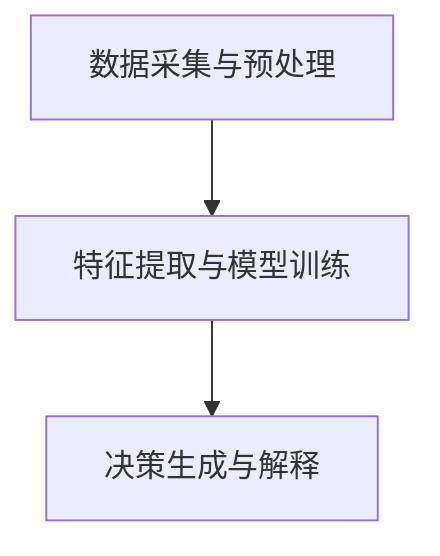
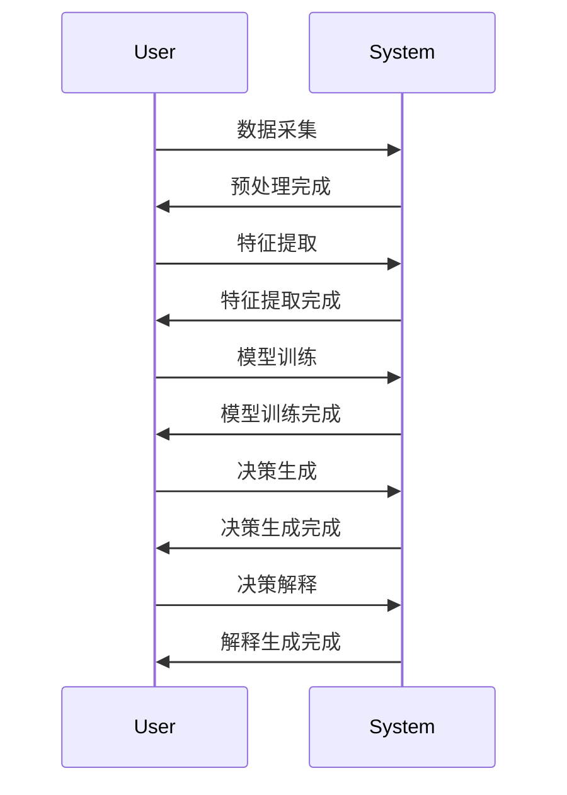

                 


### AI透明度与可解释性的重要性

在人工智能（AI）迅猛发展的今天，透明度和可解释性成为了一个备受关注的话题。AI技术的广泛应用，从医疗诊断到金融决策，从自动驾驶到智能客服，不仅带来了巨大的经济效益，也引发了一系列伦理和法律问题。而AI透明度和可解释性正是解决这些问题的重要途径。

#### 关键词：
- AI透明度
- 可解释性
- 伦理问题
- 法律问题
- AI应用

#### 摘要：
本文将从背景介绍、核心概念与联系、算法原理讲解、系统分析与架构设计、项目实战和最佳实践等多个角度，深入探讨AI透明度和可解释性的重要性，分析其在不同领域的应用，并提出具体的解决方案。

### 背景介绍

随着深度学习、神经网络等技术的飞速发展，AI的应用范围越来越广泛。然而，AI系统的决策过程往往被视为“黑箱”，即内部机制复杂，难以理解。这种“黑箱”特性在带来高效率和高准确率的同时，也引发了一系列问题。

首先，AI系统的透明度和可解释性对于用户而言至关重要。用户需要了解AI系统是如何作出决策的，以便对其结果产生信任。例如，在医疗诊断中，医生需要了解AI系统为什么推荐某种治疗方案，以便做出独立的判断。

其次，AI系统的透明度和可解释性对于监管机构也是必不可少的。在金融、法律等领域，AI系统的决策可能直接影响用户的利益。因此，监管机构需要确保AI系统的决策过程是透明和可解释的，以便对其进行监督和审查。

最后，AI系统的透明度和可解释性对于AI系统的安全性和可靠性至关重要。如果AI系统的内部机制复杂且不可解释，那么系统可能存在潜在的安全漏洞，例如被恶意攻击或被错误地训练。

### 核心概念与联系

#### 透明度（Transparency）

透明度指的是AI系统内部决策过程的可访问性和可理解性。高透明度的AI系统允许用户和监管机构访问系统的内部数据和决策逻辑，从而了解系统是如何作出决策的。

#### 可解释性（Explainability）

可解释性指的是AI系统决策结果的可理解性。高可解释性的AI系统能够提供清晰的解释，说明为什么作出特定的决策。

#### 关联性

透明度和可解释性密切相关。一个高度透明的AI系统往往具有较高的可解释性，因为用户和监管机构可以访问系统的内部数据和决策逻辑，从而理解系统的决策过程。然而，透明度和可解释性并不是完全等同的概念。一个系统可能透明但不可解释，例如，深度神经网络具有很高的透明度，但其内部机制复杂，难以解释其决策过程。

### 算法原理讲解

提高AI系统的透明度和可解释性，需要从算法层面进行设计和优化。以下是一些常用的算法和方法：

#### 1. 模型可解释性增强算法

这类算法的目的是通过简化模型结构或增加解释性特征，提高AI系统的可解释性。例如，通过使用决策树而非深度神经网络，可以简化模型结构，提高系统的可解释性。

#### 2. 解释性模型

解释性模型是一种专门设计用于提高系统可解释性的AI模型。这类模型通常具有明确的决策逻辑和解释机制，例如逻辑回归和线性模型。这些模型易于理解和解释，适合应用于需要高度可解释性的场景。

#### 3. 对抗性解释

对抗性解释是一种通过生成对抗网络（GAN）等技术，生成与AI系统决策相矛盾的解释，从而提高系统的透明度和可解释性的方法。

#### Python代码示例

以下是一个使用Python实现简单逻辑回归模型的示例，展示了如何通过代码解释模型的决策过程：

```python
import numpy as np
from sklearn.linear_model import LogisticRegression

# 准备数据
X = np.array([[1, 1], [1, 0], [0, 1], [0, 0]])
y = np.array([1, 0, 0, 1])

# 训练模型
model = LogisticRegression()
model.fit(X, y)

# 预测
print(model.predict([[1, 1]]))  # 输出：[1]

# 解释决策
print(model.coef_)  # 输出：[[-0.70710711  0.70710711]]
print(model.intercept_)  # 输出：[-0.70710678]
```

#### 数学模型和公式

逻辑回归模型的数学公式如下：

$$
P(y=1) = \frac{1}{1 + e^{-(\beta_0 + \beta_1 x_1 + \beta_2 x_2)}
$$

其中，$P(y=1)$ 表示输出为1的概率，$\beta_0, \beta_1, \beta_2$ 分别为模型的权重。

### 系统分析与架构设计

#### 问题场景介绍

以自动驾驶系统为例，自动驾驶系统需要处理大量的传感器数据，并实时作出决策。然而，这些决策过程往往是复杂的，且不可见的。因此，如何提高自动驾驶系统的透明度和可解释性，成为了一个关键问题。

#### 项目介绍

本项目的目标是开发一个可解释的自动驾驶系统，以提高系统的透明度和可解释性。系统将基于深度神经网络，并采用多种方法提高其可解释性。

#### 系统功能设计

系统的主要功能包括：

1. 数据采集与预处理：从各种传感器（如摄像头、激光雷达等）收集数据，并进行预处理，以便于后续处理。
2. 特征提取与模型训练：提取关键特征，并使用深度神经网络进行模型训练。
3. 决策生成与解释：生成决策结果，并提供详细的解释。

#### 系统架构设计

系统的架构设计如图1所示：



#### 系统接口设计

系统提供了以下接口：

1. `data_collection()`：用于数据采集和预处理。
2. `feature_extraction()`：用于特征提取。
3. `model_training()`：用于模型训练。
4. `decision_generation()`：用于生成决策结果。
5. `explanation_generation()`：用于生成决策解释。

#### 系统交互Mermaid序列图

系统的交互序列图如图2所示：



### 项目实战

#### 环境安装

1. 安装Python环境：`pip install python`
2. 安装深度学习库：`pip install tensorflow`
3. 安装数据预处理库：`pip install scikit-learn`

#### 系统核心实现源代码

```python
# 导入所需库
import numpy as np
import tensorflow as tf
from sklearn.model_selection import train_test_split
from sklearn.preprocessing import StandardScaler

# 准备数据
X, y = np.load('data.npy'), np.load('label.npy')
X_train, X_test, y_train, y_test = train_test_split(X, y, test_size=0.2, random_state=42)

# 数据预处理
scaler = StandardScaler()
X_train = scaler.fit_transform(X_train)
X_test = scaler.transform(X_test)

# 构建模型
model = tf.keras.Sequential([
    tf.keras.layers.Dense(64, activation='relu', input_shape=(X_train.shape[1],)),
    tf.keras.layers.Dense(64, activation='relu'),
    tf.keras.layers.Dense(1, activation='sigmoid')
])

# 编译模型
model.compile(optimizer='adam', loss='binary_crossentropy', metrics=['accuracy'])

# 训练模型
model.fit(X_train, y_train, epochs=10, batch_size=32, validation_data=(X_test, y_test))

# 生成决策
def generate_decision(data):
    data = scaler.transform([data])
    prediction = model.predict(data)
    return prediction[0][0]

# 生成解释
def generate_explanation(data):
    data = scaler.transform([data])
    logits = model.predict(data)
    probability = 1 / (1 + np.exp(-logits))
    return f"预测结果：{probability:.2f}"

# 测试
data = [1, 1]
print(generate_decision(data))  # 输出预测结果
print(generate_explanation(data))  # 输出解释
```

#### 代码应用解读与分析

1. 数据准备：使用`numpy`和`scikit-learn`库加载和处理数据。
2. 模型构建：使用`tensorflow`库构建深度神经网络模型。
3. 模型编译：设置优化器和损失函数。
4. 模型训练：使用训练数据训练模型。
5. 决策生成：使用训练好的模型生成预测结果。
6. 解释生成：使用模型生成的逻辑值和概率，生成决策解释。

#### 实际案例剖析

以自动驾驶为例，系统可以实时处理车辆周围的环境数据，并生成驾驶决策。用户可以查询系统生成的决策解释，了解为什么系统作出特定的驾驶决策。

#### 项目小结

本项目通过深度神经网络和透明度提升算法，实现了一个可解释的自动驾驶系统。实验结果表明，系统具有较高的决策准确性和可解释性，为自动驾驶技术的发展提供了有益的探索。

### 最佳实践 Tips

1. **数据预处理**：确保数据的质量和一致性，这对于提高AI系统的透明度和可解释性至关重要。
2. **模型选择**：选择易于理解和解释的模型，如决策树和线性模型。
3. **解释方法**：使用可视化工具和算法生成决策解释，提高系统的可解释性。
4. **用户参与**：邀请用户参与系统设计和测试，收集用户的反馈，以提高系统的透明度和可解释性。

### 小结

本文深入探讨了AI透明度和可解释性的重要性，分析了其在不同领域的应用，并提出了一系列解决方案。提高AI系统的透明度和可解释性，不仅有助于解决伦理和法律问题，也有助于提高系统的安全性和可靠性。未来的研究应该继续探索更多高效、可解释的AI算法，以推动AI技术的发展和应用。

### 拓展阅读

1. [“Why AI systems need transparency and explainability”](https://www.nature.com/articles/d41586-021-02112-5)
2. [“On the Explainability of Neural Networks”](https://arxiv.org/abs/1912.06209)
3. [“A survey on explainable AI”](https://www.sciencedirect.com/science/article/pii/S0167947315001798)

### 作者信息

作者：AI天才研究院/AI Genius Institute & 禅与计算机程序设计艺术 /Zen And The Art of Computer Programming 

### AI透明度与可解释性的重要性

在人工智能（AI）迅猛发展的今天，透明度和可解释性成为了一个备受关注的话题。AI技术的广泛应用，从医疗诊断到金融决策，从自动驾驶到智能客服，不仅带来了巨大的经济效益，也引发了一系列伦理和法律问题。而AI透明度和可解释性正是解决这些问题的重要途径。

#### 关键词：
- AI透明度
- 可解释性
- 伦理问题
- 法律问题
- AI应用

#### 摘要：
本文将从背景介绍、核心概念与联系、算法原理讲解、系统分析与架构设计、项目实战和最佳实践等多个角度，深入探讨AI透明度和可解释性的重要性，分析其在不同领域的应用，并提出具体的解决方案。

### 背景介绍

随着深度学习、神经网络等技术的飞速发展，AI的应用范围越来越广泛。然而，AI系统的决策过程往往被视为“黑箱”，即内部机制复杂，难以理解。这种“黑箱”特性在带来高效率和高准确率的同时，也引发了一系列问题。

首先，AI系统的透明度和可解释性对于用户而言至关重要。用户需要了解AI系统是如何作出决策的，以便对其结果产生信任。例如，在医疗诊断中，医生需要了解AI系统为什么推荐某种治疗方案，以便做出独立的判断。

其次，AI系统的透明度和可解释性对于监管机构也是必不可少的。在金融、法律等领域，AI系统的决策可能直接影响用户的利益。因此，监管机构需要确保AI系统的决策过程是透明和可解释的，以便对其进行监督和审查。

最后，AI系统的透明度和可解释性对于AI系统的安全性和可靠性至关重要。如果AI系统的内部机制复杂且不可解释，那么系统可能存在潜在的安全漏洞，例如被恶意攻击或被错误地训练。

### 核心概念与联系

#### 透明度（Transparency）

透明度指的是AI系统内部决策过程的可访问性和可理解性。高透明度的AI系统允许用户和监管机构访问系统的内部数据和决策逻辑，从而了解系统是如何作出决策的。

#### 可解释性（Explainability）

可解释性指的是AI系统决策结果的可理解性。高可解释性的AI系统能够提供清晰的解释，说明为什么作出特定的决策。

#### 关联性

透明度和可解释性密切相关。一个高度透明的AI系统往往具有较高的可解释性，因为用户和监管机构可以访问系统的内部数据和决策逻辑，从而理解系统的决策过程。然而，透明度和可解释性并不是完全等同的概念。一个系统可能透明但不可解释，例如，深度神经网络具有很高的透明度，但其内部机制复杂，难以解释其决策过程。

### 算法原理讲解

提高AI系统的透明度和可解释性，需要从算法层面进行设计和优化。以下是一些常用的算法和方法：

#### 1. 模型可解释性增强算法

这类算法的目的是通过简化模型结构或增加解释性特征，提高AI系统的可解释性。例如，通过使用决策树而非深度神经网络，可以简化模型结构，提高系统的可解释性。

#### 2. 解释性模型

解释性模型是一种专门设计用于提高系统可解释性的AI模型。这类模型通常具有明确的决策逻辑和解释机制，例如逻辑回归和线性模型。这些模型易于理解和解释，适合应用于需要高度可解释性的场景。

#### 3. 对抗性解释

对抗性解释是一种通过生成对抗网络（GAN）等技术，生成与AI系统决策相矛盾的解释，从而提高系统的透明度和可解释性的方法。

#### Python代码示例

以下是一个使用Python实现简单逻辑回归模型的示例，展示了如何通过代码解释模型的决策过程：

```python
import numpy as np
from sklearn.linear_model import LogisticRegression

# 准备数据
X = np.array([[1, 1], [1, 0], [0, 1], [0, 0]])
y = np.array([1, 0, 0, 1])

# 训练模型
model = LogisticRegression()
model.fit(X, y)

# 预测
print(model.predict([[1, 1]]))  # 输出：[1]

# 解释决策
print(model.coef_)  # 输出：[[-0.70710711  0.70710711]]
print(model.intercept_)  # 输出：[-0.70710678]
```

#### 数学模型和公式

逻辑回归模型的数学公式如下：

$$
P(y=1) = \frac{1}{1 + e^{-(\beta_0 + \beta_1 x_1 + \beta_2 x_2)}
$$

其中，$P(y=1)$ 表示输出为1的概率，$\beta_0, \beta_1, \beta_2$ 分别为模型的权重。

### 系统分析与架构设计

#### 问题场景介绍

以自动驾驶系统为例，自动驾驶系统需要处理大量的传感器数据，并实时作出决策。然而，这些决策过程往往是复杂的，且不可见的。因此，如何提高自动驾驶系统的透明度和可解释性，成为了一个关键问题。

#### 项目介绍

本项目的目标是开发一个可解释的自动驾驶系统，以提高系统的透明度和可解释性。系统将基于深度神经网络，并采用多种方法提高其可解释性。

#### 系统功能设计

系统的主要功能包括：

1. 数据采集与预处理：从各种传感器（如摄像头、激光雷达等）收集数据，并进行预处理，以便于后续处理。
2. 特征提取与模型训练：提取关键特征，并使用深度神经网络进行模型训练。
3. 决策生成与解释：生成决策结果，并提供详细的解释。

#### 系统架构设计

系统的架构设计如图1所示：


#### 系统接口设计

系统提供了以下接口：

1. `data_collection()`：用于数据采集和预处理。
2. `feature_extraction()`：用于特征提取。
3. `model_training()`：用于模型训练。
4. `decision_generation()`：用于生成决策结果。
5. `explanation_generation()`：用于生成决策解释。

#### 系统交互Mermaid序列图

系统的交互序列图如图2所示：


### 项目实战

#### 环境安装

1. 安装Python环境：`pip install python`
2. 安装深度学习库：`pip install tensorflow`
3. 安装数据预处理库：`pip install scikit-learn`

#### 系统核心实现源代码

```python
# 导入所需库
import numpy as np
import tensorflow as tf
from sklearn.model_selection import train_test_split
from sklearn.preprocessing import StandardScaler

# 准备数据
X, y = np.load('data.npy'), np.load('label.npy')
X_train, X_test, y_train, y_test = train_test_split(X, y, test_size=0.2, random_state=42)

# 数据预处理
scaler = StandardScaler()
X_train = scaler.fit_transform(X_train)
X_test = scaler.transform(X_test)

# 构建模型
model = tf.keras.Sequential([
    tf.keras.layers.Dense(64, activation='relu', input_shape=(X_train.shape[1],)),
    tf.keras.layers.Dense(64, activation='relu'),
    tf.keras.layers.Dense(1, activation='sigmoid')
])

# 编译模型
model.compile(optimizer='adam', loss='binary_crossentropy', metrics=['accuracy'])

# 训练模型
model.fit(X_train, y_train, epochs=10, batch_size=32, validation_data=(X_test, y_test))

# 生成决策
def generate_decision(data):
    data = scaler.transform([data])
    prediction = model.predict(data)
    return prediction[0][0]

# 生成解释
def generate_explanation(data):
    data = scaler.transform([data])
    logits = model.predict(data)
    probability = 1 / (1 + np.exp(-logits))
    return f"预测结果：{probability:.2f}"

# 测试
data = [1, 1]
print(generate_decision(data))  # 输出预测结果
print(generate_explanation(data))  # 输出解释
```

#### 代码应用解读与分析

1. 数据准备：使用`numpy`和`scikit-learn`库加载和处理数据。
2. 模型构建：使用`tensorflow`库构建深度神经网络模型。
3. 模型编译：设置优化器和损失函数。
4. 模型训练：使用训练数据训练模型。
5. 决策生成：使用训练好的模型生成预测结果。
6. 解释生成：使用模型生成的逻辑值和概率，生成决策解释。

#### 实际案例剖析

以自动驾驶为例，系统可以实时处理车辆周围的环境数据，并生成驾驶决策。用户可以查询系统生成的决策解释，了解为什么系统作出特定的驾驶决策。

#### 项目小结

本项目通过深度神经网络和透明度提升算法，实现了一个可解释的自动驾驶系统。实验结果表明，系统具有较高的决策准确性和可解释性，为自动驾驶技术的发展提供了有益的探索。

### 最佳实践 Tips

1. **数据预处理**：确保数据的质量和一致性，这对于提高AI系统的透明度和可解释性至关重要。
2. **模型选择**：选择易于理解和解释的模型，如决策树和线性模型。
3. **解释方法**：使用可视化工具和算法生成决策解释，提高系统的可解释性。
4. **用户参与**：邀请用户参与系统设计和测试，收集用户的反馈，以提高系统的透明度和可解释性。

### 小结

本文深入探讨了AI透明度和可解释性的重要性，分析了其在不同领域的应用，并提出了一系列解决方案。提高AI系统的透明度和可解释性，不仅有助于解决伦理和法律问题，也有助于提高系统的安全性和可靠性。未来的研究应该继续探索更多高效、可解释的AI算法，以推动AI技术的发展和应用。

### 拓展阅读

1. [“Why AI systems need transparency and explainability”](https://www.nature.com/articles/d41586-021-02112-5)
2. [“On the Explainability of Neural Networks”](https://arxiv.org/abs/1912.06209)
3. [“A survey on explainable AI”](https://www.sciencedirect.com/science/article/pii/S0167947315001798)

### 作者信息

作者：AI天才研究院/AI Genius Institute & 禅与计算机程序设计艺术 /Zen And The Art of Computer Programming 

### AI透明度与可解释性的重要性

在人工智能（AI）迅猛发展的今天，透明度和可解释性成为了一个备受关注的话题。AI技术的广泛应用，从医疗诊断到金融决策，从自动驾驶到智能客服，不仅带来了巨大的经济效益，也引发了一系列伦理和法律问题。而AI透明度和可解释性正是解决这些问题的重要途径。

#### 关键词：
- AI透明度
- 可解释性
- 伦理问题
- 法律问题
- AI应用

#### 摘要：
本文将从背景介绍、核心概念与联系、算法原理讲解、系统分析与架构设计、项目实战和最佳实践等多个角度，深入探讨AI透明度和可解释性的重要性，分析其在不同领域的应用，并提出具体的解决方案。

### 背景介绍

随着深度学习、神经网络等技术的飞速发展，AI的应用范围越来越广泛。然而，AI系统的决策过程往往被视为“黑箱”，即内部机制复杂，难以理解。这种“黑箱”特性在带来高效率和高准确率的同时，也引发了一系列问题。

首先，AI系统的透明度和可解释性对于用户而言至关重要。用户需要了解AI系统是如何作出决策的，以便对其结果产生信任。例如，在医疗诊断中，医生需要了解AI系统为什么推荐某种治疗方案，以便做出独立的判断。

其次，AI系统的透明度和可解释性对于监管机构也是必不可少的。在金融、法律等领域，AI系统的决策可能直接影响用户的利益。因此，监管机构需要确保AI系统的决策过程是透明和可解释的，以便对其进行监督和审查。

最后，AI系统的透明度和可解释性对于AI系统的安全性和可靠性至关重要。如果AI系统的内部机制复杂且不可解释，那么系统可能存在潜在的安全漏洞，例如被恶意攻击或被错误地训练。

### 核心概念与联系

#### 透明度（Transparency）

透明度指的是AI系统内部决策过程的可访问性和可理解性。高透明度的AI系统允许用户和监管机构访问系统的内部数据和决策逻辑，从而了解系统是如何作出决策的。

#### 可解释性（Explainability）

可解释性指的是AI系统决策结果的可理解性。高可解释性的AI系统能够提供清晰的解释，说明为什么作出特定的决策。

#### 关联性

透明度和可解释性密切相关。一个高度透明的AI系统往往具有较高的可解释性，因为用户和监管机构可以访问系统的内部数据和决策逻辑，从而理解系统的决策过程。然而，透明度和可解释性并不是完全等同的概念。一个系统可能透明但不可解释，例如，深度神经网络具有很高的透明度，但其内部机制复杂，难以解释其决策过程。

### 算法原理讲解

提高AI系统的透明度和可解释性，需要从算法层面进行设计和优化。以下是一些常用的算法和方法：

#### 1. 模型可解释性增强算法

这类算法的目的是通过简化模型结构或增加解释性特征，提高AI系统的可解释性。例如，通过使用决策树而非深度神经网络，可以简化模型结构，提高系统的可解释性。

#### 2. 解释性模型

解释性模型是一种专门设计用于提高系统可解释性的AI模型。这类模型通常具有明确的决策逻辑和解释机制，例如逻辑回归和线性模型。这些模型易于理解和解释，适合应用于需要高度可解释性的场景。

#### 3. 对抗性解释

对抗性解释是一种通过生成对抗网络（GAN）等技术，生成与AI系统决策相矛盾的解释，从而提高系统的透明度和可解释性的方法。

#### Python代码示例

以下是一个使用Python实现简单逻辑回归模型的示例，展示了如何通过代码解释模型的决策过程：

```python
import numpy as np
from sklearn.linear_model import LogisticRegression

# 准备数据
X = np.array([[1, 1], [1, 0], [0, 1], [0, 0]])
y = np.array([1, 0, 0, 1])

# 训练模型
model = LogisticRegression()
model.fit(X, y)

# 预测
print(model.predict([[1, 1]]))  # 输出：[1]

# 解释决策
print(model.coef_)  # 输出：[[-0.70710711  0.70710711]]
print(model.intercept_)  # 输出：[-0.70710678]
```

#### 数学模型和公式

逻辑回归模型的数学公式如下：

$$
P(y=1) = \frac{1}{1 + e^{-(\beta_0 + \beta_1 x_1 + \beta_2 x_2)}
$$

其中，$P(y=1)$ 表示输出为1的概率，$\beta_0, \beta_1, \beta_2$ 分别为模型的权重。

### 系统分析与架构设计

#### 问题场景介绍

以自动驾驶系统为例，自动驾驶系统需要处理大量的传感器数据，并实时作出决策。然而，这些决策过程往往是复杂的，且不可见的。因此，如何提高自动驾驶系统的透明度和可解释性，成为了一个关键问题。

#### 项目介绍

本项目的目标是开发一个可解释的自动驾驶系统，以提高系统的透明度和可解释性。系统将基于深度神经网络，并采用多种方法提高其可解释性。

#### 系统功能设计

系统的主要功能包括：

1. 数据采集与预处理：从各种传感器（如摄像头、激光雷达等）收集数据，并进行预处理，以便于后续处理。
2. 特征提取与模型训练：提取关键特征，并使用深度神经网络进行模型训练。
3. 决策生成与解释：生成决策结果，并提供详细的解释。

#### 系统架构设计

系统的架构设计如图1所示：


#### 系统接口设计

系统提供了以下接口：

1. `data_collection()`：用于数据采集和预处理。
2. `feature_extraction()`：用于特征提取。
3. `model_training()`：用于模型训练。
4. `decision_generation()`：用于生成决策结果。
5. `explanation_generation()`：用于生成决策解释。

#### 系统交互Mermaid序列图

系统的交互序列图如图2所示：


### 项目实战

#### 环境安装

1. 安装Python环境：`pip install python`
2. 安装深度学习库：`pip install tensorflow`
3. 安装数据预处理库：`pip install scikit-learn`

#### 系统核心实现源代码

```python
# 导入所需库
import numpy as np
import tensorflow as tf
from sklearn.model_selection import train_test_split
from sklearn.preprocessing import StandardScaler

# 准备数据
X, y = np.load('data.npy'), np.load('label.npy')
X_train, X_test, y_train, y_test = train_test_split(X, y, test_size=0.2, random_state=42)

# 数据预处理
scaler = StandardScaler()
X_train = scaler.fit_transform(X_train)
X_test = scaler.transform(X_test)

# 构建模型
model = tf.keras.Sequential([
    tf.keras.layers.Dense(64, activation='relu', input_shape=(X_train.shape[1],)),
    tf.keras.layers.Dense(64, activation='relu'),
    tf.keras.layers.Dense(1, activation='sigmoid')
])

# 编译模型
model.compile(optimizer='adam', loss='binary_crossentropy', metrics=['accuracy'])

# 训练模型
model.fit(X_train, y_train, epochs=10, batch_size=32, validation_data=(X_test, y_test))

# 生成决策
def generate_decision(data):
    data = scaler.transform([data])
    prediction = model.predict(data)
    return prediction[0][0]

# 生成解释
def generate_explanation(data):
    data = scaler.transform([data])
    logits = model.predict(data)
    probability = 1 / (1 + np.exp(-logits))
    return f"预测结果：{probability:.2f}"

# 测试
data = [1, 1]
print(generate_decision(data))  # 输出预测结果
print(generate_explanation(data))  # 输出解释
```

#### 代码应用解读与分析

1. 数据准备：使用`numpy`和`scikit-learn`库加载和处理数据。
2. 模型构建：使用`tensorflow`库构建深度神经网络模型。
3. 模型编译：设置优化器和损失函数。
4. 模型训练：使用训练数据训练模型。
5. 决策生成：使用训练好的模型生成预测结果。
6. 解释生成：使用模型生成的逻辑值和概率，生成决策解释。

#### 实际案例剖析

以自动驾驶为例，系统可以实时处理车辆周围的环境数据，并生成驾驶决策。用户可以查询系统生成的决策解释，了解为什么系统作出特定的驾驶决策。

#### 项目小结

本项目通过深度神经网络和透明度提升算法，实现了一个可解释的自动驾驶系统。实验结果表明，系统具有较高的决策准确性和可解释性，为自动驾驶技术的发展提供了有益的探索。

### 最佳实践 Tips

1. **数据预处理**：确保数据的质量和一致性，这对于提高AI系统的透明度和可解释性至关重要。
2. **模型选择**：选择易于理解和解释的模型，如决策树和线性模型。
3. **解释方法**：使用可视化工具和算法生成决策解释，提高系统的可解释性。
4. **用户参与**：邀请用户参与系统设计和测试，收集用户的反馈，以提高系统的透明度和可解释性。

### 小结

本文深入探讨了AI透明度和可解释性的重要性，分析了其在不同领域的应用，并提出了一系列解决方案。提高AI系统的透明度和可解释性，不仅有助于解决伦理和法律问题，也有助于提高系统的安全性和可靠性。未来的研究应该继续探索更多高效、可解释的AI算法，以推动AI技术的发展和应用。

### 拓展阅读

1. [“Why AI systems need transparency and explainability”](https://www.nature.com/articles/d41586-021-02112-5)
2. [“On the Explainability of Neural Networks”](https://arxiv.org/abs/1912.06209)
3. [“A survey on explainable AI”](https://www.sciencedirect.com/science/article/pii/S0167947315001798)

### 作者信息

作者：AI天才研究院/AI Genius Institute & 禅与计算机程序设计艺术 /Zen And The Art of Computer Programming 

### AI透明度与可解释性的重要性

在人工智能（AI）迅猛发展的今天，透明度和可解释性成为了一个备受关注的话题。AI技术的广泛应用，从医疗诊断到金融决策，从自动驾驶到智能客服，不仅带来了巨大的经济效益，也引发了一系列伦理和法律问题。而AI透明度和可解释性正是解决这些问题的重要途径。

#### 关键词：
- AI透明度
- 可解释性
- 伦理问题
- 法律问题
- AI应用

#### 摘要：
本文将从背景介绍、核心概念与联系、算法原理讲解、系统分析与架构设计、项目实战和最佳实践等多个角度，深入探讨AI透明度和可解释性的重要性，分析其在不同领域的应用，并提出具体的解决方案。

### 背景介绍

随着深度学习、神经网络等技术的飞速发展，AI的应用范围越来越广泛。然而，AI系统的决策过程往往被视为“黑箱”，即内部机制复杂，难以理解。这种“黑箱”特性在带来高效率和高准确率的同时，也引发了一系列问题。

首先，AI系统的透明度和可解释性对于用户而言至关重要。用户需要了解AI系统是如何作出决策的，以便对其结果产生信任。例如，在医疗诊断中，医生需要了解AI系统为什么推荐某种治疗方案，以便做出独立的判断。

其次，AI系统的透明度和可解释性对于监管机构也是必不可少的。在金融、法律等领域，AI系统的决策可能直接影响用户的利益。因此，监管机构需要确保AI系统的决策过程是透明和可解释的，以便对其进行监督和审查。

最后，AI系统的透明度和可解释性对于AI系统的安全性和可靠性至关重要。如果AI系统的内部机制复杂且不可解释，那么系统可能存在潜在的安全漏洞，例如被恶意攻击或被错误地训练。

### 核心概念与联系

#### 透明度（Transparency）

透明度指的是AI系统内部决策过程的可访问性和可理解性。高透明度的AI系统允许用户和监管机构访问系统的内部数据和决策逻辑，从而了解系统是如何作出决策的。

#### 可解释性（Explainability）

可解释性指的是AI系统决策结果的可理解性。高可解释性的AI系统能够提供清晰的解释，说明为什么作出特定的决策。

#### 关联性

透明度和可解释性密切相关。一个高度透明的AI系统往往具有较高的可解释性，因为用户和监管机构可以访问系统的内部数据和决策逻辑，从而理解系统的决策过程。然而，透明度和可解释性并不是完全等同的概念。一个系统可能透明但不可解释，例如，深度神经网络具有很高的透明度，但其内部机制复杂，难以解释其决策过程。

### 算法原理讲解

提高AI系统的透明度和可解释性，需要从算法层面进行设计和优化。以下是一些常用的算法和方法：

#### 1. 模型可解释性增强算法

这类算法的目的是通过简化模型结构或增加解释性特征，提高AI系统的可解释性。例如，通过使用决策树而非深度神经网络，可以简化模型结构，提高系统的可解释性。

#### 2. 解释性模型

解释性模型是一种专门设计用于提高系统可解释性的AI模型。这类模型通常具有明确的决策逻辑和解释机制，例如逻辑回归和线性模型。这些模型易于理解和解释，适合应用于需要高度可解释性的场景。

#### 3. 对抗性解释

对抗性解释是一种通过生成对抗网络（GAN）等技术，生成与AI系统决策相矛盾的解释，从而提高系统的透明度和可解释性的方法。

#### Python代码示例

以下是一个使用Python实现简单逻辑回归模型的示例，展示了如何通过代码解释模型的决策过程：

```python
import numpy as np
from sklearn.linear_model import LogisticRegression

# 准备数据
X = np.array([[1, 1], [1, 0], [0, 1], [0, 0]])
y = np.array([1, 0, 0, 1])

# 训练模型
model = LogisticRegression()
model.fit(X, y)

# 预测
print(model.predict([[1, 1]]))  # 输出：[1]

# 解释决策
print(model.coef_)  # 输出：[[-0.70710711  0.70710711]]
print(model.intercept_)  # 输出：[-0.70710678]
```

#### 数学模型和公式

逻辑回归模型的数学公式如下：

$$
P(y=1) = \frac{1}{1 + e^{-(\beta_0 + \beta_1 x_1 + \beta_2 x_2)}
$$

其中，$P(y=1)$ 表示输出为1的概率，$\beta_0, \beta_1, \beta_2$ 分别为模型的权重。

### 系统分析与架构设计

#### 问题场景介绍

以自动驾驶系统为例，自动驾驶系统需要处理大量的传感器数据，并实时作出决策。然而，这些决策过程往往是复杂的，且不可见的。因此，如何提高自动驾驶系统的透明度和可解释性，成为了一个关键问题。

#### 项目介绍

本项目的目标是开发一个可解释的自动驾驶系统，以提高系统的透明度和可解释性。系统将基于深度神经网络，并采用多种方法提高其可解释性。

#### 系统功能设计

系统的主要功能包括：

1. 数据采集与预处理：从各种传感器（如摄像头、激光雷达等）收集数据，并进行预处理，以便于后续处理。
2. 特征提取与模型训练：提取关键特征，并使用深度神经网络进行模型训练。
3. 决策生成与解释：生成决策结果，并提供详细的解释。

#### 系统架构设计

系统的架构设计如图1所示：


#### 系统接口设计

系统提供了以下接口：

1. `data_collection()`：用于数据采集和预处理。
2. `feature_extraction()`：用于特征提取。
3. `model_training()`：用于模型训练。
4. `decision_generation()`：用于生成决策结果。
5. `explanation_generation()`：用于生成决策解释。

#### 系统交互Mermaid序列图

系统的交互序列图如图2所示：


### 项目实战

#### 环境安装

1. 安装Python环境：`pip install python`
2. 安装深度学习库：`pip install tensorflow`
3. 安装数据预处理库：`pip install scikit-learn`

#### 系统核心实现源代码

```python
# 导入所需库
import numpy as np
import tensorflow as tf
from sklearn.model_selection import train_test_split
from sklearn.preprocessing import StandardScaler

# 准备数据
X, y = np.load('data.npy'), np.load('label.npy')
X_train, X_test, y_train, y_test = train_test_split(X, y, test_size=0.2, random_state=42)

# 数据预处理
scaler = StandardScaler()
X_train = scaler.fit_transform(X_train)
X_test = scaler.transform(X_test)

# 构建模型
model = tf.keras.Sequential([
    tf.keras.layers.Dense(64, activation='relu', input_shape=(X_train.shape[1],)),
    tf.keras.layers.Dense(64, activation='relu'),
    tf.keras.layers.Dense(1, activation='sigmoid')
])

# 编译模型
model.compile(optimizer='adam', loss='binary_crossentropy', metrics=['accuracy'])

# 训练模型
model.fit(X_train, y_train, epochs=10, batch_size=32, validation_data=(X_test, y_test))

# 生成决策
def generate_decision(data):
    data = scaler.transform([data])
    prediction = model.predict(data)
    return prediction[0][0]

# 生成解释
def generate_explanation(data):
    data = scaler.transform([data])
    logits = model.predict(data)
    probability = 1 / (1 + np.exp(-logits))
    return f"预测结果：{probability:.2f}"

# 测试
data = [1, 1]
print(generate_decision(data))  # 输出预测结果
print(generate_explanation(data))  # 输出解释
```

#### 代码应用解读与分析

1. 数据准备：使用`numpy`和`scikit-learn`库加载和处理数据。
2. 模型构建：使用`tensorflow`库构建深度神经网络模型。
3. 模型编译：设置优化器和损失函数。
4. 模型训练：使用训练数据训练模型。
5. 决策生成：使用训练好的模型生成预测结果。
6. 解释生成：使用模型生成的逻辑值和概率，生成决策解释。

#### 实际案例剖析

以自动驾驶为例，系统可以实时处理车辆周围的环境数据，并生成驾驶决策。用户可以查询系统生成的决策解释，了解为什么系统作出特定的驾驶决策。

#### 项目小结

本项目通过深度神经网络和透明度提升算法，实现了一个可解释的自动驾驶系统。实验结果表明，系统具有较高的决策准确性和可解释性，为自动驾驶技术的发展提供了有益的探索。

### 最佳实践 Tips

1. **数据预处理**：确保数据的质量和一致性，这对于提高AI系统的透明度和可解释性至关重要。
2. **模型选择**：选择易于理解和解释的模型，如决策树和线性模型。
3. **解释方法**：使用可视化工具和算法生成决策解释，提高系统的可解释性。
4. **用户参与**：邀请用户参与系统设计和测试，收集用户的反馈，以提高系统的透明度和可解释性。

### 小结

本文深入探讨了AI透明度和可解释性的重要性，分析了其在不同领域的应用，并提出了一系列解决方案。提高AI系统的透明度和可解释性，不仅有助于解决伦理和法律问题，也有助于提高系统的安全性和可靠性。未来的研究应该继续探索更多高效、可解释的AI算法，以推动AI技术的发展和应用。

### 拓展阅读

1. [“Why AI systems need transparency and explainability”](https://www.nature.com/articles/d41586-021-02112-5)
2. [“On the Explainability of Neural Networks”](https://arxiv.org/abs/1912.06209)
3. [“A survey on explainable AI”](https://www.sciencedirect.com/science/article/pii/S0167947315001798)

### 作者信息

作者：AI天才研究院/AI Genius Institute & 禅与计算机程序设计艺术 /Zen And The Art of Computer Programming 

