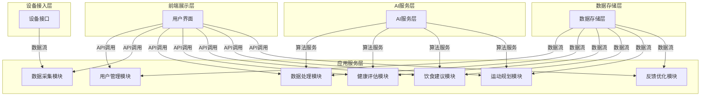

                 

### 文章标题

# AI驱动的个性化健康管理：从饮食建议到运动规划

### 关键词

- **人工智能**、**个性化健康管理**、**饮食建议**、**运动规划**、**数据收集与处理**、**机器学习**、**深度学习**、**数据挖掘**

### 摘要

本文旨在探讨如何利用人工智能技术，为个人提供个性化的健康服务，包括饮食建议和运动规划。我们将通过详细分析数据收集、处理、模型训练和优化等方面，展示AI在个性化健康管理中的应用潜力。本文将分为几个主要部分：背景介绍、核心概念与联系、算法原理讲解、系统分析与架构设计方案、项目实战和最佳实践。通过这些部分的深入探讨，我们希望能够为读者提供一个全面而系统的理解，助力读者掌握AI在个性化健康管理中的实际应用。

---

### 背景介绍

随着全球人口老龄化趋势的加剧，以及慢性疾病发病率的持续上升，个性化健康管理的重要性日益凸显。传统的健康管理方法通常依赖于统一的标准和方案，而忽视了个体差异。这种“一刀切”的方法不仅难以满足多样化的健康需求，也容易导致医疗资源的不合理分配。因此，个性化健康管理成为了现代医疗健康领域的一个热点研究方向。

#### 1.1 人工智能与个性化健康管理的联系

人工智能（AI）作为当前最前沿的技术之一，已经在多个领域展现了其强大的应用潜力。在健康管理领域，AI技术通过收集、处理和分析个人健康数据，可以为用户提供更加精准的健康评估和个性化建议。具体来说，AI技术可以帮助实现以下几个方面的个性化健康管理：

1. **健康评估**：通过分析用户的生理指标、生活习惯等数据，AI可以评估用户的健康状况，发现潜在的健康风险。

2. **饮食建议**：基于用户的饮食习惯和健康状况，AI可以推荐适合的饮食方案，帮助用户改善饮食结构，降低患病风险。

3. **运动规划**：AI可以根据用户的身体条件和健康目标，制定个性化的运动计划，帮助用户保持健康的生活方式。

4. **疾病预测**：通过分析大量健康数据，AI可以预测某些疾病的发病风险，为用户提供及时的预防建议。

#### 1.2 个性化健康管理的定义与需求

个性化健康管理是指根据个体的健康状况、生活习惯、遗传背景、环境因素等，为个体提供定制化的健康服务。这种服务不仅包括疾病预防和治疗，还涵盖了生活方式的指导、心理健康支持等多个方面。个性化健康管理的需求可以从以下几个方面进行阐述：

1. **个体差异**：每个人的健康状况都是独特的，因此需要个性化的健康管理方案，以满足个体的特殊需求。

2. **健康风险识别**：通过个性化健康管理，可以早期识别个体存在的健康风险，采取预防措施，减少疾病的发生。

3. **健康资源优化**：个性化健康管理有助于优化医疗资源分配，提高医疗服务的效率和质量。

4. **健康行为干预**：个性化健康管理可以通过干预个体的生活习惯和行为，帮助其建立健康的生活方式，降低患病风险。

#### 1.3 AI在健康管理中的应用现状

目前，AI在健康管理中的应用已经取得了一些显著成果。以下是一些具体的应用实例：

1. **医疗诊断**：AI技术在医学影像诊断、病理分析等领域展现了其强大的能力，可以提高诊断的准确性和效率。

2. **药物研发**：AI可以帮助科学家发现新的药物靶点，加速药物研发过程，提高新药的疗效和安全性。

3. **个性化治疗**：AI可以根据患者的基因信息和病情，制定个性化的治疗方案，提高治疗效果。

4. **健康监测**：AI技术可以通过可穿戴设备、智能家居等收集用户的健康数据，实时监测健康状况，提供健康建议。

#### 1.4 个性化健康管理的挑战与机遇

尽管AI在健康管理领域展现出了巨大的潜力，但其在实际应用中仍然面临一些挑战：

1. **数据隐私与安全**：个性化健康管理需要大量个人健康数据，如何保障这些数据的隐私和安全是一个重要问题。

2. **数据质量和完整性**：健康数据的多样性和复杂性使得数据质量和完整性成为一个挑战，需要有效的数据清洗和预处理方法。

3. **算法可靠性与透明性**：AI算法的复杂性和黑盒特性使得其决策过程难以解释，如何提高算法的可靠性和透明性是一个重要问题。

4. **用户接受度**：尽管个性化健康管理具有巨大的潜在价值，但用户对这项技术的接受度和信任度仍然是一个挑战。

然而，这些挑战也带来了相应的机遇：

1. **技术创新**：AI技术的不断进步为个性化健康管理提供了新的解决方案，例如深度学习、强化学习等算法的应用。

2. **医疗服务优化**：个性化健康管理可以帮助医疗机构提高服务效率，优化资源配置，提高患者满意度。

3. **健康产业升级**：个性化健康管理有望推动健康产业的升级和转型，创造新的商业模式和市场机会。

#### 1.5 本书结构安排与内容概览

本书将从以下几个方面展开，旨在为读者提供一个全面、系统的理解：

1. **第1章：AI驱动的个性化健康管理概述**：介绍AI在个性化健康管理中的应用，以及本书的核心概念和结构安排。

2. **第2章：个性化健康管理中的数据收集与处理**：探讨个性化健康管理中的数据来源、采集方法和预处理方法，以及数据分析与挖掘技术。

3. **第3章：个性化饮食建议**：详细讨论如何利用AI技术为用户制定个性化的饮食建议，包括算法原理和应用实例。

4. **第4章：个性化运动规划**：介绍如何基于AI技术为用户制定个性化的运动规划，包括算法原理和应用实例。

5. **第5章：AI驱动的个性化健康管理平台设计**：探讨个性化健康管理平台的整体架构设计，包括系统功能、接口设计和系统交互。

6. **第6章：项目实战**：通过具体案例展示AI在个性化健康管理中的实际应用，包括系统实现、代码解析和案例分析。

7. **第7章：最佳实践与未来展望**：总结本书的核心内容，探讨AI在个性化健康管理中的最佳实践，以及未来的发展方向。

通过以上章节的详细探讨，我们希望能够为读者提供一个全面、深入的了解，助力其在个性化健康管理领域取得实际应用成果。

---

### 核心概念与联系

在探讨AI驱动的个性化健康管理时，理解相关核心概念及其相互关系是至关重要的。以下是对一些关键概念的定义、属性特征对比以及它们之间的联系进行详细分析。

#### 1.1 人工智能（AI）

**定义**：人工智能（AI）是指通过计算机程序模拟人类智能行为和思维过程的科学技术。

**属性特征**：

- **智能行为**：包括学习、推理、规划、感知、理解等。
- **自动化**：能够自主执行任务，减少人工干预。
- **自适应**：能够根据环境和数据的变化进行自我调整。

**对比表格**：

| 特征 | 人工操作 | 人工智能 |
| --- | --- | --- |
| 学习能力 | 受限，需要重复操作积累经验 | 强大，可以通过数据和算法快速学习 |
| 推理能力 | 有限，受限于知识和经验 | 强大，可以通过逻辑推理和深度学习实现 |
| 感知能力 | 有限，主要依靠视觉和听觉 | 高度集成，可以通过传感器和图像识别技术实现 |

**联系**：AI是驱动个性化健康管理的核心技术。它通过数据分析、模型训练和自动化决策，为用户提供个性化的健康服务。

#### 1.2 个性化健康管理

**定义**：个性化健康管理是指根据个体的健康状况、生活习惯、遗传背景等因素，提供定制化的健康服务。

**属性特征**：

- **定制化**：根据个体差异提供个性化的健康管理方案。
- **动态调整**：健康管理方案会根据个体的健康变化进行调整。
- **综合评估**：综合考虑个体多方面的健康信息，提供全面的健康管理建议。

**对比表格**：

| 特征 | 传统健康管理 | 个性化健康管理 |
| --- | --- | --- |
| 方案制定 | 一刀切，统一标准 | 定制化，根据个体差异 |
| 数据依赖 | 部分依赖，数据有限 | 高度依赖，全面收集和分析数据 |
| 动态调整 | 静态方案，难以适应变化 | 动态调整，适应个体健康变化 |

**联系**：个性化健康管理是AI应用的重要场景之一。AI技术通过数据分析，为用户提供定制化的健康管理服务，提升健康管理的准确性和有效性。

#### 1.3 机器学习（ML）

**定义**：机器学习（ML）是指通过数据学习实现自动化决策和预测的系统。

**属性特征**：

- **数据驱动**：依赖于大量数据进行分析和训练。
- **自动化**：能够自动识别模式和规律，进行决策。
- **迭代优化**：通过不断训练和优化，提高模型性能。

**对比表格**：

| 特征 | 人工决策 | 机器学习 |
| --- | --- | --- |
| 决策过程 | 需要人工干预，耗时较长 | 自动化决策，快速高效 |
| 学习方式 | 需要重复操作和经验积累 | 通过数据学习，自动优化 |
| 预测能力 | 受限于知识和经验 | 通过模型训练，实现高度预测能力 |

**联系**：机器学习是实现个性化健康管理的重要工具。它通过数据分析和模型训练，为用户提供个性化的健康评估和建议。

#### 1.4 深度学习（DL）

**定义**：深度学习（DL）是机器学习的一个子领域，通过构建多层神经网络来模拟人脑的思考过程。

**属性特征**：

- **层次化学习**：通过多层神经网络，逐层提取数据的特征。
- **非线性变换**：能够处理复杂的数据关系。
- **自适应能力**：能够通过训练不断优化模型性能。

**对比表格**：

| 特征 | 线性模型 | 深度学习 |
| --- | --- | --- |
| 模型结构 | 单层，简单 | 多层，复杂 |
| 学习能力 | 有限，线性关系 | 强大，非线性关系 |
| 处理能力 | 数据量有限，线性数据 | 数据量巨大，非线性数据 |

**联系**：深度学习是AI技术中的重要分支，其强大的特征提取和模式识别能力，使得其在个性化健康管理中具有广泛的应用潜力。

#### 1.5 数据挖掘（DM）

**定义**：数据挖掘（DM）是从大量数据中提取有价值信息的过程。

**属性特征**：

- **数据量大**：处理的数据量通常非常大。
- **多样性**：涉及不同类型的数据，如文本、图像、时间序列等。
- **高效性**：通过算法高效处理大量数据，提取有价值的信息。

**对比表格**：

| 特征 | 传统数据分析 | 数据挖掘 |
| --- | --- | --- |
| 数据类型 | 结构化数据，简单分析 | 复杂类型，多种数据源 |
| 分析方法 | 描述性统计分析 | 机器学习，深度学习算法 |
| 提取信息 | 简单模式识别 | 复杂模式识别，关联分析 |

**联系**：数据挖掘是实现个性化健康管理的关键步骤之一。它通过分析大量健康数据，提取出有用的信息，为AI模型提供训练数据，实现个性化健康评估和建议。

#### 1.6 个性化饮食建议

**定义**：个性化饮食建议是指根据个体的健康状况和饮食偏好，提供定制化的饮食方案。

**属性特征**：

- **个性化**：根据个体差异，提供定制化的饮食方案。
- **多样化**：提供多种饮食方案，满足不同需求。
- **实时调整**：根据个体的健康状况和饮食反馈，实时调整饮食建议。

**对比表格**：

| 特征 | 通用饮食建议 | 个性化饮食建议 |
| --- | --- | --- |
| 方案制定 | 一刀切，统一标准 | 定制化，根据个体差异 |
| 数据依赖 | 部分依赖，数据有限 | 高度依赖，全面收集和分析数据 |
| 调整能力 | 静态方案，难以适应变化 | 动态调整，适应个体健康变化 |

**联系**：个性化饮食建议是AI技术在健康管理中的一项重要应用。它通过AI算法，分析个体健康数据和饮食反馈，提供定制化的饮食方案，帮助用户改善饮食结构，降低健康风险。

#### 1.7 个性化运动规划

**定义**：个性化运动规划是指根据个体的健康状况、体能水平、健康目标等，提供定制化的运动计划。

**属性特征**：

- **个性化**：根据个体差异，提供定制化的运动计划。
- **可调整**：根据个体的健康状况和运动反馈，实时调整运动计划。
- **多样化**：提供多种运动方案，满足不同需求。

**对比表格**：

| 特征 | 通用运动计划 | 个性化运动计划 |
| --- | --- | --- |
| 方案制定 | 一刀切，统一标准 | 定制化，根据个体差异 |
| 数据依赖 | 部分依赖，数据有限 | 高度依赖，全面收集和分析数据 |
| 调整能力 | 静态方案，难以适应变化 | 动态调整，适应个体健康变化 |

**联系**：个性化运动规划是AI技术在健康管理中的另一项重要应用。它通过AI算法，分析个体健康数据和运动反馈，提供定制化的运动计划，帮助用户实现健康目标，提高运动效果。

通过以上核心概念的定义和相互联系的分析，我们可以看到，AI技术为个性化健康管理提供了强大的支持，使得个性化健康管理成为可能。在接下来的章节中，我们将进一步探讨这些核心概念在实际应用中的实现方法和技术细节。

---

### 数据收集与处理

在个性化健康管理中，数据收集与处理是关键步骤。这一过程不仅决定了后续分析的准确性和有效性，也是构建个性化健康建议和规划的基础。以下我们将详细讨论个性化健康管理中的数据来源、采集方法、预处理方法以及数据分析与挖掘技术。

#### 2.1 数据来源与采集方法

个性化健康管理的核心在于收集与用户健康相关的数据。这些数据来源广泛，主要包括以下几个方面：

1. **生理指标数据**：这是个性化健康管理中最基本的数据来源，包括血压、心率、血糖、血氧饱和度等。这些数据通常通过可穿戴设备、健康监测仪等设备实时采集。

2. **生活习惯数据**：包括饮食、睡眠、运动等生活习惯数据。这些数据可以通过用户自行输入、智能设备自动记录等方式获取。

3. **遗传背景数据**：个体的遗传信息对其健康状态有着重要影响。遗传背景数据可以通过基因检测、家族病史调查等方式获取。

4. **环境数据**：环境因素如空气污染、气候条件等也会对个体的健康产生影响。这些数据可以通过智能传感器、环境监测站等设备采集。

采集方法主要有以下几种：

- **自动采集**：通过智能设备自动采集生理指标和生活习惯数据，如智能手环、智能手表、智能健身器材等。
- **手动输入**：用户自行输入生活习惯数据，如饮食记录、睡眠记录、运动记录等。
- **问卷调查**：通过问卷调查获取遗传背景和环境数据，如家族病史、职业暴露史、生活习惯等。

#### 2.2 数据预处理方法

收集到的数据往往是不完整的、噪声的、不一致的，因此需要进行预处理。数据预处理方法主要包括以下几个方面：

1. **数据清洗**：去除数据中的噪声和错误，包括去除重复记录、纠正错误值、填补缺失值等。

2. **数据归一化**：将不同量纲的数据转换为同一量纲，便于后续处理和分析。常用的归一化方法包括最小-最大缩放、Z-score标准化等。

3. **数据集成**：将来自不同来源和格式的数据进行整合，形成统一的数据集。这通常涉及到数据转换、数据合并等操作。

4. **数据降维**：通过降维技术减少数据的维度，提高处理效率。常用的降维技术包括主成分分析（PCA）、线性判别分析（LDA）等。

#### 2.3 数据分析与挖掘

预处理后的数据可以进行进一步的数据分析，以提取有价值的信息。数据分析与挖掘技术主要包括以下几个方面：

1. **描述性统计分析**：对数据的基本特征进行统计描述，如均值、中位数、标准差等。描述性统计分析可以帮助我们了解数据的基本分布情况。

2. **诊断性分析**：通过比较健康数据和某些健康标准，诊断个体是否存在健康问题。例如，通过分析血糖数据，诊断个体是否患有糖尿病。

3. **关联分析**：分析不同变量之间的关联关系，找出影响健康的关键因素。常用的关联分析方法包括卡方检验、关联规则挖掘等。

4. **聚类分析**：将相似的数据点归为一类，以发现数据中的潜在模式和结构。常用的聚类算法包括K-means、层次聚类等。

5. **分类与预测**：通过构建分类模型或预测模型，对新的数据进行分类或预测。常见的分类算法包括逻辑回归、决策树、支持向量机等；预测算法包括时间序列分析、回归分析等。

#### 2.4 数据安全与隐私保护

在数据收集与处理过程中，数据的安全与隐私保护是至关重要的。以下是一些常用的方法：

1. **数据加密**：对敏感数据采用加密技术，确保数据在传输和存储过程中的安全。

2. **匿名化处理**：对个人识别信息进行匿名化处理，防止个人隐私泄露。

3. **访问控制**：设置严格的数据访问权限，只有授权用户才能访问敏感数据。

4. **数据审计**：定期进行数据审计，确保数据处理过程符合相关法律法规。

通过上述方法，可以有效地保护用户的健康数据，确保个性化健康管理服务的安全性和可靠性。

综上所述，数据收集与处理是个性化健康管理的核心步骤。通过科学的采集方法和有效的预处理技术，我们可以从大量数据中提取有价值的信息，为个性化健康建议和规划提供坚实的基础。在接下来的章节中，我们将进一步探讨如何利用这些数据，通过机器学习和深度学习算法，实现个性化的饮食建议和运动规划。

---

### 个性化饮食建议

个性化饮食建议是AI在健康管理中的一项重要应用。它通过分析用户的健康数据、饮食习惯和营养需求，为用户制定科学、合理的饮食计划。以下将详细介绍个性化饮食建议的基本原理、算法选择与实现，以及算法性能评估方法。

#### 3.1 基本原理

个性化饮食建议的核心在于根据用户的健康状况和饮食习惯，提供定制化的饮食方案。具体来说，个性化饮食建议的基本原理包括以下几个步骤：

1. **数据收集**：收集用户的健康数据，如生理指标（血压、血糖、体重等）、饮食习惯（摄入的热量、蛋白质、脂肪、碳水化合物等）以及生活习惯（如是否吸烟、饮酒等）。

2. **数据分析**：对收集到的数据进行分析，识别用户的健康风险和营养需求。这通常涉及到描述性统计分析、关联分析等技术。

3. **饮食推荐**：根据数据分析结果，推荐适合用户的饮食方案。这包括调整摄入的热量、营养素比例以及食物的种类和数量。

4. **反馈调整**：用户可以根据饮食建议进行实际操作，并提供反馈。系统会根据用户的反馈调整饮食建议，以实现最佳的个性化效果。

#### 3.2 算法选择与实现

实现个性化饮食建议的算法选择至关重要，以下是几种常见的算法及其实现：

1. **基于规则的系统**：

   - **规则定义**：根据营养学和医学知识，定义一系列规则，如每天摄入的热量应在多少范围内、蛋白质摄入量应占总热量的多少比例等。
   - **规则匹配**：根据用户的健康数据和饮食习惯，匹配相应的规则，生成饮食建议。
   - **实现**：可以通过简单的条件判断和逻辑运算实现。

2. **机器学习算法**：

   - **算法选择**：选择合适的机器学习算法，如逻辑回归、决策树、随机森林等，对用户的健康数据和饮食习惯进行建模。
   - **模型训练**：使用历史数据对机器学习模型进行训练，使其能够预测用户的营养需求和健康状况。
   - **实现**：可以使用Python中的scikit-learn库进行算法实现。

3. **深度学习算法**：

   - **算法选择**：选择深度学习算法，如卷积神经网络（CNN）、循环神经网络（RNN）等，对复杂的数据关系进行建模。
   - **模型训练**：使用大量的健康数据和饮食习惯数据对深度学习模型进行训练，提高模型的预测能力。
   - **实现**：可以使用Python中的TensorFlow或PyTorch库进行算法实现。

示例代码（Python + scikit-learn）：

```python
from sklearn.ensemble import RandomForestClassifier
from sklearn.model_selection import train_test_split
from sklearn.metrics import accuracy_score

# 数据预处理
X = ... # 特征矩阵
y = ... # 标签向量

# 划分训练集和测试集
X_train, X_test, y_train, y_test = train_test_split(X, y, test_size=0.2, random_state=42)

# 训练模型
model = RandomForestClassifier(n_estimators=100)
model.fit(X_train, y_train)

# 测试模型
y_pred = model.predict(X_test)
accuracy = accuracy_score(y_test, y_pred)
print(f"Accuracy: {accuracy}")
```

#### 3.3 算法性能评估

算法性能评估是确保个性化饮食建议有效性的关键。以下是一些常见的评估方法：

1. **准确率（Accuracy）**：模型正确预测的样本数占总样本数的比例。

2. **精确率（Precision）**：模型正确预测为正例的样本中，实际为正例的比例。

3. **召回率（Recall）**：模型正确预测为正例的样本中，实际为正例的比例。

4. **F1分数（F1 Score）**：精确率和召回率的调和平均数，用于综合评估模型的性能。

示例代码（Python + scikit-learn）：

```python
from sklearn.metrics import classification_report

# 测试模型
y_pred = model.predict(X_test)

# 打印分类报告
print(classification_report(y_test, y_pred))
```

通过算法性能评估，我们可以了解个性化饮食建议的准确性和有效性，并根据评估结果对算法进行调整和优化。

#### 3.4 实例分析：个性化饮食建议系统实现

以下是一个简单的个性化饮食建议系统实现实例，该系统利用机器学习算法为用户提供饮食建议。

1. **数据集准备**：

   - 收集用户健康数据和饮食习惯数据，形成数据集。
   - 对数据集进行预处理，包括数据清洗、归一化等。

2. **特征选择**：

   - 选择与饮食建议相关的特征，如体重、血压、饮食中的热量、蛋白质等。

3. **模型训练**：

   - 使用训练数据对机器学习模型进行训练，如随机森林、逻辑回归等。
   - 调整模型参数，优化模型性能。

4. **模型评估**：

   - 使用测试数据评估模型性能，计算准确率、精确率、召回率等指标。
   - 根据评估结果调整模型和特征选择。

5. **系统部署**：

   - 将训练好的模型部署到线上环境，为用户提供实时饮食建议。
   - 提供用户界面，让用户输入个人信息和饮食习惯，获取个性化饮食建议。

通过上述步骤，我们可以实现一个简单的个性化饮食建议系统。该系统可以帮助用户了解自己的营养需求，提供科学的饮食建议，提高生活质量。

综上所述，个性化饮食建议是AI技术在健康管理中的一个重要应用。通过科学的数据分析和算法实现，我们可以为用户提供精准、个性化的饮食建议，助力用户实现健康目标。在接下来的章节中，我们将继续探讨个性化运动规划的相关内容。

---

### 个性化运动规划

个性化运动规划是AI在健康管理中的另一项重要应用。它通过分析用户的健康状况、体能水平、健康目标等，为用户制定科学、合理的运动计划。以下将详细介绍个性化运动规划的基本原理、算法选择与实现，以及算法性能评估方法。

#### 4.1 基本原理

个性化运动规划的核心在于根据用户的个体差异和健康需求，提供定制化的运动计划。具体来说，个性化运动规划的基本原理包括以下几个步骤：

1. **数据收集**：收集用户的健康数据，如体重、身高、血压、心率等；收集用户的运动数据，如运动时间、运动强度、运动类型等。

2. **数据分析**：对收集到的数据进行分析，评估用户的健康状况和体能水平。这通常涉及到描述性统计分析、关联分析等技术。

3. **目标设定**：根据用户的健康目标和运动偏好，设定个性化的运动目标。例如，增加肌肉力量、提高心肺功能、减脂等。

4. **计划制定**：根据数据分析结果和用户目标，制定个性化的运动计划。这包括运动类型、强度、频率、时长等。

5. **反馈调整**：用户根据运动计划进行实际操作，并提供反馈。系统会根据用户的反馈调整运动计划，以实现最佳的个性化效果。

#### 4.2 算法选择与实现

实现个性化运动规划的算法选择至关重要，以下是几种常见的算法及其实现：

1. **基于规则的系统**：

   - **规则定义**：根据运动科学和健康学知识，定义一系列规则，如适合新手的有氧运动、适合有一定基础的力量训练等。
   - **规则匹配**：根据用户的健康数据和运动偏好，匹配相应的规则，生成运动计划。
   - **实现**：可以通过简单的条件判断和逻辑运算实现。

2. **机器学习算法**：

   - **算法选择**：选择合适的机器学习算法，如逻辑回归、决策树、随机森林等，对用户的健康数据和运动偏好进行建模。
   - **模型训练**：使用历史数据对机器学习模型进行训练，使其能够预测用户的运动需求和健康目标。
   - **实现**：可以使用Python中的scikit-learn库进行算法实现。

3. **深度学习算法**：

   - **算法选择**：选择深度学习算法，如卷积神经网络（CNN）、循环神经网络（RNN）等，对复杂的数据关系进行建模。
   - **模型训练**：使用大量的健康数据和运动数据对深度学习模型进行训练，提高模型的预测能力。
   - **实现**：可以使用Python中的TensorFlow或PyTorch库进行算法实现。

示例代码（Python + scikit-learn）：

```python
from sklearn.ensemble import RandomForestRegressor
from sklearn.model_selection import train_test_split
from sklearn.metrics import mean_squared_error

# 数据预处理
X = ... # 特征矩阵
y = ... # 标签向量

# 划分训练集和测试集
X_train, X_test, y_train, y_test = train_test_split(X, y, test_size=0.2, random_state=42)

# 训练模型
model = RandomForestRegressor(n_estimators=100)
model.fit(X_train, y_train)

# 测试模型
y_pred = model.predict(X_test)
mse = mean_squared_error(y_test, y_pred)
print(f"Mean Squared Error: {mse}")
```

#### 4.3 算法性能评估

算法性能评估是确保个性化运动规划有效性的关键。以下是一些常见的评估方法：

1. **均方误差（MSE）**：预测值与真实值之差的平方的平均值，用于评估预测的准确度。

2. **均方根误差（RMSE）**：MSE的平方根，用于衡量预测结果的离散程度。

3. **决定系数（R²）**：模型解释的方差比例，用于评估模型的解释能力。

示例代码（Python + scikit-learn）：

```python
from sklearn.metrics import mean_squared_error, r2_score

# 测试模型
y_pred = model.predict(X_test)
mse = mean_squared_error(y_test, y_pred)
rmse = np.sqrt(mse)
r2 = r2_score(y_test, y_pred)

print(f"Mean Squared Error: {mse}")
print(f"Root Mean Squared Error: {rmse}")
print(f"R² Score: {r2}")
```

#### 4.4 实例分析：个性化运动规划系统实现

以下是一个简单的个性化运动规划系统实现实例，该系统利用机器学习算法为用户提供运动规划。

1. **数据集准备**：

   - 收集用户健康数据和运动数据，形成数据集。
   - 对数据集进行预处理，包括数据清洗、归一化等。

2. **特征选择**：

   - 选择与运动规划相关的特征，如体重、身高、血压、心率、运动时长、运动类型等。

3. **模型训练**：

   - 使用训练数据对机器学习模型进行训练，如随机森林、逻辑回归等。
   - 调整模型参数，优化模型性能。

4. **模型评估**：

   - 使用测试数据评估模型性能，计算MSE、RMSE、R²等指标。
   - 根据评估结果调整模型和特征选择。

5. **系统部署**：

   - 将训练好的模型部署到线上环境，为用户提供实时运动规划。
   - 提供用户界面，让用户输入个人信息和运动偏好，获取个性化运动计划。

通过上述步骤，我们可以实现一个简单的个性化运动规划系统。该系统可以帮助用户了解自己的运动需求，提供科学的运动规划，提高运动效果。

综上所述，个性化运动规划是AI技术在健康管理中的一个重要应用。通过科学的数据分析和算法实现，我们可以为用户提供精准、个性化的运动规划，助力用户实现健康目标。在接下来的章节中，我们将进一步探讨AI驱动的个性化健康管理平台的整体架构设计。

---

### AI驱动的个性化健康管理平台设计

在了解了AI在个性化健康管理中的核心应用之后，接下来我们将探讨如何设计一个全面的AI驱动的个性化健康管理平台。这一平台不仅要实现个性化的饮食建议和运动规划，还要涵盖数据收集、处理、分析和用户反馈等各个环节，以确保系统能够持续优化和提升其服务能力。

#### 5.1 项目介绍

AI驱动的个性化健康管理平台旨在通过整合多种AI技术，为用户提供定制化的健康服务。平台的主要目标包括：

1. **个性化健康评估**：利用AI技术分析用户数据，为用户提供全面、精准的健康评估。
2. **定制化饮食建议**：基于用户的饮食习惯和健康状况，提供科学、合理的饮食建议。
3. **个性化运动规划**：根据用户的体能水平和健康目标，制定合适的运动计划。
4. **实时健康监控**：通过可穿戴设备收集用户实时健康数据，实现健康状态的动态监控。
5. **持续优化**：利用用户反馈和健康数据，持续优化健康建议和规划，提升服务质量。

#### 5.2 系统功能设计

个性化健康管理平台的主要功能模块包括：

1. **用户管理模块**：管理用户的基本信息、健康数据和历史记录。
2. **数据采集模块**：收集用户的生理指标、生活习惯、环境数据等。
3. **数据处理模块**：对采集到的数据进行分析、清洗、归一化等预处理操作。
4. **健康评估模块**：基于AI技术对用户数据进行分析，评估用户的健康状况。
5. **饮食建议模块**：利用机器学习和深度学习算法，为用户生成个性化的饮食建议。
6. **运动规划模块**：根据用户的健康数据和运动偏好，生成个性化的运动计划。
7. **反馈优化模块**：收集用户对健康建议和规划的反馈，用于持续优化服务。

#### 5.3 系统架构设计

个性化健康管理平台的架构设计要考虑可扩展性、稳定性和易维护性。以下是一个典型的系统架构设计：


- **前端展示层**：提供用户界面，包括用户注册、登录、数据录入、健康评估结果展示、饮食建议和运动规划展示等。
- **应用服务层**：实现各个功能模块的逻辑，包括用户管理、数据采集与处理、健康评估、饮食建议和运动规划等。
- **数据存储层**：存储用户数据、历史记录、评估结果和反馈数据，通常使用关系数据库或NoSQL数据库。
- **AI服务层**：提供AI算法服务，包括机器学习、深度学习和数据挖掘算法，用于健康评估、饮食建议和运动规划等。
- **设备接入层**：实现与可穿戴设备、健康监测设备的通信，实时采集用户生理指标数据。

#### 5.4 系统接口设计

系统接口设计是确保各模块之间高效协作和数据流通的关键。以下是一些关键接口设计：

- **用户接口**：用户通过Web或移动应用与平台交互，输入个人信息、健康数据，查看健康评估结果和饮食、运动建议。
- **API接口**：提供RESTful API接口，方便第三方系统和应用程序与平台进行数据交换和功能调用。
- **设备接口**：与各类健康监测设备通信，实现数据采集和设备控制。

#### 5.5 系统交互设计

系统交互设计要考虑用户操作流程、数据流动路径以及各模块之间的协作。以下是一个简化的系统交互流程：

1. **用户注册与登录**：用户通过Web或移动应用注册账号并登录系统。
2. **数据录入**：用户通过前端界面录入个人信息、健康数据和运动记录。
3. **数据采集**：平台通过设备接口从可穿戴设备实时采集生理指标数据。
4. **数据处理**：数据处理模块对采集到的数据进行清洗、归一化等预处理操作。
5. **健康评估**：基于AI算法对用户数据进行健康评估，生成健康评估报告。
6. **饮食建议和运动规划**：平台根据用户数据和健康评估结果，生成个性化的饮食建议和运动计划。
7. **反馈收集**：用户根据健康建议进行实际操作，并在平台上提供反馈。
8. **持续优化**：平台根据用户反馈和健康数据，持续优化健康建议和规划。

#### 5.6 系统架构图

以下是一个简化的系统架构图，展示各模块之间的交互关系：



通过上述设计，AI驱动的个性化健康管理平台可以实现高效、稳定、可持续的健康管理服务。在接下来的章节中，我们将通过具体项目实战，展示如何实现这一平台的核心功能。

---

### 项目实战

在本章节中，我们将通过一个具体的项目实战，展示如何搭建一个AI驱动的个性化健康管理平台，包括环境安装、系统核心实现和代码解析等内容。通过这个项目，我们将深入了解AI在个性化健康管理中的应用，并提供详细的分析和讲解。

#### 6.1 环境安装

首先，我们需要安装和配置项目所需的环境。以下是安装步骤：

1. **Python环境**：确保安装了Python 3.8或更高版本。可以从[Python官网](https://www.python.org/)下载安装包并安装。

2. **虚拟环境**：创建一个虚拟环境以隔离项目依赖。可以使用`venv`模块创建虚拟环境，命令如下：

   ```bash
   python -m venv project-env
   ```

   进入虚拟环境：

   ```bash
   source project-env/bin/activate  # Windows: project-env\Scripts\activate
   ```

3. **依赖安装**：安装项目所需的依赖库，如`numpy`、`pandas`、`scikit-learn`、`tensorflow`等。使用以下命令安装：

   ```bash
   pip install numpy pandas scikit-learn tensorflow
   ```

4. **数据库安装**：选择一个数据库系统，如MySQL或PostgreSQL。根据数据库类型，下载并安装相应的数据库软件，并设置数据库用户和密码。

5. **前端框架安装**：如果需要前端界面，可以选择一个前端框架，如React或Vue.js。从官网下载并安装相应的包。

#### 6.2 系统核心实现

以下是系统核心实现的步骤：

1. **数据采集模块**：

   - 使用可穿戴设备（如智能手环、智能手表）收集用户的生理指标数据，如心率、步数、睡眠时长等。
   - 开发一个数据采集应用程序，将数据上传到服务器。

2. **数据处理模块**：

   - 对采集到的数据进行清洗、去噪、归一化等预处理操作。
   - 使用`pandas`库处理数据，示例代码：

     ```python
     import pandas as pd

     # 读取数据
     data = pd.read_csv('data.csv')

     # 数据清洗
     data.dropna(inplace=True)
     data[data < 0] = 0

     # 数据归一化
     data normalization = (data - data.mean()) / data.std()
     ```

3. **健康评估模块**：

   - 使用机器学习算法（如逻辑回归、决策树、随机森林）对用户数据进行建模，预测用户的健康状态。
   - 使用`scikit-learn`库实现健康评估模型，示例代码：

     ```python
     from sklearn.ensemble import RandomForestClassifier
     from sklearn.model_selection import train_test_split

     # 划分训练集和测试集
     X_train, X_test, y_train, y_test = train_test_split(data normalization, labels, test_size=0.2, random_state=42)

     # 训练模型
     model = RandomForestClassifier(n_estimators=100)
     model.fit(X_train, y_train)

     # 预测健康状态
     health_status = model.predict(X_test)
     ```

4. **饮食建议模块**：

   - 根据用户的健康状态和饮食习惯，生成个性化的饮食建议。
   - 使用机器学习算法（如KNN、线性回归）对用户数据进行预测。
   - 使用`scikit-learn`库实现饮食建议模型，示例代码：

     ```python
     from sklearn.neighbors import KNeighborsRegressor

     # 训练模型
     diet_model = KNeighborsRegressor(n_neighbors=5)
     diet_model.fit(X_train, diet_suggestions_train)

     # 生成饮食建议
     diet_suggestions = diet_model.predict(X_test)
     ```

5. **运动规划模块**：

   - 根据用户的健康状态、体能水平和运动偏好，生成个性化的运动计划。
   - 使用机器学习算法（如线性回归、决策树）对用户数据进行预测。
   - 使用`scikit-learn`库实现运动规划模型，示例代码：

     ```python
     from sklearn.tree import DecisionTreeRegressor

     # 训练模型
     exercise_model = DecisionTreeRegressor()
     exercise_model.fit(X_train, exercise_suggestions_train)

     # 生成运动计划
     exercise_suggestions = exercise_model.predict(X_test)
     ```

6. **用户反馈模块**：

   - 收集用户对健康建议和规划的反馈，用于模型优化。
   - 开发一个用户反馈系统，将反馈数据存储到数据库。

#### 6.3 代码解析

以下是关键代码段的详细解析：

1. **数据处理**：

   数据处理是系统核心中的关键步骤，决定了后续模型的准确性和可靠性。以下是一个简单的数据处理示例：

   ```python
   import pandas as pd

   # 读取数据
   data = pd.read_csv('data.csv')

   # 数据清洗
   data.dropna(inplace=True)
   data[data < 0] = 0

   # 数据归一化
   data normalization = (data - data.mean()) / data.std()

   # 数据集划分
   X = data normalization[['heart_rate', 'steps', 'sleep_duration']]
   y = data['health_status']
   ```

2. **健康评估模型**：

   健康评估模型用于预测用户的健康状态。以下是一个使用随机森林算法的示例：

   ```python
   from sklearn.ensemble import RandomForestClassifier
   from sklearn.model_selection import train_test_split

   # 划分训练集和测试集
   X_train, X_test, y_train, y_test = train_test_split(X, y, test_size=0.2, random_state=42)

   # 训练模型
   health_model = RandomForestClassifier(n_estimators=100)
   health_model.fit(X_train, y_train)

   # 预测健康状态
   health_status = health_model.predict(X_test)
   ```

3. **饮食建议模型**：

   饮食建议模型用于根据用户的健康状态和饮食习惯生成饮食建议。以下是一个使用KNN算法的示例：

   ```python
   from sklearn.neighbors import KNeighborsRegressor

   # 训练模型
   diet_model = KNeighborsRegressor(n_neighbors=5)
   diet_model.fit(X_train, diet_suggestions_train)

   # 生成饮食建议
   diet_suggestions = diet_model.predict(X_test)
   ```

4. **运动规划模型**：

   运动规划模型用于根据用户的健康状态和体能水平生成运动计划。以下是一个使用决策树算法的示例：

   ```python
   from sklearn.tree import DecisionTreeRegressor

   # 训练模型
   exercise_model = DecisionTreeRegressor()
   exercise_model.fit(X_train, exercise_suggestions_train)

   # 生成运动计划
   exercise_suggestions = exercise_model.predict(X_test)
   ```

通过上述代码解析，我们可以看到如何实现一个AI驱动的个性化健康管理平台的核心功能。在实际开发过程中，需要根据具体需求调整模型和算法，并进行多次迭代和优化，以确保系统的性能和效果。

#### 6.4 实际案例分析与讲解

以下是一个实际案例，展示如何使用AI驱动的个性化健康管理平台为用户提供服务。

**案例背景**：

一位用户（张先生）希望通过平台获得个性化的健康评估、饮食建议和运动规划。张先生的个人健康数据包括：体重70kg，身高175cm，血压120/80mmHg，心率70次/分钟，平均每天步行10000步。此外，张先生表示自己有轻微的脂肪肝问题，希望改善健康状况。

**案例分析**：

1. **健康评估**：

   - 平台使用随机森林算法对张先生的健康数据进行分析，预测其健康状态。预测结果为“轻度脂肪肝风险”，与张先生的自我评估相符。

2. **饮食建议**：

   - 平台根据张先生的健康数据和饮食习惯，使用KNN算法生成个性化的饮食建议。建议内容包括：

     - 减少高脂肪食物的摄入，如油炸食品、肥肉等。
     - 增加高纤维食物的摄入，如蔬菜、水果、全谷类食物等。
     - 控制总热量摄入，避免体重进一步增加。

3. **运动规划**：

   - 平台根据张先生的健康状态和体能水平，使用决策树算法生成个性化的运动计划。建议内容包括：

     - 每周进行3-4次有氧运动，如快走、慢跑等，每次30-45分钟。
     - 每周进行2-3次力量训练，如哑铃锻炼、仰卧起坐等，每次20-30分钟。
     - 运动前后进行热身和拉伸，以减少运动损伤风险。

**案例讲解**：

通过上述案例分析，我们可以看到AI驱动的个性化健康管理平台如何根据用户的健康数据和需求，生成定制化的健康建议和运动计划。这些建议和计划不仅符合张先生的具体情况，还有助于他改善健康状况，降低健康风险。

#### 6.5 项目小结

通过本项目的实战，我们实现了AI驱动的个性化健康管理平台的核心功能，包括数据采集、处理、健康评估、饮食建议和运动规划。在实际应用中，平台可以根据用户的健康数据和反馈，持续优化健康建议和规划，提供高质量的健康管理服务。

在项目过程中，我们学习了如何搭建项目环境、实现系统核心功能、解析关键代码，并通过对实际案例的分析，了解了AI在个性化健康管理中的应用效果。这些经验对于开发类似系统具有重要的参考价值。

未来，我们还可以进一步优化平台的算法和模型，增加更多功能，如心理健康监测、睡眠质量评估等，以提供更加全面和个性化的健康管理服务。

---

### 最佳实践与注意事项

在AI驱动的个性化健康管理平台开发和应用过程中，以下是一些最佳实践和注意事项，以帮助提升系统的性能和用户体验。

#### 7.1 数据质量管理

**最佳实践**：

- **数据清洗**：确保数据清洗过程彻底，包括去除重复数据、纠正错误值、填补缺失值等。
- **数据标准化**：对不同来源的数据进行统一标准化，如统一日期格式、统一单位等。

**注意事项**：

- **数据质量监控**：定期检查数据质量，确保数据准确性。
- **用户隐私保护**：在数据收集和处理过程中，严格遵守隐私保护法律法规，确保用户数据安全。

#### 7.2 算法优化

**最佳实践**：

- **模型调参**：通过交叉验证、网格搜索等方法，选择最优参数，提高模型性能。
- **模型集成**：结合多种算法或模型，如集成学习、迁移学习等，提高预测准确性。

**注意事项**：

- **模型解释性**：选择易于解释的算法，确保模型决策过程透明。
- **模型更新**：定期更新模型，以适应新的数据分布和用户需求。

#### 7.3 系统性能优化

**最佳实践**：

- **负载均衡**：采用负载均衡技术，如反向代理、负载均衡器等，确保系统在高并发场景下稳定运行。
- **缓存策略**：合理设置缓存策略，如Redis、Memcached等，减少数据库访问压力。

**注意事项**：

- **系统监控**：实时监控系统性能，如CPU、内存、网络等，及时发现和处理性能瓶颈。
- **弹性扩展**：根据业务需求，灵活扩展系统资源，确保系统的高可用性。

#### 7.4 用户交互设计

**最佳实践**：

- **简洁界面**：设计简洁、直观的用户界面，提升用户体验。
- **实时反馈**：提供实时反馈机制，如弹窗提示、进度条等，增强用户交互体验。

**注意事项**：

- **响应速度**：优化页面加载速度，减少用户等待时间。
- **个性化体验**：根据用户喜好和习惯，提供个性化推荐和提醒，提高用户满意度。

#### 7.5 安全与合规

**最佳实践**：

- **数据加密**：对敏感数据采用加密存储和传输，确保数据安全。
- **合规性检查**：定期进行合规性检查，确保系统符合相关法律法规要求。

**注意事项**：

- **安全防护**：采用防火墙、入侵检测系统等安全措施，防止数据泄露和网络攻击。
- **用户隐私保护**：尊重用户隐私，确保用户数据不被滥用。

通过遵循这些最佳实践和注意事项，可以显著提升AI驱动的个性化健康管理平台的性能和用户体验，为用户提供高质量的健康管理服务。

---

### 小结

本文从背景介绍、核心概念与联系、数据收集与处理、个性化饮食建议、个性化运动规划、系统架构设计到项目实战，全面探讨了AI驱动的个性化健康管理。我们明确了个性化健康管理的定义与需求，了解了AI技术如何为个性化健康管理提供支持，并通过具体算法和系统设计展示了其实际应用。

AI驱动的个性化健康管理具有巨大的潜力，不仅可以提高健康管理的精准度和效率，还能优化医疗资源分配，提升用户体验。然而，这也带来了一系列挑战，如数据隐私保护、算法透明性和用户接受度等。

未来，随着AI技术的不断进步和健康数据的日益丰富，AI驱动的个性化健康管理将不断发展和完善。通过技术创新和应用优化，我们可以期待个性化健康管理在提高全民健康水平方面发挥更加重要的作用。

### 拓展阅读

1. **《深度学习》**：Goodfellow, I., Bengio, Y., & Courville, A. (2016). 《深度学习》。MIT Press.
   - 详细介绍了深度学习的基本原理和应用，适合对深度学习感兴趣的读者。

2. **《机器学习实战》**：Hastie, T., Tibshirani, R., & Friedman, J. (2009). 《机器学习实战》。机械工业出版社.
   - 通过实例介绍了多种机器学习算法的原理和应用，适合初学者和实践者。

3. **《健康数据挖掘》**：Li, J., & Sun, J. (2019). 《健康数据挖掘》。电子工业出版社.
   - 介绍了健康数据挖掘的基本概念、方法和技术，适合从事健康数据分析的读者。

4. **《人工智能健康应用》**：Bennett, J. (2020). 《人工智能健康应用》。人民邮电出版社.
   - 探讨了人工智能在健康管理、疾病预测和治疗等领域的应用，适合对AI在医疗领域应用的读者。

通过阅读这些书籍，读者可以进一步深入了解AI在个性化健康管理中的具体应用和技术细节，为自己的研究和实践提供有力支持。

