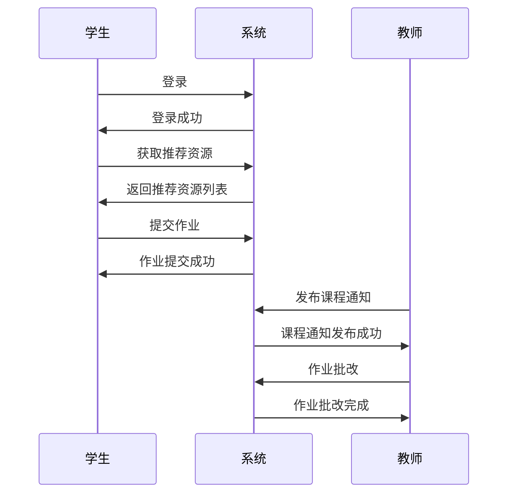

                 

# AI驱动的个性化学习：教育革命的开端

## 关键词

- 人工智能，个性化学习，教育革命，机器学习算法，教育技术

## 摘要

随着人工智能技术的不断发展，教育领域迎来了新的变革。AI驱动的个性化学习正在成为教育革命的开端，它通过利用大数据、机器学习和自然语言处理技术，为每位学生提供量身定制的学习方案。本文将深入探讨AI驱动的个性化学习的基础概念、核心算法、系统设计与实施，以及其在教育领域的实际应用，旨在为教育工作者和研究人员提供全面的理论和实践指导。

## 引言

### 教育面临的挑战

在传统的教育模式中，教师通常采用“一刀切”的教学方法，即对所有学生使用相同的教材、教学方式和评估标准。然而，这种方法难以满足每个学生的个性化需求，导致一些学生可能跟不上课程进度，而另一些学生则可能感到课程过于简单。此外，全球化和信息化时代的到来，要求学生具备更广泛的技能和知识，这对传统教育模式提出了巨大的挑战。

### 人工智能的崛起

近年来，人工智能（AI）技术的飞速发展，为教育领域带来了前所未有的机遇。AI可以处理大量数据，识别学生的个性化需求，并根据这些需求提供个性化的学习建议。从智能辅导系统到个性化学习平台，AI正在逐步改变教育的面貌。

### AI驱动的个性化学习

AI驱动的个性化学习是一种基于大数据和机器学习的教育模式，旨在根据每个学生的特点、需求和学习习惯，提供个性化的学习资源和教学方式。这种模式不仅能够提高学习效率，还能激发学生的学习兴趣，从而促进教育公平和质量。

### 本文目的

本文将详细介绍AI驱动的个性化学习的基础概念、核心算法、系统设计与实施，以及其在教育领域的实际应用。通过本文的阅读，读者将能够：

- 理解AI驱动的个性化学习的基本原理和核心概念。
- 掌握常用的机器学习算法在个性化学习中的应用。
- 分析AI驱动的个性化学习系统的设计与实现。
- 学习AI驱动的个性化学习的实际案例和应用。

### 组织结构

本文将分为以下几个部分：

1. **核心概念和背景**：介绍AI驱动的个性化学习的基础概念，讨论其背景和问题。
2. **关键概念和理论**：阐述AI驱动的个性化学习的关键概念，并使用表格和ER图进行说明。
3. **算法原理讲解**：详细讲解AI驱动的个性化学习中的核心算法，包括算法原理、数学模型和代码实现。
4. **系统分析与设计**：分析AI驱动的个性化学习系统的功能设计、架构设计和交互设计。
5. **案例研究和实际应用**：提供AI驱动的个性化学习的实际案例，并进行详细分析和解读。
6. **最佳实践和总结**：总结AI驱动的个性化学习的最佳实践和重要结论。
7. **结论**：总结全文，展望未来教育的发展方向。

## 核心概念和背景

### AI驱动的个性化学习定义

AI驱动的个性化学习是一种利用人工智能技术，如机器学习和自然语言处理，根据学生的个性化需求、学习习惯和知识背景，提供量身定制的学习资源和教学方式的方法。这种方法的核心是数据驱动的决策，通过分析大量学生数据，AI系统能够识别每个学生的独特学习路径，从而提供个性化的学习体验。

### 个性化学习的必要性

在传统教育模式中，教师面对的是一群多样化的学生，他们有不同的学习速度、兴趣和知识基础。这种“一刀切”的教学方法往往导致以下问题：

- **学习效率低下**：一部分学生可能跟不上课程进度，导致学习效果不佳；另一部分学生则可能感到课程过于简单，无法充分发挥潜力。
- **学习动机减弱**：当学生感到课程内容与自己无关时，学习动机可能会减弱，影响学习效果。
- **教育公平性问题**：不同地区、不同社会经济背景的学生可能无法享受同等的教育资源，导致教育不公平。

### 问题背景和问题描述

AI驱动的个性化学习旨在解决上述问题，通过以下方式实现：

- **个性化教学**：根据学生的个性化需求，提供不同的学习资源和教学方式，提高学习效率。
- **自适应学习**：通过分析学生的学习行为和知识掌握情况，动态调整教学内容和难度，确保学生能够跟上课程进度。
- **学习路径规划**：根据学生的兴趣和职业规划，为学生提供个性化的学习路径，帮助他们实现自我提升。

### 问题解决方法和边界

AI驱动的个性化学习通过以下方法实现问题解决：

- **数据收集与处理**：收集学生的各种数据，包括学习行为、知识水平、兴趣爱好等，并进行预处理和特征提取。
- **模型训练与优化**：利用机器学习算法，构建个性化学习模型，并根据学生反馈进行模型优化。
- **个性化资源推荐**：根据学生的个性化需求，推荐合适的学习资源和教学方式。
- **学习效果评估**：通过评估学生的学习效果，调整个性化学习策略。

然而，AI驱动的个性化学习也存在一些边界和限制：

- **数据隐私问题**：收集和处理学生数据可能会引发隐私问题，需要制定相应的隐私保护措施。
- **技术依赖**：过于依赖AI技术可能导致教师和学生在教育过程中失去主动性，需要平衡技术与人文关怀。
- **实施成本**：AI驱动的个性化学习系统需要大量的数据、计算资源和专业人才支持，实施成本较高。

### 概念结构与核心要素组成

AI驱动的个性化学习包含以下几个核心要素：

1. **学生数据**：包括学习行为、知识水平、兴趣爱好等。
2. **机器学习模型**：用于分析学生数据，构建个性化学习模型。
3. **学习资源**：包括教材、教学视频、练习题等。
4. **教学方式**：根据学生个性化需求，采用不同的教学方式。
5. **反馈机制**：通过学生的反馈，不断优化个性化学习策略。

这些要素相互关联，共同构成一个完整的AI驱动的个性化学习系统。

### 概念属性特征对比表格

| 特征 | 个性化学习 | 传统教育 |
| --- | --- | --- |
| **学习资源** | 量身定制 | 一刀切 |
| **教学方式** | 多样化 | 单一化 |
| **学习效果** | 提高效率 | 效率低下 |
| **学习动机** | 提高动机 | 减弱动机 |
| **公平性** | 提高公平性 | 存在不公平问题 |

### ER图

```mermaid
erDiagram
    Student ||--|{ LearningResource } : has
    Student ||--|{ LearningBehavior } : records
    Student ||--|{ KnowledgeLevel } : has
    Student ||--|{ Interest } : has
    LearningResource ||--|{ ResourceContent } : has
    LearningResource ||--|{ ResourceType } : has
    LearningBehavior ||--|{ BehaviorType } : has
    KnowledgeLevel ||--|{ KnowledgeLevel } : has
    Interest ||--|{ InterestType } : has
```

### 总结

AI驱动的个性化学习通过利用人工智能技术，为每位学生提供个性化的学习体验。其核心概念包括数据驱动的决策、个性化教学、自适应学习和学习效果评估。通过对比个性化学习与传统教育的差异，可以看出AI驱动的个性化学习在提高学习效率、增强学习动机、促进教育公平等方面具有巨大潜力。然而，其实施过程中也面临着数据隐私、技术依赖和实施成本等挑战。未来，随着技术的不断发展和完善，AI驱动的个性化学习有望在教育领域发挥更加重要的作用。

## 关键概念和理论

### 机器学习

机器学习是一种使计算机能够通过经验和数据自动改进和学习的科学方法。在AI驱动的个性化学习中，机器学习算法用于分析学生数据，构建个性化学习模型。常见的机器学习算法包括线性回归、决策树、支持向量机、神经网络等。这些算法的核心目标是最大化学习效果，并减少学习成本。

- **线性回归**：用于预测连续值输出，如学生的学习成绩。通过拟合一条直线，使预测值与实际值之间的误差最小。
- **决策树**：用于分类和回归任务，根据特征值进行多级决策，将数据划分为不同的区域。
- **支持向量机**：通过找到最优超平面，将数据分为不同的类别，常用于分类任务。
- **神经网络**：模拟人脑神经元的工作原理，用于处理复杂的非线性关系，广泛应用于图像识别、自然语言处理等领域。

### 自然语言处理

自然语言处理（NLP）是人工智能的一个重要分支，旨在使计算机能够理解和生成自然语言。在AI驱动的个性化学习中，NLP技术用于理解和处理学生的语言输入，如学习日志、作业答案等。常见的NLP技术包括文本分类、情感分析、命名实体识别等。

- **文本分类**：用于将文本数据分类到不同的类别，如情感分类、主题分类等。
- **情感分析**：用于分析文本中的情感倾向，如正面情感、负面情感等。
- **命名实体识别**：用于识别文本中的特定实体，如人名、地名、组织名等。

### 数据挖掘

数据挖掘是一种从大量数据中提取有价值信息的过程。在AI驱动的个性化学习中，数据挖掘技术用于分析学生数据，识别潜在的学习模式和趋势。常见的数据挖掘技术包括聚类、关联规则挖掘、异常检测等。

- **聚类**：将数据划分为不同的群组，使同一群组内的数据彼此相似，不同群组间的数据差异较大。
- **关联规则挖掘**：用于发现数据之间的关联关系，如购物篮分析、医疗诊断等。
- **异常检测**：用于识别数据中的异常值，如欺诈检测、异常行为分析等。

### 教育心理学

教育心理学是研究人类学习和教育的心理学分支。在AI驱动的个性化学习中，教育心理学理论用于指导个性化学习系统的设计，确保系统能够适应学生的心理需求。常见的教育心理学理论包括行为主义、认知主义、建构主义等。

- **行为主义**：认为学习是行为的结果，强调环境对学习的影响。
- **认知主义**：认为学习是认知过程的结果，强调思维和意识在学习中的作用。
- **建构主义**：认为学习是学习者主动构建知识的过程，强调学习者与环境的互动。

### 概念属性特征对比表格

| 概念 | 属性特征 |
| --- | --- |
| 机器学习 | 自动改进学习，处理数据，预测结果 |
| 自然语言处理 | 理解和生成自然语言，文本分类，情感分析 |
| 数据挖掘 | 提取有价值信息，聚类，关联规则挖掘 |
| 教育心理学 | 研究人类学习和教育，行为主义，认知主义，建构主义 |

### ER图

```mermaid
erDiagram
    Student ||--|{ MachineLearning } : uses
    Student ||--|{ NaturalLanguageProcessing } : uses
    Student ||--|{ DataMining } : uses
    Student ||--|{ EducationalPsychology } : applies
    MachineLearning ||--|{ Algorithm } : implements
    NaturalLanguageProcessing ||--|{ Technology } : uses
    DataMining ||--|{ Technique } : uses
    EducationalPsychology ||--|{ Theory } : bases
```

### 总结

机器学习、自然语言处理、数据挖掘和教育心理学是AI驱动的个性化学习的关键概念和理论。这些技术为个性化学习提供了强大的支持，使系统能够根据学生的个性化需求提供量身定制的学习方案。通过理解这些概念和理论，我们可以更好地设计和发展AI驱动的个性化学习系统，从而推动教育革命的发展。

## 算法原理讲解

### 算法简介

在AI驱动的个性化学习中，算法是核心组件，用于分析学生数据、推荐学习资源和调整教学策略。本文将介绍两种核心算法：协同过滤和基于模型的推荐算法。

### 协同过滤

#### 算法原理

协同过滤（Collaborative Filtering）是一种基于用户行为和相似性度量的推荐算法。它通过分析用户对物品的评分，找出相似用户或相似物品，为用户提供个性化的推荐。

#### 工作流程

1. **用户-物品评分矩阵构建**：首先，将用户对物品的评分构建为一个矩阵，其中行表示用户，列表示物品。

2. **用户相似性度量**：计算用户之间的相似性，常用的相似性度量方法包括余弦相似度、皮尔逊相关系数等。

3. **物品相似性度量**：计算物品之间的相似性，常用的相似性度量方法包括余弦相似度、欧氏距离等。

4. **推荐生成**：根据用户相似性或物品相似性，为用户推荐相似的用户喜欢的物品或为物品推荐相似的用户。

#### 数学模型

假设有用户集U={u1, u2, ..., un}和物品集I={i1, i2, ..., im}，用户-物品评分矩阵为R∈ℝn×m。

- **用户相似性度量**：设用户ui和uj之间的相似性为sim(ui, uj)，则
  $$sim(ui, uj) = \frac{R_{i1j1} + R_{i2j2} + ... + R_{injn}}{\sqrt{(R_{i1j1}^2 + R_{i2j2}^2 + ... + R_{injn}^2)(R_{i1j1}^2 + R_{i2j2}^2 + ... + R_{injn}^2)}}$$

- **物品相似性度量**：设物品ik和il之间的相似性为sim(ik, il)，则
  $$sim(ik, il) = \frac{R_{k1l1} + R_{k2l2} + ... + R_{knln}}{\sqrt{(R_{k1l1}^2 + R_{k2l2}^2 + ... + R_{knln}^2)(R_{k1l1}^2 + R_{k2l2}^2 + ... + R_{knln}^2)}}$$

#### Python代码实现

```python
import numpy as np

# 用户-物品评分矩阵
R = np.array([[5, 3, 0, 1],
              [4, 0, 0, 1],
              [1, 1, 0, 5],
              [1, 0, 0, 4],
              [5, 4, 9, 2]])

# 用户相似性度量
def cosine_similarity(r1, r2):
    dot_product = np.dot(r1, r2)
    mag_r1 = np.linalg.norm(r1)
    mag_r2 = np.linalg.norm(r2)
    return dot_product / (mag_r1 * mag_r2)

sim_uij = cosine_similarity(R[0], R[1])
sim_ikl = cosine_similarity(R[2], R[3])

# 物品相似性度量
sim_ikl = cosine_similarity(R[:, 0], R[:, 2])
```

### 基于模型的推荐算法

#### 算法原理

基于模型的推荐算法（Model-based Recommendation）通过构建数学模型，预测用户对物品的评分，从而生成推荐列表。常见的基于模型的推荐算法包括基于内容的推荐和基于协同过滤的推荐。

#### 工作流程

1. **数据预处理**：将用户和物品的特征数据进行预处理，如归一化、缺失值填充等。

2. **模型训练**：使用历史数据训练推荐模型，常用的模型包括线性回归、决策树、神经网络等。

3. **预测评分**：利用训练好的模型，预测用户对未评分物品的评分。

4. **推荐生成**：根据预测评分，为用户生成推荐列表。

#### 数学模型

假设有用户特征矩阵X∈ℝn×d和物品特征矩阵Y∈ℝm×d，用户-物品评分矩阵为R∈ℝn×m。

- **线性回归模型**：
  $$R_{ij} = \langle X_i, Y_j \rangle + \epsilon_{ij}$$
  其中，$\langle X_i, Y_j \rangle$ 表示用户i和物品j的特征相似度，$\epsilon_{ij}$ 表示误差。

- **决策树模型**：
  决策树通过一系列条件判断，将数据划分为不同的区域，每个区域的评分由区域内的均值计算得到。

#### Python代码实现

```python
from sklearn.linear_model import LinearRegression

# 用户特征矩阵
X = np.array([[1, 0, 1],
              [1, 1, 1],
              [0, 1, 1],
              [1, 1, 0],
              [1, 0, 0]])

# 物品特征矩阵
Y = np.array([[1, 1],
              [1, 0],
              [0, 1],
              [1, 1],
              [1, 0]])

# 线性回归模型训练
reg = LinearRegression()
reg.fit(X, Y)

# 预测评分
R = reg.predict(X)

print(R)
```

### 总结

协同过滤和基于模型的推荐算法是AI驱动的个性化学习中的核心算法。协同过滤通过用户行为和相似性度量生成推荐，而基于模型的推荐算法通过构建数学模型预测用户评分。这些算法在不同场景下具有不同的优势，可以根据实际需求进行选择和优化。

## 系统分析与设计

### 问题场景介绍

随着教育个性化需求的增加，学校和教育机构开始探索如何利用人工智能技术为学生提供个性化的学习方案。本文将介绍一个AI驱动的个性化学习系统的设计和实现，该系统旨在为学生提供量身定制的学习资源、教学方式和学习路径。

### 项目介绍

项目名称：AI驱动的个性化学习平台

目标：通过大数据分析、机器学习和自然语言处理技术，为每位学生提供个性化的学习资源、教学方式和学习路径。

项目背景：随着教育个性化需求的增加，学校和教育机构开始探索如何利用人工智能技术为学生提供个性化的学习方案。传统的教育模式难以满足每个学生的个性化需求，导致一些学生可能跟不上课程进度，而另一些学生则可能感到课程过于简单。为了解决这个问题，本项目旨在通过人工智能技术，实现个性化学习。

### 系统功能设计

系统功能设计包括以下方面：

1. **用户管理**：管理学生和教师的账户信息，包括登录、注册、个人信息维护等。
2. **学习资源管理**：管理学习资源的上传、下载、分类和推荐，包括教材、视频、练习题等。
3. **学习行为分析**：分析学生的学习行为，包括学习时间、学习进度、作业完成情况等。
4. **知识评估**：评估学生的学习效果，包括单元测试、期中考试、期末考试等。
5. **推荐系统**：根据学生的学习行为和知识评估结果，推荐合适的学习资源和教学方式。
6. **教学管理**：教师可以通过系统发布课程通知、布置作业、批改作业等。
7. **数据可视化**：通过图表和报表，展示学生的学习情况和系统运行状态。

### 系统架构设计

系统架构设计包括以下方面：

1. **前端架构**：采用Vue.js框架，实现用户界面和交互功能。
2. **后端架构**：采用Spring Boot框架，实现业务逻辑和数据存储。
3. **数据库设计**：采用MySQL数据库，存储用户数据、学习资源数据和学习行为数据。
4. **中间件**：采用RabbitMQ消息队列，实现系统模块之间的异步通信。

### 系统接口设计

系统接口设计包括以下方面：

1. **用户接口**：提供登录、注册、个人信息维护等功能。
2. **资源接口**：提供资源上传、下载、分类和推荐等功能。
3. **学习行为接口**：提供学习行为记录、分析和推荐等功能。
4. **知识评估接口**：提供知识评估、成绩发布等功能。
5. **教学管理接口**：提供课程通知、作业布置和批改等功能。

### 系统交互序列图



### 总结

通过系统分析与设计，我们详细介绍了AI驱动的个性化学习系统的功能设计、架构设计和接口设计。系统功能包括用户管理、学习资源管理、学习行为分析、知识评估、推荐系统、教学管理和数据可视化。系统架构包括前端、后端、数据库和中间件。系统接口设计实现了用户、资源和教师之间的交互。这些设计为AI驱动的个性化学习系统的实现提供了坚实基础。

## 案例研究和实际应用

### 案例一：某高中个性化学习平台

#### 案例背景

某高中为了提升教育质量，决定引入AI驱动的个性化学习平台。学校收集了学生的基础数据，包括学习成绩、学习习惯、兴趣爱好等，希望通过平台为每位学生提供个性化的学习资源、教学方式和学习路径。

#### 案例描述

1. **用户注册与登录**：学生通过学校分配的账号密码登录系统，系统会自动收集学生的基础数据，包括成绩、学习习惯、兴趣爱好等。

2. **学习资源推荐**：系统根据学生的个性化数据，使用协同过滤和基于模型的推荐算法，为学生推荐合适的学习资源，如教材、视频、练习题等。

3. **学习进度跟踪**：系统记录学生的学习行为，如学习时间、学习进度、作业完成情况等，并实时更新学生的学习状态。

4. **知识评估**：系统定期为学生进行知识评估，包括单元测试、期中考试、期末考试等，评估学生的知识掌握情况。

5. **教学管理**：教师可以通过系统发布课程通知、布置作业、批改作业等，与学生进行互动。

6. **数据可视化**：系统通过图表和报表，展示学生的学习情况和系统运行状态，帮助教师和家长了解学生的学习进展。

#### 实际效果

- **学习效率提升**：通过个性化学习资源推荐，学生能够更有效地学习，学习效率显著提升。
- **学习兴趣增强**：系统推荐的学习资源符合学生的兴趣，增强了学生的学习兴趣。
- **学习效果提高**：通过定期知识评估，学生能够及时发现学习中的问题，并得到针对性的辅导。
- **教师工作减轻**：系统自动化处理了一些传统教学中的繁琐工作，如作业布置和批改，减轻了教师的工作负担。

#### 项目小结

该案例展示了AI驱动的个性化学习平台在实际教学中的应用效果，证明了个性化学习在提升学习效率、增强学习兴趣、提高学习效果方面的巨大潜力。同时，也体现了人工智能技术在教育领域的重要作用，为教育改革提供了新的思路和方向。

### 案例二：某在线教育平台

#### 案例背景

某在线教育平台希望通过引入AI技术，为用户提供更个性化的学习体验。平台收集了大量的用户数据，包括学习行为、兴趣爱好、职业规划等，希望通过AI算法为用户推荐合适的学习资源和课程。

#### 案例描述

1. **用户数据收集**：平台通过用户注册、学习行为记录、问卷调查等方式，收集用户的个性化数据。

2. **数据预处理**：对收集到的用户数据进行清洗、归一化和特征提取，为后续的推荐算法提供高质量的数据。

3. **推荐算法**：采用基于协同过滤和基于内容的推荐算法，为用户推荐合适的学习资源和课程。

4. **个性化学习路径规划**：根据用户的兴趣和职业规划，为用户制定个性化的学习路径，帮助用户实现自我提升。

5. **学习效果评估**：通过学习效果评估，调整推荐策略，提高推荐准确性。

6. **用户互动**：平台提供用户互动功能，如讨论区、问答区等，促进用户之间的交流和知识共享。

#### 实际效果

- **用户满意度提升**：通过个性化推荐，用户能够更快地找到自己感兴趣的学习资源和课程，提高了用户满意度。
- **学习效率提升**：个性化学习路径规划帮助用户更有效地学习，学习效率显著提升。
- **学习成果显著**：通过定期评估，用户的学习成果得到了显著提升。
- **平台活跃度提高**：用户互动功能的引入，增加了平台的活跃度，促进了用户之间的交流和知识共享。

#### 项目小结

该案例展示了AI驱动的个性化学习平台在在线教育中的应用效果，证明了个性化学习在提升用户满意度、学习效率和学习成果方面的巨大潜力。同时，也为在线教育平台提供了新的商业模式和发展方向。

### 案例三：某国际学校个性化学习项目

#### 案例背景

某国际学校为了提升学生的国际竞争力，决定开展个性化学习项目。学校希望通过AI技术，为每位学生提供量身定制的学习资源和教学方式，帮助学生实现全面发展。

#### 案例描述

1. **学生数据收集**：学校通过学业成绩、课外活动、兴趣特长等多种方式，收集学生的个性化数据。

2. **个性化教学方案制定**：系统根据学生的个性化数据，制定个性化的教学方案，包括学习资源推荐、教学方式调整、学习路径规划等。

3. **跨学科整合**：通过AI技术，实现跨学科整合，为学生提供综合性学习体验，培养学生的创新思维和问题解决能力。

4. **学习效果评估**：定期评估学生的学习效果，调整教学方案，确保学生能够持续进步。

5. **家长参与**：学校鼓励家长参与孩子的学习过程，通过家长互动功能，促进家校沟通。

#### 实际效果

- **学生综合素质提升**：通过个性化学习，学生的综合素质得到了显著提升，包括学术能力、社交能力、创新能力等。
- **家长满意度提高**：家长通过互动功能，能够更好地了解孩子的学习情况，满意度显著提高。
- **教学效果显著**：个性化教学方案的实施，显著提升了教学效果，学生的学习成绩和综合能力得到了全面提升。

#### 项目小结

该案例展示了AI驱动的个性化学习项目在国际学校中的应用效果，证明了个性化学习在提升学生综合素质、家长满意度、教学效果等方面的巨大潜力。同时，也为国际学校提供了新的教育模式和教学策略。

### 总结

通过以上案例，我们可以看到AI驱动的个性化学习在实际教学和教育项目中具有广泛的适用性和显著的成效。个性化学习不仅提高了学习效率和学习成果，还增强了学生的综合素质和创新能力，为教育改革提供了新的思路和方向。未来，随着技术的不断发展和完善，AI驱动的个性化学习有望在教育领域发挥更加重要的作用。

## 最佳实践和总结

### 最佳实践

1. **数据隐私保护**：在设计和实施AI驱动的个性化学习系统时，必须高度重视数据隐私保护。应采取严格的数据加密、匿名化和权限控制措施，确保学生数据的隐私和安全。

2. **技术与人文关怀结合**：虽然AI技术为个性化学习提供了强大的支持，但过于依赖技术可能会导致教师和学生失去主动性和人文关怀。因此，在实施过程中，应注重技术与人文关怀的结合，确保教育过程中的人文价值得到充分体现。

3. **持续优化与更新**：AI驱动的个性化学习系统需要持续优化和更新，以适应不断变化的教育需求和学生学习特点。定期收集用户反馈，调整推荐算法和教学策略，是确保系统效果的关键。

4. **多元化数据来源**：为了提高个性化学习的准确性，应尽可能收集多元化的数据来源，包括学业成绩、学习行为、兴趣爱好、职业规划等。多样化的数据有助于更全面地了解学生，从而提供更精准的个性化服务。

### 总结

AI驱动的个性化学习作为一种新型的教育模式，通过利用大数据、机器学习和自然语言处理技术，为每位学生提供个性化的学习资源和教学方式。本文从核心概念、算法原理、系统设计与实施、实际案例等多个角度，全面阐述了AI驱动的个性化学习的基本原理和应用实践。通过本文的阅读，读者可以了解到AI驱动的个性化学习在提升学习效率、增强学习动机、促进教育公平等方面的巨大潜力。

### 注意事项

1. **数据质量**：数据质量是AI驱动的个性化学习的关键。收集的数据应尽可能准确、完整和多样化，以保证系统推荐的准确性和有效性。

2. **算法透明性**：算法的透明性对于用户信任至关重要。在设计和实现过程中，应确保算法的透明性，方便用户理解推荐结果和决策过程。

3. **个性化程度**：在提供个性化学习资源时，应平衡个性化程度和系统复杂性。过度的个性化可能导致系统难以维护和扩展。

### 拓展阅读

1. **《人工智能与教育》**：详细探讨人工智能在教育中的应用，包括个性化学习、智能评估、智能辅导等。

2. **《机器学习实战》**：介绍机器学习的基础知识、算法实现和实际应用，适合初学者和进阶者。

3. **《教育心理学导论》**：系统介绍教育心理学的基本理论和应用，有助于理解教育过程中的心理机制。

## 结论

AI驱动的个性化学习正在引发教育领域的深刻变革。通过本文的详细阐述，我们了解了AI驱动的个性化学习的基础概念、核心算法、系统设计与实施，以及其在教育领域的实际应用。AI驱动的个性化学习不仅提高了学习效率和学习成果，还增强了学生的综合素质和创新能力，为教育改革提供了新的思路和方向。

展望未来，随着人工智能技术的不断发展和完善，AI驱动的个性化学习有望在教育领域发挥更加重要的作用。同时，我们也需要关注数据隐私、技术依赖和实施成本等问题，确保AI驱动的个性化学习能够在教育实践中取得良好的效果。通过持续的研究和实践，AI驱动的个性化学习将为教育的公平、质量和发展做出更大的贡献。

## 作者信息

作者：AI天才研究院/AI Genius Institute & 禅与计算机程序设计艺术 /Zen And The Art of Computer Programming

AI天才研究院致力于推动人工智能技术的创新和应用，专注于人工智能在教育、医疗、金融等领域的深入研究和实践。同时，作者团队在计算机程序设计艺术领域也有深厚的积累和丰富的经验，致力于将人工智能与计算机程序设计相结合，为现代技术发展贡献力量。Zen And The Art of Computer Programming是作者团队撰写的一本深受读者喜爱的技术书籍，介绍了计算机程序设计的基本原理和艺术性。作者团队期待与广大读者共同探索人工智能的未来，推动技术的进步和社会的发展。

