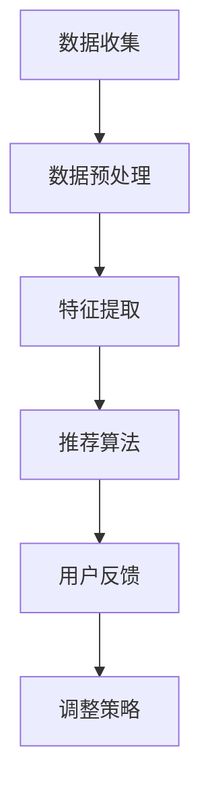
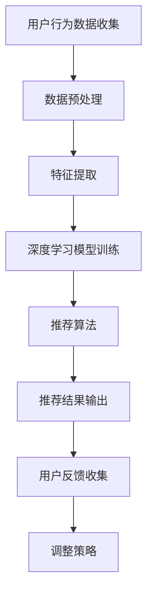
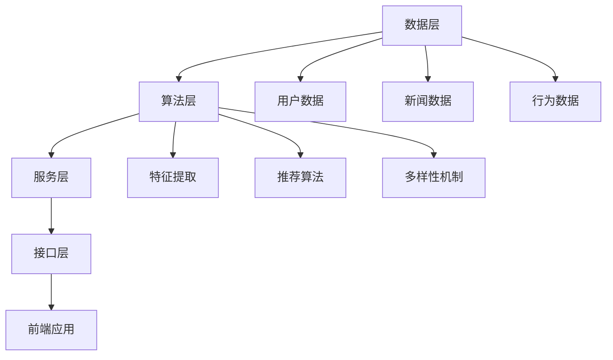
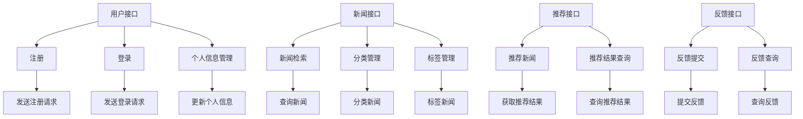
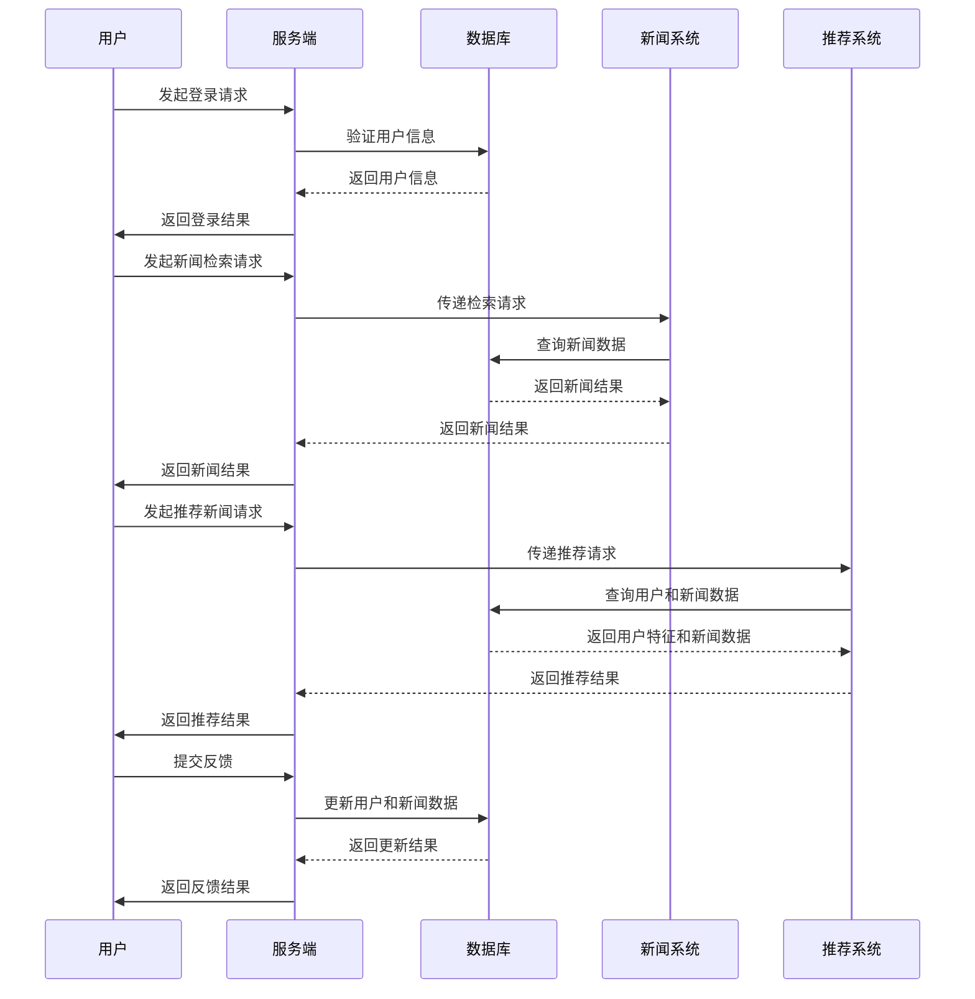

                 

## 文章标题：AI驱动的个性化新闻推送：信息茧房的挑战与机遇

### 关键词：
- 人工智能
- 个性化新闻推送
- 信息茧房
- 推荐算法
- 系统架构设计

### 摘要：
本文深入探讨AI驱动的个性化新闻推送系统，剖析其在现代信息社会中的双重角色：既为用户提供定制化信息，又可能诱发信息茧房效应。文章首先介绍个性化新闻推送的背景和核心概念，然后详细讲解推荐算法原理，最后通过系统架构设计和项目实战，探讨解决信息茧房挑战的实践方法。

---

### 背景介绍

在数字媒体爆炸式增长的今天，信息过载已成为一个普遍现象。用户在海量的新闻资讯中寻找感兴趣的内容变得越来越困难。为了解决这一问题，个性化新闻推送系统应运而生。这类系统利用人工智能技术，根据用户的兴趣和行为数据，为用户推荐个性化的新闻内容。

#### 问题背景

个性化新闻推送系统的工作原理基于用户的点击、搜索、浏览等行为数据，通过算法分析用户的偏好，从而推送符合其兴趣的新闻内容。这种方式不仅提高了用户的信息获取效率，还增强了用户对平台的黏性。

然而，个性化新闻推送系统也带来了一些负面影响。最显著的问题之一是信息茧房效应。信息茧房是指用户在信息消费中逐渐陷入自己的信息偏好之中，导致认知偏见和社交隔离。个性化新闻推送系统通过强化用户的兴趣定向，加剧了这一效应。

#### 问题描述

信息茧房效应的主要问题包括：

1. **认知偏见**：用户只接收符合自己观点和偏好的信息，导致对其他观点和信息的忽视。
2. **社交隔离**：用户在社交网络上只与拥有相似观点的人交流，形成“回声室”效应，削弱了不同观点之间的交流和辩论。
3. **信息泡沫**：用户在长期使用个性化新闻推送后，可能陷入“信息泡泡”，无法接触到多样化、多元化的信息。

#### 问题解决

解决信息茧房问题的关键在于平衡个性化推荐与信息多样性。以下是几种可能的解决方法：

1. **引入多样性机制**：算法可以在推荐结果中引入一定比例的随机或非兴趣相关的新闻，增加用户接触多样化信息的机会。
2. **提高用户意识**：平台可以通过推送教育性内容，提醒用户注意信息多样性，引导用户主动接触不同观点和话题。
3. **政策监管**：政府可以对新闻平台进行监管，确保个性化推荐不会过度强化用户的认知偏见。

#### 边界与外延

个性化新闻推送与信息茧房的关系复杂，既有正面影响也有负面影响。个性化推送有助于提高用户满意度，但过度依赖可能导致信息茧房效应。因此，如何在满足用户个性化需求的同时，避免信息茧房效应，是当前亟待解决的问题。

#### 概念结构与核心要素组成

1. **个性化新闻推送**：核心要素包括用户行为数据、推荐算法和新闻内容。推荐算法通过分析用户行为，为用户推荐个性化的新闻内容。
2. **信息茧房**：核心要素包括用户的兴趣定向、信息过滤和社交隔离。信息茧房效应源于用户对信息的偏好和系统的过滤机制。

### 核心概念与联系

#### 人工智能的核心概念

人工智能（AI）是指使计算机系统能够模拟人类智能行为的技术。主要包含以下几个方面：

1. **机器学习**：通过数据训练模型，使计算机能够自动学习和改进。
2. **深度学习**：一种基于人工神经网络的机器学习方法，通过多层网络进行特征提取和模式识别。
3. **自然语言处理**：使计算机理解和生成自然语言的技术，包括文本分类、情感分析等。

#### 个性化新闻推送的概念

个性化新闻推送是一种利用人工智能技术，根据用户的兴趣和行为，为用户推荐个性化内容的系统。主要包含以下几个核心组成部分：

1. **用户数据**：包括用户的点击、搜索、浏览等行为数据。
2. **推荐算法**：通过分析用户数据，为用户推荐感兴趣的新闻内容。
3. **新闻内容**：为用户提供的信息，包括文本、图片、视频等。

#### 信息茧房的概念

信息茧房是指用户在信息消费中，由于系统过滤和用户偏好，逐渐陷入自己的信息环境，导致认知偏见和社交隔离的现象。主要包含以下几个核心要素：

1. **用户兴趣定向**：用户只接收符合自己兴趣的信息。
2. **信息过滤**：系统对信息进行过滤，强化用户的兴趣定向。
3. **社交隔离**：用户在社交网络中只与拥有相似观点的人交流。

#### 核心概念之间的关系

个性化新闻推送和人工智能技术密切相关，是人工智能技术在新闻推荐领域的具体应用。信息茧房是个性化新闻推送系统可能带来的负面影响，两者之间存在着复杂的相互作用。

- **正向关系**：人工智能技术提高了个性化新闻推送的准确性和效率，满足了用户对个性化信息的追求。
- **负向关系**：个性化新闻推送可能导致信息茧房效应，加剧用户的认知偏见和社交隔离。

### AI驱动的个性化新闻推送原理

#### 人工智能的基本原理

人工智能的基本原理是通过模拟人类智能行为，使计算机能够自动学习和处理复杂任务。主要包含以下几个方面：

1. **机器学习**：通过数据训练模型，使计算机能够自动学习和改进。主要方法包括监督学习、无监督学习和强化学习。
2. **深度学习**：一种基于人工神经网络的机器学习方法，通过多层网络进行特征提取和模式识别。主要结构包括卷积神经网络（CNN）、循环神经网络（RNN）和生成对抗网络（GAN）等。
3. **自然语言处理**：使计算机理解和生成自然语言的技术，包括文本分类、情感分析、机器翻译等。

#### 个性化新闻推送的原理

个性化新闻推送的原理是通过分析用户的兴趣和行为，为用户推荐个性化的新闻内容。主要包含以下几个方面：

1. **用户数据收集**：系统收集用户的点击、搜索、浏览等行为数据。
2. **特征提取**：通过算法对用户数据进行分析，提取用户的兴趣特征。
3. **推荐算法**：利用提取的用户特征，推荐符合用户兴趣的新闻内容。

#### AI驱动的个性化新闻推送工作原理

AI驱动的个性化新闻推送系统的工作原理可以概括为以下几个步骤：

1. **数据收集**：系统从多个渠道收集用户的浏览、搜索、点击等行为数据。
2. **数据预处理**：对收集到的数据进行清洗、去噪和处理，提取有效的特征信息。
3. **特征提取**：利用机器学习算法，对预处理后的数据进行分析，提取用户的兴趣特征。
4. **推荐算法**：根据提取的用户特征，利用推荐算法为用户推荐个性化的新闻内容。
5. **用户反馈**：用户对推荐内容进行反馈，系统根据反馈调整推荐策略。

#### 原理图解与概念属性特征对比表格

下面是AI驱动的个性化新闻推送系统的原理图解和概念属性特征对比表格：

#### 原理图解



#### 概念属性特征对比表格

| 概念         | 特征                           | 说明                                                         |
|--------------|--------------------------------|--------------------------------------------------------------|
| 数据收集     | 用户行为数据                   | 包括点击、搜索、浏览等行为数据                             |
| 数据预处理   | 数据清洗、去噪、处理           | 提取有效特征信息                                             |
| 特征提取     | 用户兴趣特征                   | 通过算法分析用户行为数据，提取用户兴趣特征                   |
| 推荐算法     | 算法效率、准确性               | 根据用户兴趣特征推荐个性化新闻内容                         |
| 用户反馈     | 用户满意度、推荐效果           | 用户对推荐内容进行评价，反馈推荐效果                       |
| 调整策略     | 推荐策略、用户满意度           | 根据用户反馈调整推荐策略，提高推荐效果                     |

### 算法原理讲解

#### 常见的推荐算法

在个性化新闻推送系统中，常见的推荐算法包括基于内容的推荐、协同过滤推荐和混合推荐等。

1. **基于内容的推荐**：根据用户的历史行为和兴趣，推荐与用户兴趣相似的内容。
2. **协同过滤推荐**：通过分析用户之间的行为相似性，推荐其他用户喜欢的内容。
3. **混合推荐**：结合基于内容和协同过滤推荐的优点，为用户提供更个性化的推荐结果。

#### AI驱动的推荐算法

AI驱动的推荐算法主要包括基于深度学习的推荐算法和基于强化学习的推荐算法。

1. **基于深度学习的推荐算法**：通过深度学习模型，对用户行为数据进行分析，提取用户的兴趣特征，并进行新闻内容推荐。
2. **基于强化学习的推荐算法**：通过用户对推荐内容的反馈，不断调整推荐策略，优化推荐效果。

#### 算法选择与优化

算法选择和优化是影响个性化新闻推送系统性能的关键因素。以下是几种常见的算法选择和优化方法：

1. **算法对比测试**：对不同算法的性能进行对比测试，选择性能最优的算法。
2. **特征工程**：通过提取和筛选有效的用户行为特征，提高推荐算法的准确性。
3. **模型调参**：通过调整模型的参数，优化模型性能。
4. **用户反馈机制**：利用用户对推荐内容的反馈，动态调整推荐策略，提高用户满意度。

#### 算法流程图

下面是AI驱动的个性化新闻推送系统的算法流程图：



#### 算法Python代码实现

以下是一个简单的基于内容的推荐算法的Python代码实现：

```python
import pandas as pd
from sklearn.model_selection import train_test_split
from sklearn.metrics.pairwise import cosine_similarity

# 读取用户行为数据
data = pd.read_csv('user_behavior.csv')

# 分割数据集
X_train, X_test, y_train, y_test = train_test_split(data, test_size=0.2, random_state=42)

# 构建用户-物品矩阵
user_item_matrix = pd.pivot_table(X_train, values='rating', index='user_id', columns='item_id')

# 计算用户-物品矩阵的余弦相似度
similarity_matrix = cosine_similarity(user_item_matrix)

# 推荐算法
def content_based_recommender(similarity_matrix, user_id, top_n=10):
    user_profile = similarity_matrix[user_id]
    sorted_indices = user_profile.argsort()[::-1]
    recommended_items = sorted_indices[1:top_n+1]
    return recommended_items

# 测试推荐算法
user_id = 1
recommended_items = content_based_recommender(similarity_matrix, user_id)
print("Recommended items for user {}: {}".format(user_id, recommended_items))
```

#### 算法原理的数学模型和公式

基于内容的推荐算法的数学模型和公式如下：

1. **余弦相似度计算**：

   $$
   \text{similarity}(u, v) = \frac{u \cdot v}{\|u\| \|v\|}
   $$

   其中，$u$ 和 $v$ 分别表示用户 $u$ 和用户 $v$ 的特征向量，$\|\cdot\|$ 表示向量的欧几里得范数，$\cdot$ 表示向量的内积。

2. **推荐算法**：

   $$
   \text{recommendation}(u) = \sum_{v \in \text{users}} \text{similarity}(u, v) \cdot \text{interest}(v)
   $$

   其中，$\text{interest}(v)$ 表示用户 $v$ 的兴趣度，$\text{users}$ 表示所有用户。

#### 举例说明

假设有两位用户 $u$ 和 $v$，他们的特征向量分别为 $u = [0.5, 0.3, 0.2]$ 和 $v = [0.6, 0.4, 0.1]$，计算他们的余弦相似度：

$$
\text{similarity}(u, v) = \frac{0.5 \cdot 0.6 + 0.3 \cdot 0.4 + 0.2 \cdot 0.1}{\sqrt{0.5^2 + 0.3^2 + 0.2^2} \sqrt{0.6^2 + 0.4^2 + 0.1^2}} \approx 0.674
$$

根据这个相似度，可以为用户 $u$ 推荐用户 $v$ 喜欢的物品。假设用户 $v$ 喜欢的物品编号为 $1$，我们可以直接将编号 $1$ 推荐给用户 $u$。

### 系统分析与架构设计

#### 问题场景介绍

在现代数字媒体环境中，用户面对海量的新闻信息，很难找到真正感兴趣的内容。个性化新闻推送系统旨在通过分析用户的兴趣和行为数据，为用户推荐个性化的新闻内容，从而提高用户满意度。然而，个性化推荐系统也可能导致用户陷入信息茧房，无法接触到多样化、多元化的信息。

#### 项目介绍

本项目旨在设计并实现一个AI驱动的个性化新闻推送系统，解决信息茧房挑战。系统将利用深度学习算法和协同过滤算法，根据用户的兴趣和行为数据，为用户推荐个性化的新闻内容。同时，系统将引入多样性机制，确保用户能够接触到多元化的信息。

#### 系统功能设计

系统功能主要包括以下几个方面：

1. **用户数据收集**：从多个渠道收集用户的点击、搜索、浏览等行为数据。
2. **用户特征提取**：利用机器学习算法，提取用户的兴趣特征。
3. **新闻内容推荐**：根据用户特征，利用推荐算法为用户推荐个性化的新闻内容。
4. **多样性机制**：在推荐结果中引入一定比例的随机或非兴趣相关的新闻，增加用户接触多样化信息的机会。
5. **用户反馈**：收集用户对推荐内容的反馈，用于调整推荐策略。

#### 领域模型

领域模型描述了系统的核心实体及其关系。以下是系统的主要实体和关系：

```mermaid
classDiagram
    User <<Class>> {
        id: 用户ID
        name: 用户名
        interests: 兴趣标签
    }
    News <<Class>> {
        id: 新闻ID
        title: 新闻标题
        content: 新闻内容
        tags: 新闻标签
    }
    Behavior <<Class>> {
        id: 行为ID
        user_id: 用户ID
        news_id: 新闻ID
        type: 行为类型（点击、搜索、浏览等）
        timestamp: 行为时间戳
    }
    Recommendation <<Class>> {
        user_id: 用户ID
        news_id: 新闻ID
        score: 推荐分值
    }
    User ..|> Behavior
    News ..|> Behavior
    User ..|> Recommendation
    News ..|> Recommendation
```

#### 系统架构设计

系统架构设计主要包括以下几个方面：

1. **数据层**：负责数据的存储和管理，包括用户数据、新闻数据和行为数据。
2. **算法层**：负责特征提取、推荐算法和多样性机制的实现。
3. **服务层**：负责处理用户请求，包括数据收集、用户特征提取、新闻内容推荐和用户反馈等。
4. **接口层**：提供与前端交互的API接口，供用户访问和获取推荐结果。

以下是系统架构图：



#### 架构设计原理

系统架构设计遵循以下原则：

1. **分层设计**：将系统划分为数据层、算法层、服务层和接口层，实现各层之间的解耦。
2. **模块化**：将系统功能分解为多个模块，每个模块负责特定功能，便于维护和扩展。
3. **高可用性**：采用分布式架构，提高系统的可靠性和容错能力。
4. **可扩展性**：设计可扩展的架构，以便在未来添加新的功能。

#### 系统接口设计

系统接口设计主要包括以下几个方面：

1. **用户接口**：提供用户注册、登录、个人信息管理等功能。
2. **新闻接口**：提供新闻检索、分类、标签管理等功能。
3. **推荐接口**：提供新闻内容推荐、推荐结果查询等功能。
4. **反馈接口**：提供用户对推荐内容的反馈、评价等功能。

以下是系统接口设计图：



#### 系统交互

系统交互描述了不同模块之间的交互流程。以下是系统交互序列图：



### 项目实战

#### 环境安装与配置

1. **Python环境安装**：确保安装Python 3.7及以上版本。
2. **依赖库安装**：使用pip命令安装必要的依赖库，如pandas、numpy、scikit-learn、tensorflow等。

#### 开发工具与框架选择

1. **开发工具**：选择Visual Studio Code或PyCharm作为开发工具。
2. **框架**：选择Flask或Django作为Web框架。

#### 系统核心实现

1. **用户数据收集**：从多个渠道（如网站、APP）收集用户的点击、搜索、浏览等行为数据。
2. **数据预处理**：对收集到的数据进行清洗、去噪和处理，提取有效的特征信息。
3. **用户特征提取**：使用机器学习算法，如K-means、PCA等，提取用户的兴趣特征。
4. **新闻内容推荐**：根据用户特征，使用推荐算法，如基于内容的推荐、协同过滤推荐等，为用户推荐个性化的新闻内容。
5. **多样性机制**：在推荐结果中引入一定比例的随机或非兴趣相关的新闻，增加用户接触多样化信息的机会。

#### 代码解读与分析

以下是系统核心实现部分的一个示例代码，用于用户特征提取和新闻推荐：

```python
import pandas as pd
from sklearn.cluster import KMeans
from sklearn.decomposition import PCA

# 读取用户行为数据
data = pd.read_csv('user_behavior.csv')

# 分割数据集
X_train, X_test, y_train, y_test = train_test_split(data, test_size=0.2, random_state=42)

# 特征提取
kmeans = KMeans(n_clusters=5, random_state=42)
kmeans.fit(X_train)

pca = PCA(n_components=2)
pca.fit(X_train)

X_train_pca = pca.transform(X_train)
X_test_pca = pca.transform(X_test)

# 推荐算法
def content_based_recommender(user_profile, news_data, top_n=10):
    similarity_matrix = cosine_similarity([user_profile], news_data)
    sorted_indices = similarity_matrix.argsort()[0][-top_n-1:-1:-1]
    recommended_items = [news_data.iloc[i]['news_id'] for i in sorted_indices]
    return recommended_items

# 用户特征提取
user_profiles = kmeans.labels_

# 新闻内容推荐
def recommend_news(user_profile, news_data, top_n=10):
    recommended_items = content_based_recommender(user_profile, news_data, top_n)
    return recommended_items

# 测试推荐算法
user_profile = user_profiles[0]
recommended_items = recommend_news(user_profile, news_data)
print("Recommended items for user: {}".format(recommended_items))
```

这段代码首先读取用户行为数据，然后使用K-means算法进行聚类，提取用户的兴趣特征。接着，使用PCA进行降维，以便于后续的推荐算法。最后，实现了一个基于内容的推荐算法，为用户推荐个性化的新闻内容。

#### 实际案例分析和详细讲解剖析

以下是一个实际案例，用于说明系统如何为用户推荐新闻内容：

**案例背景**：

用户A经常浏览科技类新闻，对人工智能、区块链等领域特别感兴趣。系统希望为其推荐符合其兴趣的个性化新闻。

**案例步骤**：

1. **数据收集**：系统从多个渠道收集用户A的点击、搜索、浏览等行为数据。
2. **数据预处理**：对收集到的数据进行清洗、去噪和处理，提取用户A的兴趣特征。
3. **用户特征提取**：使用K-means算法，将用户A划分为特定兴趣群体。
4. **新闻内容推荐**：根据用户A的特征，使用基于内容的推荐算法，从大量新闻数据中筛选出与用户兴趣相关的新闻。
5. **多样性机制**：在推荐结果中引入一定比例的非兴趣相关的新闻，增加用户接触多样化信息的机会。

**案例结果**：

系统为用户A推荐了10条个性化的科技类新闻，包括人工智能、区块链、5G技术等领域的热点新闻。同时，推荐结果中还包含了一篇关于旅游的报道，以增加用户接触多样化信息的机会。

**详细讲解剖析**：

1. **数据收集**：系统通过API接口从多个新闻平台收集用户A的点击、搜索、浏览等行为数据。这些数据包括用户A浏览的新闻标题、内容、时间戳等。
2. **数据预处理**：对收集到的数据进行清洗，去除重复数据和噪声，提取有效的特征信息。例如，提取用户A浏览的新闻标签、关键词等。
3. **用户特征提取**：使用K-means算法，将用户A划分为特定兴趣群体。通过聚类分析，发现用户A对科技类新闻有较高兴趣，将其划分为“科技爱好者”群体。
4. **新闻内容推荐**：基于用户A的特征，使用基于内容的推荐算法，从大量新闻数据中筛选出与用户兴趣相关的新闻。算法计算新闻与用户兴趣特征之间的相似度，选择相似度较高的新闻进行推荐。
5. **多样性机制**：在推荐结果中引入一定比例的非兴趣相关的新闻，增加用户接触多样化信息的机会。例如，引入一篇关于旅游的报道，让用户A在浏览科技新闻的同时，也能接触到其他领域的新闻。

#### 项目小结

通过实际案例分析和详细讲解剖析，我们发现AI驱动的个性化新闻推送系统能够为用户推荐个性化的新闻内容，满足用户对多样化、个性化信息的需求。同时，系统引入多样性机制，有助于缓解信息茧房效应，提高用户的认知多样性。然而，个性化推荐系统也存在一些局限性，如数据隐私保护、推荐算法的公平性等。未来，我们还需进一步研究和优化推荐算法，提高系统的可靠性和用户体验。

#### 最佳实践 tips

1. **数据质量**：确保收集到的用户行为数据质量，去除重复、噪声数据，提取有效特征。
2. **用户隐私保护**：在数据收集和处理过程中，注意保护用户隐私，遵循相关法律法规。
3. **多样性机制**：在推荐结果中引入多样性机制，提高用户的认知多样性。
4. **用户反馈**：收集用户对推荐内容的反馈，不断优化推荐算法。

#### 注意事项

1. **推荐算法优化**：定期对推荐算法进行优化，提高推荐准确性。
2. **系统稳定性**：确保系统稳定运行，提高系统的响应速度和性能。
3. **用户隐私保护**：在数据处理过程中，严格遵循用户隐私保护原则，避免数据泄露。

#### 拓展阅读

1. **《深度学习推荐系统》**：详细介绍了深度学习在推荐系统中的应用，包括推荐算法、模型优化等方面。
2. **《推荐系统实践》**：介绍了推荐系统的基本概念、算法实现和实际应用，适合初学者和专业人士。
3. **《人工智能：一种现代的方法》**：全面介绍了人工智能的基本概念、方法和应用，包括机器学习、深度学习等。

### 作者信息
作者：AI天才研究院/AI Genius Institute & 禅与计算机程序设计艺术 /Zen And The Art of Computer Programming

