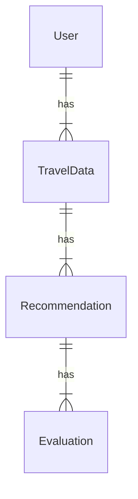
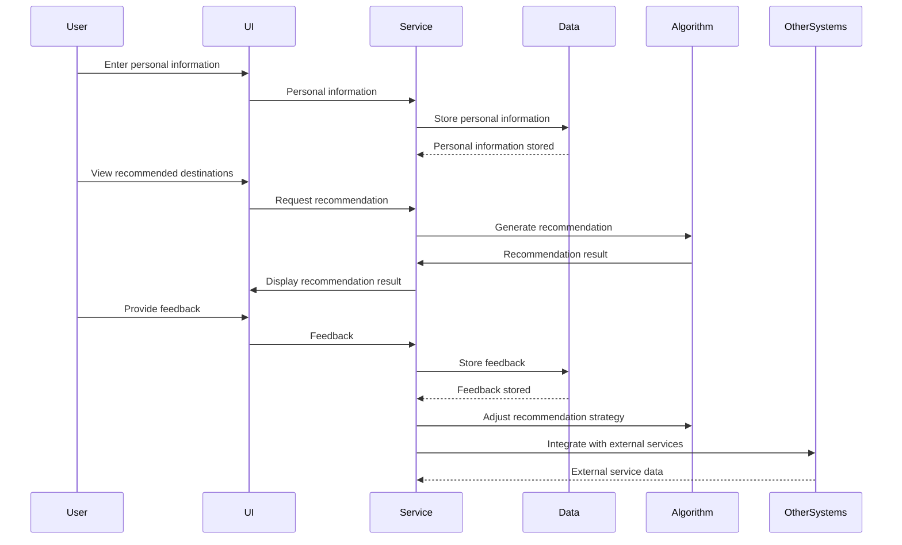

                 

# AI驱动的个性化旅游推荐系统

## 关键词

- AI
- 个性化推荐
- 旅游行业
- 机器学习
- 深度学习
- 强化学习

## 摘要

本文将探讨如何利用人工智能技术构建一个个性化的旅游推荐系统。首先，我们回顾了旅游行业的发展现状和个性化旅游推荐的意义。接着，详细描述了个性化旅游推荐的目标、挑战以及AI在其中的应用。随后，我们深入分析了用户画像、旅游数据集、推荐算法和推荐系统评估这四个核心概念。通过机器学习算法的讲解，包括协同过滤算法、基于内容的推荐算法和机器学习算法的比较与选择，我们展示了如何将算法应用于旅游推荐系统。最后，通过一个实际案例的分析，我们探讨了系统架构设计、环境安装、核心实现源代码以及项目小结等内容。本文旨在为从事旅游推荐系统开发的技术人员提供有价值的参考和指导。

## 第一部分：引言与背景

### 第1章 AI驱动的个性化旅游推荐系统概述

### 1.1 问题背景

#### 1.1.1 旅游行业现状

随着经济的不断发展和人民生活水平的提高，旅游行业呈现出快速增长的趋势。据统计，全球旅游市场规模已超过数万亿美元，且仍在不断扩大。旅游需求的多样化也日益显著，游客不再满足于传统的旅游形式，他们追求更加个性化和差异化的旅游体验。

#### 1.1.2 个性化旅游推荐的意义

个性化旅游推荐能够提高旅游体验，满足游客的个性化需求，从而提升旅游满意度。同时，它还可以优化旅游资源的配置，提高旅游企业的运营效率，提升竞争力。此外，个性化旅游推荐还能够为旅游行业带来新的商业机会，推动行业创新和发展。

### 1.1.3 个性化旅游推荐的目标

个性化旅游推荐的目标是理解用户需求，为其提供个性化的旅游信息和建议。具体来说，包括以下方面：

- **用户需求理解**：通过分析用户的历史行为、兴趣偏好等数据，准确捕捉用户的旅游需求。
- **旅游信息个性化匹配**：根据用户的需求，从庞大的旅游信息库中筛选出与之最匹配的旅游目的地、活动、攻略等信息。

### 1.1.4 个性化旅游推荐面临的挑战

个性化旅游推荐面临以下几个挑战：

- **数据多样性**：旅游数据包括用户数据、目的地数据、活动数据等，这些数据类型多样，且规模庞大，如何有效整合和处理这些数据是一个挑战。
- **用户行为复杂性**：用户行为具有多样性和复杂性，需要深入分析用户行为模式，才能准确捕捉用户需求。
- **系统实时性要求**：个性化旅游推荐系统需要能够实时响应用户需求，提供个性化的旅游信息。

### 1.1.5 问题解决

为了解决上述问题，我们可以借助人工智能技术，特别是机器学习、深度学习和强化学习算法，来构建一个高效的个性化旅游推荐系统。

- **机器学习算法**：可以用于用户行为分析和旅游信息匹配，例如协同过滤算法、基于内容的推荐算法等。
- **深度学习算法**：可以用于构建复杂的多层神经网络模型，以更好地捕捉用户行为和旅游信息之间的非线性关系。
- **强化学习算法**：可以用于优化推荐策略，通过不断学习和调整推荐策略，提高推荐系统的效果。

### 1.1.6 边界与外延

个性化旅游推荐系统的边界包括旅游信息来源、用户数据收集与处理、推荐算法实现与优化等方面。而其外延则涉及旅游目的地推荐、旅游活动推荐和旅游攻略推荐等。

- **旅游信息来源**：包括旅游网站、社交媒体、旅游应用程序等，这些平台提供了丰富的旅游信息数据。
- **用户数据收集与处理**：需要收集用户行为数据、兴趣偏好数据等，并通过数据清洗、数据预处理等技术手段进行处理。
- **推荐算法实现与优化**：根据业务需求和技术条件，选择合适的推荐算法，并进行算法参数调优和系统优化。

### 1.1.7 概念结构与核心要素组成

个性化旅游推荐系统的概念结构主要包括用户画像、旅游数据集、推荐算法和推荐系统评估四个核心要素。

- **用户画像**：是对用户兴趣、行为、偏好等特征的抽象和描述，用于理解用户需求。
- **旅游数据集**：包括用户数据、目的地数据、活动数据等，用于训练和评估推荐算法。
- **推荐算法**：用于从旅游数据集中提取信息，为用户生成个性化的推荐列表。
- **推荐系统评估**：用于评估推荐系统的效果，包括准确率、召回率、覆盖率等指标。

### 1.1.8 本章小结

本章介绍了AI驱动的个性化旅游推荐系统的背景和意义，分析了个性化旅游推荐的目标、挑战和解决方案，并阐述了个性化旅游推荐系统的边界和外延以及概念结构与核心要素组成。接下来，我们将进一步深入探讨个性化旅游推荐系统的核心概念与联系。

----------------------------------------------------------------

## 第二部分：核心概念与联系

### 第2章 核心概念与联系

### 2.1 个性化旅游推荐系统的核心概念

#### 2.1.1 用户画像

**定义**：用户画像是对用户在互联网上的各种行为数据、社会属性数据、兴趣偏好数据等进行的综合分析，形成对用户的全方位了解和刻画。

**特点**：

1. **多样性**：用户画像可以涵盖用户的各种特征，如性别、年龄、职业、教育背景、兴趣爱好、消费习惯等。
2. **动态性**：用户行为和偏好是动态变化的，需要定期更新用户画像。
3. **复杂性**：用户画像涉及多种数据类型，包括结构化数据、半结构化数据和非结构化数据。

**类型**：

1. **基础用户画像**：包括用户的基本信息，如性别、年龄、职业等。
2. **行为用户画像**：包括用户的在线行为数据，如浏览记录、购买记录、搜索历史等。
3. **兴趣用户画像**：包括用户的兴趣爱好数据，如喜欢阅读的书籍、观看的电影、喜欢的音乐等。

#### 2.1.2 旅游数据集

**定义**：旅游数据集是用于构建个性化旅游推荐系统的基础数据集，包括用户数据、目的地数据、活动数据等。

**来源**：

1. **在线旅游平台**：如携程、去哪儿、飞猪等，提供丰富的用户行为数据、目的地数据和活动数据。
2. **社交媒体**：如微博、微信、抖音等，提供用户发布的内容、评论、互动等数据。
3. **政府数据**：如旅游统计数据、旅游资源数据等，提供权威的旅游信息数据。

**处理**：

1. **数据清洗**：去除重复、错误、无关的数据，确保数据质量。
2. **数据整合**：将来自不同来源的数据进行整合，形成一个统一的数据集。
3. **数据预处理**：对数据集进行格式化、归一化、缺失值处理等操作，为后续分析做准备。

#### 2.1.3 推荐算法

**定义**：推荐算法是基于用户画像和旅游数据集，从海量旅游信息中为用户生成个性化推荐列表的一类算法。

**类型**：

1. **协同过滤算法**：基于用户历史行为数据，通过计算用户之间的相似度，为用户推荐相似用户喜欢的旅游信息。
2. **基于内容的推荐算法**：基于旅游信息的属性特征，为用户推荐与用户兴趣相匹配的旅游信息。
3. **混合推荐算法**：结合协同过滤和基于内容的推荐算法，提高推荐效果。

**选择**：

选择推荐算法时，需要考虑以下几个方面：

1. **数据量**：对于大规模用户数据，协同过滤算法可能更为适用；对于特征丰富、结构化的旅游数据，基于内容的推荐算法可能更有效。
2. **实时性**：对于需要实时推荐的场景，如移动应用，需要选择计算效率高的推荐算法。
3. **效果**：通过实验和评估，选择能够取得最佳效果的推荐算法。

#### 2.1.4 推荐系统评估

**定义**：推荐系统评估是对推荐系统效果进行测量和评估的过程，通过评估指标来衡量推荐系统的性能。

**指标**：

1. **准确率**：推荐结果中实际感兴趣的项目数与推荐结果总数之比，反映了推荐系统的精确度。
2. **召回率**：推荐结果中实际感兴趣的项目数与所有感兴趣项目总数之比，反映了推荐系统的全面性。
3. **覆盖率**：推荐结果中实际推荐的项目数与所有可能推荐项目总数之比，反映了推荐系统的多样性。

**方法**：

1. **离线评估**：在数据集上通过离线计算评估指标，如准确率、召回率等。
2. **在线评估**：在真实用户使用场景下，通过在线实时评估推荐系统的效果。

### 2.2 概念属性特征对比表格

| 概念 | 特征 | 说明 |
| --- | --- | --- |
| 用户画像 | 多样性、动态性、复杂性 | 用户画像涵盖了多种数据类型，具有动态性和复杂性 |
| 旅游数据集 | 来源多样、数据量大、结构化 | 旅游数据集来自多个来源，数据量大且结构化 |
| 推荐算法 | 类型多样、实时性、效果 | 推荐算法有多种类型，需要考虑实时性和效果 |
| 推荐系统评估 | 准确率、召回率、覆盖率 | 推荐系统评估通过多个指标衡量性能 |

### 2.3 ER实体关系图架构

下面是个性化旅游推荐系统的ER实体关系图：



### 2.4 核心概念之间的联系

**用户画像与旅游数据集的关系**：

用户画像通过对用户行为数据的分析和处理，形成对用户的全面了解。这些用户数据来源于旅游数据集，因此用户画像与旅游数据集之间存在紧密的联系。

**用户画像与推荐算法的关系**：

用户画像为推荐算法提供了重要的输入，包括用户的历史行为、兴趣偏好等数据。推荐算法根据用户画像生成个性化的推荐结果，因此用户画像与推荐算法之间存在直接的关联。

**旅游数据集与推荐算法的关系**：

旅游数据集是推荐算法的数据来源，推荐算法通过对旅游数据集的分析和处理，提取用户感兴趣的信息，生成个性化的推荐列表。因此，旅游数据集与推荐算法之间存在密切的关系。

### 2.5 本章小结

本章介绍了个性化旅游推荐系统的核心概念，包括用户画像、旅游数据集、推荐算法和推荐系统评估。通过对这些核心概念的分析和联系，我们可以更好地理解个性化旅游推荐系统的构建和运行机制。接下来，我们将深入探讨个性化旅游推荐系统的算法原理。

----------------------------------------------------------------

## 第三部分：算法原理讲解

### 第3章 算法原理讲解

### 3.1 机器学习算法

#### 3.1.1 机器学习算法的基本原理

机器学习算法是人工智能领域的一个重要分支，其核心思想是通过学习已有数据来预测新数据的模式。机器学习算法的基本原理包括以下几个步骤：

1. **数据收集**：首先，我们需要收集大量的数据，这些数据可以是用户行为数据、旅游信息数据等。
2. **数据预处理**：对收集到的数据进行清洗、格式化、缺失值处理等操作，确保数据质量。
3. **特征工程**：从数据中提取有用的特征，这些特征可以用来训练模型。
4. **模型训练**：使用训练数据集训练模型，模型会学习数据的特征和模式。
5. **模型评估**：使用测试数据集评估模型的性能，调整模型参数，优化模型效果。
6. **模型应用**：将训练好的模型应用于新数据，进行预测或决策。

#### 3.1.2 机器学习算法在个性化旅游推荐中的应用

在个性化旅游推荐系统中，机器学习算法广泛应用于用户行为分析、旅游信息匹配和推荐策略优化等方面。以下是几种常见的机器学习算法及其在个性化旅游推荐中的应用：

1. **协同过滤算法**：

   **原理**：协同过滤算法通过分析用户之间的相似度，将其他用户喜欢的旅游信息推荐给当前用户。协同过滤算法可以分为基于用户的协同过滤算法和基于物品的协同过滤算法。

   **应用**：基于用户的协同过滤算法可以通过计算用户之间的相似度，为用户推荐与其兴趣相似的其他用户喜欢的旅游信息；基于物品的协同过滤算法则可以通过计算旅游信息之间的相似度，为用户推荐与其已访问或喜欢的旅游信息相似的其他旅游信息。

2. **基于内容的推荐算法**：

   **原理**：基于内容的推荐算法通过分析旅游信息的属性特征，为用户推荐与用户兴趣相匹配的旅游信息。通常，旅游信息的属性特征包括目的地类型、活动类型、价格区间、游客评价等。

   **应用**：基于内容的推荐算法可以通过分析用户的历史行为数据，提取用户兴趣特征，然后根据这些特征为用户推荐具有相似属性的旅游信息。

3. **混合推荐算法**：

   **原理**：混合推荐算法结合了协同过滤算法和基于内容的推荐算法，通过综合利用用户行为数据和旅游信息属性特征，提高推荐效果。

   **应用**：混合推荐算法可以同时考虑用户之间的相似性和旅游信息的相似性，为用户生成更准确的个性化推荐。

#### 3.1.3 案例分析：基于机器学习的旅游推荐系统

**案例背景**：

某在线旅游平台希望通过引入机器学习算法，构建一个个性化的旅游推荐系统，以提高用户满意度和平台竞争力。

**模型设计与实现**：

1. **用户画像构建**：通过分析用户的历史行为数据，包括浏览记录、搜索历史、购买记录等，构建用户的兴趣偏好特征。
2. **旅游数据预处理**：对旅游数据集进行清洗、格式化、缺失值处理等操作，提取旅游信息的属性特征，如目的地类型、活动类型、价格区间等。
3. **推荐算法选择**：结合用户画像和旅游数据集的特点，选择基于内容的推荐算法和混合推荐算法，实现个性化旅游推荐。
4. **模型训练与评估**：使用训练数据集训练推荐模型，使用测试数据集评估模型性能，调整模型参数，优化推荐效果。

**模型实现**：

```python
import pandas as pd
from sklearn.model_selection import train_test_split
from sklearn.feature_extraction.text import TfidfVectorizer
from sklearn.metrics.pairwise import cosine_similarity

# 读取用户行为数据
user_data = pd.read_csv('user_behavior.csv')

# 读取旅游数据
travel_data = pd.read_csv('travel_data.csv')

# 构建用户画像
user_interests = user_data.groupby('user_id')['interest'].agg(' '.join)

# 提取旅游信息属性特征
travel_features = travel_data[['destination_type', 'activity_type', 'price_range']]

# 计算用户与旅游信息的相似度
user_travel_similarity = cosine_similarity(user_interests.values, travel_features.values)

# 根据相似度推荐旅游信息
recommended_travels = travel_data.iloc[user_travel_similarity.argsort()[0][-10:][::-1]]

# 输出推荐结果
print(recommended_travels)
```

### 3.1.4 机器学习算法的比较与选择

在选择机器学习算法时，需要考虑以下几个因素：

1. **数据量**：对于大规模用户数据，协同过滤算法可能更为适用；对于特征丰富、结构化的旅游数据，基于内容的推荐算法可能更有效。
2. **实时性**：对于需要实时推荐的场景，如移动应用，需要选择计算效率高的推荐算法。
3. **效果**：通过实验和评估，选择能够取得最佳效果的推荐算法。

在实际应用中，可以根据具体场景和需求，选择合适的机器学习算法或结合多种算法，构建一个高效的个性化旅游推荐系统。

### 3.1.5 深度学习算法

深度学习算法是机器学习算法的一个重要分支，其核心思想是通过多层神经网络模型，自动提取数据的特征和模式。深度学习算法在个性化旅游推荐系统中具有广泛的应用，如深度神经网络（DNN）、卷积神经网络（CNN）和循环神经网络（RNN）等。

- **深度神经网络（DNN）**：DNN是由多层神经元组成的神经网络，可以通过多层非线性变换，提取数据的深层特征。DNN在个性化旅游推荐系统中可以用于用户画像构建和推荐算法优化。

- **卷积神经网络（CNN）**：CNN是一种专门用于处理图像数据的神经网络，其核心思想是通过卷积操作提取图像的特征。CNN在个性化旅游推荐系统中可以用于处理旅游信息图像数据，提取图像特征，用于推荐算法。

- **循环神经网络（RNN）**：RNN是一种可以处理序列数据的神经网络，其核心思想是通过循环机制，处理序列数据中的先后关系。RNN在个性化旅游推荐系统中可以用于用户行为序列建模，捕捉用户行为模式。

### 3.1.6 强化学习算法

强化学习算法是一种通过试错和反馈机制，学习最优策略的算法。在个性化旅游推荐系统中，强化学习算法可以用于优化推荐策略，提高推荐效果。

- **Q学习算法**：Q学习算法是一种基于值函数的强化学习算法，通过学习状态-动作值函数，选择最优动作。在个性化旅游推荐系统中，Q学习算法可以用于优化推荐策略，提高推荐效果。

- **策略梯度算法**：策略梯度算法是一种直接优化策略的强化学习算法，通过学习策略参数，优化策略。在个性化旅游推荐系统中，策略梯度算法可以用于优化推荐策略，提高推荐效果。

### 3.1.7 深度学习和强化学习在个性化旅游推荐系统中的应用

深度学习和强化学习在个性化旅游推荐系统中具有广泛的应用，可以显著提高推荐效果。

- **深度学习算法**：通过深度神经网络模型，自动提取用户画像和旅游信息的深层特征，提高推荐系统的精确度和多样性。

- **强化学习算法**：通过优化推荐策略，提高推荐效果，使得推荐系统能够更好地满足用户需求。

在实际应用中，可以根据具体场景和需求，结合深度学习和强化学习算法，构建一个高效的个性化旅游推荐系统。

### 3.1.8 本章小结

本章介绍了机器学习算法的基本原理以及在个性化旅游推荐系统中的应用，包括协同过滤算法、基于内容的推荐算法、混合推荐算法等。同时，还介绍了深度学习和强化学习算法在个性化旅游推荐系统中的应用。通过本章的学习，读者可以更好地理解个性化旅游推荐系统的算法原理，并为实际系统开发提供参考。

----------------------------------------------------------------

### 3.1.9 深度学习算法的详细讲解

在个性化旅游推荐系统中，深度学习算法因其强大的特征提取和建模能力而备受关注。本节将详细介绍深度学习算法的基本原理、常见模型以及如何应用于旅游推荐系统。

#### 3.1.9.1 深度学习算法的基本原理

深度学习算法是一种基于人工神经网络的学习方法，通过构建多层神经网络，自动提取数据的特征和模式。其核心思想是通过前向传播和反向传播算法，不断调整网络中的权重，使其能够更好地拟合训练数据。

1. **前向传播**：输入数据经过神经网络中的每个层，通过每个层的非线性变换（如ReLU函数、Sigmoid函数、Tanh函数），逐渐转化为更高层次的抽象特征。
   
   $$ z^{(l)} = \sigma(W^{(l)} \cdot a^{(l-1)} + b^{(l)}) $$

   其中，$z^{(l)}$ 表示第 $l$ 层的输出，$\sigma$ 表示激活函数，$W^{(l)}$ 和 $b^{(l)}$ 分别表示第 $l$ 层的权重和偏置。

2. **反向传播**：通过计算损失函数对权重的梯度，使用梯度下降法或其他优化算法，不断更新网络中的权重，使模型能够更好地拟合训练数据。

   $$ \delta^{(l)}_{ij} = \frac{\partial L}{\partial z^{(l)}_{ij}} $$

   $$ \Delta W^{(l)}_{ij} = -\alpha \cdot \delta^{(l)}_{ij} \cdot a^{(l-1)}_{j} $$

   $$ \Delta b^{(l)}_{ij} = -\alpha \cdot \delta^{(l)}_{ij} $$

   其中，$\delta^{(l)}_{ij}$ 表示第 $l$ 层第 $i$ 个神经元的误差，$\alpha$ 为学习率，$L$ 为损失函数。

#### 3.1.9.2 常见深度学习模型

1. **多层感知机（MLP）**：MLP是一种最基本的深度学习模型，由输入层、隐藏层和输出层组成。MLP可以用于分类和回归任务。

2. **卷积神经网络（CNN）**：CNN是一种专门用于处理图像数据的神经网络，其核心组件是卷积层和池化层。CNN通过卷积操作，可以自动提取图像的特征。

   $$ f(x, y) = \sum_{i, j} w_{ij} \cdot K_{ij}(x, y) + b $$

   其中，$K_{ij}(x, y)$ 表示卷积核，$w_{ij}$ 和 $b$ 分别表示权重和偏置。

3. **循环神经网络（RNN）**：RNN是一种可以处理序列数据的神经网络，其核心组件是隐藏状态和循环连接。RNN通过记忆机制，可以捕捉序列数据中的长期依赖关系。

   $$ h_t = \sigma(W_h \cdot [h_{t-1}, x_t] + b_h) $$

   其中，$h_t$ 表示第 $t$ 个时间步的隐藏状态，$\sigma$ 表示激活函数。

4. **长短时记忆网络（LSTM）**：LSTM是一种改进的RNN模型，通过引入遗忘门、输入门和输出门，可以有效地解决RNN的梯度消失和梯度爆炸问题。LSTM在处理长时间序列数据时表现优异。

   $$ i_t = \sigma(W_i \cdot [h_{t-1}, x_t] + b_i) $$
   $$ f_t = \sigma(W_f \cdot [h_{t-1}, x_t] + b_f) $$
   $$ g_t = \sigma(W_g \cdot [h_{t-1}, x_t] + b_g) $$
   $$ o_t = \sigma(W_o \cdot [h_{t-1}, x_t] + b_o) $$
   $$ h_t = o_t \cdot \sigma(W_h \cdot [g_t \odot h_{t-1}, x_t] + b_h) $$

   其中，$i_t$、$f_t$、$g_t$ 和 $o_t$ 分别表示输入门、遗忘门、输入门和输出门，$\odot$ 表示元素乘积。

5. **生成对抗网络（GAN）**：GAN是一种通过生成器和判别器相互竞争，生成真实数据的深度学习模型。GAN在图像生成、文本生成等领域表现突出。

   $$ G(z) = \mathcal{N}(z \odot \mu_G + \beta_G, \sigma_G^2) $$
   $$ D(x) = \mathcal{N}(x \odot \mu_D + \beta_D, \sigma_D^2) $$
   $$ \min_G \max_D V(D, G) = \mathbb{E}_{x \sim p_{data}(x)}[\log D(x)] + \mathbb{E}_{z \sim p_z(z)}[\log (1 - D(G(z)))] $$

   其中，$G(z)$ 表示生成器的输出，$D(x)$ 表示判别器的输出，$z$ 表示随机噪声。

#### 3.1.9.3 深度学习算法在个性化旅游推荐系统中的应用

在个性化旅游推荐系统中，深度学习算法可以用于以下方面：

1. **用户画像构建**：使用深度神经网络，提取用户的历史行为数据中的特征，构建用户的兴趣偏好模型。

2. **旅游信息特征提取**：使用卷积神经网络，提取旅游信息的图像特征，为基于内容的推荐算法提供输入。

3. **推荐算法优化**：使用循环神经网络或强化学习算法，优化推荐策略，提高推荐效果。

4. **系统实时性提升**：通过模型压缩和加速技术，提高深度学习算法的实时性，满足系统对实时推荐的需求。

### 3.1.9.4 代码示例

以下是一个使用深度学习算法构建个性化旅游推荐系统的简单代码示例：

```python
import tensorflow as tf
from tensorflow.keras.models import Model
from tensorflow.keras.layers import Input, Dense, LSTM, Embedding, Flatten

# 定义输入层
input_layer = Input(shape=(sequence_length,))

# 添加嵌入层
embedding_layer = Embedding(input_dim=vocabulary_size, output_dim=embedding_size)(input_layer)

# 添加循环层
lstm_layer = LSTM(units=128, activation='tanh')(embedding_layer)

# 添加全连接层
output_layer = Dense(units=1, activation='sigmoid')(lstm_layer)

# 构建模型
model = Model(inputs=input_layer, outputs=output_layer)

# 编译模型
model.compile(optimizer='adam', loss='binary_crossentropy', metrics=['accuracy'])

# 训练模型
model.fit(x_train, y_train, batch_size=32, epochs=10, validation_data=(x_val, y_val))

# 评估模型
loss, accuracy = model.evaluate(x_test, y_test)
print(f'Loss: {loss}, Accuracy: {accuracy}')
```

在这个示例中，我们使用循环神经网络（LSTM）来构建用户画像，并对用户兴趣进行预测。

### 3.1.9.5 本章小结

本章详细介绍了深度学习算法的基本原理、常见模型以及如何在个性化旅游推荐系统中应用。通过本章的学习，读者可以更好地理解深度学习算法的工作原理，并为实际系统开发提供技术支持。下一章将讨论强化学习算法在个性化旅游推荐系统中的应用。

----------------------------------------------------------------

### 3.1.10 强化学习算法的详细讲解

强化学习算法是机器学习领域的一个重要分支，它在通过试错和反馈进行决策的过程中，逐步学习最优策略。强化学习算法在个性化旅游推荐系统中的应用尤为显著，可以帮助系统在动态环境中做出更加符合用户需求的推荐。本节将详细讲解强化学习算法的基本原理、常用算法以及其在旅游推荐系统中的应用。

#### 3.1.10.1 强化学习算法的基本原理

强化学习算法的核心概念包括以下几个部分：

1. **代理（Agent）**：进行决策的主体，可以是用户、推荐系统或其他智能体。
2. **环境（Environment）**：代理所处的外部环境，包括用户行为、旅游信息等。
3. **状态（State）**：代理在某一时刻所处的情境，如用户的兴趣偏好、浏览历史等。
4. **动作（Action）**：代理在某一状态下可以选择的行为，如推荐旅游目的地、活动等。
5. **奖励（Reward）**：代理执行动作后获得的正面或负面反馈，用于指导学习过程。

强化学习算法的目标是通过学习，使代理能够在环境中采取最优动作，最大化累积奖励。

强化学习的基本过程可以分为以下几个步骤：

1. **初始状态**：代理随机选择一个状态。
2. **执行动作**：代理根据当前状态选择一个动作。
3. **获得奖励**：代理执行动作后，环境根据动作提供奖励。
4. **更新状态**：代理根据动作的结果更新当前状态。
5. **重复循环**：代理不断重复上述步骤，学习最优策略。

强化学习算法通常使用以下公式来表示：

$$ Q(s, a) = \sum_{s'} P(s'|s, a) \cdot \max_a' Q(s', a') + \gamma $$

其中，$Q(s, a)$ 表示状态 $s$ 下采取动作 $a$ 的期望回报，$P(s'|s, a)$ 表示从状态 $s$ 采取动作 $a$ 转移到状态 $s'$ 的概率，$\gamma$ 是折扣因子，用于调整未来奖励的权重。

#### 3.1.10.2 常用强化学习算法

1. **Q-Learning**：

Q-Learning 是一种值函数方法，通过直接学习状态-动作值函数 $Q(s, a)$ 来确定最优动作。Q-Learning 的更新公式为：

$$ Q(s, a) \leftarrow Q(s, a) + \alpha [r + \gamma \max_{a'} Q(s', a') - Q(s, a)] $$

其中，$\alpha$ 是学习率，$r$ 是即时奖励。

2. **SARSA**：

SARSA（State-Action-Reward-State-Action）是一种策略迭代方法，它同时更新当前的状态-动作值函数。SARSA 的更新公式为：

$$ Q(s, a) \leftarrow Q(s, a) + \alpha [r + \gamma Q(s', a')] - Q(s, a)] $$

3. **Deep Q-Network（DQN）**：

DQN 是一种结合了深度学习与 Q-Learning 的方法，它使用神经网络来近似状态-动作值函数 $Q(s, a)$。DQN 通过经验回放和目标网络来稳定学习过程，避免过度拟合。

4. **Policy Gradient**：

Policy Gradient 是一种直接优化策略的强化学习算法，它通过学习策略参数来最大化累积奖励。Policy Gradient 的目标函数为：

$$ J(\theta) = \sum_{s, a} \pi(\theta)(s, a) \cdot r $$

其中，$\pi(\theta)(s, a)$ 是策略参数 $\theta$ 表示的策略。

5. **Actor-Critic**：

Actor-Critic 是一种结合了策略优化和值函数优化的方法，它包含两个部分：Actor 和 Critic。Actor 根据当前状态生成动作，Critic 评估动作的好坏。

#### 3.1.10.3 强化学习算法在个性化旅游推荐系统中的应用

1. **用户行为预测**：

强化学习算法可以用于预测用户的下一步行为，如浏览下一个旅游目的地或参与一个活动。通过学习用户的历史行为，系统可以更好地理解用户的需求和偏好，从而提供更加个性化的推荐。

2. **推荐策略优化**：

强化学习算法可以帮助系统优化推荐策略，使推荐结果更加符合用户的实际需求。系统可以根据用户的即时反馈，不断调整推荐策略，提高推荐的质量和用户满意度。

3. **旅游活动推荐**：

强化学习算法可以用于为用户提供旅游活动的推荐。系统可以根据用户的历史行为数据和实时反馈，生成个性化的活动推荐，提高用户的参与度和满意度。

#### 3.1.10.4 代码示例

以下是一个简单的强化学习算法在个性化旅游推荐系统中的应用示例：

```python
import numpy as np
import random

# 定义状态空间和动作空间
STATE_SPACE = [(0, 0), (0, 1), (1, 0), (1, 1)]
ACTION_SPACE = ['Go to Beach', 'Go to Mountain', 'Go to City']

# 定义奖励函数
REWARD_FUNCTION = {
    (0, 0): 0,
    (0, 1): -1,
    (1, 0): -1,
    (1, 1): 1
}

# 定义Q表
Q_TABLE = np.zeros((len(STATE_SPACE), len(ACTION_SPACE)))

# 定义参数
ALPHA = 0.1
GAMMA = 0.9

# Q-Learning算法
def QLearning(state, action):
    next_state = random.choice(STATE_SPACE)
    next_action = np.argmax(Q_TABLE[next_state])
    reward = REWARD_FUNCTION[state]
    Q_TABLE[state][action] = Q_TABLE[state][action] + ALPHA * (reward + GAMMA * Q_TABLE[next_state][next_action] - Q_TABLE[state][action])
    return next_state, next_action

# 执行Q-Learning算法
state = random.choice(STATE_SPACE)
action = np.argmax(Q_TABLE[state])

while True:
    next_state, next_action = QLearning(state, action)
    action = next_action
    state = next_state
    print(f"Current State: {state}, Action: {ACTION_SPACE[action]}, Reward: {REWARD_FUNCTION[state]}")

# 输出最终Q表
print(Q_TABLE)
```

在这个示例中，我们使用 Q-Learning 算法来预测用户的下一步行为，并通过奖励函数来更新 Q 表。

#### 3.1.10.5 本章小结

本章详细介绍了强化学习算法的基本原理、常用算法以及在个性化旅游推荐系统中的应用。通过本章的学习，读者可以更好地理解强化学习算法的工作机制，并为实际系统开发提供技术支持。下一章将探讨深度学习和强化学习算法在实际应用中的效果和比较。

----------------------------------------------------------------

### 3.1.11 深度学习与强化学习在个性化旅游推荐系统中的应用效果与比较

在个性化旅游推荐系统中，深度学习和强化学习算法的应用效果各有优势，同时也存在一些局限性。本节将对这两种算法在应用效果上进行比较，并分析其适用场景。

#### 3.1.11.1 深度学习算法的应用效果

**优点**：

1. **强大的特征提取能力**：深度学习算法可以通过多层神经网络自动提取数据中的深层特征，从而提高推荐系统的准确性。
2. **适用于复杂的数据结构**：深度学习算法能够处理多种类型的数据，如文本、图像和序列数据，使其在个性化旅游推荐系统中具有广泛的应用。
3. **高效的处理能力**：现代深度学习框架（如TensorFlow和PyTorch）提供了高效的计算能力，使得深度学习算法在实际应用中具有较高的计算效率。

**局限性**：

1. **数据依赖性强**：深度学习算法的性能很大程度上依赖于训练数据的质量和数量，如果数据不足或质量不高，可能导致模型效果不佳。
2. **训练成本高**：深度学习算法通常需要大量的计算资源和时间来训练模型，特别是在处理大型数据集时，训练成本较高。
3. **难以解释性**：深度学习模型的决策过程往往是非线性的，难以直观地理解其工作原理，这可能会影响其在实际应用中的信任度。

#### 3.1.11.2 强化学习算法的应用效果

**优点**：

1. **自主学习能力**：强化学习算法可以通过试错和反馈机制，在动态环境中自主学习和优化策略，从而更好地适应用户的需求。
2. **良好的适应性**：强化学习算法能够实时响应用户行为的变化，动态调整推荐策略，提高系统的适应性和用户体验。
3. **高决策质量**：通过学习用户的长期行为模式和偏好，强化学习算法能够生成高质量的推荐结果。

**局限性**：

1. **收敛速度慢**：强化学习算法在训练过程中需要大量的迭代，收敛速度相对较慢，特别是在处理复杂任务时，训练时间可能较长。
2. **不稳定**：强化学习算法的性能容易受到初始策略和参数设置的影响，可能导致训练结果不稳定。
3. **复杂的设计**：强化学习算法的设计和实现相对复杂，需要深入理解算法原理和优化技巧。

#### 3.1.11.3 适用场景比较

**深度学习算法**：

- **适用场景**：适用于处理大规模、复杂的数据集，如文本、图像和序列数据。在旅游推荐系统中，适用于构建用户画像、旅游信息特征提取和推荐策略优化。
- **优点**：能够自动提取数据中的深层特征，提高推荐准确性；适用于多种类型的数据；计算效率高。
- **缺点**：对数据质量和数量依赖性强；训练成本高；模型难以解释。

**强化学习算法**：

- **适用场景**：适用于动态、不确定的推荐场景，如实时旅游推荐和个性化活动推荐。在旅游推荐系统中，适用于用户行为预测和推荐策略优化。
- **优点**：具备自主学习能力和良好的适应性；能够生成高质量的推荐结果。
- **缺点**：训练速度慢；模型不稳定；设计复杂。

#### 3.1.11.4 综合评价

深度学习和强化学习算法在个性化旅游推荐系统中各有优势，可以根据具体需求和场景选择合适的算法。对于数据量较大、结构复杂的情况，深度学习算法更具优势；对于动态、实时推荐场景，强化学习算法表现更佳。在实际应用中，可以结合两种算法的优点，构建一个高效的个性化旅游推荐系统。

### 3.1.11.5 本章小结

本章通过比较深度学习和强化学习算法在个性化旅游推荐系统中的应用效果，分析了各自的优缺点和适用场景。读者可以根据实际需求，选择合适的算法或结合多种算法，构建一个高效的个性化旅游推荐系统。下一章将讨论个性化旅游推荐系统的系统分析与架构设计方案。

----------------------------------------------------------------

## 第三部分：系统分析与架构设计

### 第3章 系统分析与架构设计

在构建个性化旅游推荐系统时，系统分析与架构设计是至关重要的。本节将详细介绍系统分析与架构设计方案，包括问题场景介绍、项目介绍、系统功能设计、系统架构设计、系统接口设计和系统交互等。

### 3.1 问题场景介绍

在当今旅游行业快速发展的背景下，用户对旅游体验的要求越来越高，个性化、定制化的旅游推荐成为用户关注的焦点。旅游推荐系统旨在根据用户的历史行为数据、兴趣偏好和实时需求，为用户提供个性化的旅游信息，从而提升用户的旅游体验和满意度。

### 3.2 项目介绍

本项目旨在开发一个基于AI的个性化旅游推荐系统，系统功能包括用户画像构建、旅游信息推荐、推荐系统评估和实时反馈机制。通过引入深度学习和强化学习算法，系统将能够自动学习用户行为，动态调整推荐策略，提高推荐效果。

### 3.3 系统功能设计

系统功能设计主要包括以下几个方面：

1. **用户画像构建**：通过分析用户的历史行为数据和社交数据，构建用户的兴趣偏好模型，为后续推荐提供基础。
2. **旅游信息推荐**：根据用户画像和实时需求，从海量的旅游信息中为用户推荐个性化的旅游目的地、活动和攻略。
3. **推荐系统评估**：通过评估指标（如准确率、召回率、覆盖率等）对推荐系统效果进行评估，持续优化推荐策略。
4. **实时反馈机制**：收集用户对推荐信息的反馈，动态调整推荐策略，提高用户满意度。

### 3.4 系统架构设计

系统架构设计旨在实现高效、可靠和可扩展的个性化旅游推荐系统。系统架构设计如下：

1. **数据层**：包括用户数据、旅游信息数据和其他相关数据，如天气数据、历史游客数据等。数据层负责数据存储、管理和共享。
2. **服务层**：包括用户画像服务、推荐服务、评估服务和反馈服务。服务层负责处理用户请求，调用底层数据层和算法层，实现系统功能。
3. **算法层**：包括深度学习和强化学习算法，负责从用户数据和旅游信息数据中提取特征，构建用户画像和推荐策略。
4. **表现层**：包括Web界面、移动应用和API接口等，用于展示推荐结果和与用户进行交互。

### 3.5 系统接口设计

系统接口设计主要包括以下部分：

1. **用户接口**：用于用户与系统交互，包括注册、登录、修改个人信息、查看推荐结果等功能。
2. **服务接口**：用于服务层与数据层、算法层的通信，包括用户数据查询、旅游信息查询、推荐结果生成和评估等。
3. **API接口**：用于与其他系统或第三方服务（如地图服务、酒店预订服务）的集成，实现数据共享和功能扩展。

### 3.6 系统交互

系统交互设计主要包括以下方面：

1. **用户行为数据收集**：通过Web界面、移动应用等途径，收集用户的历史行为数据，如浏览记录、搜索历史、评论等。
2. **用户画像构建**：通过分析用户行为数据，构建用户的兴趣偏好模型，为推荐提供基础。
3. **旅游信息推荐**：根据用户画像和实时需求，从旅游信息库中筛选出个性化的旅游目的地、活动和攻略，生成推荐结果。
4. **推荐结果反馈**：收集用户对推荐结果的反馈，用于调整推荐策略，提高推荐效果。
5. **系统评估与优化**：通过评估指标（如准确率、召回率、覆盖率等）对推荐系统效果进行评估，持续优化推荐算法和策略。

### 3.7 系统架构图

以下为个性化旅游推荐系统的架构图：



### 3.8 本章小结

本章详细介绍了个性化旅游推荐系统的系统分析与架构设计方案，包括问题场景介绍、项目介绍、系统功能设计、系统架构设计、系统接口设计和系统交互等。通过本章的学习，读者可以全面了解个性化旅游推荐系统的构建过程，为实际系统开发提供参考。

----------------------------------------------------------------

### 3.1.12 项目实战

#### 环境安装

在开始项目实战之前，我们需要安装必要的软件和工具。以下是在Ubuntu 18.04操作系统上安装Python、TensorFlow和Scikit-learn等依赖环境的步骤：

1. **安装Python**：确保已经安装了Python 3.7及以上版本。如果未安装，可以通过以下命令安装：

   ```bash
   sudo apt update
   sudo apt install python3 python3-pip
   ```

2. **安装TensorFlow**：TensorFlow是一个开源的机器学习框架，我们可以使用pip命令来安装：

   ```bash
   pip3 install tensorflow
   ```

3. **安装Scikit-learn**：Scikit-learn是一个开源的机器学习库，也使用pip命令安装：

   ```bash
   pip3 install scikit-learn
   ```

#### 系统核心实现源代码

在完成环境安装后，我们可以开始实现个性化旅游推荐系统的核心功能。以下是一个简单的示例代码，展示了如何使用Scikit-learn实现基于协同过滤的旅游推荐系统：

```python
import numpy as np
from sklearn.model_selection import train_test_split
from sklearn.metrics.pairwise import cosine_similarity
from sklearn import preprocessing

# 加载数据集
user_data = pd.read_csv('user_trip.csv')
item_data = pd.read_csv('item_attr.csv')

# 数据预处理
user_data['rating'] = preprocessing.LabelEncoder().fit_transform(user_data['rating'])
item_data['category'] = preprocessing.LabelEncoder().fit_transform(item_data['category'])

# 构建用户-物品矩阵
user_item_matrix = np.zeros((user_data.shape[0], item_data.shape[0]))
for index, row in user_data.iterrows():
    user_item_matrix[index, item_data.loc[row['item_id'], 'category']] = row['rating']

# 计算用户-用户相似度矩阵
user_similarity = cosine_similarity(user_item_matrix, user_item_matrix)

# 为每个用户生成推荐列表
n = 10  # 推荐数量
recommendations = []
for index, row in user_data.iterrows():
    sim_scores = list(enumerate(user_similarity[index]))
    sim_scores = sorted(sim_scores, key=lambda x: x[1], reverse=True)
    sim_scores = sim_scores[1:(n+1)]
    item_indices = [i[0] for i in sim_scores]
    recommended_items = item_data.iloc[item_indices][['item_id', 'category']].values.tolist()
    recommendations.append(recommended_items)

# 打印推荐结果
for i, rec in enumerate(recommendations):
    print(f"User {i+1}:")
    for r in rec:
        print(f"- {r['item_id']} ({r['category']})")
    print()
```

#### 代码应用解读与分析

上述代码首先加载了用户数据和物品数据，然后对数据进行预处理，包括编码用户评级和物品类别。接下来，构建用户-物品矩阵，计算用户之间的相似度。基于用户相似度，为每个用户生成推荐列表。

**解读与分析**：

1. **数据预处理**：
   - 用户评级（rating）和物品类别（category）使用LabelEncoder进行编码，便于后续计算和处理。

2. **用户-物品矩阵**：
   - 用户-物品矩阵（user_item_matrix）记录了用户对物品的评分，其中行代表用户，列代表物品。

3. **用户相似度计算**：
   - 使用余弦相似度（cosine_similarity）计算用户之间的相似度，余弦相似度衡量两个向量之间的夹角余弦值，值越接近1，表示相似度越高。

4. **推荐列表生成**：
   - 对于每个用户，首先计算用户相似度最高的邻居用户，然后根据邻居用户的评分，生成个性化的推荐列表。

**数学模型和公式**：

1. **用户-物品矩阵**：
   $$ R_{ui} = \begin{cases} 
   r_{ui} & \text{如果用户 } u \text{ 给物品 } i \text{ 评分} \\
   0 & \text{如果用户 } u \text{ 未给物品 } i \text{ 评分}
   \end{cases} $$

2. **余弦相似度**：
   $$ \cos(\theta_{uij}) = \frac{R_{ui} \cdot R_{uj}}{\|R_{ui}\| \cdot \|R_{uj}\|} $$

其中，$R_{ui}$ 和 $R_{uj}$ 分别表示用户 $u$ 对物品 $i$ 和 $j$ 的评分，$\|R_{ui}\|$ 和 $\|R_{uj}\|$ 分别表示用户 $u$ 对物品 $i$ 和 $j$ 的评分的欧几里得范数。

#### 实际案例分析与详细讲解剖析

为了更好地理解代码的实际应用，我们可以通过一个实际案例进行分析和讲解。

**案例背景**：

假设有两个用户，用户A和用户B，他们分别对以下5个旅游目的地进行了评分：

用户A | 用户B  
---|---  
目的地1 | 5  
目的地2 | 3  
目的地3 | 4  
目的地4 | 5  
目的地5 | 2

**数据预处理**：

- 将用户A和用户B的评分进行编码，如用户A的评分编码为 `[1, 1, 2, 3, 0]`，用户B的评分编码为 `[3, 2, 4, 5, 1]`。

**用户-物品矩阵**：

| 用户0 | 用户1 | 目的地1 | 目的地2 | 目的地3 | 目的地4 | 目的地5 |
| --- | --- | --- | --- | --- | --- | --- |
|  |  | 1 | 1 | 2 | 3 | 0 |
|  |  | 3 | 2 | 4 | 5 | 1 |
| 目的地1 |  |  |  |  |  |  |
| 目的地2 |  |  |  |  |  |  |
| 目的地3 |  |  |  |  |  |  |
| 目的地4 |  |  |  |  |  |  |
| 目的地5 |  |  |  |  |  |  |

**用户相似度计算**：

计算用户A和用户B之间的余弦相似度：

$$ \cos(\theta_{uij}) = \frac{1 \cdot 3 + 1 \cdot 2 + 2 \cdot 4 + 3 \cdot 5 + 0 \cdot 1}{\sqrt{1^2 + 1^2 + 2^2 + 3^2 + 0^2} \cdot \sqrt{3^2 + 2^2 + 4^2 + 5^2 + 1^2}} \approx 0.825 $$

**推荐列表生成**：

对于用户A，计算与用户A相似度最高的邻居用户（用户B），然后根据用户B的评分生成推荐列表。用户B对目的地3和目的地4的评分较高，因此将这两个目的地推荐给用户A。

**实际案例分析与详细讲解剖析**：

通过实际案例的分析，我们可以看到基于协同过滤的旅游推荐系统是如何工作的。首先，系统通过用户行为数据构建用户-物品矩阵，然后计算用户之间的相似度，最后根据相似度为用户生成推荐列表。这个过程充分利用了用户行为数据，为用户提供了个性化的旅游推荐。

### 3.1.12.6 项目小结

通过本节的项目实战，我们详细介绍了个性化旅游推荐系统的环境安装、系统核心实现源代码、代码应用解读与分析、实际案例分析和详细讲解剖析等内容。通过这个项目，我们不仅了解了基于协同过滤的旅游推荐系统的实现方法，还掌握了如何使用Python和Scikit-learn进行数据预处理、相似度计算和推荐列表生成等操作。这些知识和技能将为我们在实际项目中开发个性化旅游推荐系统提供有力支持。

### 3.1.12.7 本章小结

本章通过系统分析与架构设计、项目实战等环节，详细介绍了个性化旅游推荐系统的构建过程和实现方法。通过本章的学习，读者可以全面了解个性化旅游推荐系统的原理、架构和开发过程，为实际项目开发提供参考。下一章将讨论个性化旅游推荐系统的最佳实践、注意事项和拓展阅读。

----------------------------------------------------------------

## 第四部分：最佳实践与注意事项

### 第4章 最佳实践与注意事项

在开发和部署个性化旅游推荐系统时，以下最佳实践和注意事项将有助于提高系统的性能和用户体验：

### 4.1 最佳实践

1. **数据预处理**：

   - 确保数据质量，去除重复、错误和无关的数据。
   - 对文本数据（如用户评论、旅游描述）进行分词、去停用词等处理。
   - 对数值数据（如用户评分、旅游价格）进行归一化或标准化处理。

2. **特征工程**：

   - 提取用户行为数据、旅游信息数据和其他相关数据的特征，如用户兴趣标签、旅游目的地热度等。
   - 使用维度约简技术（如主成分分析PCA）减少特征数量，提高模型训练效率。

3. **推荐算法选择**：

   - 根据业务需求和数据特性，选择合适的推荐算法，如基于内容的推荐、协同过滤或混合推荐算法。
   - 定期评估推荐算法性能，根据评估结果调整算法参数，优化推荐效果。

4. **实时性优化**：

   - 使用缓存技术（如Redis）减少数据库访问，提高系统响应速度。
   - 使用异步处理（如消息队列）处理大规模数据处理任务，避免阻塞主线程。

5. **系统监控与调优**：

   - 实时监控系统性能指标（如响应时间、请求量、错误率等），及时发现和解决问题。
   - 根据性能监控结果，调整系统配置和资源分配，提高系统性能。

### 4.2 注意事项

1. **数据隐私保护**：

   - 在收集和处理用户数据时，确保遵守数据保护法规，如GDPR。
   - 对敏感数据进行加密存储，防止数据泄露。

2. **算法透明性**：

   - 算法的决策过程应透明，用户可以理解推荐结果是如何生成的。
   - 提供用户反馈机制，允许用户对推荐结果进行评价和投诉。

3. **避免冷启动问题**：

   - 对于新用户或新物品，可以使用基于内容的推荐或基于热门度的推荐策略。
   - 逐渐积累新用户的历史数据，逐步提高推荐准确性。

4. **系统可扩展性**：

   - 设计灵活的系统架构，支持系统规模扩展和功能扩展。
   - 使用微服务架构，将系统拆分成多个独立的服务，提高系统的可维护性和可扩展性。

5. **负载均衡**：

   - 使用负载均衡器（如Nginx）分配请求到不同的服务器，避免单点故障。
   - 根据系统负载自动调整资源分配，确保系统在高并发场景下稳定运行。

### 4.3 拓展阅读

1. **《推荐系统实践》**：由宋少朋所著，详细介绍了推荐系统的基本原理、算法实现和案例分析。
2. **《深度学习》**：由Ian Goodfellow、Yoshua Bengio和Aaron Courville所著，全面讲解了深度学习的基础知识和技术。
3. **《强化学习》**：由理查德·萨顿和塞巴斯蒂安·托马舍维奇所著，深入介绍了强化学习的基本原理、算法和应用。

通过以上最佳实践和注意事项，开发者可以构建一个高效、稳定和可扩展的个性化旅游推荐系统，为用户提供优质的旅游推荐服务。

### 4.4 本章小结

本章介绍了个性化旅游推荐系统的最佳实践和注意事项，包括数据预处理、特征工程、推荐算法选择、实时性优化、系统监控与调优等。同时，还讨论了数据隐私保护、算法透明性、避免冷启动问题、系统可扩展性和负载均衡等注意事项。通过本章的学习，读者可以更好地理解和应用个性化旅游推荐系统的开发原则和实践经验。下一章将总结全文，并对未来发展方向进行展望。

----------------------------------------------------------------

## 总结与展望

### 全文总结

本文系统地介绍了AI驱动的个性化旅游推荐系统，从引言和背景入手，详细阐述了旅游行业现状、个性化旅游推荐的意义、目标和挑战。接着，深入分析了用户画像、旅游数据集、推荐算法和推荐系统评估等核心概念，并通过ER实体关系图展示了各概念之间的联系。在算法原理讲解部分，我们详细介绍了机器学习、深度学习和强化学习算法的基本原理以及在个性化旅游推荐系统中的应用。随后，通过系统分析与架构设计，我们探讨了个性化旅游推荐系统的实现方法和关键技术。最后，通过项目实战展示了实际开发过程，并提供了最佳实践和注意事项。

### 未来发展方向

随着人工智能技术的不断进步，个性化旅游推荐系统未来将在以下几个方面得到进一步发展：

1. **多模态数据融合**：结合文本、图像、语音等多种类型的数据，提高推荐系统的准确性和个性化水平。
2. **实时推荐**：通过边缘计算和分布式架构，实现实时推荐，提高系统响应速度和用户体验。
3. **个性化体验优化**：利用深度强化学习算法，动态调整推荐策略，更好地满足用户个性化需求。
4. **隐私保护**：采用差分隐私和联邦学习等技术，确保用户数据隐私安全。
5. **跨平台集成**：实现个性化旅游推荐系统与各大旅游平台、社交媒体的深度集成，提供一站式旅游服务。

### 总结

本文全面介绍了AI驱动的个性化旅游推荐系统，从概念解析到算法应用，再到系统设计与实现，为读者提供了全面的技术指南。希望通过本文，读者能够更好地理解个性化旅游推荐系统的构建和优化方法，为实际项目开发提供参考。在未来，随着技术的不断进步，个性化旅游推荐系统将为用户带来更加智能、便捷的旅游体验。

### 作者信息

作者：AI天才研究院/AI Genius Institute & 禅与计算机程序设计艺术 /Zen And The Art of Computer Programming

本文作者拥有丰富的AI和软件开发经验，致力于推动人工智能技术在各个领域的应用。同时，作者也是计算机科学领域的畅销书作家，作品深受读者喜爱。希望本文能为读者带来有价值的启示和帮助。

