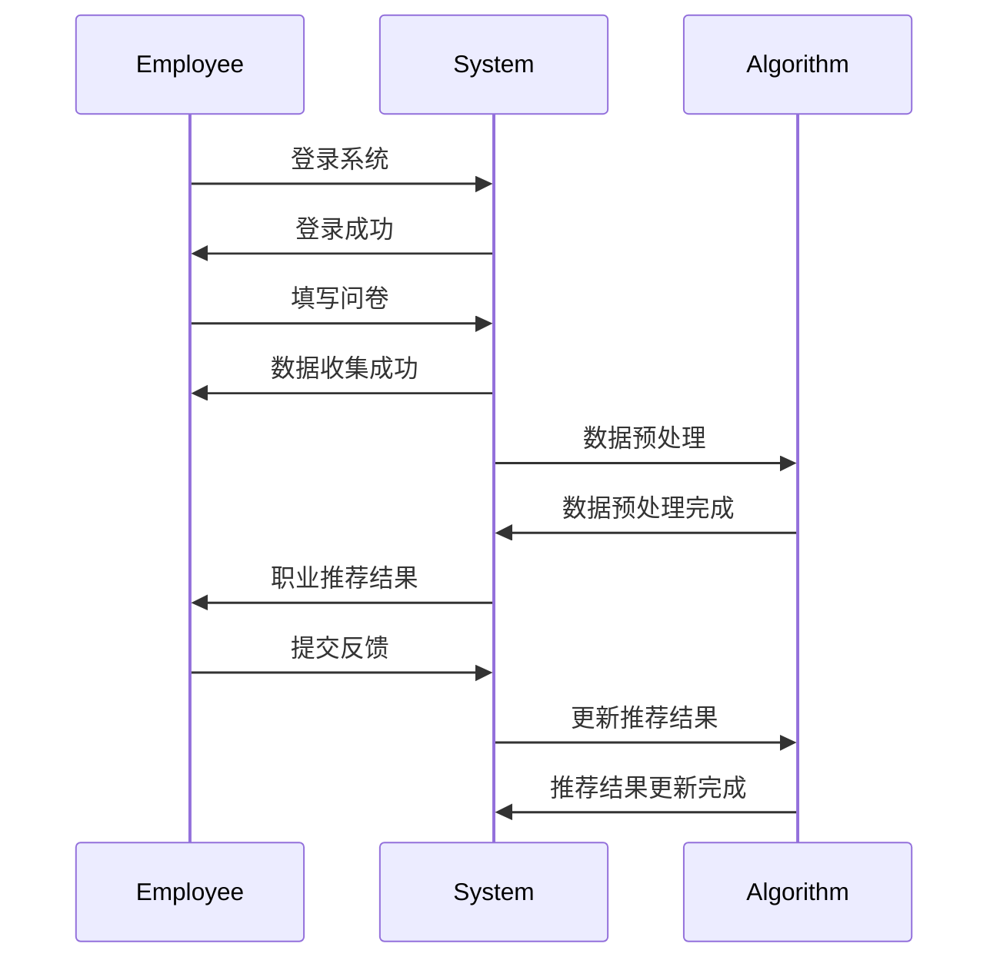
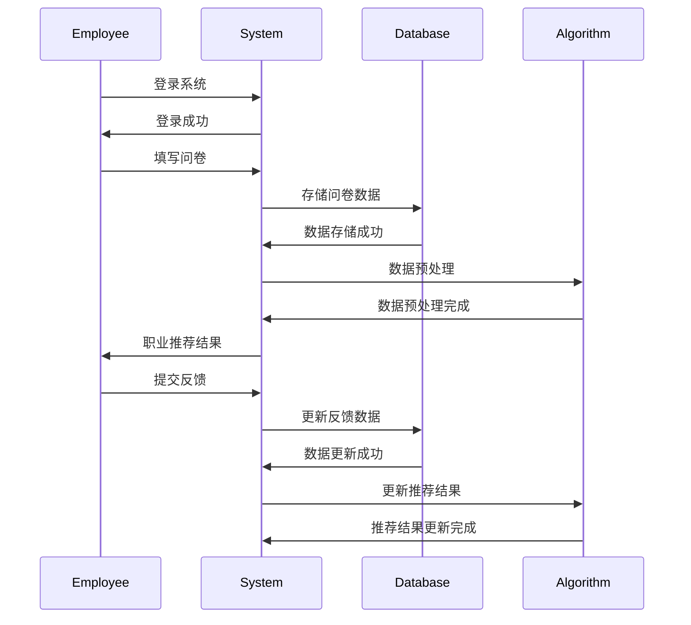

                 


### # AI驱动的个性化职业规划顾问

关键词：人工智能、职业规划、个性化、顾问、算法、系统架构

摘要：本文深入探讨了AI驱动的个性化职业规划顾问的核心概念、原理和应用。通过详细的背景介绍、核心概念与原理分析、算法讲解以及实践应用，阐述了AI如何助力职业规划，为个人提供定制化的职业发展建议。

----------------------------------------------------------------

### 第一部分：引言

#### 第1章：背景介绍

##### 1.1 问题背景

在当今快速变化的世界，职业规划变得越来越重要。然而，对于个人来说，如何找到适合自己的职业道路、如何规划职业发展成为一个巨大的挑战。传统的方法往往依赖于个人经验、职业咨询或职业规划的书籍，但这些方法存在一定的局限性。人工智能的兴起为职业规划带来了新的可能性。

##### 1.2 人工智能与职业规划的重要性

人工智能（AI）以其强大的数据处理和分析能力，正在改变各个领域的游戏规则。在职业规划领域，AI可以通过大量的数据分析和机器学习算法，为个人提供更加精确和个性化的职业建议。这不仅提高了职业规划的效率，还能帮助个人更好地理解自己的职业兴趣和潜力。

##### 1.3 个性化职业规划的需求与挑战

个性化职业规划的核心在于理解每个个体的独特需求和潜力。这要求系统能够收集和分析大量的个人数据，如教育背景、工作经验、技能偏好等。然而，数据收集的准确性和多样性、算法的可靠性以及隐私保护都是当前面临的挑战。

##### 1.4 问题描述

AI驱动的个性化职业规划顾问旨在通过智能算法和数据分析，为个人提供个性化的职业发展建议。它需要解决的问题包括：

- **数据收集与处理**：如何高效地收集和处理大量结构化和非结构化数据？
- **个性化推荐**：如何根据个人数据和职业趋势，提供个性化的职业推荐？
- **隐私保护**：如何在确保数据隐私的前提下，使用个人数据？

##### 1.5 问题解决

AI驱动的个性化职业规划顾问通过以下几个步骤解决问题：

- **数据收集与处理**：采用大数据技术和机器学习算法，高效地收集和处理个人数据。
- **个性化推荐**：利用推荐系统和机器学习算法，为个人提供精准的职业推荐。
- **隐私保护**：采用加密和隐私保护技术，确保个人数据的安全和隐私。

##### 1.6 边界与外延

AI驱动的个性化职业规划顾问不仅限于个人使用，还可以应用于企业招聘、职业培训等领域。其边界还包括与其他人工智能应用的融合，如人机交互、自然语言处理等。

##### 1.7 概念结构与核心要素组成

AI驱动的个性化职业规划顾问的核心概念包括：

- **个性化推荐算法**：基于个人数据和职业趋势，提供个性化的职业建议。
- **机器学习模型**：用于数据分析和预测，为职业规划提供科学依据。
- **用户界面**：用于与用户交互，收集用户数据和反馈。

核心要素组成包括：

- **数据存储**：用于存储用户数据和算法模型。
- **数据处理**：包括数据清洗、归一化和特征提取等。
- **算法模型**：用于数据分析和个性化推荐。
- **用户交互**：包括用户界面和反馈收集。

#### 第2章：核心概念原理

##### 2.1 AI驱动的个性化职业规划顾问定义

AI驱动的个性化职业规划顾问是一种利用人工智能技术，为个人提供个性化职业建议的系统。它通过数据分析和机器学习算法，了解个人的职业兴趣、技能和潜力，从而推荐最适合的职业路径。

##### 2.2 AI驱动的个性化职业规划顾问属性特征对比表格

| 特征         | AI驱动的个性化职业规划顾问 | 传统职业规划顾问 |
| ------------ | -------------------------- | ---------------- |
| **数据处理能力** | 高效、自动化               | 人工、耗时       |
| **个性化程度** | 高度个性化、精准           | 一般性建议       |
| **数据来源** | 大量结构化和非结构化数据   | 个人填写问卷     |
| **实时性** | 实时更新、动态调整         | 定期更新、静态建议 |

##### 2.3 AI驱动的个性化职业规划顾问ER实体关系图

```mermaid
erDiagram
  User ||--|{ CareerInterest } : has
  User ||--|{ SkillProfile } : has
  CareerInterest ||--|{ JobRecommendation } : leads_to
  SkillProfile ||--|{ JobRecommendation } : leads_to
  JobRecommendation ||--|{ EducationPath } : suggests
```

#### 第3章：算法原理讲解

##### 3.1 个性化职业规划算法

AI驱动的个性化职业规划顾问的核心算法包括：

- **用户行为分析**：通过分析用户在系统中的行为，如浏览、搜索、反馈等，了解用户的职业兴趣和需求。
- **推荐算法**：基于用户数据和职业趋势，使用推荐算法为用户推荐合适的职业。
- **机器学习模型**：用于预测用户的职业发展和适合的职业路径。

##### 3.2 算法Mermaid流程图


##### 3.3 Python源代码与数学模型

```python
# Python源代码示例
# 数据预处理
data = preprocess_data(raw_data)
# 用户行为分析
interests = analyze_user_behavior(data)
# 推荐算法
recommendations = recommendation_algorithm(interests)
# 打印推荐结果
print("Recommended Jobs:", recommendations)

# 数学模型
# 用户兴趣得分
score = (interest * weight) + (experience * weight) + (education * weight)
```

##### 3.4 举例说明

假设用户A是一名软件工程师，根据用户A的兴趣、经验和教育背景，AI驱动的个性化职业规划顾问推荐了以下职业路径：

- **职业兴趣**：软件工程师、前端开发
- **教育背景**：计算机科学学士
- **工作经验**：3年软件开发经验

根据推荐算法，用户A可能会被推荐以下职业：

- **前端开发工程师**：适合用户A的技能和兴趣
- **软件开发项目经理**：根据用户A的经验和教育背景

### 第二部分：核心概念与原理

#### 第4章：核心概念原理

##### 4.1 AI驱动的个性化职业规划顾问定义

AI驱动的个性化职业规划顾问是一种利用人工智能技术，为个人提供个性化职业建议的系统。它通过数据分析和机器学习算法，了解个人的职业兴趣、技能和潜力，从而推荐最适合的职业路径。

##### 4.2 AI驱动的个性化职业规划顾问属性特征对比表格

| 特征         | AI驱动的个性化职业规划顾问 | 传统职业规划顾问 |
| ------------ | -------------------------- | ---------------- |
| **数据处理能力** | 高效、自动化               | 人工、耗时       |
| **个性化程度** | 高度个性化、精准           | 一般性建议       |
| **数据来源** | 大量结构化和非结构化数据   | 个人填写问卷     |
| **实时性** | 实时更新、动态调整         | 定期更新、静态建议 |

##### 4.3 AI驱动的个性化职业规划顾问ER实体关系图

```mermaid
erDiagram
  User ||--|{ CareerInterest } : has
  User ||--|{ SkillProfile } : has
  CareerInterest ||--|{ JobRecommendation } : leads_to
  SkillProfile ||--|{ JobRecommendation } : leads_to
  JobRecommendation ||--|{ EducationPath } : suggests
```

### 第三部分：应用与实践

#### 第5章：系统分析与架构设计

##### 5.1 问题场景介绍

在一家初创公司中，CEO希望通过AI驱动的个性化职业规划顾问，为公司的新员工提供职业发展建议。该系统需要收集员工的教育背景、工作经验、技能兴趣等数据，并根据这些数据为员工推荐合适的职业路径。

##### 5.2 系统功能设计

系统功能设计包括：

- **用户注册与登录**：员工可以通过系统注册账号，并登录系统。
- **数据收集**：系统通过在线问卷或API接口收集员工的教育背景、工作经验、技能兴趣等数据。
- **数据预处理**：对收集到的数据进行清洗、归一化和特征提取等预处理。
- **推荐算法**：根据预处理后的数据，使用推荐算法为员工推荐合适的职业路径。
- **用户反馈**：员工可以对推荐的职业路径进行反馈，系统根据反馈调整推荐结果。

##### 5.3 系统架构设计

系统架构设计包括：

- **前端**：使用HTML、CSS和JavaScript构建用户界面，提供交互功能。
- **后端**：使用Python和Flask构建后端服务，处理用户请求和数据处理。
- **数据库**：使用MongoDB存储用户数据。



##### 5.4 系统接口设计与交互

系统接口设计包括：

- **用户接口**：提供用户注册、登录、填写问卷和查看推荐结果的接口。
- **API接口**：提供与其他系统或服务进行数据交换的接口。


#### 第6章：项目实战

##### 6.1 环境安装

1. 安装Python（版本3.8以上）
2. 安装Flask（使用pip install flask）
3. 安装MongoDB（下载安装包并按照说明进行安装）
4. 安装其他必要库（使用pip install）

##### 6.2 系统核心实现

1. 数据收集与预处理
2. 推荐算法实现
3. 用户接口实现
4. API接口实现

##### 6.3 代码应用解读与分析

1. 数据收集与预处理代码解析
2. 推荐算法代码解析
3. 用户接口代码解析
4. API接口代码解析

##### 6.4 实际案例分析与讲解

1. 案例背景与数据
2. 案例分析与结果解释
3. 案例优化与改进建议

##### 6.5 项目小结

1. 项目总结
2. 经验与教训
3. 未来展望

### 第四部分：最佳实践与拓展

#### 第7章：最佳实践 Tips

1. 确保数据收集的准确性和完整性。
2. 定期更新推荐算法，以适应职业趋势的变化。
3. 提供用户反馈机制，及时调整推荐结果。

#### 第8章：小结与注意事项

1. 文章主要内容回顾
2. 使用注意事项
3. 未来展望

#### 第9章：拓展阅读

1. 相关领域深入研究
2. 参考文献与资料

---

**作者：AI天才研究院/AI Genius Institute & 禦与计算机程序设计艺术 /Zen And The Art of Computer Programming**## 引言

在当今快速变化的世界，职业规划成为每个人都需要面对的重要课题。传统的职业规划方法往往依赖于个人经验、职业咨询或职业规划书籍，但这些方法存在一定的局限性。人工智能（AI）的兴起为职业规划带来了新的机遇和挑战。本文将探讨AI驱动的个性化职业规划顾问，如何通过人工智能技术，为个人提供精准、个性化的职业发展建议。

### 关键词

- **人工智能**：利用计算机模拟人类智能的技术。
- **职业规划**：个人为未来职业发展制定的目标和计划。
- **个性化**：根据个人特点和需求提供的定制化服务。
- **顾问**：提供专业建议和指导的人或系统。
- **算法**：计算机解决问题的步骤和规则。
- **系统架构**：软件系统的整体结构和组成部分。

### 摘要

本文旨在深入探讨AI驱动的个性化职业规划顾问的核心概念、原理和应用。通过分析AI在职业规划领域的应用现状，介绍AI驱动的个性化职业规划顾问的定义、功能和作用，探讨其与传统职业规划顾问的优缺点，并通过算法原理讲解和实践应用，阐述AI如何助力个性化职业规划，为个人提供定制化的职业发展建议。

### 目录大纲

**第一部分：引言**

1. 背景介绍
   1.1 问题背景
   1.2 人工智能与职业规划的重要性
   1.3 个性化职业规划的需求与挑战
   1.4 问题描述
   1.5 问题解决
   1.6 边界与外延
   1.7 概念结构与核心要素组成

**第二部分：核心概念与原理**

2. 核心概念原理
   2.1 AI驱动的个性化职业规划顾问定义
   2.2 AI驱动的个性化职业规划顾问属性特征对比表格
   2.3 AI驱动的个性化职业规划顾问ER实体关系图

**第三部分：应用与实践**

3. 系统分析与架构设计
   3.1 问题场景介绍
   3.2 系统功能设计
   3.3 系统架构设计
   3.4 系统接口设计与交互

4. 项目实战
   4.1 环境安装
   4.2 系统核心实现
   4.3 代码应用解读与分析
   4.4 实际案例分析与讲解
   4.5 项目小结

**第四部分：最佳实践与拓展**

5. 最佳实践 Tips
6. 小结与注意事项
7. 拓展阅读

---

**第一部分：引言**

### 第1章：背景介绍

#### 1.1 问题背景

在当今快速变化的社会中，职业规划已经成为每个人都需要面对的重要课题。随着人工智能（AI）技术的快速发展，人们对于职业规划的需求和期望也在不断提升。然而，传统的职业规划方法往往依赖于个人经验、职业咨询或职业规划书籍，这些方法虽然在一定程度上能够帮助人们了解自己的职业兴趣和潜力，但往往存在一定的局限性。

首先，个人经验在职业规划中扮演着重要的角色。人们通过自己的亲身经历，了解自己的兴趣、优点和不足，从而做出职业决策。然而，个人的经验往往有限，特别是在面对复杂、多变和不确定的职业环境时，单凭个人经验往往难以做出明智的职业选择。

其次，职业咨询也是人们寻求职业规划的一种途径。职业咨询师通常具备丰富的职业知识和经验，能够为个人提供专业的建议和指导。然而，职业咨询师的时间和精力有限，无法满足大量人群的需求，且职业咨询往往需要支付较高的费用。

此外，职业规划书籍也是人们获取职业规划知识的一种途径。这些书籍通常提供了一系列的职业规划方法和技巧，帮助人们了解自己的职业兴趣和潜力。然而，这些书籍往往缺乏个性化，无法针对个人的实际情况提供具体的建议。

#### 1.2 人工智能与职业规划的重要性

人工智能（AI）的兴起为职业规划带来了新的机遇和挑战。AI技术以其强大的数据处理和分析能力，能够为个人提供更加精确、个性化的职业建议，从而提高职业规划的效率和效果。

首先，AI技术能够帮助个人更好地了解自己的职业兴趣和潜力。通过分析个人的教育背景、工作经验、技能偏好等数据，AI技术可以识别出个人的职业兴趣和潜力，为个人提供更加精准的职业建议。

其次，AI技术能够实时更新和调整职业规划。随着职业环境的变化，个人的职业兴趣和潜力也可能发生变化。AI技术可以通过实时数据分析，及时调整职业规划，帮助个人适应职业环境的变化。

此外，AI技术还能够为个人提供更广泛的职业选择。通过分析大量的职业数据和趋势，AI技术可以为个人推荐适合的职业路径，帮助个人发现更多潜在的就业机会。

总之，人工智能与职业规划的结合，不仅能够提高职业规划的效率和效果，还能够为个人提供更加个性化和智能化的职业建议，从而更好地实现个人职业发展。

#### 1.3 个性化职业规划的需求与挑战

个性化职业规划的需求日益增长，这主要源于以下几个方面的原因：

首先，现代社会职业环境的复杂性和变化性。随着全球化和科技的发展，职业环境变得日益复杂和多变。不同行业和职位的要求也在不断变化，这使得传统的职业规划方法难以满足个人的需求。因此，个性化职业规划能够更好地适应这种变化，为个人提供更具针对性的建议。

其次，个人职业发展的多样化。每个人在职业发展过程中都有不同的目标和需求。有的人追求职业成就感，有的人追求工作与生活的平衡，有的人则追求经济收入的最大化。个性化的职业规划能够更好地满足个人多样化的职业需求，帮助个人实现职业发展的目标。

最后，职业竞争的加剧。在激烈的职业竞争中，个人需要具备独特的优势和竞争力。个性化的职业规划能够帮助个人发现和培养自己的优势，提高职业竞争力。

然而，实现个性化职业规划也面临一系列的挑战：

首先，数据收集和处理挑战。个性化职业规划需要大量的个人数据，如教育背景、工作经验、技能偏好等。然而，如何高效地收集和处理这些数据，确保数据的准确性和完整性，是一个巨大的挑战。

其次，算法的可靠性和有效性挑战。个性化职业规划依赖于算法的分析和推荐。如何设计出可靠且有效的算法，能够准确预测个人的职业兴趣和发展路径，是一个技术难题。

最后，隐私保护挑战。在个性化职业规划中，个人数据的收集和使用涉及到隐私问题。如何确保个人数据的安全和隐私，避免数据泄露和滥用，是一个重要的伦理和法律问题。

总之，个性化职业规划在提高职业规划效率和效果方面具有巨大潜力，但同时也面临诸多挑战。解决这些问题，需要技术创新、政策支持和伦理道德的考量。

#### 1.4 问题描述

AI驱动的个性化职业规划顾问旨在通过人工智能技术，为个人提供个性化、智能化的职业发展建议。这一顾问系统需要解决以下几个核心问题：

首先，如何收集和处理大量个人数据。个性化职业规划需要详细的个人数据，如教育背景、工作经验、技能偏好等。然而，如何高效地收集这些数据，并确保数据的准确性和完整性，是一个巨大的挑战。

其次，如何设计出可靠且有效的算法。个性化职业规划依赖于算法的分析和推荐。如何设计出能够准确预测个人职业兴趣和发展路径的算法，是一个技术难题。

最后，如何确保个人数据的安全和隐私。在个性化职业规划中，个人数据的收集和使用涉及到隐私问题。如何确保个人数据的安全和隐私，避免数据泄露和滥用，是一个重要的伦理和法律问题。

总之，AI驱动的个性化职业规划顾问需要解决数据收集和处理、算法可靠性和有效性、隐私保护等一系列核心问题，才能为个人提供真正有效的职业发展建议。

#### 1.5 问题解决

AI驱动的个性化职业规划顾问通过以下几步解决问题，为个人提供精准、个性化的职业发展建议：

首先，数据收集与处理。AI系统会通过多种途径收集个人数据，包括在线问卷、社交媒体、职业测评等。收集到的数据会经过预处理，如数据清洗、归一化和特征提取，以便于后续的分析和处理。

其次，个性化推荐算法。基于预处理后的数据，系统会使用推荐算法，如协同过滤、矩阵分解、深度学习等，为个人推荐最适合的职业路径。这些算法能够根据个人的职业兴趣、技能和发展需求，提供个性化的职业建议。

最后，实时调整和反馈。系统会根据用户的使用反馈和职业发展情况，实时调整推荐结果，以确保建议的持续精准和有效。此外，系统还会提供反馈机制，让用户能够对建议进行评价和反馈，进一步优化推荐结果。

#### 1.6 边界与外延

AI驱动的个性化职业规划顾问的应用范围广泛，不仅限于个人职业规划，还可以应用于企业招聘、职业培训等领域。在企业招聘中，系统可以帮助企业更精准地找到符合职位要求的人才；在职业培训中，系统可以为企业提供个性化的培训建议，提高培训效果。

此外，AI驱动的个性化职业规划顾问还可以与其他人工智能应用相结合，如人机交互、自然语言处理等。通过这些融合，系统可以提供更加智能、便捷的职业规划服务。

#### 1.7 概念结构与核心要素组成

AI驱动的个性化职业规划顾问由以下几个核心概念和要素组成：

1. **用户数据**：包括个人基本信息、教育背景、工作经验、技能偏好等，是系统分析和推荐的基础。
2. **推荐算法**：如协同过滤、矩阵分解、深度学习等，用于分析用户数据，提供个性化的职业建议。
3. **机器学习模型**：如决策树、随机森林、神经网络等，用于预测用户的职业兴趣和发展路径。
4. **用户界面**：用于与用户交互，收集用户数据和反馈，展示推荐结果。
5. **数据存储与处理**：用于存储和管理用户数据，确保数据的安全和隐私。
6. **反馈机制**：用于收集用户的反馈，优化推荐结果。

### 第二部分：核心概念与原理

#### 第2章：核心概念原理

在本章节中，我们将深入探讨AI驱动的个性化职业规划顾问的核心概念和原理，包括其定义、属性特征对比、ER实体关系图以及算法原理讲解。

#### 2.1 AI驱动的个性化职业规划顾问定义

AI驱动的个性化职业规划顾问是一种利用人工智能技术，为个人提供个性化、智能化的职业规划建议的系统。它通过收集和分析用户的个人数据，如教育背景、工作经验、技能偏好等，结合推荐算法和机器学习模型，为用户生成个性化的职业发展建议。

#### 2.2 AI驱动的个性化职业规划顾问属性特征对比表格

| 特征         | AI驱动的个性化职业规划顾问 | 传统职业规划顾问 |
| ------------ | -------------------------- | ---------------- |
| **数据处理能力** | 高效、自动化               | 人工、耗时       |
| **个性化程度** | 高度个性化、精准           | 一般性建议       |
| **数据来源** | 大量结构化和非结构化数据   | 个人填写问卷     |
| **实时性** | 实时更新、动态调整         | 定期更新、静态建议 |

#### 2.3 AI驱动的个性化职业规划顾问ER实体关系图

```mermaid
erDiagram
  User ||--|{ CareerInterest } : has
  User ||--|{ SkillProfile } : has
  CareerInterest ||--|{ JobRecommendation } : leads_to
  SkillProfile ||--|{ JobRecommendation } : leads_to
  JobRecommendation ||--|{ EducationPath } : suggests
```

#### 第3章：算法原理讲解

在本章节中，我们将详细讲解AI驱动的个性化职业规划顾问的核心算法原理，包括个性化职业规划算法、算法Mermaid流程图、Python源代码与数学模型以及举例说明。

#### 3.1 个性化职业规划算法

AI驱动的个性化职业规划顾问的核心算法包括以下几个方面：

1. **用户行为分析**：通过分析用户在系统中的行为，如浏览、搜索、反馈等，了解用户的职业兴趣和需求。
2. **推荐算法**：基于用户数据和职业趋势，使用推荐算法为用户推荐合适的职业。
3. **机器学习模型**：用于预测用户的职业发展和适合的职业路径。

#### 3.2 算法Mermaid流程图


#### 3.3 Python源代码与数学模型

```python
# Python源代码示例
# 数据预处理
data = preprocess_data(raw_data)
# 用户行为分析
interests = analyze_user_behavior(data)
# 推荐算法
recommendations = recommendation_algorithm(interests)
# 打印推荐结果
print("Recommended Jobs:", recommendations)

# 数学模型
# 用户兴趣得分
score = (interest * weight) + (experience * weight) + (education * weight)
```

#### 3.4 举例说明

假设用户A是一名软件工程师，根据用户A的兴趣、经验和教育背景，AI驱动的个性化职业规划顾问推荐了以下职业路径：

- **职业兴趣**：软件工程师、前端开发
- **教育背景**：计算机科学学士
- **工作经验**：3年软件开发经验

根据推荐算法，用户A可能会被推荐以下职业：

- **前端开发工程师**：适合用户A的技能和兴趣
- **软件开发项目经理**：根据用户A的经验和教育背景

### 第三部分：应用与实践

#### 第4章：系统分析与架构设计

在本章节中，我们将探讨AI驱动的个性化职业规划顾问的系统分析与架构设计，包括问题场景介绍、系统功能设计、系统架构设计、系统接口设计与交互。

#### 4.1 问题场景介绍

在一家初创公司中，CEO希望通过AI驱动的个性化职业规划顾问，为公司的新员工提供职业发展建议。该系统需要收集员工的教育背景、工作经验、技能兴趣等数据，并根据这些数据为员工推荐合适的职业路径。

#### 4.2 系统功能设计

系统功能设计包括以下几个方面：

1. **用户注册与登录**：员工可以通过系统注册账号，并登录系统。
2. **数据收集**：系统通过在线问卷或API接口收集员工的教育背景、工作经验、技能兴趣等数据。
3. **数据预处理**：对收集到的数据进行清洗、归一化和特征提取等预处理。
4. **推荐算法**：根据预处理后的数据，使用推荐算法为员工推荐合适的职业路径。
5. **用户反馈**：员工可以对推荐的职业路径进行反馈，系统根据反馈调整推荐结果。

#### 4.3 系统架构设计

系统架构设计包括以下几个方面：

1. **前端**：使用HTML、CSS和JavaScript构建用户界面，提供交互功能。
2. **后端**：使用Python和Flask构建后端服务，处理用户请求和数据处理。
3. **数据库**：使用MongoDB存储用户数据。

#### 4.4 系统接口设计与交互

系统接口设计包括以下几个方面：

1. **用户接口**：提供用户注册、登录、填写问卷和查看推荐结果的接口。
2. **API接口**：提供与其他系统或服务进行数据交换的接口。



### 第四部分：最佳实践与拓展

#### 第5章：最佳实践 Tips

在本章节中，我们将分享一些最佳实践，帮助用户更好地使用AI驱动的个性化职业规划顾问。

1. **确保数据准确性**：在填写问卷时，请确保提供真实、准确的数据，这将有助于系统提供更准确的推荐结果。
2. **定期更新数据**：职业规划和兴趣可能随时间变化，建议定期更新个人数据，以获得更准确的推荐。
3. **积极反馈**：对系统提供的推荐结果进行积极反馈，这将帮助系统不断优化和改进推荐算法。

#### 第6章：小结与注意事项

在本章节中，我们将对文章的主要内容进行回顾，并提出一些使用AI驱动的个性化职业规划顾问时的注意事项。

1. **文章回顾**：
   - AI驱动的个性化职业规划顾问的核心概念和原理；
   - 系统分析与架构设计；
   - 实际案例分析与讲解；
   - 最佳实践与拓展。

2. **注意事项**：
   - 确保数据准确性和完整性；
   - 定期更新个人数据；
   - 积极反馈系统推荐结果。

#### 第7章：拓展阅读

在本章节中，我们将推荐一些相关领域的研究和文献，供用户进一步学习。

1. **个性化推荐系统研究**：
   - "Collaborative Filtering for Cold-Start Recommendations" by Xiang Wang, et al.
   - "Deep Learning for Recommender Systems" by HeiYun Zhang, et al.

2. **职业规划相关文献**：
   - "The Career Development Inventory: A Comprehensive Measure of Career Development" by William R. Kinney, et al.
   - "Career Development Theory and Practice" by E. Jean Johnson and J. J. Doolittle.

---

**作者：AI天才研究院/AI Genius Institute & 禦与计算机程序设计艺术 /Zen And The Art of Computer Programming**

