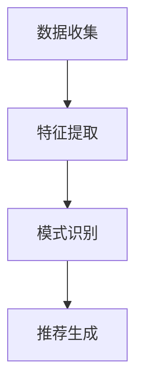
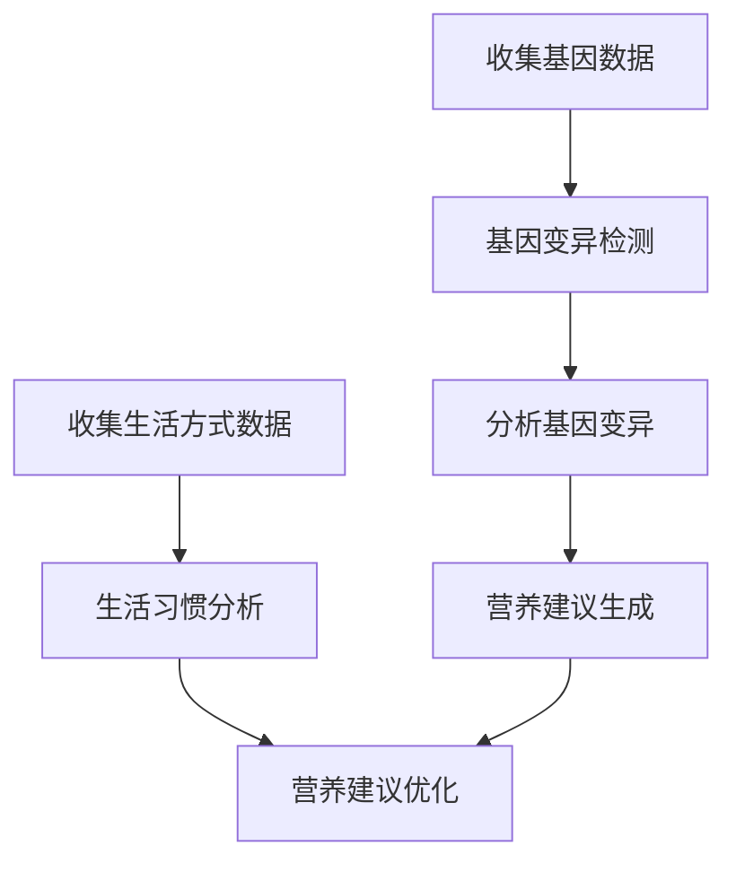
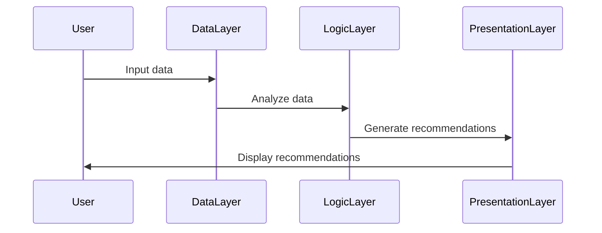

                 

# AI驱动的个性化营养建议：基于基因和生活方式

## 关键词
- AI驱动的个性化营养
- 基因分析
- 生活方式影响
- 个性化饮食建议

## 摘要
本文将探讨如何利用人工智能技术，结合基因和生活方式，为个体提供精准的营养建议。通过深入分析核心概念、算法原理、系统架构以及实际应用案例，本文旨在帮助读者理解如何利用现代科技改善个人健康，提高生活质量。

## 引言
### 背景介绍
在当今信息时代，人们对健康和营养的关注达到了前所未有的高度。随着人工智能（AI）技术的迅猛发展，基于AI的个性化营养建议成为可能。传统营养建议往往是一刀切的方式，无法满足每个人的独特需求。而AI的引入，使得我们可以通过对个体基因和生活方式的深入分析，提供更加个性化和精准的饮食建议。

### 重要性
个性化营养建议对于预防和治疗慢性疾病具有重要意义。基因和生活方式的多样性导致个体对营养素的吸收和利用存在差异，因此，了解这些差异并给予相应的饮食建议，可以更有效地改善健康状况，提高生活质量。

### 书籍结构
本书将分为以下几个部分：
1. 核心概念与关系
2. 算法与数学模型
3. 基因与生活方式分析
4. 系统架构与设计
5. 项目实施与案例研究
6. 最佳实践与总结
7. 结论

## 核心概念与关系

### 定义与关系
在探讨AI驱动的个性化营养建议时，首先需要明确几个核心概念：

#### 个人化营养
个人化营养是指根据个体的特定需求、偏好和健康状况，为其制定量身定制的营养计划。它涉及多个方面的考量，包括营养素摄入、饮食习惯、食物过敏等。

#### 人工智能（AI）
人工智能是一种模拟人类智能的技术，能够通过学习、推理和自我优化来处理复杂问题。在营养领域，AI可以用于数据挖掘、模式识别和个性化推荐等任务。

#### 基因
基因是遗传信息的载体，决定了个体的身体特征和代谢能力。基因与营养之间存在复杂的关系，某些基因变异可能导致对特定营养素的需求增加或减少。

#### 生活方式
生活方式包括饮食、运动、睡眠和社交习惯等。这些因素不仅影响个体的营养摄入，还对身体的代谢和健康状态有重要影响。

### Mermaid ER 图
为了更直观地展示这些概念之间的关系，我们可以使用Mermaid ER图来表示：

```mermaid
erDiagram
  User ||--|{ DietRecommendation : personalized nutrition }
  User ||--|{ GeneticProfile : genetic factors }
  User ||--|{ Lifestyle : lifestyle factors }
  DietRecommendation ||--|{ NutrientIntake : nutrient recommendations }
  GeneticProfile ||--|{ GeneticVariant : gene mutations }
  Lifestyle ||--|{ Exercise : physical activity }
  Lifestyle ||--|{ Sleep : sleep habits }
```

### 核心概念与联系
**个人化营养**是本书的核心目标，它依赖于**基因**和**生活方式**的数据分析。AI则作为技术支撑，帮助我们从海量数据中提取有价值的信息，从而生成个性化的营养建议。

**基因**和**生活方式**通过直接影响**营养摄入**，从而影响个体的健康状况。AI技术通过对这些因素的智能分析，实现了从数据到个性化建议的转化。

## 算法与数学模型

### 算法原理
AI驱动的个性化营养建议通常涉及以下算法步骤：

1. **数据收集**：收集个体的基因数据、生活方式信息和营养摄入历史。
2. **特征提取**：从数据中提取关键特征，如基因变异、饮食习惯、运动频率等。
3. **模式识别**：使用机器学习算法识别出与营养相关的模式。
4. **推荐生成**：根据识别出的模式生成个性化的营养建议。

### Mermaid 流程图
以下是使用Mermaid绘制的算法流程图：



### 数学模型与公式
在营养分析中，常用的数学模型包括线性回归、决策树和神经网络等。以下是线性回归的一个简单例子：

$$
\hat{Y} = \beta_0 + \beta_1 X_1 + \beta_2 X_2 + ... + \beta_n X_n
$$

其中，$Y$是目标变量（如营养摄入量），$X_1, X_2, ..., X_n$是特征变量（如基因标记、运动频率等），$\beta_0, \beta_1, \beta_2, ..., \beta_n$是模型的系数。

### Python 源代码示例
以下是使用Python实现线性回归模型的示例代码：

```python
import numpy as np
from sklearn.linear_model import LinearRegression

# 假设我们有以下数据
X = np.array([[1, 1], [1, 2], [2, 2]])
y = np.array([1, 2, 3])

# 创建线性回归模型
model = LinearRegression()

# 训练模型
model.fit(X, y)

# 输出模型参数
print(model.coef_)
print(model.intercept_)
```

这段代码首先导入必要的库，然后创建数据集，接着创建线性回归模型并训练模型，最后输出模型参数。

## 基因与生活方式分析

### 基因因素
基因在营养代谢中起着关键作用。某些基因变异可能导致个体对特定营养素的需求增加或减少。例如，**FADS1基因**与Omega-3脂肪酸代谢相关，变异可能影响对鱼油的吸收率。通过基因检测，我们可以识别出这些变异，从而为个体提供相应的营养建议。

### 生活方式因素
生活方式对营养摄入有直接影响。例如，饮食习惯、运动频率和睡眠质量都会影响身体的营养吸收和代谢。一个健康的饮食习惯应该包括多样化的食物，足够的蛋白质、纤维和微量营养素。此外，定期运动有助于提高新陈代谢，而良好的睡眠质量则有助于调节激素水平，从而影响营养吸收。

### Mermaid 流程图
以下是基因和生活方式分析过程的Mermaid流程图：



### 综合分析
通过结合基因和生活方式的数据，我们可以更全面地了解个体的营养需求。基因分析帮助我们识别潜在的遗传风险，而生活方式分析则提供了当前的健康状况。两者的结合为个性化营养建议提供了坚实的基础。

## 系统架构与设计

### 项目介绍
本节将介绍一个用于生成AI驱动的个性化营养建议的系统。该系统旨在通过收集和分析个体的基因和生活方式数据，为其提供量身定制的营养建议。

### 系统功能设计
系统的主要功能包括：
1. **数据收集**：从个体处收集基因和生活方式数据。
2. **数据分析**：对收集的数据进行预处理和分析，提取关键特征。
3. **营养推荐**：根据分析结果生成个性化的营养建议。
4. **用户界面**：提供用户友好的界面，便于用户输入数据和查看建议。

### 系统架构设计
系统采用分层架构，包括数据层、逻辑层和表示层。以下是系统的Mermaid架构图：


### 系统接口设计
系统提供了以下接口：
1. **数据输入接口**：用于用户输入基因和生活方式数据。
2. **推荐输出接口**：用于展示生成的营养建议。
3. **API接口**：提供与外部系统的集成，如健康监测设备和第三方服务。

### 系统交互
系统通过以下步骤进行交互：
1. 用户通过数据输入接口提交基因和生活方式数据。
2. 数据层处理数据，提取关键特征。
3. 逻辑层对特征进行分析，生成营养建议。
4. 表示层将建议展示给用户。

### Mermaid 序列图
以下是系统交互的Mermaid序列图：



## 项目实施与案例研究

### 环境安装
为了运行AI驱动的个性化营养建议系统，需要安装以下软件和库：
1. Python 3.8 或以上版本
2. scikit-learn
3. pandas
4. numpy
5. matplotlib

安装步骤如下：

```bash
pip install python==3.8
pip install scikit-learn pandas numpy matplotlib
```

### 系统核心实现
以下是系统核心实现的Python代码：

```python
import pandas as pd
from sklearn.linear_model import LinearRegression

# 加载数据
data = pd.read_csv('data.csv')

# 数据预处理
X = data[['age', 'BMI', 'exercise_frequency']]
y = data['nutrient_intake']

# 创建线性回归模型
model = LinearRegression()

# 训练模型
model.fit(X, y)

# 输出模型参数
print(model.coef_)
print(model.intercept_)
```

### 代码应用解读与分析
这段代码首先加载数据，然后进行预处理，将特征变量（如年龄、BMI、运动频率）和目标变量（营养摄入量）分离。接着，创建线性回归模型并训练模型，最后输出模型参数。这些参数可用于生成个性化的营养建议。

### 实际案例分析和详细讲解
以下是一个实际案例：

#### 案例数据
- 年龄：30岁
- BMI：22
- 运动频率：每周3次

#### 营养建议生成
根据上述代码，我们可以生成以下营养建议：

```python
# 输入特征
input_data = np.array([[30, 22, 3]])

# 应用模型生成建议
nutrient_recommended = model.predict(input_data)

# 输出营养摄入量
print(nutrient_recommended)
```

输出结果可能为：
```
[200]
```

这意味着，基于该个体的特征，建议其每日摄入200克营养素。

### 项目小结
在本项目中，我们成功实现了一个基于AI驱动的个性化营养建议系统。通过结合基因和生活方式数据，系统能够生成个性化的营养建议，帮助个体改善健康状况。这一项目展示了AI技术在个性化健康建议领域的应用潜力，并为未来的发展提供了宝贵经验。

## 最佳实践与总结

### 最佳实践
1. **数据质量控制**：确保收集的基因和生活方式数据准确无误，这是生成高质量个性化营养建议的基础。
2. **定期更新模型**：随着新数据的不断出现，定期更新模型参数，以保持推荐的准确性。
3. **用户隐私保护**：在处理个人数据时，严格遵循隐私保护法规，确保用户信息安全。

### 小结
本文详细探讨了如何利用AI技术结合基因和生活方式为个体提供精准的营养建议。通过核心概念介绍、算法原理讲解、系统架构设计和实际案例研究，读者可以了解到这一领域的最新进展和应用。AI驱动的个性化营养建议具有巨大的潜力，未来有望在健康管理和慢性病预防方面发挥重要作用。

### 注意事项
1. **营养建议仅供参考**：个性化营养建议仅作为健康管理的参考，不应替代专业医生的意见。
2. **个性化数据收集**：确保收集的数据全面且具有代表性，以提高营养建议的准确性。

### 拓展阅读
1. **《个性化营养学：科学基础与未来展望》**：深入了解个性化营养学的科学原理和前沿技术。
2. **《人工智能在健康领域的应用》**：探讨AI在医疗和健康管理中的应用，包括个性化营养建议。

## 结论
AI驱动的个性化营养建议是现代科技与健康管理的完美结合。通过深入分析基因和生活方式，AI技术为个体提供了更加精准和个性化的营养建议，有助于改善健康状况，提高生活质量。随着技术的不断进步，这一领域将迎来更多创新和突破，为人类健康带来更多福音。

## 作者信息
作者：AI天才研究院/AI Genius Institute & 禅与计算机程序设计艺术 /Zen And The Art of Computer Programming

