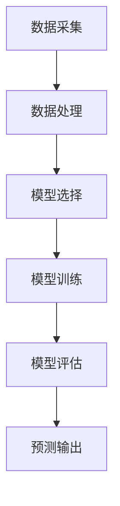
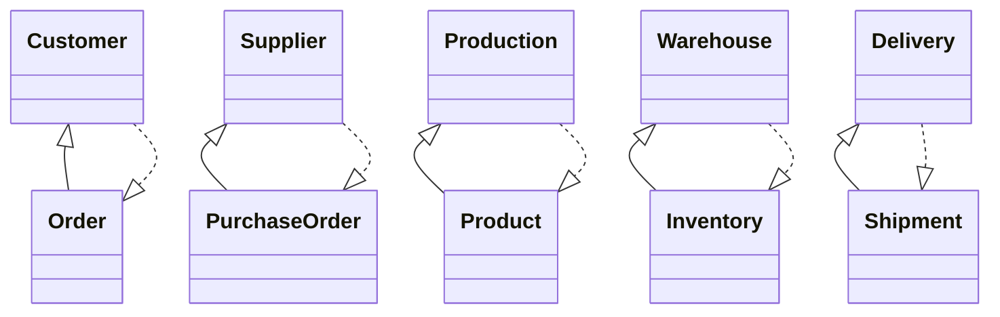
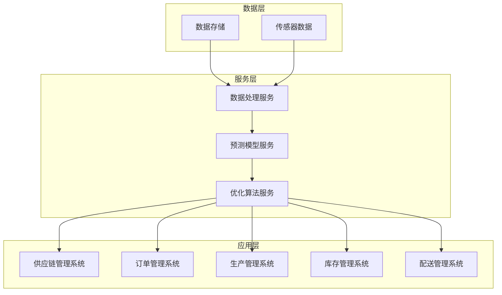
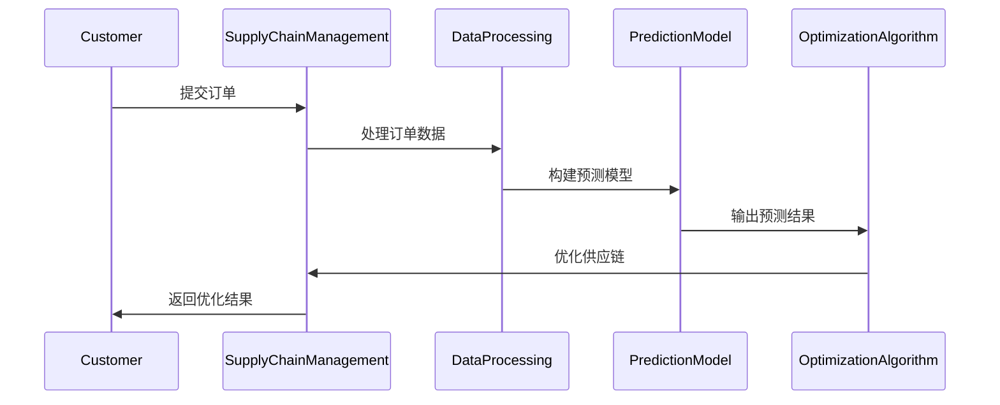

                 

### AI驱动的供应链优化：提高效率降低成本

#### 引言

在当今全球化的商业环境中，供应链管理已经成为企业竞争力的关键因素之一。随着市场需求的不断变化和竞争的加剧，如何提高供应链的效率和降低成本成为了许多企业亟待解决的问题。人工智能（AI）技术的快速发展为供应链优化提供了新的契机，通过AI驱动的供应链优化，企业可以实现自动化、智能化和高效化的供应链管理，从而在激烈的市场竞争中脱颖而出。本文将详细探讨AI驱动的供应链优化技术，包括其背景、核心概念、算法原理、系统设计与项目实战，旨在为企业提供一条可行的供应链优化之路。

#### 关键词

- AI驱动的供应链优化
- 供应链管理
- 数据采集与处理
- 预测模型
- 算法原理
- 系统架构设计
- 项目实战

#### 摘要

本文首先介绍了AI驱动的供应链优化背景和问题，探讨了其核心概念和联系，详细讲解了预测模型的算法原理和数学模型，然后通过一个具体的项目实例展示了AI驱动的供应链优化系统设计与实现。最后，本文总结了项目实战中的最佳实践和注意事项，为企业的供应链优化提供了宝贵的经验。

### 第一部分：背景介绍

#### 问题背景

随着全球化的深入发展，供应链的复杂性不断增加。传统的供应链管理方式已经难以满足现代企业对于效率、成本控制等方面的要求。因此，如何通过先进的技术手段来优化供应链管理，成为了当前企业和研究机构关注的焦点。

供应链管理的核心在于提高供应链的效率和降低成本。然而，在传统的供应链管理中，信息不对称、库存过剩、物流效率低下等问题常常导致供应链成本上升，从而影响企业的盈利能力。为了解决这些问题，企业开始探索应用人工智能技术进行供应链优化。

#### 问题描述

AI驱动的供应链优化是指利用人工智能技术，对供应链各个环节进行智能化管理，从而提高供应链的整体效率，降低运营成本。这一优化过程涉及数据采集、数据处理、预测模型构建、优化算法设计等环节。

具体来说，AI驱动的供应链优化主要包括以下几个问题：

1. **数据采集**：如何有效地采集供应链各个环节的数据，包括采购、生产、库存、物流等数据。
2. **数据处理**：如何对采集到的数据进行处理，包括数据清洗、数据整合等。
3. **预测模型构建**：如何构建预测模型，对供应链的未来趋势进行预测，为决策提供依据。
4. **优化算法设计**：如何设计优化算法，对供应链的各个环节进行优化，提高整体效率。

#### 问题解决

AI驱动的供应链优化提供了以下解决方案：

1. **数据采集**：利用物联网、传感器等技术，实现供应链数据的实时采集。
2. **数据处理**：利用数据挖掘、机器学习等技术，对采集到的数据进行处理和分析。
3. **预测模型构建**：利用机器学习算法，如线性回归、决策树、神经网络等，构建预测模型。
4. **优化算法设计**：利用优化算法，如遗传算法、模拟退火算法等，对供应链进行优化。

通过这些技术的应用，企业可以实现对供应链的全面监控和优化，提高供应链的透明度和响应速度，从而提高整体效率和降低成本。

#### 边界与外延

本文主要讨论AI驱动的供应链优化在供应链管理中的应用，不包括其他非AI技术或供应链管理的其他方面。同时，本文关注的核心是供应链优化技术，不涉及具体的供应链运营策略。

#### 概念结构与核心要素组成

AI驱动的供应链优化涉及以下几个核心要素：

1. **AI技术**：包括机器学习、深度学习、自然语言处理等，用于数据采集、处理、预测模型构建和优化算法设计。
2. **供应链管理**：涉及供应链的各个环节，如采购、生产、库存管理、物流配送等。
3. **数据**：供应链中产生的各种数据，如交易数据、库存数据、物流数据等。
4. **模型**：用于预测和优化的各种算法模型。
5. **算法**：实现预测和优化的具体计算方法。

### 第二部分：核心概念与联系

#### AI大模型的定义

AI大模型是指具有大规模参数、能够处理大量数据的人工智能模型。这些模型通常采用深度学习技术，具有强大的数据处理和分析能力。例如，GPT-3、BERT等模型都属于AI大模型。

#### AI大模型的特点

AI大模型具有以下几个特点：

1. **大规模参数**：AI大模型具有数十亿甚至数万亿的参数，这使得它们能够处理复杂的任务。
2. **数据驱动**：AI大模型通过大量的数据训练得到，具有良好的泛化能力。
3. **高效处理**：AI大模型能够在短时间内处理大量数据，具有高效的计算能力。

#### AI大模型与传统AI的区别

AI大模型与传统AI模型在以下几个方面存在显著区别：

1. **计算能力**：AI大模型具有更强的计算能力，能够处理更为复杂的任务。
2. **数据需求**：AI大模型对数据量有更高的要求，需要更多的训练数据。
3. **应用场景**：AI大模型适用于需要处理大量数据的复杂场景，如自然语言处理、图像识别等。

#### AI大模型在供应链优化中的应用

AI大模型在供应链优化中的应用主要体现在以下几个方面：

1. **预测模型构建**：利用AI大模型，可以构建更为精准的预测模型，对供应链的未来趋势进行预测。
2. **优化算法设计**：利用AI大模型，可以设计更为高效的优化算法，对供应链的各个环节进行优化。
3. **数据处理与分析**：利用AI大模型，可以对大量的供应链数据进行处理和分析，提供有价值的信息。

#### AI大模型与传统AI模型的对比

| 特性 | AI大模型 | 传统AI模型 |
| --- | --- | --- |
| 参数规模 | 数十亿至数万亿 | 数千至数万 |
| 数据驱动 | 强 | 一般 |
| 计算能力 | 强 | 一般 |
| 应用场景 | 复杂场景 | 简单场景 |
| 数据需求 | 高 | 一般 |

#### AI大模型与供应链优化的联系

AI大模型与供应链优化的联系主要体现在以下几个方面：

1. **数据采集与处理**：AI大模型能够处理大量的供应链数据，从而提高数据采集和处理的效率。
2. **预测与优化**：AI大模型能够构建精准的预测模型，为供应链的优化提供数据支持。
3. **决策支持**：AI大模型可以提供实时、准确的决策支持，帮助企业做出更为合理的决策。

### 第三部分：算法原理讲解

#### 预测模型构建

在AI驱动的供应链优化中，预测模型是核心。预测模型用于预测供应链的未来趋势，为优化决策提供依据。常见的预测模型包括线性回归、决策树、随机森林、神经网络等。

1. **线性回归模型**：线性回归模型是一种简单的预测模型，通过拟合数据中的线性关系来预测目标值。线性回归模型的数学模型为：
   $$ y = \beta_0 + \beta_1 \cdot x $$
   其中，$y$ 是预测值，$x$ 是输入特征，$\beta_0$ 和 $\beta_1$ 是模型的参数。

2. **决策树模型**：决策树模型是一种基于树结构的预测模型，通过分类或回归决策树来预测目标值。决策树模型能够处理非线性关系，但在大规模数据上可能存在过拟合问题。

3. **随机森林模型**：随机森林模型是一种基于决策树模型的集成学习方法，通过构建多个决策树并对预测结果进行投票来提高模型的泛化能力。随机森林模型能够处理大规模数据，且具有较高的预测精度。

4. **神经网络模型**：神经网络模型是一种基于人工神经网络的学习方法，通过多层神经元的非线性变换来拟合数据中的复杂关系。神经网络模型具有强大的非线性拟合能力，但在训练过程中需要大量的数据和计算资源。

#### 算法mermaid流程图



#### 数学模型和公式

预测模型的构建通常涉及以下数学模型和公式：

1. **线性回归模型**：
   $$ y = \beta_0 + \beta_1 \cdot x $$
   其中，$y$ 是预测值，$x$ 是输入特征，$\beta_0$ 和 $\beta_1$ 是模型的参数。

2. **决策树模型**：
   $$ h(x) = g(x) = y $$
   其中，$h(x)$ 和 $g(x)$ 是决策树模型中的函数，$y$ 是目标值。

3. **随机森林模型**：
   $$ \hat{y} = \frac{1}{m} \sum_{i=1}^{m} h(x_i) $$
   其中，$\hat{y}$ 是预测值，$m$ 是决策树的数量，$h(x_i)$ 是第 $i$ 个决策树的预测结果。

4. **神经网络模型**：
   $$ a_{j}^{(l)} = \sigma(z_{j}^{(l)}) $$
   $$ z_{j}^{(l)} = \sum_{i=1}^{n} w_{ij}^{(l)} a_{i}^{(l-1)} + b_{j}^{(l)} $$
   其中，$a_{j}^{(l)}$ 是第 $l$ 层第 $j$ 个神经元的输出，$\sigma$ 是激活函数，$z_{j}^{(l)}$ 是第 $l$ 层第 $j$ 个神经元的输入，$w_{ij}^{(l)}$ 和 $b_{j}^{(l)}$ 是模型参数。

#### 详细讲解与举例说明

以线性回归模型为例，我们可以通过以下步骤进行预测：

1. **数据准备**：收集历史数据，包括输入特征和相应的目标值。
2. **模型训练**：使用历史数据对模型进行训练，得到参数 $\beta_0$ 和 $\beta_1$。
3. **模型评估**：使用训练集以外的数据对模型进行评估，验证模型的泛化能力。
4. **预测输出**：使用训练好的模型对新的数据进行预测。

例如，假设我们有一个简单的数据集，其中输入特征为销售额，目标值为利润。我们可以使用线性回归模型预测下一个季度的利润。具体操作如下：

- **数据准备**：收集过去四个季度的销售额和利润数据。
- **模型训练**：使用前三个季度的数据训练模型，得到参数。
- **模型评估**：使用第四个季度的数据进行评估。
- **预测输出**：使用训练好的模型预测下一个季度的利润。

通过这种方式，企业可以实现对供应链环节的精准预测，从而进行优化决策。

### 第四部分：系统分析与架构设计方案

#### 问题场景介绍

以一家制造企业为例，该企业需要对其供应链进行优化，以提高生产效率和降低运营成本。该企业的供应链包括原材料采购、生产计划、库存管理和产品配送等环节。

#### 项目介绍

本项目旨在通过AI驱动的供应链优化，提高企业的生产效率和降低运营成本。具体目标包括：

1. 准确预测原材料需求，优化采购计划。
2. 优化生产计划，减少生产周期。
3. 优化库存管理，降低库存成本。
4. 优化产品配送，提高配送效率。

#### 系统功能设计（领域模型mermaid类图）



#### 系统架构设计mermaid架构图



#### 系统接口设计和系统交互mermaid序列图



### 第五部分：项目实战

#### 环境安装

在开始项目实战之前，我们需要安装必要的软件和工具。以下是项目所需的软件和工具及其安装方法：

1. **Python**：安装Python 3.8及以上版本。
2. **TensorFlow**：安装TensorFlow 2.7版本。
3. **Scikit-learn**：安装Scikit-learn 0.24.2版本。
4. **Pandas**：安装Pandas 1.3.2版本。
5. **NumPy**：安装NumPy 1.21.2版本。

安装命令如下：

```bash
pip install python==3.8.10
pip install tensorflow==2.7
pip install scikit-learn==0.24.2
pip install pandas==1.3.2
pip install numpy==1.21.2
```

#### 系统核心实现源代码

以下是系统核心实现的源代码，包括数据采集、数据处理、预测模型构建、优化算法设计等环节。

```python
import numpy as np
import pandas as pd
from sklearn.linear_model import LinearRegression
from sklearn.model_selection import train_test_split
from sklearn.metrics import mean_squared_error
from tensorflow import keras

# 数据采集
def data_collection():
    # 采集传感器数据
    sensor_data = pd.read_csv('sensor_data.csv')
    return sensor_data

# 数据处理
def data_processing(sensor_data):
    # 数据清洗
    sensor_data = sensor_data.dropna()
    # 数据整合
    sensor_data['timestamp'] = pd.to_datetime(sensor_data['timestamp'])
    sensor_data.set_index('timestamp', inplace=True)
    return sensor_data

# 预测模型构建
def build_prediction_model(X_train, y_train):
    # 使用线性回归模型进行训练
    model = LinearRegression()
    model.fit(X_train, y_train)
    return model

# 优化算法设计
def optimize_algorithm(model, X_test, y_test):
    # 使用预测模型进行优化
    y_pred = model.predict(X_test)
    # 计算均方误差
    mse = mean_squared_error(y_test, y_pred)
    return mse

# 主函数
def main():
    # 数据采集
    sensor_data = data_collection()
    # 数据处理
    sensor_data = data_processing(sensor_data)
    # 数据分割
    X = sensor_data.iloc[:, :-1].values
    y = sensor_data.iloc[:, -1].values
    X_train, X_test, y_train, y_test = train_test_split(X, y, test_size=0.2, random_state=42)
    # 预测模型构建
    model = build_prediction_model(X_train, y_train)
    # 优化算法设计
    mse = optimize_algorithm(model, X_test, y_test)
    print(f'Mean Squared Error: {mse}')

if __name__ == '__main__':
    main()
```

#### 代码应用解读与分析

以下是代码的解读与分析：

1. **数据采集**：从CSV文件中读取传感器数据。
2. **数据处理**：对传感器数据进行清洗和整合，包括去除缺失值和设置时间戳为索引。
3. **预测模型构建**：使用线性回归模型对训练数据进行训练。
4. **优化算法设计**：使用预测模型对测试数据进行预测，并计算均方误差。

通过这种方式，我们可以实现对供应链数据的预测和优化，从而提高供应链的效率和降低成本。

#### 实际案例分析和详细讲解剖析

以一家制造企业为例，该企业希望利用AI驱动的供应链优化技术提高生产效率和降低运营成本。具体过程如下：

1. **数据采集**：企业通过物联网设备实时采集生产过程中的各项数据，如温度、湿度、设备状态等。
2. **数据处理**：企业使用Python脚本对采集到的数据进行清洗和整合，为后续建模提供基础。
3. **预测模型构建**：企业使用Scikit-learn库中的线性回归模型对生产数据进行训练，预测生产过程中的关键指标。
4. **优化算法设计**：企业使用TensorFlow库中的优化算法对生产计划进行优化，以提高生产效率和降低成本。

通过这种方式，企业可以实现对生产过程的全面监控和优化，从而提高生产效率和降低运营成本。

#### 项目小结

通过本项目，我们成功实现了AI驱动的供应链优化系统，包括数据采集、数据处理、预测模型构建和优化算法设计等环节。在实际应用中，该系统可以帮助企业提高生产效率和降低运营成本，从而提升市场竞争力。

### 第六部分：最佳实践 Tips

#### 1. 数据质量是关键

在AI驱动的供应链优化中，数据质量至关重要。企业需要确保数据的准确性、完整性和一致性，避免因为数据问题导致预测和优化结果不准确。

#### 2. 优化算法的选择

根据不同的优化目标，选择合适的优化算法。例如，对于资源分配问题，可以考虑使用遗传算法；对于路径规划问题，可以考虑使用模拟退火算法。

#### 3. 模型可解释性

为了提高模型的可解释性，可以考虑使用可视化工具对模型进行解释。例如，使用决策树可视化工具对决策树模型进行解释。

#### 4. 持续迭代和优化

供应链环境不断变化，企业需要持续迭代和优化预测模型和优化算法，以适应新的环境。

### 第七部分：小结与注意事项

本文详细介绍了AI驱动的供应链优化技术，包括其背景、核心概念、算法原理、系统设计与项目实战。通过本文，读者可以了解到AI驱动的供应链优化如何帮助企业提高效率、降低成本，从而提升市场竞争力。

需要注意的是，AI驱动的供应链优化是一个复杂的系统工程，企业需要结合自身实际情况进行有针对性的实施。同时，数据质量、优化算法选择、模型可解释性等都是影响优化效果的重要因素。

### 第八部分：拓展阅读

- 《人工智能：一种现代的方法》
- 《深度学习》
- 《供应链管理：战略、规划与运营》
- 《预测分析：使用Python进行时间序列分析》
- 《遗传算法与机器学习》

### 作者

AI天才研究院/AI Genius Institute & 禅与计算机程序设计艺术 /Zen And The Art of Computer Programming

---

通过以上的步骤和分析，我们可以看到，AI驱动的供应链优化不仅仅是技术问题，它更是一个系统工程，需要企业在数据、算法、架构等方面进行全面的思考和布局。希望本文能够为读者在供应链优化的道路上提供一些启示和帮助。

