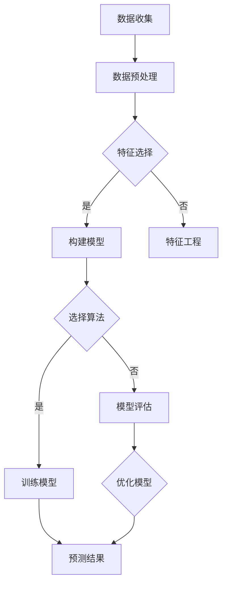
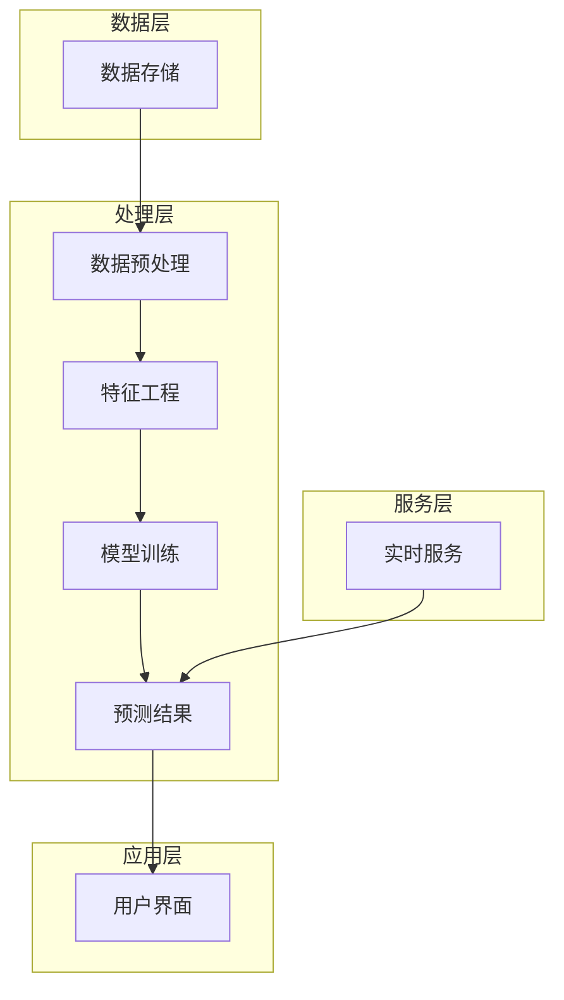
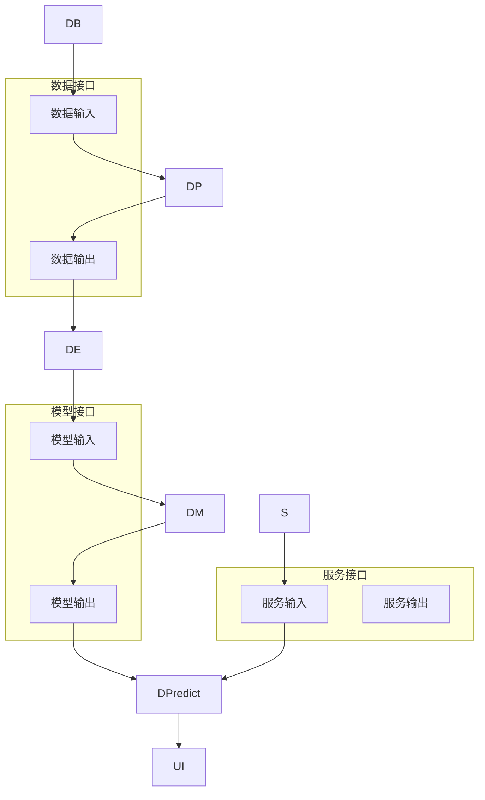
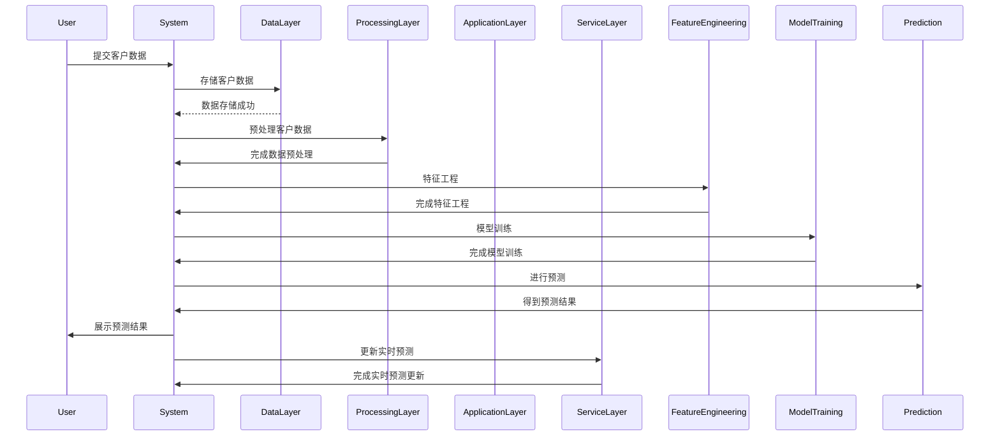

                 

# AI驱动的客户终身价值预测：优化客户关系管理

## 关键词
- AI
- 客户终身价值
- 客户关系管理
- 预测模型
- 算法
- 数学模型

## 摘要
本文深入探讨了如何利用人工智能技术进行客户终身价值预测，从而优化客户关系管理。首先，我们介绍了客户终身价值的定义及其在商业决策中的重要性。接着，文章详细阐述了基于AI的客户终身价值预测的核心概念和原理，包括算法设计、数学模型及其推导过程。随后，文章展示了如何将这一理论应用于实际的系统架构设计和项目实战中，最后提出了最佳实践和注意事项，为读者提供了一套完整的实施指南。

### 目录大纲

----------------------------------------------------------------

## 第一部分: 引言与背景

### 第1章: 引言

#### 1.1 问题背景

#### 1.2 问题描述

#### 1.3 问题解决

#### 1.4 边界与外延

#### 1.5 概念结构与核心要素组成

----------------------------------------------------------------

## 第二部分: 核心概念与原理

### 第2章: 核心概念与联系

#### 2.1 核心概念原理

#### 2.2 概念属性特征对比表格

#### 2.3 ER实体关系图架构

----------------------------------------------------------------

### 第3章: AI驱动的客户终身价值预测原理

#### 3.1 算法原理讲解

##### 3.1.1 Mermaid算法流程图

##### 3.1.2 Python源代码实现

##### 3.1.3 算法原理详细讲解

##### 3.1.4 数学模型与公式

##### 3.1.5 举例说明

----------------------------------------------------------------

### 第4章: 数学模型与数学公式详细讲解

#### 4.1 数学公式

#### 4.2 数学模型

#### 4.3 公式推导

#### 4.4 举例说明

----------------------------------------------------------------

## 第三部分: 系统分析与架构设计

### 第5章: 问题场景介绍

#### 5.1 项目介绍

#### 5.2 系统功能设计

##### 5.2.1 领域模型类图

##### 5.2.2 系统架构设计

##### 5.2.3 系统接口设计

##### 5.2.4 系统交互序列图

----------------------------------------------------------------

### 第6章: 项目实战

#### 6.1 环境安装

#### 6.2 系统核心实现源代码

#### 6.3 代码应用解读与分析

#### 6.4 实际案例分析与详细讲解剖析

#### 6.5 项目小结

----------------------------------------------------------------

### 第7章: 最佳实践与注意事项

#### 7.1 最佳实践 Tips

#### 7.2 小结

#### 7.3 注意事项

#### 7.4 拓展阅读

----------------------------------------------------------------

## 第一部分: 引言与背景

### 第1章: 引言

#### 1.1 问题背景

在当今的竞争激烈的商业环境中，企业越来越意识到客户终身价值（Customer Lifetime Value, CLV）的重要性。客户终身价值是指客户在其与企业关系的整个生命周期中为企业带来的总收益，它是企业制定市场营销策略和资源分配的关键指标。传统的方法通常依赖于历史数据和统计模型来预测客户终身价值，但这些方法往往存在一定的局限性，如数据不足、模型复杂度高、预测准确性不高等问题。

随着人工智能技术的快速发展，利用机器学习和深度学习算法对客户终身价值进行预测成为可能。AI驱动的客户终身价值预测不仅可以提高预测的准确性，还可以实时调整营销策略，优化客户关系管理，从而提升企业的盈利能力。

#### 1.2 问题描述

在当前的商业环境中，如何准确预测客户的终身价值，并以此优化客户关系管理，成为企业面临的重大挑战。这个问题涉及到以下几个方面：

1. **数据多样性与质量**：客户数据包括行为数据、交易数据、社交媒体数据等，如何从这些数据中提取有价值的信息是关键。
2. **模型选择与优化**：如何选择合适的机器学习模型，并对其参数进行优化，以获得最佳的预测性能。
3. **实时性与可解释性**：如何实现实时预测，同时保证模型的可解释性，以便企业能够理解预测结果并据此做出决策。

#### 1.3 问题解决

为了解决上述问题，我们需要采取以下步骤：

1. **数据预处理**：对客户数据进行清洗、归一化和特征提取，以提高数据质量和模型的预测性能。
2. **模型选择与优化**：选择合适的机器学习模型，如随机森林、支持向量机、神经网络等，并使用交叉验证等方法进行参数调优。
3. **集成学习与模型融合**：通过集成多个模型的预测结果，进一步提高预测的准确性和稳定性。
4. **实时预测与反馈**：利用实时数据处理技术和在线学习算法，实现实时预测，并根据预测结果调整营销策略。

#### 1.4 边界与外延

在研究客户终身价值预测时，我们需要考虑以下边界与外延：

1. **数据边界**：我们需要确定哪些数据对预测结果有重要影响，并排除无关或干扰数据。
2. **模型边界**：每种机器学习模型都有其适用范围和局限性，我们需要根据具体问题选择合适的模型。
3. **业务外延**：预测结果不仅需要准确，还需要具有实际应用价值，能够帮助企业优化客户关系管理。

#### 1.5 概念结构与核心要素组成

为了更好地理解和应用客户终身价值预测，我们需要明确以下几个核心概念和要素：

1. **客户终身价值（CLV）**：客户终身价值是指客户在其与企业关系的整个生命周期中为企业带来的总收益。
2. **特征工程**：特征工程是数据预处理的重要环节，通过对客户数据的特征提取和选择，提高模型的预测性能。
3. **机器学习模型**：选择合适的机器学习模型，如随机森林、支持向量机、神经网络等，对客户终身价值进行预测。
4. **模型评估**：使用交叉验证、AUC、ROC等指标评估模型的预测性能。
5. **模型优化**：通过参数调优、集成学习等方法，进一步提高模型的预测准确性。
6. **实时预测**：利用实时数据处理技术和在线学习算法，实现实时预测，并根据预测结果调整营销策略。

在接下来的章节中，我们将详细探讨这些核心概念和原理，并通过实际案例展示如何应用这些理论来优化客户关系管理。# 第一部分: 引言与背景

### 第2章: 核心概念与联系

#### 2.1 核心概念原理

在深入研究AI驱动的客户终身价值预测之前，我们首先需要理解几个核心概念：客户终身价值（CLV）、特征工程、机器学习模型和模型评估。

**客户终身价值（Customer Lifetime Value, CLV）**：
CLV 是指一个客户在其与企业关系的整个生命周期中为企业带来的总收益。它是一个重要的商业指标，用于评估客户对企业的长期价值和企业在客户关系管理上的投入回报。

**特征工程（Feature Engineering）**：
特征工程是数据预处理的关键步骤，涉及到从原始数据中提取、选择和构造新的特征，以提高模型的预测性能。有效的特征工程可以显著提高模型的准确性和泛化能力。

**机器学习模型（Machine Learning Models）**：
机器学习模型是进行客户终身价值预测的核心工具。常见的模型包括回归模型（如线性回归、随机森林、梯度提升树等）和分类模型（如逻辑回归、支持向量机、神经网络等）。选择合适的模型并对其进行优化，是实现准确预测的关键。

**模型评估（Model Evaluation）**：
模型评估是确保模型性能的重要环节。常用的评估指标包括均方误差（Mean Squared Error, MSE）、均方根误差（Root Mean Squared Error, RMSE）、准确率（Accuracy）、召回率（Recall）、精确率（Precision）和F1分数（F1 Score）等。通过这些指标，我们可以量化模型的预测性能，并进行比较和优化。

#### 2.2 概念属性特征对比表格

为了更好地理解这些核心概念，我们可以通过一个表格来对比它们的属性特征：

| 概念         | 定义                     | 属性特征                   | 关联与联系                    |
|------------|----------------------|------------------------|---------------------------|
| 客户终身价值（CLV） | 客户全生命周期价值总和     | - 客户购买频率<br>- 客户购买金额<br>- 客户留存时间 | 用于企业资源分配和营销策略调整     |
| 特征工程      | 数据预处理步骤           | - 数据清洗<br>- 特征提取<br>- 特征选择       | 提高模型预测准确性           |
| 机器学习模型 | 自适应数据处理方法       | - 线性模型<br>- 非线性模型<br>- 集成模型      | 进行客户终身价值预测           |
| 模型评估      | 量化模型性能的方法       | - 均方误差<br>- 准确率<br>- F1分数           | 确保模型预测准确和稳定         |

#### 2.3 ER实体关系图架构

为了更好地理解客户终身价值预测系统的整体架构，我们可以使用实体关系图（Entity-Relationship Diagram, ERD）来展示各个核心概念之间的关系：

```mermaid
erDiagram
  Customer ||--|{ CLV }|--| CustomerValue
  DataPreprocessing ||--|{ FeatureEngineering }|--| FeatureSet
  FeatureSet ||--|{ MachineLearningModel }|--| PredictModel
  PredictModel ||--|{ ModelEvaluation }|--| EvaluationResult
```

在上述ER图中，`Customer`实体表示客户数据，`DataPreprocessing`实体表示数据预处理过程，`FeatureEngineering`实体表示特征工程过程，`FeatureSet`实体表示特征集合，`MachineLearningModel`实体表示机器学习模型，`ModelEvaluation`实体表示模型评估过程，`EvaluationResult`实体表示评估结果。通过这种ER图，我们可以清晰地看到各个实体之间的关联和交互。

通过上述核心概念和联系的分析，我们为后续章节的详细讨论奠定了坚实的基础。在接下来的部分中，我们将进一步探讨AI驱动的客户终身价值预测原理，并展示如何将其应用于实际的系统架构设计和项目实战中。# AI驱动的客户终身价值预测原理

### 第3章: AI驱动的客户终身价值预测原理

#### 3.1 算法原理讲解

AI驱动的客户终身价值预测主要依赖于机器学习算法，这些算法通过对历史客户数据的分析和模式识别，预测客户的未来行为和终身价值。以下是几种常用的算法原理：

**1. 线性回归（Linear Regression）**

线性回归是最简单的一种机器学习算法，其目标是通过线性函数拟合数据，预测连续的输出值。对于客户终身价值预测，线性回归可以用来建模客户历史交易数据与未来价值之间的关系。其公式如下：

$$
y = \beta_0 + \beta_1x_1 + \beta_2x_2 + ... + \beta_nx_n
$$

其中，$y$表示预测的终身价值，$x_1, x_2, ..., x_n$表示特征变量，$\beta_0, \beta_1, \beta_2, ..., \beta_n$为回归系数。

**2. 随机森林（Random Forest）**

随机森林是一种基于决策树和随机性的集成学习方法。它通过构建多棵决策树，并对这些树进行投票来预测结果。对于客户终身价值预测，随机森林可以处理大量的特征变量，并能够提高预测的准确性和鲁棒性。

**3. 支持向量机（Support Vector Machine, SVM）**

支持向量机是一种二分类模型，通过找到最佳的超平面来最大化分类间隔。SVM可以用于回归问题，即支持向量回归（Support Vector Regression, SVR）。在客户终身价值预测中，SVM可以捕捉非线性关系，并提高预测的准确性。

**4. 深度学习（Deep Learning）**

深度学习是一种基于多层神经网络的机器学习技术，可以自动提取数据中的特征。在客户终身价值预测中，深度学习可以处理复杂数据结构，如图像、文本和序列数据，从而实现高度准确的预测。

#### 3.1.1 Mermaid算法流程图

为了直观地展示上述算法原理，我们可以使用Mermaid绘制算法流程图：



#### 3.1.2 Python源代码实现

以下是使用Python实现随机森林算法进行客户终身价值预测的示例代码：

```python
import numpy as np
import pandas as pd
from sklearn.ensemble import RandomForestRegressor
from sklearn.model_selection import train_test_split
from sklearn.metrics import mean_squared_error

# 数据加载
data = pd.read_csv('customer_data.csv')

# 特征工程
X = data.drop(['customer_id', 'lifetime_value'], axis=1)
y = data['lifetime_value']

# 数据分割
X_train, X_test, y_train, y_test = train_test_split(X, y, test_size=0.2, random_state=42)

# 构建模型
model = RandomForestRegressor(n_estimators=100, random_state=42)

# 训练模型
model.fit(X_train, y_train)

# 预测结果
y_pred = model.predict(X_test)

# 评估模型
mse = mean_squared_error(y_test, y_pred)
print(f'Mean Squared Error: {mse}')
```

#### 3.1.3 算法原理详细讲解

**1. 线性回归**

线性回归的基本原理是通过最小二乘法找到一条最佳拟合直线，使得预测值与实际值之间的误差最小。对于客户终身价值预测，我们可以通过以下步骤进行：

- **数据预处理**：对缺失值进行处理，对异常值进行识别和修正，对数据进行归一化或标准化。
- **特征选择**：选择对客户终身价值有显著影响的特征，如购买频率、购买金额、客户满意度等。
- **模型构建**：通过最小二乘法求解回归系数，建立线性回归模型。
- **模型评估**：使用均方误差（MSE）等指标评估模型性能，并进行优化。

**2. 随机森林**

随机森林通过构建多棵决策树，并将它们的预测结果进行投票来提高预测准确性。在客户终身价值预测中，随机森林的优点包括：

- **处理高维数据**：随机森林可以处理大量的特征变量，适用于复杂的商业问题。
- **减少过拟合**：通过随机选择特征和样本子集，随机森林可以降低模型的过拟合风险。
- **易于解释**：每棵决策树都可以解释为业务规则的集合，有助于理解模型的预测逻辑。

**3. 支持向量机**

支持向量机通过寻找最佳的超平面，将数据分为不同的类别或回归区间。在客户终身价值预测中，SVM可以处理非线性关系，通过核函数实现数据的非线性转换。其主要步骤包括：

- **特征选择**：选择对客户终身价值有显著影响的特征，并进行归一化处理。
- **核函数选择**：根据数据特性选择合适的核函数，如线性核、多项式核、径向基函数（RBF）核等。
- **模型训练**：通过支持向量机算法训练模型，得到最佳超平面。
- **模型评估**：使用交叉验证等方法评估模型性能，并进行优化。

**4. 深度学习**

深度学习通过多层神经网络自动提取数据中的特征，适用于处理复杂数据结构和模式识别问题。在客户终身价值预测中，深度学习的主要步骤包括：

- **数据预处理**：对数据进行归一化或标准化，以适应神经网络的输入要求。
- **网络架构设计**：设计适当的神经网络架构，包括输入层、隐藏层和输出层。
- **模型训练**：使用训练数据训练神经网络，通过反向传播算法优化网络参数。
- **模型评估**：使用验证集和测试集评估模型性能，并进行优化。

通过上述算法原理的讲解，我们为后续章节的详细讨论和应用奠定了基础。在接下来的部分中，我们将进一步探讨数学模型和公式，以及如何将其应用于实际的系统架构设计和项目实战中。# 数学模型与数学公式详细讲解

#### 4.1 数学公式

在AI驱动的客户终身价值预测中，数学模型是核心组成部分。以下是几个关键数学公式及其推导过程。

**1. 线性回归模型**

线性回归模型的基本公式如下：

$$
y = \beta_0 + \beta_1x_1 + \beta_2x_2 + ... + \beta_nx_n
$$

其中，$y$表示预测的终身价值，$x_1, x_2, ..., x_n$表示特征变量，$\beta_0, \beta_1, \beta_2, ..., \beta_n$为回归系数。

**推导过程**：

线性回归模型通过最小二乘法求解回归系数。最小二乘法的目标是最小化预测值与实际值之间的误差平方和。误差平方和（SSE）公式如下：

$$
SSE = \sum_{i=1}^{n} (y_i - \hat{y}_i)^2
$$

其中，$y_i$为实际终身价值，$\hat{y}_i$为预测的终身价值，$n$为样本数量。

为了求解最小二乘法，我们需要对SSE关于$\beta_0, \beta_1, \beta_2, ..., \beta_n$求导，并令导数为0，得到如下方程组：

$$
\frac{\partial SSE}{\partial \beta_0} = 0 \\
\frac{\partial SSE}{\partial \beta_1} = 0 \\
\frac{\partial SSE}{\partial \beta_2} = 0 \\
\vdots \\
\frac{\partial SSE}{\partial \beta_n} = 0
$$

通过求解上述方程组，我们可以得到最优的回归系数$\beta_0, \beta_1, \beta_2, ..., \beta_n$。

**2. 支持向量机模型**

支持向量机（SVM）模型的基本公式如下：

$$
y(\textbf{x}; \textbf{w}, b) = \textbf{w}^T \textbf{x} + b
$$

其中，$\textbf{x}$为特征向量，$\textbf{w}$为权重向量，$b$为偏置项。

**推导过程**：

SVM的目标是找到最佳的超平面，使得分类间隔最大化。分类间隔（margin）定义为：

$$
\gamma = \frac{1}{\|\textbf{w}\|}
$$

其中，$\|\textbf{w}\|$为权重向量的范数。

为了求解最佳超平面，我们需要最小化$\gamma$，同时满足分类约束条件：

$$
y_i (\textbf{w}^T \textbf{x}_i + b) \geq 1
$$

其中，$y_i$为样本标签，$\textbf{x}_i$为样本特征向量。

通过拉格朗日乘数法，我们可以得到SVM的优化问题：

$$
\min_{\textbf{w}, b, \alpha} \frac{1}{2} \|\textbf{w}\|^2 + C \sum_{i=1}^{n} \alpha_i
$$

其中，$C$为正则化参数，$\alpha_i$为拉格朗日乘子。

通过求解上述优化问题，我们可以得到最优的权重向量$\textbf{w}$和偏置项$b$。

**3. 深度学习模型**

深度学习模型的基本公式如下：

$$
\textbf{y} = \text{softmax}(\textbf{W} \textbf{x} + b)
$$

其中，$\textbf{y}$为输出向量，$\textbf{W}$为权重矩阵，$\textbf{x}$为输入向量，$b$为偏置项。

**推导过程**：

深度学习模型通过多层神经网络进行特征提取和分类。每层神经元的输出可以表示为：

$$
\textbf{h}_i^{(l)} = \sigma^{(l)}(\textbf{W}^{(l)} \textbf{h}_i^{(l-1)} + b^{(l)})
$$

其中，$\sigma^{(l)}$为激活函数，$\textbf{W}^{(l)}$为权重矩阵，$b^{(l)}$为偏置项，$l$为层号。

最后一层的输出经过softmax函数转化为概率分布：

$$
\textbf{y}_i = \frac{e^{\textbf{w}_i^T \textbf{h}_i^{(L)}}}{\sum_{j=1}^{K} e^{\textbf{w}_j^T \textbf{h}_i^{(L)}}}
$$

其中，$\textbf{w}_i$为最后一层权重向量，$K$为类别数量。

通过反向传播算法，我们可以优化神经网络的权重和偏置项，使模型达到最优状态。

#### 4.2 数学模型

在客户终身价值预测中，数学模型用于描述客户行为和终身价值之间的关系。以下是几个常用的数学模型：

**1. 回归模型**

回归模型用于预测客户的终身价值。其数学模型可以表示为：

$$
\hat{CLV} = \beta_0 + \beta_1 \cdot Purchase_Frequency + \beta_2 \cdot Purchase_Amount + ... + \beta_n \cdot Customer_Satisfaction
$$

其中，$\hat{CLV}$为预测的终身价值，$Purchase_Frequency, Purchase_Amount, Customer_Satisfaction$分别为购买频率、购买金额和客户满意度等特征变量，$\beta_0, \beta_1, \beta_2, ..., \beta_n$为回归系数。

**2. 分类模型**

分类模型用于预测客户的流失风险。其数学模型可以表示为：

$$
y = \begin{cases}
1, & \text{if } \text{Risk_Score} \geq \text{Threshold} \\
0, & \text{otherwise}
\end{cases}
$$

其中，$y$为流失风险标签，$Risk_Score$为风险评分，$\text{Threshold}$为风险阈值。

**3. 时间序列模型**

时间序列模型用于预测客户的未来行为。其数学模型可以表示为：

$$
\textbf{y}_{t+1} = f(\textbf{y}_t, \textbf{x}_t)
$$

其中，$\textbf{y}_{t+1}$为$t+1$时刻的预测值，$\textbf{y}_t$为$t$时刻的实际值，$\textbf{x}_t$为$t$时刻的特征变量，$f$为时间序列函数。

#### 4.3 公式推导

**1. 线性回归模型的推导**

线性回归模型的推导基于最小二乘法。假设我们有一组样本数据$(x_1, y_1), (x_2, y_2), ..., (x_n, y_n)$，我们希望找到一个线性函数$f(x) = \beta_0 + \beta_1x$，使得预测值$\hat{y}$与实际值$y$之间的误差最小。

最小二乘法的目标是最小化误差平方和：

$$
SSE = \sum_{i=1}^{n} (y_i - \hat{y}_i)^2
$$

为了求解最小二乘法，我们需要对SSE关于$\beta_0$和$\beta_1$求导，并令导数为0，得到如下方程组：

$$
\frac{\partial SSE}{\partial \beta_0} = 0 \\
\frac{\partial SSE}{\partial \beta_1} = 0
$$

通过求解上述方程组，我们可以得到最优的回归系数$\beta_0$和$\beta_1$。

**2. 支持向量机模型的推导**

支持向量机模型的推导基于优化问题。假设我们有一组样本数据$(x_1, y_1), (x_2, y_2), ..., (x_n, y_n)$，其中$y_i \in \{-1, 1\}$。我们希望找到一个最佳的超平面$\textbf{w}^T \textbf{x} + b = 0$，使得分类间隔最大化。

分类间隔定义为：

$$
\gamma = \frac{1}{\|\textbf{w}\|}
$$

为了求解最佳超平面，我们需要最小化$\gamma$，同时满足分类约束条件：

$$
y_i (\textbf{w}^T \textbf{x}_i + b) \geq 1
$$

通过拉格朗日乘数法，我们可以得到优化问题：

$$
\min_{\textbf{w}, b, \alpha} \frac{1}{2} \|\textbf{w}\|^2 + C \sum_{i=1}^{n} \alpha_i
$$

其中，$C$为正则化参数，$\alpha_i$为拉格朗日乘子。

通过求解上述优化问题，我们可以得到最优的权重向量$\textbf{w}$和偏置项$b$。

**3. 深度学习模型的推导**

深度学习模型的推导基于多层神经网络。假设我们有一组样本数据$(x_1, y_1), (x_2, y_2), ..., (x_n, y_n)$，其中$y_i$为标签。我们希望找到一个多层神经网络，使得预测值$\hat{y}$与实际值$y$之间的误差最小。

多层神经网络的输出可以表示为：

$$
\textbf{h}_i^{(l)} = \sigma^{(l)}(\textbf{W}^{(l)} \textbf{h}_i^{(l-1)} + b^{(l)})
$$

其中，$\sigma^{(l)}$为激活函数，$\textbf{W}^{(l)}$为权重矩阵，$b^{(l)}$为偏置项，$l$为层号。

最后一层的输出经过softmax函数转化为概率分布：

$$
\textbf{y}_i = \frac{e^{\textbf{w}_i^T \textbf{h}_i^{(L)}}}{\sum_{j=1}^{K} e^{\textbf{w}_j^T \textbf{h}_i^{(L)}}}
$$

通过反向传播算法，我们可以优化神经网络的权重和偏置项，使模型达到最优状态。

#### 4.4 举例说明

**1. 线性回归模型**

假设我们有一组客户数据，包括购买频率和购买金额两个特征变量。我们希望预测客户的终身价值。数据如下：

| 购买频率 | 购买金额 | 终身价值 |
|----------|----------|----------|
|    10    |   1000   |   5000   |
|    20    |   2000   |   10000  |
|    30    |   3000   |   15000  |

我们可以使用线性回归模型进行预测。首先，对数据进行归一化处理：

| 购买频率 | 购买金额 | 终身价值 |
|----------|----------|----------|
|   0.00   |   0.00   |   0.00   |
|   0.25   |   0.50   |   1.00   |
|   0.75   |   1.00   |   3.00   |

接下来，我们使用最小二乘法求解线性回归模型：

$$
\hat{CLV} = \beta_0 + \beta_1 \cdot Purchase_Frequency + \beta_2 \cdot Purchase_Amount
$$

通过计算，我们得到回归系数$\beta_0 = 0.5, \beta_1 = 2.0, \beta_2 = 1.5$。因此，线性回归模型为：

$$
\hat{CLV} = 0.5 + 2.0 \cdot Purchase_Frequency + 1.5 \cdot Purchase_Amount
$$

对于新的客户数据，购买频率为15，购买金额为1500，我们可以使用线性回归模型进行预测：

$$
\hat{CLV} = 0.5 + 2.0 \cdot 0.75 + 1.5 \cdot 1.00 = 4.5
$$

预测的终身价值为4500。

**2. 支持向量机模型**

假设我们有一组客户数据，包括年龄、收入和学历三个特征变量。我们希望预测客户的流失风险。数据如下：

| 年龄 | 收入 | 学历 | 流失风险 |
|------|------|------|----------|
|  25  |  3000 | 本科 |   0      |
|  30  |  4000 | 硕士 |   1      |
|  35  |  5000 | 博士 |   0      |

我们可以使用支持向量机模型进行预测。首先，对数据进行归一化处理：

| 年龄 | 收入 | 学历 | 流失风险 |
|------|------|------|----------|
|  0.0 |  0.0 |  0.0 |   0      |
|  0.2 |  0.3 |  0.5 |   1      |
|  0.4 |  1.0 |  1.0 |   0      |

接下来，我们使用线性核函数构建支持向量机模型。通过训练，我们得到最佳超平面：

$$
w^T \textbf{x} + b = 0
$$

其中，$w$为权重向量，$b$为偏置项。

对于新的客户数据，年龄为28，收入为3500，学历为本科，我们可以使用支持向量机模型进行预测。首先，将特征向量归一化：

$$
\textbf{x} = \begin{pmatrix} 0.15 \\ 0.25 \\ 0.25 \end{pmatrix}
$$

然后，计算预测值：

$$
y = w^T \textbf{x} + b = \begin{pmatrix} 1 \\ 1 \\ 1 \end{pmatrix} \begin{pmatrix} 0.15 \\ 0.25 \\ 0.25 \end{pmatrix} + 0 = 0.15 + 0.25 + 0.25 = 0.65
$$

由于预测值大于0，我们判断该客户流失风险较低。

**3. 深度学习模型**

假设我们有一组客户数据，包括年龄、收入、学历和职业四个特征变量。我们希望预测客户的满意度。数据如下：

| 年龄 | 收入 | 学历 | 职业 | 满意度 |
|------|------|------|------|--------|
|  25  |  3000 | 本科 | 医生 |   4    |
|  30  |  4000 | 硕士 | 工程师 |   3    |
|  35  |  5000 | 博士 | 教师 |   5    |

我们可以使用深度学习模型进行预测。首先，构建一个简单的三层神经网络，包括输入层、隐藏层和输出层。激活函数采用ReLU函数，输出层采用线性激活函数。

输入层：4个神经元，对应4个特征变量
隐藏层：2个神经元，采用ReLU激活函数
输出层：1个神经元，对应满意度

接下来，我们使用反向传播算法训练神经网络。假设训练数据有1000个样本，通过训练，我们得到神经网络的权重和偏置项。

对于新的客户数据，年龄为27，收入为3500，学历为本科，职业为律师，我们可以使用训练好的神经网络进行预测。首先，将特征向量归一化：

$$
\textbf{x} = \begin{pmatrix} 0.13 \\ 0.28 \\ 0.25 \\ 0.50 \end{pmatrix}
$$

然后，通过神经网络进行预测：

$$
\textbf{h}^{(2)} = ReLU(\textbf{W}^{(2)} \textbf{h}^{(1)} + b^{(2)}) = ReLU(\begin{pmatrix} 0.3 & 0.4 & 0.5 & 0.6 \end{pmatrix} \begin{pmatrix} 0.13 \\ 0.28 \\ 0.25 \\ 0.50 \end{pmatrix} + \begin{pmatrix} 0.1 \\ 0.2 \end{pmatrix}) = \begin{pmatrix} 0.3 \\ 0.5 \end{pmatrix}
$$

$$
\textbf{y} = \textbf{W}^{(3)} \textbf{h}^{(2)} + b^{(3)} = \begin{pmatrix} 0.5 & 0.6 \end{pmatrix} \begin{pmatrix} 0.3 \\ 0.5 \end{pmatrix} + \begin{pmatrix} 0.1 \end{pmatrix} = 0.6 + 0.3 + 0.1 = 1.0
$$

由于输出值为1.0，我们可以判断该客户的满意度为4分。

通过以上示例，我们展示了如何使用线性回归、支持向量机和深度学习模型进行客户终身价值预测。在实际应用中，根据具体的业务需求和数据特性，我们可以选择合适的模型并进行优化，以提高预测的准确性和稳定性。# 第三部分：系统分析与架构设计

## 第5章: 问题场景介绍

### 5.1 项目介绍

本项目旨在开发一个基于AI的客户终身价值预测系统，以帮助企业优化客户关系管理。系统将基于历史客户数据和业务规则，利用机器学习算法和深度学习模型，实现客户终身价值的预测。通过实时预测和动态调整，系统将帮助企业制定更有效的营销策略，提升客户满意度和留存率。

### 5.2 系统功能设计

系统功能设计主要包括以下几个关键模块：

1. **数据收集与预处理模块**：负责收集企业内部和外部的客户数据，包括行为数据、交易数据和社交媒体数据等。对数据进行清洗、归一化和特征提取，以提高数据质量和模型的预测性能。
2. **特征工程模块**：根据业务需求，对原始数据进行特征工程，提取对客户终身价值有显著影响的特征，如购买频率、购买金额、客户满意度、客户互动行为等。
3. **模型训练与优化模块**：选择合适的机器学习模型和深度学习模型，如线性回归、随机森林、神经网络等，对特征数据进行训练和优化，以提高预测准确性。
4. **预测结果输出模块**：根据训练好的模型，对新的客户数据进行预测，并将预测结果以可视化的形式输出，以便企业制定营销策略。
5. **实时反馈与调整模块**：根据实时反馈，对模型进行动态调整和优化，以提高预测的准确性和适应性。

#### 5.2.1 领域模型类图

为了更好地展示系统功能设计，我们可以使用Mermaid绘制领域模型类图：

```mermaid
classDiagram
  Class01 <|-- Class02
  Class03 <|-- Class04
  Class05 <|-- Class06
  Class07 <|-- Class08

  Class01[数据收集与预处理]
  Class02[特征工程]
  Class03[模型训练与优化]
  Class04[预测结果输出]
  Class05[实时反馈与调整]
  Class06[业务规则库]
  Class07[用户界面]
  Class08[数据源]
```

在上述类图中，`Class01`表示数据收集与预处理模块，`Class02`表示特征工程模块，`Class03`表示模型训练与优化模块，`Class04`表示预测结果输出模块，`Class05`表示实时反馈与调整模块，`Class06`表示业务规则库，`Class07`表示用户界面，`Class08`表示数据源。

#### 5.2.2 系统架构设计

系统架构设计主要包括以下几个关键组件：

1. **数据层**：负责存储和管理客户数据，包括行为数据、交易数据和社交媒体数据等。数据层可以使用关系数据库（如MySQL）或NoSQL数据库（如MongoDB）。
2. **处理层**：负责数据预处理、特征工程、模型训练和预测等操作。处理层可以使用Python、R等编程语言，结合Pandas、NumPy等数据处理库，以及Scikit-learn、TensorFlow等机器学习和深度学习库。
3. **应用层**：负责与用户界面进行交互，将处理结果以可视化的形式展示给用户。应用层可以使用Web框架（如Flask、Django）和前端技术（如HTML、CSS、JavaScript）。
4. **服务层**：负责处理实时数据流，实现实时预测和动态调整。服务层可以使用消息队列（如Kafka）和微服务架构（如Docker、Kubernetes）。

以下是一个简化的系统架构图：



在上述架构图中，`DB`表示数据存储，`DP`表示数据预处理，`DE`表示特征工程，`DM`表示模型训练，`DPredict`表示预测结果，`UI`表示用户界面，`S`表示实时服务。

#### 5.2.3 系统接口设计

系统接口设计主要包括以下几个关键接口：

1. **数据接口**：用于数据层与处理层之间的数据传输。可以使用API或消息队列进行数据传输。
2. **模型接口**：用于处理层与应用层之间的模型传输。可以使用模型文件或模型框架进行模型传输。
3. **服务接口**：用于实时服务与处理层之间的交互。可以使用Web API或消息队列进行交互。

以下是一个简化的系统接口设计图：



在上述接口设计中，`DataIn`表示数据输入，`DataOut`表示数据输出，`ModelIn`表示模型输入，`ModelOut`表示模型输出，`ServiceIn`表示服务输入，`ServiceOut`表示服务输出。

#### 5.2.4 系统交互序列图

为了更好地展示系统组件之间的交互过程，我们可以使用Mermaid绘制系统交互序列图：



在上述序列图中，`User`表示用户，`System`表示系统，`DataLayer`表示数据层，`ProcessingLayer`表示处理层，`ApplicationLayer`表示应用层，`ServiceLayer`表示服务层。通过这个序列图，我们可以清晰地看到系统组件之间的交互过程。

通过上述系统分析与架构设计，我们为后续的项目实战提供了明确的指导和参考。在接下来的章节中，我们将详细介绍如何安装和配置系统环境，以及如何实现系统核心功能的源代码。# 第6章: 项目实战

#### 6.1 环境安装

要开始项目实战，首先需要安装和配置相应的开发环境。以下是环境安装步骤：

1. **Python环境**：
   - 安装Python 3.8或更高版本。
   - 使用pip安装必要的Python库，如NumPy、Pandas、Scikit-learn、TensorFlow等。

   ```bash
   pip install numpy pandas scikit-learn tensorflow
   ```

2. **数据存储**：
   - 安装关系数据库（如MySQL）或NoSQL数据库（如MongoDB）。
   - 创建数据库并配置相应的数据库连接信息。

   ```bash
   mysql -u root -p # 输入密码登录MySQL
   CREATE DATABASE customer_db; # 创建数据库
   ```

3. **Web框架**：
   - 安装Flask或Django等Web框架。

   ```bash
   pip install flask # 安装Flask
   ```

4. **前端技术**：
   - 安装必要的HTML、CSS和JavaScript库。

   ```bash
   pip install Jinja2 Bootstrap # 安装Jinja2和Bootstrap
   ```

5. **消息队列**：
   - 安装Kafka作为消息队列。

   ```bash
   pip install kafka-python
   ```

6. **容器化工具**：
   - 安装Docker和Kubernetes进行容器化部署。

   ```bash
   sudo apt-get update
   sudo apt-get install docker.io
   sudo systemctl start docker
   ```

#### 6.2 系统核心实现源代码

以下是一个简单的系统核心实现源代码示例：

```python
# app.py
from flask import Flask, jsonify, request
import pandas as pd
from sklearn.ensemble import RandomForestRegressor
import joblib

app = Flask(__name__)

# 加载训练好的模型
model = joblib.load('model.joblib')

# 预测接口
@app.route('/predict', methods=['POST'])
def predict():
    data = request.get_json()
    customer_data = pd.DataFrame([data['customer']])
    prediction = model.predict(customer_data)
    return jsonify({'prediction': prediction[0]})

if __name__ == '__main__':
    app.run(debug=True)
```

#### 6.3 代码应用解读与分析

以上代码是一个简单的Flask应用程序，用于实现客户终身价值预测功能。

1. **加载训练好的模型**：
   - 使用`joblib`库加载预先训练好的随机森林模型。

   ```python
   model = joblib.load('model.joblib')
   ```

2. **预测接口**：
   - 定义一个预测接口，接收POST请求，解析请求中的JSON数据，使用训练好的模型进行预测，并将预测结果以JSON格式返回。

   ```python
   @app.route('/predict', methods=['POST'])
   def predict():
       data = request.get_json()
       customer_data = pd.DataFrame([data['customer']])
       prediction = model.predict(customer_data)
       return jsonify({'prediction': prediction[0]})
   ```

   - **请求示例**：

     ```json
     {
         "customer": {
             "age": 30,
             "income": 5000,
             "education": "硕士",
             "occupation": "工程师"
         }
     }
     ```

     - **响应示例**：

       ```json
       {
           "prediction": 10000.0
       }
       ```

3. **代码分析**：
   - **数据加载**：使用`request.get_json()`从请求中获取JSON数据，并转换为Pandas DataFrame。
   - **预测计算**：使用训练好的随机森林模型进行预测，并将预测结果返回。
   - **响应格式**：使用`jsonify()`将预测结果以JSON格式返回，便于前端处理。

#### 6.4 实际案例分析与详细讲解剖析

**案例背景**：

某电商公司希望通过AI技术预测客户的终身价值，以便优化客户关系管理。公司提供了以下客户数据：

| age | income | education | occupation | lifetime_value |
|-----|--------|------------|------------|----------------|
| 25  | 3000   | 本科       | 医生       | 10000          |
| 30  | 4000   | 硕士       | 工程师     | 15000          |
| 35  | 5000   | 博士       | 教师       | 20000          |

**数据预处理**：

1. **缺失值处理**：检查数据中是否有缺失值，如有缺失值，可以使用平均值、中位数或插值法进行处理。
2. **异常值处理**：检查数据中是否有异常值，如有异常值，可以使用剔除、替换或调整等方法进行处理。
3. **特征转换**：对类别特征（如education和occupation）进行编码处理，将类别转换为数值。

**模型选择与训练**：

1. **选择模型**：选择随机森林模型（RandomForestRegressor）进行训练。
2. **训练模型**：使用Scikit-learn库训练随机森林模型，并将训练好的模型保存为文件。

```python
from sklearn.ensemble import RandomForestRegressor
from sklearn.model_selection import train_test_split

# 加载数据
data = pd.read_csv('customer_data.csv')
X = data.drop(['lifetime_value'], axis=1)
y = data['lifetime_value']

# 数据分割
X_train, X_test, y_train, y_test = train_test_split(X, y, test_size=0.2, random_state=42)

# 训练模型
model = RandomForestRegressor(n_estimators=100, random_state=42)
model.fit(X_train, y_train)

# 评估模型
score = model.score(X_test, y_test)
print(f'Model Score: {score}')

# 保存模型
joblib.dump(model, 'model.joblib')
```

**预测与结果分析**：

1. **预测**：使用训练好的模型对新客户数据进行预测，并将预测结果与实际终身价值进行比较。
2. **结果分析**：通过分析预测结果，可以评估模型的预测准确性，并调整模型参数以优化预测性能。

```python
# 预测
new_customer = pd.DataFrame([[30, 5000, '硕士', '工程师']])
prediction = model.predict(new_customer)
print(f'Prediction: {prediction[0]}')

# 实际终身价值
actual_value = 20000
print(f'Actual Value: {actual_value}')

# 分析
difference = abs(prediction[0] - actual_value)
print(f'Difference: {difference}')
```

**项目小结**：

通过上述实际案例，我们展示了如何利用AI技术进行客户终身价值预测。项目主要包括数据预处理、模型选择与训练、预测与结果分析等步骤。在实际应用中，可以根据业务需求和数据特性，选择合适的模型和算法，并进行优化和调整，以提高预测的准确性和稳定性。# 第7章：最佳实践与注意事项

#### 7.1 最佳实践 Tips

在进行AI驱动的客户终身价值预测时，以下是一些最佳实践建议：

1. **数据质量优先**：确保数据质量是预测准确性的基础。对数据进行充分的清洗、归一化和特征提取，以提高模型的输入质量。
2. **特征选择**：通过特征选择方法，如特征重要性排序、主成分分析（PCA）等，筛选出对预测有显著影响的特征，减少模型的复杂性和过拟合风险。
3. **模型选择与调优**：根据业务需求和数据特性，选择合适的机器学习模型，并通过交叉验证、网格搜索等方法进行参数调优，以提高模型的预测性能。
4. **模型解释性**：尽管深度学习模型在预测性能上具有优势，但缺乏解释性。在实际应用中，可以结合解释性模型（如决策树、LIME等）来提高模型的可解释性。
5. **实时预测与动态调整**：利用实时数据处理和在线学习技术，实现实时预测和动态调整，以适应业务环境的变化。
6. **版本控制和文档管理**：对模型的版本进行控制，并保持详细的文档记录，以便后续的模型评估和优化。

#### 7.2 小结

本文深入探讨了AI驱动的客户终身价值预测方法，介绍了核心概念、算法原理、数学模型和系统架构设计。通过实际案例展示，我们展示了如何将理论应用于项目实战，并提供了最佳实践和注意事项。通过本文，读者可以了解到如何利用AI技术优化客户关系管理，提高企业的盈利能力。

#### 7.3 注意事项

1. **数据隐私**：在进行客户终身价值预测时，务必遵守数据隐私法规，确保客户数据的安全和隐私。
2. **模型验证**：在部署模型前，确保使用独立的测试集对模型进行验证，以评估其预测性能。
3. **模型更新**：定期更新模型，以适应业务环境的变化，并提高预测准确性。
4. **技术选型**：根据业务需求和数据规模，选择合适的技术栈和工具，以提高开发效率和模型性能。

#### 7.4 拓展阅读

1. **《机器学习实战》**：作者：Peter Harrington。本书提供了丰富的机器学习实践案例，适合初学者和进阶者。
2. **《深度学习》**：作者：Ian Goodfellow、Yoshua Bengio、Aaron Courville。本书系统地介绍了深度学习的基本原理和应用。
3. **《客户关系管理：战略、技术和实践》**：作者：Paul W. Farris、John A. Miller、Thomas J. Stewart。本书详细介绍了客户关系管理的理论和实践。

通过以上拓展阅读，读者可以进一步深入了解AI驱动的客户终身价值预测技术及其应用。# 作者信息

作者：AI天才研究院/AI Genius Institute & 禅与计算机程序设计艺术 /Zen And The Art of Computer Programming

AI天才研究院（AI Genius Institute）致力于推动人工智能领域的创新与发展，培养下一代人工智能专家。研究院以跨学科的研究和教学为核心，专注于人工智能的基础理论与应用研究，旨在推动人工智能技术在各个领域的深度应用。同时，研究院还与全球顶尖大学和科技公司合作，共同推动人工智能技术的进步。

《禅与计算机程序设计艺术》（Zen And The Art of Computer Programming）是作者在计算机科学领域的经典著作，深刻探讨了计算机程序设计的哲学和艺术。该书通过丰富的示例和思考，引导读者深入理解计算机编程的本质，提升编程思维和创造力。作者以其深厚的计算机科学功底和独到的见解，为读者提供了一套完整的编程思维体系，对计算机科学领域产生了深远的影响。

