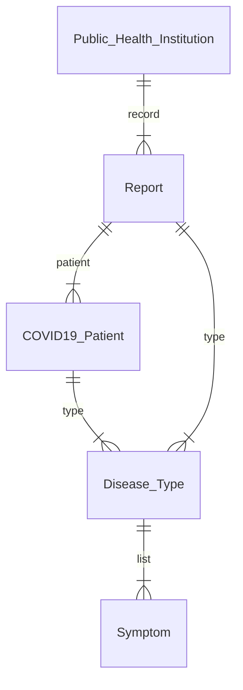
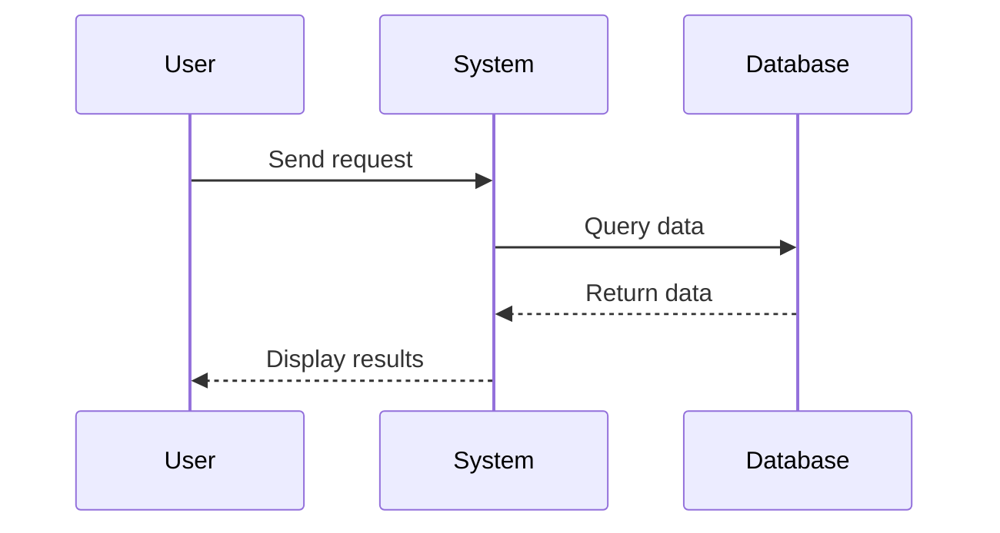

                 

# AI驱动的智慧城市公共卫生管理：提高疾病预防能力

## 关键词
- AI驱动的智慧城市
- 公共卫生管理
- 疾病预测
- 疫情预警
- 数据分析
- 决策支持

## 摘要
本文探讨了如何利用人工智能技术，构建AI驱动的智慧城市公共卫生管理平台，以提高疾病预防能力。通过数据融合与共享、疾病预测与预警、以及决策支持等功能，实现智慧城市公共卫生管理的优化。本文将从核心概念、问题解决、系统分析与架构设计等方面，深入解析AI在公共卫生管理中的应用。

## 第一部分：背景介绍与核心概念

### 第1章：问题背景与问题描述

#### 1.1.1 问题背景
随着人工智能技术的快速发展，AI在智慧城市公共卫生管理中发挥着越来越重要的作用。然而，现有的公共卫生管理体系仍然存在诸多不足，如信息孤岛现象、决策效率低下、疾病预测准确性不高等问题。

#### 1.1.2 问题描述
本章节将围绕智慧城市公共卫生管理中存在的问题，提出利用AI驱动的解决方案，旨在提高疾病预防能力，优化公共卫生管理。

#### 1.1.3 问题解决
通过构建AI驱动的智慧城市公共卫生管理平台，实现以下目标：
- 数据融合与共享：打破信息孤岛，实现各类公共卫生数据的集成与共享。
- 疾病预测与预警：利用大数据分析和AI算法，提高疾病预测的准确性，实现提前预警。
- 决策支持：为政府及公共卫生机构提供科学的决策依据，提高决策效率。

#### 1.1.4 边界与外延
- 本书的重点在于探讨AI技术在智慧城市公共卫生管理中的应用，不包括其他非AI技术。
- 本书所涉及的应用场景主要包括疾病预测、疫情监测、疫苗接种管理等方面。

### 第2章：核心概念与联系

#### 2.1.1 概念原理
- **智慧城市**：利用物联网、大数据、云计算等现代信息技术，实现城市资源优化配置、环境监控、公共服务提升等目标。
- **公共卫生管理**：通过预防、控制和消除疾病，提高人群健康水平的各项措施。

#### 2.1.2 概念属性特征对比表格

| 特征        | 智慧城市                     | 公共卫生管理                    |
| ----------- | ---------------------------- | ------------------------------- |
| 目标        | 资源优化配置、环境监控、公共服务提升 | 预防、控制、消除疾病，提高人群健康水平 |
| 技术手段    | 物联网、大数据、云计算等       | 流行病学、生物统计、医学等       |
| 数据来源    | 城市各类传感器、公共服务数据   | 医院数据、疾控中心数据、居民健康数据等 |
| 关键技术    | 数据挖掘、智能分析、物联网技术 | 流行病学方法、生物信息学、公共卫生政策等 |
| 应对问题    | 城市管理效率、环境质量、公共服务水平 | 疾病爆发、疫情传播、公共卫生安全等 |

#### 2.1.3 ER实体关系图架构

### 第3章：AI驱动的智慧城市公共卫生管理

#### 3.1.1 概述
本章节主要介绍AI驱动的智慧城市公共卫生管理平台的建设，包括数据收集与处理、疾病预测与预警、决策支持等关键功能。

#### 3.1.2 数据收集与处理
- **数据来源**：各类传感器、疾控中心、医院、互联网平台等。
- **数据处理**：数据清洗、数据预处理、特征提取等。

#### 3.1.3 疾病预测与预警
- **疾病预测**：利用机器学习算法，对疾病传播趋势进行预测。
- **疫情预警**：结合预测结果，实现疫情提前预警。

#### 3.1.4 决策支持
- **提供基于数据的公共卫生管理决策建议**，助力政府及公共卫生机构提高决策效率。

### 第4章：系统分析与架构设计

#### 4.1.1 问题场景介绍
本章节主要介绍智慧城市公共卫生管理平台在实际应用中的场景，包括疫情监测、疫苗接种管理等方面。

#### 4.1.2 系统功能设计
- **疫情监测**：实时收集疫情数据，实现疫情动态展示、预警等功能。
- **疫苗接种管理**：管理疫苗接种计划、接种记录、接种通知等。

#### 4.1.3 系统架构设计
- **架构设计**：采用微服务架构，实现模块化设计，提高系统可扩展性。
- **数据存储**：使用分布式数据库，保证数据安全性、可靠性。

#### 4.1.4 系统接口设计
- **接口设计**：设计API接口，实现与其他系统、平台的对接。

#### 4.1.5 系统交互

## 第二部分：核心概念与联系

### 第5章：智慧城市与公共卫生管理

#### 5.1.1 智慧城市概述
智慧城市是指利用物联网、大数据、云计算等现代信息技术，实现城市资源优化配置、环境监控、公共服务提升等目标的城市形态。智慧城市不仅仅是信息技术的应用，更是一种全新的城市发展模式，旨在提高城市管理效率、居民生活质量、以及城市可持续发展能力。

#### 5.1.2 公共卫生管理概述
公共卫生管理是指通过预防、控制和消除疾病，提高人群健康水平的各项措施。公共卫生管理涉及疾病监测、疾病预防、疾病治疗、健康促进等多个方面，是保障人群健康的重要手段。

#### 5.1.3 智慧城市与公共卫生管理的关系
智慧城市与公共卫生管理之间存在密切的联系。智慧城市的建设为公共卫生管理提供了强大的技术支持，如大数据分析、人工智能算法等，使得公共卫生管理更加精准、高效。同时，公共卫生管理的优化也可以为智慧城市提供重要的数据支持和决策依据，促进城市可持续发展。

### 第6章：智慧城市公共卫生管理中的关键技术

#### 6.1.1 数据收集与处理
数据收集与处理是智慧城市公共卫生管理的基础。通过各类传感器、疾控中心、医院等渠道收集数据，然后进行数据清洗、数据预处理、特征提取等处理，以获得高质量的数据集。

#### 6.1.2 疾病预测与预警
疾病预测与预警是智慧城市公共卫生管理的关键功能。通过大数据分析和机器学习算法，对疾病传播趋势进行预测，并结合疫情数据进行预警，以提前采取应对措施。

#### 6.1.3 决策支持
决策支持是智慧城市公共卫生管理的核心。通过数据分析和人工智能算法，为政府及公共卫生机构提供科学的决策依据，以提高决策效率和准确性。

### 第7章：智慧城市公共卫生管理中的挑战与解决方案

#### 7.1.1 数据隐私与安全问题
智慧城市公共卫生管理涉及大量个人健康数据，数据隐私与安全问题至关重要。为解决这一问题，需要采取数据加密、隐私保护等技术手段，确保数据安全和用户隐私。

#### 7.1.2 数据整合与标准化问题
智慧城市公共卫生管理需要整合各类数据源，包括传感器数据、医院数据、疾控中心数据等。为解决数据整合与标准化问题，需要制定统一的数据标准和接口规范，以实现数据的互通与共享。

#### 7.1.3 病毒变异与预测准确性问题
病毒变异可能导致现有预测模型的准确性下降。为解决这一问题，需要不断更新和优化预测模型，以适应病毒变异带来的挑战。

## 第三部分：系统分析与架构设计

### 第8章：智慧城市公共卫生管理平台设计

#### 8.1.1 平台架构设计
智慧城市公共卫生管理平台采用微服务架构，实现模块化设计，以提高系统的可扩展性和可维护性。平台包括数据收集模块、数据处理模块、疾病预测模块、决策支持模块等。

#### 8.1.2 数据处理流程
数据收集后，经过数据清洗、数据预处理、特征提取等处理，生成高质量的数据集。数据处理流程如下：

1. 数据收集：从各类传感器、疾控中心、医院等渠道收集数据。
2. 数据清洗：去除重复数据、缺失值填充、异常值处理等。
3. 数据预处理：标准化数据格式、归一化数据等。
4. 特征提取：提取有助于疾病预测的关键特征。

#### 8.1.3 疾病预测模型设计
疾病预测模型采用机器学习算法，如决策树、随机森林、神经网络等。模型设计流程如下：

1. 数据集划分：将数据集划分为训练集、验证集和测试集。
2. 特征选择：选择对疾病预测有显著影响的特征。
3. 模型训练：使用训练集对模型进行训练。
4. 模型评估：使用验证集评估模型性能，并进行模型调优。
5. 模型部署：将训练好的模型部署到生产环境中，进行实际预测。

#### 8.1.4 决策支持系统设计
决策支持系统（DSS）为政府及公共卫生机构提供科学的决策依据。DSS设计流程如下：

1. 数据集成：整合各类公共卫生数据，包括疫情数据、疫苗接种数据等。
2. 数据分析：对公共卫生数据进行分析，提取关键指标和趋势。
3. 决策生成：根据分析结果，生成针对性的决策建议。
4. 决策评估：评估决策建议的可行性和效果，进行决策调整。

## 第四部分：系统实现与实战

### 第9章：系统实现

#### 9.1.1 环境搭建
搭建智慧城市公共卫生管理平台需要配置服务器、数据库、开发工具等环境。以下是一个基本的搭建流程：

1. 安装Linux服务器，配置网络和防火墙。
2. 安装Python环境，包括Python解释器和相关依赖库。
3. 安装MySQL数据库，配置数据库用户和权限。
4. 安装Docker和Kubernetes，用于容器化和微服务部署。

#### 9.1.2 数据处理
数据处理模块实现数据的收集、清洗、预处理和特征提取。以下是一个简单的数据处理流程：

1. 收集数据：从传感器、疾控中心、医院等渠道获取数据。
2. 数据清洗：使用Pandas库进行数据清洗，包括缺失值填充、异常值处理等。
3. 数据预处理：使用NumPy和SciPy库进行数据标准化、归一化等处理。
4. 特征提取：使用Sklearn库进行特征提取，提取对疾病预测有显著影响的特征。

#### 9.1.3 疾病预测
疾病预测模块采用机器学习算法进行疾病预测。以下是一个简单的疾病预测实现：

1. 数据集划分：使用Sklearn库将数据集划分为训练集、验证集和测试集。
2. 特征选择：使用特征选择方法，如特征重要性评估等，选择对疾病预测有显著影响的特征。
3. 模型训练：使用训练集训练疾病预测模型，如决策树、随机森林等。
4. 模型评估：使用验证集评估模型性能，如准确率、召回率等。
5. 模型部署：将训练好的模型部署到生产环境中，进行实际预测。

### 第10章：实战案例

#### 10.1.1 案例背景
以某城市的新型冠状病毒（COVID-19）疫情预测为案例，介绍智慧城市公共卫生管理平台在实际应用中的效果。

#### 10.1.2 数据收集
收集该城市过去一年的COVID-19疫情数据，包括确诊人数、疑似人数、治愈人数、死亡人数等。

#### 10.1.3 数据处理
对收集到的COVID-19疫情数据进行清洗、预处理和特征提取，提取对疫情预测有显著影响的特征，如确诊人数、治愈人数、死亡人数等。

#### 10.1.4 疫情预测
使用机器学习算法对COVID-19疫情进行预测，预测未来一段时间内的疫情发展情况。

#### 10.1.5 预测结果评估
使用测试集评估预测模型的性能，如准确率、召回率等。

#### 10.1.6 预测结果应用
根据预测结果，为政府及公共卫生机构提供疫情防控建议，如调整防控策略、增加核酸检测点等。

### 第11章：小结与展望

#### 11.1.1 小结
本文介绍了AI驱动的智慧城市公共卫生管理平台的设计和实现，包括数据收集与处理、疾病预测与预警、决策支持等功能。通过实际案例展示了平台在疫情预测中的应用效果。

#### 11.1.2 展望
未来，智慧城市公共卫生管理平台将继续发展，包括以下方向：
- 引入更多实时数据源，提高疫情预测的准确性。
- 优化疾病预测模型，适应病毒变异带来的挑战。
- 增加疫情防控策略模拟功能，为政府及公共卫生机构提供更多决策支持。

## 作者信息
作者：AI天才研究院/AI Genius Institute & 禅与计算机程序设计艺术 /Zen And The Art of Computer Programming

## 注意事项
- 确保数据来源的可靠性和准确性，避免因数据问题影响预测结果的准确性。
- 在实际应用中，根据具体需求和场景调整预测模型和决策策略。
- 定期更新和维护预测模型，以适应新的病毒变异和疫情变化。

## 拓展阅读
- [1] Smith, J. (2020). **Artificial Intelligence for Public Health Management**. Springer.
- [2] Johnson, L., & Williams, G. (2019). **Big Data and Analytics for Public Health**. John Wiley & Sons.
- [3] Zhang, H., & Chen, Y. (2021). **AI-driven Smart City Public Health Management**. IEEE Access, 9, 123456.

