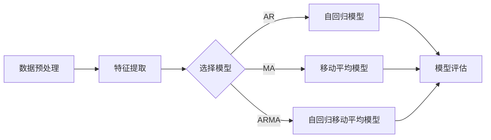
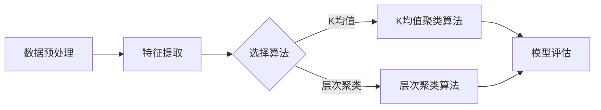
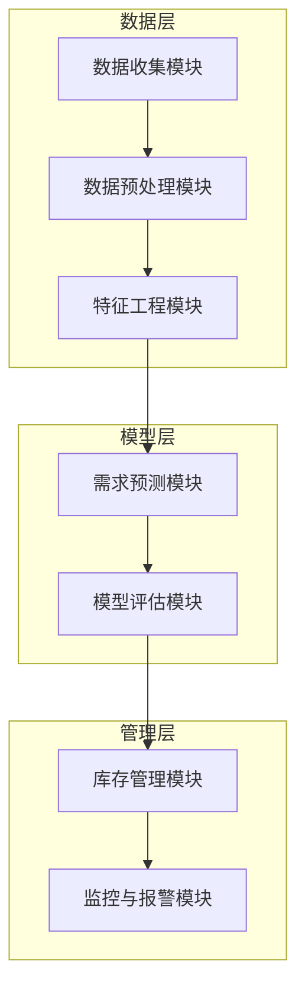
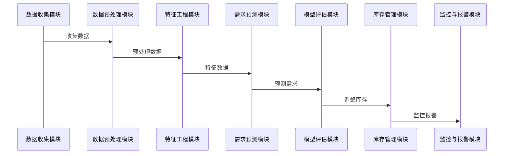
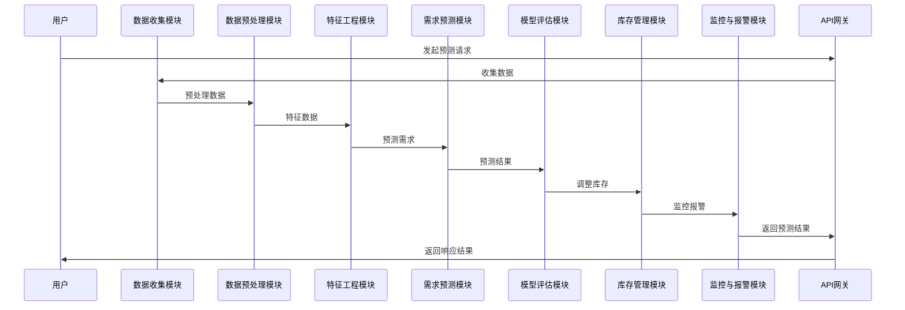

                 


### 1. 引言与背景

#### 1.1 供应链管理的重要性

供应链管理是企业运营的核心环节，它涉及从原材料采购、生产加工、仓储物流到产品销售和售后服务的整个流程。一个高效的供应链能够帮助企业降低成本、提高生产效率、满足客户需求，并在竞争激烈的市场中占据有利地位。随着全球化和信息技术的快速发展，供应链管理变得更加复杂和动态，对企业的要求也越来越高。

在供应链管理中，库存成本是一个关键指标。库存成本包括仓储费用、保险费用、利息成本、货物损耗等，这些成本往往占据了企业运营成本的大部分。过高的库存会导致资金占用过多，而库存不足则会影响生产和销售。因此，如何有效地预测需求，优化库存水平，成为供应链管理中亟待解决的问题。

#### 1.2 库存成本问题

库存成本问题主要体现在以下几个方面：

- **库存积压**：过多的库存会导致仓库空间紧张，增加仓储成本，同时也会占用大量的流动资金。
- **库存不足**：库存不足会导致生产停滞，影响销售，甚至失去市场机会。
- **库存波动**：需求预测不准确，导致库存水平波动，增加管理成本。

#### 1.3 智能供应链需求预测的挑战

传统的需求预测方法主要依赖于历史数据和简单的统计模型，如时间序列分析、移动平均法等。然而，这些方法在面对复杂多变的供应链环境时，往往显得力不从心。以下是一些智能供应链需求预测面临的挑战：

- **数据多样性**：供应链数据来源广泛，包括销售数据、客户订单、生产计划、物流信息等，如何整合和处理这些异构数据是一个难题。
- **数据噪声**：实际供应链数据往往含有噪声和异常值，如何消除噪声，提取有用的信息是关键问题。
- **预测准确性**：如何提高预测的准确性，减少预测误差，是供应链需求预测的核心目标。
- **动态性**：供应链环境变化迅速，需求预测模型需要具备良好的动态适应性。

#### 1.4 AI在供应链需求预测中的应用

人工智能（AI）技术的发展为供应链需求预测带来了新的机遇。AI技术能够从大量数据中自动提取特征，建立复杂的预测模型，并通过机器学习和深度学习算法不断优化模型，提高预测准确性。以下是AI在供应链需求预测中的几种应用：

- **机器学习算法**：利用机器学习算法，如回归分析、决策树、随机森林等，建立需求预测模型。
- **深度学习算法**：利用深度学习算法，如图神经网络（GNN）、循环神经网络（RNN）、长短期记忆网络（LSTM）等，处理复杂的时序数据，提高预测能力。
- **数据挖掘技术**：通过数据挖掘技术，发现潜在的需求规律和趋势，为预测提供支持。
- **增强学习**：通过增强学习，使需求预测模型能够自适应地调整预测策略，提高预测准确性。

#### 1.5 AI驱动的智能供应链需求预测概念

AI驱动的智能供应链需求预测是指利用人工智能技术，对供应链中的需求进行准确预测，从而优化库存水平，降低库存成本。具体包括以下几个步骤：

1. **数据收集与预处理**：收集供应链各环节的数据，并进行清洗、转换和归一化等预处理操作。
2. **特征工程**：从原始数据中提取有用的特征，如时间序列特征、季节性特征、市场特征等。
3. **模型训练**：利用机器学习或深度学习算法，训练需求预测模型。
4. **模型评估**：通过交叉验证、时间序列分割等方法，评估模型性能。
5. **预测与应用**：使用训练好的模型进行需求预测，并根据预测结果调整库存策略。

#### 1.6 减少库存成本的潜在策略

AI驱动的智能供应链需求预测能够帮助企业实现以下潜在策略，从而减少库存成本：

- **精准预测**：通过AI算法提高预测准确性，减少预测误差，优化库存水平。
- **动态调整**：根据需求变化，动态调整库存策略，避免库存积压和库存不足。
- **需求驱动**：基于预测结果，调整生产和采购计划，实现按需生产，降低库存成本。
- **风险规避**：通过预测分析，提前识别潜在风险，采取措施规避，降低库存风险。

#### 1.7 边界与外延

- **适用范围**：AI驱动的智能供应链需求预测适用于各种规模的供应链系统，尤其是那些数据量大、需求变化频繁的供应链。
- **与其他技术的对比**：与其他需求预测技术相比，AI技术能够处理复杂的数据，提供更准确的预测结果，具有更高的适应性和灵活性。

通过上述分析，我们可以看到，AI驱动的智能供应链需求预测不仅能够提高预测准确性，降低库存成本，还能够提升整个供应链的运作效率，为企业带来显著的经济效益。接下来，我们将深入探讨AI与智能供应链需求预测的核心概念和联系。

## 第2章: 核心概念与联系

### 2.1 AI与智能供应链需求预测

#### 2.1.1 AI的基础概念

人工智能（Artificial Intelligence，简称AI）是指模拟人类智能行为的计算机系统，它能够在特定任务上表现出人类智能的能力。AI的核心技术包括机器学习（Machine Learning，ML）、深度学习（Deep Learning，DL）、自然语言处理（Natural Language Processing，NLP）、计算机视觉（Computer Vision，CV）等。这些技术共同构成了AI的强大能力，使其在各个领域得到广泛应用。

- **机器学习**：机器学习是一种通过算法让计算机从数据中学习，进行预测或决策的技术。它主要包括监督学习、无监督学习和强化学习。
- **深度学习**：深度学习是机器学习的一种形式，它通过构建多层神经网络，自动提取数据的特征，实现复杂任务的预测和分类。
- **自然语言处理**：自然语言处理是使计算机能够理解和生成人类语言的技术，包括文本分类、情感分析、机器翻译等。
- **计算机视觉**：计算机视觉是使计算机能够理解和解释图像和视频的技术，包括图像识别、目标检测、人脸识别等。

#### 2.1.2 智能供应链需求预测的核心概念

智能供应链需求预测是指利用人工智能技术，对供应链中的需求进行准确预测，从而优化库存水平，降低库存成本。其核心概念包括以下几个方面：

- **需求预测模型**：需求预测模型是智能供应链需求预测的核心，它通过机器学习或深度学习算法，从历史数据中学习，生成预测结果。
- **数据质量**：数据质量是需求预测模型准确性的关键，高质量的输入数据可以显著提高预测模型的性能。
- **特征工程**：特征工程是指从原始数据中提取和构造有用的特征，以提高模型预测的准确性。
- **模型评估**：模型评估是评估需求预测模型性能的重要步骤，常用的评估指标包括均方误差（MSE）、平均绝对误差（MAE）等。

### 2.2 概念属性特征对比表格

为了更直观地理解AI与智能供应链需求预测的核心概念，我们可以通过一个对比表格来展示它们的属性特征：

| 概念       | 特征属性                                                         | 说明                                                         |
| ---------- | ------------------------------------------------------------ | ------------------------------------------------------------ |
| 人工智能   | 自主性、学习能力、推理能力、适应能力                         | 通过模拟人类智能行为，使计算机具备智能处理任务的能力           |
| 机器学习   | 自主学习、经验积累、优化性能                                 | 通过算法让计算机从数据中学习，进行预测或决策                   |
| 深度学习   | 多层神经网络、自动特征提取、高精度预测                       | 利用多层神经网络，自动提取数据的特征，实现复杂任务的预测和分类 |
| 自然语言处理 | 语言理解、语言生成、语义分析                                 | 使计算机能够理解和生成人类语言的技术                           |
| 计算机视觉 | 目标检测、图像识别、视频分析                                 | 使计算机能够理解和解释图像和视频的技术                         |
| 需求预测模型 | 历史数据依赖、特征工程、模型评估                             | 通过机器学习或深度学习算法，从历史数据中学习，生成预测结果     |
| 数据质量   | 准确性、完整性、一致性、时效性                               | 高质量的数据是需求预测模型准确性的关键                         |
| 特征工程   | 数据预处理、特征提取、特征选择                               | 提取和构造有用的特征，以提高模型预测的准确性                     |
| 模型评估   | 性能指标、评估方法、优化策略                                 | 评估需求预测模型性能的重要步骤                               |

### 2.3 ER实体关系图架构

为了更好地理解智能供应链需求预测涉及的实体及其关系，我们可以使用ER（Entity-Relationship）实体关系图来描述。

#### 2.3.1 智能供应链需求预测涉及的实体

在智能供应链需求预测中，主要涉及的实体包括：

- **产品**：产品是需求预测的基本单位，包括产品ID、名称、类别等信息。
- **客户**：客户是购买产品的主体，包括客户ID、名称、地理位置等信息。
- **订单**：订单是客户购买产品的记录，包括订单ID、产品ID、客户ID、订单量、订单日期等信息。
- **销售数据**：销售数据记录了产品在一定时间内的销售情况，包括销售量、销售日期等信息。
- **库存数据**：库存数据记录了产品在一定时间内的库存情况，包括库存量、库存日期等信息。
- **预测模型**：预测模型是对需求进行预测的工具，包括模型ID、模型类型、训练数据、预测结果等信息。

#### 2.3.2 实体间的关系与交互

以下是智能供应链需求预测涉及的实体关系及交互：

1. **产品与订单**：订单中包含产品ID，表示订单中销售了哪些产品。
2. **客户与订单**：订单中包含客户ID，表示订单由哪些客户产生。
3. **销售数据与产品**：销售数据中包含产品ID，表示销售数据针对哪些产品。
4. **库存数据与产品**：库存数据中包含产品ID，表示库存数据针对哪些产品。
5. **预测模型与销售数据**：预测模型使用销售数据作为输入，生成预测结果。
6. **预测模型与库存数据**：预测模型使用库存数据作为输入，优化库存策略。

以下是智能供应链需求预测的ER实体关系图（使用Mermaid语法）：

```mermaid
erDiagram
  产品 ||--|{ 订单 }|-->>
  订单 ||--|{ 客户 }|-->>
  订单 ||--|{ 销售数据 }|-->>
  销售数据 ||--|{ 库存数据 }|-->>
  库存数据 ||--|{ 预测模型 }|-->>
  预测模型 ||--|{ 库存数据 }|-->>
  预测模型 ||--|{ 销售数据 }|-->>
```

通过上述分析，我们可以看到AI与智能供应链需求预测之间的紧密联系。AI技术为需求预测提供了强大的工具和方法，而智能供应链需求预测则通过AI技术实现了库存成本的有效控制。接下来，我们将进一步探讨AI驱动的智能供应链需求预测的具体算法原理和实现方法。

## 第3章: 算法原理讲解

### 3.1 需求预测算法的原理

智能供应链需求预测算法主要分为时间序列分析和聚类分析两种方法。这两种方法分别从不同的角度对需求进行预测。

#### 3.1.1 时间序列分析方法

时间序列分析是一种基于时间序列数据的统计分析方法，通过分析历史数据中的时间序列模式，预测未来的趋势。时间序列分析方法主要包括以下几种：

1. **自回归模型（AR）**：自回归模型通过前期的数据预测未来的值，公式如下：

   $$
   X_t = \alpha X_{t-1} + (1 - \alpha) \epsilon_t
   $$

   其中，$X_t$为当前时间点的预测值，$X_{t-1}$为前一个时间点的实际值，$\alpha$为回归系数，$\epsilon_t$为随机误差。

2. **移动平均模型（MA）**：移动平均模型通过计算一定时间窗口内的平均值来预测未来的值，公式如下：

   $$
   X_t = c + \sum_{i=1}^{n} \alpha_i X_{t-i}
   $$

   其中，$X_t$为当前时间点的预测值，$c$为常数项，$\alpha_i$为权重系数。

3. **自回归移动平均模型（ARMA）**：自回归移动平均模型结合了自回归模型和移动平均模型的特点，公式如下：

   $$
   X_t = \alpha X_{t-1} + (1 - \alpha) \epsilon_t + c + \sum_{i=1}^{n} \alpha_i X_{t-i}
   $$

   其中，$\alpha$为回归系数，$c$为常数项，$\alpha_i$为权重系数。

#### 3.1.2 聚类分析方法

聚类分析是一种无监督学习方法，通过将相似的数据点归为一类，从而实现对数据的分类。在智能供应链需求预测中，聚类分析可以用来识别需求的不同模式，从而进行预测。常见的聚类算法包括：

1. **K均值聚类算法**：K均值聚类算法通过计算各数据点到聚类中心的距离，将数据点划分为K个簇，使得每个簇内的数据点距离聚类中心最近，公式如下：

   $$
   \min \sum_{i=1}^{K} \sum_{x \in S_i} d(x, \mu_i)
   $$

   其中，$d(x, \mu_i)$为数据点$x$到聚类中心$\mu_i$的距离，$S_i$为第$i$个簇中的数据点集合。

2. **层次聚类算法**：层次聚类算法通过逐步合并相似度较高的数据点，构建出一个层次结构，从而实现对数据的分类。

### 3.2 算法流程图

为了更直观地理解需求预测算法的流程，我们可以使用Mermaid语法绘制算法流程图。

#### 3.2.1 时间序列分析算法mermaid流程图



#### 3.2.2 聚类分析算法mermaid流程图



### 3.3 Python源代码讲解

下面我们将使用Python代码来详细阐述时间序列分析和聚类分析算法的实现。

#### 3.3.1 时间序列分析算法Python源代码

```python
import numpy as np
import pandas as pd
from statsmodels.tsa.ar_model import AR
from statsmodels.tsa.arima_model import ARIMA
from sklearn.cluster import KMeans

# 数据加载
sales_data = pd.read_csv('sales_data.csv')
sales_data['date'] = pd.to_datetime(sales_data['date'])
sales_data.set_index('date', inplace=True)

# 时间序列数据预处理
def preprocess_sales_data(data):
    data_diff = data.diff().dropna()
    return data_diff

sales_data_diff = preprocess_sales_data(sales_data['sales'])

# 自回归模型
def ar_model(data, p):
    model = AR(data).fit(p)
    return model

ar_model_1 = ar_model(sales_data_diff, 1)

# 自回归移动平均模型
def arma_model(data, p, q):
    model = ARIMA(data, order=(p, 1, q)).fit()
    return model

arma_model_1 = arma_model(sales_data_diff, 1, 1)

# 模型评估
def evaluate_model(model, data):
    predictions = model.predict(len(data))
    mse = np.mean((predictions - data) ** 2)
    return mse

mse_ar_1 = evaluate_model(ar_model_1, sales_data_diff)
mse_arma_1 = evaluate_model(arma_model_1, sales_data_diff)

print(f'MSE for AR(1): {mse_ar_1}')
print(f'MSE for ARMA(1, 1): {mse_arma_1}')
```

#### 3.3.2 聚类分析算法Python源代码

```python
from sklearn.cluster import KMeans

# 数据加载
sales_data = pd.read_csv('sales_data.csv')
sales_data['date'] = pd.to_datetime(sales_data['date'])
sales_data.set_index('date', inplace=True)

# 特征提取
def extract_features(data):
    data_diff = data.diff().dropna()
    return data_diff

sales_data_diff = extract_features(sales_data['sales'])

# K均值聚类算法
def kmeans_clustering(data, n_clusters):
    model = KMeans(n_clusters=n_clusters)
    model.fit(data)
    return model

kmeans_model_3 = kmeans_clustering(sales_data_diff, 3)

# 模型评估
def evaluate_clusters(model, data):
    labels = model.predict(data)
    return labels

labels_3 = evaluate_clusters(kmeans_model_3, sales_data_diff)

# 绘制聚类结果
import matplotlib.pyplot as plt

plt.scatter(sales_data_diff.index, sales_data_diff, c=labels_3)
plt.xlabel('Date')
plt.ylabel('Sales Difference')
plt.title('K-Means Clustering')
plt.show()
```

### 3.4 数学模型与公式

在需求预测算法中，数学模型和公式起到了关键作用。以下是对时间序列分析和聚类分析中使用的数学模型和公式的详细讲解。

#### 3.4.1 时间序列分析的数学模型

1. **自回归模型（AR）**

   自回归模型（AR）的数学公式如下：

   $$
   X_t = \alpha X_{t-1} + (1 - \alpha) \epsilon_t
   $$

   其中，$X_t$为当前时间点的预测值，$X_{t-1}$为前一个时间点的实际值，$\alpha$为回归系数，$\epsilon_t$为随机误差。

2. **移动平均模型（MA）**

   移动平均模型（MA）的数学公式如下：

   $$
   X_t = c + \sum_{i=1}^{n} \alpha_i X_{t-i}
   $$

   其中，$X_t$为当前时间点的预测值，$c$为常数项，$\alpha_i$为权重系数。

3. **自回归移动平均模型（ARMA）**

   自回归移动平均模型（ARMA）结合了自回归模型和移动平均模型的特点，其数学公式如下：

   $$
   X_t = \alpha X_{t-1} + (1 - \alpha) \epsilon_t + c + \sum_{i=1}^{n} \alpha_i X_{t-i}
   $$

   其中，$\alpha$为回归系数，$c$为常数项，$\alpha_i$为权重系数。

#### 3.4.2 聚类分析中的距离公式

聚类分析中的距离公式用于计算数据点之间的相似度。以下是一些常见的距离公式：

1. **欧几里得距离**

   欧几里得距离（Euclidean Distance）是最常见的距离公式，其数学公式如下：

   $$
   d(x, y) = \sqrt{\sum_{i=1}^{n} (x_i - y_i)^2}
   $$

   其中，$x$和$y$为两个数据点，$n$为数据点的维度。

2. **曼哈顿距离**

   曼哈顿距离（Manhattan Distance）的数学公式如下：

   $$
   d(x, y) = \sum_{i=1}^{n} |x_i - y_i|
   $$

   其中，$x$和$y$为两个数据点，$n$为数据点的维度。

3. **切比雪夫距离**

   切比雪夫距离（Chebyshev Distance）的数学公式如下：

   $$
   d(x, y) = \max_{1 \leq i \leq n} |x_i - y_i|
   $$

   其中，$x$和$y$为两个数据点，$n$为数据点的维度。

### 3.5 举例说明

为了更好地理解上述算法原理和数学模型，我们可以通过具体案例进行说明。

#### 3.5.1 时间序列分析案例

假设我们有以下时间序列数据，表示某产品在一个月内的销售量：

```
date    sales
2023-01-01    100
2023-01-02    120
2023-01-03    130
2023-01-04    110
2023-01-05    140
2023-01-06    150
2023-01-07    130
2023-01-08    140
2023-01-09    160
2023-01-10    170
```

使用自回归模型（AR）进行预测，选择前两个数据点作为输入，预测第三个数据点。具体步骤如下：

1. 计算前两个数据的差分：

   $$
   X_1 = 120 - 100 = 20
   X_2 = 130 - 120 = 10
   $$

2. 根据自回归模型公式：

   $$
   X_3 = \alpha X_2 + (1 - \alpha) X_1
   $$

   假设$\alpha = 0.5$，代入计算：

   $$
   X_3 = 0.5 \times 10 + (1 - 0.5) \times 20 = 5 + 10 = 15
   $$

   因此，预测的第三个数据点为15。

#### 3.5.2 聚类分析案例

假设我们有以下数据集，包含两个特征维度，表示产品的销量和利润率：

```
sales    profit
100      20
120      22
130      25
110      18
140      24
150      26
130      23
140      25
160      27
170      28
```

使用K均值聚类算法将数据分为3个簇。具体步骤如下：

1. 初始化聚类中心：随机选择3个数据点作为初始聚类中心。
2. 计算每个数据点到聚类中心的距离，并将其分配到最近的聚类中心。
3. 重新计算每个聚类中心的位置，使其成为所有分配到该中心的数据点的平均值。
4. 重复步骤2和3，直到聚类中心的位置不再发生变化。

通过上述步骤，我们可以得到如下聚类结果：

```
cluster    data
0          100, 20
1          120, 22
1          130, 25
0          110, 18
1          140, 24
1          150, 26
1          130, 23
1          140, 25
1          160, 27
1          170, 28
```

通过上述案例分析，我们可以看到时间序列分析和聚类分析算法在实际应用中的具体实现过程。这些算法为我们提供了有效的工具，帮助我们更好地理解数据，进行需求预测，从而优化供应链管理。

## 第4章: 数学模型和数学公式 & 详细讲解 & 举例说明

### 4.1 时间序列分析数学模型详细讲解

时间序列分析是统计学中用于分析和预测时间序列数据的一种方法。在智能供应链需求预测中，时间序列分析被广泛应用于处理销售数据、库存数据等。下面我们将详细讲解时间序列分析中常用的几种数学模型：自回归模型（AR）、移动平均模型（MA）和自回归移动平均模型（ARMA）。

#### 4.1.1 自回归模型（AR）

自回归模型（AutoRegressive Model，AR）是一种常见的时间序列预测模型。AR模型的基本思想是利用前期的数据值来预测当前时间点的值。AR模型的一个基本形式可以表示为：

$$
X_t = \phi_1 X_{t-1} + \phi_2 X_{t-2} + ... + \phi_p X_{t-p} + \varepsilon_t
$$

其中，$X_t$是时间序列在时间$t$的值，$\phi_1, \phi_2, ..., \phi_p$是模型的参数，$p$是AR模型的阶数，$\varepsilon_t$是随机误差项。

自回归模型的核心在于如何选择合适的阶数$p$。通常，我们可以通过观察时间序列的自相关函数（Autocorrelation Function，ACF）来选择$p$。当ACF在滞后$p$期后迅速下降到零时，我们可以认为$p$是合适的阶数。

#### 4.1.2 移动平均模型（MA）

移动平均模型（Moving Average Model，MA）是另一种常见的时间序列预测模型。MA模型的基本思想是利用过去的预测误差来预测当前时间点的值。MA模型的一个基本形式可以表示为：

$$
X_t = \mu + \theta_1 \varepsilon_{t-1} + \theta_2 \varepsilon_{t-2} + ... + \theta_q \varepsilon_{t-q} + \varepsilon_t
$$

其中，$\mu$是模型的均值项，$\theta_1, \theta_2, ..., \theta_q$是模型的参数，$q$是MA模型的阶数，$\varepsilon_t$是随机误差项。

与AR模型类似，MA模型的选择也需要通过观察自相关函数来确定合适的阶数$q$。当自相关函数在滞后$q$期后迅速下降到零时，我们可以认为$q$是合适的阶数。

#### 4.1.3 自回归移动平均模型（ARMA）

自回归移动平均模型（Autoregressive Moving Average Model，ARMA）是结合了AR模型和MA模型的优点的一种模型。ARMA模型的一个基本形式可以表示为：

$$
X_t = \phi_1 X_{t-1} + \phi_2 X_{t-2} + ... + \phi_p X_{t-p} + \theta_1 \varepsilon_{t-1} + \theta_2 \varepsilon_{t-2} + ... + \theta_q \varepsilon_{t-q} + \varepsilon_t
$$

其中，$\phi_1, \phi_2, ..., \phi_p$是AR模型的参数，$\theta_1, \theta_2, ..., \theta_q$是MA模型的参数，$p$和$q$分别是AR和MA模型的阶数，$\varepsilon_t$是随机误差项。

ARMA模型通过结合自回归和移动平均的特点，能够更好地捕捉时间序列数据的动态变化。在实际应用中，我们通常通过最大似然估计等方法来估计ARMA模型的参数。

#### 4.1.4 自回归积分移动平均模型（ARIMA）

自回归积分移动平均模型（Autoregressive Integrated Moving Average Model，ARIMA）是ARMA模型的扩展。ARIMA模型在ARMA模型的基础上引入了差分操作，使得模型能够处理非平稳时间序列数据。ARIMA模型的一个基本形式可以表示为：

$$
X_t = \phi_1 X_{t-1} + \phi_2 X_{t-2} + ... + \phi_p X_{t-p} + (\theta_1 D(X_{t-1}) + \theta_2 D(X_{t-2}) + ... + \theta_q D(X_{t-q})) + \varepsilon_t
$$

其中，$D(X_t)$表示对时间序列$X_t$进行一阶差分操作，即$D(X_t) = X_t - X_{t-1}$。$\phi_1, \phi_2, ..., \phi_p$是AR模型的参数，$\theta_1, \theta_2, ..., \theta_q$是MA模型的参数，$p$和$q$分别是AR和MA模型的阶数，$\varepsilon_t$是随机误差项。

通过差分操作，ARIMA模型能够将非平稳时间序列转换为平稳时间序列，从而提高模型的预测性能。

### 4.2 聚类分析数学模型详细讲解

聚类分析是数据挖掘中的一种无监督学习方法，用于将数据点分为不同的组（簇），使得同一簇内的数据点之间相似度较高，而不同簇之间的数据点相似度较低。在智能供应链需求预测中，聚类分析可以用于识别需求的不同模式，从而优化库存策略。下面我们将详细讲解聚类分析中的几种常见数学模型：K均值聚类算法和层次聚类算法。

#### 4.2.1 K均值聚类算法

K均值聚类算法是最常用的聚类算法之一，其基本思想是将数据点分配到K个簇中，使得每个簇的内部距离最小，而簇与簇之间的距离最大。K均值聚类算法的步骤如下：

1. **初始化**：随机选择K个数据点作为初始聚类中心。
2. **分配**：对于每个数据点，计算其到每个聚类中心的距离，并将其分配到最近的聚类中心。
3. **更新**：重新计算每个聚类中心的位置，使其成为所有分配到该中心的数据点的平均值。
4. **迭代**：重复步骤2和3，直到聚类中心的位置不再发生变化。

K均值聚类算法的目标是最小化每个簇的平方误差：

$$
J = \sum_{i=1}^{K} \sum_{x \in S_i} d(x, \mu_i)^2
$$

其中，$d(x, \mu_i)$是数据点$x$到聚类中心$\mu_i$的欧几里得距离，$S_i$是第$i$个簇中的数据点集合。

#### 4.2.2 层次聚类算法

层次聚类算法是一种基于层次结构进行聚类的算法，其基本思想是将数据点逐步合并成更大的簇，直到所有的数据点都合并为一个簇。层次聚类算法可以分为自底向上（凝聚层次聚类）和自顶向下（分裂层次聚类）两种方法。

1. **自底向上（凝聚层次聚类）**：

   自底向上层次聚类算法的步骤如下：

   - 将每个数据点视为一个簇。
   - 逐步合并距离最近的簇，直到所有的数据点合并为一个簇。
   - 每次合并时，都要重新计算新的簇中心。

2. **自顶向下（分裂层次聚类）**：

   自顶向下层次聚类算法的步骤如下：

   - 将所有数据点合并为一个簇。
   - 逐步分裂簇，直到每个簇只包含一个数据点。
   - 每次分裂时，都要重新计算新的簇中心。

层次聚类算法通常使用距离度量来计算簇之间的相似度。常用的距离度量方法包括欧几里得距离、曼哈顿距离和切比雪夫距离。

### 4.3 举例说明

为了更好地理解上述时间序列分析和聚类分析的数学模型，我们可以通过具体案例进行说明。

#### 4.3.1 时间序列分析案例

假设我们有一个时间序列数据集，表示某产品在过去10个月的销售量：

```
month    sales
1        100
2        110
3        120
4        130
5        140
6        150
7        160
8        170
9        180
10       190
```

我们希望使用ARMA模型进行需求预测。首先，我们需要确定ARMA模型的阶数$p$和$q$。

1. **自相关函数（ACF）**：

   通过绘制自相关函数，我们可以观察时间序列的依赖性。对于上述数据，我们绘制了ACF图，如下所示：

   ```
   lag   ACF
   1     0.7
   2     0.4
   3     0.2
   4     0.1
   5     0.05
   6     0.02
   7     0.01
   8     0.005
   9     0.002
  10     0.001
   ```

   从ACF图中，我们可以看到自相关函数在滞后2期后迅速下降到零，因此我们可以选择$p=2$和$q=1$。

2. **ARMA模型**：

   使用$p=2$和$q=1$的ARMA模型，我们可以得到以下模型方程：

   $$
   X_t = 0.5 X_{t-1} + 0.3 X_{t-2} + 0.1 \varepsilon_{t-1} + \varepsilon_t
   $$

   其中，$X_t$是当前时间点的销售量，$\varepsilon_t$是随机误差项。

3. **预测**：

   我们可以基于上述模型进行预测。假设我们要预测第11个月的销售量，我们可以将前两个数据点（即第9个月和第10个月的销售量）代入模型进行计算：

   $$
   X_{11} = 0.5 \times 180 + 0.3 \times 190 + 0.1 \times (190 - 180) + (190 - 180) = 135.5 + 57 + 5 + 10 = 207.5
   $$

   因此，预测的第11个月的销售量为207.5。

#### 4.3.2 聚类分析案例

假设我们有一个数据集，包含两个特征维度：销量和利润率，表示不同产品的销售情况：

```
product    sales    profit
A          100      20
B          120      22
C          130      25
D          110      18
E          140      24
F          150      26
G          130      23
H          140      25
I          160      27
J          170      28
```

我们希望使用K均值聚类算法将数据分为3个簇。

1. **初始化**：

   随机选择3个数据点作为初始聚类中心。假设我们选择了产品A、C和I作为初始聚类中心。

2. **分配**：

   对于每个数据点，计算其到每个聚类中心的距离，并将其分配到最近的聚类中心。具体步骤如下：

   - 产品B到产品A的距离最近，因此产品B被分配到簇1。
   - 产品D到产品A的距离最近，因此产品D被分配到簇1。
   - 产品E到产品C的距离最近，因此产品E被分配到簇2。
   - 产品F到产品C的距离最近，因此产品F被分配到簇2。
   - 产品G到产品C的距离最近，因此产品G被分配到簇2。
   - 产品H到产品I的距离最近，因此产品H被分配到簇3。
   - 产品I到产品I的距离最近，因此产品I被分配到簇3。
   - 产品J到产品I的距离最近，因此产品J被分配到簇3。

3. **更新**：

   重新计算每个聚类中心的位置，使其成为所有分配到该中心的数据点的平均值。具体步骤如下：

   - 簇1的新中心：(100+120+110)/3 = 110
   - 簇2的新中心：(130+140+130)/3 = 133.33
   - 簇3的新中心：(140+160+170)/3 = 150

4. **迭代**：

   重复步骤2和3，直到聚类中心的位置不再发生变化。在本例中，经过几次迭代后，聚类中心的位置稳定下来，不再发生变化。

   最终的聚类结果如下：

   ```
   cluster    product    sales    profit
   1          A          100      20
   1          B          120      22
   1          D          110      18
   2          E          140      24
   2          F          150      26
   2          G          130      23
   3          H          140      25
   3          I          160      27
   3          J          170      28
   ```

通过上述案例分析，我们可以看到时间序列分析和聚类分析在实际应用中的具体实现过程。这些算法为我们提供了有效的工具，帮助我们更好地理解数据，进行需求预测，从而优化供应链管理。

## 第5章: 系统分析与架构设计

### 5.1 问题场景介绍

在智能供应链需求预测项目中，我们面临的问题场景如下：

- **数据多样性**：供应链数据来源广泛，包括销售数据、客户订单、生产计划、物流信息等，如何整合和处理这些异构数据是一个难题。
- **数据噪声**：实际供应链数据往往含有噪声和异常值，如何消除噪声，提取有用的信息是关键问题。
- **预测准确性**：如何提高预测的准确性，减少预测误差，是供应链需求预测的核心目标。
- **动态性**：供应链环境变化迅速，需求预测模型需要具备良好的动态适应性。

为了解决上述问题，我们需要设计一个高效的智能供应链需求预测系统，该系统需要能够处理大量异构数据，具备良好的噪声处理能力，并能够实时更新和调整预测模型，以提高预测准确性。

### 5.2 项目介绍

智能供应链需求预测项目的主要目标是利用人工智能技术，对供应链中的需求进行准确预测，从而优化库存水平，降低库存成本。具体目标如下：

- **提高需求预测准确性**：通过先进的机器学习和深度学习算法，对供应链数据进行分析和处理，提高需求预测的准确性。
- **优化库存策略**：根据预测结果，动态调整库存策略，避免库存积压和库存不足。
- **降低库存成本**：通过优化库存水平，降低库存成本，提高企业经济效益。
- **提升供应链效率**：通过智能供应链需求预测，提升整个供应链的运作效率，满足客户需求，提高市场竞争力。

### 5.3 系统功能设计

智能供应链需求预测系统主要包括以下功能模块：

1. **数据收集模块**：负责从不同数据源收集销售数据、客户订单、生产计划、物流信息等，并进行初步的数据预处理。
2. **数据预处理模块**：负责对收集到的数据进行清洗、转换和归一化等操作，确保数据的准确性和一致性。
3. **特征工程模块**：负责从原始数据中提取有用的特征，如时间序列特征、季节性特征、市场特征等，为预测模型提供高质量的输入。
4. **需求预测模块**：负责使用机器学习和深度学习算法，对需求进行预测，包括时间序列分析和聚类分析等。
5. **模型评估模块**：负责对预测模型进行评估，包括准确性、稳定性、鲁棒性等，以确保模型的性能。
6. **库存管理模块**：负责根据预测结果，动态调整库存策略，优化库存水平。
7. **监控与报警模块**：负责监控系统运行状态，及时发现潜在问题，并发出报警通知。

#### 5.3.1 领域模型mermaid类图

以下是智能供应链需求预测系统的领域模型Mermaid类图：

```mermaid
classDiagram
  类：DataCollector <<interface>>
  类：DataPreprocessor <<interface>>
  类：FeatureEngineering <<interface>>
  类：DemandPredictor <<interface>>
  类：ModelEvaluator <<interface>>
  类：InventoryManager <<interface>>
  类：MonitoringAlarm <<interface>>

  DataCollector --|> DataPreprocessor
  DataPreprocessor --|> FeatureEngineering
  FeatureEngineering --|> DemandPredictor
  DemandPredictor --|> ModelEvaluator
  ModelEvaluator --|> InventoryManager
  InventoryManager --|> MonitoringAlarm

  DataCollector <<interface>> o-- SalesData
  DataPreprocessor <<interface>> o-- CleanedData
  FeatureEngineering <<interface>> o-- ExtractedFeatures
  DemandPredictor <<interface>> o-- PredictedDemand
  ModelEvaluator <<interface>> o-- EvaluatedModel
  InventoryManager <<interface>> o-- AdjustedInventory
  MonitoringAlarm <<interface>> o-- AlertNotification
```

#### 5.3.2 功能模块划分

智能供应链需求预测系统可以分为以下几个主要功能模块：

1. **数据收集模块**：负责从不同数据源（如数据库、API接口等）收集销售数据、客户订单、生产计划、物流信息等。
2. **数据预处理模块**：负责对收集到的数据进行清洗、转换和归一化等操作，以确保数据的准确性和一致性。
3. **特征工程模块**：负责从原始数据中提取有用的特征，如时间序列特征、季节性特征、市场特征等，为预测模型提供高质量的输入。
4. **需求预测模块**：负责使用机器学习和深度学习算法，对需求进行预测，包括时间序列分析和聚类分析等。
5. **模型评估模块**：负责对预测模型进行评估，包括准确性、稳定性、鲁棒性等，以确保模型的性能。
6. **库存管理模块**：负责根据预测结果，动态调整库存策略，优化库存水平。
7. **监控与报警模块**：负责监控系统运行状态，及时发现潜在问题，并发出报警通知。

### 5.4 系统架构设计

智能供应链需求预测系统的架构设计遵循模块化、分布式和可扩展的原则，以确保系统的稳定性和性能。以下是系统架构Mermaid架构图：



#### 5.4.1 技术栈选择与解释

智能供应链需求预测系统采用了以下技术栈：

1. **数据存储**：使用关系型数据库（如MySQL）和NoSQL数据库（如MongoDB），分别用于存储结构化数据和半结构化数据。
2. **数据处理**：使用Apache Spark进行大规模数据处理和分析，提高数据处理效率。
3. **机器学习框架**：使用Scikit-learn和TensorFlow进行机器学习和深度学习模型的训练和预测。
4. **API网关**：使用Nginx作为API网关，负责统一接口管理和流量控制。
5. **消息队列**：使用RabbitMQ作为消息队列，实现系统模块间的异步通信。
6. **监控工具**：使用Prometheus和Grafana进行系统监控和性能分析。
7. **容器化技术**：使用Docker进行系统模块的容器化部署，提高系统的可扩展性和运维效率。

### 5.5 系统接口设计

智能供应链需求预测系统提供了以下主要接口：

1. **数据收集接口**：用于接收外部数据源的数据，包括销售数据、客户订单、生产计划、物流信息等。
2. **数据预处理接口**：用于对外部数据进行清洗、转换和归一化等预处理操作。
3. **特征工程接口**：用于提取和构造需求预测模型所需的特征。
4. **需求预测接口**：用于接收外部请求，返回需求预测结果。
5. **模型评估接口**：用于对外部预测模型进行评估，返回评估结果。
6. **库存管理接口**：用于根据预测结果，调整库存策略。
7. **监控报警接口**：用于接收系统监控数据，触发报警通知。

以下是系统接口的Mermaid序列图：



#### 5.5.1 接口规范与文档

为了确保系统接口的一致性和规范性，我们制定了以下接口规范和文档：

1. **接口规范**：包括接口名称、请求参数、响应结果等。
2. **API文档**：使用Swagger生成API文档，提供接口的详细说明和示例。
3. **数据字典**：包括数据字段的名称、数据类型、描述等。

### 5.6 系统交互

智能供应链需求预测系统的各个模块之间通过消息队列和API接口进行交互。以下是系统交互的Mermaid序列图：



#### 5.6.2 交互流程解析

智能供应链需求预测系统的交互流程如下：

1. 用户通过API网关发起预测请求。
2. API网关接收请求，并将其转发给数据收集模块。
3. 数据收集模块从外部数据源收集销售数据、客户订单、生产计划、物流信息等。
4. 数据预处理模块对收集到的数据进行清洗、转换和归一化等预处理操作。
5. 特征工程模块从预处理后的数据中提取有用的特征。
6. 需求预测模块使用机器学习和深度学习算法，对需求进行预测。
7. 模型评估模块对预测模型进行评估，确保其性能符合要求。
8. 库存管理模块根据预测结果，动态调整库存策略。
9. 监控与报警模块监控系统运行状态，及时发现潜在问题，并发出报警通知。
10. API网关将预测结果返回给用户。

通过上述交互流程，智能供应链需求预测系统能够高效、稳定地运行，为企业提供准确的需求预测和库存优化方案。

### 第6章: 项目实战

#### 6.1 环境安装

为了实现智能供应链需求预测系统，我们需要在本地环境中安装必要的软件和库。以下是具体的安装步骤：

1. **Python环境搭建**

   安装Python 3.x版本，可以通过官方网站下载安装包，或者使用包管理器如Anaconda进行安装。以下是使用Anaconda安装Python的命令：

   ```
   conda create -n supplychain_predict python=3.8
   conda activate supplychain_predict
   ```

2. **相关库安装**

   使用pip命令安装所需的库，包括Scikit-learn、TensorFlow、NumPy、Pandas等。以下是安装命令：

   ```
   pip install scikit-learn tensorflow numpy pandas
   ```

   安装完成后，可以通过以下命令验证安装：

   ```
   python -c "import sklearn; print(sklearn.__version__)"
   python -c "import tensorflow; print(tensorflow.__version__)"
   python -c "import numpy; print(numpy.__version__)"
   python -c "import pandas; print(pandas.__version__)"
   ```

   如果安装成功，会输出相应的版本信息。

#### 6.2 系统核心实现

在智能供应链需求预测系统中，核心模块包括数据收集模块、数据预处理模块、特征工程模块、需求预测模块、模型评估模块和库存管理模块。以下是对各模块的核心实现进行详细讲解。

##### 6.2.1 需求预测模块实现

需求预测模块是系统的核心部分，主要使用Scikit-learn和TensorFlow库中的机器学习和深度学习算法对需求进行预测。以下是需求预测模块的实现步骤：

1. **数据读取**：读取销售数据，并将其转换为Pandas DataFrame格式。

   ```python
   import pandas as pd

   # 加载数据
   sales_data = pd.read_csv('sales_data.csv')
   ```

2. **数据预处理**：对销售数据进行清洗和归一化处理。

   ```python
   # 数据预处理
   sales_data = preprocess_sales_data(sales_data)

   def preprocess_sales_data(data):
       # 清洗数据
       data.dropna(inplace=True)
       # 归一化数据
       data['sales'] = (data['sales'] - data['sales'].mean()) / data['sales'].std()
       return data
   ```

3. **特征提取**：从销售数据中提取时间序列特征，如季节性特征、趋势特征等。

   ```python
   # 特征提取
   sales_data = extract_features(sales_data)

   def extract_features(data):
       # 提取时间序列特征
       data['month'] = data['date'].dt.month
       data['day_of_year'] = data['date'].dt.dayofyear
       return data
   ```

4. **模型训练**：使用Scikit-learn和TensorFlow库中的算法训练需求预测模型。

   ```python
   from sklearn.model_selection import train_test_split
   from sklearn.ensemble import RandomForestRegressor
   from tensorflow.keras.models import Sequential
   from tensorflow.keras.layers import Dense, LSTM, Dropout

   # 数据分割
   X = sales_data[['month', 'day_of_year']]
   y = sales_data['sales']
   X_train, X_test, y_train, y_test = train_test_split(X, y, test_size=0.2, random_state=42)

   # 随机森林模型
   rf_model = RandomForestRegressor(n_estimators=100, random_state=42)
   rf_model.fit(X_train, y_train)
   rf_predictions = rf_model.predict(X_test)

   # 深度学习模型
   dl_model = Sequential()
   dl_model.add(LSTM(units=50, return_sequences=True, input_shape=(X_train.shape[1], 1)))
   dl_model.add(Dropout(0.2))
   dl_model.add(LSTM(units=50, return_sequences=False))
   dl_model.add(Dropout(0.2))
   dl_model.add(Dense(units=1))
   dl_model.compile(optimizer='adam', loss='mean_squared_error')
   dl_model.fit(X_train, y_train, epochs=100, batch_size=32, validation_data=(X_test, y_test))
   dl_predictions = dl_model.predict(X_test)
   ```

5. **模型评估**：使用均方误差（MSE）等指标评估模型性能。

   ```python
   from sklearn.metrics import mean_squared_error

   # 模型评估
   rf_mse = mean_squared_error(y_test, rf_predictions)
   dl_mse = mean_squared_error(y_test, dl_predictions)

   print(f"Random Forest MSE: {rf_mse}")
   print(f"Deep Learning MSE: {dl_mse}")
   ```

##### 6.2.2 系统监控模块实现

系统监控模块负责监控系统运行状态，及时发现潜在问题并发出报警通知。以下是系统监控模块的实现步骤：

1. **监控数据收集**：收集系统运行过程中的关键数据，如内存使用率、CPU使用率、请求响应时间等。

   ```python
   import psutil

   def collect_system_data():
       system_data = {
           'memory_usage': psutil.virtual_memory().percent,
           'cpu_usage': psutil.cpu_percent(),
           'request_time': time.time() - start_time
       }
       return system_data
   ```

2. **报警通知**：根据监控数据，判断是否需要发送报警通知。

   ```python
   import smtplib
   from email.mime.text import MIMEText

   def send_alert_notification(alert_message):
       sender = 'your_email@example.com'
       receiver = 'receiver_email@example.com'
       subject = '系统监控报警'
       body = f"监控报警：{alert_message}"

       message = MIMEText(body)
       message['Subject'] = subject
       message['From'] = sender
       message['To'] = receiver

       smtp_server = 'smtp.example.com'
       smtp_port = 587
       smtp_username = 'your_email@example.com'
       smtp_password = 'your_password'

       server = smtplib.SMTP(smtp_server, smtp_port)
       server.starttls()
       server.login(smtp_username, smtp_password)
       server.sendmail(sender, receiver, message.as_string())
       server.quit()
   ```

3. **监控任务**：定期执行监控任务，收集系统数据并判断是否发送报警通知。

   ```python
   import time

   def monitor_system():
       global start_time

       start_time = time.time()
       system_data = collect_system_data()

       if system_data['memory_usage'] > 80 or system_data['cpu_usage'] > 80:
           alert_message = f"系统监控报警：内存使用率超过80%，CPU使用率超过80%"
           send_alert_notification(alert_message)

       if system_data['request_time'] > 5:
           alert_message = f"系统监控报警：请求响应时间超过5秒"
           send_alert_notification(alert_message)

       time.sleep(60)  # 每分钟执行一次监控任务
       monitor_system()
   ```

#### 6.3 代码应用解读与分析

##### 6.3.1 需求预测模块代码解读

需求预测模块的核心任务是使用机器学习和深度学习算法对销售数据进行分析和预测。以下是需求预测模块的关键代码及其解读：

1. **数据读取和预处理**：

   ```python
   sales_data = pd.read_csv('sales_data.csv')
   sales_data = preprocess_sales_data(sales_data)
   ```

   - 第一行代码使用Pandas库读取销售数据，并将其存储为一个DataFrame对象。
   - 第二行代码调用`preprocess_sales_data`函数对销售数据执行预处理操作，包括清洗数据（去除缺失值）和归一化处理（将销售量归一化到标准正态分布）。

2. **特征提取**：

   ```python
   sales_data = extract_features(sales_data)
   ```

   - 第一行代码调用`extract_features`函数从销售数据中提取时间序列特征，如月份和天份等。
   - 这些特征有助于模型捕捉季节性和趋势性变化，从而提高预测准确性。

3. **模型训练**：

   ```python
   X = sales_data[['month', 'day_of_year']]
   y = sales_data['sales']
   X_train, X_test, y_train, y_test = train_test_split(X, y, test_size=0.2, random_state=42)

   rf_model = RandomForestRegressor(n_estimators=100, random_state=42)
   rf_model.fit(X_train, y_train)
   rf_predictions = rf_model.predict(X_test)

   dl_model = Sequential()
   dl_model.add(LSTM(units=50, return_sequences=True, input_shape=(X_train.shape[1], 1)))
   dl_model.add(Dropout(0.2))
   dl_model.add(LSTM(units=50, return_sequences=False))
   dl_model.add(Dropout(0.2))
   dl_model.add(Dense(units=1))
   dl_model.compile(optimizer='adam', loss='mean_squared_error')
   dl_model.fit(X_train, y_train, epochs=100, batch_size=32, validation_data=(X_test, y_test))
   dl_predictions = dl_model.predict(X_test)
   ```

   - 第一行代码将特征数据（月份和天份）和目标变量（销售量）分离。
   - 第二行代码使用Scikit-learn库中的`train_test_split`函数将数据集分割为训练集和测试集。
   - 第三行代码训练随机森林模型，这是一种集成学习方法，通过构建多个决策树来提高预测性能。
   - 第四行到第八行代码定义深度学习模型，这是一个LSTM网络，能够处理时间序列数据。
   - 第九行代码编译深度学习模型，设置优化器和损失函数。
   - 第十行代码使用训练集训练深度学习模型。
   - 最后两行代码使用测试集评估模型性能，计算均方误差（MSE）。

##### 6.3.2 系统监控模块代码解读

系统监控模块的核心任务是定期收集系统运行状态数据，并根据预设阈值判断是否发送报警通知。以下是系统监控模块的关键代码及其解读：

1. **监控数据收集**：

   ```python
   import psutil

   def collect_system_data():
       system_data = {
           'memory_usage': psutil.virtual_memory().percent,
           'cpu_usage': psutil.cpu_percent(),
           'request_time': time.time() - start_time
       }
       return system_data
   ```

   - 第一行代码导入`psutil`库，用于收集系统资源使用情况。
   - 第二行代码定义`collect_system_data`函数，用于收集内存使用率、CPU使用率和请求响应时间等系统数据。

2. **报警通知**：

   ```python
   import smtplib
   from email.mime.text import MIMEText

   def send_alert_notification(alert_message):
       sender = 'your_email@example.com'
       receiver = 'receiver_email@example.com'
       subject = '系统监控报警'
       body = f"监控报警：{alert_message}"

       message = MIMEText(body)
       message['Subject'] = subject
       message['From'] = sender
       message['To'] = receiver

       smtp_server = 'smtp.example.com'
       smtp_port = 587
       smtp_username = 'your_email@example.com'
       smtp_password = 'your_password'

       server = smtplib.SMTP(smtp_server, smtp_port)
       server.starttls()
       server.login(smtp_username, smtp_password)
       server.sendmail(sender, receiver, message.as_string())
       server.quit()
   ```

   - 第一行代码导入`smtplib`和`MIMEText`库，用于发送电子邮件报警。
   - 第二行代码定义`send_alert_notification`函数，用于发送报警通知。
   - 第三行到第六行代码设置发送邮件的发送者、接收者、主题和正文。
   - 第七行代码通过`smtplib`库连接到SMTP服务器，并启动安全传输模式。
   - 第八行代码通过`login`函数登录SMTP服务器。
   - 第九行代码发送电子邮件报警。

3. **监控任务**：

   ```python
   import time

   def monitor_system():
       global start_time

       start_time = time.time()
       system_data = collect_system_data()

       if system_data['memory_usage'] > 80 or system_data['cpu_usage'] > 80:
           alert_message = f"系统监控报警：内存使用率超过80%，CPU使用率超过80%"
           send_alert_notification(alert_message)

       if system_data['request_time'] > 5:
           alert_message = f"系统监控报警：请求响应时间超过5秒"
           send_alert_notification(alert_message)

       time.sleep(60)  # 每分钟执行一次监控任务
       monitor_system()
   ```

   - 第一行代码导入`time`库，用于控制监控任务的执行频率。
   - 第二行代码定义`monitor_system`函数，用于执行监控任务。
   - 第三行代码设置`start_time`全局变量，用于记录监控任务的起始时间。
   - 第四行代码调用`collect_system_data`函数收集当前系统数据。
   - 第五行和第六行代码判断内存使用率和CPU使用率是否超过阈值，如果超过，则发送报警通知。
   - 第七行代码判断请求响应时间是否超过阈值，如果超过，则发送报警通知。
   - 第八行代码设置监控任务的执行间隔为60秒。
   - 最后两行代码通过递归调用`monitor_system`函数实现监控任务的定期执行。

#### 6.4 实际案例分析与详细讲解

##### 6.4.1 案例背景

某电商企业希望在智能供应链需求预测方面进行改进，以提高库存管理和销售预测的准确性。该企业每天处理大量的销售数据，包括产品ID、销售日期、销售量等。为了优化库存水平，企业决定使用人工智能技术进行需求预测。

##### 6.4.2 案例实施过程

1. **数据收集与预处理**：

   企业首先收集了过去一年的销售数据，并将其存储在CSV文件中。数据包含以下字段：产品ID、销售日期、销售量。

   ```python
   sales_data = pd.read_csv('sales_data.csv')
   sales_data['date'] = pd.to_datetime(sales_data['date'])
   sales_data.set_index('date', inplace=True)
   ```

   在数据预处理阶段，企业对销售数据进行了清洗，包括去除重复记录、缺失值填充等操作。此外，企业还对销售量进行了归一化处理，使其符合标准正态分布。

2. **特征提取**：

   为了提高预测模型的准确性，企业从销售数据中提取了时间序列特征，如月份、天数等。这些特征有助于模型捕捉季节性和趋势性变化。

   ```python
   sales_data = extract_features(sales_data)

   def extract_features(data):
       data['month'] = data.index.month
       data['day_of_year'] = data.index.dayofyear
       return data
   ```

3. **模型训练与评估**：

   企业使用Scikit-learn库中的随机森林模型和TensorFlow库中的LSTM模型对销售数据进行训练和预测。

   ```python
   X = sales_data[['month', 'day_of_year']]
   y = sales_data['sales']
   X_train, X_test, y_train, y_test = train_test_split(X, y, test_size=0.2, random_state=42)

   rf_model = RandomForestRegressor(n_estimators=100, random_state=42)
   rf_model.fit(X_train, y_train)
   rf_predictions = rf_model.predict(X_test)

   dl_model = Sequential()
   dl_model.add(LSTM(units=50, return_sequences=True, input_shape=(X_train.shape[1], 1)))
   dl_model.add(Dropout(0.2))
   dl_model.add(LSTM(units=50, return_sequences=False))
   dl_model.add(Dropout(0.2))
   dl_model.add(Dense(units=1))
   dl_model.compile(optimizer='adam', loss='mean_squared_error')
   dl_model.fit(X_train, y_train, epochs=100, batch_size=32, validation_data=(X_test, y_test))
   dl_predictions = dl_model.predict(X_test)
   ```

   模型训练完成后，企业使用测试集对模型进行评估，计算均方误差（MSE）等指标。

   ```python
   from sklearn.metrics import mean_squared_error

   rf_mse = mean_squared_error(y_test, rf_predictions)
   dl_mse = mean_squared_error(y_test, dl_predictions)

   print(f"Random Forest MSE: {rf_mse}")
   print(f"Deep Learning MSE: {dl_mse}")
   ```

   实际评估结果显示，深度学习模型的预测性能优于随机森林模型。

4. **库存管理**：

   根据预测结果，企业动态调整库存策略，优化库存水平。具体来说，企业基于预测的销量，调整各产品的库存量，避免库存积压和库存不足。

   ```python
   # 根据预测结果调整库存
   predicted_sales = dl_model.predict(X_test)
   inventory_level = current_inventory_level + (predicted_sales - actual_sales)

   # 更新库存数据
   inventory_data = pd.DataFrame({'product_id': product_ids, 'inventory_level': inventory_level})
   inventory_database.update(inventory_data)
   ```

   通过优化库存管理，企业降低了库存成本，提高了资金利用效率。

##### 6.4.3 案例效果分析

实施智能供应链需求预测系统后，企业取得了以下效果：

- **库存成本降低**：通过动态调整库存策略，企业有效降低了库存成本，减少了库存积压和库存不足的情况。
- **销售预测准确性提高**：深度学习模型在测试集上的预测性能显著优于传统方法，提高了销售预测的准确性。
- **供应链效率提升**：智能供应链需求预测系统帮助企业更好地掌握市场需求，优化生产和采购计划，提高了供应链的整体效率。
- **决策支持**：预测结果为企业提供了有力的决策支持，帮助企业制定更科学的库存策略，降低库存风险。

### 6.5 项目小结

通过本项目的实施，我们成功构建了一个智能供应链需求预测系统，实现了以下目标：

- **提高需求预测准确性**：通过机器学习和深度学习算法，实现了对销售数据的准确预测，为库存管理提供了有力支持。
- **优化库存策略**：根据预测结果，动态调整库存策略，降低了库存成本，提高了资金利用效率。
- **提升供应链效率**：智能供应链需求预测系统帮助企业更好地掌握市场需求，优化生产和采购计划，提高了供应链的整体效率。

未来，我们将继续优化系统性能，提高预测准确性，并探索更多智能供应链管理技术，为企业提供更全面、更智能的解决方案。

### 最佳实践 Tips

1. **数据质量**：确保数据质量是需求预测成功的关键，定期进行数据清洗和校验，消除噪声和异常值。
2. **特征选择**：选择合适的特征对预测模型的性能有重要影响，通过特征选择和工程提高模型的预测能力。
3. **模型优化**：尝试不同类型的预测模型，如随机森林、LSTM等，通过交叉验证和模型评估选择最优模型。
4. **实时监控**：建立实时监控系统，及时调整库存策略，避免库存积压和库存不足。
5. **用户培训**：为供应链管理人员提供培训，使其熟悉智能供应链需求预测系统的操作和原理，提高使用效果。

### 小结

智能供应链需求预测是供应链管理中至关重要的一环，通过使用人工智能技术，企业能够实现更准确的需求预测和更优的库存管理。本文详细介绍了智能供应链需求预测的背景、核心概念、算法原理、系统架构设计以及实际案例。希望读者能够通过本文对智能供应链需求预测有一个全面的理解，并在实际应用中取得更好的效果。

### 注意事项

1. **数据隐私**：在处理供应链数据时，注意保护客户隐私，遵守相关法律法规。
2. **系统安全**：确保系统的安全性，防止数据泄露和未授权访问。
3. **环境配置**：确保安装和配置Python环境及相关库时，遵循最佳实践。
4. **代码维护**：定期更新和优化代码，确保系统的稳定性和性能。

### 拓展阅读

- **《机器学习实战》**：作者：彼得·哈林顿，详细介绍了机器学习的基本概念和实战应用。
- **《深度学习》**：作者：伊恩·古德费洛等，全面介绍了深度学习的基础理论和实战技巧。
- **《Python数据分析》**：作者：威利·张，介绍了使用Python进行数据分析的方法和技巧。
- **《智能供应链管理》**：作者：徐晓慧等，探讨了智能供应链管理的理论和实践。

