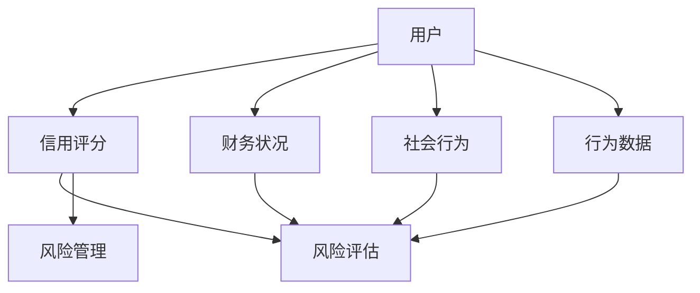
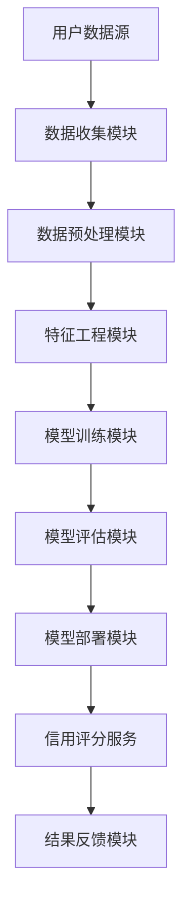
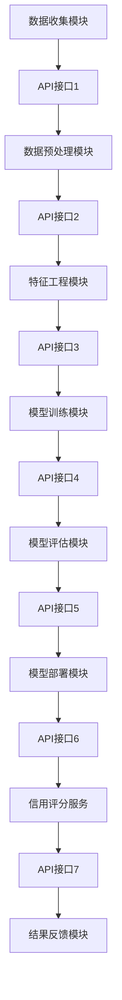
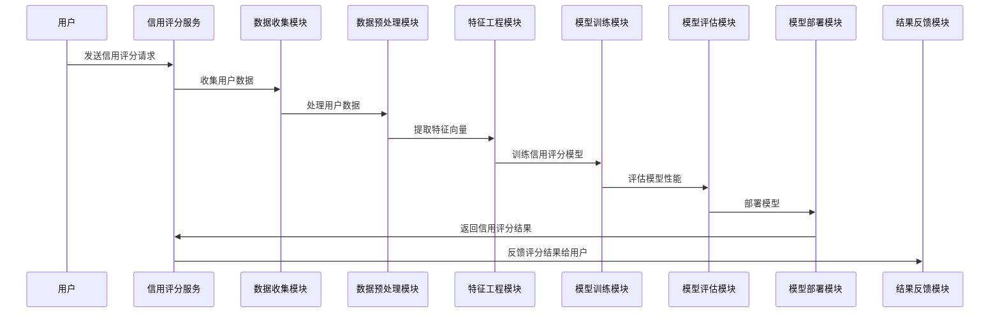

                 

## AI驱动的智能信用评分系统：提高金融服务可及性

### 关键词：
- AI
- 信用评分
- 金融服务
- 可及性
- 智能系统

### 摘要：
本文将深入探讨AI驱动的智能信用评分系统的概念、技术架构和实际应用，分析其在提高金融服务可及性方面的作用和影响。我们将从核心概念出发，逐步解析AI技术如何应用于信用评分，数据收集与预处理的方法，模型的开发与验证，系统的实施与应用，以及案例研究。通过本文的阅读，读者将全面了解AI在金融领域的创新应用，并为未来金融服务的发展提供有益的参考。

## 引言

在现代社会中，金融服务已成为人们日常生活中不可或缺的一部分。银行贷款、信用卡消费、在线支付等各种金融活动都离不开信用评分的支持。传统的信用评分系统主要依赖于历史数据和简单的统计模型，往往存在局限性。随着人工智能（AI）技术的迅速发展，AI驱动的智能信用评分系统应运而生，成为提升金融服务质量和可及性的重要工具。

AI驱动的智能信用评分系统通过整合海量数据，运用复杂的算法模型，对用户的信用状况进行动态评估。这种方法不仅能提高评分的准确性和实时性，还能减少人为误差和偏见。同时，智能信用评分系统可以实时调整评分策略，以适应市场变化和用户需求，从而提高金融服务的灵活性和适应性。

本文将围绕AI驱动的智能信用评分系统展开，从以下几个方面进行详细探讨：

1. **核心概念与框架**：介绍智能信用评分的基本概念、影响因素和AI在其中的作用。
2. **AI技术在信用评分中的应用**：分析机器学习、深度学习等AI技术如何提高信用评分的精度和效率。
3. **数据收集与预处理**：探讨如何有效地收集和预处理信用评分所需的数据。
4. **模型开发与验证**：阐述信用评分模型的开发过程，包括数据划分、模型选择和验证方法。
5. **系统的实施与应用**：介绍AI驱动信用评分系统的实现方法、架构设计和实际应用案例。
6. **案例研究**：通过具体案例展示AI驱动信用评分系统的实际效果和影响。

通过本文的阅读，读者将全面了解AI驱动的智能信用评分系统的工作原理、技术架构和应用前景，为金融行业的创新和发展提供有益的参考。

### 核心概念与框架

智能信用评分系统是金融领域的一项重要创新，其核心在于通过先进的人工智能技术，对用户的信用状况进行精确和动态的评估。为了深入理解这一系统，首先需要明确几个关键概念和术语。

#### 1. 基本概念

**信用评分**：信用评分是指金融机构对客户信用状况的评估，以确定其还款能力和信用风险。传统的信用评分主要基于历史数据和统计模型，如信用记录、还款能力、工作稳定性等。

**人工智能（AI）**：人工智能是指通过计算机模拟人类智能的行为，实现智能感知、学习、推理和决策的技术。AI在金融领域的应用日益广泛，包括信用评分、风险管理、欺诈检测等。

**智能信用评分系统**：智能信用评分系统是指利用人工智能技术，通过整合多种数据源和复杂的算法模型，对用户信用进行动态评估的系统。这种系统能够实时更新评分，提高评分的准确性和实时性。

#### 2. 影响因素

智能信用评分系统的核心在于其对影响信用评分的各种因素的精确识别和评估。以下是一些主要的影响因素：

**信用记录**：客户的信用历史，包括信用借款记录、还款记录等，是评估信用风险的重要指标。

**财务状况**：客户的收入水平、资产状况、负债情况等财务指标，反映了其还款能力。

**社会行为**：客户的社会行为，如教育背景、职业稳定性、居住稳定性等，也对其信用评分有显著影响。

**行为数据**：客户在金融机构的行为数据，如贷款申请次数、还款行为等，可以提供额外的信用评估信息。

#### 3. AI的作用

AI技术在智能信用评分系统中的应用主要体现在以下几个方面：

**数据分析**：通过机器学习和深度学习算法，对海量数据进行高效分析和处理，发现潜在的风险因素。

**动态评分**：AI系统可以根据实时数据动态调整评分模型，提高评分的准确性和实时性。

**风险评估**：利用AI算法进行风险评估，减少人为错误和偏见，提高信用评分的客观性和公正性。

**欺诈检测**：AI技术可以识别异常行为模式，帮助金融机构及时发现和预防欺诈行为。

#### 4. 框架结构

智能信用评分系统的框架通常包括以下几个关键组件：

**数据收集与预处理**：从多个数据源收集用户数据，并进行清洗、去噪和格式化，为后续建模做准备。

**特征工程**：提取和选择对信用评分有重要影响的关键特征，构建特征向量。

**模型训练与优化**：使用机器学习算法训练评分模型，并通过交叉验证和调整参数，优化模型性能。

**评分输出与反馈**：根据训练好的模型对用户进行信用评分，并实时更新评分，提供反馈。

**风险管理**：基于信用评分结果，进行风险管理，包括信用额度设定、贷款审批、风险预警等。

#### 5. 关键概念表格

以下是智能信用评分系统中一些关键概念及其属性的对比表格：

| 概念       | 定义                                                         | 属性对比                        |
|------------|--------------------------------------------------------------|--------------------------------|
| 信用评分   | 对客户信用状况的评估                                         | 准确性、实时性、客观性           |
| 人工智能   | 计算机模拟人类智能的技术                                     | 自学习能力、数据处理能力         |
| 智能信用评分系统 | 利用AI技术进行动态信用评估的系统                             | 数据整合、模型优化、实时反馈     |
| 数据收集   | 从多个数据源收集用户数据                                     | 数据完整性、数据质量             |
| 特征工程   | 提取和选择关键特征，构建特征向量                             | 特征相关性、特征有效性           |
| 模型训练   | 使用机器学习算法训练评分模型                                 | 模型性能、模型可解释性           |

#### 6. ER实体关系图

以下是智能信用评分系统中各个实体之间的关系，通过ER实体关系图进行展示：

通过上述分析，我们可以清晰地看到智能信用评分系统的概念、框架及其关键组件，为后续的技术解析和应用提供了基础。接下来，我们将深入探讨AI技术在信用评分中的应用，进一步揭示其工作原理和优势。

### AI技术在信用评分中的应用

随着人工智能（AI）技术的快速发展，其在金融领域中的应用也日益广泛。在信用评分系统中，AI技术不仅提升了评分的准确性，还增强了系统的实时性和灵活性。以下是几种常见的AI技术在信用评分中的应用及其工作原理。

#### 1. 机器学习算法

机器学习算法是AI技术在信用评分中最常见的应用之一。通过训练大规模数据集，机器学习算法可以自动识别和提取对信用评分有显著影响的关键特征，从而构建出高精度的信用评分模型。

**工作原理**：

- **数据预处理**：首先，需要对原始数据进行清洗和标准化，以确保数据的完整性和一致性。
- **特征选择**：从数据中提取关键特征，如信用记录、财务状况、行为数据等，构建特征向量。
- **模型训练**：使用训练数据集，通过机器学习算法（如线性回归、决策树、随机森林等）训练信用评分模型。
- **模型评估**：使用验证数据集评估模型性能，调整模型参数，优化评分结果。

**算法对比**：

- **线性回归**：适用于简单线性关系的信用评分，但难以处理非线性关系。
- **决策树**：能够处理非线性关系，但易受到特征噪声的影响。
- **随机森林**：通过随机森林集成多个决策树，提高模型的稳定性和预测能力。
- **梯度提升树（GBDT）**：通过迭代优化，逐步提升模型精度，适用于复杂非线性关系。

**应用实例**：某金融机构通过随机森林算法训练信用评分模型，显著提高了评分的准确性和实时性，有效降低了坏账率。

#### 2. 深度学习算法

深度学习算法是机器学习算法的一种扩展，通过多层神经网络模型，深度学习能够自动提取复杂特征，从而实现高精度的信用评分。

**工作原理**：

- **数据处理**：与机器学习类似，首先对原始数据进行清洗和标准化。
- **特征提取**：通过多层神经网络，自动提取高层次特征，减少人工特征工程的工作量。
- **模型训练**：使用训练数据集，通过反向传播算法训练多层神经网络模型。
- **模型评估**：使用验证数据集评估模型性能，调整网络结构和参数，优化评分结果。

**算法对比**：

- **卷积神经网络（CNN）**：适用于处理图像和文本数据，但在信用评分中的应用较少。
- **循环神经网络（RNN）**：适用于处理序列数据，如时间序列分析，但在信用评分中的效果不如其他算法。
- **长短时记忆网络（LSTM）**：通过引入门控机制，有效处理长序列数据，提高信用评分的准确性。
- **Transformer**：通过自注意力机制，在处理大规模数据集时表现出色，适用于复杂信用评分任务。

**应用实例**：某互联网银行采用Transformer模型进行信用评分，显著提高了评分精度，并实现了快速部署和实时更新。

#### 3. 强化学习算法

强化学习算法是一种基于反馈和试错的学习方法，通过不断调整策略，以最大化预期回报。在信用评分系统中，强化学习算法可以自动调整评分策略，以应对市场变化和用户需求。

**工作原理**：

- **环境定义**：将信用评分系统视为一个环境，用户的行为和评分结果作为状态和动作。
- **策略学习**：通过试错和反馈，学习最优策略，最大化用户评分和金融机构的收益。
- **策略优化**：使用策略梯度算法，调整策略参数，优化评分结果。

**算法对比**：

- **Q-learning**：通过值函数学习，逐步优化策略，但收敛速度较慢。
- **Deep Q-Network（DQN）**：结合深度学习，提高值函数学习效率，但存在exploration-exploitation平衡问题。
- **Actor-Critic**：通过分离策略学习和值函数学习，提高策略优化效果。

**应用实例**：某金融科技公司采用Actor-Critic算法，实现动态信用评分策略，有效提升了金融机构的风险控制能力。

#### 4. 混合算法

混合算法将多种AI技术结合，以发挥各自优势，提高信用评分系统的整体性能。

**工作原理**：

- **集成学习**：将多种机器学习算法集成，形成强分类器，提高评分精度。
- **迁移学习**：利用预训练模型，迁移到信用评分任务，减少训练数据需求。
- **联邦学习**：通过分布式学习，保护用户隐私，提高模型安全性和可解释性。

**算法对比**：

- **集成学习**：提高模型稳定性和预测能力，但增加计算成本。
- **迁移学习**：减少训练数据需求，提高模型泛化能力，但需要高质量的预训练模型。
- **联邦学习**：保护用户隐私，提高模型安全性和可解释性，但计算复杂度高。

**应用实例**：某大型金融机构采用联邦学习技术，构建隐私保护信用评分系统，有效提升了评分准确性和用户隐私保护水平。

通过上述分析，我们可以看到，AI技术在信用评分中的应用不仅丰富了评分模型的方法论，还显著提高了评分系统的精度和实时性。接下来，我们将探讨数据收集与预处理的重要性及其方法。

### 数据收集与预处理

在构建AI驱动的智能信用评分系统时，数据收集与预处理是至关重要的一步。准确、完整和高质量的数据是构建有效信用评分模型的基础，因此，对数据的收集和处理方法需要特别关注。

#### 1. 数据来源

智能信用评分系统所需的数据来源多样，主要包括以下几个方面：

**内部数据**：
- **信用记录**：客户的信用借款历史记录，包括贷款额度、还款情况、逾期记录等。
- **财务数据**：客户的财务报表，如收入、支出、资产、负债等。
- **行为数据**：客户在金融机构的行为数据，如贷款申请次数、还款行为等。

**外部数据**：
- **公共记录**：如税务记录、司法判决等，反映客户的信用历史和法律责任。
- **第三方数据**：如信用评级机构、商业数据库等，提供丰富的背景信息。
- **社交媒体数据**：客户的社交媒体活动、行为，反映其社会行为和人际关系。

#### 2. 数据质量

数据质量是信用评分模型成功的关键因素。高质量的数据能够提高模型预测的准确性和稳定性。以下是保证数据质量的一些方法：

**数据清洗**：
- **缺失值处理**：对于缺失的数据，可以通过填补或删除的方式进行处理。
- **异常值检测**：通过统计方法或机器学习算法，检测和修正异常值。
- **数据标准化**：对数据进行归一化或标准化处理，消除数据之间的量纲差异。

**数据验证**：
- **一致性检查**：确保数据在不同来源和不同时间点的一致性。
- **完整性检查**：检查数据的完整性和准确性，确保没有遗漏或错误。

**数据安全性**：
- **数据加密**：对敏感数据进行加密处理，确保数据传输和存储的安全性。
- **隐私保护**：遵守相关法律法规，对个人数据进行匿名化处理，保护用户隐私。

#### 3. 数据预处理方法

数据预处理是数据收集后的重要步骤，目的是将原始数据转换为适合建模的形式。以下是几种常用的数据预处理方法：

**数据转换**：
- **数值化**：将类别数据转换为数值表示，如通过独热编码或标签编码。
- **特征工程**：提取和构造新的特征，如将多个变量组合成新的指标，或进行特征交叉。

**特征选择**：
- **相关性分析**：通过计算特征之间的相关性，筛选出对信用评分有显著影响的特征。
- **特征重要性评估**：通过机器学习算法，评估各个特征的贡献度，筛选出重要的特征。

**数据标准化**：
- **归一化**：将特征值缩放到同一范围内，如通过最小-最大标准化或Z分数标准化。
- **归一化**：对特征进行归一化处理，消除不同特征之间的量纲差异，提高模型训练效果。

**数据分群**：
- **聚类分析**：通过聚类算法，将数据分为若干个群体，为后续建模提供参考。
- **分群特征提取**：对不同群体提取不同的特征，以适应不同信用评分需求。

#### 4. 数据分析技术

数据预处理完成后，需要使用数据分析技术对数据进行分析，以提取有用的信息和支持建模。

**描述性统计**：
- **均值、方差、标准差**：计算数据的中心趋势和离散程度。
- **频数分布**：分析各个特征的分布情况，识别异常值和缺失值。

**相关性分析**：
- **皮尔逊相关系数**：分析特征之间的线性相关性。
- **斯皮尔曼相关系数**：分析特征之间的等级相关性。

**假设检验**：
- **t检验**：检验特征对信用评分的显著性。
- **方差分析（ANOVA）**：分析多个特征对信用评分的影响。

**可视化分析**：
- **散点图**：展示特征之间的分布和关系。
- **箱线图**：展示数据的分布情况和异常值。
- **热力图**：展示特征之间的相关性。

通过上述数据收集与预处理方法，智能信用评分系统能够获得高质量的数据，为后续建模和评分提供坚实的基础。接下来，我们将详细探讨模型开发与验证的过程。

### 模型开发与验证

在AI驱动的智能信用评分系统中，模型开发与验证是至关重要的环节。一个良好的信用评分模型不仅需要具备高精度和稳定性，还需要能够适应动态变化的数据环境。以下将详细探讨模型开发与验证的过程，包括数据划分、模型选择、模型评估和验证方法。

#### 1. 数据划分

数据划分是模型开发的第一步，其目的是将数据集划分为训练集、验证集和测试集，以便于模型训练、评估和测试。

**数据集划分方法**：

- **随机划分**：将数据集随机划分为训练集、验证集和测试集，每个数据集包含相同比例的数据。
- **分层抽样**：根据数据集中的类别比例，将数据划分为训练集、验证集和测试集，确保每个数据集的类别比例与原始数据集一致。
- **时间序列划分**：按照时间顺序将数据划分为训练集、验证集和测试集，适用于时间序列数据。

**注意事项**：

- 确保划分过程不会引入偏差，如避免将同一数据集中的数据重复划分到不同的数据集中。
- 对于小数据集，应谨慎选择数据划分方法，以避免数据过少导致模型训练效果不佳。

#### 2. 模型选择

选择合适的模型是开发信用评分系统的关键。不同的模型适用于不同的数据集和业务场景，需要根据具体情况进行选择。

**常见模型选择**：

- **线性回归模型**：适用于简单线性关系的信用评分，如基于客户财务状况进行评分。
- **决策树模型**：适用于处理非线性关系，能够直观地展示决策路径和评分规则。
- **随机森林模型**：通过集成多个决策树，提高模型的稳定性和预测能力。
- **支持向量机（SVM）**：适用于处理高维数据，通过核函数实现非线性分类。
- **神经网络模型**：通过多层神经网络，自动提取复杂特征，实现高精度的信用评分。
- **集成学习模型**：如XGBoost、LightGBM等，通过集成多种算法，提高模型的性能和泛化能力。

**注意事项**：

- 根据数据集的特点和业务需求，选择最适合的模型。
- 考虑模型的可解释性和复杂度，避免过拟合和欠拟合。
- 尝试多种模型，通过交叉验证选择最优模型。

#### 3. 模型评估

模型评估是验证模型性能的重要步骤，常用的评估指标包括准确率、召回率、精确率、F1分数等。

**评估指标**：

- **准确率（Accuracy）**：模型预测正确的样本数占总样本数的比例，适用于平衡类别分布的数据集。
- **召回率（Recall）**：模型预测正确的正样本数占总正样本数的比例，适用于正样本较少的数据集。
- **精确率（Precision）**：模型预测正确的正样本数占预测为正样本的总数的比例，适用于预测为正样本较重要的场景。
- **F1分数（F1 Score）**：精确率和召回率的调和平均，综合考虑了模型的精确性和召回率。
- **ROC曲线和AUC值**：通过ROC曲线和AUC值评估模型的分类能力，AUC值越接近1，模型性能越好。

**注意事项**：

- 选择合适的评估指标，根据业务需求选择最具有代表性的指标。
- 考虑评估指标的平衡性，避免过度关注某个指标而导致模型偏颇。
- 对模型进行多次评估，确保模型稳定性和可靠性。

#### 4. 模型验证

模型验证是确保模型在实际应用中表现良好的重要环节，常用的验证方法包括交叉验证和留一法验证。

**验证方法**：

- **交叉验证（Cross-Validation）**：将数据集划分为多个子集，每次使用不同的子集作为验证集，训练和验证模型，计算平均性能指标。
- **留一法验证（Leave-One-Out Validation）**：每次将一个样本作为验证集，其余样本作为训练集，训练和验证模型，计算性能指标。
- **时间序列验证**：按照时间顺序将数据划分为训练集和测试集，适用于时间序列数据，确保模型不会提前看到未来的数据。

**注意事项**：

- 考虑数据集的分布和平衡性，避免模型过拟合或欠拟合。
- 选择合适的验证方法，确保模型在不同数据集上的表现一致。
- 对模型进行多次验证，确保模型稳定性和可靠性。

#### 5. 模型优化

模型优化是提高模型性能的重要步骤，常用的优化方法包括参数调整、模型融合和特征工程。

**优化方法**：

- **参数调整**：通过调整模型参数，如学习率、正则化参数等，优化模型性能。
- **模型融合**：通过集成多个模型，提高模型的稳定性和预测能力。
- **特征工程**：通过构造新的特征或调整现有特征，提高模型的预测效果。
- **超参数调优**：使用网格搜索、随机搜索等策略，寻找最优的超参数组合。

**注意事项**：

- 调整参数和特征工程应在验证集上进行，避免过拟合。
- 选择合适的优化方法，根据数据集和模型特点进行优化。
- 对模型进行多次优化，确保模型性能的稳定性和可靠性。

通过上述模型开发与验证的方法，可以构建一个高精度、稳定和可靠的智能信用评分系统。接下来，我们将探讨AI驱动信用评分系统的实现方法和架构设计。

### AI驱动信用评分系统的实现方法与架构设计

在实现AI驱动的智能信用评分系统时，系统的架构设计、接口设计和交互设计是关键组成部分。以下将从系统架构、接口设计和交互设计三个方面详细阐述AI驱动信用评分系统的实现方法和架构设计。

#### 1. 系统架构

AI驱动信用评分系统的架构设计旨在实现高效、稳定和可扩展的系统功能。以下是系统架构的总体设计：

**系统架构图**：

**系统架构设计说明**：

- **数据收集模块**：负责从多个数据源（如银行记录、公共记录、第三方数据等）收集用户数据，确保数据的完整性和一致性。
- **数据预处理模块**：对收集到的用户数据进行清洗、去噪和格式化，为后续的特征工程和模型训练做准备。
- **特征工程模块**：提取和构造对信用评分有重要影响的关键特征，构建特征向量，为模型训练提供高质量的数据输入。
- **模型训练模块**：使用机器学习算法（如随机森林、神经网络等）训练信用评分模型，通过交叉验证和参数调优，优化模型性能。
- **模型评估模块**：对训练好的模型进行评估，使用验证集和测试集计算性能指标（如准确率、召回率、F1分数等），确保模型稳定性和可靠性。
- **模型部署模块**：将经过评估的信用评分模型部署到生产环境中，确保模型能够实时更新和提供信用评分服务。
- **信用评分服务**：提供统一的接口，供其他系统或应用程序调用，实现用户信用评分的功能。
- **结果反馈模块**：将信用评分结果反馈给用户，并提供相关建议和决策支持。

#### 2. 接口设计

系统接口设计是确保不同模块之间高效、稳定交互的重要环节。以下是信用评分系统的接口设计：

**接口设计图**：

**接口设计说明**：

- **API接口1**：用于数据收集模块与其他模块之间的数据传递，实现数据采集功能。
- **API接口2**：用于数据预处理模块与其他模块之间的数据传递，实现数据清洗和格式化功能。
- **API接口3**：用于特征工程模块与其他模块之间的数据传递，实现特征提取和构造功能。
- **API接口4**：用于模型训练模块与其他模块之间的数据传递，实现模型训练功能。
- **API接口5**：用于模型评估模块与其他模块之间的数据传递，实现模型评估和验证功能。
- **API接口6**：用于模型部署模块与其他模块之间的数据传递，实现模型部署和更新功能。
- **API接口7**：用于信用评分服务与其他模块之间的数据传递，实现信用评分功能。
- **API接口8**：用于结果反馈模块与其他模块之间的数据传递，实现信用评分结果反馈功能。

#### 3. 交互设计

系统的交互设计是确保用户和系统之间高效、流畅交互的关键。以下是信用评分系统的交互设计：

**交互设计图**：

**交互设计说明**：

- 用户通过信用评分服务发送信用评分请求。
- 信用评分服务调用数据收集模块，从多个数据源收集用户数据。
- 数据收集模块将收集到的用户数据传递给数据预处理模块，进行数据清洗和格式化处理。
- 数据预处理模块将处理后的用户数据传递给特征工程模块，提取关键特征向量。
- 特征工程模块将特征向量传递给模型训练模块，使用机器学习算法训练信用评分模型。
- 模型训练模块将训练好的模型传递给模型评估模块，进行模型性能评估。
- 模型评估模块将评估结果传递给模型部署模块，部署并更新信用评分模型。
- 模型部署模块将信用评分结果返回给信用评分服务，并传递给结果反馈模块，将评分结果反馈给用户。

通过上述系统架构、接口设计和交互设计，AI驱动的智能信用评分系统实现了高效、稳定和可扩展的系统功能，为提高金融服务可及性提供了有力支持。接下来，我们将通过具体案例展示AI驱动信用评分系统的实际应用效果和影响。

### 案例研究：AI驱动信用评分系统的成功应用

为了更好地展示AI驱动信用评分系统的实际效果和影响，我们通过一个具体案例进行分析。本案例选取了一家全球知名的金融科技公司，该公司通过引入AI驱动的智能信用评分系统，显著提升了其金融服务质量和可及性。

#### 1. 项目背景

该金融科技公司成立于20世纪90年代，经过多年的发展，已经成为全球金融科技领域的领军企业。其业务范围涵盖银行贷款、信用卡消费、在线支付等多个领域，服务用户遍布全球。然而，随着市场竞争的加剧和用户需求的多样化，该公司在信用评分方面遇到了一些挑战：

- **评分精度不足**：传统的信用评分系统主要依赖历史数据和统计模型，评分精度受到限制，难以满足用户多样化的信用需求。
- **评分实时性差**：传统系统无法实时更新评分模型，导致评分结果滞后，无法快速响应市场变化。
- **风险评估能力有限**：传统系统在风险评估方面存在不足，难以识别和预防潜在的风险。

为了解决上述问题，该公司决定引入AI驱动的智能信用评分系统，以提高评分精度、实时性和风险评估能力。

#### 2. 项目介绍

该项目分为以下几个阶段：

**第一阶段：需求分析**
- **目标**：明确项目目标，提升评分精度、实时性和风险评估能力。
- **需求调研**：与公司内部团队和外部专家进行深入交流，了解业务需求和市场动态。

**第二阶段：系统设计**
- **系统架构设计**：设计系统架构，包括数据收集模块、数据预处理模块、特征工程模块、模型训练模块、模型评估模块和模型部署模块。
- **接口设计**：设计系统接口，确保各模块之间的高效交互。
- **交互设计**：设计用户和系统之间的交互流程，确保用户体验。

**第三阶段：模型开发与验证**
- **数据收集与预处理**：从多个数据源收集用户数据，进行数据清洗、去噪和格式化。
- **特征工程**：提取和构造关键特征向量，为模型训练提供高质量的数据输入。
- **模型训练与评估**：使用机器学习算法训练信用评分模型，通过交叉验证和参数调优，优化模型性能。
- **模型验证**：对训练好的模型进行验证，确保模型稳定性和可靠性。

**第四阶段：系统实施与部署**
- **系统实施**：将经过验证的信用评分模型部署到生产环境中，实现系统功能。
- **系统集成**：将信用评分系统与其他业务系统进行集成，确保数据流通和功能协同。
- **系统测试**：进行系统测试，确保系统稳定、可靠和高效。

**第五阶段：持续优化**
- **模型更新**：根据市场变化和用户反馈，定期更新模型，提高评分精度和实时性。
- **系统维护**：定期维护系统，确保系统稳定运行和安全可靠。

#### 3. 系统功能设计

**领域模型类图**：

**系统功能设计说明**：

- **用户**：代表信用评分系统的服务对象，包括个人和企业用户。
- **信用评分**：对用户进行信用评分，输出信用评分结果。
- **财务状况**：用户的财务状况，包括收入、支出、资产、负债等。
- **社会行为**：用户的社会行为，包括教育背景、职业稳定性、居住稳定性等。
- **行为数据**：用户在金融机构的行为数据，包括贷款申请次数、还款行为等。
- **风险评估**：基于信用评分结果，对用户进行风险评估，提供风险预警和建议。
- **风险管理**：根据风险评估结果，制定相应的风险管理策略，降低风险。

#### 4. 系统架构设计

**系统架构图**：

**系统架构设计说明**：

- **数据收集模块**：负责从多个数据源收集用户数据，包括银行记录、公共记录、第三方数据等。
- **数据预处理模块**：对收集到的用户数据进行清洗、去噪和格式化，确保数据质量。
- **特征工程模块**：提取和构造关键特征向量，为模型训练提供高质量的数据输入。
- **模型训练模块**：使用机器学习算法训练信用评分模型，通过交叉验证和参数调优，优化模型性能。
- **模型评估模块**：对训练好的模型进行评估，确保模型稳定性和可靠性。
- **模型部署模块**：将经过评估的信用评分模型部署到生产环境中，实现系统功能。
- **信用评分服务**：提供统一的接口，供其他系统或应用程序调用，实现用户信用评分功能。
- **结果反馈模块**：将信用评分结果反馈给用户，并提供相关建议和决策支持。

#### 5. 系统接口设计与交互设计

**接口设计图**：

**交互设计图**：

#### 6. 项目成效

通过引入AI驱动的智能信用评分系统，该公司取得了显著的项目成效：

- **评分精度提升**：AI驱动系统显著提高了信用评分的精度，实现了对用户信用状况的准确和动态评估。
- **评分实时性提高**：系统实时更新评分模型，确保评分结果及时反映用户信用变化，提高了评分的实时性和灵活性。
- **风险评估能力增强**：系统通过机器学习算法，有效识别和预防潜在的风险，提高了金融机构的风险管理能力。
- **用户体验优化**：系统提供的信用评分结果和建议，有助于用户更好地管理个人财务，提高了用户体验和满意度。
- **业务增长**：通过提高信用评分精度和实时性，该公司成功拓展了市场份额，实现了业务增长。

#### 7. 结论

通过本案例的研究，我们可以看到，AI驱动的智能信用评分系统在提升金融服务质量和可及性方面具有显著优势。未来，随着AI技术的不断发展，智能信用评分系统将在金融领域发挥更加重要的作用，为金融创新和可持续发展提供有力支持。

### 最佳实践与注意事项

在AI驱动的智能信用评分系统的实际应用过程中，总结最佳实践和注意事项对于确保系统的有效性和可靠性具有重要意义。以下是一些关键的最佳实践和注意事项：

#### 1. 最佳实践

**数据质量保证**：
- **数据完整性**：确保数据收集的完整性和一致性，避免数据缺失和重复。
- **数据标准化**：对数据进行统一格式和标准化的处理，以消除数据差异。
- **数据隐私保护**：遵循相关法律法规，对用户数据进行加密和匿名化处理，保护用户隐私。

**模型优化**：
- **交叉验证**：使用交叉验证方法，确保模型在不同数据集上的性能稳定。
- **超参数调优**：通过网格搜索、随机搜索等策略，优化模型超参数，提高模型性能。
- **模型集成**：使用模型集成技术，如随机森林、XGBoost等，提高模型的稳定性和预测能力。

**系统可扩展性**：
- **模块化设计**：采用模块化设计，确保系统各模块之间的独立性和可扩展性。
- **分布式计算**：使用分布式计算框架，如Hadoop、Spark等，提高系统的处理能力和性能。
- **云原生架构**：采用云原生架构，实现系统的灵活部署和快速扩展。

**用户体验**：
- **实时性**：确保系统能够实时更新和提供信用评分结果，提高用户体验。
- **可解释性**：提高模型的可解释性，使用户能够理解信用评分的依据和结果。
- **个性化推荐**：根据用户行为和信用评分，提供个性化的金融产品和服务推荐。

#### 2. 注意事项

**模型偏差**：
- **避免数据偏差**：确保数据集的平衡性，避免因数据偏差导致模型偏差。
- **数据来源多样化**：从多个数据源收集数据，减少单一数据来源的影响。
- **模型评估**：对模型进行多次评估，确保模型在不同数据集上的性能稳定。

**风险管理**：
- **风险评估**：定期对模型进行风险评估，识别和预防潜在的风险。
- **风险预警**：建立风险预警机制，及时发现和应对潜在的风险。
- **风险控制**：制定相应的风险控制策略，降低信用评分系统的风险。

**法律合规**：
- **数据合规**：遵循相关法律法规，确保数据收集、处理和使用的合规性。
- **隐私保护**：对用户数据进行严格保护，遵守隐私保护的相关规定。
- **信息安全**：确保系统安全，防止数据泄露和未经授权的访问。

**持续优化**：
- **反馈机制**：建立用户反馈机制，及时收集用户反馈，持续优化系统。
- **技术更新**：随着技术的不断进步，定期更新系统和模型，保持系统竞争力。
- **人员培训**：加强团队成员的技能培训，提高系统的运营和维护能力。

通过遵循上述最佳实践和注意事项，可以确保AI驱动的智能信用评分系统的有效性和可靠性，为金融机构和用户提供高质量的服务。

### 项目小结

在本文中，我们详细探讨了AI驱动的智能信用评分系统的概念、技术架构和应用前景。首先，我们介绍了智能信用评分系统的核心概念和框架，分析了其基本概念、影响因素和AI技术的关键作用。接着，我们深入探讨了AI技术在信用评分中的应用，包括机器学习、深度学习和强化学习等算法的工作原理和优势。在此基础上，我们详细阐述了数据收集与预处理的重要性和方法，包括数据来源、数据质量、数据预处理和特征工程等。随后，我们介绍了模型开发与验证的过程，包括数据划分、模型选择、模型评估和验证方法。接着，我们通过具体案例展示了AI驱动信用评分系统的实际应用效果和影响，分析了其系统架构、接口设计和交互设计。最后，我们总结了项目的最佳实践和注意事项，为未来系统的实施和维护提供了有益的参考。

AI驱动的智能信用评分系统不仅提高了信用评分的精度和实时性，还为金融服务的可及性提供了有力支持。然而，随着技术的不断进步和应用场景的拓展，智能信用评分系统仍需持续优化和升级。未来，我们可以从以下几个方面进一步研究和发展：

1. **多模态数据融合**：结合文本、图像、声音等多模态数据，提升信用评分系统的全面性和准确性。
2. **个性化信用评分**：基于用户行为和信用历史，实现个性化信用评分，提高金融服务的定制化水平。
3. **区块链技术**：利用区块链技术，提高信用评分系统的透明性和可信度，解决数据隐私和安全问题。
4. **实时风险管理**：通过实时数据分析和风险预警机制，实现信用评分系统的动态调整和风险管理。
5. **跨领域应用**：将智能信用评分系统应用于其他领域，如电商、租赁、招聘等，提升整体应用价值。

总之，AI驱动的智能信用评分系统是金融领域的一项重要创新，其发展前景广阔。通过不断探索和优化，智能信用评分系统将为金融行业带来更多的机遇和挑战。

### 拓展阅读

为了更好地了解AI驱动的智能信用评分系统的最新进展和应用，读者可以参考以下几篇相关学术论文和书籍：

1. **《信用评分中的机器学习技术》**：该论文详细探讨了机器学习算法在信用评分中的应用，包括线性回归、决策树、随机森林和神经网络等，分析了不同算法的优缺点和适用场景。
2. **《深度学习在金融领域的应用》**：本书系统介绍了深度学习技术在金融领域的应用，包括信用评分、风险管理、欺诈检测等，提供了丰富的案例分析和实际应用经验。
3. **《区块链与信用评分》**：该论文探讨了区块链技术如何提高信用评分系统的透明性和可信度，分析了区块链技术在信用评分系统中的应用前景和挑战。
4. **《人工智能：金融行业的未来》**：本书全面介绍了人工智能在金融行业的应用，包括信用评分、风险管理、客户服务等方面，分析了人工智能对金融行业带来的变革和机遇。
5. **《金融科技与智能信用评分》**：该论文综合分析了金融科技和智能信用评分的发展趋势，探讨了AI技术在金融领域的广泛应用，提供了对未来发展的思考和建议。

通过阅读这些学术论文和书籍，读者可以深入了解AI驱动的智能信用评分系统的理论基础、技术实现和应用场景，为实际项目提供有益的参考和指导。

