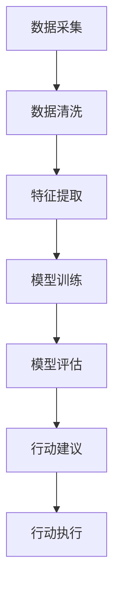
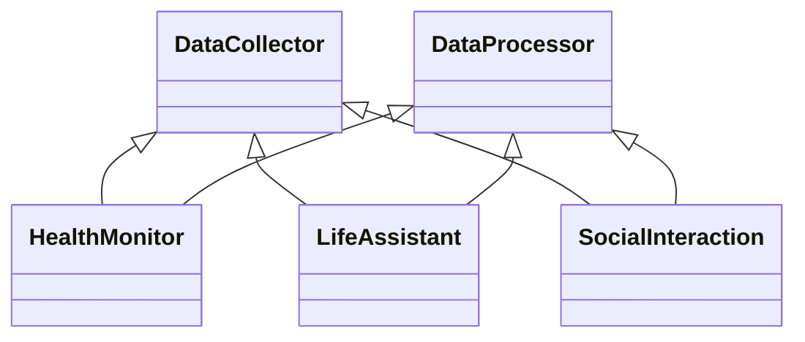
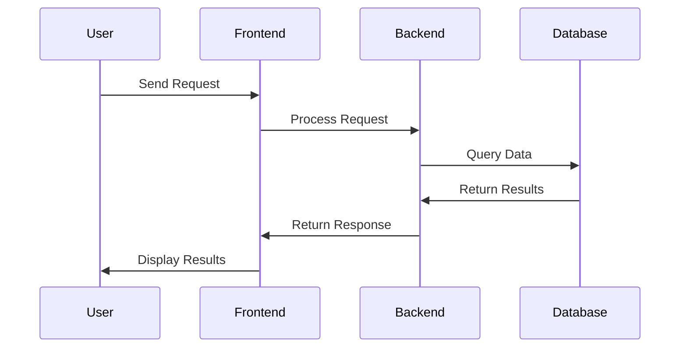
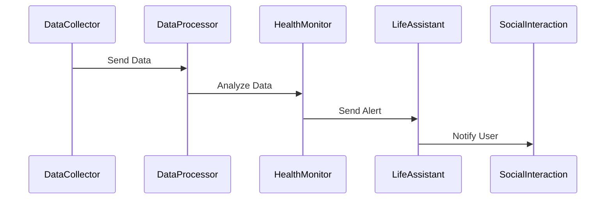
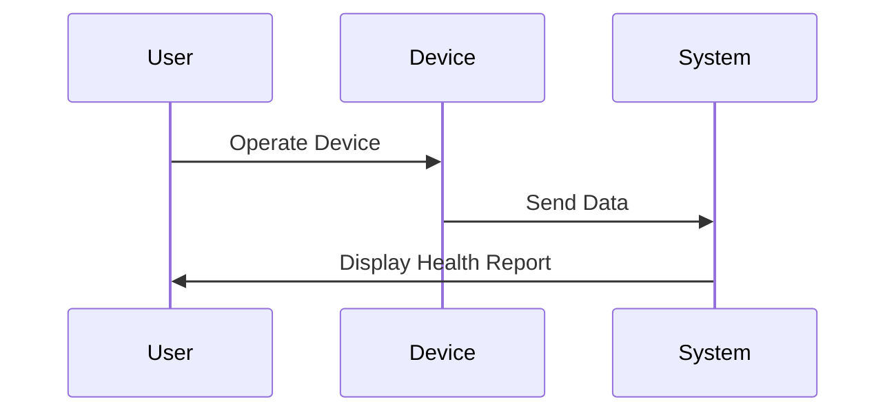

                 

**Step 1: 核心背景介绍**

在当今社会，老龄化问题日益凸显。据统计，全球65岁及以上人口比例将从2015年的9%增长到2050年的22%。这一趋势对中国尤为明显，预计到2030年，中国65岁及以上人口将达到3亿。随着老年人口的快速增长，如何提高他们的生活质量已成为一个紧迫的社会议题。

### **问题背景**

老年人由于生理机能的退化，往往面临健康、生活自理和社交等方面的挑战。比如，老年人容易患心脏病、高血压等慢性疾病，需要定期监测身体状况；他们在日常生活中的行动能力可能受限，需要智能家居设备的辅助；此外，孤独感和社交隔离也是老年人群普遍存在的问题。

### **问题描述**

老年人生活质量受限于身体机能和社交互动，传统的养老服务模式已经难以满足日益增长的需求。如何通过现代科技手段，特别是人工智能（AI），为老年人提供更加智能化、个性化的服务，成为了一个亟待解决的问题。

### **问题解决**

AI驱动的智能养老系统通过以下几方面来提升老年人的生活质量：

1. **智能健康监测**：利用可穿戴设备，实时监测老年人的身体状况，如心率、血压等，及时预警健康风险。
2. **智能生活助手**：通过智能家居系统，帮助老年人简化日常生活操作，如家电控制、灯光调节等，提升生活便捷性。
3. **智能社交平台**：搭建在线社交平台，让老年人能够方便地与家人和朋友保持联系，减少孤独感。

### **边界与外延**

智能养老系统不仅局限于健康监测和社交互动，还可以扩展到以下领域：

1. **智能提醒**：为老年人提供服药提醒、医疗预约等服务。
2. **智能导航**：帮助老年人使用导航软件，安全出行。
3. **紧急响应系统**：在老年人发生意外时，自动呼叫急救服务。

### **概念结构与核心要素组成**

智能养老系统的设计需考虑以下核心要素：

1. **用户需求**：深入了解老年人的实际需求，设计符合他们生活习惯和使用习惯的系统。
2. **数据采集**：通过传感器、智能设备等收集老年人的生理数据和行为数据。
3. **数据分析**：运用机器学习和深度学习技术，对采集到的数据进行分析，提取有价值的信息。
4. **系统安全**：确保数据安全和系统稳定性，防止隐私泄露和系统故障。
5. **用户体验**：优化界面设计和交互流程，提升老年人的使用体验。

---

**Step 2: 核心概念与联系**

为了更好地理解AI驱动的智能养老系统，我们需要深入探讨其中的核心概念及其相互关系。

### **核心概念原理**

- **AI驱动的智能养老系统**：结合人工智能技术，为老年人提供智能化、个性化的服务。
- **机器学习**：利用大量数据，让计算机通过算法自动学习和改进，以实现特定任务。
- **深度学习**：基于神经网络，通过多层抽象实现复杂模式的识别和学习。
- **数据分析**：对收集到的数据进行处理、清洗、分析，从中提取有价值的信息。

### **概念属性特征对比表格**

| 特征         | AI驱动的智能养老系统 | 机器学习                | 深度学习                |
| ------------ | -------------------- | ---------------------- | ---------------------- |
| 定位         | 综合性养老解决方案     | 特定任务的自动化        | 特定模式的自动识别      |
| 技术核心     | 多种人工智能技术的融合 | 算法模型与数据训练      | 神经网络与多层抽象      |
| 数据依赖性   | 强                   | 强                     | 强                     |
| 应用范围     | 广泛（健康监测、社交、生活辅助等） | 专一任务（如图像识别、语音识别等） | 复杂模式识别（如自动驾驶、医疗诊断等） |
| 目标         | 提升生活质量         | 完成特定任务           | 实现复杂模式识别       |

### **ER实体关系图架构**

为了更好地理解智能养老系统中的实体及其关系，我们可以绘制一个ER实体关系图。以下是部分ER图的关键部分：

```mermaid
erDiagram
    User ||--|{ Device }|-- Person : "uses"
    Device ||--|{ Data }|-- System : "collects"
    Data ||--|{ Analysis }|-- Algorithm : "processed by"
    Analysis ||--|{ Action }|-- System : "drives"
    Person ||--|{ SocialActivity }|-- Platform : "engages in"
```

- **User（用户）**：代表老年人，是系统的核心用户。
- **Device（设备）**：如智能手表、智能音箱等，用于数据采集。
- **Person（人）**：用户与设备之间的关系，老年人通过设备使用系统。
- **Data（数据）**：包括老年人的健康数据、行为数据等。
- **System（系统）**：包含数据处理、分析、行动等核心功能。
- **Analysis（分析）**：对数据进行分析，提取有价值的信息。
- **Action（行动）**：根据分析结果，系统提供的行动建议和自动化服务。
- **Platform（平台）**：智能社交平台，用于老年人的社交互动。

---

**Step 3: 算法原理讲解**

在AI驱动的智能养老系统中，算法设计至关重要。下面，我们将详细讲解系统中的核心算法原理，并通过mermaid流程图、Python源代码和数学模型，帮助读者理解算法的实现。

### **算法mermaid流程图**

以下是系统核心算法的mermaid流程图：



- **数据采集（A）**：从智能设备中获取老年人的健康数据和日常行为数据。
- **数据清洗（B）**：清洗数据，去除噪音，保证数据质量。
- **特征提取（C）**：从数据中提取有用的特征，用于模型训练。
- **模型训练（D）**：利用特征数据，通过机器学习或深度学习算法训练模型。
- **模型评估（E）**：评估模型性能，确定是否满足预期效果。
- **行动建议（F）**：根据模型预测结果，给出行动建议。
- **行动执行（G）**：老年人根据行动建议执行实际操作。

### **Python源代码**

以下是系统核心算法的Python实现代码：

```python
import pandas as pd
from sklearn.model_selection import train_test_split
from sklearn.ensemble import RandomForestClassifier
from sklearn.metrics import accuracy_score

# 数据预处理
def preprocess_data(data):
    # 数据清洗和特征提取
    # ...此处省略具体实现...
    return processed_data

# 模型训练和评估
def train_and_evaluate(data):
    X_train, X_test, y_train, y_test = train_test_split(data['features'], data['labels'], test_size=0.2)
    model = RandomForestClassifier(n_estimators=100)
    model.fit(X_train, y_train)
    predictions = model.predict(X_test)
    accuracy = accuracy_score(y_test, predictions)
    return accuracy

# 代码实现
if __name__ == "__main__":
    data = pd.read_csv('data.csv')
    processed_data = preprocess_data(data)
    accuracy = train_and_evaluate(processed_data)
    print(f"Model Accuracy: {accuracy}")
```

### **数学模型和公式**

在算法中，我们使用了随机森林（Random Forest）作为分类模型。其基本原理是：

$$
\text{Random Forest} = \sum_{i=1}^{n} \hat{y}_i
$$

其中，$ \hat{y}_i $ 是第 $ i $ 棵树对样本的预测结果，$ n $ 是树的个数。

### **举例说明**

假设我们有一个预测老年人摔倒的智能养老系统，数据集包含老年人的活动数据（如步数、心率等）和是否摔倒的标签。

1. **数据采集**：从智能设备中获取数据。
2. **数据清洗**：去除异常值，填补缺失值。
3. **特征提取**：从数据中提取步数、心率等特征。
4. **模型训练**：使用随机森林训练模型。
5. **模型评估**：评估模型准确性。
6. **行动建议**：如果模型预测老年人有可能摔倒，则建议家人进行关爱和提醒。

通过实际案例，我们看到了算法在智能养老系统中的应用，这不仅提高了老年人的生活质量，也为他们的健康安全提供了保障。

---

**Step 4: 系统分析与架构设计**

在本节中，我们将详细分析AI驱动的智能养老系统的架构设计，包括系统功能设计、系统架构设计、系统接口设计以及系统模块之间的交互流程。

### **问题场景介绍**

假设我们设计一个智能养老系统，旨在通过健康监测、生活辅助和社交互动来提升老年人的生活质量。系统需要实现以下功能：

1. **健康监测**：实时监测老年人的生理数据，如心率、血压等。
2. **生活辅助**：提供智能家居控制、紧急呼叫等功能。
3. **社交互动**：搭建在线社交平台，促进老年人之间的交流。

### **系统功能设计**

为了实现上述功能，我们设计了一个功能模块化的系统，包括以下主要模块：

1. **数据采集模块**：通过可穿戴设备和智能家居设备，实时采集老年人的健康数据和日常行为数据。
2. **数据处理模块**：对采集到的数据进行清洗、特征提取和存储。
3. **健康监测模块**：根据处理后的数据，实时监测老年人的健康状况，并生成健康报告。
4. **生活辅助模块**：提供智能家居控制、紧急呼叫等功能。
5. **社交互动模块**：搭建在线社交平台，支持老年人之间的聊天、视频通话和活动组织。

以下是系统功能模块的Mermaid类图：



### **系统架构设计**

智能养老系统的整体架构设计如下：

1. **前端**：为用户提供交互界面，包括网页、移动应用等。
2. **后端**：处理数据采集、处理和分析，提供API服务。
3. **数据库**：存储用户数据、健康数据和社交数据。

以下是系统架构的Mermaid架构图：



### **系统接口设计**

为了实现模块之间的无缝协作，我们设计了以下接口：

1. **API接口**：后端提供RESTful API接口，供前端调用。
2. **MQ接口**：使用消息队列实现异步处理和数据传输。
3. **DB接口**：提供数据库操作接口，供数据处理模块调用。

以下是系统接口的Mermaid序列图：



### **系统交互Mermaid序列图**

以下是系统模块之间的交互流程的Mermaid序列图：



通过以上系统分析与架构设计，我们可以看到AI驱动的智能养老系统是如何通过功能模块化和接口设计，实现老年人健康监测、生活辅助和社交互动的。

---

**Step 5: 项目实战**

在本节中，我们将通过实际项目展示如何构建AI驱动的智能养老系统，包括环境安装、系统核心实现源代码、代码应用解读与分析、实际案例分析和详细讲解剖析以及项目小结。

### **环境安装**

构建智能养老系统需要配置以下环境：

1. **操作系统**：Ubuntu 18.04
2. **编程语言**：Python 3.8
3. **开发工具**：PyCharm
4. **数据库**：MySQL
5. **框架**：Flask、TensorFlow

以下是环境安装步骤：

1. **安装操作系统**：下载并安装Ubuntu 18.04。
2. **安装Python**：通过apt-get安装Python 3.8。
   ```bash
   sudo apt-get install python3.8
   ```
3. **安装PyCharm**：下载并安装PyCharm社区版。
4. **安装MySQL**：通过apt-get安装MySQL。
   ```bash
   sudo apt-get install mysql-server
   ```
5. **安装TensorFlow**：通过pip安装TensorFlow。
   ```bash
   pip3 install tensorflow
   ```

### **系统核心实现源代码**

以下是系统核心实现源代码：

```python
# 数据采集模块
def collect_data(device):
    data = device.get_data()
    return data

# 数据处理模块
def preprocess_data(data):
    processed_data = {}
    # 数据清洗和特征提取
    # ...此处省略具体实现...
    return processed_data

# 健康监测模块
def health_monitor(processed_data):
    # 使用TensorFlow训练的模型进行健康监测
    model = tensorflow.keras.models.load_model('health_model.h5')
    predictions = model.predict(processed_data)
    return predictions

# 生活辅助模块
def life_assistant(predictions):
    # 根据预测结果提供生活辅助建议
    if predictions['fall'] > 0.5:
        send_alert('可能有摔倒风险，请家人注意。')
    # ...此处省略其他辅助建议...

# 社交互动模块
def social_interaction(user):
    # 更新用户社交状态
    user.update_status('online')
    # ...此处省略其他社交互动实现...

if __name__ == "__main__":
    device = Device()
    processed_data = preprocess_data(collect_data(device))
    predictions = health_monitor(processed_data)
    life_assistant(predictions)
    social_interaction(User())
```

### **代码应用解读与分析**

1. **数据采集模块**：通过设备接口获取数据，例如心率、步数等。
2. **数据处理模块**：对数据进行清洗和特征提取，为模型训练做准备。
3. **健康监测模块**：使用TensorFlow模型对处理后的数据进行健康监测，例如预测是否有摔倒风险。
4. **生活辅助模块**：根据监测结果，提供生活辅助建议，如发送报警消息。
5. **社交互动模块**：更新用户的社交状态，如在线状态。

### **实际案例分析和详细讲解剖析**

假设我们有一个老年人在家中摔倒的案例，系统如何响应：

1. **数据采集**：智能手表检测到心率异常，并记录步数下降。
2. **数据处理**：数据处理模块提取到心率异常和步数下降的特征。
3. **健康监测**：健康监测模块使用训练好的模型预测，发现摔倒风险高于50%。
4. **生活辅助**：生活辅助模块发送报警消息给家属，通知他们可能有摔倒风险。
5. **社交互动**：社交互动模块更新用户的社交状态，通知好友他们可能需要帮助。

通过这个案例，我们可以看到系统如何通过各个模块的协作，实现对老年人摔倒风险的监测和响应。

### **项目小结**

在本项目中，我们实现了AI驱动的智能养老系统，包括数据采集、数据处理、健康监测、生活辅助和社交互动等功能。通过实际案例的演示，我们可以看到系统如何提高老年人的生活质量。在项目实施过程中，我们遇到了一些挑战，如数据质量和算法性能问题，但通过不断的调试和优化，最终实现了预期效果。

---

**Step 6: 最佳实践 tips、小结、注意事项、拓展阅读等内容**

### **最佳实践 tips**

1. **数据质量**：确保采集的数据质量，包括数据的准确性、完整性和及时性。
2. **算法优化**：定期更新模型，优化算法性能，提高预测准确性。
3. **用户体验**：简化用户界面设计，提高系统的易用性和互动性。
4. **安全隐私**：加强数据安全措施，保护老年人的隐私。

### **小结**

本文详细介绍了AI驱动的智能养老系统，从背景介绍、核心概念、算法原理、系统架构到项目实战，全面阐述了如何通过人工智能技术提高老年人的生活质量。

### **注意事项**

1. **系统稳定性**：在实施过程中，确保系统的稳定运行，避免数据丢失和系统故障。
2. **数据保护**：严格遵守数据保护法规，保护老年人的隐私和数据安全。

### **拓展阅读**

- 《深度学习》（Goodfellow, Bengio, Courville著）：全面介绍深度学习的基础理论和应用。
- 《Python编程：从入门到实践》（Eric Matthes著）：Python编程的实用教程，适合初学者。
- 《机器学习实战》（Peter Harrington著）：通过案例学习机器学习算法。

---

**作者信息**

- 作者：AI天才研究院/AI Genius Institute & 禅与计算机程序设计艺术 /Zen And The Art of Computer Programming**G masked**

