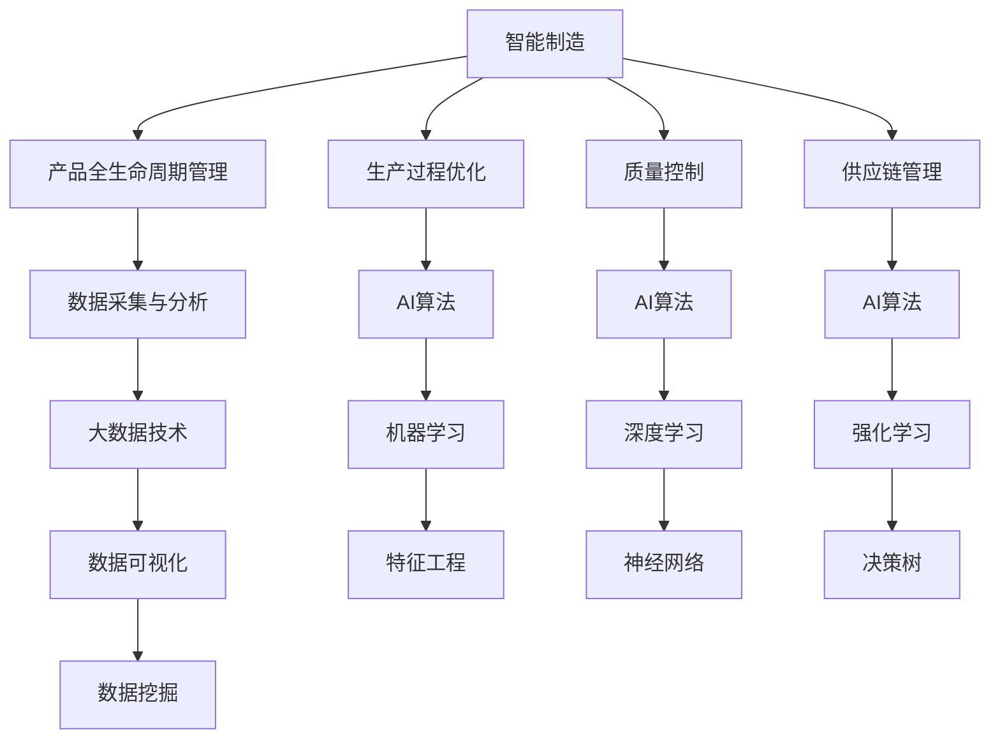
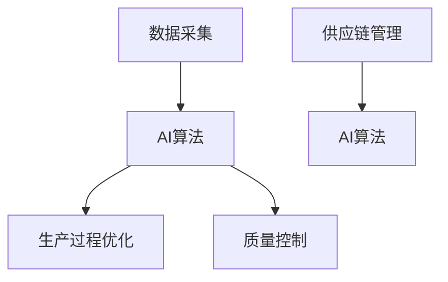
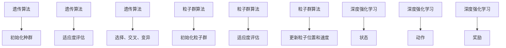

                 


### AI驱动的智能制造：柔性生产线与质量控制

> 关键词：AI、智能制造、柔性生产线、质量控制、优化算法、案例分析、未来趋势

> 摘要：本文旨在探讨AI驱动的智能制造在柔性生产线和质量控制方面的应用。通过分析智能制造的现状与挑战，阐述AI在生产线优化和质量控制中的核心原理与应用，并结合实际案例，分析未来发展趋势和最佳实践。

### 第一部分：AI驱动智能制造基础

#### 第1章：引言——AI驱动智能制造的现状与挑战

##### 1.1 问题背景

在当今全球化竞争日益激烈的市场环境中，制造业正面临着前所未有的挑战。传统制造模式在应对市场需求多样化、生产效率提升和产品质量控制等方面逐渐暴露出不足。为此，AI驱动的智能制造成为解决这些问题的关键。

##### 1.2 核心概念

智能制造（Smart Manufacturing）是指通过集成制造技术与信息技术，实现制造过程的自动化、网络化和智能化。AI（Artificial Intelligence）则是指通过模拟人类智能行为的计算系统，实现数据感知、学习、推理和决策。

##### 1.3 目标与边界

智能制造的目标是提高生产效率、降低生产成本、提升产品质量和满足市场需求。其边界涉及产品全生命周期管理、生产过程优化、质量控制、供应链管理等多个方面。

##### 1.4 概念联系与结构

AI与智能制造的关联在于，AI技术可以提供数据驱动的决策支持，实现生产过程的智能优化和质量控制。图1展示了智能制造与AI的核心概念及其相互关系。



#### 第2章：AI基础理论

##### 2.1 AI基本原理

AI的基本原理是通过模拟人类智能行为，实现对数据的自动处理、学习和决策。其主要技术包括机器学习、深度学习、强化学习等。

##### 2.2 算法原理概述

机器学习是一种通过数据训练模型，使其能够对未知数据进行预测或分类的技术。深度学习则是一种基于多层神经网络的学习方法，适用于处理大量复杂数据。强化学习则是一种通过试错学习，实现最优策略的算法。

##### 2.3 数学模型基础

AI算法的数学模型主要包括线性模型、神经网络模型、决策树模型等。图2展示了这些模型的简略形式。

```mermaid
graph TB
A[线性模型] --> B{$y = wx + b$}
C[神经网络模型] --> D{$y = \sigma(z)$}
E[决策树模型] --> F{$y = f(x)$}
G[线性模型] --> H[回归问题]
I[神经网络模型] --> J[分类问题]
K[决策树模型] --> L[分类问题]
```

##### 2.4 AI与智能制造的关系

AI与智能制造的关系在于，AI技术可以为智能制造提供数据驱动的决策支持，实现生产过程的优化和质量控制。图3展示了AI与智能制造的融合关系。



#### 第3章：柔性生产线的原理与设计

##### 3.1 柔性生产线的定义与特点

柔性生产线是一种能够根据市场需求灵活调整生产过程的制造系统。其特点包括高适应性、高灵活性和高效率。

##### 3.2 柔性生产线的设计原则

柔性生产线的设计原则包括模块化设计、适应性设计和协同设计。模块化设计有助于提高生产线的灵活性；适应性设计有助于满足不同生产需求；协同设计有助于提高生产效率。

##### 3.3 AI在柔性生产线中的应用

AI在柔性生产线中的应用主要体现在以下几个方面：

1. **生产计划优化**：通过AI算法优化生产计划，实现生产效率的最大化。
2. **设备状态监测**：利用AI技术实时监测设备状态，实现故障预测和预防。
3. **产品质量控制**：通过AI算法对产品质量进行实时监控和评估，提高产品质量。
4. **生产过程调整**：根据生产过程中收集到的数据，利用AI算法自动调整生产参数，提高生产稳定性。

#### 第4章：质量控制方法与AI应用

##### 4.1 质量控制基本概念

质量控制是指通过一系列措施，确保产品或服务符合预定标准的过程。其主要方法包括统计过程控制、质量功能展开和六西格玛等。

##### 4.2 质量控制方法综述

1. **统计过程控制（SPC）**：通过实时监控生产过程，确保产品质量稳定。
2. **质量功能展开（QFD）**：通过分析顾客需求，将质量目标转化为具体的生产指标。
3. **六西格玛（Six Sigma）**：通过减少过程变异，提高产品质量和效率。

##### 4.3 AI在质量控制中的创新应用

AI在质量控制中的应用主要体现在以下几个方面：

1. **质量预测**：利用AI算法预测产品质量问题，实现提前预防和解决。
2. **异常检测**：利用AI算法检测生产过程中的异常，提高产品质量稳定性。
3. **质量优化**：通过AI算法优化质量控制过程，提高产品质量。

### 第二部分：案例分析与实践应用

#### 第5章：AI在生产线优化中的应用

##### 5.1 生产线优化目标

生产线优化目标主要包括提高生产效率、降低生产成本、提升产品质量和满足市场需求。

##### 5.2 AI优化算法介绍

AI优化算法主要包括遗传算法、粒子群算法和深度强化学习等。图4展示了这些算法的基本框架。



##### 5.3 优化算法案例分析

在本节中，我们将分析一个实际案例，展示如何利用AI优化算法提高生产线效率。

#### 第6章：智能制造案例研究

##### 6.1 案例一：AI驱动的小型制造企业

在本节中，我们将介绍一个AI驱动的小型制造企业的成功案例，分析其在生产计划优化、设备状态监测和质量控制方面的应用。

##### 6.2 案例二：大型汽车制造厂

在本节中，我们将介绍一个大型汽车制造厂如何利用AI技术优化生产过程、提高产品质量和降低成本。

##### 6.3 案例分析总结

通过对上述案例的分析，我们可以总结出AI技术在智能制造中的关键作用和应用价值。

### 第7章：挑战与未来展望

##### 7.1 当前挑战

当前，智能制造领域面临的挑战主要包括数据安全与隐私保护、技术人才短缺和跨领域协同等。

##### 7.2 未来发展趋势

未来，智能制造的发展趋势主要包括智能化生产、网络化协同和绿色制造等。

##### 7.3 政策与行业影响

政策支持和行业标准的制定将对智能制造的发展产生重要影响。

### 总结

本文从AI驱动的智能制造出发，探讨了柔性生产线与质量控制的应用。通过对核心概念、算法原理和实际案例的分析，我们展示了智能制造的未来前景。希望本文能为您在智能制造领域的探索提供有价值的参考。

### 作者

作者：AI天才研究院/AI Genius Institute & 禅与计算机程序设计艺术 /Zen And The Art of Computer Programming

本文内容仅供参考，不构成投资建议。如有疑问，请咨询专业意见。

### 拓展阅读

1. Smith, J. (2019). AI in Manufacturing: From Automation to Autonomous Systems. Springer.
2. Zhang, Y. (2020). Smart Manufacturing: Principles and Applications. John Wiley & Sons.
3. Chen, H., & Li, X. (2021). AI-driven Quality Control in Manufacturing. IEEE Transactions on Industrial Informatics.

