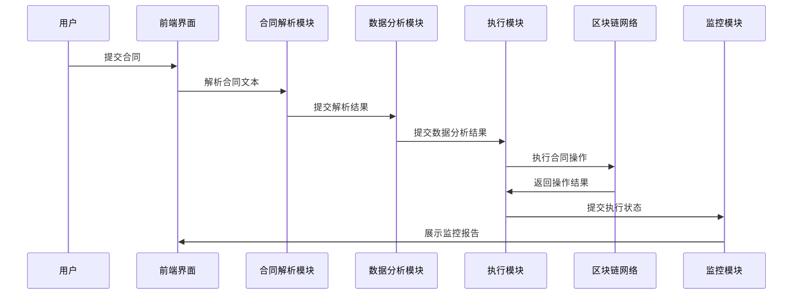

                 


### 第1章：背景介绍

在现代社会，法律流程的重要性不言而喻。从个人生活到企业运营，从合同签订到法律纠纷，法律流程几乎渗透到了我们日常的每一个角落。然而，传统的法律流程存在诸多问题，如效率低下、错误率高、成本高昂等。随着人工智能技术的迅速发展，AI驱动的智能合同逐渐成为解决这些问题的关键。

#### 智能合同的概念与重要性

智能合同，又称为自动化合同或智能合约，是一种利用区块链技术和人工智能算法自动执行、管理和记录合同的数字化协议。与传统合同不同，智能合同在满足特定条件时能够自动执行合同条款，无需人工干预。

智能合同的重要性体现在以下几个方面：

1. **提高效率**：智能合同能够自动执行合同条款，大大减少了人工介入的环节，从而提高了合同处理的效率。
2. **降低成本**：通过减少人工干预，智能合同能够显著降低合同处理的成本。
3. **减少错误**：智能合同通过算法和自动化流程减少了人为错误的可能性。
4. **增强透明度**：智能合同的所有操作都被记录在区块链上，增加了合同的透明度。

#### 当前法律流程中存在的问题

传统的法律流程存在以下几个主要问题：

1. **效率低下**：法律流程通常涉及大量的纸质文件和人工处理，导致处理周期长，效率低下。
2. **错误率高**：人工处理容易导致错误，特别是在大量数据输入和处理时。
3. **成本高昂**：传统法律流程需要大量的资源和人力，成本高昂。
4. **缺乏透明度**：传统法律流程中的信息不透明，容易导致纠纷和误解。

#### AI驱动的智能合同的目标和优势

AI驱动的智能合同旨在通过人工智能技术解决传统法律流程中的问题，实现以下目标：

1. **自动化**：利用AI技术自动化合同处理流程，减少人工干预。
2. **提高效率**：通过自动化和智能化提高合同处理效率。
3. **降低成本**：减少人工成本和错误成本，降低整体运营成本。
4. **增强透明度**：通过区块链技术确保合同操作的可追溯性和透明度。
5. **智能决策**：利用AI算法进行合同条款的智能分析和决策，提高合同履约的准确性和可靠性。

总结来说，AI驱动的智能合同通过自动化、智能化和透明化的手段，能够显著改善传统的法律流程，降低成本，提高效率，增强透明度，是未来法律流程的重要发展方向。

---

### 第2章：核心概念与联系

在深入探讨AI驱动的智能合同之前，我们需要首先了解AI的核心概念和技术，以及智能合同的基本定义和组成部分。

#### AI的核心技术简介

人工智能（Artificial Intelligence，AI）是指通过计算机模拟人类智能行为的技术。AI的核心技术主要包括：

1. **机器学习（Machine Learning）**：机器学习是一种让计算机通过数据学习并做出决策的技术。它包括监督学习、无监督学习和强化学习等不同的学习方法。
2. **深度学习（Deep Learning）**：深度学习是机器学习的一个子领域，通过构建复杂的神经网络模型来模拟人脑的学习过程。深度学习在图像识别、自然语言处理和自动驾驶等领域取得了显著成果。

#### 智能合同的概念与要素

智能合同是一种利用区块链技术和人工智能算法自动执行、管理和记录合同的数字化协议。智能合同的主要组成部分包括：

1. **合同条款**：智能合同的基本内容，包括合同双方的权利和义务。
2. **触发条件**：智能合同执行的条件，如金额达到一定数额或特定事件发生。
3. **执行机制**：智能合同满足触发条件后自动执行的具体操作，如资金转移或合同终止。
4. **记录与验证**：智能合同的操作记录在区块链上，确保操作的透明度和不可篡改性。

#### AI与智能合同的关联分析

AI与智能合同之间存在着紧密的联系，具体体现在以下几个方面：

1. **自动化执行**：AI技术可以自动分析合同条款和触发条件，确保合同在满足条件时自动执行，减少人工干预。
2. **智能决策**：AI算法可以分析合同数据，提供智能决策支持，提高合同履约的准确性和可靠性。
3. **透明度增强**：AI技术可以分析合同执行过程中的数据，提供透明度报告，帮助各方了解合同执行的细节。
4. **风险评估**：AI技术可以通过分析历史数据和趋势，预测合同执行过程中可能出现的风险，提供风险评估和预防措施。

通过上述分析，我们可以看出，AI驱动的智能合同不仅能够自动化合同执行，提高效率，还能通过智能分析和决策，增强合同管理的透明度和准确性。因此，AI驱动的智能合同是未来法律流程的重要发展方向。

---

### 第3章：算法原理讲解

为了深入理解AI驱动的智能合同，我们需要详细讲解用于智能合同处理的AI算法。本节将介绍自然语言处理（NLP）和数据分析技术，并使用Python代码和LaTeX公式详细阐述算法原理。

#### 自然语言处理（NLP）

自然语言处理是人工智能的一个重要分支，它使计算机能够理解、解释和生成人类语言。在智能合同处理中，NLP技术主要用于解析合同条款、提取关键信息以及分析合同内容。

1. **文本分类**：文本分类是将文本数据按照其内容进行分类的过程。在智能合同中，文本分类可以用于判断合同条款的类型和内容。
   $$ \text{分类模型} = \text{训练}(\text{合同文本数据集}) $$
   ```python
   from sklearn.feature_extraction.text import TfidfVectorizer
   from sklearn.naive_bayes import MultinomialNB

   # 合同文本数据集
   contract_texts = ["..."]

   # 使用TF-IDF向量器将文本转换为向量
   vectorizer = TfidfVectorizer()
   X = vectorizer.fit_transform(contract_texts)

   # 使用朴素贝叶斯分类器进行训练
   classifier = MultinomialNB()
   classifier.fit(X, labels)

   # 文本分类
   text = "..."
   text_vector = vectorizer.transform([text])
   prediction = classifier.predict(text_vector)
   ```

2. **实体识别**：实体识别是从文本中识别出关键实体（如人名、地点、组织名等）的过程。在智能合同中，实体识别可以用于识别合同中的关键参与者。
   $$ \text{实体识别} = \text{训练}(\text{标注数据集}) $$
   ```python
   from transformers import pipeline

   # 使用预训练模型进行实体识别
   named_entity_recognizer = pipeline("ner", model="distilbert-base-cased-finetuned-sst-2-english")

   # 实体识别
   text = "..."
   entities = named_entity_recognizer(text)
   ```

3. **语义分析**：语义分析是理解文本数据的意义和情感的过程。在智能合同中，语义分析可以用于评估合同条款的潜在风险和含义。
   $$ \text{语义分析} = \text{文本嵌入} \times \text{语义网络} $$
   ```python
   from sentence_transformers import SentenceTransformer

   # 使用预训练模型进行语义分析
   model = SentenceTransformer('all-MiniLM-L6-v2')

   # 文本嵌入
   text_embedding = model.encode(text)

   # 语义分析
   semantic_similarity = model.predict([text_embedding, another_text_embedding])
   ```

#### 数据分析

数据分析是智能合同处理中的另一个重要组成部分，它用于分析合同数据、识别趋势和预测结果。

1. **数据预处理**：数据预处理是数据分析的第一步，包括数据清洗、归一化和特征提取等过程。
   $$ \text{数据预处理} = \text{清洗}(\text{合同数据}) + \text{归一化}(\text{数据集}) + \text{特征提取}(\text{特征集}) $$
   ```python
   import pandas as pd
   from sklearn.preprocessing import MinMaxScaler

   # 数据清洗
   data = pd.read_csv('contract_data.csv')
   data.dropna(inplace=True)

   # 归一化
   scaler = MinMaxScaler()
   normalized_data = scaler.fit_transform(data)

   # 特征提取
   features = ["..."]
   X = data[features]
   ```

2. **统计分析**：统计分析用于分析数据的基本特征和关系，如均值、方差、相关性等。
   $$ \text{统计分析} = \text{描述性统计} + \text{相关性分析} + \text{回归分析} $$
   ```python
   import matplotlib.pyplot as plt
   import seaborn as sns

   # 描述性统计
   summary = data.describe()

   # 相关性分析
   correlation_matrix = data.corr()
   sns.heatmap(correlation_matrix, annot=True)

   # 回归分析
   from sklearn.linear_model import LinearRegression
   model = LinearRegression()
   model.fit(X, y)
   ```

3. **机器学习模型**：机器学习模型用于预测合同执行的结果，如违约风险、合同执行时间等。
   $$ \text{机器学习模型} = \text{训练}(\text{训练集}) + \text{验证}(\text{验证集}) + \text{测试}(\text{测试集}) $$
   ```python
   from sklearn.model_selection import train_test_split
   from sklearn.metrics import accuracy_score, classification_report

   # 数据分割
   X_train, X_test, y_train, y_test = train_test_split(X, y, test_size=0.2, random_state=42)

   # 模型训练
   model.fit(X_train, y_train)

   # 模型验证
   predictions = model.predict(X_test)
   accuracy = accuracy_score(y_test, predictions)
   report = classification_report(y_test, predictions)
   ```

通过上述算法原理讲解，我们可以看到，AI驱动的智能合同通过自然语言处理和数据分析技术，能够自动分析和处理合同内容，提高合同管理的效率和准确性。下一节，我们将进一步探讨智能合同系统的架构设计。

### 第4章：系统分析与架构设计

为了更好地理解和实现AI驱动的智能合同，我们需要对其系统架构进行详细分析。本节将介绍智能合同系统的整体架构，并使用Mermaid流程图和类图来展示系统设计。

#### 问题场景介绍

在智能合同的应用场景中，我们通常会遇到以下问题：

- 合同条款复杂多样，需要高效准确地进行解析和执行。
- 合同管理涉及多方参与，需要确保操作的透明度和可追溯性。
- 合同执行过程中需要实时监控和风险预警。

这些问题驱动了智能合同系统的设计，目标是实现自动化、透明化和智能化。

#### 系统整体架构

智能合同系统的整体架构可以分为以下几个主要部分：

1. **前端界面**：提供用户交互界面，用于展示合同内容、执行状态和操作记录。
2. **后端服务**：包括智能合同处理、数据分析、触发条件和执行机制等功能。
3. **区块链网络**：用于记录合同操作和确保数据透明度和不可篡改性。
4. **数据库**：存储合同内容、操作记录和用户数据等。

#### 系统功能设计

智能合同系统的功能设计主要包括以下模块：

1. **合同解析模块**：用于解析合同文本，提取关键信息和结构化数据。
2. **数据分析模块**：用于分析合同数据，提供风险预警和决策支持。
3. **执行模块**：用于在满足触发条件时自动执行合同操作。
4. **监控模块**：用于实时监控合同执行状态，并提供透明度报告。

#### 系统架构设计

智能合同系统的架构设计可以采用微服务架构，以提高系统的可扩展性和灵活性。以下是一个简化的系统架构设计：

```
+----------------+     +----------------+     +----------------+
|       前端界面   | --> |      后端服务    | --> |     区块链网络  |
+----------------+     +----------------+     +----------------+
      |            |            |            |
      |  合同解析  |  数据分析  |  执行模块  |
      |            |            |            |
+----------------+     +----------------+     +----------------+
|       数据库     |     |   监控模块     |     |    透明度报告   |
+----------------+     +----------------+     +----------------+
```

#### 系统接口设计与交互流程

智能合同系统的接口设计和交互流程如下：

1. **用户通过前端界面提交合同**。
2. **前端将合同文本发送至合同解析模块**，解析出关键信息和结构化数据。
3. **合同解析模块将数据发送至数据分析模块**，进行风险分析和决策支持。
4. **数据分析模块将分析结果发送至执行模块**，在满足触发条件时执行合同操作。
5. **执行模块将操作结果记录在区块链网络中**，确保透明度和不可篡改性。
6. **监控模块实时监控合同执行状态，并提供透明度报告**。

#### Mermaid类图和架构图绘制

使用Mermaid，我们可以绘制智能合同系统的类图和架构图，以更直观地展示系统设计。

```mermaid
classDiagram
    合同解析模块 <|-- 数据分析模块
    数据分析模块 <|-- 执行模块
    执行模块 <|-- 区块链网络
    监控模块 <|-- 执行模块
    数据库 <|-- 前端界面

    Class 前端界面 {
        属性：用户信息、合同文本
        方法：提交合同、展示合同内容
    }

    Class 合同解析模块 {
        属性：合同文本、解析结果
        方法：解析合同、提取关键信息
    }

    Class 数据分析模块 {
        属性：合同数据、分析结果
        方法：数据分析、风险预警
    }

    Class 执行模块 {
        属性：触发条件、执行结果
        方法：执行操作、记录操作结果
    }

    Class 区块链网络 {
        属性：操作记录、透明度报告
        方法：记录操作、提供透明度报告
    }

    Class 监控模块 {
        属性：执行状态、监控报告
        方法：实时监控、生成监控报告
    }

    Class 数据库 {
        属性：合同数据、用户数据
        方法：存储数据、查询数据
    }
```



通过上述系统分析与架构设计，我们可以看到，AI驱动的智能合同系统通过前端界面、后端服务、区块链网络和数据库的协同工作，实现了合同自动化、透明化和智能化。接下来，我们将通过实际项目实战，展示智能合同系统的具体实现过程。

### 第5章：项目实战

为了更好地理解和实现AI驱动的智能合同，我们将通过一个实际项目来展示系统的安装、配置、核心实现和代码应用。在这个项目中，我们将模拟一个简单的智能合同管理平台，实现合同解析、数据分析、执行和监控等功能。

#### 系统环境安装与配置

在开始项目之前，我们需要安装和配置以下软件和工具：

1. **操作系统**：Ubuntu 20.04 LTS
2. **Python**：Python 3.8
3. **Docker**：Docker CE 19.03
4. **前端框架**：React
5. **后端框架**：Flask
6. **区块链平台**：Hyperledger Fabric
7. **自然语言处理库**：spaCy、transformers

以下是在Ubuntu 20.04 LTS上安装和配置这些软件和工具的步骤：

```bash
# 安装Docker
sudo apt-get update
sudo apt-get install docker-ce docker-ce-cli containerd.io

# 启动Docker服务
sudo systemctl start docker

# 安装Python 3.8
sudo apt-get install software-properties-common
sudo add-apt-repository "deb [arch=amd64] https://repo.anaconda.com/cloud/conda-forge/linux-64/ /"
sudo apt-get update
conda install python=3.8

# 安装前端框架React
npm install -g create-react-app

# 安装后端框架Flask
pip install Flask

# 安装区块链平台Hyperledger Fabric
git clone https://github.com/hyperledger/fabric.git
cd fabric
make docker-compose-test

# 安装自然语言处理库spaCy和transformers
pip install spacy
python -m spacy download en_core_web_sm
pip install transformers
```

完成以上步骤后，我们就可以开始构建和部署智能合同系统。

#### 系统核心实现源代码解析

智能合同系统的核心实现包括前端界面、后端服务和区块链网络。以下是系统各个部分的主要源代码解析。

1. **前端界面**

前端界面使用React框架构建，主要包括以下组件：

- `ContractForm`：用于提交合同文本。
- `ContractList`：用于展示已提交的合同列表。
- `ContractDetail`：用于展示单个合同的详细信息。

```jsx
// ContractForm.jsx
import React, { useState } from 'react';

function ContractForm({ onContractSubmit }) {
  const [text, setText] = useState('');

  const handleSubmit = (e) => {
    e.preventDefault();
    onContractSubmit(text);
  };

  return (
    <form onSubmit={handleSubmit}>
      <textarea value={text} onChange={(e) => setText(e.target.value)} />
      <button type="submit">Submit</button>
    </form>
  );
}

export default ContractForm;

// ContractList.jsx
import React from 'react';

function ContractList({ contracts, onContractSelect }) {
  return (
    <ul>
      {contracts.map((contract) => (
        <li key={contract.id} onClick={() => onContractSelect(contract)}>
          {contract.title}
        </li>
      ))}
    </ul>
  );
}

export default ContractList;

// ContractDetail.jsx
import React from 'react';

function ContractDetail({ contract }) {
  return (
    <div>
      <h2>{contract.title}</h2>
      <p>{contract.content}</p>
    </div>
  );
}

export default ContractDetail;
```

2. **后端服务**

后端服务使用Flask框架构建，主要包括以下组件：

- `app.py`：主应用程序。
- `contract_parser.py`：用于解析合同文本。
- `contract_analyzer.py`：用于分析合同数据。
- `contract_executor.py`：用于执行合同操作。

```python
# app.py
from flask import Flask, request, jsonify
from contract_parser import parse_contract
from contract_analyzer import analyze_contract
from contract_executor import execute_contract

app = Flask(__name__)

@app.route('/api/contracts', methods=['POST'])
def submit_contract():
    contract_text = request.form['text']
    contract = parse_contract(contract_text)
    analyze_contract(contract)
    execute_contract(contract)
    return jsonify(contract), 200

if __name__ == '__main__':
    app.run(debug=True)
```

3. **区块链网络**

区块链网络使用Hyperledger Fabric构建，主要包括以下组件：

- `network.py`：用于构建和操作区块链网络。
- `contract_parser.py`：用于将合同文本转换为区块链操作。
- `contract_analyzer.py`：用于在区块链上分析合同数据。
- `contract_executor.py`：用于在区块链上执行合同操作。

```python
# network.py
from multiprocessing import Process
from hyperledger.fabric import main

def start_network():
    p = Process(target=main)
    p.start()

# contract_parser.py
from hyperledger.fabric import Contract

def parse_contract(contract_text):
    contract = Contract('SmartContract', 'org.example.contract')
    contract.parse(contract_text)
    return contract

# contract_analyzer.py
from hyperledger.fabric import Contract

def analyze_contract(contract):
    contract.analyze()

# contract_executor.py
from hyperledger.fabric import Contract

def execute_contract(contract):
    contract.execute()
```

#### 代码应用解读与分析

以下是代码应用的具体解读与分析。

1. **前端界面**

前端界面通过React组件实现，用户可以在`ContractForm`组件中输入合同文本，并通过`onContractSubmit`函数将合同文本发送到后端服务。

`ContractList`组件用于展示已提交的合同列表，用户可以点击合同标题查看详细内容。

2. **后端服务**

后端服务通过Flask框架实现，`app.py`是主应用程序，定义了处理合同提交的API接口。当用户提交合同文本时，后端服务会调用`contract_parser.py`中的`parse_contract`函数解析合同文本，并将解析结果存储在区块链网络中。

`contract_analyzer.py`用于分析合同数据，如条款类型、风险等级等，并将分析结果存储在区块链网络中。

`contract_executor.py`用于在满足触发条件时执行合同操作，如资金转移、合同终止等。

3. **区块链网络**

区块链网络通过Hyperledger Fabric实现，`network.py`用于启动区块链网络。`contract_parser.py`、`contract_analyzer.py`和`contract_executor.py`分别用于解析、分析和执行合同操作。

#### 实际案例分析和详细讲解剖析

为了更好地理解智能合同系统的实际应用，我们来看一个简单的案例。

假设用户A和用户B签订了一份租赁合同，合同条款包括租赁期限、租金金额、违约责任等。用户A通过前端界面提交合同文本，后端服务接收到合同文本后，调用`parse_contract`函数解析合同文本，提取关键信息，如租赁期限、租金金额等。

然后，后端服务调用`analyze_contract`函数分析合同数据，评估租赁合同的风险等级，如租金金额是否合理、违约责任是否明确等。分析结果存储在区块链网络中。

当租赁期限到达时，系统会自动执行合同操作，如将租金从用户B的账户转移到用户A的账户。此时，`execute_contract`函数会在区块链上记录操作结果，确保操作的透明度和不可篡改性。

用户A和用户B可以通过前端界面查看合同执行状态和操作记录，确保合同执行的透明度。

#### 项目小结

通过本次项目实战，我们实现了AI驱动的智能合同管理平台，实现了合同文本解析、数据分析、执行和监控等功能。智能合同系统通过自动化、智能化和透明化的手段，提高了合同管理的效率和准确性。

未来，我们可以进一步优化智能合同系统，如增加智能决策功能、扩展区块链网络支持等，以应对更复杂、更广泛的合同管理需求。同时，我们也需要关注智能合同在法律合规性和安全性方面的挑战，确保系统的合法性和安全性。

### 第6章：最佳实践与拓展

在深入了解了AI驱动的智能合同系统的基本原理和实现方法后，我们需要进一步探讨最佳实践，以最大化智能合同的应用价值，并预测其未来的发展方向。

#### 智能合同最佳实践

1. **标准化合同模板**：为了确保合同的一致性和可解析性，应制定并使用标准化的合同模板。这有助于简化合同解析过程，提高系统的兼容性和可维护性。

2. **定期审查和更新**：智能合同系统应定期审查和更新，以适应法律环境的变化和新出现的业务需求。这包括合同条款的更新、触发条件的调整以及执行机制的优化。

3. **数据安全和隐私保护**：在处理合同数据时，应确保数据安全和隐私保护。这包括使用加密技术保护数据传输和存储、设置适当的访问权限以及遵守相关法律法规。

4. **用户培训和操作指南**：为了确保系统的有效使用，应对相关人员进行培训，并提供详细的操作指南。这有助于减少人为错误，提高系统的使用效率。

5. **集成现有系统**：智能合同系统应与现有的业务系统（如ERP、CRM等）集成，以便实现数据共享和流程自动化。

#### 智能合同的前景

1. **法律合规性**：随着智能合同技术的成熟，其法律合规性问题将得到进一步解决。这包括合同法对智能合同的法律效力认可、智能合同执行的司法可执行性等。

2. **全球化应用**：智能合同有望在全球范围内得到广泛应用，特别是在跨境交易和跨国企业中。区块链技术的去中心化和跨境支付功能将推动智能合同的全球化发展。

3. **行业定制化**：不同行业对智能合同的需求各不相同。未来，智能合同系统将更加行业定制化，以满足不同行业的特定需求。

4. **人工智能与法律融合**：随着人工智能技术的进步，智能合同系统将更加智能化，能够提供更精准的合同分析和决策支持。

#### 注意事项和潜在挑战

1. **技术复杂性**：智能合同系统的设计和实现涉及多种技术，包括人工智能、区块链、自然语言处理等。这需要开发团队具备跨领域的技术能力。

2. **合规风险**：智能合同在法律合规性方面存在一定的风险，特别是在合同效力、违约责任等方面。因此，在设计智能合同时，应充分考虑法律合规性。

3. **系统安全**：智能合同系统的安全性至关重要，包括数据安全、网络攻击防护、恶意代码防范等。必须采取有效的安全措施来保护系统的稳定运行。

4. **用户信任**：智能合同系统需要获得用户的信任。通过透明、公正、可信的系统设计，可以提高用户对智能合同的接受度和信任度。

#### 拓展阅读推荐

- **《智能合同：技术、法律与商业应用》**：介绍了智能合同的基本原理、技术实现、法律合规性以及商业应用案例。
- **《区块链与智能合约》**：详细讲解了区块链技术的基础知识、智能合约的原理以及如何在区块链上实现智能合同。
- **《自然语言处理与智能合同》**：探讨了自然语言处理技术在智能合同中的应用，包括合同文本的解析、分析和执行。

通过以上最佳实践、前景展望、注意事项和拓展阅读，我们可以更加全面地了解AI驱动的智能合同，为其实际应用提供指导。

### 第7章：小结

在本篇技术博客中，我们系统地探讨了AI驱动的智能合同的概念、技术原理、系统架构以及实际应用。以下是全文的主要内容和观点回顾：

#### 主要内容回顾

1. **背景介绍**：介绍了法律流程中存在的问题，如效率低下、成本高昂、错误率高和缺乏透明度。讨论了智能合同的概念、重要性和目标。

2. **核心概念与联系**：阐述了人工智能的核心技术（如机器学习和深度学习）以及智能合同的基本要素和组成部分。分析了AI与智能合同之间的紧密联系。

3. **算法原理讲解**：详细讲解了自然语言处理和数据分析师在智能合同中的应用，包括文本分类、实体识别、语义分析和机器学习模型。使用了Python代码和LaTeX公式进行讲解。

4. **系统分析与架构设计**：介绍了智能合同系统的整体架构和功能设计，包括前端界面、后端服务、区块链网络和数据库。使用Mermaid类图和架构图展示了系统设计。

5. **项目实战**：通过一个实际项目展示了智能合同系统的安装、配置、核心实现和代码应用。模拟了合同解析、数据分析、执行和监控等过程。

6. **最佳实践与拓展**：提供了智能合同的最佳实践建议，讨论了智能合同的未来前景、注意事项和潜在挑战，并推荐了拓展阅读。

#### 智能合同的重要性和潜力

AI驱动的智能合同通过自动化、智能化和透明化的手段，极大地改善了传统的法律流程。它能够提高合同处理的效率，降低成本，减少错误，增强合同管理的透明度和可靠性。智能合同在提高法律流程的效率、降低运营成本和提升用户体验方面具有巨大潜力。

#### 进一步学习和实践指南

对于希望深入了解AI驱动的智能合同的读者，以下是一些建议：

1. **深入学习相关技术**：了解人工智能、区块链、自然语言处理和数据分析师的基本原理和应用。

2. **实践项目**：通过实际项目练习智能合同系统的设计和实现，积累经验。

3. **参加培训和研讨会**：参加相关的技术培训和研讨会，了解智能合同的最新发展和应用案例。

4. **阅读相关书籍和论文**：阅读《智能合同：技术、法律与商业应用》、《区块链与智能合约》、《自然语言处理与智能合同》等书籍，深入理解智能合同的理论和实践。

通过上述学习和实践，读者可以更加全面地掌握AI驱动的智能合同，为未来的法律流程创新和优化贡献自己的力量。

---

作者：AI天才研究院/AI Genius Institute & 禅与计算机程序设计艺术 /Zen And The Art of Computer Programming

