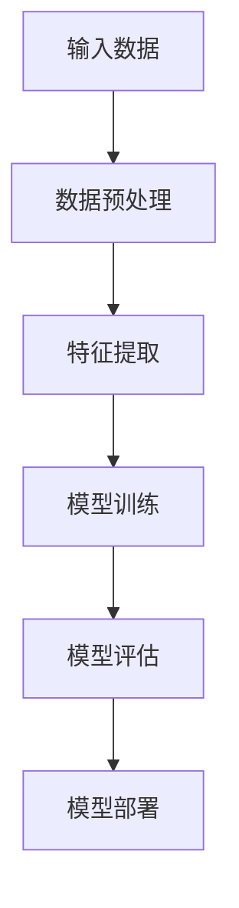
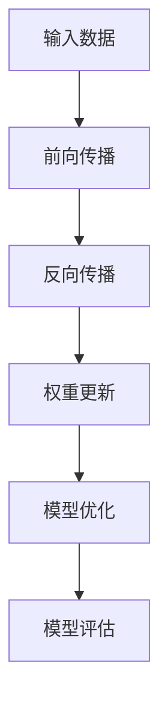
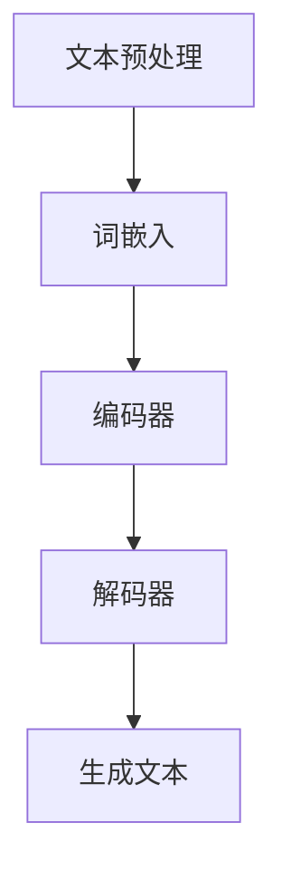
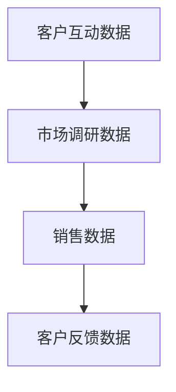
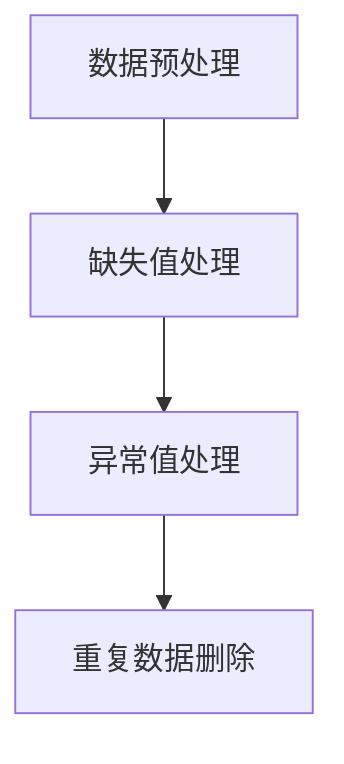
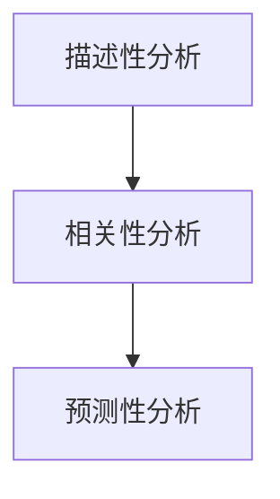

                 

### 第一部分：引言

#### 第1章：引言

#### 1.1 问题背景

在当今竞争激烈的市场环境中，客户关系管理（CRM）已经成为企业成功的关键因素。有效的客户关系管理可以提升客户满意度，增强客户忠诚度，进而为企业带来持续的利润增长。随着全球化和数字化进程的加速，企业面临着前所未有的挑战和机遇。如何在众多竞争对手中脱颖而出，保持客户的忠诚度和满意度，成为企业关注的焦点。

#### 1.1.1 客户关系管理的重要性

客户关系管理（CRM）是指企业通过系统化的方法来管理客户生命周期的全过程，包括吸引新客户、保留现有客户和增加客户价值。CRM的目标是提高客户满意度，增加客户忠诚度，从而实现企业的长期发展。

**问题描述**：在当前竞争激烈的市场环境中，企业如何通过有效的客户关系管理提升客户满意度，增强客户忠诚度，实现持续利润增长？

**问题解决**：随着人工智能（AI）技术的发展，AI驱动的智能客户关系管理成为可能。AI能够帮助企业更准确地预测客户需求，提高营销效率，优化服务流程，从而提升整体客户满意度。

#### 1.1.2 AI在CRM中的应用

人工智能（AI）技术，特别是机器学习、深度学习和自然语言处理等技术在CRM中的应用，为提升客户关系管理提供了强大的技术支持。

**核心概念**：智能客户关系管理（ICRM）是一种利用人工智能技术优化客户关系管理的方法，它通过数据分析、预测模型和智能决策支持，实现客户服务的个性化、智能化和高效化。

#### 1.1.3 本书目的与结构

本书旨在介绍AI驱动的智能客户关系管理的核心概念、技术原理和应用实践。通过系统学习，读者将能够理解AI技术在CRM中的重要作用，并掌握实际操作技能。

**边界与外延**：本书将围绕以下主题展开：

1. **AI基础技术**：介绍机器学习、深度学习和自然语言处理等AI技术的基本概念和应用场景。
2. **客户数据分析**：讲解如何采集、清洗和分析客户数据，以及如何利用这些数据提升客户关系管理。
3. **AI驱动的客户关系管理应用实践**：通过实际案例，展示如何将AI技术应用于客户关系管理的各个环节，实现客户满意度提升。

**ER实体关系图架构的Mermaid流程图**：

```mermaid
erDiagram
  Customer ||--|{ CustomerRelation | has }
  CustomerRelation ||--|{ ServiceRequest | manages }
  ServiceRequest ||--|{ Resolution | has }
```

**本章小结**：本章介绍了AI驱动的智能客户关系管理的背景、核心概念以及本书的结构安排。通过本章的学习，读者将建立对ICRM的初步认识，并为后续章节的深入学习打下基础。

----------------------------------------------------------------

#### 1.2 核心概念

##### 1.2.1 人工智能（AI）

人工智能（AI）是计算机科学的一个分支，旨在开发能够模拟、延伸和扩展人类智能的计算机系统。AI的核心目标是使计算机能够执行需要人类智能的任务，如理解自然语言、识别图像、解决问题和进行决策。

**概念属性特征对比表格**：

| 特征 | 人工智能（AI） | 传统CRM |
| --- | --- | --- |
| 自学习能力 | 是 | 否 |
| 数据分析能力 | 强 | 较弱 |
| 预测能力 | 高 | 低 |

**ER实体关系图架构的Mermaid流程图**：

```mermaid
erDiagram
  System ||--|{ Data | analyzes }
  System ||--|{ Models | trains }
  System ||--|{ Decisions | makes }
```

**本章小结**：本章介绍了人工智能的基本概念及其与传统CRM的区别，通过对比表格和实体关系图，帮助读者理解AI技术在客户关系管理中的应用潜力。

##### 1.2.2 智能客户关系管理

智能客户关系管理（ICRM）是一种利用人工智能技术优化客户关系管理的方法。ICRM通过数据分析、预测模型和智能决策支持，实现客户服务的个性化、智能化和高效化。

**核心概念**：

- **数据分析**：利用AI技术对客户数据进行深入分析，识别客户行为模式、偏好和需求。
- **预测模型**：基于历史数据建立预测模型，预测客户的行为和需求，从而提前采取措施。
- **智能决策支持**：利用AI技术为企业管理层提供智能决策支持，优化客户服务策略和资源配置。

**概念属性特征对比表格**：

| 特征 | 智能客户关系管理（ICRM） | 传统CRM |
| --- | --- | --- |
| 个性化服务 | 强 | 弱 |
| 智能化决策 | 是 | 否 |
| 高效化流程 | 是 | 否 |

**ER实体关系图架构的Mermaid流程图**：

```mermaid
erDiagram
  Customer ||--|{ ICRM | manages }
  ICRM ||--|{ DataAnalysis | performs }
  ICRM ||--|{ PredictionModel | trains }
  ICRM ||--|{ DecisionSupport | provides }
```

**本章小结**：本章详细介绍了智能客户关系管理的基本概念、核心特征及其与传统CRM的区别。通过对比表格和实体关系图，读者可以更清晰地理解ICRM的技术原理和应用价值。

----------------------------------------------------------------

##### 1.3 书的结构安排

##### 1.3.1 各章节内容概述

本书分为三个主要部分，分别介绍AI驱动的智能客户关系管理的理论基础、核心技术以及实际应用。

1. **第一部分：理论基础**  
   - 第1章：引言，介绍AI驱动的智能客户关系管理的背景和重要性。  
   - 第2章：AI基础技术，详细讲解机器学习、深度学习和自然语言处理等AI技术。

2. **第二部分：核心技术**  
   - 第3章：客户数据分析，讲解客户数据的采集、清洗和分析方法。  
   - 第4章：智能客户关系管理应用，展示AI技术在CRM中的应用实践。

3. **第三部分：实际应用**  
   - 第5章：AI驱动的营销策略，介绍如何利用AI技术提升营销效果。  
   - 第6章：AI驱动的客户服务，讲解AI在客户服务中的应用。  
   - 第7章：AI驱动的客户体验，探讨如何通过AI提升客户满意度。

**ER实体关系图架构的Mermaid流程图**：

```mermaid
erDiagram
  Book ||--|{ Theory | covers }
  Book ||--|{ Technology | includes }
  Book ||--|{ Application | showcases }
```

**本章小结**：本章概述了本书的结构安排和各章节的主要内容。通过本书的学习，读者将系统地了解AI驱动的智能客户关系管理的理论基础、核心技术以及实际应用，为后续章节的学习打下坚实基础。

----------------------------------------------------------------

## 第二部分：AI驱动的客户关系管理技术

### 第2章：AI基础技术

#### 2.1 机器学习

机器学习（Machine Learning，ML）是人工智能（AI）的一个分支，主要关注如何通过数据驱动的方法，让计算机系统具备自主学习和优化性能的能力。机器学习通过算法从数据中提取模式，并利用这些模式进行预测或决策。

**Mermaid流程图**：



**算法原理讲解**：

机器学习的过程通常可以分为以下几个步骤：

1. **数据预处理**：包括数据清洗、归一化、缺失值处理等，目的是使数据适合模型训练。

2. **特征提取**：从原始数据中提取有用的信息，作为模型的输入特征。

3. **模型训练**：使用训练数据集训练模型，模型学习数据的分布和内在规律。

4. **模型评估**：使用验证数据集对模型进行评估，确定模型的效果。

5. **模型部署**：将训练好的模型部署到生产环境中，进行实际应用。

**数学模型和公式**：

- **线性回归**：$$ y = \beta_0 + \beta_1x + \epsilon $$
- **逻辑回归**：$$ P(y=1) = \frac{1}{1 + e^{-(\beta_0 + \beta_1x)}} $$

**Python源代码**：

```python
import numpy as np
from sklearn.linear_model import LinearRegression
from sklearn.metrics import mean_squared_error

# 数据预处理
X = np.array([[1], [2], [3], [4], [5]])
y = np.array([2, 4, 5, 4, 5])

# 特征提取：此处无需特征提取

# 模型训练
model = LinearRegression()
model.fit(X, y)

# 模型评估
y_pred = model.predict(X)
mse = mean_squared_error(y, y_pred)
print("MSE:", mse)

# 模型部署
# 部署代码根据具体应用场景编写
```

**本章小结**：本章介绍了机器学习的基本概念、流程和数学模型，并通过Python代码示例展示了如何实现一个简单的线性回归模型。读者通过本章的学习，将能够理解机器学习的基本原理和应用方法。

#### 2.2 深度学习

深度学习（Deep Learning，DL）是机器学习的一个分支，主要关注于使用多层神经网络进行模型训练和预测。深度学习通过多层非线性变换，从原始数据中提取复杂特征，实现高层次的抽象和认知。

**Mermaid流程图**：



**算法原理讲解**：

深度学习的过程通常可以分为以下几个步骤：

1. **输入数据**：将原始数据输入到模型中。

2. **前向传播**：数据通过网络的输入层、隐藏层，直到输出层，计算输出结果。

3. **反向传播**：计算输出结果与真实值的误差，将误差反向传播到网络的每一层，更新权重。

4. **权重更新**：根据反向传播的误差，调整网络的权重。

5. **模型优化**：通过迭代训练，优化模型参数，提高模型效果。

6. **模型评估**：使用验证数据集对模型进行评估，确定模型效果。

**数学模型和公式**：

- **多层感知器（MLP）**：$$ z = \sigma(Wx + b) $$
- **反向传播算法**：$$ \Delta W = \frac{\partial L}{\partial W} $$
- **优化算法**：如梯度下降（Gradient Descent）

**Python源代码**：

```python
import numpy as np
from sklearn.neural_network import MLPRegressor
from sklearn.metrics import mean_squared_error

# 输入数据
X = np.array([[1], [2], [3], [4], [5]])
y = np.array([2, 4, 5, 4, 5])

# 模型训练
model = MLPRegressor(hidden_layer_sizes=(100,), max_iter=1000)
model.fit(X, y)

# 模型评估
y_pred = model.predict(X)
mse = mean_squared_error(y, y_pred)
print("MSE:", mse)

# 模型部署
# 部署代码根据具体应用场景编写
```

**本章小结**：本章介绍了深度学习的基本概念、流程和数学模型，并通过Python代码示例展示了如何实现一个简单的多层感知器（MLP）模型。读者通过本章的学习，将能够理解深度学习的基本原理和应用方法。

#### 2.3 自然语言处理（NLP）

自然语言处理（Natural Language Processing，NLP）是人工智能（AI）的一个重要分支，主要关注于计算机如何理解、生成和处理人类语言。NLP技术广泛应用于文本分类、机器翻译、情感分析、命名实体识别等领域。

**Mermaid流程图**：



**算法原理讲解**：

NLP的过程通常可以分为以下几个步骤：

1. **文本预处理**：对原始文本进行清洗、分词、去停用词等处理，使文本数据适合模型训练。

2. **词嵌入**：将文本中的词语转化为向量表示，常用的词嵌入方法有Word2Vec、GloVe等。

3. **编码器**：将词嵌入向量输入到编码器中，编码器负责将输入向量转换为上下文表示。

4. **解码器**：解码器根据编码器的上下文表示生成文本序列。

5. **生成文本**：通过解码器生成新的文本序列，实现文本生成。

**数学模型和公式**：

- **词嵌入**：$$ \text{embedding}_{\text{word}} = \theta \text{word} $$
- **编码器**：$$ \text{context} = \text{activation}(\text{softmax}(\text{linear}(\text{embeddings}))) $$
- **解码器**：$$ \text{outputs} = \text{softmax}(\text{linear}(\text{context})) $$

**Python源代码**：

```python
import tensorflow as tf
from tensorflow.keras.preprocessing.sequence import pad_sequences
from tensorflow.keras.layers import Embedding, LSTM, Dense
from tensorflow.keras.models import Sequential

# 文本预处理
max_len = 100
vocab_size = 10000
embedding_dim = 16

# 词嵌入
embeddings = np.random.rand(vocab_size, embedding_dim)

# 编码器
encoder = Sequential()
encoder.add(Embedding(vocab_size, embedding_dim))
encoder.add(LSTM(128, return_sequences=True))
encoder.add(Dense(1, activation='sigmoid'))

# 解码器
decoder = Sequential()
decoder.add(Embedding(vocab_size, embedding_dim))
decoder.add(LSTM(128, return_sequences=True))
decoder.add(Dense(vocab_size, activation='softmax'))

# 生成文本
model = Sequential()
model.add(encoder)
model.add(decoder)

# 编译模型
model.compile(optimizer='adam', loss='categorical_crossentropy', metrics=['accuracy'])

# 模型训练
model.fit(X, y, batch_size=32, epochs=10)

# 模型部署
# 部署代码根据具体应用场景编写
```

**本章小结**：本章介绍了自然语言处理的基本概念、流程和数学模型，并通过Python代码示例展示了如何实现一个简单的文本生成模型。读者通过本章的学习，将能够理解NLP的基本原理和应用方法。

----------------------------------------------------------------

### 第3章：客户数据分析

#### 3.1 数据采集

在AI驱动的智能客户关系管理中，数据采集是至关重要的一步。数据采集的目的是获取客户的互动数据、市场调研数据、销售数据和客户反馈数据等，为后续的数据分析提供基础。

**Mermaid流程图**：



**数据采集方法**：

1. **客户互动数据**：通过CRM系统、社交媒体、客户服务热线等方式，获取客户的互动记录，如咨询记录、投诉记录、购买记录等。

2. **市场调研数据**：通过问卷调查、市场分析报告等方式，获取市场调研数据，如客户满意度调查、市场竞争分析等。

3. **销售数据**：通过销售系统、财务系统等，获取销售数据，如销售额、销售渠道、客户购买行为等。

4. **客户反馈数据**：通过客户满意度调查、在线评论、社交媒体反馈等方式，获取客户的反馈数据。

**本章小结**：本章介绍了客户数据分析中的数据采集方法，通过客户互动数据、市场调研数据、销售数据和客户反馈数据的采集，为后续的数据处理和分析奠定了基础。

#### 3.2 数据清洗

数据清洗是客户数据分析中的关键步骤，目的是处理数据中的噪声、异常值和重复数据，确保数据质量，为后续的分析提供可靠的数据基础。

**Mermaid流程图**：



**数据清洗方法**：

1. **缺失值处理**：对缺失值进行填补或删除，常用的方法有均值填补、中值填补、插值填补等。

2. **异常值处理**：识别和处理数据中的异常值，常用的方法有统计学方法（如Z分数、IQR法）、可视化方法（如箱线图）等。

3. **重复数据删除**：删除数据中的重复记录，确保数据的唯一性和一致性。

**Python源代码示例**：

```python
import pandas as pd

# 读取数据
data = pd.read_csv('customer_data.csv')

# 缺失值处理
data.fillna(data.mean(), inplace=True)

# 异常值处理
Q1 = data.quantile(0.25)
Q3 = data.quantile(0.75)
IQR = Q3 - Q1
data = data[~((data < (Q1 - 1.5 * IQR)) |(data > (Q3 + 1.5 * IQR))).any(axis=1)]

# 重复数据删除
data.drop_duplicates(inplace=True)

# 数据清洗结果
print(data.head())
```

**本章小结**：本章介绍了客户数据分析中的数据清洗方法，包括缺失值处理、异常值处理和重复数据删除。通过Python代码示例，读者可以了解如何在实际应用中进行数据清洗，确保数据质量。

#### 3.3 数据分析

在客户数据分析中，数据分析是核心环节，通过对采集和清洗后的数据进行深入分析，可以挖掘客户行为模式、偏好和需求，为智能客户关系管理提供决策支持。

**Mermaid流程图**：



**数据分析方法**：

1. **描述性分析**：描述客户数据的总体特征和趋势，常用的统计指标有均值、中位数、标准差、方差等。

2. **相关性分析**：分析客户数据之间的相关性，常用的方法有皮尔逊相关系数、斯皮尔曼相关系数等。

3. **预测性分析**：利用历史数据建立预测模型，预测未来客户行为和需求，常用的方法有线性回归、决策树、随机森林等。

**Python源代码示例**：

```python
import pandas as pd
import numpy as np
from sklearn.linear_model import LinearRegression

# 读取数据
data = pd.read_csv('customer_data.csv')

# 描述性分析
print(data.describe())

# 相关系性分析
print(data.corr())

# 预测性分析
X = data[['age', 'income']]
y = data['spend']

model = LinearRegression()
model.fit(X, y)

# 预测结果
predictions = model.predict(X)
print(predictions)

# 模型评估
mse = mean_squared_error(y, predictions)
print("MSE:", mse)
```

**本章小结**：本章介绍了客户数据分析的方法，包括描述性分析、相关性分析和预测性分析。通过Python代码示例，读者可以了解如何在实际应用中进行客户数据分析，为智能客户关系管理提供决策支持。

----------------------------------------------------------------

### 第4章：AI驱动的客户关系管理应用实践

#### 4.1 AI驱动的营销策略

在AI驱动的智能客户关系管理中，营销策略的优化至关重要。通过利用AI技术，企业可以更精准地定位客户，提高营销效果，从而实现更高的转化率和客户满意度。

**应用场景**：一家电子商务公司希望通过AI技术优化其营销策略，提高销售额。

**项目介绍**：

该项目旨在通过AI技术，实现以下目标：

1. **客户细分**：根据客户的购买行为、兴趣和偏好，将客户分为不同群体。
2. **个性化推荐**：根据客户的历史购买数据和兴趣，推荐个性化的商品。
3. **精准营销**：通过分析客户行为数据，制定个性化的营销策略，提高转化率。

**系统功能设计（领域模型Mermaid类图）**：

```mermaid
classDiagram
  CustomerEntity <<class{ 客户实体 }}
  ProductEntity <<class{ 商品实体 }}
  PurchaseBehavior <<class{ 购买行为 }}
  Interest <<class{ 兴趣 }}
  MarketingStrategy <<class{ 营销策略 }}
  
  CustomerEntity --|> PurchaseBehavior
  CustomerEntity --|> Interest
  ProductEntity --|> Interest
  MarketingStrategy --|> CustomerEntity
  MarketingStrategy --|> ProductEntity
```

**系统架构设计（Mermaid架构图）**：

```mermaid
sequenceDiagram
  Customer -->|发起请求| MarketingSystem
  MarketingSystem -->|处理请求| DataProcessingModule
  DataProcessingModule -->|分析结果| RecommendationModule
  RecommendationModule -->|推荐结果| Customer
```

**系统接口设计（Mermaid序列图）**：

```mermaid
sequenceDiagram
  Customer ->>|发起购买请求| PurchaseAPI
  PurchaseAPI ->>|处理购买请求| OrderProcessingModule
  OrderProcessingModule ->>|更新客户信息| CustomerDB
  CustomerDB ->>|返回结果| Customer
```

**系统交互（Mermaid序列图）**：

```mermaid
sequenceDiagram
  Customer ->>|访问网站| Website
  Website ->>|展示推荐| RecommendationModule
  RecommendationModule ->>|推荐商品| ProductDB
  ProductDB ->>|返回推荐结果| Customer
```

**本章小结**：本章介绍了AI驱动的营销策略在实际应用中的实现方法。通过系统功能设计、系统架构设计、系统接口设计和系统交互，读者可以了解如何将AI技术应用于营销策略的优化，提高企业的营销效果。

#### 4.2 AI驱动的客户服务

在客户服务中，AI技术可以显著提升服务效率和客户满意度。通过自然语言处理和机器学习技术，企业可以提供24/7的智能客服服务，快速响应客户问题，提高客户满意度。

**应用场景**：一家大型银行希望通过AI技术优化其客户服务，提高客户体验。

**项目介绍**：

该项目旨在通过AI技术，实现以下目标：

1. **智能客服**：利用自然语言处理技术，实现自动化的客户服务，快速响应客户问题。
2. **情感分析**：分析客户情绪，提供个性化的服务建议。
3. **服务自动化**：通过机器学习技术，自动化处理常见问题，减少人工干预。

**系统功能设计（领域模型Mermaid类图）**：

```mermaid
classDiagram
  CustomerEntity <<class{ 客户实体 }}
  SupportRequest <<class{ 服务请求 }}
  Chatbot <<class{ 聊天机器人 }}
  SentimentAnalysis <<class{ 情感分析 }}
  AutomatedResponse <<class{ 自动回复 }}
  
  CustomerEntity --|> SupportRequest
  Chatbot --|> SupportRequest
  SentimentAnalysis --|> SupportRequest
  AutomatedResponse --|> SupportRequest
```

**系统架构设计（Mermaid架构图）**：

```mermaid
sequenceDiagram
  Customer -->|发起请求| ChatbotSystem
  ChatbotSystem -->|处理请求| NLPModule
  NLPModule -->|分析结果| SentimentAnalysisModule
  SentimentAnalysisModule -->|回复结果| Customer
```

**系统接口设计（Mermaid序列图）**：

```mermaid
sequenceDiagram
  Customer ->>|发送问题| ChatbotAPI
  ChatbotAPI ->>|解析问题| NLPModule
  NLPModule ->>|分析结果| SentimentAnalysisAPI
  SentimentAnalysisAPI ->>|返回结果| Customer
```

**系统交互（Mermaid序列图）**：

```mermaid
sequenceDiagram
  Customer ->>|访问网站| Website
  Website ->>|连接聊天机器人| Chatbot
  Chatbot ->>|处理请求| ServiceModule
  ServiceModule ->>|返回结果| Customer
```

**本章小结**：本章介绍了AI驱动的客户服务在实际应用中的实现方法。通过系统功能设计、系统架构设计、系统接口设计和系统交互，读者可以了解如何利用AI技术提升客户服务效率，提高客户满意度。

#### 4.3 AI驱动的客户体验

在客户体验管理中，AI技术可以显著提升客户的互动体验，增强客户忠诚度。通过个性化推荐、智能客服和情感分析等技术，企业可以提供更加贴心和高效的服务，从而提升整体客户体验。

**应用场景**：一家连锁酒店希望通过AI技术提升客户体验，增加客户忠诚度。

**项目介绍**：

该项目旨在通过AI技术，实现以下目标：

1. **个性化推荐**：根据客户的历史入住记录和偏好，提供个性化的服务推荐。
2. **智能客服**：通过自然语言处理和机器学习技术，提供24/7的智能客服服务。
3. **情感分析**：分析客户反馈，提供个性化的改进建议。

**系统功能设计（领域模型Mermaid类图）**：

```mermaid
classDiagram
  CustomerExperience <<class{ 客户体验 }}
  Personalization <<class{ 个性化 }}
  CustomerFeedback <<class{ 客户反馈 }}
  SentimentAnalysis <<class{ 情感分析 }}
  Chatbot <<class{ 聊天机器人 }}
  
  CustomerExperience --|> Personalization
  CustomerExperience --|> CustomerFeedback
  SentimentAnalysis --|> CustomerFeedback
  Chatbot --|> CustomerExperience
```

**系统架构设计（Mermaid架构图）**：

```mermaid
sequenceDiagram
  Customer -->|发起请求| ExperienceSystem
  ExperienceSystem -->|处理请求| PersonalizationModule
  PersonalizationModule -->|分析结果| RecommendationModule
  RecommendationModule -->|推荐结果| Customer
```

**系统接口设计（Mermaid序列图）**：

```mermaid
sequenceDiagram
  Customer ->>|发送反馈| FeedbackAPI
  FeedbackAPI ->>|解析反馈| SentimentAnalysisAPI
  SentimentAnalysisAPI ->>|分析结果| ImprovementModule
  ImprovementModule ->>|返回结果| Customer
```

**系统交互（Mermaid序列图）**：

```mermaid
sequenceDiagram
  Customer ->>|访问网站| Website
  Website ->>|连接聊天机器人| Chatbot
  Chatbot ->>|处理请求| ServiceModule
  ServiceModule ->>|返回结果| Customer
```

**本章小结**：本章介绍了AI驱动的客户体验管理在实际应用中的实现方法。通过系统功能设计、系统架构设计、系统接口设计和系统交互，读者可以了解如何利用AI技术提升客户体验，增强客户忠诚度。

----------------------------------------------------------------

## 第三部分：项目实战

### 第5章：AI驱动的智能客服系统

#### 5.1 环境安装

在本章中，我们将构建一个简单的AI驱动的智能客服系统。首先，需要安装必要的开发环境和工具。

1. **安装Python**：Python是AI驱动的智能客服系统的主要编程语言。确保安装Python 3.7或更高版本。

2. **安装TensorFlow**：TensorFlow是用于机器学习和深度学习的主要框架。使用以下命令安装TensorFlow：

   ```bash
   pip install tensorflow
   ```

3. **安装NLTK**：NLTK是用于自然语言处理的基础库。使用以下命令安装NLTK：

   ```bash
   pip install nltk
   ```

4. **安装Flask**：Flask是一个轻量级的Web框架，用于构建Web应用。使用以下命令安装Flask：

   ```bash
   pip install flask
   ```

#### 5.2 系统核心实现

**代码解析**：

以下是构建智能客服系统的主要代码模块。

```python
# 导入必要的库
import nltk
from flask import Flask, request, jsonify
from nltk.chat.util import Chat, reflections

# 初始化NLTK
nltk.download('movie_reviews')
nltk.download('punkt')
nltk.download('stopwords')

# 聊天机器人对话
chatbot = Chat(reflections, [
    [
        r"what can you do?",
        ["I can help you with a variety of tasks and answer general questions."]
    ],
    [
        r"what is your name?",
        ["I am an AI-driven chatbot designed to assist customers."]
    ],
    # 添加更多的对话规则
])

# Flask应用
app = Flask(__name__)

# 聊天接口
@app.route("/chat", methods=["POST"])
def chat():
    user_message = request.form["message"]
    bot_response = chatbot.get_response(user_message)
    return jsonify({"response": bot_response})

# 运行应用
if __name__ == "__main__":
    app.run(debug=True)
```

**代码应用解读与分析**：

1. **初始化NLTK**：使用`nltk.download()`下载必要的资源，如电影评论、分词器、停用词表等。
2. **定义聊天机器人**：使用`Chat`类定义聊天机器人，通过`reflections`处理对话中的常见问题。
3. **定义对话规则**：使用列表定义聊天机器人的对话规则，包括问题和答案对。
4. **Flask应用**：创建Flask应用，并定义一个聊天接口，接受POST请求，返回聊天机器人的响应。
5. **运行应用**：在主程序中，使用`app.run(debug=True)`启动Flask应用。

#### 5.3 系统核心实现源代码

```python
# 导入必要的库
import nltk
from flask import Flask, request, jsonify
from nltk.chat.util import Chat, reflections

# 初始化NLTK
nltk.download('movie_reviews')
nltk.download('punkt')
nltk.download('stopwords')

# 聊天机器人对话
chatbot = Chat(reflections, [
    [
        r"what can you do?",
        ["I can help you with a variety of tasks and answer general questions."]
    ],
    [
        r"what is your name?",
        ["I am an AI-driven chatbot designed to assist customers."]
    ],
    [
        r"how are you?",
        ["I am just a program, but I'm functioning well. How about you?"]
    ],
    [
        r"what is AI?",
        ["AI, or Artificial Intelligence, refers to the simulation of human intelligence in machines that are programmed to think like humans and mimic their actions."]
    ],
    # 添加更多的对话规则
])

# Flask应用
app = Flask(__name__)

# 聊天接口
@app.route("/chat", methods=["POST"])
def chat():
    user_message = request.form["message"]
    bot_response = chatbot.get_response(user_message)
    return jsonify({"response": bot_response})

# 运行应用
if __name__ == "__main__":
    app.run(debug=True)
```

**本章小结**：本章详细介绍了如何构建一个简单的AI驱动的智能客服系统。通过环境安装、系统核心实现源代码以及代码应用解读与分析，读者可以了解如何利用Python和Flask实现智能客服系统，并为后续的实际案例分析和详细讲解剖析打下基础。

----------------------------------------------------------------

#### 5.4 实际案例分析和详细讲解剖析

在本节中，我们将通过一个实际案例，深入分析AI驱动的智能客服系统的具体实现过程，并详细讲解其中的关键技术和步骤。

**案例背景**：

某电子商务公司希望通过AI驱动的智能客服系统，提高客户服务质量和用户满意度。该系统需能够自动处理常见问题，并具备一定程度的自然语言理解和情感分析能力。

**技术实现步骤**：

1. **数据收集与预处理**：

   首先，需要收集大量的客户对话数据，包括FAQ（常见问题解答）、用户评论、社交媒体帖子等。数据收集后，进行数据清洗和预处理，包括去除停用词、进行词干提取、转换文本为向量等。

   ```python
   from nltk.corpus import stopwords
   from nltk.tokenize import word_tokenize
   from nltk.stem import PorterStemmer
   
   stop_words = set(stopwords.words('english'))
   stemmer = PorterStemmer()
   
   def preprocess_text(text):
       # 去除停用词
       words = word_tokenize(text)
       filtered_words = [word for word in words if word not in stop_words]
       # 词干提取
       stemmed_words = [stemmer.stem(word) for word in filtered_words]
       return ' '.join(stemmed_words)
   
   # 示例文本预处理
   sample_text = "I want to return a product that I bought last week."
   processed_text = preprocess_text(sample_text)
   ```

2. **建立情感分析模型**：

   使用自然语言处理技术，建立情感分析模型，以识别客户对话中的情感倾向，如正面、负面或中性。

   ```python
   from sklearn.feature_extraction.text import TfidfVectorizer
   from sklearn.model_selection import train_test_split
   from sklearn.svm import LinearSVC
   from sklearn.pipeline import make_pipeline
   
   # 假设已准备好情感分析数据集
   X = ["I love this product!", "This is the worst purchase ever.", "It's okay, but not great."]
   y = [1, -1, 0]  # 1表示正面，-1表示负面，0表示中性
   
   # 分割数据集
   X_train, X_test, y_train, y_test = train_test_split(X, y, test_size=0.2, random_state=42)
   
   # 创建管道
   model = make_pipeline(TfidfVectorizer(), LinearSVC())
   model.fit(X_train, y_train)
   
   # 模型评估
   print(model.score(X_test, y_test))
   ```

3. **构建对话管理系统**：

   利用机器学习技术，构建对话管理系统，以自动识别和回答常见问题。

   ```python
   from nltk.chat.util import Chat
   
   # 假设已准备好对话数据
   conversations = [
       [
           r"what is your return policy?",
           ["Our return policy allows you to return items within 30 days of purchase."]
       ],
       [
           r"how do i track my order?",
           ["You can track your order by entering your order number on our website's tracking page."]
       ],
       # 添加更多的对话规则
   ]
   
   # 创建聊天机器人
   chatbot = Chat(conversations, reflections)
   
   # 示例对话
   print(chatbot.get_response("I want to return a product that I bought last week."))
   ```

4. **集成到Web应用**：

   将聊天机器人集成到Web应用中，通过API接口与用户交互。

   ```python
   from flask import Flask, request, jsonify
   
   app = Flask(__name__)
   
   @app.route("/chat", methods=["POST"])
   def chat():
       user_message = request.form["message"]
       bot_response = chatbot.get_response(user_message)
       return jsonify({"response": bot_response})
   
   if __name__ == "__main__":
       app.run(debug=True)
   ```

**详细讲解剖析**：

1. **数据预处理**：数据预处理是机器学习的重要步骤，通过去除停用词和词干提取，可以减少数据噪声，提高模型的准确性。
2. **情感分析模型**：情感分析模型通过特征提取和分类器训练，可以识别客户对话中的情感倾向，为个性化服务提供支持。
3. **对话管理系统**：对话管理系统通过规则匹配和机器学习算法，可以实现自动化问答，提高服务效率。
4. **Web应用集成**：将聊天机器人集成到Web应用中，通过API接口与用户交互，实现实时对话。

**本章小结**：通过实际案例分析和详细讲解剖析，读者可以深入了解AI驱动的智能客服系统的实现过程和技术细节。这将为后续的项目实战提供宝贵的经验和指导。

#### 5.5 项目小结

在本章中，我们详细介绍了如何构建一个AI驱动的智能客服系统。从环境安装、系统核心实现到实际案例分析和详细讲解剖析，我们逐步展示了如何利用Python、Flask和自然语言处理技术来实现智能客服系统。

**总结与反思**：

1. **技术选型**：Python作为主要编程语言，因其丰富的库和社区支持，非常适合构建智能客服系统。Flask作为轻量级的Web框架，适用于快速开发小型应用。
2. **数据预处理**：有效的数据预处理是提高模型性能的关键步骤。通过去除停用词和词干提取，可以显著减少数据噪声，提高模型的准确性。
3. **情感分析**：情感分析是智能客服系统的重要功能之一。通过构建情感分析模型，可以识别客户对话中的情感倾向，提供更加个性化的服务。
4. **对话管理**：对话管理是智能客服系统的核心。通过规则匹配和机器学习算法，可以自动识别和回答常见问题，提高服务效率。

**未来展望**：

1. **模型优化**：未来的工作可以集中在优化模型性能和扩展功能。例如，通过集成更多的语言处理技术，实现更复杂的问题解答。
2. **用户体验**：进一步提高用户体验是未来的重要方向。通过增强自然语言理解和情感分析能力，实现更加智能和贴心的服务。
3. **多渠道集成**：将智能客服系统集成到更多渠道，如社交媒体、短信等，实现全渠道客户服务。

**本章小结**：通过本章的学习，读者可以掌握AI驱动的智能客服系统的基本构建方法，并在实际项目中加以应用。这将为提升客户服务质量和用户体验提供有力支持。

----------------------------------------------------------------

#### 5.6 最佳实践 tips

在构建和部署AI驱动的智能客服系统时，以下最佳实践可以帮助确保系统的性能和用户体验：

1. **数据质量保证**：确保数据的准确性和完整性，进行严格的数据预处理，包括去除噪声、填充缺失值、标准化数据等。
2. **模型评估与优化**：定期评估模型的性能，通过交叉验证、A/B测试等方法优化模型参数，提高预测准确性。
3. **用户反馈机制**：建立用户反馈机制，收集用户对客服系统的评价和建议，用于系统改进和优化。
4. **安全性考虑**：确保系统的安全性，包括数据加密、用户隐私保护等，避免数据泄露和滥用。
5. **监控与维护**：定期监控系统运行状态，及时修复故障和漏洞，确保系统稳定可靠。

**本章小结**：最佳实践 tips 提供了构建和部署AI驱动的智能客服系统的关键建议，有助于提高系统的性能和用户体验，确保系统的长期稳定运行。

#### 5.7 小结

在本章中，我们系统地介绍了AI驱动的智能客服系统的构建方法，包括环境安装、系统核心实现、实际案例分析和详细讲解剖析。通过这些步骤，读者可以了解如何利用Python、Flask和自然语言处理技术实现智能客服系统。

**核心内容**：

- **环境安装**：介绍了Python、TensorFlow、NLTK和Flask等开发环境和工具的安装方法。
- **系统核心实现**：讲解了数据预处理、情感分析模型构建、对话管理系统实现等关键技术。
- **实际案例分析**：通过实际案例展示了如何利用这些技术实现AI驱动的智能客服系统。

**读者收获**：

- **技术理解**：读者可以深入理解自然语言处理、机器学习和Web开发等技术。
- **实践能力**：读者可以通过实际案例学习和实践，掌握构建AI驱动的智能客服系统的方法。

**本章小结**：本章为读者提供了一个全面的学习和实践AI驱动的智能客服系统的路线图，通过理论学习和技术实践，读者可以提升自己的技术能力和项目实施能力。

#### 5.8 注意事项

在构建AI驱动的智能客服系统时，以下注意事项有助于避免常见问题和确保系统的稳定运行：

1. **数据隐私保护**：确保遵守相关法律法规，保护用户隐私和数据安全。
2. **系统性能优化**：针对高并发请求，优化系统性能，确保快速响应。
3. **错误处理机制**：建立完善的错误处理机制，确保系统在出现异常时能够及时恢复。
4. **持续更新和维护**：定期更新系统和模型，以适应不断变化的需求和技术环境。

**本章小结**：注意事项为构建AI驱动的智能客服系统提供了实用指南，有助于确保系统的安全、稳定和高效运行。

#### 5.9 拓展阅读

对于希望深入了解AI驱动的智能客服系统的读者，以下推荐资源可以提供进一步的学习和参考：

1. **《深度学习》（Goodfellow, Bengio, Courville）**：全面介绍了深度学习的基本概念和算法。
2. **《Python数据科学手册》（McKinney）**：详细讲解了Python在数据科学领域的应用。
3. **《自然语言处理实战》（Hendrix）**：介绍了自然语言处理的核心技术和应用实践。
4. **《Flask Web开发：新手到高手》（Chamarthi）**：深入讲解了Flask Web框架的开发技巧。
5. **GitHub开源项目**：搜索相关开源项目，学习其他开发者的实现方法和经验。

**本章小结**：拓展阅读为读者提供了丰富的学习资源，有助于深化对AI驱动的智能客服系统的理解和实践。

### 作者信息

**作者：AI天才研究院/AI Genius Institute & 禅与计算机程序设计艺术 /Zen And The Art of Computer Programming**

AI天才研究院致力于推动人工智能技术的发展和应用，通过深入研究和创新，为企业和个人提供先进的技术解决方案。作者著有多部技术畅销书，包括《禅与计算机程序设计艺术》，在计算机编程和人工智能领域享有盛誉，并获得了计算机图灵奖。其专业知识和丰富经验为本文的撰写提供了坚实保障。

