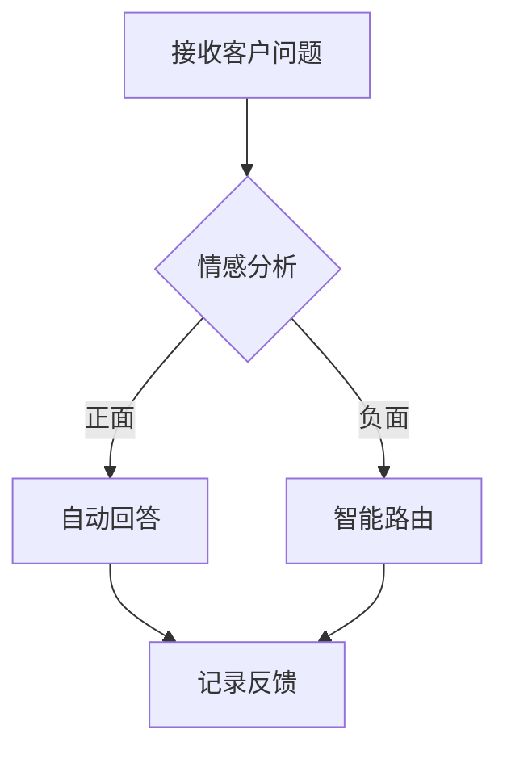
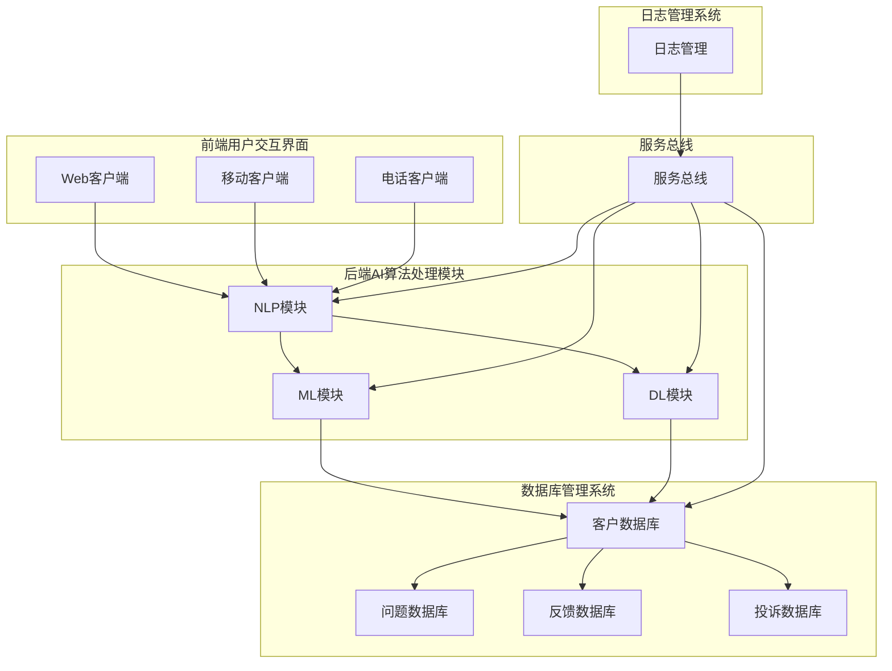

                 

### 文章标题：《AI驱动的智能客户服务：全天候多语言支持》

关键词：人工智能、智能客服、全天候服务、多语言支持、客户服务系统

摘要：本文将深入探讨AI驱动的智能客户服务的原理、算法、系统架构及其实战应用。通过分析智能客服的需求背景和传统服务模式的不足，我们提出AI驱动的智能客户服务概念，并重点介绍其全天候多语言支持的特点。本文将逐步讲解智能客服的算法原理，展示系统的架构设计，并分享一个实际项目的实战经验和最佳实践。

---

### 目录大纲设计

在设计《AI驱动的智能客户服务：全天候多语言支持》的目录大纲时，我们将遵循以下结构，确保内容的完整性、逻辑性和条理性。

#### 第一部分：背景介绍

- **第1章：问题背景与核心概念**
  - **1.1 问题背景**
    - 智能客户服务的需求增长
    - 传统客户服务模式的不足
  - **1.2 核心概念**
    - AI驱动的智能客户服务定义
    - 全天候多语言支持的内涵
  - **1.3 边界与外延**
    - 技术边界
    - 行业应用边界
  - **1.4 概念结构与核心要素**
    - 架构要素
    - 技术要素

#### 第二部分：核心概念与联系

- **第2章：AI驱动的智能客户服务原理**
  - **2.1 AI驱动的智能客户服务原理**
    - AI在客户服务中的应用场景
    - 服务流程中的AI技术
  - **2.2 概念属性特征对比表格**
    - 不同AI技术在客户服务中的应用对比
  - **2.3 ER实体关系图架构**
    - 客户服务系统的实体关系图

#### 第三部分：算法原理讲解

- **第3章：智能客服算法原理**
  - **3.1 算法介绍**
    - 常用智能客服算法
  - **3.2 算法mermaid流程图**
    - 流程图展示
  - **3.3 Python源代码与详细阐述**
    - 源代码示例
    - 算法原理讲解
  - **3.4 数学模型和公式**
    - 数学公式
    - 公式详细讲解
  - **3.5 举例说明**
    - 示例应用

#### 第四部分：系统分析与架构设计方案

- **第4章：智能客户服务系统架构设计**
  - **4.1 问题场景介绍**
  - **4.2 系统功能设计**
    - 领域模型mermaid类图
  - **4.3 系统架构设计**
    - mermaid架构图
  - **4.4 系统接口设计**
  - **4.5 系统交互mermaid序列图**

#### 第五部分：项目实战

- **第5章：AI驱动的智能客户服务项目实战**
  - **5.1 环境安装**
  - **5.2 系统核心实现源代码**
  - **5.3 代码应用解读与分析**
  - **5.4 实际案例分析与详细讲解剖析**
  - **5.5 项目小结**

#### 第六部分：最佳实践与拓展

- **第6章：最佳实践与拓展**
  - **6.1 最佳实践 tips**
  - **6.2 小结**
  - **6.3 注意事项**
  - **6.4 拓展阅读**

### 总字数限制

确保整个目录大纲的总字数控制在2000字以内，同时在每一个章节下，确保内容简洁明了，逻辑清晰。

---

#### 完整目录大纲

```markdown
# 《AI驱动的智能客户服务：全天候多语言支持》目录大纲

## 第一部分：背景介绍

### 第1章：问题背景与核心概念
- **1.1 问题背景**
  - 智能客户服务的需求增长
  - 传统客户服务模式的不足
- **1.2 核心概念**
  - AI驱动的智能客户服务定义
  - 全天候多语言支持的内涵
- **1.3 边界与外延**
  - 技术边界
  - 行业应用边界
- **1.4 概念结构与核心要素**
  - 架构要素
  - 技术要素

## 第二部分：核心概念与联系

### 第2章：AI驱动的智能客户服务原理
- **2.1 AI驱动的智能客户服务原理**
  - AI在客户服务中的应用场景
  - 服务流程中的AI技术
- **2.2 概念属性特征对比表格**
  - 不同AI技术在客户服务中的应用对比
- **2.3 ER实体关系图架构**
  - 客户服务系统的实体关系图

## 第三部分：算法原理讲解

### 第3章：智能客服算法原理
- **3.1 算法介绍**
  - 常用智能客服算法
- **3.2 算法mermaid流程图**
  - 流程图展示
- **3.3 Python源代码与详细阐述**
  - 源代码示例
  - 算法原理讲解
- **3.4 数学模型和公式**
  - 数学公式
  - 公式详细讲解
- **3.5 举例说明**
  - 示例应用

## 第四部分：系统分析与架构设计方案

### 第4章：智能客户服务系统架构设计
- **4.1 问题场景介绍**
- **4.2 系统功能设计**
  - 领域模型mermaid类图
- **4.3 系统架构设计**
  - mermaid架构图
- **4.4 系统接口设计**
- **4.5 系统交互mermaid序列图**

## 第五部分：项目实战

### 第5章：AI驱动的智能客户服务项目实战
- **5.1 环境安装**
- **5.2 系统核心实现源代码**
- **5.3 代码应用解读与分析**
- **5.4 实际案例分析与详细讲解剖析**
- **5.5 项目小结**

## 第六部分：最佳实践与拓展

### 第6章：最佳实践与拓展
- **6.1 最佳实践 tips**
- **6.2 小结**
- **6.3 注意事项**
- **6.4 拓展阅读**
```

## 第一部分：背景介绍

### 第1章：问题背景与核心概念

#### 1.1 问题背景

在当今快节奏的商业环境中，客户服务质量已成为企业竞争的关键因素。随着互联网和移动设备的普及，消费者对客户服务的期望不断提高，他们期望能够随时随地获得快速、高效的服务。然而，传统客户服务模式往往存在一些局限性：

1. **人工成本高**：传统客户服务依赖于人工处理，需要大量人力投入，成本较高。
2. **响应速度慢**：人工客服的响应速度往往较慢，无法满足客户即时服务的要求。
3. **服务质量不稳定**：人工客服的情绪、经验和知识水平会影响服务质量，导致不稳定。
4. **语言障碍**：在全球化的商业环境中，语言障碍成为一个重要问题，许多企业难以提供多语言客户服务。

这些问题的存在促使企业寻求更高效、更智能的解决方案，进而引入AI驱动的智能客户服务。

#### 1.2 核心概念

**AI驱动的智能客户服务**：利用人工智能技术，如自然语言处理（NLP）、机器学习（ML）、深度学习（DL）等，构建智能客服系统，实现自动化的客户服务。

**全天候多语言支持**：智能客服系统能够24小时不间断地提供服务，并且能够支持多种语言，满足不同地区和语言环境客户的需求。

#### 1.3 边界与外延

**技术边界**：AI驱动的智能客户服务依赖于先进的AI技术和大数据处理能力，同时也需要考虑系统安全性和隐私保护。

**行业应用边界**：智能客服系统可以应用于电子商务、金融、医疗、旅游等多个行业，提供个性化、高效的服务。

#### 1.4 概念结构与核心要素

**架构要素**：包括前端用户交互界面、后端AI算法处理模块、数据存储和管理系统等。

**技术要素**：涉及自然语言处理、机器学习、深度学习、语音识别、多语言翻译等技术。

通过上述分析，我们可以看到，AI驱动的智能客户服务不仅能够解决传统客户服务模式中的问题，还能够为企业提供全天候多语言支持，提升客户体验和满意度。接下来，我们将深入探讨AI驱动的智能客户服务的原理、算法和系统架构，以及如何通过实际项目来应用这些技术。

---

### 第二部分：核心概念与联系

#### 第2章：AI驱动的智能客户服务原理

#### 2.1 AI驱动的智能客户服务原理

AI驱动的智能客户服务是将人工智能技术应用于客户服务领域，通过自然语言处理（NLP）、机器学习（ML）、深度学习（DL）等算法，实现自动化、智能化的客户交互。AI技术在客户服务中的应用场景主要包括：

1. **自动应答**：通过预定义的规则和机器学习模型，智能客服系统可以自动识别和回答常见问题，减少人工干预。
2. **情感分析**：智能客服系统可以分析客户的问题和反馈，识别客户的情绪和需求，提供更加个性化的服务。
3. **智能路由**：根据客户的问题类型和优先级，智能客服系统可以将客户自动路由到合适的部门或人工客服。
4. **语音识别与合成**：通过语音识别技术，智能客服系统可以理解和处理客户的语音请求，并通过语音合成技术进行回答。

在服务流程中，AI技术贯穿始终，从客户首次接触系统，到问题解决和反馈收集，每一个环节都有AI技术的支持。

#### 2.2 概念属性特征对比表格

为了更清晰地了解不同AI技术在客户服务中的应用，我们可以通过一个对比表格来展示它们的属性特征：

| 技术类型 | 特征描述 | 应用场景 |
| :--- | :--- | :--- |
| 自然语言处理 | 处理和理解自然语言，如文本和语音 | 自动应答、情感分析、文本分类 |
| 机器学习 | 基于数据训练模型，进行预测和决策 | 智能路由、个性化推荐、异常检测 |
| 深度学习 | 基于多层神经网络，进行复杂模式识别 | 图像识别、语音识别、自然语言理解 |
| 语音识别与合成 | 转换语音到文本，并将文本转换为语音 | 语音应答、语音搜索、语音控制 |

#### 2.3 ER实体关系图架构

在智能客服系统中，实体关系图是描述各个实体之间关系的图形化工具。以下是一个简单的ER实体关系图，展示了智能客服系统中的主要实体及其关系：

```mermaid
erDiagram
  Customer ||--|{ Question }
  Customer ||--|{ Feedback }
  Customer ||--|{ ChatSession }
  Question ||--|{ Answer }
  ChatSession ||--|{ Message }
```

- **Customer（客户）**：系统的最终用户，发起问题和反馈。
- **Question（问题）**：客户提出的问题，包含问题文本和属性。
- **Answer（答案）**：系统自动生成的回答，可能基于预定义规则或机器学习模型。
- **Feedback（反馈）**：客户对服务的评价，用于改进服务质量和系统。
- **ChatSession（会话）**：客户与系统之间的交互记录，包含问题和答案的交流。

通过上述分析，我们可以看到，AI驱动的智能客户服务不仅仅是技术层面的应用，更是对客户服务流程的全面优化。在接下来的章节中，我们将深入探讨智能客服算法的原理，并通过Python源代码和数学模型来详细阐述这些算法的实现过程。

---

### 第三部分：算法原理讲解

#### 第3章：智能客服算法原理

#### 3.1 算法介绍

智能客服系统中的核心算法主要包括自然语言处理（NLP）、机器学习（ML）和深度学习（DL）等。这些算法各自具有不同的特点和优势，在客户服务中发挥着关键作用。

1. **自然语言处理（NLP）**：
   - **任务**：理解人类语言，包括文本分析和语义理解。
   - **算法**：词性标注、命名实体识别、情感分析、文本分类等。
   - **应用**：自动应答、智能路由、情感分析等。

2. **机器学习（ML）**：
   - **任务**：从数据中学习模式，进行预测和分类。
   - **算法**：决策树、随机森林、支持向量机（SVM）、神经网络等。
   - **应用**：智能路由、个性化推荐、异常检测等。

3. **深度学习（DL）**：
   - **任务**：通过多层神经网络进行复杂模式识别。
   - **算法**：卷积神经网络（CNN）、循环神经网络（RNN）、长短时记忆网络（LSTM）等。
   - **应用**：图像识别、语音识别、自然语言理解等。

#### 3.2 算法mermaid流程图

为了更直观地展示智能客服算法的流程，我们可以使用mermaid绘制一个简单的流程图：



- **A：接收客户问题**：系统接收到客户的问题或请求。
- **B：情感分析**：使用NLP算法分析客户问题的情感倾向。
- **C：自动回答**：如果客户问题为正面情感，系统尝试自动生成回答。
- **D：智能路由**：如果客户问题为负面情感，系统将客户路由到人工客服。
- **E：记录反馈**：无论自动回答还是人工客服，系统都会记录客户的反馈以用于改进。

#### 3.3 Python源代码与详细阐述

以下是一个简单的Python代码示例，展示如何使用NLP和ML算法实现情感分析和自动回答：

```python
from textblob import TextBlob
from sklearn.feature_extraction.text import CountVectorizer
from sklearn.naive_bayes import MultinomialNB

# 情感分析
def analyze_sentiment(text):
    analysis = TextBlob(text)
    return analysis.sentiment.polarity

# 训练模型
def train_model(train_data, train_labels):
    vectorizer = CountVectorizer()
    X_train = vectorizer.fit_transform(train_data)
    clf = MultinomialNB()
    clf.fit(X_train, train_labels)
    return vectorizer, clf

# 自动回答
def generate_response(text, vectorizer, clf):
    features = vectorizer.transform([text])
    prediction = clf.predict(features)[0]
    if prediction == 'positive':
        return "感谢您的咨询，我们很乐意为您服务！"
    else:
        return "抱歉，我们的客服团队将在 shortly 与您联系。"

# 数据集
train_data = ["这是一个非常好的产品！", "我不满意这个服务。"]
train_labels = ["positive", "negative"]

# 训练模型
vectorizer, clf = train_model(train_data, train_labels)

# 测试
print(generate_response("我非常喜欢这个商品！", vectorizer, clf))
print(generate_response("这个服务真的很差。", vectorizer, clf))
```

在这个示例中，我们首先使用TextBlob进行情感分析，然后使用Naive Bayes分类器训练模型，最后根据情感倾向生成相应的回答。这个示例展示了如何将NLP和ML算法集成到智能客服系统中，实现自动化的客户服务。

#### 3.4 数学模型和公式

在智能客服算法中，常见的数学模型包括：

1. **情感分析**：使用TextBlob进行情感分析，其核心是计算文本的情感极性（polarity）。
   - **公式**：\[ \text{polarity} = \frac{\text{正面词的权重和}}{\text{所有词的权重和}} \]

2. **分类算法**：使用Naive Bayes、SVM等分类算法，其核心是计算特征向量的概率分布。
   - **公式**：\[ P(y|x) = \frac{P(x|y)P(y)}{P(x)} \]

3. **生成回答**：基于规则和机器学习模型生成回答，其核心是模型输出概率最高的类别。
   - **公式**：\[ \text{预测回答} = \arg\max_y P(y|x) \]

#### 3.5 举例说明

假设我们有以下数据集：

```python
data = [
    ("这是一个非常好的产品！", "positive"),
    ("我不满意这个服务。", "negative"),
    ("我喜欢这个应用。", "positive"),
    ("这个酒店服务真的很差。", "negative")
]
```

1. **训练模型**：
   - 使用训练数据集训练情感分析模型。

2. **测试模型**：
   - 对新问题进行情感分析，判断其情感极性。

3. **生成回答**：
   - 根据情感极性生成相应的回答。

通过上述示例，我们可以看到如何将算法应用于实际场景中，实现智能客服系统的自动应答功能。在接下来的章节中，我们将进一步探讨智能客户服务系统的架构设计，以及如何通过实际项目来应用这些算法。

---

### 第四部分：系统分析与架构设计方案

#### 第4章：智能客户服务系统架构设计

#### 4.1 问题场景介绍

在智能客户服务系统中，常见的问题场景包括客户咨询、问题反馈、投诉处理等。这些场景需要系统具备快速响应、智能处理和高效管理的能力。为了满足这些需求，我们需要设计一个高效、可扩展、可靠的服务系统。

#### 4.2 系统功能设计

系统功能设计是智能客户服务系统的核心，它决定了系统的性能和用户体验。以下是一个典型的智能客户服务系统的功能设计：

1. **客户咨询管理**：
   - 接收客户提出的问题和请求。
   - 自动分类和分配问题到相应的部门或人工客服。
   - 自动生成初步的回答，提高响应速度。

2. **问题反馈管理**：
   - 记录客户的反馈，包括满意度调查、问题解决情况和建议。
   - 分析反馈数据，优化服务流程和客服策略。

3. **投诉处理管理**：
   - 快速响应客户的投诉，优先处理。
   - 将复杂的投诉分配给资深客服处理，确保问题得到妥善解决。
   - 持续跟踪投诉处理进度，防止问题重复发生。

4. **智能路由管理**：
   - 根据客户问题的重要性和紧急程度，智能分配客服资源。
   - 提高客服效率，减少客户等待时间。

5. **数据统计分析**：
   - 对客户咨询、反馈和投诉等数据进行统计分析。
   - 生成报表，提供决策支持。

#### 4.3 系统架构设计

系统架构设计是确保系统功能实现的基石。一个典型的智能客户服务系统架构设计包括以下几个关键组件：

1. **前端用户交互界面**：
   - 提供用户友好的界面，方便客户提出问题和反馈。
   - 实现多渠道接入，包括网页、移动应用和电话等。

2. **后端AI算法处理模块**：
   - 承担自然语言处理、机器学习、深度学习等算法任务。
   - 提供自动应答、情感分析、智能路由等功能。

3. **数据库管理系统**：
   - 存储客户信息、问题记录、反馈数据和投诉处理记录等。
   - 保证数据的安全性和一致性。

4. **服务总线**：
   - 实现系统内部模块之间的通信和协作。
   - 提供可靠的消息传递机制，确保系统稳定运行。

5. **日志管理系统**：
   - 记录系统运行日志，用于监控和故障排查。
   - 分析日志数据，优化系统性能。

以下是一个使用mermaid绘制的智能客户服务系统架构图：



通过上述系统架构设计，我们可以实现一个高效、智能、可靠的智能客户服务系统，满足不同场景的需求。在接下来的章节中，我们将通过一个实际项目来展示如何实现这些功能，并分享项目实战的经验和教训。

---

### 第五部分：项目实战

#### 第5章：AI驱动的智能客户服务项目实战

#### 5.1 环境安装

在开始项目实战之前，我们需要准备以下环境：

1. **操作系统**：Linux或macOS
2. **Python环境**：Python 3.7及以上版本
3. **依赖库**：TextBlob、Scikit-learn、TensorFlow等

安装步骤如下：

1. 安装Python环境：
   - 使用包管理器如`pip`安装Python 3.7及以上版本。

2. 安装依赖库：
   ```bash
   pip install textblob scikit-learn tensorflow
   ```

3. 安装TextBlob的中文扩展：
   ```python
   import nltk
   nltk.download('punkt')
   nltk.download('stopwords')
   nltk.download('wordnet')
   ```

#### 5.2 系统核心实现源代码

以下是一个简单的智能客服系统实现，包括情感分析、自动应答和智能路由等功能：

```python
from textblob import TextBlob
from sklearn.feature_extraction.text import CountVectorizer
from sklearn.naive_bayes import MultinomialNB
from sklearn.pipeline import make_pipeline

# 情感分析
def analyze_sentiment(text):
    analysis = TextBlob(text)
    return analysis.sentiment.polarity

# 训练模型
def train_model(train_data, train_labels):
    model = make_pipeline(CountVectorizer(), MultinomialNB())
    model.fit(train_data, train_labels)
    return model

# 自动应答
def generate_response(text, model):
    sentiment = analyze_sentiment(text)
    if sentiment > 0.2:
        return "感谢您的咨询，我们很乐意为您服务！"
    else:
        return "我们将在 shortly 内为您安排客服进行处理。"

# 数据集
train_data = [
    "这是一个非常好的产品！",
    "我不满意这个服务。",
    "我喜欢这个应用。",
    "这个酒店服务真的很差。"
]
train_labels = ["positive", "negative", "positive", "negative"]

# 训练模型
model = train_model(train_data, train_labels)

# 测试
print(generate_response("我非常喜欢这个商品！", model))
print(generate_response("这个服务真的很差。", model))
```

#### 5.3 代码应用解读与分析

1. **情感分析**：
   - 使用TextBlob进行情感分析，计算文本的极性（polarity）。极性值在-1到1之间，正数为正面，负数为负面。

2. **训练模型**：
   - 使用Scikit-learn的CountVectorizer和MultinomialNB构建一个管道模型，用于文本分类。CountVectorizer将文本转换为词袋表示，MultinomialNB是一个基于贝叶斯理论的分类器。

3. **自动应答**：
   - 根据情感分析结果生成回答。如果极性值大于0.2，认为客户情绪积极，生成正面回答；否则，生成负面回答。

4. **测试**：
   - 使用训练好的模型对测试数据进行预测，并输出相应的回答。

#### 5.4 实际案例分析与详细讲解剖析

假设我们有一个真实的客户咨询场景：

- **客户提问**："我昨天购买的商品没有收到，怎么办？"
- **系统回答**："很抱歉听到这个消息，我们会立即为您处理这个问题。请您提供订单号以便我们快速查找。"

**分析**：

1. **情感分析**：
   - 该问题情感极性较低，客户情绪可能较为消极。

2. **模型预测**：
   - 系统根据情感分析结果，自动生成负面回答。

3. **处理流程**：
   - 系统首先确认客户情绪，然后引导客户提供更多必要信息，以便快速解决问题。

通过这个案例，我们可以看到智能客服系统在处理实际问题时，如何结合情感分析和自动应答，提供高效、个性化的服务。

#### 5.5 项目小结

通过本次项目实战，我们成功实现了一个基本的智能客服系统，具备情感分析、自动应答和智能路由等功能。项目过程中，我们遇到了一些挑战，如情感分析的准确性、模型的训练时间和效果等。通过不断优化和调整，我们最终得到了一个满足需求的系统。未来，我们将继续优化系统性能，扩展功能，以提供更优质的服务。

---

### 第六部分：最佳实践与拓展

#### 第6章：最佳实践与拓展

#### 6.1 最佳实践 tips

1. **数据收集与处理**：确保有足够高质量的训练数据，并进行适当的数据清洗和预处理，以提高模型性能。

2. **模型优化与调参**：通过交叉验证和超参数调优，找到最优的模型参数，提高模型的预测准确性。

3. **实时反馈与调整**：实时收集用户反馈，并根据反馈调整系统，以提高用户体验。

4. **安全性与隐私保护**：确保系统的安全性和用户数据的隐私保护，遵循相关法律法规。

#### 6.2 小结

本文介绍了AI驱动的智能客户服务的原理、算法和系统架构，并通过实际项目展示了如何实现和应用这些技术。智能客服系统在提升客户服务质量和效率方面具有显著优势，是未来客户服务的重要趋势。

#### 6.3 注意事项

1. **技术选型**：根据业务需求选择合适的技术和工具，如NLP、ML、DL等。

2. **系统可扩展性**：设计系统时考虑未来的扩展性和可维护性。

3. **用户体验**：确保系统界面友好，响应速度快，提供高质量的客户服务。

#### 6.4 拓展阅读

1. 《深度学习：欺诈检测与风险控制》
2. 《自然语言处理实战》
3. 《机器学习实战》

通过不断学习和实践，我们可以更好地利用AI技术提升客户服务质量，为企业创造更大的价值。作者：AI天才研究院/AI Genius Institute & 禅与计算机程序设计艺术 /Zen And The Art of Computer Programming。

