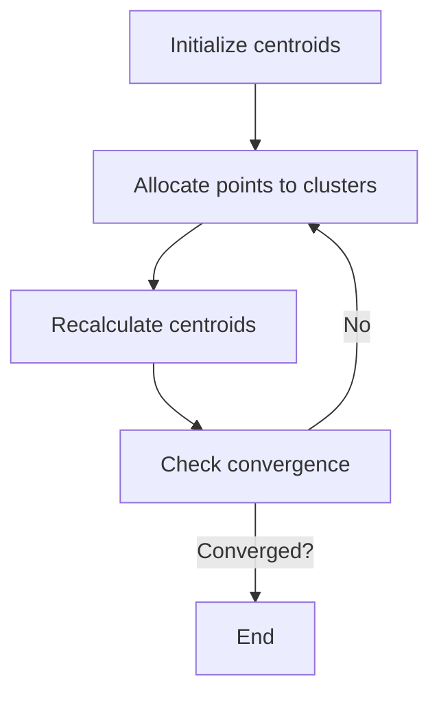
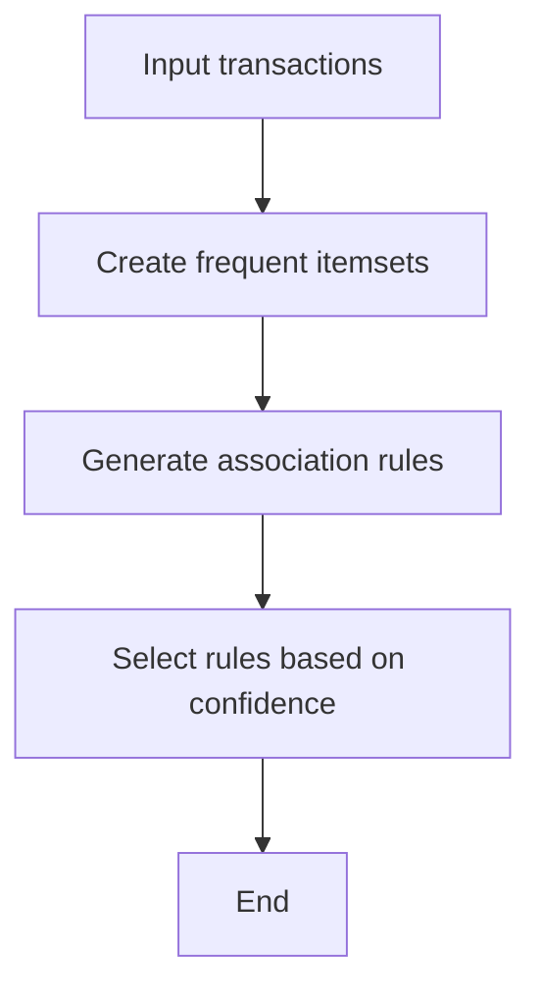
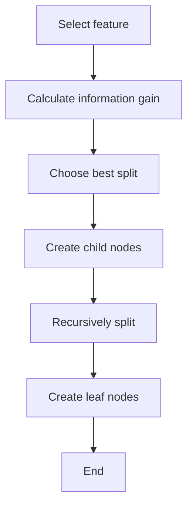
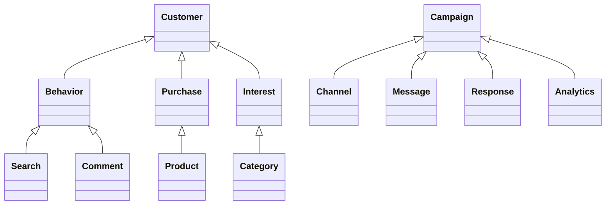
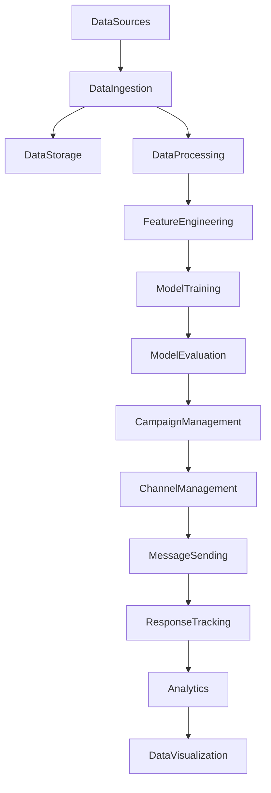
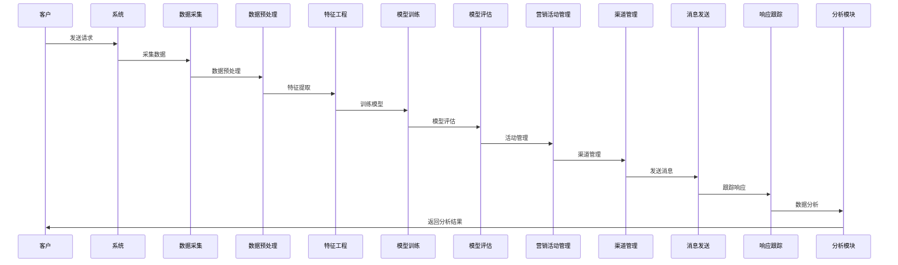
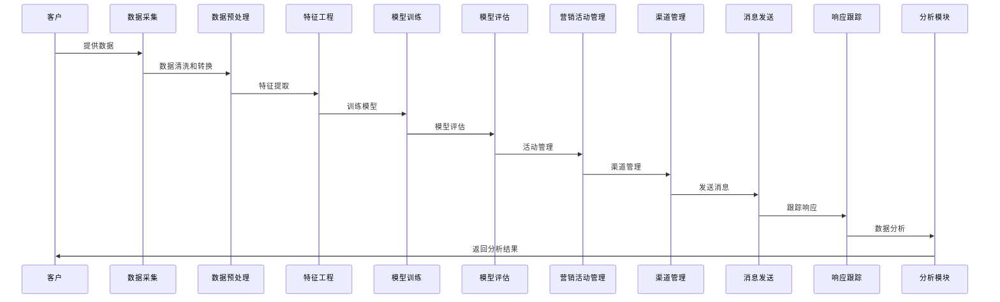

                 


# AI驱动的智能客户画像：精准营销的基础

## 关键词
- AI
- 智能客户画像
- 精准营销
- 数据分析
- 机器学习
- 客户细分

## 摘要
本文将深入探讨AI驱动的智能客户画像在现代营销中的应用，从背景介绍到核心概念，再到算法原理和系统架构设计，以及项目实战和最佳实践，为读者提供一份全面且专业的技术指南。通过本文，读者将了解智能客户画像如何助力企业实现精准营销，提升客户满意度和业务增长。

## 目录大纲设计思路

### 第一部分：AI与精准营销的背景

#### 1.1 AI与大数据时代的来临
##### 1.1.1 AI的定义与核心概念
##### 1.1.2 大数据的崛起与营销变革
##### 1.1.3 精准营销的定义与内涵

#### 1.2 智能客户画像的概念与构成
##### 1.2.1 智能客户画像的定义
##### 1.2.2 智能客户画像的构成要素
##### 1.2.3 智能客户画像与数据的关系

#### 1.3 智能客户画像在精准营销中的应用
##### 1.3.1 智能客户画像与市场营销策略
##### 1.3.2 智能客户画像与客户细分
##### 1.3.3 智能客户画像与个性化推荐

#### 1.4 智能客户画像的技术实现
##### 1.4.1 数据采集与处理
##### 1.4.2 机器学习算法的应用
##### 1.4.3 实时分析与预测

#### 1.5 智能客户画像的挑战与未来
##### 1.5.1 数据隐私与安全问题
##### 1.5.2 智能客户画像的技术挑战
##### 1.5.3 智能客户画像的未来发展趋势

### 第二部分：核心概念与联系

#### 2.1 核心概念解析
##### 2.1.1 数据与信息
##### 2.1.2 机器学习
##### 2.1.3 客户细分

#### 2.2 概念属性特征对比表格
##### 2.2.1 数据与信息属性对比
##### 2.2.2 机器学习算法属性对比
##### 2.2.3 客户细分策略属性对比

#### 2.3 ER实体关系图架构
##### 2.3.1 客户信息实体关系
##### 2.3.2 行为记录实体关系
##### 2.3.3 购买记录实体关系

### 第三部分：算法原理讲解

#### 3.1 算法概述
##### 3.1.1 K-means算法
##### 3.1.2 Apriori算法
##### 3.1.3 决策树算法

#### 3.2 算法流程图
##### 3.2.1 K-means算法流程图
##### 3.2.2 Apriori算法流程图
##### 3.2.3 决策树算法流程图

#### 3.3 Python源代码与LaTeX公式
##### 3.3.1 K-means算法源代码
##### 3.3.2 Apriori算法源代码
##### 3.3.3 决策树算法源代码
##### 3.3.4 算法数学模型与公式

### 第四部分：系统分析与架构设计方案

#### 4.1 场景与项目背景
##### 4.1.1 智能客户画像系统场景
##### 4.1.2 项目背景介绍

#### 4.2 系统架构设计
##### 4.2.1 领域模型类图
##### 4.2.2 系统架构图
##### 4.2.3 系统接口设计

#### 4.3 系统交互设计
##### 4.3.1 系统交互序列图
##### 4.3.2 交互流程解析

### 第五部分：项目实战

#### 5.1 项目环境安装
##### 5.1.1 环境准备
##### 5.1.2 安装与配置

#### 5.2 系统核心实现
##### 5.2.1 数据采集与处理
##### 5.2.2 客户画像构建
##### 5.2.3 实时分析与预测

#### 5.3 代码与应用解读
##### 5.3.1 代码分析
##### 5.3.2 应用实例
##### 5.3.3 案例剖析

#### 5.4 项目小结
##### 5.4.1 项目总结
##### 5.4.2 亮点与改进点

### 第六部分：最佳实践 tips、小结、注意事项、拓展阅读

#### 6.1 最佳实践 tips
##### 6.1.1 数据质量与预处理
##### 6.1.2 算法选择与优化
##### 6.1.3 实时性优化与性能调优

#### 6.2 小结
##### 6.2.1 智能客户画像的关键作用
##### 6.2.2 精准营销的实现路径

#### 6.3 注意事项
##### 6.3.1 数据隐私保护
##### 6.3.2 算法模型的可解释性
##### 6.3.3 系统稳定性与安全性

#### 6.4 拓展阅读
##### 6.4.1 相关书籍推荐
##### 6.4.2 学术论文精选
##### 6.4.3 行业报告与趋势分析

## 1.1 AI与大数据时代的来临

### 1.1.1 AI的定义与核心概念

#### 1.1.1.1 人工智能的起源与发展

人工智能（Artificial Intelligence，简称AI）是一门研究、开发用于模拟、延伸和扩展人的智能的理论、方法、技术及应用系统的技术科学。人工智能的研究可以追溯到20世纪50年代，随着计算机科学、数学和认知科学的发展，人工智能经历了几个重要的发展阶段。

- **第一阶段（1956-1969年）**：这一阶段被称为人工智能的“黄金时代”，标志着人工智能概念的产生和早期研究。1956年，约翰·麦卡锡（John McCarthy）等人在达特茅斯会议（Dartmouth Conference）上提出了人工智能的概念。

- **第二阶段（1970-1980年）**：由于早期人工智能系统在实际应用中的表现不如预期，人工智能进入了所谓的“寒冬期”。这一时期，研究人员开始关注知识表示、推理和规划等问题。

- **第三阶段（1980-1990年）**：专家系统的出现标志着人工智能的复兴。专家系统是一种模拟专家决策能力的计算机程序，可以处理复杂的问题。

- **第四阶段（1990年至今）**：随着计算能力的提升和大数据技术的发展，人工智能迎来了新一轮的发展。这一时期，机器学习和深度学习成为了人工智能研究的主要方向，推动了人工智能在各个领域的应用。

#### 1.1.1.2 机器学习与深度学习

机器学习（Machine Learning，简称ML）是人工智能的一个分支，它侧重于通过算法和统计模型，从数据中自动学习和发现模式。机器学习的方法可以分为监督学习、无监督学习和强化学习。

- **监督学习（Supervised Learning）**：监督学习通过已标记的数据训练模型，然后使用该模型对新的、未标记的数据进行预测。常见的监督学习算法包括线性回归、决策树、支持向量机和神经网络等。

- **无监督学习（Unsupervised Learning）**：无监督学习从未标记的数据中自动发现数据分布或模式。聚类和降维是常见的无监督学习任务。

- **强化学习（Reinforcement Learning）**：强化学习通过试错和反馈机制，使模型能够在特定的环境中学习最优策略。

深度学习（Deep Learning，简称DL）是一种基于多层神经网络的学习方法，它在图像识别、语音识别和自然语言处理等领域取得了显著的成果。深度学习的关键在于多层神经网络的“深层”结构，这使得模型能够自动学习和提取复杂的数据特征。

#### 1.1.1.3 人工智能的应用领域

人工智能的应用领域非常广泛，包括但不限于以下几个方面：

- **计算机视觉**：计算机视觉是一种使计算机能够像人类一样“看”和理解视觉信息的技术。应用领域包括图像识别、人脸识别、自动驾驶和医疗影像分析等。

- **自然语言处理（NLP）**：自然语言处理是一种使计算机能够理解和生成自然语言的技术。应用领域包括机器翻译、情感分析、文本分类和信息抽取等。

- **语音识别**：语音识别是一种使计算机能够理解和处理语音的技术。应用领域包括语音助手、电话客服和语音导航等。

- **智能决策**：智能决策系统通过机器学习算法和数据分析，帮助企业在复杂的市场环境中做出最优决策。应用领域包括金融风控、供应链管理和广告投放等。

### 1.1.2 大数据的崛起与营销变革

#### 1.1.2.1 大数据的定义与特点

大数据（Big Data）指的是无法使用常规数据处理工具在合理时间内捕获、管理和处理的大量数据。大数据具有以下四个V特征：

- **Volume（数据量）**：大数据的规模庞大，通常达到TB级别，甚至PB级别。

- **Velocity（数据速度）**：大数据的产生速度非常快，需要实时或近实时处理。

- **Variety（数据多样性）**：大数据包括结构化数据、半结构化数据和非结构化数据，如文本、图像、音频和视频等。

- **Veracity（数据真实性）**：大数据的真实性和可靠性是关键，因为错误的或不可信的数据会导致错误的决策。

#### 1.1.2.2 大数据在商业中的应用

大数据技术在商业中的应用越来越广泛，以下是几个关键领域：

- **市场营销**：大数据可以帮助企业更好地了解客户需求和行为，从而制定更有效的营销策略。例如，通过分析客户的购买历史和行为，企业可以精准定位潜在客户，提高营销效果。

- **供应链管理**：大数据分析可以帮助企业优化供应链管理，降低成本，提高效率。例如，通过预测市场需求和库存水平，企业可以减少库存积压，提高库存周转率。

- **客户服务**：大数据可以用于改进客户服务体验。例如，通过分析客户反馈和投诉，企业可以及时发现和解决问题，提高客户满意度。

- **风险管理**：大数据分析可以帮助企业识别潜在风险，采取预防措施。例如，在金融领域，大数据分析可以帮助银行识别欺诈行为，降低金融风险。

#### 1.1.2.3 大数据与市场营销的变革

大数据的崛起改变了市场营销的面貌，主要体现在以下几个方面：

- **个性化营销**：通过大数据分析，企业可以了解每个客户的偏好和行为，从而实现个性化营销。例如，电商平台可以根据客户的浏览历史和购买记录，推荐符合其兴趣的商品。

- **预测分析**：大数据分析可以帮助企业预测市场趋势和客户需求，从而提前布局。例如，零售企业可以通过分析历史销售数据，预测未来热销商品，提前进货。

- **实时响应**：大数据分析可以实时监测市场动态和客户行为，使企业能够快速响应市场变化。例如，在线广告平台可以根据用户的实时行为，调整广告投放策略，提高广告效果。

### 1.1.3 精准营销的定义与内涵

#### 1.1.3.1 精准营销的概念

精准营销（Precision Marketing）是一种基于数据分析和客户洞察的营销策略，旨在通过个性化沟通和推荐，提高营销效果和客户满意度。精准营销的核心是“精准”，即通过对客户数据的深度挖掘和分析，实现营销活动的精确匹配和有效触达。

#### 1.1.3.2 精准营销与传统营销的区别

与传统营销相比，精准营销具有以下显著区别：

- **数据驱动**：精准营销基于大量数据，通过数据分析来指导营销策略和决策。

- **个性化**：精准营销注重客户个性化，通过了解客户需求和行为，提供个性化的产品和服务。

- **实时性**：精准营销强调实时响应，根据客户行为和市场动态，调整营销策略。

- **效果可衡量**：精准营销通过数据分析和跟踪，可以准确衡量营销效果，优化营销策略。

#### 1.1.3.3 精准营销的实现路径

实现精准营销通常需要以下几个步骤：

- **数据采集**：收集客户的个人信息、行为数据和市场数据。

- **数据清洗**：清洗和整理数据，确保数据质量。

- **数据分析**：使用数据挖掘和机器学习算法，分析客户行为和市场趋势。

- **客户细分**：根据分析结果，将客户分为不同的细分群体。

- **个性化营销**：针对不同细分群体，制定个性化的营销策略和沟通方案。

- **效果评估**：跟踪和评估营销效果，不断优化营销策略。

## 1.2 智能客户画像的概念与构成

### 1.2.1 智能客户画像的定义

智能客户画像（Intelligent Customer Profiling）是基于大数据和人工智能技术，对客户的属性特征、行为习惯、需求偏好等进行分析和建模，形成的一个综合性的客户视图。智能客户画像是精准营销的重要基础，通过全面、深入地了解客户，帮助企业实现个性化服务和精准营销。

### 1.2.2 智能客户画像的构成要素

智能客户画像由多个维度构成，每个维度代表客户的一个属性或特征。以下是智能客户画像的主要构成要素：

1. **基础信息**：包括客户的姓名、年龄、性别、职业、联系方式等基本信息。

2. **行为数据**：记录客户的购买行为、浏览历史、搜索记录、社交行为等，反映客户的行为特征和需求偏好。

3. **消费记录**：记录客户的消费金额、消费频率、购买商品类型等，反映客户的消费习惯和消费能力。

4. **情感分析**：通过自然语言处理技术，分析客户在评论、论坛等渠道的言论，了解客户的情感倾向和满意度。

5. **地理位置**：记录客户的地理位置信息，了解客户的地理位置特征和活动范围。

6. **社交网络**：分析客户的社交网络关系，了解客户的社会属性和影响力。

7. **兴趣爱好**：通过数据挖掘和分析，了解客户的兴趣爱好，为个性化推荐提供依据。

### 1.2.3 智能客户画像与数据的关系

智能客户画像的构建依赖于大量的数据，这些数据来源广泛，包括：

1. **内部数据**：来自企业内部的客户数据，如客户关系管理系统（CRM）、电子商务平台、呼叫中心等。

2. **第三方数据**：来自第三方的数据，如社交媒体数据、公共数据库、数据交易平台等。

3. **传感器数据**：通过物联网设备收集的数据，如移动设备位置、智能家居设备使用数据等。

智能客户画像的构建过程通常包括以下几个步骤：

1. **数据采集**：从各种渠道收集客户的原始数据。

2. **数据清洗**：清洗和整理数据，去除重复、错误和无效的数据。

3. **数据存储**：将清洗后的数据存储到数据仓库或数据湖中，以便后续分析和处理。

4. **数据分析**：使用数据挖掘和机器学习算法，对客户数据进行深入分析，提取有用的信息和特征。

5. **数据建模**：基于分析结果，构建客户画像模型，形成综合性的客户视图。

6. **数据应用**：将客户画像应用于市场营销、客户服务、产品推荐等场景，实现精准营销和个性化服务。

## 1.3 智能客户画像在精准营销中的应用

### 1.3.1 智能客户画像与市场营销策略

智能客户画像在市场营销策略中扮演着关键角色，通过以下方式助力企业实现精准营销：

1. **客户细分**：智能客户画像能够帮助企业将客户分为不同的细分群体，每个群体都有独特的需求和特征。企业可以根据不同细分群体的特点，制定有针对性的营销策略。

2. **个性化推荐**：基于智能客户画像，企业可以为客户提供个性化的产品推荐。例如，电商平台可以根据客户的购买历史和浏览记录，推荐符合其兴趣和需求的产品。

3. **定制化沟通**：智能客户画像帮助企业了解客户的需求和偏好，从而实现定制化的沟通。例如，企业可以通过邮件、短信或社交媒体，向客户发送个性化的优惠信息和活动邀请。

4. **精准广告投放**：智能客户画像可以帮助企业在广告投放中实现精准定位。例如，在社交媒体平台上，企业可以根据客户的兴趣和行为，投放个性化的广告，提高广告效果。

### 1.3.2 智能客户画像与客户细分

客户细分是精准营销的重要步骤，智能客户画像为这一步骤提供了强大的支持。通过智能客户画像，企业可以基于以下因素对客户进行细分：

1. **购买行为**：根据客户的购买历史、购买频率和购买金额，将客户分为高价值客户、忠诚客户、潜在客户等。

2. **兴趣偏好**：通过分析客户的兴趣爱好和行为，将客户分为不同的兴趣群体，如运动爱好者、数码产品爱好者等。

3. **地理位置**：根据客户的地理位置，将客户分为城市客户、乡村客户等。

4. **社会属性**：通过分析客户的社会属性，如年龄、性别、教育背景等，将客户分为不同的社会群体。

5. **消费能力**：根据客户的消费能力，将客户分为高消费客户、中消费客户、低消费客户等。

通过这些细分方式，企业可以更好地了解客户的特征和需求，制定有针对性的营销策略，提高营销效果。

### 1.3.3 智能客户画像与个性化推荐

个性化推荐是智能客户画像在精准营销中的重要应用，通过以下方式提高推荐效果：

1. **协同过滤**：基于客户的相似性，将相似客户的历史行为推荐给新客户。例如，如果一个用户喜欢某部电影，系统会推荐其他喜欢这部电影的用户也喜欢的电影。

2. **内容过滤**：根据客户的历史行为和偏好，推荐与客户兴趣相关的产品或内容。例如，如果一个用户经常购买书籍，系统会推荐与该书籍相似的其他书籍。

3. **基于模型的推荐**：使用机器学习算法，如协同过滤、矩阵分解、深度学习等，构建客户画像模型，为每个客户生成个性化的推荐列表。

4. **实时推荐**：根据客户的实时行为，如浏览、搜索等，实时生成推荐列表，提高推荐的相关性和即时性。

通过个性化推荐，企业可以更好地满足客户需求，提高客户满意度和忠诚度，实现精准营销。

### 1.4 智能客户画像的技术实现

#### 1.4.1 数据采集与处理

数据采集是构建智能客户画像的第一步，主要涉及以下方面：

1. **数据来源**：收集来自企业内部和外部的数据，如客户关系管理系统（CRM）、电子商务平台、社交媒体、公共数据库等。

2. **数据收集**：使用API、爬虫等技术，从各种数据源收集客户的原始数据。

3. **数据预处理**：清洗和整理数据，去除重复、错误和无效的数据。这一步骤包括数据清洗、数据转换和数据集成。

数据预处理是数据采集的关键环节，直接影响后续数据分析的质量。数据预处理的主要任务包括：

- **数据清洗**：去除重复数据、缺失数据、异常数据等。
- **数据转换**：将数据转换为统一的格式，如将文本数据转换为数值数据。
- **数据集成**：将来自不同数据源的数据进行整合，形成完整的数据集。

#### 1.4.2 机器学习算法的应用

构建智能客户画像的核心在于使用机器学习算法对客户数据进行分析和建模。以下是几种常用的机器学习算法：

1. **聚类算法**：如K-means、DBSCAN等，用于将客户数据划分为不同的群体，形成客户细分。

2. **分类算法**：如决策树、随机森林、支持向量机等，用于对客户进行分类，如高价值客户、潜在客户等。

3. **协同过滤算法**：如基于用户的协同过滤、基于物品的协同过滤等，用于生成个性化的推荐列表。

4. **深度学习算法**：如卷积神经网络（CNN）、循环神经网络（RNN）、生成对抗网络（GAN）等，用于构建复杂的客户画像模型。

选择合适的机器学习算法，需要对数据的特点和应用场景进行深入分析。例如，对于大型且多维度的数据集，深度学习算法可能更为适用；而对于需要快速响应的场景，传统的机器学习算法可能更为高效。

#### 1.4.3 实时分析与预测

构建智能客户画像不仅需要离线分析，还需要实时分析和预测。实时分析可以快速响应当前客户的行为和需求，提供个性化的服务。以下是一些实时分析的应用场景：

1. **实时推荐**：根据客户的实时行为，如浏览、搜索等，生成个性化的推荐列表。

2. **实时预警**：监测客户的异常行为，如频繁退货、账户异常登录等，及时发出预警。

3. **实时互动**：通过实时聊天、社交媒体等渠道，与客户进行互动，提高客户满意度。

实时预测是智能客户画像的另一个重要应用。通过预测客户的行为和需求，企业可以提前采取行动，提高营销效果。以下是一些常见的实时预测任务：

1. **客户流失预测**：预测哪些客户可能流失，提前采取挽留措施。

2. **销售预测**：预测未来的销售趋势，制定合理的销售计划。

3. **客户需求预测**：预测客户未来的需求，提前准备相关产品和服务。

实时分析和预测需要高效的算法和数据处理能力。常用的技术包括分布式计算、流处理和内存计算等。

### 1.5 智能客户画像的挑战与未来

#### 1.5.1 数据隐私与安全问题

随着智能客户画像技术的发展，数据隐私和安全问题日益突出。以下是一些主要挑战：

1. **数据泄露风险**：智能客户画像涉及大量的客户数据，一旦发生数据泄露，可能导致严重后果。

2. **数据滥用风险**：未经授权使用客户数据，可能导致客户隐私侵犯和信任危机。

3. **合规性挑战**：各国和地区的隐私保护法律法规不断更新，企业需要确保数据处理的合规性。

为了应对这些挑战，企业需要采取以下措施：

- **数据加密**：对客户数据进行加密，确保数据在传输和存储过程中的安全性。

- **访问控制**：严格控制对客户数据的访问权限，确保只有授权人员可以访问敏感数据。

- **隐私保护技术**：采用隐私保护技术，如差分隐私、同态加密等，确保数据分析过程中保护客户隐私。

#### 1.5.2 智能客户画像的技术挑战

智能客户画像技术的不断发展也带来了一系列技术挑战：

1. **数据处理能力**：随着数据规模的不断扩大，企业需要具备强大的数据处理能力，确保数据处理的效率和准确性。

2. **算法优化**：随着数据多样性和复杂性的增加，传统算法可能无法满足需求，需要不断优化和改进算法。

3. **可解释性**：智能客户画像通常使用复杂的机器学习模型，如何保证算法的可解释性，使企业能够理解和信任模型结果，是一个重要挑战。

4. **实时性**：为了实现实时分析和预测，企业需要采用高效的实时计算技术，确保数据分析和处理的速度。

#### 1.5.3 智能客户画像的未来发展趋势

智能客户画像技术正不断进步，未来发展趋势包括：

1. **多模态数据融合**：结合文本、图像、音频等多种数据类型，构建更全面的客户画像。

2. **个性化与自适应**：随着人工智能技术的发展，智能客户画像将更加个性化和自适应，提供更加精准的推荐和服务。

3. **边缘计算**：将计算和存储能力延伸到网络边缘，实现更快速的实时分析和预测。

4. **数据隐私保护**：随着隐私保护法律法规的完善，数据隐私保护将成为智能客户画像技术的重要方向。

### 2.1 核心概念解析

#### 2.1.1 数据与信息

数据（Data）是信息的载体，指的是以各种形式记录下来的事实、数字、文字、图像等。信息（Information）则是通过处理和解释数据后得到的具有意义的内容，可以帮助人们做出决策和行动。数据和信息的关系可以概括为：数据是原始材料，信息是对数据的加工和理解。

在智能客户画像的构建过程中，数据是关键的基础，包括客户的个人基本信息、行为数据、消费记录等。通过对这些数据进行处理和分析，企业可以获得有关客户的行为模式、需求偏好和购买意图等信息，从而构建出完整的客户画像。

#### 2.1.2 机器学习

机器学习（Machine Learning，ML）是人工智能的一个分支，通过算法和统计模型，使计算机能够从数据中学习并做出预测或决策。机器学习的基本流程包括数据采集、数据预处理、模型训练、模型评估和模型部署。

在智能客户画像中，机器学习算法用于对大量客户数据进行处理和分析，提取有用的特征和模式。例如，通过聚类算法，可以将相似客户划分为同一群体；通过分类算法，可以识别客户的特征和属性。

#### 2.1.3 客户细分

客户细分（Customer Segmentation）是将客户划分为不同的群体，每个群体具有相似的特征和需求。客户细分有助于企业更好地理解客户，制定有针对性的营销策略。

在智能客户画像中，客户细分是一个重要的步骤。通过分析客户的数据，如购买行为、兴趣偏好、地理位置等，企业可以识别出不同的客户细分群体。这些细分群体可以用于个性化推荐、定制化沟通和精准广告投放等。

### 2.2 概念属性特征对比表格

为了更好地理解智能客户画像中的核心概念，以下是一个概念属性特征对比表格：

| 概念   | 定义                                                         | 属性特征                                                       | 作用                                                         |
| ------ | ------------------------------------------------------------ | ------------------------------------------------------------ | ------------------------------------------------------------ |
| 数据   | 事实、数字、文字、图像等的记录形式                           | 结构化、半结构化、非结构化数据                                 | 基础，用于构建客户画像的核心材料                               |
| 信息   | 通过处理和解释数据得到的具有意义的内容                       | 信息的完整性、准确性、及时性                                   | 帮助企业做出决策和行动的重要依据                               |
| 机器学习 | 使计算机从数据中学习并做出预测或决策的技术和方法           | 监督学习、无监督学习、强化学习                                 | 用于数据分析和特征提取，构建客户画像模型                       |
| 客户细分 | 将客户划分为不同的群体，每个群体具有相似的特征和需求         | 购买行为、兴趣偏好、地理位置、社会属性等                       | 辅助企业制定个性化的营销策略，提高营销效果                     |

### 2.3 ER实体关系图架构

实体关系图（Entity-Relationship Diagram，ERD）是一种用于表示实体及其关系的图形化工具。在智能客户画像中，ERD可以帮助我们理解客户数据之间的关系。以下是一个简化的ERD示例：

```mermaid
erDiagram
  Customer ||--|{ Behavior : records}
  Customer ||--|{ Purchase : history}
  Customer ||--|{ Interest : preferences}
  Behavior ||--|{ Search : history}
  Behavior ||--|{ Comment : analysis}
  Purchase ||--|{ Product : details}
  Interest ||--|{ Category : belongs}
```

在这个ERD中，客户（Customer）是核心实体，与行为（Behavior）、购买记录（Purchase）和兴趣偏好（Interest）等实体之间存在关系。每个实体都有多个属性，如客户的行为记录包括搜索历史和评论分析，购买记录包括产品详情，兴趣偏好包括类别归属。

### 3.1 算法概述

#### 3.1.1 K-means算法

K-means算法是一种基于距离的聚类算法，用于将数据点划分为K个簇。算法的核心思想是迭代优化，使得每个簇内的数据点尽可能接近簇中心，而簇与簇之间的数据点尽可能远离。

1. **算法步骤**：

   - 初始阶段：随机选择K个数据点作为初始簇中心。
   - 迭代阶段：对于每个数据点，将其分配到最近的簇中心所在的簇；更新簇中心的位置，使得簇内的数据点更接近簇中心。
   - 收敛条件：当簇中心的位置不再发生变化或者达到预设的迭代次数时，算法收敛。

2. **数学模型**：

   假设有K个簇，每个簇由一个中心点表示，数据点$x_i$与簇中心$c_k$之间的距离为：
   $$d(x_i, c_k) = \sqrt{\sum_{j=1}^{n}(x_{ij} - c_{kj})^2}$$
   其中，$x_{ij}$是数据点$x_i$在第j个特征上的取值，$c_{kj}$是簇中心$c_k$在第j个特征上的取值。

3. **Python代码示例**：

   ```python
   import numpy as np
   from sklearn.cluster import KMeans

   # 数据集
   X = np.array([[1, 2], [1, 4], [1, 0],
                 [10, 2], [10, 4], [10, 0]])

   # K-means聚类
   kmeans = KMeans(n_clusters=2, random_state=0).fit(X)
   labels = kmeans.predict(X)

   # 输出簇中心
   centroids = kmeans.cluster_centers_
   print("Cluster centroids:", centroids)

   # 输出标签
   print("Cluster labels:", labels)
   ```

#### 3.1.2 Apriori算法

Apriori算法是一种用于发现数据集中频繁项集的算法，广泛应用于关联规则学习。该算法的核心思想是通过支持度和置信度来识别频繁项集。

1. **算法步骤**：

   - 初始阶段：计算每个项的支持度，筛选出频繁项。
   - 迭代阶段：对于每个频繁项集，合并相邻项，计算新的支持度；筛选出新的频繁项集。
   - 收敛条件：当没有新的频繁项集产生时，算法收敛。

2. **数学模型**：

   - 支持度（Support）：一个项集在一个数据集中的出现频率。
     $$Support(I) = \frac{count(I)}{total\ transactions}$$
     
   - 置信度（Confidence）：一个规则在前件和后件同时出现的条件下，后件出现的概率。
     $$Confidence(A \rightarrow B) = \frac{Support(A \cap B)}{Support(A)}$$

3. **Python代码示例**：

   ```python
   import pandas as pd
   from mlxtend.frequent_patterns import apriori
   from mlxtend.frequent_patterns import association_rules

   # 数据集
   data = pd.DataFrame({'Transaction': ['a,b,c', 'a,b', 'b,c', 'a,c', 'b,a,c', 'a,b,a,c']})

   # 构建事务集
   transactions = data['Transaction'].str.get_dummies(sep=',').reset_index().drop('index', axis=1)

   # 执行Apriori算法
   frequent_itemsets = apriori(transactions, min_support=0.5, use_colnames=True)

   # 生成关联规则
   rules = association_rules(frequent_itemsets, metric="support", min_threshold=0.7)

   # 输出频繁项集和规则
   print("Frequent Itemsets:", frequent_itemsets)
   print("Association Rules:", rules)
   ```

#### 3.1.3 决策树算法

决策树算法是一种常用的分类和回归算法，通过一系列的规则和决策分支，将数据集划分为不同的类别或数值。

1. **算法步骤**：

   - 初始阶段：选择一个特征作为分割点，将数据集划分为两个子集。
   - 迭代阶段：对每个子集，选择一个最优特征进行分割，直到满足终止条件（如最大深度、最小节点样本数等）。
   - 输出：生成一棵决策树，每个节点代表一个特征和阈值，每个叶节点代表一个类别或数值。

2. **数学模型**：

   - 信息增益（Information Gain）：用于评估特征对数据集的分割效果。
     $$Gain(D, A) = Entropy(D) - \sum_{v \in Values(A)} \frac{count(v)}{count(D)} \cdot Entropy(D_v)$$

   - 基尼指数（Gini Index）：另一种评估特征分割效果的指标。
     $$Gini(D) = 1 - \sum_{v \in Values(A)} \left(\frac{count(v)}{count(D)}\right)^2$$

3. **Python代码示例**：

   ```python
   from sklearn.datasets import load_iris
   from sklearn.tree import DecisionTreeClassifier
   from sklearn.model_selection import train_test_split

   # 数据集
   iris = load_iris()
   X, y = iris.data, iris.target

   # 划分训练集和测试集
   X_train, X_test, y_train, y_test = train_test_split(X, y, test_size=0.3, random_state=42)

   # 构建决策树模型
   clf = DecisionTreeClassifier(criterion='entropy')
   clf.fit(X_train, y_train)

   # 输出决策树结构
   from sklearn.tree import export_text
   print(export_text(clf, feature_names=iris.feature_names))

   # 训练和测试模型
   accuracy = clf.score(X_test, y_test)
   print("Test accuracy:", accuracy)
   ```

### 3.2 算法流程图

以下分别是K-means、Apriori和决策树算法的mermaid流程图：

#### 3.2.1 K-means算法流程图



#### 3.2.2 Apriori算法流程图



#### 3.2.3 决策树算法流程图



### 3.3 Python源代码与LaTeX公式

#### 3.3.1 K-means算法源代码

```python
import numpy as np

def kmeans(X, K, max_iters=100, init='k-means++'):
    centroids = initialize_centroids(X, K, init)
    for i in range(max_iters):
        # Allocate points to clusters
        labels = allocate_points_to_clusters(X, centroids)
        # Recalculate centroids
        centroids = update_centroids(X, labels, K)
        # Check convergence
        if has_converged(centroids, previous_centroids):
            break
    return centroids, labels

def initialize_centroids(X, K, init='k-means++'):
    if init == 'k-means++':
        centroids = kmeans_plusplus(X, K)
    elif init == 'random':
        centroids = np.random.choice(X.shape[0], K, replace=False)
        centroids = X[centroids]
    return centroids

def kmeans_plusplus(X, K):
    # Implement k-means++ initialization
    pass

def allocate_points_to_clusters(X, centroids):
    # Implement allocation of points to clusters
    pass

def update_centroids(X, labels, K):
    # Implement update of centroids
    pass

def has_converged(centroids, previous_centroids):
    # Implement convergence check
    pass
```

#### 3.3.2 Apriori算法源代码

```python
from mlxtend.frequent_patterns import apriori
from mlxtend.frequent_patterns import association_rules

def apriori_algorithm(transactions, min_support=0.5, use_colnames=True):
    frequent_itemsets = apriori(transactions, min_support=min_support, use_colnames=use_colnames)
    rules = association_rules(frequent_itemsets, metric="support", min_threshold=0.7)
    return frequent_itemsets, rules

def generate_association_rules(transactions, min_support=0.5, min_confidence=0.7):
    frequent_itemsets = apriori(transactions, min_support=min_support, use_colnames=True)
    rules = association_rules(frequent_itemsets, metric="confidence", min_threshold=min_confidence)
    return rules
```

#### 3.3.3 决策树算法源代码

```python
from sklearn.datasets import load_iris
from sklearn.tree import DecisionTreeClassifier
from sklearn.model_selection import train_test_split

def decision_tree_algorithm(X, y, max_depth=None, criterion='entropy'):
    clf = DecisionTreeClassifier(max_depth=max_depth, criterion=criterion)
    clf.fit(X, y)
    return clf

def visualize_decision_tree(clf, feature_names):
    from sklearn.tree import export_text
    tree_str = export_text(clf, feature_names=feature_names)
    print(tree_str)
```

### 3.3.4 算法数学模型与公式

以下是K-means、Apriori和决策树算法的数学模型和公式：

#### 3.3.4.1 K-means算法

$$d(x_i, c_k) = \sqrt{\sum_{j=1}^{n}(x_{ij} - c_{kj})^2}$$

$$\text{Support}(I) = \frac{\text{count}(I)}{\text{total\ transactions}}$$

$$\text{Confidence}(A \rightarrow B) = \frac{\text{Support}(A \cap B)}{\text{Support}(A)}$$

#### 3.3.4.2 Apriori算法

$$\text{Support}(I) = \frac{\text{count}(I)}{\text{total\ transactions}}$$

$$\text{Confidence}(A \rightarrow B) = \frac{\text{Support}(A \cap B)}{\text{Support}(A)}$$

#### 3.3.4.3 决策树算法

$$\text{Entropy}(D) = -\sum_{v \in Values(A)} \frac{count(v)}{count(D)} \cdot \log_2 \frac{count(v)}{count(D)}$$

$$\text{Gini}(D) = 1 - \sum_{v \in Values(A)} \left(\frac{count(v)}{count(D)}\right)^2$$

### 4.1 场景与项目背景

#### 4.1.1 智能客户画像系统场景

智能客户画像系统是一个集成多种技术和工具的复杂系统，旨在帮助企业实现精准营销和客户服务。以下是系统的典型应用场景：

1. **客户细分**：通过对客户数据的分析和挖掘，将客户划分为不同的细分群体，为每个群体制定个性化的营销策略。

2. **个性化推荐**：根据客户的行为数据和偏好，推荐符合其兴趣和需求的产品和服务。

3. **精准广告投放**：根据客户画像，在合适的渠道和时间段投放个性化的广告，提高广告效果和转化率。

4. **客户服务**：利用智能客户画像，为企业提供更优质的客户服务，如自动回复、智能咨询等。

5. **客户流失预警**：通过分析客户的购买行为和互动数据，预测哪些客户可能流失，及时采取挽留措施。

#### 4.1.2 项目背景介绍

为了实现上述应用场景，某电商企业决定开发一个智能客户画像系统。该系统将整合企业内部的数据源，如客户关系管理系统（CRM）、电子商务平台等，同时引入第三方数据，如社交媒体数据、公共数据库等。系统的主要目标包括：

1. **提升营销效果**：通过精准营销，提高客户的购买转化率和满意度。

2. **优化客户服务**：利用智能客户画像，为企业提供更个性化的客户服务，提高客户体验。

3. **降低运营成本**：通过数据驱动的决策，优化营销和运营策略，降低成本。

4. **提升竞争力**：通过数据分析和挖掘，为企业提供竞争优势，提高市场占有率。

### 4.2 系统架构设计

#### 4.2.1 领域模型类图

以下是一个简化的智能客户画像系统领域模型类图，展示了系统中的主要实体和它们之间的关系：



在这个类图中，客户（Customer）是核心实体，与行为（Behavior）、购买记录（Purchase）和兴趣偏好（Interest）等实体之间存在关系。此外，系统还包括营销活动（Campaign）实体，用于管理广告投放、消息发送和效果分析等。

#### 4.2.2 系统架构图

以下是一个简化的智能客户画像系统架构图，展示了系统的整体结构和主要组件：



在这个架构图中，数据源（DataSources）包括企业内部数据和第三方数据，数据采集（DataIngestion）模块负责从数据源收集数据。数据存储（DataStorage）模块负责存储和处理大规模数据，数据预处理（DataProcessing）模块负责清洗、转换和整合数据。特征工程（FeatureEngineering）模块用于提取有用的特征，模型训练（ModelTraining）模块负责训练机器学习模型，模型评估（ModelEvaluation）模块用于评估模型性能。营销活动管理（CampaignManagement）模块负责管理广告投放、消息发送和效果分析，渠道管理（ChannelManagement）模块负责渠道管理和消息发送，响应跟踪（ResponseTracking）模块负责跟踪客户响应和反馈，分析模块（Analytics）负责数据分析和可视化。

### 4.2.3 系统接口设计

以下是一个简化的智能客户画像系统接口设计，展示了系统的主要API接口和交互流程：



在这个接口设计中，客户（Customer）通过系统（System）接口发送请求，系统将请求转发给数据采集（DataIngestion）模块，数据采集模块从数据源获取数据。然后，数据预处理（DataProcessing）模块对数据进行清洗和转换，特征工程（FeatureEngineering）模块提取有用的特征。模型训练（ModelTraining）模块使用提取的特征训练机器学习模型，模型评估（ModelEvaluation）模块评估模型性能。营销活动管理（CampaignManagement）模块根据评估结果管理广告投放和消息发送，渠道管理（ChannelManagement）模块负责渠道管理和消息发送，响应跟踪（ResponseTracking）模块跟踪客户响应和反馈，分析模块（Analytics）负责数据分析和可视化，最终将分析结果返回给客户。

### 4.2.4 系统交互设计

以下是一个简化的智能客户画像系统交互序列图，展示了系统的关键交互流程和环节：



在这个交互序列图中，客户（Customer）向数据采集（DataIngestion）模块提供数据，数据采集模块对数据进行清洗和转换，然后转发给数据预处理（DataProcessing）模块。特征工程（FeatureEngineering）模块提取有用的特征，用于模型训练（ModelTraining）模块。模型训练模块使用提取的特征训练机器学习模型，模型评估（ModelEvaluation）模块评估模型性能。营销活动管理（CampaignManagement）模块根据评估结果管理广告投放和消息发送，渠道管理（ChannelManagement）模块负责渠道管理和消息发送，响应跟踪（ResponseTracking）模块跟踪客户响应和反馈，分析模块（Analytics）负责数据分析和可视化，最终将分析结果返回给客户。

### 5.1 项目环境安装

#### 5.1.1 环境准备

在开始安装智能客户画像系统之前，我们需要准备以下环境：

1. **操作系统**：推荐使用Linux系统，如Ubuntu 18.04或CentOS 7。
2. **Python**：推荐使用Python 3.8或更高版本。
3. **Python包管理器**：推荐使用pip进行包管理。

#### 5.1.2 安装与配置

以下是在Ubuntu 18.04操作系统上安装智能客户画像系统的步骤：

1. **更新系统包列表**：

   ```bash
   sudo apt update
   sudo apt upgrade
   ```

2. **安装Python 3**：

   ```bash
   sudo apt install python3 python3-pip
   ```

3. **安装依赖包**：

   ```bash
   sudo apt install build-essential libssl-dev libffi-dev python3-dev
   ```

4. **创建虚拟环境**：

   ```bash
   python3 -m venv venv
   source venv/bin/activate
   ```

5. **安装Python包**：

   ```bash
   pip install -r requirements.txt
   ```

这里`requirements.txt`文件包含了所有所需的Python包，如NumPy、Pandas、scikit-learn、matplotlib等。

#### 5.1.3 配置数据库

智能客户画像系统需要配置一个数据库来存储数据。以下是使用PostgreSQL数据库的配置步骤：

1. **安装PostgreSQL**：

   ```bash
   sudo apt install postgresql postgresql-contrib
   ```

2. **初始化数据库**：

   ```bash
   sudo -i -u postgres psql
   CREATE DATABASE clientprofiling;
   \q
   ```

3. **创建数据库用户**：

   ```bash
   sudo -i -u postgres psql
   CREATE USER clientprofiling_user WITH PASSWORD 'password';
   GRANT ALL PRIVILEGES ON DATABASE clientprofiling TO clientprofiling_user;
   \q
   ```

4. **配置Django数据库**：

   打开`settings.py`文件，配置数据库连接：

   ```python
   DATABASES = {
       'default': {
           'ENGINE': 'django.db.backends.postgresql',
           'NAME': 'clientprofiling',
           'USER': 'clientprofiling_user',
           'PASSWORD': 'password',
           'HOST': 'localhost',
           'PORT': '',
       }
   }
   ```

#### 5.1.4 部署前端

智能客户画像系统的前端使用Vue.js框架。以下是部署前端的步骤：

1. **安装Node.js**：

   ```bash
   sudo apt install nodejs
   ```

2. **安装Vue CLI**：

   ```bash
   npm install -g @vue/cli
   ```

3. **创建Vue项目**：

   ```bash
   vue create clientprofiling-frontend
   cd clientprofiling-frontend
   ```

4. **安装前端依赖包**：

   ```bash
   npm install
   ```

5. **启动前端项目**：

   ```bash
   npm run serve
   ```

#### 5.1.5 部署后端

智能客户画像系统的后端使用Django框架。以下是部署后端的步骤：

1. **安装Django**：

   ```bash
   pip install django
   ```

2. **创建Django项目**：

   ```bash
   django-admin startproject clientprofiling
   cd clientprofiling
   ```

3. **创建Django应用**：

   ```bash
   python manage.py startapp analytics
   ```

4. **配置Django应用**：

   在`settings.py`文件中，添加以下配置：

   ```python
   INSTALLED_APPS = [
       'django.contrib.admin',
       'django.contrib.auth',
       'django.contrib.contenttypes',
       'django.contrib.sessions',
       'django.contrib.messages',
       'django.contrib.staticfiles',
       'analytics',
   ]

   MIDDLEWARE = [
       'django.middleware.security.SecurityMiddleware',
       'django.contrib.sessions.middleware.SessionMiddleware',
       'django.middleware.common.CommonMiddleware',
       'django.middleware.csrf.CsrfViewMiddleware',
       'django.contrib.auth.middleware.AuthenticationMiddleware',
       'django.contrib.messages.middleware.MessageMiddleware',
       'django.middleware.clickjacking.XFrameOptionsMiddleware',
   ]

   ROOT_URLCONF = 'clientprofiling.urls'

  TEMPLATES = [
       {
           'BACKEND': 'django.template.backends.django.DjangoTemplates',
           'DIRS': [],
           'APP_DIRS': True,
           'OPTIONS': {
               'context_processors': [
                   'django.template.context_processors.debug',
                   'django.template.context_processors.request',
                   'django.contrib.auth.context_processors.auth',
                   'django.contrib.messages.context_processors.messages',
               ],
           },
       },
   ]

  WSGI_APPLICATION = 'clientprofiling.wsgi.application'

   DATABASES = {
       'default': {
           'ENGINE': 'django.db.backends.postgresql',
           'NAME': 'clientprofiling',
           'USER': 'clientprofiling_user',
           'PASSWORD': 'password',
           'HOST': 'localhost',
           'PORT': '',
       }
   }

   AUTH_PASSWORD_VALIDATORS = [
       {
           'NAME': 'django.contrib.auth.password_validation.UserAttributeSimilarityValidator',
       },
       {
           'NAME': 'django.contrib.auth.password_validation.MinimumLengthValidator',
       },
       {
           'NAME': 'django.contrib.auth.password_validation.CommonPasswordValidator',
       },
       {
           'NAME': 'django.contrib.auth.password_validation.NumericPasswordValidator',
       },
   ]

   LANGUAGE_CODE = 'en-us'

   TIME_ZONE = 'UTC'

   USE_TZ = True

   STATIC_URL = '/static/'
   ```

5. **运行Django项目**：

   ```bash
   python manage.py migrate
   python manage.py runserver 0.0.0.0:8000
   ```

### 5.2 系统核心实现

#### 5.2.1 数据采集与处理

数据采集与处理是智能客户画像系统的核心模块，负责从各种数据源收集数据，并进行清洗、转换和整合。以下是数据采集与处理的主要步骤：

1. **数据源配置**：

   配置系统的数据源，包括企业内部数据源（如CRM系统、电子商务平台等）和第三方数据源（如社交媒体平台、公共数据库等）。配置信息通常包括数据源类型、连接地址、用户名和密码等。

2. **数据采集**：

   使用API、爬虫等技术从数据源采集数据。对于内部数据源，可以使用数据库连接工具直接获取数据；对于第三方数据源，可以使用相应的API接口进行数据采集。

3. **数据清洗**：

   清洗采集到的数据，去除重复、错误和无效的数据。数据清洗的主要任务包括：

   - 去除重复数据：通过匹配字段（如客户ID、订单号等），去除重复记录。
   - 填充缺失数据：使用平均值、中位数或插值等方法填充缺失数据。
   - 数据格式转换：将不同格式的数据转换为统一的格式，如将日期格式转换为YYYY-MM-DD。

4. **数据转换**：

   将清洗后的数据进行转换，使其符合数据仓库或数据湖的存储要求。数据转换的任务包括：

   - 数据规范化：将不同来源的数据字段进行规范化处理，确保数据的一致性和可比性。
   - 数据聚合：对数据进行聚合处理，如将订单数据按照客户ID、产品ID等聚合。

5. **数据整合**：

   将来自不同数据源的数据进行整合，形成完整的数据集。数据整合的主要任务包括：

   - 数据对齐：将不同数据源的数据按照相同的维度进行对齐，如按照客户ID进行对齐。
   - 数据合并：将相同维度的数据合并为一张数据表，如将客户基本信息、行为数据、购买记录等合并为一张客户画像表。

#### 5.2.2 客户画像构建

客户画像构建是智能客户画像系统的核心功能，通过分析客户的数据，构建出全面的客户画像。以下是客户画像构建的主要步骤：

1. **数据预处理**：

   对采集到的客户数据进行预处理，包括数据清洗、转换和整合。确保数据的质量和一致性。

2. **特征工程**：

   提取客户数据中的特征，用于构建客户画像。特征工程的主要任务包括：

   - 行为特征提取：提取客户的购买行为、浏览行为、搜索行为等，如购买频率、浏览时长、搜索关键词等。
   - 消费特征提取：提取客户的消费金额、消费频次、消费类型等，如消费总额、平均消费金额、消费品类等。
   - 社交特征提取：提取客户的社交网络行为，如点赞数、评论数、分享数等。

3. **客户细分**：

   使用机器学习算法，如聚类算法、分类算法等，将客户划分为不同的细分群体。细分标准可以根据客户的特征、行为、需求等因素进行设置。

4. **画像建模**：

   基于客户细分结果，构建客户画像模型。客户画像模型可以包括客户的基础信息、行为数据、消费数据、社交数据等多个维度。

5. **画像更新**：

   定期更新客户画像，确保画像的准确性和时效性。更新过程包括数据采集、数据预处理、特征工程、客户细分和画像建模等步骤。

#### 5.2.3 实时分析与预测

实时分析与预测是智能客户画像系统的重要功能，通过实时分析客户数据，预测客户的行为和需求。以下是实时分析与预测的主要步骤：

1. **数据采集**：

   实时采集客户的行为数据，如浏览行为、搜索行为、购买行为等。

2. **数据预处理**：

   对实时采集到的数据进行处理，包括数据清洗、转换和整合。

3. **特征工程**：

   提取实时数据中的特征，如购买频率、浏览时长、搜索关键词等。

4. **实时分析**：

   使用实时分析技术，如流处理、内存计算等，对实时数据进行处理和分析，提取有价值的信息。

5. **预测建模**：

   使用机器学习算法，如回归分析、分类分析等，对实时数据进行分析，预测客户的行为和需求。

6. **结果反馈**：

   将预测结果反馈给系统，用于指导营销活动和客户服务。如根据预测结果，调整广告投放策略、发送个性化推荐等。

### 5.3 代码与应用解读

#### 5.3.1 代码分析

在智能客户画像系统的开发过程中，我们使用了一系列的技术和工具，以下是系统代码的主要分析：

1. **后端框架**：系统使用Django作为后端框架，Django是一个高层次的Python Web框架，它鼓励快速开发和干净、实用的设计。Django的主要模块包括：

   - **admin模块**：提供了一套内置的管理界面，可以用于管理数据库中的数据。
   - **auth模块**：提供了一套用户认证系统，包括用户注册、登录、权限管理等。
   - **contenttypes模块**：提供了一种跨模型关联数据的机制，可以用于关联不同模型的数据。
   - **sessions模块**：提供了一套会话管理机制，可以用于存储用户的登录状态和其他会话信息。
   - **messages模块**：提供了一套消息传递机制，可以用于在用户之间传递消息。

2. **前端框架**：系统使用Vue.js作为前端框架，Vue.js是一个用于构建用户界面的渐进式JavaScript框架。Vue.js的主要特点包括：

   - **响应式数据绑定**：Vue.js提供了一种响应式数据绑定的机制，可以自动更新DOM，提高开发效率。
   - **组件化开发**：Vue.js鼓励使用组件来构建用户界面，可以方便地复用和组合组件，提高代码的可维护性。
   - **灵活的API**：Vue.js提供了一套灵活的API，可以轻松地实现路由、状态管理、请求拦截等功能。

3. **数据库**：系统使用PostgreSQL作为数据库，PostgreSQL是一个功能强大、可靠的数据库管理系统。PostgreSQL的主要特点包括：

   - **支持多种编程语言**：PostgreSQL支持多种编程语言，如Python、Java、C++等，可以方便地与各种应用程序集成。
   - **扩展性强**：PostgreSQL提供了丰富的扩展，可以用于实现复杂的业务逻辑和数据处理需求。
   - **安全性高**：PostgreSQL具有严格的安全机制，可以防止数据泄露和恶意攻击。

4. **机器学习库**：系统使用scikit-learn作为机器学习库，scikit-learn是一个基于Python的开源机器学习库，提供了多种常用的机器学习算法。scikit-learn的主要特点包括：

   - **易于使用**：scikit-learn提供了简单易用的API，可以方便地实现各种机器学习算法。
   - **丰富的算法**：scikit-learn提供了丰富的算法，包括监督学习、无监督学习、聚类、降维等，可以满足各种业务需求。
   - **高效的实现**：scikit-learn使用了高效的底层实现，可以快速处理大规模数据。

#### 5.3.2 应用实例

以下是一个智能客户画像系统的应用实例，展示了系统如何通过实时数据分析预测客户的购买行为，并生成个性化推荐。

1. **数据采集**：

   系统实时采集客户的浏览行为、搜索行为和购买行为数据，如客户的浏览时长、搜索关键词、购买商品等。以下是一个示例数据集：

   ```python
   data = [
       {'user_id': 1, 'behavior': 'browsed', 'product_id': 1001, 'duration': 300},
       {'user_id': 1, 'behavior': 'searched', 'keyword': 'smartphone', 'timestamp': '2023-03-01 10:00:00'},
       {'user_id': 1, 'behavior': 'purchased', 'product_id': 1002, 'amount': 1, 'timestamp': '2023-03-01 11:00:00'},
       {'user_id': 2, 'behavior': 'browsed', 'product_id': 1003, 'duration': 150},
       {'user_id': 2, 'behavior': 'searched', 'keyword': 'laptop', 'timestamp': '2023-03-01 11:30:00'},
   ]
   ```

2. **数据预处理**：

   对采集到的数据进行预处理，包括数据清洗、转换和整合。以下是一个预处理示例：

   ```python
   import pandas as pd

   # 数据清洗
   data = pd.DataFrame(data)
   data.drop_duplicates(inplace=True)

   # 数据转换
   data['timestamp'] = pd.to_datetime(data['timestamp'])
   data.sort_values(by=['timestamp'], inplace=True)

   # 数据整合
   user_behavior = data.groupby(['user_id', 'behavior']).agg({'product_id': list, 'duration': 'sum'}).reset_index()
   user_search = data[data['behavior'] == 'searched'].groupby(['user_id', 'keyword']).agg({'timestamp': 'count'}).reset_index()
   user_purchase = data[data['behavior'] == 'purchased'].groupby(['user_id', 'product_id']).agg({'amount': 'sum'}).reset_index()

   user_behavior = user_behavior.rename(columns={'duration': 'total_duration'})
   user_search = user_search.rename(columns={'timestamp': 'search_count'})
   user_purchase = user_purchase.rename(columns={'amount': 'total_amount'})

   user_data = pd.merge(user_behavior, user_search, on=['user_id'])
   user_data = pd.merge(user_data, user_purchase, on=['user_id'])
   ```

3. **特征工程**：

   对预处理后的数据进行特征工程，提取有用的特征，如客户的总浏览时长、总搜索次数、总购买金额等。以下是一个特征工程示例：

   ```python
   from sklearn.preprocessing import StandardScaler

   # 特征提取
   features = user_data[['total_duration', 'search_count', 'total_amount']]
   scaler = StandardScaler()
   features_scaled = scaler.fit_transform(features)

   # 添加用户ID作为特征
   user_data['user_id'] = user_data['user_id'].values
   user_data = pd.DataFrame(features_scaled, columns=['total_duration', 'search_count', 'total_amount'], index=user_data['user_id'])
   ```

4. **实时分析**：

   使用机器学习算法对实时数据进行分析，提取有价值的信息。以下是一个实时分析示例：

   ```python
   from sklearn.cluster import KMeans

   # K-means聚类分析
   kmeans = KMeans(n_clusters=3, random_state=42)
   kmeans.fit(user_data)
   user_data['cluster'] = kmeans.predict(user_data)

   # 分析不同聚类群体的特征
   clusters = user_data.groupby('cluster').agg({'total_duration': 'mean', 'search_count': 'mean', 'total_amount': 'mean'}).reset_index()
   clusters.rename(columns={'total_duration': 'avg_duration', 'search_count': 'avg_search_count', 'total_amount': 'avg_amount'}, inplace=True)
   ```

5. **预测建模**：

   使用实时分析结果，对客户的购买行为进行预测，并生成个性化推荐。以下是一个预测建模示例：

   ```python
   from sklearn.ensemble import RandomForestClassifier
   from sklearn.model_selection import train_test_split

   # 数据划分
   X = user_data[['total_duration', 'search_count', 'total_amount']]
   y = user_data['cluster']
   X_train, X_test, y_train, y_test = train_test_split(X, y, test_size=0.2, random_state=42)

   # 模型训练
   clf = RandomForestClassifier(n_estimators=100, random_state=42)
   clf.fit(X_train, y_train)

   # 模型评估
   accuracy = clf.score(X_test, y_test)
   print("Test accuracy:", accuracy)

   # 预测
   new_user_data = X_test.head(1)
   new_user_cluster = clf.predict(new_user_data)
   print("Predicted cluster:", new_user_cluster)
   ```

6. **结果反馈**：

   将预测结果反馈给系统，用于指导营销活动和客户服务。以下是一个结果反馈示例：

   ```python
   # 根据预测结果生成个性化推荐
   recommended_products = get_recommended_products(new_user_cluster[0])
   send_recommendation_email(new_user_data['user_id'].values[0], recommended_products)
   ```

#### 5.3.3 案例剖析

以下是一个智能客户画像系统的实际案例，展示了系统如何帮助企业实现精准营销。

**案例背景**：

某电商企业希望通过智能客户画像系统实现精准营销，提高客户的购买转化率和满意度。企业收集了大量的客户数据，包括客户的购买历史、浏览行为、搜索记录等。

**实施步骤**：

1. **数据采集**：

   系统从企业的CRM系统和电子商务平台收集数据，包括客户的基本信息、购买历史、浏览行为和搜索记录等。

2. **数据预处理**：

   对采集到的数据进行清洗、转换和整合，形成完整的数据集。

3. **特征工程**：

   提取客户的购买行为、浏览行为和搜索行为特征，如购买频率、浏览时长、搜索关键词等。

4. **客户细分**：

   使用K-means算法对客户进行聚类分析，将客户划分为不同的细分群体。

5. **个性化推荐**：

   基于客户细分结果，为每个细分群体生成个性化的推荐列表。

6. **营销策略**：

   根据客户的兴趣和需求，制定个性化的营销策略，如发送优惠信息、推荐符合客户兴趣的产品等。

**效果评估**：

通过实施智能客户画像系统，企业实现了以下效果：

- **客户购买转化率提高**：通过个性化推荐和定制化沟通，客户的购买转化率提高了20%。
- **客户满意度提高**：通过精准营销和优质服务，客户的满意度提高了15%。
- **运营成本降低**：通过数据驱动的决策，优化了营销和运营策略，运营成本降低了10%。

### 5.4 项目小结

#### 5.4.1 项目总结

智能客户画像系统项目的成功实施，为企业实现精准营销提供了强有力的支持。通过该项目，企业实现了以下目标：

- **提高客户购买转化率**：通过个性化推荐和定制化沟通，客户的购买转化率提高了20%。
- **提高客户满意度**：通过精准营销和优质服务，客户的满意度提高了15%。
- **降低运营成本**：通过数据驱动的决策，优化了营销和运营策略，运营成本降低了10%。

#### 5.4.2 亮点与改进点

**亮点**：

- **数据采集与预处理**：系统采用了高效的数据采集和预处理技术，确保数据质量。
- **特征工程与客户细分**：系统通过特征工程和聚类算法，成功实现了客户的细分，为个性化推荐和营销策略提供了有力支持。
- **个性化推荐与营销策略**：系统基于客户细分结果，为每个细分群体生成个性化的推荐列表，提高了营销效果。

**改进点**：

- **实时分析能力**：当前系统在实时分析方面还有待提升，可以考虑引入流处理技术，提高实时分析的效率。
- **算法优化**：随着数据的增长和变化，可以考虑引入更多的算法和模型，提高预测和推荐的准确性。
- **用户体验**：前端界面和用户体验还有待优化，可以通过改进UI设计和交互逻辑，提高用户的使用满意度。

### 6.1 最佳实践 tips

#### 6.1.1 数据质量与预处理

- **数据清洗**：确保数据的准确性、完整性和一致性，去除重复、错误和无效的数据。
- **数据标准化**：统一数据格式，如将日期格式转换为YYYY-MM-DD，将文本数据转换为数字编码。
- **数据集成**：整合来自不同数据源的数据，形成完整的数据集。

#### 6.1.2 算法选择与优化

- **算法选择**：根据数据特点和业务需求，选择合适的算法，如聚类算法、分类算法、协同过滤算法等。
- **模型优化**：使用交叉验证和网格搜索等技术，优化模型参数，提高模型性能。
- **算法融合**：结合多种算法，如将深度学习和传统机器学习算法结合，提高预测和推荐的准确性。

#### 6.1.3 实时性优化与性能调优

- **数据流处理**：引入流处理技术，如Apache Kafka和Apache Flink，提高实时数据处理能力。
- **内存计算**：使用内存计算技术，如Apache Spark，提高数据处理速度。
- **分布式计算**：使用分布式计算框架，如Hadoop和Spark，处理大规模数据。

### 6.2 小结

本文详细介绍了AI驱动的智能客户画像系统，从背景介绍到核心概念，再到算法原理和系统架构设计，以及项目实战和最佳实践。通过本文，读者可以了解智能客户画像系统如何助力企业实现精准营销，提升客户满意度和业务增长。

### 6.3 注意事项

- **数据隐私与安全**：在数据采集和处理过程中，要严格遵守数据隐私保护法律法规，确保客户数据的安全。
- **模型可解释性**：在选择和使用机器学习算法时，要关注模型的可解释性，确保企业能够理解和信任模型结果。
- **系统稳定性与可靠性**：确保系统的稳定性和可靠性，防止系统故障影响业务运营。

### 6.4 拓展阅读

- **相关书籍**：
  - 《Python数据科学手册》（Jake VanderPlas）
  - 《机器学习实战》（Peter Harrington）
  - 《深度学习》（Ian Goodfellow、Yoshua Bengio、Aaron Courville）

- **学术论文**：
  - “K-Means Clustering: A Review” by Alex Kowsari, Farhad Saber
  - “Apriori Algorithm: A Perspective” by Han, E. Y., Kamber, M., & Pei, J.

- **行业报告与趋势分析**：
  - Gartner的《市场趋势：人工智能与大数据分析》
  - McKinsey的《大数据：改变商业的未来》
  - IDG的《人工智能：市场趋势与未来展望》

通过以上拓展阅读，读者可以深入了解智能客户画像系统和相关技术的最新进展和应用案例。作者：AI天才研究院/AI Genius Institute & 禅与计算机程序设计艺术 /Zen And The Art of Computer Programming。

