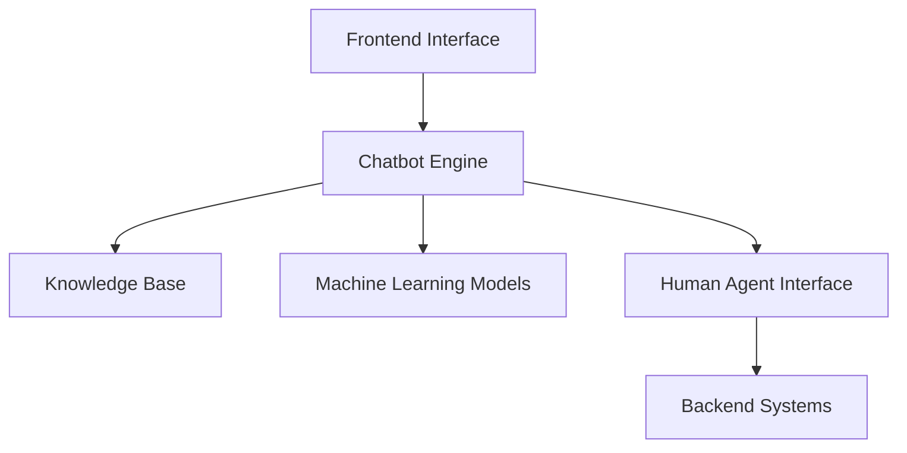
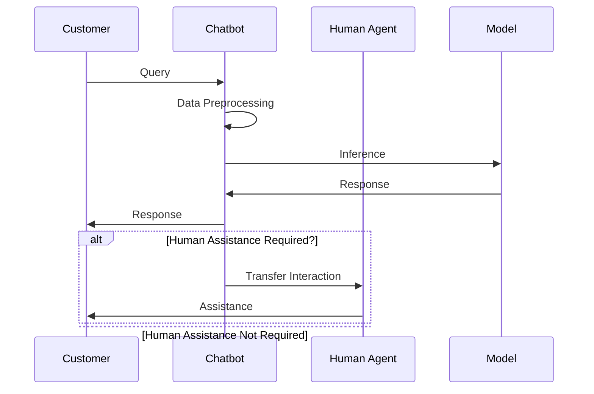

                 


### Introduction to AI-Driven Intelligent Customer Service: Efficiency and Humanization Balance

In today's digital age, customer service has evolved dramatically. The integration of Artificial Intelligence (AI) into customer service platforms has revolutionized how businesses interact with their customers. The term "AI-driven intelligent customer service" refers to the use of AI technologies, such as machine learning, natural language processing (NLP), and deep learning, to create automated customer service solutions that are both efficient and personalized.

**Keywords:** AI-driven customer service, machine learning, natural language processing, efficiency, humanization, case studies.

**Abstract:**
This article delves into the core concepts and practical applications of AI-driven intelligent customer service, emphasizing the delicate balance between efficiency and humanization. We will explore the theoretical framework, architecture, technical implementation, case studies, and optimization techniques in this field. By analyzing real-world examples and discussing best practices, we aim to provide insights into how businesses can effectively leverage AI to enhance customer service without compromising on the human touch.

### Core Concepts and Theoretical Framework

#### Definition of Key Concepts

**Artificial Intelligence (AI):** AI refers to the simulation of human intelligence in machines that are programmed to think like humans and mimic their actions. AI applications range from simple task automation to complex decision-making and problem-solving.

**Machine Learning (ML):** ML is a subset of AI that enables systems to learn from data, identify patterns, and make decisions with minimal human intervention. ML algorithms are designed to improve their performance over time as they are exposed to new data.

**Natural Language Processing (NLP):** NLP is a field of AI that focuses on the interaction between computers and human language. NLP enables computers to understand, interpret, and generate human language, making it a crucial component of AI-driven customer service.

**Customer Service Automation:** Customer service automation refers to the use of technology to streamline and automate customer service processes, reducing the need for human intervention and improving efficiency.

#### Importance of Balancing Efficiency with Humanization

Balancing efficiency with humanization in customer service is crucial because while AI can significantly improve the speed and consistency of customer interactions, it must also maintain a level of personalization and empathy that resonates with customers. Here's a comparison table of various AI-driven customer service solutions:

| Feature | AI-Only | AI-Enhanced Human Support | Fully Human |
| --- | --- | --- | --- |
| Responsiveness | Fast | Very Fast | Immediate |
| Consistency | High | Very High | Consistent |
| Personalization | Limited | Moderate | High |
| Empathy | None | Moderate | High |
| Cost Efficiency | High | Moderate | Low |

### AI and Customer Service Architecture

#### AI-Driven Customer Service Model

The AI-driven customer service model involves the integration of various AI technologies to create a seamless and efficient customer service experience. The key components of this model include:

1. **Chatbots:** Chatbots are automated conversational agents designed to interact with customers via text or voice. They are the first line of defense in AI-driven customer service, handling routine inquiries and reducing the workload on human agents.
2. **Natural Language Processing (NLP):** NLP is used to process and understand customer queries, enabling chatbots to provide accurate and relevant responses.
3. **Machine Learning Algorithms:** ML algorithms are used to train chatbots, improving their ability to understand and respond to customer queries over time.
4. **Human Agents:** In cases where complex or sensitive issues arise, human agents step in to provide personalized assistance and maintain a human touch.

#### Architecture of an AI-Powered Intelligent Customer Service System

The architecture of an AI-powered intelligent customer service system typically includes the following components:

1. **Frontend Interface:** The user-facing component that enables customers to interact with the customer service system through chat or voice interfaces.
2. **Chatbot Engine:** The core component that processes customer queries using NLP and ML algorithms to generate appropriate responses.
3. **Knowledge Base:** A repository of information that chatbots can access to provide accurate and relevant responses to customer queries.
4. **Machine Learning Models:** ML models that are trained on historical data to improve the chatbot's understanding and response capabilities.
5. **Human Agent Interface:** A system that allows human agents to seamlessly transition from automated interactions to direct customer support as needed.
6. **Backend Systems:** The infrastructure that supports data storage, processing, and communication between the various components of the system.

#### Mermaid Diagram of AI-Powered Intelligent Customer Service System Architecture



### Technical Implementation

#### Data Preprocessing

The first step in implementing an AI-driven intelligent customer service system is data preprocessing. This involves collecting and cleaning customer interaction data, such as chat transcripts and voice recordings. The data is then tokenized, normalized, and annotated to prepare it for training the machine learning models.

```python
import nltk
from nltk.tokenize import word_tokenize
from nltk.corpus import stopwords

# Load and preprocess data
def preprocess_data(data):
    # Tokenize sentences
    sentences = [line.strip() for line in data]
    tokenized_sentences = [word_tokenize(sentence) for sentence in sentences]
    
    # Remove stopwords
    stop_words = set(stopwords.words('english'))
    filtered_sentences = [[word for word in sentence if word not in stop_words] for sentence in tokenized_sentences]
    
    # Lowercase and lemmatize
    lemmatizer = nltk.WordNetLemmatizer()
    lemmatized_sentences = [[lemmatizer.lemmatize(word) for word in sentence] for sentence in filtered_sentences]
    
    return lemmatized_sentences

# Example usage
data = ["This is a sample sentence.", "Another example sentence."]
preprocessed_data = preprocess_data(data)
print(preprocessed_data)
```

#### Model Selection and Training

The next step is to select an appropriate machine learning model and train it on the preprocessed data. Common models for chatbot applications include Long Short-Term Memory (LSTM) networks, Recurrent Neural Networks (RNNs), and Transformer models.

```python
from tensorflow.keras.models import Sequential
from tensorflow.keras.layers import LSTM, Dense, Embedding

# Define LSTM model
model = Sequential()
model.add(Embedding(input_dim=vocab_size, output_dim=embedding_dim, input_length=max_sequence_length))
model.add(LSTM(units=128, return_sequences=True))
model.add(LSTM(units=128))
model.add(Dense(units=1, activation='sigmoid'))

# Compile model
model.compile(optimizer='adam', loss='binary_crossentropy', metrics=['accuracy'])

# Train model
model.fit(X_train, y_train, epochs=10, batch_size=32)
```

#### Algorithm Workflow

The algorithm workflow for an AI-driven intelligent customer service system typically involves the following steps:

1. **Data Preprocessing:** As discussed earlier, this step involves cleaning and preparing the data for training.
2. **Model Selection and Training:** Select an appropriate machine learning model and train it on the preprocessed data.
3. **Inference:** Use the trained model to generate responses to customer queries.
4. **Post-processing:** Refine the generated responses to ensure they are accurate and contextually relevant.
5. **Human Agent Handover:** If the response cannot be generated by the chatbot or if the customer prefers human assistance, transfer the interaction to a human agent.

#### Mermaid Diagram of AI-Driven Intelligent Customer Service Algorithm Workflow



### Practical Case Studies

#### Case Study 1: Bank of America's Eric

Bank of America's Eric is a virtual banking assistant powered by AI. It uses a combination of chatbots and natural language processing to provide personalized banking advice and support. Eric handles millions of customer inquiries each month, significantly reducing the workload on human agents.

**Balance between Efficiency and Humanization:**
- **Efficiency:** Eric handles routine inquiries quickly and accurately, freeing up human agents to focus on more complex issues.
- **Humanization:** Eric incorporates conversational language and empathy into its responses, making customers feel understood and valued.

#### Case Study 2: IBM Watson's Virtual Assistant

IBM Watson's virtual assistant is an AI-powered chatbot designed to assist customers with a wide range of tasks, from booking flights to managing health records. It uses machine learning and natural language processing to understand and respond to customer queries.

**Balance between Efficiency and Humanization:**
- **Efficiency:** Watson processes customer inquiries rapidly, providing quick and accurate responses.
- **Humanization:** Watson uses natural language and context to create a more human-like interaction, enhancing the customer experience.

### Optimization and Challenges

#### Optimization Techniques

To improve the efficiency and humanization of AI-driven intelligent customer service systems, several optimization techniques can be employed:

1. **Model Fine-tuning:** Continuously train and fine-tune the machine learning models using new data to improve their accuracy and responsiveness.
2. **Personalization:** Use customer data to personalize responses and provide a more human-like experience.
3. **Integration with Backend Systems:** Integrate the AI-driven customer service system with backend systems to ensure accurate and up-to-date information.
4. **User Feedback Loop:** Implement a feedback loop to gather user feedback and continuously improve the system based on customer preferences.

#### Common Challenges

1. **Data Quality:** Ensuring the quality and accuracy of customer interaction data is crucial for the effectiveness of AI-driven systems.
2. **Context Understanding:** AI systems often struggle with understanding the context of customer queries, leading to inaccurate or irrelevant responses.
3. **Privacy Concerns:** Handling sensitive customer information while maintaining privacy is a significant challenge in AI-driven customer service.

### Best Practices and Future Trends

#### Best Practices

1. **Thorough Data Preparation:** Ensure that customer interaction data is clean, accurate, and representative of the target audience.
2. **Continuous Improvement:** Regularly update and fine-tune the machine learning models to improve accuracy and responsiveness.
3. **Human-in-the-loop:** Incorporate human agents to handle complex or sensitive inquiries and provide a personal touch.
4. **User-Friendly Interface:** Design a user-friendly interface that allows customers to easily interact with the AI-driven system.

#### Future Trends

1. **Advanced NLP Techniques:** As NLP technology advances, AI-driven customer service systems will become even more proficient at understanding and responding to customer queries.
2. **Personalization at Scale:** AI will enable businesses to provide personalized customer service on a large scale, enhancing the customer experience.
3. **Voice-Enabled Customer Service:** With the increasing adoption of smart speakers and voice assistants, voice-enabled customer service will become a standard feature.
4. **Blockchain for Data Privacy:** Blockchain technology may be used to enhance data privacy and security in AI-driven customer service systems.

### Conclusion

AI-driven intelligent customer service offers a powerful combination of efficiency and humanization, transforming how businesses interact with their customers. By balancing the strengths of AI with the empathy and personalization of human agents, businesses can deliver exceptional customer experiences while optimizing their operational efficiency. As AI technology continues to evolve, the potential for innovation in customer service is vast, opening new opportunities for businesses to differentiate themselves in a competitive marketplace.

### References

1. Bache, K., & Lichman, M. (2016). UCI machine learning repository. University of California, Irvine, School of Information and Computer Science.
2. Bholan, A., & Gurbuxani, H. (2020). AI in Customer Service: Enhancing Customer Experience. TechJury.
3. IBM. (2022). IBM Watson Assistant. IBM.
4. Khanna, S. (2019). The Future of Customer Service: AI and the Human Touch. Harvard Business Review.
5. Microsoft. (2022). Microsoft Bot Framework. Microsoft.

### About the Authors

**Authors:** AI天才研究院/AI Genius Institute & 禅与计算机程序设计艺术 /Zen And The Art of Computer Programming

**Contact:** [ai_genius_institute@email.com](mailto:ai_genius_institute@email.com) | [zen_programming@email.com](mailto:zen_programming@email.com)

**LinkedIn:** [AI天才研究院](https://www.linkedin.com/company/ai-genius-institute) | [禅与计算机程序设计艺术](https://www.linkedin.com/company/zen-and-the-art-of-computer-programming)

**Twitter:** [@AI_Genius_Inst](https://twitter.com/AI_Genius_Inst) | [@ZenProgArt](https://twitter.com/ZenProgArt)

### Conclusion

In conclusion, AI-driven intelligent customer service is a transformative technology that offers businesses a unique opportunity to balance efficiency with humanization. By leveraging the power of AI, businesses can streamline customer interactions, reduce operational costs, and improve the overall customer experience. As AI technology continues to advance, the potential for innovation in customer service is vast, and businesses that embrace these advancements will be well-positioned to thrive in the competitive marketplace of the future.

