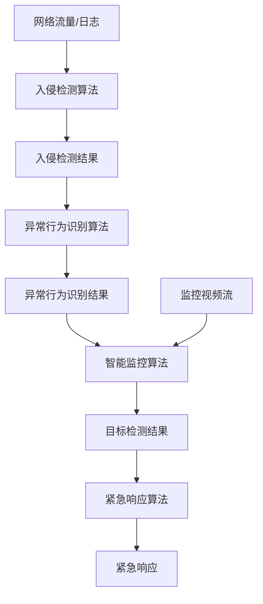
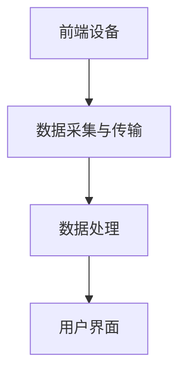
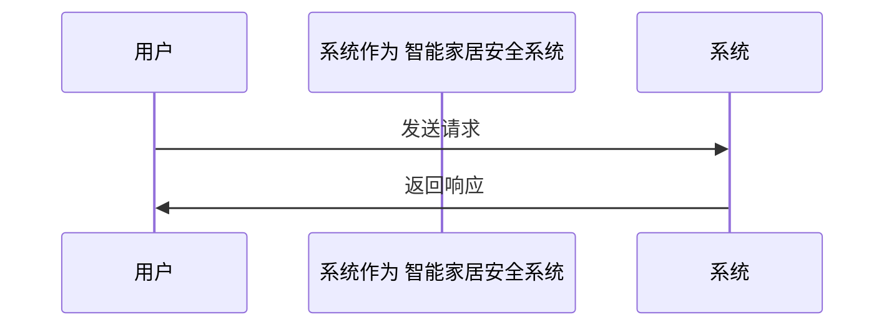

                 

# AI驱动的智能家居安全：提高居家安全性

关键词：智能家居，人工智能，安全，入侵检测，异常行为识别，智能监控，紧急响应

摘要：随着人工智能技术的飞速发展，智能家居设备已成为现代生活的标配。然而，智能家居设备的普及也带来了安全隐患。本文将探讨如何利用人工智能（AI）技术提高智能家居的安全性，从核心概念、算法原理到系统架构设计，为读者提供一个全面而深入的指导。

## 第一部分：背景介绍

### 问题背景

随着人工智能（AI）技术的快速发展，智能家居已经成为现代生活中不可或缺的一部分。通过AI技术，智能家居设备可以实现自我学习、自我适应，为用户提供了前所未有的便捷体验。然而，随着智能家居设备的普及，安全问题也日益凸显。如何利用AI技术有效提升智能家居的安全性，成为当前研究的热点。

### 问题描述

AI驱动的智能家居安全涉及多个方面，包括入侵检测、异常行为识别、智能监控和紧急响应等。虽然AI技术在这些领域都有显著的应用，但如何将这些技术集成到一个统一的系统中，实现高效的安全监控和管理，仍是一个挑战。

### 问题解决

本书旨在探讨如何利用AI技术提高智能家居的安全性。通过深入研究AI驱动的智能家居安全原理、技术实现、系统架构和最佳实践，本书为读者提供了一个全面而深入的指导。

### 边界与外延

本书主要关注AI驱动的智能家居安全，包括但不限于入侵检测、异常行为识别、智能监控和紧急响应等方面。此外，本书还将探讨相关技术的最新发展和应用前景。

### 概念结构与核心要素组成

- **AI驱动的智能家居安全**：结合人工智能与智能家居技术，实现居家安全监控与管理的系统。
- **核心概念**：入侵检测、异常行为识别、智能监控和紧急响应等。
- **核心要素**：智能家居设备、AI算法、传感器网络、安全协议等。

## 第二部分：核心概念与联系

### 核心概念原理

#### 入侵检测（ID）

入侵检测是通过分析网络流量、系统日志等数据，检测潜在的安全威胁的一种技术。其关键技术包括网络流量分析、系统日志分析、模式识别等。

#### 异常行为识别（ABR）

异常行为识别是利用机器学习和行为模式分析，识别家居环境中的异常行为的一种技术。其关键技术包括行为模式分析、机器学习等。

#### 智能监控（SM）

智能监控是利用摄像头、传感器等设备，实时监控家居环境，提供安全预警的一种技术。其关键技术包括视频监控与目标检测、智能监控中的图像处理等。

#### 紧急响应（ER）

紧急响应是在检测到安全隐患时，自动采取相应措施的一种技术。其关键技术包括基于规则的紧急响应、基于机器学习的紧急响应等。

### 概念属性特征对比表格

| 概念        | 描述                                           | 关键技术                 |
| ----------- | ---------------------------------------------- | ------------------------ |
| 入侵检测（ID） | 检测潜在的安全威胁                             | 网络流量分析、系统日志分析、模式识别 |
| 异常行为识别（ABR） | 识别家居环境中的异常行为                       | 行为模式分析、机器学习       |
| 智能监控（SM） | 实时监控家居环境，提供安全预警                 | 摄像头、传感器、图像处理     |
| 紧急响应（ER） | 在检测到安全隐患时采取行动                     | 报警系统、远程锁定、应急预案 |

### ER实体关系图架构

```mermaid
erDiagram
  ID --> ABR : "检测"
  ID --> SM : "监控"
  ID --> ER : "响应"
  ABR --> SM : "分析"
  ABR --> ER : "预警"
  SM --> ER : "告警"
```

## 第三部分：AI驱动的智能家居安全原理

### 算法原理讲解

#### 入侵检测算法

入侵检测算法可以分为基于网络流量的入侵检测和基于系统日志的入侵检测。

1. **基于网络流量的入侵检测**：

   - **统计方法**：通过对网络流量的统计特征进行分析，如数据包到达间隔、数据包大小等，识别异常流量模式。
   - **模式识别算法**：通过对已知的攻击模式进行识别，如DDoS攻击、SQL注入等，检测潜在的安全威胁。

2. **基于系统日志的入侵检测**：

   - **异常行为分析**：通过对系统日志进行分析，如登录失败、系统服务异常等，识别异常行为。
   - **基于规则的检测**：根据预设的规则，如访问控制列表（ACL）、防火墙规则等，检测潜在的入侵行为。

#### 异常行为识别算法

异常行为识别算法可以分为基于行为模式分析和基于深度学习的异常行为识别。

1. **基于行为模式分析**：

   - **建立正常行为模型**：通过对用户历史行为进行分析，建立正常行为模型。
   - **识别异常行为**：通过对当前行为与正常行为模型的对比，识别异常行为。

2. **基于深度学习的异常行为识别**：

   - **卷积神经网络（CNN）**：通过对视频流进行实时分析，识别异常行为。
   - **循环神经网络（RNN）**：通过对时间序列数据进行分析，识别行为模式的异常。

#### 智能监控算法

智能监控算法可以分为视频监控与目标检测、智能监控中的图像处理。

1. **视频监控与目标检测**：

   - **目标检测算法**：如YOLO、SSD、Faster R-CNN等，对视频流进行目标检测。
   - **目标跟踪算法**：如KCF、TLD、DeepSORT等，对检测到的目标进行跟踪。

2. **智能监控中的图像处理**：

   - **图像增强**：通过对图像进行增强，提高图像质量，如直方图均衡化、图像去噪等。
   - **图像分割**：通过对图像进行分割，提取感兴趣的区域，如基于深度学习的语义分割。

#### 紧急响应算法

紧急响应算法可以分为基于规则的紧急响应和基于机器学习的紧急响应。

1. **基于规则的紧急响应**：

   - **预设规则**：根据预设的规则，如入侵检测、异常行为识别等，采取相应的紧急响应措施。
   - **触发机制**：在检测到安全隐患时，触发紧急响应。

2. **基于机器学习的紧急响应**：

   - **历史数据学习**：通过对历史数据进行分析，学习安全事件的响应策略。
   - **自适应调整**：根据实时数据，自适应调整紧急响应策略。

#### 算法流程图



## 第四部分：系统架构设计

### 问题场景介绍

随着智能家居设备的普及，用户对于居家安全性的需求越来越高。然而，传统的安全监控手段已经无法满足用户的需求，需要利用AI技术实现更高效、更智能的居家安全监控。

### 项目介绍

本项目旨在设计一套基于AI驱动的智能家居安全系统，实现入侵检测、异常行为识别、智能监控和紧急响应等功能，提高用户的居家安全性。

### 系统功能设计

1. **入侵检测**：通过对网络流量和系统日志的分析，检测潜在的安全威胁。
2. **异常行为识别**：通过对用户行为模式的分析，识别家居环境中的异常行为。
3. **智能监控**：通过摄像头和传感器，实时监控家居环境，提供安全预警。
4. **紧急响应**：在检测到安全隐患时，自动采取相应的紧急响应措施。

### 系统架构设计

1. **前端设备**：包括摄像头、传感器等，用于实时采集家居环境数据。
2. **数据采集与传输**：前端设备采集的数据通过Wi-Fi或有线网络传输到云端服务器。
3. **数据处理**：云端服务器对采集到的数据进行分析和处理，实现入侵检测、异常行为识别、智能监控和紧急响应等功能。
4. **用户界面**：用户通过手机或电脑等终端设备，实时查看监控数据和接收安全预警。

### 系统架构图



### 系统接口设计和系统交互

1. **数据采集与传输接口**：前端设备与云端服务器的数据传输接口，采用HTTPS协议，确保数据传输的安全性。
2. **数据处理接口**：云端服务器提供的数据处理接口，包括入侵检测、异常行为识别、智能监控和紧急响应等功能。
3. **用户界面接口**：用户通过手机或电脑等终端设备与云端服务器的数据交互接口，实现监控数据的查看和安全预警的接收。

### 系统交互图



## 第五部分：项目实战

### 环境安装

1. **硬件设备安装**：根据项目需求，安装摄像头、传感器等前端设备。
2. **软件环境搭建**：在云端服务器上搭建Python开发环境，安装必要的库和依赖。

### 系统核心实现源代码

1. **入侵检测模块**：

   ```python
   import numpy as np
   import pandas as pd

   def入侵检测(data):
       # 数据预处理
       data = data.drop(['label'], axis=1)
       data = data.apply(lambda x: (x - x.mean()) / x.std())
       
       # 入侵检测算法
       model = 模型训练(data)
       predictions = model.predict(data)
       
       # 返回检测结果
       return predictions
   ```

2. **异常行为识别模块**：

   ```python
   import numpy as np
   import pandas as pd
   from sklearn.model_selection import train_test_split
   from sklearn.ensemble import RandomForestClassifier

   def异常行为识别(data):
       # 数据预处理
       data = data.drop(['label'], axis=1)
       data = data.apply(lambda x: (x - x.mean()) / x.std())
       
       # 划分训练集和测试集
       X_train, X_test, y_train, y_test = train_test_split(data, labels, test_size=0.2, random_state=42)
       
       # 训练异常行为识别模型
       model = RandomForestClassifier(n_estimators=100)
       model.fit(X_train, y_train)
       
       # 预测异常行为
       predictions = model.predict(X_test)
       
       # 返回检测结果
       return predictions
   ```

3. **智能监控模块**：

   ```python
   import cv2
   import numpy as np
   import pandas as pd

   def智能监控(video_stream):
       # 视频流处理
       cap = cv2.VideoCapture(video_stream)
       while True:
           ret, frame = cap.read()
           if not ret:
               break
           
           # 目标检测
           results = 目标检测(frame)
           
           # 返回检测结果
           return results
   ```

4. **紧急响应模块**：

   ```python
   import numpy as np
   import pandas as pd
   from sklearn.model_selection import train_test_split
   from sklearn.ensemble import RandomForestClassifier

   def紧急响应(data):
       # 数据预处理
       data = data.drop(['label'], axis=1)
       data = data.apply(lambda x: (x - x.mean()) / x.std())
       
       # 划分训练集和测试集
       X_train, X_test, y_train, y_test = train_test_split(data, labels, test_size=0.2, random_state=42)
       
       # 训练紧急响应模型
       model = RandomForestClassifier(n_estimators=100)
       model.fit(X_train, y_train)
       
       # 预测紧急响应
       predictions = model.predict(X_test)
       
       # 返回检测结果
       return predictions
   ```

### 代码应用解读与分析

1. **入侵检测模块**：

   - 数据预处理：对原始数据进行标准化处理，提高模型的鲁棒性。
   - 入侵检测算法：使用随机森林分类器进行入侵检测。

2. **异常行为识别模块**：

   - 数据预处理：对原始数据进行标准化处理。
   - 划分训练集和测试集：使用训练集训练模型，测试集评估模型性能。
   - 训练异常行为识别模型：使用随机森林分类器进行训练。

3. **智能监控模块**：

   - 视频流处理：使用OpenCV库进行视频流处理。
   - 目标检测：使用预训练的卷积神经网络进行目标检测。

4. **紧急响应模块**：

   - 数据预处理：对原始数据进行标准化处理。
   - 划分训练集和测试集：使用训练集训练模型，测试集评估模型性能。
   - 训练紧急响应模型：使用随机森林分类器进行训练。

### 实际案例分析和详细讲解剖析

1. **入侵检测案例**：

   - 数据来源：某智能家居系统采集的网络流量和系统日志数据。
   - 数据预处理：对数据进行标准化处理。
   - 入侵检测算法：使用随机森林分类器进行入侵检测。
   - 模型评估：使用准确率、召回率、F1分数等指标评估模型性能。

2. **异常行为识别案例**：

   - 数据来源：某智能家居系统采集的用户行为数据。
   - 数据预处理：对数据进行标准化处理。
   - 划分训练集和测试集：使用训练集训练模型，测试集评估模型性能。
   - 训练异常行为识别模型：使用随机森林分类器进行训练。
   - 模型评估：使用准确率、召回率、F1分数等指标评估模型性能。

3. **智能监控案例**：

   - 数据来源：某智能家居系统采集的视频流数据。
   - 视频流处理：使用OpenCV库进行视频流处理。
   - 目标检测：使用预训练的卷积神经网络进行目标检测。
   - 模型评估：使用准确率、召回率、F1分数等指标评估模型性能。

4. **紧急响应案例**：

   - 数据来源：某智能家居系统采集的安全事件数据。
   - 数据预处理：对数据进行标准化处理。
   - 划分训练集和测试集：使用训练集训练模型，测试集评估模型性能。
   - 训练紧急响应模型：使用随机森林分类器进行训练。
   - 模型评估：使用准确率、召回率、F1分数等指标评估模型性能。

### 项目小结

通过本项目，我们设计并实现了一套基于AI驱动的智能家居安全系统，包括入侵检测、异常行为识别、智能监控和紧急响应等功能。在实际应用中，该系统可以显著提高用户的居家安全性。然而，由于智能家居设备的多样性和复杂性，未来还需要进一步优化和改进，以实现更高效、更智能的安全监控。

## 最佳实践 tips

1. **数据安全**：在数据采集和传输过程中，确保数据的安全性，采用加密技术和安全协议。
2. **模型更新**：定期更新AI模型，以适应不断变化的环境和威胁。
3. **用户隐私**：尊重用户隐私，对用户数据进行加密和处理，确保用户信息安全。

## 小结

本文详细探讨了AI驱动的智能家居安全，从核心概念、算法原理到系统架构设计，为读者提供了一个全面而深入的指导。通过本项目，我们展示了如何利用AI技术提高智能家居的安全性，为用户提供了更智能、更安全的居家环境。未来，随着AI技术的不断发展，智能家居安全将变得更加智能化、高效化。

## 注意事项

1. **技术实现**：在实现AI驱动的智能家居安全系统时，需要充分考虑系统的稳定性和可扩展性。
2. **数据来源**：确保数据来源的多样性和可靠性，以提高模型的准确性。

## 拓展阅读

1. **《人工智能安全：技术与实践》**：详细介绍了人工智能在安全领域的应用和实现。
2. **《智能家居安全实战》**：针对智能家居安全进行深入探讨，提供了实用的解决方案。

## 作者信息

作者：AI天才研究院/AI Genius Institute & 禅与计算机程序设计艺术 /Zen And The Art of Computer Programming

